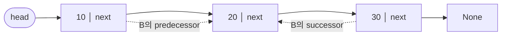
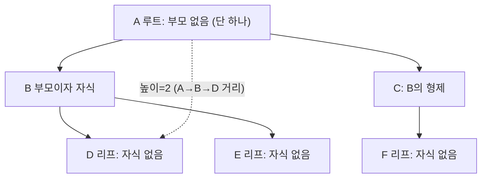
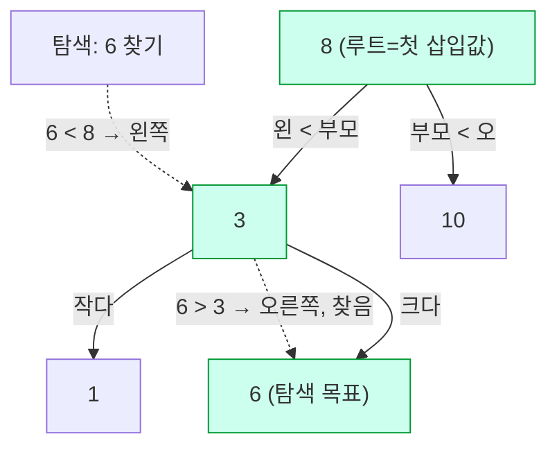
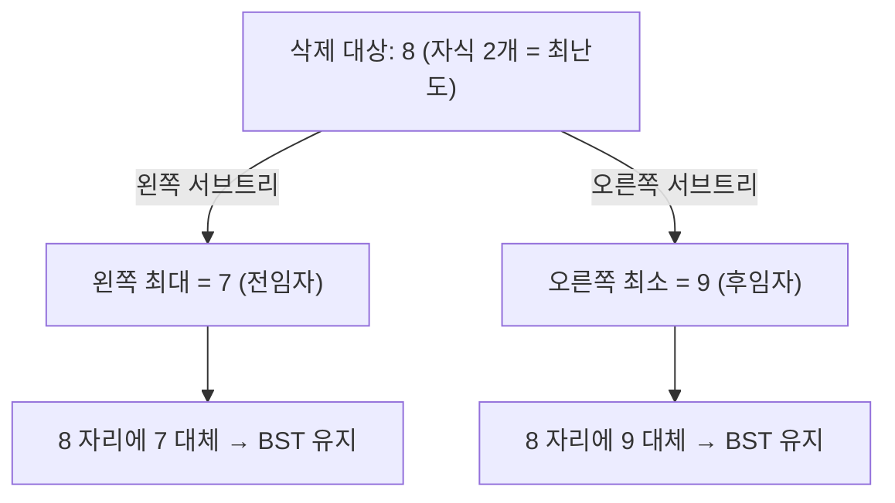
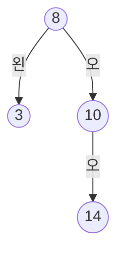
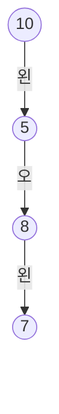

# 자료구조·알고리즘 완전 학습노트 (NotebookLM 영상 제작용)

> 이 문서 하나로 **개념 → 문제 → 왜 이게 답인지**를 한 흐름으로 학습합니다.
> 정렬·문자열 검색·리스트·트리 4개 단원, 총 **160문제**의 풀이와 시각화를 담았습니다.

## NotebookLM에서 영상 만드는 법
1. NotebookLM에 새 노트북을 만들고 **이 .md 파일을 소스로 업로드**하세요. (단원이 많으면 `notebooklm/` 폴더의 챕터별 파일을 각각 소스로 올려도 됩니다.)
2. **Video Overview / 동영상 개요**를 생성하면, 아래 구조(개념→문제→정답 근거)를 따라 내레이션 영상이 만들어집니다.
3. 특정 단원만 영상으로 만들려면 해당 챕터 파일만 소스로 선택하세요.

## 이 노트 읽는 법 (시각화 범례)
- **실행 추적표**: 코드가 한 줄씩 돌 때 `배열 상태`가 어떻게 바뀌는지 단계별로 보여줍니다. (정렬 코드 문제)
- **mermaid 트리 그림**: 이진트리 구조를 도식화합니다. (`왼`=왼쪽 자식, `오`=오른쪽 자식)
- **보기 분석 표**: 각 선지가 정답/오답인 이유를 한 줄로 정리합니다.
- **🖍️ 빠른 풀이전략**: 형광펜으로 볼 곳 → 떠올릴 개념 → 적용 → 암기. 시험장에서 바로 쓰는 순서입니다.

---

# Ch06 정렬 알고리즘

*정렬의 평가 기준과 8가지 대표 알고리즘*

## 🎬 영상 도입 설명

정렬은 데이터를 정해진 키 기준에 따라 순서대로 다시 배치하는 연산입니다. 마치 책장에 꽂힌 책을 제목 순서로 다시 꽂거나, 도서관에서 책을 빠르게 찾기 위해 미리 줄을 세워 두는 것과 같죠. 이 단원에서는 모든 정렬을 시간복잡도, 안정성, 그리고 제자리 여부라는 세 가지 축으로 평가하고 선택하는 안목을 기릅니다. 특히 원소끼리 대소를 비교하는 비교 기반 정렬은 평균적으로 n log n이라는 이론적 하한을 벗어날 수 없으며, 이 벽을 깨려면 값의 분포를 직접 이용하는 도수 정렬 같은 비비교 정렬이 필요하다는 점도 함께 살펴봅니다. 단순 정렬인 버블·선택·삽입 정렬에서 출발해 쉘 정렬, 분할정복을 쓰는 퀵 정렬과 병합 정렬, 그리고 힙 정렬과 도수 정렬까지, 여덟 가지 대표 알고리즘의 동작 원리와 비교·교환·이동 비용을 하나씩 짚어 보겠습니다. 같은 정렬이라도 어떤 상황에 어떤 알고리즘이 어울리는지, 그 판단의 기준을 함께 세워 나가 봅시다.

## 개념 빠르게

정렬(sorting)은 데이터를 정해진 키 기준에 따라 순서대로 재배치하는 연산이다. 모든 정렬은 시간복잡도(최선·평균·최악), 안정성(stable), 제자리(in-place) 라는 세 축으로 평가·선택한다. 원소끼리 대소를 비교하는 비교 기반 정렬은 평균적으로 Ω(n log n)이라는 이론적 하한을 벗어날 수 없고, 이를 깨려면 값의 분포를 직접 이용하는 비비교 정렬(도수 정렬)을 써야 한다. 이 장에서는 단순 정렬 3종(버블·선택·삽입), 쉘 정렬, 분할정복 2종(퀵·병합), 힙 정렬, 도수 정렬의 동작 원리와 비교·교환·이동 비용, 안정성/제자리 여부를 정확히 구분한다.

### 1. 정렬을 평가하는 3가지 축

같은 결과(오름차순/내림차순)를 내는 정렬이 8가지나 존재하는 이유는, 상황마다 **유리한 알고리즘이 다르기** 때문이다. 어떤 정렬을 쓸지는 항상 다음 세 축으로 따진다. 시험은 이 세 축을 알고리즘별로 정확히 외우고 있는지를 묻는다.


#### 1-1. 시간복잡도 (최선 · 평균 · 최악)

입력 크기 `n`이 커질 때 연산량(주로 **비교**와 **이동/교환** 횟수)이 어떻게 증가하는지를 점근 표기 O로 나타낸다. 중요한 것은 같은 알고리즘이라도 입력 상태에 따라 성능이 달라질 수 있어 **최선(best) · 평균(average) · 최악(worst)**을 구분해야 한다는 점이다.

- **최선** — 입력이 알고리즘에 가장 유리할 때. 예: 삽입 정렬은 이미 정렬된 입력에서 `O(n)`.
- **최악** — 가장 불리할 때. 예: 퀵 정렬은 분할이 한쪽으로 치우치면 `O(n²)`.
- **평균** — 무작위 입력에 대한 기댓값. 실무 성능의 기준이 되는 값.

> **주의** **흔한 함정:** "퀵 정렬은 빠르니까 항상 O(n log n)"은 **틀린 말**이다. 평균은 O(n log n)이지만 최악은 O(n²)이다. 반대로 "병합·힙 정렬은 입력과 무관하게 항상 O(n log n)"은 맞다. 문제에서 **"항상"**이라는 단어가 나오면 최악까지 O(n log n)인 정렬(병합·힙)을 떠올려라.


#### 1-2. 안정성 (stable)

**키가 같은 원소들의 원래 상대 순서가 정렬 후에도 보존**되면 그 정렬은 **안정(stable)**하다. 예를 들어 입력이 `(2,A) (2,C)` 순서였다면, 키 2끼리는 정렬 후에도 A가 C보다 앞에 있어야 안정 정렬이다. 단일 숫자만 정렬할 때는 안정성이 보이지 않지만, **(키, 부가데이터)** 쌍을 정렬하거나 **여러 기준으로 다단계 정렬**(예: 먼저 이름순, 그다음 점수순)할 때 결정적으로 중요하다.

| 구분 | 안정 정렬 | 불안정 정렬 |
| --- | --- | --- |
| 해당 알고리즘 | 버블, 삽입, 병합, 도수 | 선택, 쉘, 퀵, 힙 |
| 특징 | 같은 키의 입력 순서를 보존 | 먼 거리 교환이 같은 키의 순서를 뒤섞을 수 있음 |

> **주의** **불안정의 원인은 "멀리 떨어진 원소를 건너뛰며 교환"하기 때문**이다. 선택 정렬은 최솟값을 먼 위치에서 끌어오며 교환하다가 같은 키의 순서를 깨고, 퀵·힙·쉘도 큰 보폭의 교환으로 같은 키를 뒤집을 수 있다. 반면 버블·삽입은 인접 원소만, 그것도 **"더 클 때만"** 교환하므로 같은 키를 넘지 않아 안정적이다.


#### 1-3. 제자리 (in-place)

입력 배열 외에 **거의 추가 메모리를 쓰지 않으면**(보통 `O(1)`, 재귀 스택까지 포함해 `O(log n)` 정도면 통상 제자리로 본다) **제자리(in-place)** 정렬이다. 반대로 입력 크기에 비례하는 보조 배열 `O(n)`이 필요하면 제자리가 아니다.

- **제자리 O:** 버블, 선택, 삽입, 쉘, 퀵, 힙 — 배열 안에서 교환만 한다.
- **제자리 X:** 병합 정렬(병합용 보조 배열 O(n)), 도수 정렬(count 배열 O(k) + 출력 배열 O(n)).

> **주의** **혼동 주의:** 퀵 정렬은 분할정복이라 "재귀=메모리 많이 쓴다"고 오해하기 쉽지만, 표준 구현은 **배열 안에서 직접 분할(in-place partition)**하므로 제자리 정렬로 분류한다(재귀 스택 O(log n)). 병합 정렬이 제자리가 아닌 진짜 이유는 재귀가 아니라 **병합 단계의 보조 배열** 때문이다.


### 2. 비교 정렬의 하한 Ω(n log n)

원소끼리 **대소 비교**만으로 순서를 정하는 모든 정렬을 **비교 기반 정렬**이라 한다. 비교 한 번은 "예/아니오" 두 갈래로 갈리므로, 정렬 과정을 **결정 트리(decision tree)**로 그릴 수 있다. n개 원소의 가능한 순열은 `n!`가지이고, 트리의 잎(leaf)은 이 n!개의 결과를 모두 담아야 한다.

잎이 `n!`개인 이진 트리의 높이는 최소 `log₂(n!)`이고, 스털링 근사에 의해 `log₂(n!) = Θ(n log n)`이다. 트리의 높이는 곧 **최악의 비교 횟수**이므로, 어떤 비교 정렬도 최악의 경우 `Ω(n log n)`번의 비교가 필요하다. 즉 **비교만으로는 평균적으로 이보다 빠를 수 없다.**

> **TIP** 이 하한은 **비교 정렬**에만 적용된다. 도수 정렬처럼 비교 대신 **값 자체를 인덱스로 사용**하는 비비교 정렬은 이 하한의 적용 대상이 아니므로 `O(n+k)`로 n log n을 깰 수 있다.


### 3. 8가지 대표 정렬 한눈에 보기

| 알고리즘 | 최선 | 평균 | 최악 | 안정성 | 제자리 | 핵심 아이디어 |
| --- | --- | --- | --- | --- | --- | --- |
| 버블 정렬 | O(n)* | O(n²) | O(n²) | 안정 | O | 인접한 두 원소를 비교·교환해 큰 값을 뒤로 |
| 선택 정렬 | O(n²) | O(n²) | O(n²) | 불안정 | O | 남은 구간의 최솟값을 골라 앞에 배치 |
| 삽입 정렬 | O(n) | O(n²) | O(n²) | 안정 | O | 앞쪽 정렬 구간에 새 원소를 끼워 넣기 |
| 쉘 정렬 | O(n log n)~ | O(n^1.3~1.5) | O(n²) | 불안정 | O | gap 간격 삽입 정렬을 점점 좁혀가며 반복 |
| 퀵 정렬 | O(n log n) | O(n log n) | O(n²) | 불안정 | O | pivot 기준 분할 후 양쪽 재귀(분할정복) |
| 병합 정렬 | O(n log n) | O(n log n) | O(n log n) | 안정 | X | 반으로 나눠 정렬 후 병합(보조 배열) |
| 힙 정렬 | O(n log n) | O(n log n) | O(n log n) | 불안정 | O | 최대 힙에서 루트(최댓값)를 반복해 빼냄 |
| 도수 정렬 | O(n+k) | O(n+k) | O(n+k) | 안정 | X | 값별 개수를 세고 누적합으로 위치 결정(비비교) |

* 버블 정렬의 `O(n)` 최선은 **조기 종료(swapped 플래그) 최적화를 넣었을 때**, 이미 정렬된 입력에 한해 성립한다. 최적화가 없으면 입력과 무관하게 항상 `O(n²)`이다. 아래 인터랙티브 표에서 8종을 직접 비교해 보라.

> 🔗 인터랙티브 시각화(웹): **ComplexityChart** — 직접 값을 넣어 단계 실행할 수 있는 도구.

복잡도 표가 추상적으로 느껴진다면, 아래 **레이스 시뮬레이션**에서 여러 정렬을 같은 배열로 동시에 돌려 어느 알고리즘이 더 적은 단계로 먼저 끝나는지 직접 눈으로 확인해 보라.

> 🔗 인터랙티브 시각화(웹): **SortRace** — 직접 값을 넣어 단계 실행할 수 있는 도구.


### 4. 단순 정렬 — 버블 · 선택 · 삽입 (O(n²))

세 알고리즘 모두 평균·최악 `O(n²)`이지만, **비교 횟수 · 교환(이동) 횟수 · 안정성 · 입력 민감도**가 서로 다르다. 시험은 이 미세한 차이를 집요하게 묻는다.


#### 4-1. 버블 정렬 (Bubble Sort)

**정의·원리:** 배열을 왼쪽부터 훑으며 **인접한 두 원소** `arr[j]`, `arr[j+1]`를 비교해 앞이 더 크면 교환한다. 한 번의 바깥 회전(pass)이 끝나면 가장 큰 값이 거품처럼 맨 뒤로 떠오른다. `i`회전이 끝나면 뒤쪽 `i`개는 이미 제자리이므로 안쪽 루프 범위를 `len-1-i`로 줄인다.

**비용:** 비교 횟수는 입력과 무관하게 `(n-1)+(n-2)+…+1 = n(n-1)/2`로 일정하다(최적화 없을 때). 예를 들어 `n=4`면 `3+2+1 = 6`번 비교한다. 교환 횟수는 입력에 따라 0회(정렬 완료)부터 `n(n-1)/2`회(역순)까지 변한다.

**조기 종료 최적화:** 한 회전 동안 교환이 한 번도 없었다면(`swapped == False`) 이미 정렬이 끝난 것이므로 즉시 `break`한다. 이 최적화가 있으면 **이미 정렬된 입력**은 첫 회전 `n-1`번 비교만 하고 멈춰 최선 `O(n)`이 된다.

> **주의** **추적 함정:** 바깥 루프 횟수가 제한된 코드(예: `for i in range(2)`)는 정렬을 **끝까지 하지 않는다.** "최종 정렬 결과"가 아니라 "2회전까지만 진행한 중간 상태"를 묻는 것이니, 회전을 회차별로 손으로 추적하라. 버블은 인접 비교만 하므로 **같은 키를 추월하지 않아 안정 정렬**이다.


#### 4-2. 선택 정렬 (Selection Sort)

**정의·원리:** 매 회차 **남은 구간 전체를 훑어 최솟값의 위치(min_idx)를 찾고**, 그 값을 현재 회차의 맨 앞(`i`)과 한 번 교환한다. 핵심 교환문은 `arr[i], arr[min_idx] = arr[min_idx], arr[i]` 이다(두 빈칸 모두 `min_idx`).

**비용:** 최솟값을 찾으려면 매번 구간 전체를 비교해야 하므로 **비교 횟수가 입력 상태와 무관하게 항상 **`n(n-1)/2`로 고정된다. 예: `n=5`면 `4+3+2+1 = 10`번. 반면 **교환은 회차당 정확히 1번**(최대 `n-1`회)뿐이라, 데이터 이동 비용이 매우 작은 것이 장점이다.

> **주의** **대표 오개념:** "선택 정렬은 입력 상태에 따라 빨라진다"는 **틀렸다.** 거의 정렬돼 있어도 최솟값을 확인하려고 매번 구간 전체를 비교하므로 비교 횟수가 줄지 않는다. 또한 먼 위치의 값을 끌어와 교환하므로 **같은 키의 순서가 깨질 수 있어 불안정 정렬**이다(이 점이 삽입 정렬과의 핵심 차이).


#### 4-3. 삽입 정렬 (Insertion Sort)

**정의·원리:** 앞쪽 `[0..i-1]`이 **이미 정렬되어 있다고 보고**, 새 원소 `key = arr[i]`를 정렬된 구간의 알맞은 자리에 끼워 넣는다. `key`보다 큰 값들을 **한 칸씩 오른쪽으로 밀고**(이동), 빈자리에 `key`를 놓는다. while 종료 후 `j`는 key 이하 값의 위치이므로 **key는 `arr[j+1]`에 들어간다**(빈칸 추론 단골).

**비용:** 비교·이동 횟수가 입력 상태에 민감하다. **이미 정렬된 입력**이면 각 key가 바로 제자리라 비교 1번·이동 0번으로 끝나 최선 `O(n)`. **역순 입력**이면 매 key가 맨 앞까지 밀려 `1+2+…+(n-1) = n(n-1)/2`번 이동해 최악 `O(n²)`. 그래서 **거의 정렬된 데이터에서 가장 효율적**이다.

> **TIP** 삽입 정렬은 **안정 정렬**이다. 비교 조건이 `arr[j] > key`(**같으면 멈춤**)이라, 같은 키를 추월하지 않고 입력 순서를 보존하기 때문이다. 선택 정렬과 비교하면 — **선택**은 비교 일정·이동 적음·불안정, **삽입**은 비교/이동이 입력에 민감·안정 — 으로 대비된다.

| 항목 | 버블 | 선택 | 삽입 |
| --- | --- | --- | --- |
| 비교 횟수(최악) | n(n-1)/2 | n(n-1)/2 (항상) | n(n-1)/2 |
| 최선 시간복잡도 | O(n) (조기 종료 시) | O(n²) | O(n) |
| 교환/이동 특징 | 교환 많음(역순 시) | 교환 회차당 1번 | 이동 많음(역순 시) |
| 입력 상태 민감도 | 민감(조기 종료) | 둔감(항상 동일) | 매우 민감 |
| 안정성 | 안정 | 불안정 | 안정 |
| 유리한 상황 | 교육용·소규모 | 교환 비용이 클 때 | 거의 정렬된 데이터 |

> **TIP** 아래 **SortVisualizer**에서 배열을 직접 입력하고 알고리즘을 골라 **단계 실행**해 보라. 비교(노랑) · 교환(빨강) · 정렬 완료(초록) 색으로 위 세 정렬의 비교/이동 차이를 눈으로 확인할 수 있다.

> 🔗 인터랙티브 시각화(웹): **SortVisualizer** — 직접 값을 넣어 단계 실행할 수 있는 도구.


### 5. 쉘 정렬 (Shell Sort)

**동기:** 삽입 정렬은 인접 한 칸씩만 이동하므로, 멀리 떨어진 작은 값이 제자리로 가려면 수많은 이동이 필요하다. **쉘 정렬**은 이 한계를 `gap` 간격으로 떨어진 원소들끼리 먼저 정렬해 해결한다.

**원리:** 큰 `gap`으로 시작해 `gap`만큼 떨어진 원소들로 이루어진 부분 수열들을 각각 삽입 정렬한다(예: gap=3이면 인덱스 (0,3), (1,4), (2,5)끼리 비교). 그다음 `gap`을 점점 줄여 (예: 3 → 1) 반복하고, **마지막 gap=1은 일반 삽입 정렬**로 마무리한다. 큰 보폭으로 미리 대강 정렬해 두므로 마지막 단계의 이동량이 크게 줄어든다.

**복잡도·주의:** 성능은 gap 수열에 좌우된다. 평균은 대략 `O(n^1.3~1.5)`로 단순 삽입보다 빠르고, 최악은 `O(n²)`이다. gap이 1보다 큰 단계에서 **먼 거리 교환**이 일어나 같은 키의 순서를 바꿀 수 있어 **불안정 정렬**이다. 추가 메모리는 거의 쓰지 않아 **제자리**다.

> **주의** **추적 함정:** "gap=3으로 한 번만 돈 결과"는 **완전한 정렬이 아니다.** gap 한 패스만 처리한 코드는 부분 수열 안에서만 정렬되므로 중간 상태가 나온다. `while j >= gap and arr[j-gap] > temp` 조건을 gap 단위로 손으로 따라가며 추적하라.


### 6. 분할정복 — 퀵 · 병합

**분할정복(divide and conquer):** 문제를 작은 부분 문제로 **나누고(divide)**, 각각 풀어 **정복(conquer)**한 뒤 **합친다(combine)**. 퀵과 병합은 둘 다 분할정복이지만, "어디에 힘을 쓰는가"가 정반대다 — 퀵은 **나누는 단계(partition)**에서, 병합은 **합치는 단계(merge)**에서 일을 한다.


#### 6-1. 퀵 정렬 (Quick Sort)

**원리:** 기준값 `pivot`을 하나 골라, pivot보다 작은 값은 왼쪽 / 크거나 같은 값은 오른쪽으로 **분할(partition)**한다. 그러면 pivot은 정렬 후 제자리를 확정받는다. 이후 왼쪽·오른쪽 부분 배열을 **재귀**로 같은 방식으로 정렬한다. 개념적 형태는 `quick_sort(left) + [pivot] + quick_sort(right)`이다(가운데 빈칸 단골 답은 `pivot`).

**제자리 분할:** 실무 구현은 보조 리스트 없이 **배열 안에서 두 포인터(left/right)를 좁혀가며 직접 교환**해 분할한다. 마지막에 pivot을 경계 위치와 교환하면 pivot이 제자리에 놓인다. 그래서 퀵은 **제자리 정렬**로 분류된다.

**복잡도:** 분할이 매번 절반에 가깝게 균형 잡히면 깊이 `O(log n)` × 각 레벨 `O(n)` = 평균 `O(n log n)`. 그러나 **분할이 한쪽으로 치우치면** 깊이가 `O(n)`이 되어 최악 `O(n²)`.

> **주의** **최악의 트리거:이미 정렬된(또는 역순) 입력 + 나쁜 pivot 선택**(예: 항상 첫/끝 원소를 pivot으로). 이때 한쪽 분할이 비고 다른 쪽만 n-1개가 되어 분할이 n번 반복돼 `O(n²)`이 된다. random pivot이나 median-of-three로 pivot을 고르면 이 함정을 피한다. 또한 먼 거리 교환 탓에 **불안정 정렬**이다.


#### 6-2. 병합 정렬 (Merge Sort)

**원리:** 배열을 **무조건 절반으로** 나눠 더 이상 못 나눌 때까지(길이 1) 재귀로 쪼갠 뒤, 두 정렬된 부분을 **병합(merge)**한다. merge는 두 부분의 앞에서부터 작은 값을 골라 결과 배열에 차례로 넣고, 한쪽이 소진되면 나머지를 통째로 붙인다. 예: `[1,4,7]`과 `[2,3,6]` → `[1,2,3,4,6,7]`.

**복잡도:** 분할 깊이는 입력과 무관하게 항상 `log n`이고 각 레벨 병합이 `O(n)`이므로, **최선·평균·최악이 모두 **`O(n log n)`으로 일정하다. 입력 상태에 흔들리지 않는 안정적 성능이 최대 장점이다.

> **TIP** **안정성:** merge에서 비교를 `left[i] <= right[j]`처럼 **"같으면 왼쪽(앞 블록)을 먼저"** 넣으면, 같은 키에서 입력 순서가 보존돼 **안정 정렬**이 된다. 만약 `<`로만 비교하면 같은 키일 때 right가 먼저 들어가 안정성이 깨질 수 있다(안정성은 **비교/처리 방식**에 달려 있다는 대표 예).

> **주의** **유일한 약점:** 병합 결과를 담을 **보조 배열 O(n)**이 필요해 **제자리 정렬이 아니다.** 메모리가 빠듯한 환경에서 퀵·힙 대신 병합을 고를 때 반드시 따져야 할 점이다.

| 항목 | 퀵 정렬 | 병합 정렬 |
| --- | --- | --- |
| 힘을 쓰는 단계 | 분할(partition) | 병합(merge) |
| 평균 | O(n log n) | O(n log n) |
| 최악 | O(n²) (편향 분할) | O(n log n) (항상) |
| 안정성 | 불안정 | 안정 |
| 제자리 | O (in-place partition) | X (보조 배열 O(n)) |
| 약점 | 나쁜 pivot 시 O(n²) | 추가 메모리 필요 |


### 7. 힙 정렬 (Heap Sort)

**완전이진트리와 배열:** 힙 정렬은 배열을 **완전이진트리(complete binary tree)**로 해석한다. 0-기반 인덱스에서 부모가 `i`이면 **왼쪽 자식 `2i+1`, 오른쪽 자식 `2i+2`**, 자식의 부모는 `(i-1)/2`다. 트리가 빈틈없이 채워지므로 추가 포인터 없이 배열만으로 표현할 수 있다(제자리).

**최대 힙(max heap):** 모든 부모가 자식보다 크거나 같은 상태. 루트(`arr[0]`)에는 항상 **전체 최댓값**이 온다. 정렬 아이디어는 — 루트(최댓값)를 떼어 맨 뒤로 보내고, 힙 크기를 줄인 뒤 다시 힙 성질을 회복 — 을 반복하는 것이다.


#### 7-1. down-heap (sift-down)과 heapify

**down-heap:** 어떤 부모가 힙 성질을 어겼을 때, **두 자식 중 더 큰 자식**과 비교해 부모가 작으면 교환하고, 교환된 위치에서 같은 과정을 자식 방향으로 반복한다. 한 번의 down-heap 비용은 트리 높이만큼 `O(log n)`이다. 코드에서 `child+1 < n and arr[child] < arr[child+1]`로 **더 큰 자식**을 먼저 고르는 부분이 핵심이다.

**build heap(heapify):** 무작위 배열을 최대 힙으로 만드는 단계. 잎 노드는 이미 힙이므로, **마지막 내부 노드 `n/2 - 1`부터 루트까지 거꾸로(bottom-up)** down-heap을 적용한다.

> **TIP** **build heap의 복잡도는 `O(n)`이다**(O(n log n) 아님!). 노드가 많은 아래쪽은 이동 거리가 짧고, 이동 거리가 긴 위쪽은 노드가 적어, 전체 비용 합이 `Σ (높이별 노드 수 × 높이)` = `O(n)`으로 수렴하기 때문이다. 다만 **힙 정렬 전체**는 build heap O(n) + (루트 추출 × n회 × down-heap O(log n)) = `O(n log n)`이다.

**안정성·제자리:** 루트를 맨 뒤와 교환하는 과정에서 **먼 거리 교환**이 일어나 같은 키의 순서가 깨질 수 있어 **불안정 정렬**이다. 배열 안에서만 교환하므로 **제자리 정렬**이며, 보조 메모리는 `O(1)`이다.


### 8. 도수 정렬 (Counting Sort) — 비비교 정렬

**원리:** 값을 **비교하지 않고**, 값 자체를 인덱스로 사용한다. ① 값의 범위 `k`만큼 `count` 배열을 만들어 **각 값이 몇 번 나오는지 센다(도수 배열)**. ② count를 **누적합**으로 바꿔 "각 값이 출력 배열에서 끝나는 위치"를 구한다. ③ 입력을 **뒤에서부터** 읽어 누적 도수가 가리키는 자리에 배치한다.

- **도수 배열 예:** `[2,0,1,2,1,0,2]` → 0이 2개, 1이 2개, 2가 3개 → `count = [2,2,3]`.
- **누적합 예:** `[2,2,3]` → `count[1]=2+2=4`, `count[2]=3+4=7` → `[2,4,7]`.
- 누적합 값은 "그 값까지의 원소 개수" = 출력 배열에서의 끝 경계 위치를 뜻한다.

**복잡도:** 값을 세고(n) 누적합을 만들고(k) 배치하는(n) 작업뿐이라 **최선·평균·최악 모두 **`O(n+k)`다(k = 값의 범위). k가 n에 비해 작으면 비교 정렬의 하한 n log n을 깨고 **선형 시간**에 정렬한다.

> **주의** **한계:** ① count 배열 크기가 **값의 범위 k에 비례**하므로, **k가 매우 크면**(예: 0~10억) 메모리·시간이 심하게 낭비된다. ② **정수처럼 인덱스로 쓸 수 있는 데이터에만** 적합하고, 실수·문자열 등에는 직접 쓰기 어렵다. ③ 보조 배열(count O(k), 출력 O(n))이 필요해 **제자리 정렬이 아니다.**

> **TIP** 도수 정렬은 누적 도수를 이용해 **같은 키를 입력에 나온 순서대로** 배치하면 **안정 정렬**이 된다(입력을 뒤에서부터 읽고 누적값을 감소시키며 채우는 이유). 같은 키의 순서가 중요한 다단계 정렬(기수 정렬의 내부 단계 등)에서 안정성이 활용된다.


### 9. 안정성에 영향을 주는 요인

안정성은 CPU 속도·운영체제·컴파일러 같은 **실행 환경과 무관**하다. 오직 **알고리즘이 같은 키를 만났을 때 어떻게 비교·교환·처리하는가**에 의해 결정된다.

- **비교/교환 방식** — 같은 키에서 교환을 "하지 않도록"(예: `>`만, `>=` 아님) 짜면 안정성이 보존된다.
- **비교 부호의 등호 처리** — merge에서 `<=`면 안정, `<`면 불안정해질 수 있다.
- **교환 거리** — 인접 교환(버블·삽입)은 안정, 먼 거리 교환(선택·쉘·퀵·힙)은 불안정의 원인.
- **안정 ↔ 불안정 전환 가능** — 불안정 정렬도 (원래 인덱스를 보조 키로 추가하는 등) 구현을 바꾸면 안정화할 수 있다. 즉 안정성은 "알고리즘 + 구현"의 성질이다.

> 🔗 인터랙티브 시각화(웹): **StabilityViz** — 직접 값을 넣어 단계 실행할 수 있는 도구.


### 10. 정렬 알고리즘 선택 기준

정렬 선택은 **데이터의 크기·분포, 안정성 요구, 메모리 제약**을 종합해 결정한다. **변수 이름 같은 무관한 요소**는 선택 기준이 아니다(대표 함정 보기).

| 상황 / 요구 | 추천 정렬 | 이유 |
| --- | --- | --- |
| 데이터가 거의 정렬됨 | 삽입 정렬 | 이동이 거의 없어 O(n)에 근접 |
| 데이터가 작음(수십 개) | 삽입/버블 | 구현 단순, 상수 오버헤드 작음 |
| 최악에도 O(n log n) 보장 필요 | 병합 또는 힙 | 입력과 무관하게 O(n log n) |
| 안정성이 반드시 필요 | 병합 정렬 | 안정 + 항상 O(n log n) |
| 메모리가 빠듯함 | 힙 또는 퀵 | 제자리 정렬(보조 배열 불필요) |
| 평균 속도 최우선(범용) | 퀵 정렬 | 평균 O(n log n), 캐시 친화·상수 작음 |
| 값 범위 k가 작은 정수 | 도수 정렬 | 비비교 O(n+k)로 선형 시간 |

> **TIP** **요약 암기법:** "**항상** n log n + **안정** = 병합", "제자리 + 최악 보장 = 힙", "평균 빠른 범용 = 퀵", "**거의 정렬** = 삽입", "**작은 정수 범위** = 도수". 이 다섯 매핑이 객관식 정답의 8할을 커버한다.


## 핵심 한눈에 (치트시트)

### 정렬 3대 평가 축

- **시간복잡도** — 입력 n에 대한 비교·이동 횟수. **최선/평균/최악**을 구분해서 외운다.
- **안정성(stable)** — 같은 키 원소의 **원래 순서**가 정렬 뒤에도 유지되면 안정.
- **제자리(in-place)** — 추가 메모리 거의 없이(`O(1)~O(log n)`) 정렬하면 제자리.

> **TIP** 비교 정렬의 이론 하한은 `Ω(n log n)`. 이보다 빠르려면 비교를 버려야 한다 → **도수 정렬(비비교)**만 `O(n+k)`.


### 8대 정렬 한 표 암기

| 정렬 | 평균 | 최악 | 안정 | 제자리 | 한 줄 핵심 |
| --- | --- | --- | --- | --- | --- |
| 버블 | O(n²) | O(n²) | 안정 | O | **인접** 두 칸 비교·교환 |
| 선택 | O(n²) | O(n²) | **불안정** | O | 남은 곳 **최솟값** 골라 앞에 |
| 삽입 | O(n²) | O(n²) | 안정 | O | 앞 정렬구간에 **끼워넣기**(거의정렬↦O(n)) |
| 쉘 | O(n^1.3) | O(n²) | **불안정** | O | **gap** 삽입정렬, gap 줄여가며 |
| 퀵 | **O(n log n)** | O(n²) | **불안정** | O | pivot **분할정복**(나쁜 pivot↦최악) |
| 병합 | O(n log n) | **O(n log n)** | 안정 | **X** | 반 나눠 정렬 후 **merge**(보조배열) |
| 힙 | O(n log n) | **O(n log n)** | **불안정** | O | 최대힙 루트를 **뒤로** 빼냄 |
| 도수 | O(n+k) | O(n+k) | 안정 | **X** | **비비교**, 개수 세고 누적합 |

> **TIP** **형광펜 암기법** · 안정정렬 = **삽버병도**(삽입·버블·병합·도수) · 불안정 = **선퀵힙쉘** · 항상 nlogn 보장 = **병합·힙** · 제자리 아님(보조메모리) = **병합·도수**.


#### 복잡도 공식 빠른 계산

| 항목 | 공식 | n=5 예시 |
| --- | --- | --- |
| 버블·선택 비교 횟수 | `n(n-1)/2` = (n-1)+…+1 | 4+3+2+1 = 10 |
| 1회전 비교(버블 i회전째) | `n-1-i` | i=0 → 4번 |
| 이론 하한(비교정렬) | `Ω(n log n)` | — |
| 도수 정렬 | `O(n+k)` (k=값 범위) | — |

> **주의** **함정 정리** · 선택정렬 비교 횟수는 **입력과 무관하게 항상 n(n-1)/2**(이미 정렬돼도 동일) · 퀵은 **이미 정렬 + 나쁜 pivot**에서 최악 O(n²) · 도수정렬은 **k가 크면** 메모리·시간 낭비 · 안정성은 같은 키에서 **비교를 <= 로 하느냐**가 좌우.


### 상황별 어떤 정렬?

- **거의 정렬된 데이터** → 삽입 정렬(이동 거의 없어 O(n)에 근접).
- **최악에도 안정+보장 nlogn 필요** → 병합 정렬(단, 보조 메모리).
- **제자리 + 보장 nlogn** → 힙 정렬(불안정은 감수).
- **값 범위가 작은 정수** → 도수 정렬(O(n+k)로 가장 빠름).
- **메모리 적고 평균 빠르게** → 퀵 정렬(pivot만 잘 고르면 최강).


## 개념별 핵심 + 시각화

### ▸ 버블 정렬

**인접한 두 칸**을 비교해 크면 교환, 한 회전마다 가장 큰 값이 **뒤로 거품처럼** 떠오른다. 한 회전에 교환이 0이면 조기 종료 가능.

버블 정렬은 줄을 선 사람들이 옆 사람과 키를 비교해서, 앞사람이 더 크면 자리를 바꾸는 것과 같아요. 이렇게 한 바퀴를 돌면 가장 큰 사람이 거품처럼 맨 뒤로 밀려가 자리를 잡습니다. 회전 i째 비교 횟수는 n-1-i로 점점 줄어들고, 한 회전에 교환이 한 번도 없으면 이미 정렬된 것이니 일찍 멈출 수 있어요. 구현이 단순해서 정렬의 원리를 처음 배울 때 가장 먼저 만나는 알고리즘입니다.

```text
버블 정렬 — 1회전: 인접 비교 후 큰 값(5)이 맨 뒤로

시작:   [ 3   1   2   5   4 ]

비교1:   (3 ↔ 1)  3>1  교환    → [ 1   3   2   5   4 ]
비교2:   (3 ↔ 2)  3>2  교환    → [ 1   2   3   5   4 ]
비교3:   (3 ↔ 5)  3<5  유지    → [ 1   2   3   5   4 ]
비교4:   (5 ↔ 4)  5>4  교환    → [ 1   2   3   4   5 ]

1회전 끝:  [ 1   2   3   4  │ 5 ]   ← 가장 큰 값(초록) 맨 뒤 고정

비교 횟수 = n-1-i = 5-1-0 = 4
```

**암기**: 거품(bubble)이 위로 보글보글 → 큰 값이 맨 뒤로. 회전 i째 비교 횟수 = `n-1-i`.

### ▸ 선택 정렬

매 회차 **남은 구간 전체를 훑어 최솟값**을 찾아 맨 앞과 한 번 교환. 비교는 항상 `n(n-1)/2`로 일정, 교환은 회차당 1번.

선택 정렬은 책상 위 카드 중에서 매번 가장 작은 카드를 골라 맨 앞에 차례로 꽂는 것과 같아요. 남은 칸 전체를 훑어 최솟값을 찾은 뒤 맨 앞자리와 딱 한 번만 자리를 바꾸므로, 교환은 회차당 단 한 번뿐입니다. 다만 비교 횟수는 입력과 무관하게 항상 n 곱하기 n 빼기 1 나누기 2로 고정이라, 이미 정렬돼 있어도 일이 줄지 않아요. 그래서 데이터 이동을 적게 하고 싶을 때 떠올리면 좋은 알고리즘입니다.

```text
선택 정렬 1회차 — 남은 구간 전체에서 최솟값 찾아 맨 앞과 1번 교환

         [0]  [1]  [2]  [3]  [4]
배열      5    3    4    1    2
훑기      └───────────────────┘   전체 비교 후 최솟값 = 1 (위치 [3])
          ↑              ↑
        맨 앞          최솟값

교환:    5  ↔  1   (맨 앞자리와 단 1번)

결과      1    3    4    5    2
         ✓
       정렬됨   └─── 다음 회차의 남은 구간 ───┘

비교: 항상 n(n-1)/2 (입력과 무관, 고정)   교환: 회차당 1번
```

**암기**: "제일 작은 거 골라서(select) 앞에 꽂기". 비교 횟수는 입력과 **무관하게 고정** → 이미 정렬돼도 안 줄어든다.

### ▸ 삽입 정렬

앞쪽을 **이미 정렬된 구간**으로 보고, 새 원소(key)를 뒤에서부터 밀며 **알맞은 위치에 끼워 넣는다**. 거의 정렬된 데이터에서 O(n)에 근접.

손에 카드를 한 장씩 집어 들고, 이미 정리된 카드들 사이에서 제자리를 찾아 쏙 꽂아 넣는 모습을 떠올려 보세요. 삽입 정렬은 바로 이렇게 동작합니다. 새로 꺼낸 값(key)을 정렬된 구간의 뒤에서부터 비교하면서, 자기보다 큰 값들을 한 칸씩 오른쪽으로 밀어 빈 자리를 만든 뒤 그곳에 끼워 넣지요. 그래서 데이터가 거의 정렬되어 있으면 밀어낼 일이 거의 없어 O(n)에 가깝게 빨라지고, 같은 값의 순서를 그대로 지키는 안정 정렬이라는 점도 함께 기억해 두면 좋습니다.

```text
삽입 정렬: key(4)를 정렬된 구간 [5,7]에 끼워 넣기

   정렬된 구간    key
  ┌─────────┐
  │  5    7  │   4        key=4 를 손에 든다
  └─────────┘
       ↑ 뒤에서부터 비교

  단계 1) 7 > 4  →  7을 오른쪽으로 민다
       5    _    7        (빈 자리 ↤ 7 이동)

  단계 2) 5 > 4  →  5를 오른쪽으로 민다
       _    5    7        (빈 자리 ↤ 5 이동)

  단계 3) 더 비교할 값 없음  →  빈 자리에 key 꽂기
       4    5    7   ✓     arr[j+1] = key

  결과: [4, 5, 7]  정렬 완료
```

**암기**: 카드 정리할 때처럼 손에 든 카드를 **제자리에 꽂기**. while 끝나면 `arr[j+1]=key`.

### ▸ 쉘 정렬

삽입 정렬의 "한 칸씩만 이동" 단점 보완. **gap 간격**으로 떨어진 원소끼리 먼저 삽입 정렬하고 gap을 점점 줄여(예: 3→1) 마지막에 일반 삽입 정렬로 마무리.

쉘 정렬은 키 순서로 줄을 세울 때, 멀리 떨어진 사람부터 듬성듬성 맞춰 보고 점점 촘촘하게 정리하는 것과 같아요. 처음엔 gap을 3으로 둬서 0·3, 1·4, 2·5번 칸끼리만 비교해 큰 값을 한 번에 멀리 보내고, gap을 1로 줄이면 거의 정렬된 상태라 마지막 삽입 정렬이 훨씬 빨라집니다. 삽입 정렬이 한 칸씩만 움직이느라 느렸던 단점을 보완하기 때문에, 거의 정렬된 데이터에서 특히 효율적이에요.

```text
쉘 정렬: 멀리부터 대강, 가까이서 마무리

         칸    0   1   2   3   4   5
시작 배열   [ 5   3   4   1   2   6 ]

[1단계] gap = 3   같은 칸끼리 비교
  (0·3)  5 ↔ 1    (1·4)  3 ↔ 2    (2·5)  4 ↔ 6 ✓
  결과     [ 1   2   4   5   3   6 ]   큰 값이 멀리 이동

[2단계] gap = 1   일반 삽입 정렬로 마무리
  거의 정렬됨, 3 이 4·5 를 지나 앞으로 이동
  결과     [ 1   2   3   4   5   6 ] ✓ 완료
```

**암기**: **멀리부터 대강, 가까이서 마무리**. gap=3이면 (0·3),(1·4),(2·5) 같은 칸끼리 비교.

### ▸ 퀵 정렬

**pivot**을 기준으로 작은 값/큰 값으로 **분할(partition)**한 뒤 양쪽을 재귀 정렬. 평균 O(n log n), 단 **이미 정렬 + 나쁜 pivot**이면 한쪽으로 쏠려 최악 O(n²).

퀵 정렬은 반에서 키 순서로 줄을 세울 때 기준이 되는 친구 한 명을 정해, 그보다 작은 사람은 왼쪽, 큰 사람은 오른쪽으로 보내는 것과 같아요. 이렇게 기준값(pivot)으로 한 번 나누면 그 기준은 정렬 후 제 위치가 확정되고, 남은 양쪽 묶음을 똑같은 방법으로 다시 나누면 됩니다. 평균적으로는 매우 빠른 O(n log n)이라 자주 쓰이지만, 이미 정렬된 데이터에 나쁜 pivot을 고르면 한쪽으로만 쏠려 최악 O(n²)가 되니 pivot 선택이 중요하다는 점을 꼭 기억하세요.

```text
원본 배열:   [ 3   8   2   6   5   9   1 ]   pivot = 6

partition (pivot 6 기준 분할)
        작은 값(<6)        pivot      큰 값(>6)
       ┌──────────┐         │       ┌──────┐
       [ 3  2  5  1 ]   →  [ 6 ]  ←  [ 8  9 ]
        ✓ pivot(6)은 정렬 후 제자리 확정

재귀 정렬 (각 묶음을 다시 퀵 정렬)
  quick_sort(left)              quick_sort(right)
  [3 2 5 1] pivot=3             [8 9] pivot=8
   [2 1] [3] [5]                 [8] [9]
   → 1 2 3 5                      → 8 9

결합:  quick_sort(left) + [pivot] + quick_sort(right)
       [ 1  2  3  5 ]  +  [ 6 ]  +  [ 8  9 ]
정렬됨: [ 1   2   3   5   6   8   9 ]
```

**암기**: `quick_sort(left) + [pivot] + quick_sort(right)` — pivot은 정렬 후 **제자리 확정**.

### ▸ 병합 정렬

배열을 **반으로 나눠** 각각 정렬한 뒤, 두 정렬된 부분을 **merge**로 합친다. 입력과 무관하게 **항상 O(n log n)·안정**이지만 보조 배열이 필요해 제자리 아님.

병합 정렬의 핵심은 마지막 합치기 단계예요. 이미 정렬된 두 줄을 지퍼를 잠그듯이, 양쪽 맨 앞만 비교해서 더 작은 값을 차례로 뽑아 하나로 합칩니다. 두 줄로 분류해 둔 서류 묶음을 번호순으로 한 장씩 끼워 넣는 것과 같아서, 어떤 입력이 와도 항상 O(n log n)으로 일정하고, 같은 값은 왼쪽을 먼저 뽑아 안정성을 지켜요. 대신 합칠 자리를 둘 보조 배열이 필요해 제자리 정렬은 아니라는 점만 기억하면 됩니다.

```text
두 정렬된 부분을 merge로 합치기 (지퍼 잠그듯 작은 값부터)

  왼쪽 L: [ 1  3  4 ]      오른쪽 R: [ 2  5 ]
            ↑                          ↑
         비교 대상                   비교 대상

  단계        비교         뽑음       결과 배열
  ----        ----         ----       --------------------
  1        L:1 <= R:2       1 →       [ 1 ]
  2        L:3 >  R:2       2 →       [ 1  2 ]
  3        L:3 <= R:5       3 →       [ 1  2  3 ]
  4        L:4 <= R:5       4 →       [ 1  2  3  4 ]
  5        L 소진,  R:5     5 →       [ 1  2  3  4  5 ]   ✓

  규칙: 같은 값은 <= 로 비교해 왼쪽(L) 먼저 뽑음 → 안정성 유지
```

**암기**: 두 줄을 지퍼 잠그듯 작은 값부터 뽑아 합치기. 같은 값은 `<=`로 비교해 **왼쪽 먼저** → 안정성 유지.

### ▸ 힙 정렬

배열을 **완전이진트리**로 보고 **최대 힙**을 구성(build heap, O(n)) → 루트(최댓값)를 맨 뒤로 보내고 힙 크기를 줄이며 **down-heap** 반복. 항상 O(n log n)이지만 불안정.

힙 정렬은 한 줄로 늘어선 배열을 위에서 아래로 뻗어 내려가는 가계도, 즉 완전이진트리처럼 바라보는 정렬이에요. 인덱스 i의 두 자식은 항상 2i+1과 2i+2 자리에 있어서, 부모가 자식보다 커지도록 정리하면 맨 위 루트에 가장 큰 값이 모이는 최대 힙이 됩니다. 그 루트를 맨 뒤로 보내고 힙 크기를 하나 줄인 뒤 down-heap으로 다시 정돈하는 과정을 반복하면, 토너먼트 우승자를 차례로 뽑아 줄 세우듯 정렬이 완성돼요. 데이터가 아무리 많아도 항상 O(n log n)을 보장하기 때문에 최악의 경우에도 속도가 흔들리면 안 되는 상황에서 든든하게 쓰입니다.

```text
배열을 완전이진트리로:  인덱스 i 의 자식 = 2i+1(왼) · 2i+2(오)

   index:  0    1    2    3    4
   array: [8]  [3]  [7]  [1]  [5]

                    [8]  ← 루트(index 0)
                   /    \
                 [3]     [7]
                /   \
              [1]   [5]

   i=0 자식: 2·0+1=1 → [3] , 2·0+2=2 → [7]
   i=1 자식: 2·1+1=3 → [1] , 2·1+2=4 → [5]

   build heap: 부모<자식이면 더 큰 자식과 교환(down-heap)
   index 1 의 [3] < 오른쪽 자식 [5]  →  교환
   →  [8] [5] [7] [1] [3]   (최대 힙 완성, 부모 ≥ 자식)

   이제 루트 [8](최댓값)를 맨 뒤로 빼고 힙을 줄이며 반복
```

**암기**: 자식 인덱스 = `2i+1`(왼) · `2i+2`(오). down-heap은 **더 큰 자식**과 비교해 아래로 내려보내기.

### ▸ 도수 정렬

**비교 없이** 각 값의 **개수를 세고(도수 배열)**, 누적합으로 위치를 정해 배치하는 정렬. 값 범위 k가 작으면 `O(n+k)`로 매우 빠르나, k가 크면 메모리·시간 낭비.

출석부를 떠올려 보세요. 학생들을 한 명씩 키를 비교하지 않고, 그냥 "1번 몇 명, 2번 몇 명" 하고 개수만 세어 보는 거예요. 도수 정렬은 이렇게 값을 직접 비교하지 않고 각 값의 개수를 센 다음, 누적합으로 "내 앞에 몇 개가 있나"를 계산해 들어갈 자리를 정하는 정렬이에요. 값의 범위 k가 작으면 O(n+k)로 아주 빠르지만, 범위가 매우 커지면 메모리와 시간이 낭비되니 그럴 땐 피하는 게 좋습니다.

```text
도수 정렬: 비교 없이 개수 세기 → 누적합으로 자리 정하기

값:        A    B    C
         ┌────┬────┬────┐
도수 배열 │ 2  │ 2  │ 3  │   각 값이 몇 개인지 센다
         └────┴────┴────┘

누적합 (왼쪽부터 더해 나감)
  A: 2
  B: 2 + 2 = 4
  C: 4 + 3 = 7

         ┌────┬────┬────┐
누적 배열 │ 2  │ 4  │ 7  │ → 각 값이 들어갈 "끝 위치"
         └────┴────┴────┘

해석: "내 앞에 몇 개 있나" = 들어갈 자리
  A 는 1~2 자리   ✓ (앞에 0개, 끝 2)
  B 는 3~4 자리   ✓ (앞에 2개, 끝 4)
  C 는 5~7 자리   ✓ (앞에 4개, 끝 7)

결과 배열 (7칸)
 자리: 1  2  3  4  5  6  7
      ┌──┬──┬──┬──┬──┬──┬──┐
      │A │A │B │B │C │C │C │
      └──┴──┴──┴──┴──┴──┴──┘
```

**암기**: 값을 직접 비교 안 하고 **출석부처럼 개수 세기** → 누적합 = "내 앞에 몇 개 있나" = 들어갈 자리.


## 문제 은행 (40문제)

### Q1 · 객관식 · 정렬 안정성 · 삽입 정렬

**문제.** 다음 중 안정 정렬(stable sort)에 해당하는 것은?

- ① 선택 정렬
- ② 힙 정렬
- ③ **삽입 정렬 ✅**
- ④ 퀵 정렬

**정답: ③ 삽입 정렬**

> 삽입 정렬은 같은 키를 만나면 당김을 멈춰 원래 상대 순서를 보존하므로 안정 정렬이다.

**왜 이게 답인가**

- 안정 정렬(stable sort)이란 정렬 전 값(키)이 같았던 원소들의 상대적 순서가 정렬 후에도 그대로 유지되는 성질이다.
- 삽입 정렬은 새 원소 key를 앞쪽 정렬 구간과 비교할 때 `arr[j] > key`(등호 없음) 조건으로만 원소를 뒤로 밀어낸다. 같은 값을 만나면 조건이 거짓이 되어 멈추므로, 동일 키의 원래 순서가 깨지지 않는다.
- 반면 선택·힙·퀵은 멀리 떨어진 원소를 교환하거나 분할하는 과정에서 같은 키의 순서가 뒤바뀔 수 있어 불안정하다.
- 따라서 정답은 ③ 삽입 정렬이다.

**보기 분석**

| 보기 | 판정 | 이유 |
| --- | --- | --- |
| ① | 오답 | 선택 정렬은 매 회차 최솟값을 멀리 떨어진 위치와 교환하므로 같은 값의 상대 순서가 뒤바뀔 수 있어 불안정하다. |
| ② | 오답 | 힙 정렬은 힙 구성과 루트 교환 과정에서 멀리 떨어진 원소를 옮기므로 같은 값의 순서가 보존되지 않아 불안정하다. |
| ③ | 정답 | 삽입 정렬은 같은 값에서 당김을 멈춰 상대 순서를 유지하므로 대표적인 안정 정렬이다. |
| ④ | 오답 | 퀵 정렬은 pivot 분할 과정에서 같은 값이 서로 다른 분할로 흩어지며 순서가 바뀔 수 있어 불안정하다. |

**핵심 개념**: 안정 vs 불안정 정렬의 정의 · 대표 안정 정렬: 삽입·버블·병합·도수 · 대표 불안정 정렬: 선택·퀵·힙·쉘

**⚠️ 함정**: 안정성은 시간복잡도와 무관한 별개의 성질이다. 빠르다고 안정적인 것이 아니다(퀵은 빠르지만 불안정).

**🖍️ 빠른 풀이전략**

**무엇을 묻나**: 안정 정렬(stable)을 고르는 문제

- **핵심**: 같은 값의 원래 순서가 유지되면 안정 정렬
- **적용**: 보기 중 안정은 삽입 정렬 하나뿐 (선택·힙·퀵은 불안정)

**한 줄 결론**: 삽입 정렬은 같은 값을 건너뛰지 않고 끼우므로 안정 정렬

**암기**: 안정=삽버병도 / 불안정=선퀵힙쉘

---

### Q2 · 객관식 · 병합 정렬 · 시간복잡도

**문제.** 다음 중 항상 O(n log n)의 시간복잡도를 가지는 정렬은?

- ① 퀵 정렬
- ② **병합 정렬 ✅**
- ③ 버블 정렬
- ④ 삽입 정렬

**정답: ② 병합 정렬**

> 병합 정렬은 입력 상태와 무관하게 항상 분할·병합을 반복하므로 최선·평균·최악 모두 O(n log n)이다.

**왜 이게 답인가**

- 병합 정렬은 배열을 절반으로 계속 나누어(분할) 깊이 `log n`의 재귀 트리를 만들고, 각 레벨에서 전체 n개 원소를 병합한다. 따라서 항상 `O(n log n)`이다.
- 이 동작은 입력이 정렬되어 있든 역순이든 무작위든 전혀 달라지지 않으므로 최선·평균·최악이 모두 동일하다.
- 퀵 정렬은 평균 O(n log n)이지만 분할이 한쪽으로 치우치면 최악 O(n²)이라 "항상"이 아니다. 버블·삽입은 최악 O(n²)이다.
- 따라서 정답은 ② 병합 정렬이다.

**보기 분석**

| 보기 | 판정 | 이유 |
| --- | --- | --- |
| ① | 오답 | 퀵 정렬은 평균은 O(n log n)이지만 나쁜 pivot으로 분할이 치우치면 최악 O(n²)이 되어 "항상"을 만족하지 못한다. |
| ② | 정답 | 병합 정렬은 입력에 관계없이 항상 깊이 log n의 분할과 레벨당 O(n) 병합을 수행하므로 항상 O(n log n)이다. |
| ③ | 오답 | 버블 정렬은 평균·최악 모두 O(n²)이다. 조기 종료를 써도 최선 O(n)일 뿐 O(n log n)이 아니다. |
| ④ | 오답 | 삽입 정렬은 평균·최악 O(n²)이며 거의 정렬된 경우에만 O(n)에 가까워질 뿐이다. |

**핵심 개념**: 병합 정렬: 항상 O(n log n) 보장 · 퀵 정렬: 평균 O(n log n)이나 최악 O(n²) · 단순 정렬(버블·삽입·선택): O(n²)

**⚠️ 함정**: "항상 O(n log n)"이라는 조건이 핵심이다. 퀵 정렬은 평균만 O(n log n)이라 함정 보기다.

**🖍️ 빠른 풀이전략**

**무엇을 묻나**: 입력과 무관하게 항상 O(n log n)인 정렬

- **핵심**: '항상' = 최선·평균·최악이 모두 같아야 함
- **적용**: 퀵은 최악 O(n²), 버블·삽입은 O(n²) → 탈락. 병합만 항상 O(n log n)

**한 줄 결론**: 병합 정렬은 반으로 쪼개 병합만 반복하므로 입력과 무관하게 O(n log n) 고정

**암기**: '항상 n log n'이면 병합 or 힙 (둘 다 최악도 n log n)

---

### Q3 · 객관식 · 제자리 정렬 · 병합 정렬

**문제.** 다음 중 제자리 정렬(in-place sort)이 아닌 것은?

- ① 선택 정렬
- ② 삽입 정렬
- ③ **병합 정렬 ✅**
- ④ 힙 정렬

**정답: ③ 병합 정렬**

> 병합 정렬은 병합 단계에서 보조 배열이 필요해 O(n) 추가 메모리를 쓰므로 제자리 정렬이 아니다.

**왜 이게 답인가**

- 제자리(in-place) 정렬은 입력 배열 외에 거의 추가 메모리(O(1)~O(log n))만 사용하는 정렬이다.
- 병합 정렬은 두 정렬된 부분을 합칠 때 결과를 담을 보조 배열이 필요하며, 그 크기가 입력에 비례해 `O(n)`이다. 따라서 추가 메모리를 많이 쓰는 비제자리 정렬이다.
- 선택·삽입은 배열 안에서 교환·이동만 하므로 O(1) 추가 메모리로 제자리이고, 힙 정렬도 배열 내부에서 힙 연산을 하므로 제자리다.
- 따라서 정답은 ③ 병합 정렬이다.

**보기 분석**

| 보기 | 판정 | 이유 |
| --- | --- | --- |
| ① | 오답 | 선택 정렬은 배열 내부에서 최솟값과 교환만 하므로 O(1) 추가 메모리, 즉 제자리 정렬이다. |
| ② | 오답 | 삽입 정렬도 배열 안에서 원소를 밀어 넣을 뿐 보조 배열이 없어 제자리 정렬이다. |
| ③ | 정답 | 병합 정렬은 병합 시 O(n) 크기의 보조 배열이 필요하므로 일반적으로 제자리 정렬이 아니다. |
| ④ | 오답 | 힙 정렬은 입력 배열 자체를 힙으로 보고 내부에서 down-heap·교환을 하므로 제자리 정렬이다. |

**핵심 개념**: 제자리 정렬의 메모리 기준: O(1)~O(log n) · 병합 정렬: O(n) 보조 배열로 비제자리 · 힙 정렬: 배열 내부 연산으로 제자리

**⚠️ 함정**: 힙 정렬은 "트리"를 쓴다고 추가 메모리가 많을 것 같지만, 배열을 트리로 해석할 뿐 실제 추가 공간은 O(1)이라 제자리다.

**🖍️ 빠른 풀이전략**

**무엇을 묻나**: 제자리 정렬(in-place)이 아닌 것 고르기

- **핵심**: 보조 배열을 따로 쓰면 제자리 정렬 아님
- **적용**: 병합 정렬만 병합용 보조 배열 필요 → 나머지는 제자리

**한 줄 결론**: 병합 정렬은 병합 단계에서 보조 배열을 써서 제자리 정렬이 아님

**암기**: 제자리 아닌 것 = 병합·도수 (둘 다 추가 배열)

---

### Q4 · 객관식 · 비교 기반 정렬 · 도수 정렬

**문제.** 다음 중 비교 기반 정렬이 아닌 것은?

- ① 병합 정렬
- ② 퀵 정렬
- ③ **도수 정렬 ✅**
- ④ 힙 정렬

**정답: ③ 도수 정렬**

> 도수 정렬은 원소를 비교하지 않고 값의 빈도·범위를 세는 비비교 정렬이므로 비교 기반이 아니다.

**왜 이게 답인가**

- 비교 기반 정렬은 두 원소의 대소(`a < b` 등)를 비교해 순서를 결정하며, 이론적 하한이 `Ω(n log n)`이다.
- 도수 정렬(counting sort)은 각 값이 몇 번 나오는지를 count 배열로 세고 누적합으로 위치를 정한다. 값끼리의 대소 비교 없이 값 자체를 인덱스로 사용하므로 비비교 정렬이다.
- 이 덕분에 값 범위 k가 작으면 `O(n+k)`로 비교 하한을 깰 수 있다.
- 병합·퀵·힙은 모두 원소를 비교하는 비교 기반 정렬이므로, 비교 기반이 아닌 것은 ③ 도수 정렬이다.

**보기 분석**

| 보기 | 판정 | 이유 |
| --- | --- | --- |
| ① | 오답 | 병합 정렬은 병합 단계에서 두 원소의 대소를 비교하므로 비교 기반 정렬이다. |
| ② | 오답 | 퀵 정렬은 pivot과 각 원소를 비교해 분할하므로 비교 기반 정렬이다. |
| ③ | 정답 | 도수 정렬은 값의 빈도를 세고 인덱스로 활용할 뿐 원소 간 대소 비교를 하지 않는 비비교 정렬이다. |
| ④ | 오답 | 힙 정렬은 부모-자식 값을 비교해 힙 성질을 유지하므로 비교 기반 정렬이다. |

**핵심 개념**: 비교 기반 정렬의 하한 Ω(n log n) · 도수 정렬: 비비교, O(n+k) · 비비교 정렬은 값의 분포·범위를 직접 활용

**⚠️ 함정**: 도수 정렬이 하한을 "깨는" 이유는 빠른 비교가 아니라 비교를 아예 하지 않기 때문이다. 단, k가 클 때는 비효율적이다.

**🖍️ 빠른 풀이전략**

**무엇을 묻나**: 비교 기반 정렬이 아닌 것 고르기

- **핵심**: 원소끼리 대소 비교 안 하면 비비교 정렬
- **적용**: 도수 정렬은 값을 세서 위치를 정함 → 비교 안 함

**한 줄 결론**: 도수 정렬은 개수를 세는 분포 기반이라 비교 기반이 아님

**암기**: 비비교=도수(카운팅)·기수(radix). 나머지는 다 비교 기반

---

### Q5 · 객관식 · 퀵 정렬 · 시간복잡도

**문제.** 다음 중 최악의 경우 O(n²)의 시간복잡도를 가지는 정렬은?

- ① 병합 정렬
- ② 힙 정렬
- ③ **퀵 정렬 ✅**
- ④ 도수 정렬

**정답: ③ 퀵 정렬**

> 퀵 정렬은 pivot이 계속 한쪽으로 치우치면 분할이 극단적으로 불균형해져 최악 O(n²)이 된다.

**왜 이게 답인가**

- 퀵 정렬은 pivot 기준으로 분할한 뒤 양쪽을 재귀 정렬한다. 분할이 균형 잡히면 깊이 log n으로 평균 O(n log n)이다.
- 하지만 매번 가장 작거나 가장 큰 값이 pivot으로 뽑히면(예: 이미 정렬된 배열에서 첫 원소를 pivot으로) 한쪽 분할 크기가 거의 그대로라 재귀 깊이가 n에 달해 `O(n²)`이 된다.
- 병합·힙은 항상 O(n log n)이고, 도수는 O(n+k)로 모두 O(n²) 최악을 갖지 않는다.
- 따라서 정답은 ③ 퀵 정렬이다.

**보기 분석**

| 보기 | 판정 | 이유 |
| --- | --- | --- |
| ① | 오답 | 병합 정렬은 입력과 무관하게 항상 O(n log n)이므로 최악도 O(n²)이 되지 않는다. |
| ② | 오답 | 힙 정렬은 build heap O(n)과 n번의 down-heap O(log n)으로 최악도 O(n log n)이다. |
| ③ | 정답 | 퀵 정렬은 pivot이 매번 극단값으로 뽑혀 분할이 치우치면 최악 O(n²)이 된다. |
| ④ | 오답 | 도수 정렬은 O(n+k)인 비비교 정렬로 비교 횟수가 입력에 따라 O(n²)으로 늘지 않는다. |

**핵심 개념**: 퀵 정렬 평균 O(n log n), 최악 O(n²) · 최악의 원인은 불균형 분할 · 병합·힙은 최악도 O(n log n)

**⚠️ 함정**: 퀵의 최악은 무작위 데이터가 아니라 정렬되어 있고 pivot 선택이 나쁠 때 발생한다. random pivot이나 median-of-three로 회피한다.

**🖍️ 빠른 풀이전략**

**무엇을 묻나**: 최악일 때 O(n²)이 되는 정렬

- **핵심**: 최악(worst case)을 묻는 함정
- **적용**: 병합·힙은 최악도 O(n log n), 도수는 O(n+k). 퀵만 최악 O(n²)

**한 줄 결론**: 퀵 정렬은 pivot이 한쪽으로 치우치면 분할이 불균형해져 최악 O(n²)

**암기**: 퀵=평균은 빠른데 최악이 함정(n²)

---

### Q6 · 객관식 · 버블 정렬

**문제.** 다음 중 버블 정렬의 특징으로 옳은 것은?

- ① 분할 정복 기반이다
- ② **인접한 두 요소를 비교하여 교환한다 ✅**
- ③ 항상 빠른 성능을 보장한다
- ④ 추가 메모리를 많이 사용한다

**정답: ② 인접한 두 요소를 비교하여 교환한다**

> 버블 정렬의 정의 자체가 인접한 두 원소를 비교해 필요하면 교환하는 것이다.

**왜 이게 답인가**

- 버블 정렬은 배열을 훑으며 **인접한 두 원소** arr[j]와 arr[j+1]을 비교하고, 순서가 잘못되어 있으면 교환해 큰 값을 점점 뒤로 보낸다.
- 한 회전이 끝나면 가장 큰 값이 맨 뒤에 "거품처럼" 떠오른다. 이것이 이름의 유래다.
- 버블 정렬은 분할 정복이 아니고, 추가 메모리는 O(1)이며 평균·최악 O(n²)이라 빠른 성능을 보장하지 않는다.
- 따라서 옳은 설명은 ② 인접한 두 요소를 비교하여 교환한다이다.

**보기 분석**

| 보기 | 판정 | 이유 |
| --- | --- | --- |
| ① | 오답 | 분할 정복은 퀵·병합 정렬의 방식이다. 버블 정렬은 인접 비교 방식이라 분할 정복이 아니다. |
| ② | 정답 | 버블 정렬의 핵심 동작은 인접한 두 원소를 비교하고 필요 시 교환하는 것이다. |
| ③ | 오답 | 버블 정렬은 평균·최악 O(n²)이라 항상 빠른 성능을 보장하지 못한다. 단순하지만 느린 편이다. |
| ④ | 오답 | 버블 정렬은 배열 내부 교환만 하므로 O(1) 추가 메모리, 즉 추가 메모리를 많이 쓰지 않는다. |

**핵심 개념**: 버블 정렬: 인접 비교·교환 · 큰 값이 뒤로 떠오름 · 제자리 O(1), 평균·최악 O(n²)

**⚠️ 함정**: 조기 종료(swapped 플래그)를 쓰면 이미 정렬된 입력에서 최선 O(n)이 되지만, 그래도 평균·최악은 여전히 O(n²)이다.

**🖍️ 빠른 풀이전략**

**무엇을 묻나**: 버블 정렬의 올바른 특징 고르기

- **핵심**: 버블 = 인접한 두 칸 비교·교환
- **적용**: 분할정복(X)·항상 빠름(X, O(n²))·메모리 많이(X, 제자리) 모두 오답

**한 줄 결론**: 버블 정렬은 인접한 두 원소를 비교해 큰 값을 뒤로 밀어냄

**암기**: 버블=옆사람과 비교 (인접 교환)

---

### Q7 · 객관식 · 선택 정렬

**문제.** 다음 중 선택 정렬의 특징으로 옳은 것은?

- ① 안정 정렬이다
- ② 입력 상태에 따라 성능이 달라진다
- ③ **비교 횟수가 항상 동일하다 ✅**
- ④ 재귀를 사용한다

**정답: ③ 비교 횟수가 항상 동일하다**

> 선택 정렬은 매 회차 남은 구간 전체를 훑어 최솟값을 찾으므로 비교 횟수가 입력과 무관하게 항상 n(n-1)/2로 일정하다.

**왜 이게 답인가**

- 선택 정렬은 i회차마다 i+1번째부터 끝까지 전부 비교해 최솟값 위치를 찾고, 그 값을 i번째와 교환한다.
- 이 "전체 훑기"는 데이터가 이미 정렬되어 있든 역순이든 똑같이 수행되므로 비교 횟수가 항상 `(n-1)+(n-2)+...+1 = n(n-1)/2`로 동일하다.
- 선택 정렬은 멀리 떨어진 원소를 교환하므로 불안정(①은 틀림)하고, 입력에 따라 비교 횟수가 달라지지 않으며(②는 틀림), 재귀를 쓰지 않는다(④는 틀림).
- 따라서 옳은 설명은 ③ 비교 횟수가 항상 동일하다이다.

**보기 분석**

| 보기 | 판정 | 이유 |
| --- | --- | --- |
| ① | 오답 | 선택 정렬은 최솟값을 멀리 떨어진 위치와 교환해 같은 값의 순서를 바꿀 수 있어 불안정 정렬이다. |
| ② | 오답 | 선택 정렬은 항상 남은 구간 전체를 비교하므로 입력 상태가 달라도 비교 횟수가 거의 변하지 않는다. |
| ③ | 정답 | 선택 정렬은 매 회차 전체를 훑어 최솟값을 찾으므로 비교 횟수가 항상 n(n-1)/2로 일정하다. |
| ④ | 오답 | 선택 정렬은 이중 반복문으로 구현하는 반복형 알고리즘으로 재귀를 사용하지 않는다. |

**핵심 개념**: 선택 정렬: 비교 횟수 항상 n(n-1)/2 · 입력 상태에 둔감(비교는 일정) · 교환은 회차당 1번, 불안정 정렬

**⚠️ 함정**: 비교 횟수는 항상 같지만 교환 횟수는 다를 수 있다. "성능이 입력에 무관"이라는 말은 비교에 대한 것이며 교환·이동까지 동일하다는 뜻은 아니다.

**🖍️ 빠른 풀이전략**

**무엇을 묻나**: 선택 정렬의 올바른 특징 고르기

- **핵심**: 선택 정렬은 매번 남은 구간 '전체'를 훑음
- **적용**: 불안정(안정 X)·재귀 안 씀·입력 무관 → 비교 횟수 항상 n(n-1)/2 고정

**한 줄 결론**: 남은 구간을 항상 전부 검사하므로 입력 상태와 무관하게 비교 횟수가 일정

**암기**: 선택=무조건 끝까지 본다 → 비교 횟수 고정

---

### Q8 · 객관식 · 삽입 정렬

**문제.** 다음 중 삽입 정렬이 효율적인 경우는?

- ① 완전히 무작위 데이터
- ② 역순 데이터
- ③ **거의 정렬된 데이터 ✅**
- ④ 매우 큰 데이터

**정답: ③ 거의 정렬된 데이터**

> 삽입 정렬은 앞부분이 이미 정렬되어 있을수록 당김(이동)이 적어, 거의 정렬된 데이터에서 O(n)에 가깝게 빠르다.

**왜 이게 답인가**

- 삽입 정렬은 각 원소 key를 앞쪽 정렬 구간에 끼워 넣는다. key가 들어갈 자리를 찾을 때까지 큰 값을 한 칸씩 뒤로 민다.
- 거의 정렬된 데이터라면 key 앞의 원소들이 대부분 이미 key보다 작아 거의 밀 필요가 없으므로 비교·이동이 적어 전체가 `O(n)`에 가까워진다.
- 반대로 역순 데이터는 매번 끝까지 밀어야 해 최악 O(n²)이고, 무작위·대용량 데이터에서도 평균 O(n²)이라 비효율적이다.
- 따라서 효율적인 경우는 ③ 거의 정렬된 데이터이다.

**보기 분석**

| 보기 | 판정 | 이유 |
| --- | --- | --- |
| ① | 오답 | 완전히 무작위 데이터에서는 평균적으로 절반씩 밀어야 해 O(n²)에 가까워 효율적이지 않다. |
| ② | 오답 | 역순 데이터는 매 원소를 앞 구간 끝까지 밀어야 하므로 최악 O(n²)으로 가장 비효율적이다. |
| ③ | 정답 | 거의 정렬된 데이터는 이동이 거의 없어 삽입 정렬이 O(n)에 가깝게 동작하므로 가장 효율적이다. |
| ④ | 오답 | 매우 큰 데이터는 O(n²) 비용이 급격히 커져 O(n log n) 정렬에 밀린다. 크기 자체가 효율을 보장하지 않는다. |

**핵심 개념**: 삽입 정렬 최선 O(n)(거의 정렬) · 최악 O(n²)(역순) · 적응적(adaptive) 정렬의 대표 예

**⚠️ 함정**: "거의 정렬"이 핵심 조건이다. 데이터가 작을 때도 삽입 정렬이 유리하지만, 보기에서 묻는 효율의 직접 원인은 정렬 정도다.

**🖍️ 빠른 풀이전략**

**무엇을 묻나**: 삽입 정렬이 효율적인 입력 상황

- **핵심**: 앞이 이미 정렬돼 있으면 이동이 거의 없음
- **적용**: 거의 정렬된 데이터에서 while이 바로 끝나 O(n)에 근접

**한 줄 결론**: 거의 정렬된 데이터면 끼울 자리를 바로 찾아 이동이 적음

**암기**: 삽입=거의 정렬 → 최고속 O(n)

---

### Q9 · 객관식 · 쉘 정렬

**문제.** 다음 중 쉘 정렬의 특징으로 옳은 것은?

- ① 항상 안정 정렬이다
- ② **Gap을 이용하여 멀리 떨어진 요소를 정렬한다 ✅**
- ③ 분할 정복 방식이다
- ④ 추가 메모리를 많이 사용한다

**정답: ② Gap을 이용하여 멀리 떨어진 요소를 정렬한다**

> 쉘 정렬은 gap 간격으로 떨어진 원소들끼리 먼저 삽입 정렬한 뒤 gap을 줄여가며 반복한다.

**왜 이게 답인가**

- 삽입 정렬은 멀리 떨어진 원소를 한 칸씩만 옮길 수 있어 비효율적이다. 쉘 정렬은 이를 개선해 **gap** 간격의 원소들끼리 부분 삽입 정렬을 수행한다.
- gap을 크게 시작해(예: 3) 멀리 떨어진 원소를 미리 대강 정렬하고, gap을 점점 줄여(3 → 1) 마지막엔 일반 삽입 정렬로 마무리한다. 이로써 마지막 단계의 이동량이 크게 줄어든다.
- 쉘 정렬은 멀리 떨어진 원소를 교환하므로 불안정(①은 틀림)하고, 분할 정복이 아니며(③은 틀림), 추가 메모리는 O(1)이다(④는 틀림).
- 따라서 옳은 설명은 ② Gap을 이용하여 멀리 떨어진 요소를 정렬한다이다.

**보기 분석**

| 보기 | 판정 | 이유 |
| --- | --- | --- |
| ① | 오답 | 쉘 정렬은 gap 간격의 원소를 멀리 교환하므로 같은 값의 순서가 바뀔 수 있어 불안정 정렬이다. |
| ② | 정답 | 쉘 정렬의 핵심은 gap 간격으로 떨어진 원소들을 먼저 정렬하고 gap을 줄여가는 것이다. |
| ③ | 오답 | 분할 정복은 퀵·병합의 방식이다. 쉘 정렬은 삽입 정렬을 gap으로 일반화한 것이지 분할 정복이 아니다. |
| ④ | 오답 | 쉘 정렬은 배열 내부에서 교환·이동만 하므로 O(1) 추가 메모리로 제자리 정렬이다. |

**핵심 개념**: 쉘 정렬: gap 간격 삽입 정렬의 반복 · gap을 줄여 최종 gap=1로 마무리 · 평균 O(n^1.3~1.5), 불안정, 제자리

**⚠️ 함정**: gap 수열(간격 선택)에 따라 성능이 달라진다. 단순 절반 줄이기보다 더 좋은 수열(예: Hibbard, Sedgewick)이 있다.

**🖍️ 빠른 풀이전략**

**무엇을 묻나**: 쉘 정렬의 올바른 특징 고르기

- **핵심**: 쉘 = gap 간격으로 멀리 떨어진 원소를 먼저 정렬
- **적용**: 안정 아님·분할정복 아님·메모리 적게(제자리) → gap 설명만 정답

**한 줄 결론**: 쉘 정렬은 gap만큼 떨어진 원소끼리 먼저 정렬하고 gap을 줄여감

**암기**: 쉘=삽입정렬의 점프 버전(gap)

---

### Q10 · 객관식 · 퀵 정렬 · 분할 정복

**문제.** 다음 중 퀵 정렬의 특징으로 옳은 것은?

- ① 항상 O(n log n)이다
- ② 안정 정렬이다
- ③ **피벗을 기준으로 분할한다 ✅**
- ④ 비교 연산을 사용하지 않는다

**정답: ③ 피벗을 기준으로 분할한다**

> 퀵 정렬의 핵심은 pivot을 기준으로 작은 값과 큰 값을 나누는 partition 과정이다.

**왜 이게 답인가**

- 퀵 정렬은 pivot을 하나 고른 뒤, 배열을 pivot보다 작은 값과 큰 값으로 나누는 **partition**을 수행하고 양쪽 부분을 재귀적으로 정렬한다.
- 퀵 정렬은 평균만 O(n log n)이고 최악은 O(n²)이라 "항상 O(n log n)"이 아니며(①은 틀림), pivot 분할 과정에서 순서가 바뀔 수 있어 불안정(②는 틀림)하다.
- 또한 pivot과 각 원소의 대소를 비교하므로 비교 연산을 사용한다(④는 틀림).
- 따라서 옳은 설명은 ③ 피벗을 기준으로 분할한다이다.

**보기 분석**

| 보기 | 판정 | 이유 |
| --- | --- | --- |
| ① | 오답 | 퀵 정렬은 평균 O(n log n)이지만 분할이 치우치면 최악 O(n²)이라 "항상 O(n log n)"이 아니다. |
| ② | 오답 | 퀵 정렬은 분할 과정에서 같은 값이 흩어지며 순서가 바뀔 수 있어 불안정 정렬이다. |
| ③ | 정답 | 퀵 정렬의 핵심 동작은 pivot을 기준으로 작은 값과 큰 값을 나누는 partition이다. |
| ④ | 오답 | 퀵 정렬은 pivot과 원소를 비교해 분할하므로 비교 연산을 사용하는 비교 기반 정렬이다. |

**핵심 개념**: 퀵 정렬: pivot 기준 partition + 재귀 · 평균 O(n log n), 최악 O(n²) · 불안정 정렬, 비교 기반

**⚠️ 함정**: "분할 정복"이라는 큰 틀과 "partition"이라는 구체 연산을 혼동하지 말 것. partition은 분할 정복의 분할 단계를 구현하는 핵심이다.

**🖍️ 빠른 풀이전략**

**무엇을 묻나**: 퀵 정렬의 올바른 특징 고르기

- **핵심**: 퀵 = pivot 기준 분할(partition)
- **적용**: 항상 n log n(X, 최악 n²)·안정(X)·비교 안 씀(X) → pivot 분할만 정답

**한 줄 결론**: 퀵 정렬은 pivot 기준으로 작은 값/큰 값을 나누는 분할이 핵심

**암기**: 퀵=피벗으로 두 편 가르기

---

### Q11 · 객관식 · 병합 정렬 · 시간복잡도

**문제.** 다음 중 병합 정렬의 특징으로 옳은 것은?

- ① 제자리 정렬이다
- ② **항상 일정한 시간복잡도를 가진다 ✅**
- ③ 비교 연산을 사용하지 않는다
- ④ 힙 구조를 사용한다

**정답: ② 항상 일정한 시간복잡도를 가진다**

> 병합 정렬은 최선·평균·최악이 모두 O(n log n)이라 입력에 무관하게 일정한 시간복잡도를 가진다.

**왜 이게 답인가**

- 병합 정렬은 배열을 절반씩 나눠 깊이 log n의 재귀를 만들고 각 레벨에서 O(n) 병합을 하므로, 입력 상태와 무관하게 항상 `O(n log n)`이다.
- 병합 시 O(n) 보조 배열이 필요해 제자리 정렬이 아니고(①은 틀림), 원소를 비교하므로 비교 연산을 사용하며(③은 틀림), 힙 구조와는 무관하다(④는 틀림).
- 따라서 옳은 설명은 ② 항상 일정한 시간복잡도를 가진다이다.

**보기 분석**

| 보기 | 판정 | 이유 |
| --- | --- | --- |
| ① | 오답 | 병합 정렬은 병합 단계에서 O(n) 보조 배열이 필요하므로 제자리 정렬이 아니다. |
| ② | 정답 | 병합 정렬은 최선·평균·최악이 모두 O(n log n)이라 입력에 무관하게 일정한 시간복잡도를 가진다. |
| ③ | 오답 | 병합 정렬은 두 부분 배열의 원소를 대소 비교해 합치므로 비교 연산을 사용한다. |
| ④ | 오답 | 힙 구조를 사용하는 것은 힙 정렬이다. 병합 정렬은 분할·병합 방식으로 힙과 무관하다. |

**핵심 개념**: 병합 정렬: 항상 O(n log n) · 비제자리(O(n) 보조 배열) · 안정 정렬, 비교 기반

**⚠️ 함정**: "일정한 시간복잡도"란 최선·평균·최악이 같다는 뜻이다. 퀵 정렬과 달리 입력에 따라 흔들리지 않는 점이 강점이다.

**🖍️ 빠른 풀이전략**

**무엇을 묻나**: 병합 정렬의 올바른 특징 고르기

- **핵심**: 병합 = 항상 일정한 O(n log n)
- **적용**: 제자리(X, 보조배열)·비교 안 씀(X)·힙 사용(X) → 일정한 복잡도만 정답

**한 줄 결론**: 병합 정렬은 최선·평균·최악 모두 O(n log n)으로 일정

**암기**: 병합=속도 일정, 단 보조배열 필요

---

### Q12 · 객관식 · 힙 정렬 · 완전 이진 트리

**문제.** 다음 중 힙 정렬의 특징으로 옳은 것은?

- ① 안정 정렬이다
- ② 분할 정복 방식이다
- ③ **완전이진트리를 사용한다 ✅**
- ④ 비교 연산을 사용하지 않는다

**정답: ③ 완전이진트리를 사용한다**

> 힙 정렬은 배열을 완전이진트리 형태의 힙으로 보고 정렬한다.

**왜 이게 답인가**

- 힙 정렬은 배열을 **완전이진트리**로 해석한다. 인덱스 i의 자식이 2i+1, 2i+2가 되도록 하여 추가 포인터 없이 배열만으로 힙을 표현한다.
- 최대 힙을 구성한 뒤 루트(최댓값)를 맨 뒤로 보내고 힙 크기를 줄이며 down-heap을 반복해 정렬한다.
- 힙 정렬은 멀리 떨어진 원소를 교환하므로 불안정(①은 틀림)하고, 분할 정복이 아니며(②는 틀림), 부모-자식 값을 비교하므로 비교 연산을 사용한다(④는 틀림).
- 따라서 옳은 설명은 ③ 완전이진트리를 사용한다이다.

**보기 분석**

| 보기 | 판정 | 이유 |
| --- | --- | --- |
| ① | 오답 | 힙 정렬은 힙 구성과 교환 과정에서 같은 값의 순서가 보존되지 않아 불안정 정렬이다. |
| ② | 오답 | 분할 정복은 퀵·병합의 방식이다. 힙 정렬은 힙 자료구조를 이용하는 방식이지 분할 정복이 아니다. |
| ③ | 정답 | 힙 정렬은 배열을 완전이진트리 형태의 힙으로 보고 루트를 빼내며 정렬한다. |
| ④ | 오답 | 힙 정렬은 힙 성질 유지를 위해 부모-자식 값을 비교하므로 비교 연산을 사용한다. |

**핵심 개념**: 힙 정렬: 완전이진트리 = 배열 표현 · 최대 힙 루트 추출 + down-heap · 제자리, 불안정, 항상 O(n log n)

**⚠️ 함정**: 완전이진트리이기 때문에 배열의 연속된 인덱스(2i+1, 2i+2)로 자식을 찾을 수 있다. 트리지만 별도 노드 객체나 포인터가 필요 없다.

**🖍️ 빠른 풀이전략**

**무엇을 묻나**: 힙 정렬의 올바른 특징 고르기

- **핵심**: 힙 = 배열을 완전이진트리로 본다
- **적용**: 안정(X)·분할정복(X)·비교 안 씀(X) → 완전이진트리만 정답

**한 줄 결론**: 힙 정렬은 배열을 완전이진트리(힙)로 보고 루트를 빼내며 정렬

**암기**: 힙=완전이진트리, 2i+1·2i+2가 왼·오 자식

---

### Q13 · 객관식 · 도수 정렬

**문제.** 다음 중 도수 정렬의 특징으로 옳은 것은?

- ① 비교 기반 정렬이다
- ② 항상 빠르다
- ③ **값의 범위에 의존한다 ✅**
- ④ 실수 데이터에 적합하다

**정답: ③ 값의 범위에 의존한다**

> 도수 정렬은 값의 범위만큼 count 배열을 만들기 때문에 값의 범위 k에 크게 의존한다.

**왜 이게 답인가**

- 도수 정렬은 0부터 최댓값까지 각 값의 개수를 세는 count 배열을 만든다. 이 배열의 크기가 값의 범위 k에 비례하므로 시간·공간이 `O(n+k)`이다.
- k가 작으면 매우 빠르지만 k가 크면 거대한 count 배열 때문에 메모리·시간이 낭비되어 항상 빠르지는 않다(②는 틀림).
- 도수 정렬은 비교를 하지 않는 비비교 정렬(①은 틀림)이고, 정수 인덱스를 써야 하므로 실수 데이터에는 직접 적합하지 않다(④는 틀림).
- 따라서 옳은 설명은 ③ 값의 범위에 의존한다이다.

**보기 분석**

| 보기 | 판정 | 이유 |
| --- | --- | --- |
| ① | 오답 | 도수 정렬은 값을 인덱스로 세는 비비교 정렬이라 비교 기반 정렬이 아니다. |
| ② | 오답 | 도수 정렬은 값 범위 k가 크면 count 배열이 커져 느려지고 메모리도 낭비되어 항상 빠른 것은 아니다. |
| ③ | 정답 | 도수 정렬은 값의 범위 k만큼 count 배열을 만들므로 성능과 메모리가 값의 범위에 크게 의존한다. |
| ④ | 오답 | 도수 정렬은 값을 정수 인덱스로 사용하므로 연속적인 실수 데이터에는 직접 적용하기 어렵다. |

**핵심 개념**: 도수 정렬: O(n+k), k=값의 범위 · k가 작을 때만 유리 · 비비교·안정·정수 키에 적합

**⚠️ 함정**: 도수 정렬이 "빠르다"는 것은 k가 n에 비해 작을 때의 조건부 사실이다. k ≫ n이면 오히려 O(n²) 정렬보다 나쁠 수 있다.

**🖍️ 빠른 풀이전략**

**무엇을 묻나**: 도수 정렬의 올바른 특징 고르기

- **핵심**: 도수 = 값 범위 k만큼 count 배열을 만듦
- **적용**: 비교 기반(X)·항상 빠름(X, k 크면 낭비)·실수(X) → 범위 의존만 정답

**한 줄 결론**: 도수 정렬은 값 범위 k 크기의 count 배열을 쓰므로 값의 범위에 의존

**암기**: 도수=값 범위 k가 운명 (k 크면 망함)

---

### Q14 · 객관식 · 힙 정렬 · 시간복잡도

**문제.** 다음 중 힙 생성(build heap)의 시간복잡도는?

- ① **O(n) ✅**
- ② O(n log n)
- ③ O(log n)
- ④ O(n²)

**정답: ① O(n)**

> bottom-up 방식의 build heap은 각 노드의 작업량 합이 수렴해 전체가 O(n)이다.

**왜 이게 답인가**

- 힙을 만드는 두 방식이 있다. 원소를 하나씩 삽입하며 up-heap하면 O(n log n)이지만, 배열 전체를 놓고 아래(마지막 부모)부터 위로 down-heap하는 bottom-up 방식은 O(n)이다.
- 핵심은 대부분의 노드가 트리 아래쪽 잎 근처에 있어 down-heap 비용이 작다는 점이다. 높이 h인 노드 수가 약 n/2^(h+1)개이므로, 비용 합 `Σ h·n/2^(h+1)`은 상수에 수렴해 전체 O(n)이 된다.
- 따라서 build heap의 시간복잡도는 ① O(n)이다.

**보기 분석**

| 보기 | 판정 | 이유 |
| --- | --- | --- |
| ① | 정답 | bottom-up build heap은 아래쪽 노드의 작업량이 작아 비용 합이 수렴하므로 전체 O(n)이다. |
| ② | 오답 | O(n log n)은 원소를 하나씩 삽입하며 만드는 방식, 또는 힙 정렬 전체의 복잡도다. bottom-up build heap만은 O(n)이다. |
| ③ | 오답 | O(log n)은 한 번의 삽입/삭제(up-heap/down-heap) 한 번의 비용이지 전체 힙 구성 비용이 아니다. |
| ④ | 오답 | O(n²)은 단순 정렬(버블·선택)의 복잡도로 힙 구성과 무관하다. |

**핵심 개념**: bottom-up build heap: O(n) · 힙 정렬 전체: O(n log n) · 한 번의 down-heap: O(log n)

**⚠️ 함정**: build heap이 O(n)이라고 해서 힙 정렬 전체가 O(n)인 것은 아니다. 이후 n번의 루트 추출(각 O(log n))이 더해져 전체는 O(n log n)이다.

**🖍️ 빠른 풀이전략**

**무엇을 묻나**: 힙 생성(build heap)의 시간복잡도

- **핵심**: build heap은 down-heap을 모아도 O(n)
- **적용**: 정렬 전체는 O(n log n)이지만 '힙 구성만'은 O(n)

**한 줄 결론**: bottom-up으로 힙을 만들면 build heap은 O(n)

**암기**: 힙 만들기=O(n) / 힙 정렬 전체=O(n log n) (헷갈림 주의)

---

### Q15 · 객관식 · 퀵 정렬 · 시간복잡도

**문제.** 다음 중 퀵 정렬의 최악의 경우로 가장 적절한 것은?

- ① 랜덤 데이터
- ② 데이터 개수가 적은 경우
- ③ **이미 정렬된 데이터 + 나쁜 pivot 선택 ✅**
- ④ 중복 데이터

**정답: ③ 이미 정렬된 데이터 + 나쁜 pivot 선택**

> 이미 정렬된 데이터에서 첫(또는 끝) 원소를 pivot으로 고르면 분할이 한쪽으로 극단적으로 치우쳐 최악 O(n²)이 된다.

**왜 이게 답인가**

- 퀵 정렬의 최악은 매 단계 분할이 1과 n-1처럼 극단적으로 불균형할 때 발생한다.
- 입력이 이미 정렬되어 있는데 pivot으로 항상 첫 원소(가장 작은 값)를 고르면, pivot보다 작은 값이 없어 한쪽 분할이 비고 다른 쪽이 n-1개가 된다. 이것이 매 단계 반복되어 재귀 깊이가 n에 달해 `O(n²)`이 된다.
- 랜덤 데이터는 평균적으로 분할이 균형 잡혀 O(n log n)이고, 데이터가 적거나 중복이 많은 것 자체가 최악을 보장하지는 않는다.
- 따라서 최악으로 가장 적절한 것은 ③ 이미 정렬된 데이터 + 나쁜 pivot 선택이다.

**보기 분석**

| 보기 | 판정 | 이유 |
| --- | --- | --- |
| ① | 오답 | 랜덤 데이터는 평균적으로 분할이 균형 잡혀 O(n log n)에 가까워 최악과 거리가 멀다. |
| ② | 오답 | 데이터 개수가 적으면 실행 시간 자체가 짧다. 적은 개수가 최악 시간복잡도의 원인은 아니다. |
| ③ | 정답 | 이미 정렬된 데이터에서 나쁜 pivot(첫/끝 원소)을 고르면 분할이 극단적으로 치우쳐 최악 O(n²)이 된다. |
| ④ | 오답 | 중복 데이터는 partition 구현에 따라 문제가 될 수 있으나, "이미 정렬 + 나쁜 pivot"만큼 직접적이고 전형적인 최악 조건은 아니다. |

**핵심 개념**: 퀵 정렬 최악 O(n²)의 조건: 불균형 분할 · 정렬된 입력 + 고정 pivot = 최악 · 회피책: random pivot, median-of-three

**⚠️ 함정**: "이미 정렬된 데이터"만으로는 부족하고 "나쁜 pivot 선택"이 함께여야 최악이다. 좋은 pivot 전략이면 정렬된 입력도 O(n log n)이다.

**🖍️ 빠른 풀이전략**

**무엇을 묻나**: 퀵 정렬의 최악 케이스 상황

- **핵심**: 분할이 한쪽으로 완전히 쏠릴 때가 최악
- **적용**: 이미 정렬된 데이터 + 끝값을 pivot으로 고르면 매번 1개씩만 분할

**한 줄 결론**: 이미 정렬된 데이터에서 나쁜 pivot을 고르면 분할이 불균형해 O(n²)

**암기**: 퀵 최악=정렬된 데이터에 나쁜 피벗

---

### Q16 · 객관식 · 병합 정렬 · 퀵 정렬 · 제자리 정렬

**문제.** 다음 중 병합 정렬과 퀵 정렬의 차이로 옳은 것은?

- ① 병합 정렬은 제자리 정렬이다
- ② 퀵 정렬은 항상 안정 정렬이다
- ③ **병합 정렬은 추가 메모리를 사용한다 ✅**
- ④ 퀵 정렬은 분할 정복이 아니다

**정답: ③ 병합 정렬은 추가 메모리를 사용한다**

> 병합 정렬은 병합 단계에 보조 배열이 필요하지만 퀵 정렬은 보통 제자리 분할을 사용한다 — 이것이 둘의 핵심 차이다.

**왜 이게 답인가**

- 병합 정렬은 두 정렬된 부분을 합칠 때 O(n) 보조 배열이 필요해 추가 메모리를 쓴다. 반면 퀵 정렬은 배열 안에서 인덱스를 교환하는 제자리 partition을 쓴다.
- ①은 정반대다 — 병합이 비제자리, 퀵이 제자리에 가깝다. ②도 틀렸다 — 퀵 정렬은 불안정 정렬이다.
- ④도 틀렸다 — 퀵 정렬은 대표적인 분할 정복 알고리즘이다.
- 따라서 옳은 차이는 ③ 병합 정렬은 추가 메모리를 사용한다이다.

**보기 분석**

| 보기 | 판정 | 이유 |
| --- | --- | --- |
| ① | 오답 | 사실과 반대다. 병합 정렬은 보조 배열이 필요해 비제자리이고, 퀵 정렬이 제자리 분할을 사용한다. |
| ② | 오답 | 퀵 정렬은 분할 과정에서 같은 값의 순서가 바뀔 수 있어 불안정 정렬이다. "항상 안정"은 틀렸다. |
| ③ | 정답 | 병합 정렬은 병합용 O(n) 보조 배열이 필요해 추가 메모리를 사용하는 반면 퀵은 제자리 분할을 쓴다. |
| ④ | 오답 | 퀵 정렬은 pivot 기준 분할 후 재귀하는 대표적인 분할 정복 알고리즘이다. |

**핵심 개념**: 병합: 비제자리·안정·항상 O(n log n) · 퀵: 제자리(거의)·불안정·평균 O(n log n) · 둘 다 분할 정복 기반

**⚠️ 함정**: 퀵 정렬도 재귀 호출 스택으로 O(log n) 공간을 쓰지만, 병합 정렬의 O(n) 보조 배열과 달리 데이터 복사가 없어 일반적으로 제자리로 분류한다.

**🖍️ 빠른 풀이전략**

**무엇을 묻나**: 병합 정렬 vs 퀵 정렬 차이

- **핵심**: 메모리 사용 차이가 핵심 (병합=보조배열, 퀵=제자리)
- **적용**: 병합 제자리(X)·퀵 안정(X)·퀵 분할정복 아님(X) → 병합이 추가메모리만 정답

**한 줄 결론**: 병합 정렬은 병합용 보조 배열이 필요하지만 퀵 정렬은 제자리 분할

**암기**: 병합=메모리 더 씀 / 퀵=제자리지만 불안정

---

### Q17 · 객관식 · 정렬 알고리즘 선택

**문제.** 다음 중 정렬 알고리즘 선택 기준으로 적절하지 않은 것은?

- ① 데이터 크기
- ② 데이터 분포
- ③ 메모리 제약
- ④ **변수 이름 ✅**

**정답: ④ 변수 이름**

> 데이터 크기·분포·메모리 제약은 정렬 선택 기준이지만, 변수 이름은 알고리즘 성능과 무관해 선택 기준이 아니다.

**왜 이게 답인가**

- 정렬 알고리즘 선택은 성능·메모리·데이터 특성에 좌우된다. 데이터 크기가 작으면 단순 정렬이, 크면 O(n log n) 정렬이 유리하다.
- 데이터 분포(거의 정렬됨, 값 범위 등)는 삽입 정렬이나 도수 정렬 같은 선택에 영향을 준다. 메모리 제약이 빡빡하면 제자리 정렬(힙·퀵)을 골라야 한다.
- 반면 **변수 이름**은 코드 가독성의 문제일 뿐 알고리즘의 시간·공간 성능과 전혀 무관하므로 선택 기준이 아니다.
- 따라서 적절하지 않은 것은 ④ 변수 이름이다.

**보기 분석**

| 보기 | 판정 | 이유 |
| --- | --- | --- |
| ① | 오답 | 데이터 크기는 단순 정렬과 O(n log n) 정렬 중 무엇을 쓸지 결정하는 중요한 선택 기준이다. |
| ② | 오답 | 데이터 분포(정렬 정도, 값 범위)는 삽입·도수 정렬 등의 효율에 직접 영향을 주는 선택 기준이다. |
| ③ | 오답 | 메모리 제약은 제자리 정렬을 쓸지 보조 배열을 허용할지 결정하는 선택 기준이다. |
| ④ | 정답 | 변수 이름은 가독성 문제일 뿐 알고리즘 성능과 무관하므로 정렬 선택 기준이 아니다. 따라서 "적절하지 않은 것"으로 정답이다. |

**핵심 개념**: 정렬 선택 기준: 크기·분포·메모리·안정성 요구 · 변수 이름은 가독성 요소일 뿐 · 상황별 최적 정렬 선택

**⚠️ 함정**: "적절하지 않은 것"을 묻는 부정형 문제다. 나머지 셋이 모두 타당한 기준이므로 무관한 변수 이름이 정답이 된다.

**🖍️ 빠른 풀이전략**

**무엇을 묻나**: 정렬 선택 기준으로 부적절한 것 고르기

- **핵심**: 성능과 무관한 보기를 찾는 함정 문제
- **적용**: 크기·분포·메모리는 진짜 기준, 변수 이름은 성능과 무관

**한 줄 결론**: 변수 이름은 알고리즘 성능·선택과 전혀 무관함

**암기**: 선택 기준=크기·분포·메모리 / 변수 이름은 낚시

---

### Q18 · 객관식 · 도수 정렬

**문제.** 다음 중 도수 정렬이 비효율적인 경우는?

- ① 데이터 개수가 많을 때
- ② **데이터 범위(k)가 매우 클 때 ✅**
- ③ 중복 데이터가 많을 때
- ④ 정수 데이터일 때

**정답: ② 데이터 범위(k)가 매우 클 때**

> 도수 정렬은 값의 범위 k가 매우 클 때 count 배열이 거대해져 메모리·시간이 낭비되므로 비효율적이다.

**왜 이게 답인가**

- 도수 정렬의 비용은 `O(n+k)`로 데이터 개수 n과 값의 범위 k에 비례한다.
- k가 매우 크면(예: 값이 0~10억) 비록 원소 수 n이 적어도 크기 k의 count 배열을 만들어야 하므로 메모리가 폭발하고 0을 세는 시간만 낭비된다.
- 데이터 개수가 많은 것 자체는 비교 정렬보다 오히려 유리할 수 있고, 중복이 많거나 정수인 것은 도수 정렬에 유리한 조건이다.
- 따라서 비효율적인 경우는 ② 데이터 범위(k)가 매우 클 때이다.

**보기 분석**

| 보기 | 판정 | 이유 |
| --- | --- | --- |
| ① | 오답 | 데이터 개수 n이 많아도 k가 작으면 O(n+k)로 비교 정렬보다 빨라 오히려 도수 정렬이 유리하다. |
| ② | 정답 | 값 범위 k가 매우 크면 크기 k의 count 배열 때문에 메모리·시간이 크게 낭비되어 비효율적이다. |
| ③ | 오답 | 중복 데이터가 많은 것은 같은 칸의 count만 늘릴 뿐 비효율의 원인이 아니며, 오히려 도수 정렬에 적합한 상황이다. |
| ④ | 오답 | 정수 데이터는 값을 인덱스로 쓸 수 있어 도수 정렬에 적합한 조건이지 비효율의 원인이 아니다. |

**핵심 개념**: 도수 정렬 비용 O(n+k) · k ≫ n이면 메모리·시간 낭비 · k가 작은 정수 키에 최적

**⚠️ 함정**: 비효율의 원인은 데이터 "개수(n)"가 아니라 값의 "범위(k)"다. ①(개수 많음)을 고르는 함정에 주의하라.

**🖍️ 빠른 풀이전략**

**무엇을 묻나**: 도수 정렬이 비효율적인 경우

- **핵심**: count 배열 크기 = 값의 범위 k
- **적용**: k가 매우 크면 count 배열이 거대해져 메모리·시간 낭비

**한 줄 결론**: 값의 범위 k가 크면 count 배열이 커져 비효율적 (데이터 개수 n이 아님)

**암기**: 도수 망하는 건 n이 아니라 k가 클 때

---

### Q19 · 객관식 · 정렬 안정성

**문제.** 다음 중 정렬 알고리즘의 안정성에 영향을 주는 요소는?

- ① **비교 방식 ✅**
- ② CPU 속도
- ③ 운영체제
- ④ 컴파일러

**정답: ① 비교 방식**

> 안정성은 같은 값을 만났을 때 비교·교환을 어떻게 처리하느냐, 즉 비교 방식에 따라 결정된다.

**왜 이게 답인가**

- 안정성은 알고리즘의 동작 규칙에서 나온다. 같은 키를 만났을 때 등호 처리(예: `>` vs `>=`)와 교환 여부 같은 **비교·처리 방식**이 같은 값의 상대 순서 보존 여부를 결정한다.
- 예컨대 삽입 정렬에서 `arr[j] > key`로 멈추면 안정적이지만, `arr[j] >= key`로 같은 값까지 밀면 불안정해진다.
- CPU 속도·운영체제·컴파일러는 실행 속도나 환경에만 영향을 줄 뿐 정렬 결과의 순서 보존 여부와는 무관하다.
- 따라서 안정성에 영향을 주는 요소는 ① 비교 방식이다.

**보기 분석**

| 보기 | 판정 | 이유 |
| --- | --- | --- |
| ① | 정답 | 같은 값을 만났을 때 등호 처리와 교환 여부 등 비교 방식이 안정성을 직접 결정한다. |
| ② | 오답 | CPU 속도는 실행 시간만 바꿀 뿐 같은 값의 상대 순서 보존 여부와 무관하다. |
| ③ | 오답 | 운영체제는 실행 환경일 뿐 알고리즘의 순서 보존 규칙과 무관하다. |
| ④ | 오답 | 컴파일러는 코드 변환·최적화를 할 뿐 정렬 알고리즘의 안정성 자체를 바꾸지 않는다. |

**핵심 개념**: 안정성 = 비교·교환 규칙의 산물 · 등호 처리(> vs >=)가 안정성 좌우 · 실행 환경(OS·CPU·컴파일러)과는 무관

**⚠️ 함정**: 안정성은 하드웨어·환경이 아니라 알고리즘의 비교 규칙에 내재한 성질이다. 같은 알고리즘이라도 등호 처리만 바꾸면 안정성이 달라질 수 있다.

**🖍️ 빠른 풀이전략**

**무엇을 묻나**: 정렬 안정성에 영향을 주는 요소

- **핵심**: 안정성은 알고리즘의 비교·교환 방식이 결정
- **적용**: CPU·OS·컴파일러는 결과 순서와 무관 → 비교 방식만 정답

**한 줄 결론**: 같은 값을 만났을 때 비교·교환을 처리하는 방식이 안정성을 좌우

**암기**: 안정성=알고리즘 내부 문제 (하드웨어·환경 무관)

---

### Q20 · 객관식 · 삽입 정렬 · 선택 정렬

**문제.** 다음 중 삽입 정렬과 선택 정렬의 차이로 옳은 것은?

- ① 선택 정렬은 안정 정렬이다
- ② **삽입 정렬은 데이터 이동이 많다 ✅**
- ③ 선택 정렬은 O(n)이다
- ④ 삽입 정렬은 비교를 하지 않는다

**정답: ② 삽입 정렬은 데이터 이동이 많다**

> 삽입 정렬은 key를 끼워 넣으며 원소를 여러 칸 밀어야 해 데이터 이동이 많은 반면, 선택 정렬은 보통 회차당 한 번만 교환한다.

**왜 이게 답인가**

- 삽입 정렬은 key가 들어갈 자리를 찾을 때까지 큰 값들을 한 칸씩 뒤로 밀어내므로, 특히 역순에 가까울수록 데이터 이동(쓰기)이 많다.
- 선택 정렬은 매 회차 최솟값을 찾은 뒤 현재 위치와 단 한 번 교환하므로 이동(교환) 횟수가 회차당 1번으로 적다.
- 선택 정렬은 불안정 정렬이라 ①은 틀리고, 선택 정렬은 O(n²)이라 ③도 틀리며, 삽입 정렬은 대소 비교를 하므로 ④도 틀리다.
- 따라서 옳은 차이는 ② 삽입 정렬은 데이터 이동이 많다이다.

**보기 분석**

| 보기 | 판정 | 이유 |
| --- | --- | --- |
| ① | 오답 | 선택 정렬은 최솟값을 멀리 떨어진 위치와 교환하므로 불안정 정렬이다. "안정 정렬"은 틀렸다. |
| ② | 정답 | 삽입 정렬은 key를 끼워 넣을 때 원소들을 여러 칸 밀어야 하므로 선택 정렬보다 데이터 이동이 많다. |
| ③ | 오답 | 선택 정렬은 항상 남은 구간 전체를 비교해 평균·최악 모두 O(n²)이다. O(n)이 아니다. |
| ④ | 오답 | 삽입 정렬은 arr[j]와 key의 대소를 비교해 밀지 말지를 정하므로 비교를 한다. "비교하지 않는다"는 틀렸다. |

**핵심 개념**: 삽입 정렬: 이동(쓰기) 많음, 비교 적을 수도 · 선택 정렬: 비교 항상 n(n-1)/2, 교환 회차당 1번 · 둘 다 O(n²), 선택은 불안정·삽입은 안정

**⚠️ 함정**: 선택 정렬은 "교환은 적지만 비교는 항상 많고", 삽입 정렬은 "이동은 많지만 거의 정렬 시 비교가 적다". 비교와 이동을 구분해서 비교해야 한다.

**🖍️ 빠른 풀이전략**

**무엇을 묻나**: 삽입 정렬 vs 선택 정렬 차이

- **핵심**: 이동(데이터 시프트) 횟수 차이가 핵심
- **적용**: 선택 안정(X)·선택 O(n)(X, 항상 n²)·삽입 비교 안 함(X) → 삽입 이동 많음만 정답

**한 줄 결론**: 삽입 정렬은 값을 밀어 넣어 이동이 많지만 선택 정렬은 회차당 교환 1번

**암기**: 삽입=많이 밀기 / 선택=한 번만 스왑

---

### Q21 · 코드 · 버블 정렬 · 코드 추적

**문제.** 다음 코드의 실행 결과는?

```python
arr = [5, 3, 4, 1, 2]
for i in range(2):
    for j in range(0, len(arr)-1-i):
        if arr[j] > arr[j+1]:
            arr[j], arr[j+1] = arr[j+1], arr[j]

print(arr)
```

- ① [1, 2, 3, 4, 5]
- ② [3, 4, 1, 2, 5]
- ③ **[3, 1, 2, 4, 5] ✅**
- ④ [5, 4, 3, 2, 1]

**실행 추적** (한 줄씩 따라가기)

| 배열 상태 | 변수 | 동작 |
| --- | --- | --- |
| · | · | 실행을 시작합니다. ▶ 다음으로 한 줄씩 진행하세요. |
| `[5, 3, 4, 1, 2]` | · | 리스트 arr 생성 → [5, 3, 4, 1, 2] |
| `[5, 3, 4, 1, 2]` | i=0 | 반복 1/2회 : i = 0 |
| `[5, 3, 4, 1, 2]` | i=0, j=0 | 반복 1/4회 : j = 0 |
| `[5, 3, 4, 1, 2]` | i=0, j=0 | if 조건 arr[j]=5 > arr[j + 1]=3 → 참 → 안쪽 코드 실행 |
| `[3, 5, 4, 1, 2]` | i=0, j=0 | arr[j] ↔ arr[j + 1] : 두 값을 서로 맞바꿉니다(교환) |
| `[3, 5, 4, 1, 2]` | i=0, j=1 | 반복 2/4회 : j = 1 |
| `[3, 5, 4, 1, 2]` | i=0, j=1 | if 조건 arr[j]=5 > arr[j + 1]=4 → 참 → 안쪽 코드 실행 |
| `[3, 4, 5, 1, 2]` | i=0, j=1 | arr[j] ↔ arr[j + 1] : 두 값을 서로 맞바꿉니다(교환) |
| `[3, 4, 5, 1, 2]` | i=0, j=2 | 반복 3/4회 : j = 2 |
| `[3, 4, 5, 1, 2]` | i=0, j=2 | if 조건 arr[j]=5 > arr[j + 1]=1 → 참 → 안쪽 코드 실행 |
| `[3, 4, 1, 5, 2]` | i=0, j=2 | arr[j] ↔ arr[j + 1] : 두 값을 서로 맞바꿉니다(교환) |
| `[3, 4, 1, 5, 2]` | i=0, j=3 | 반복 4/4회 : j = 3 |
| `[3, 4, 1, 5, 2]` | i=0, j=3 | if 조건 arr[j]=5 > arr[j + 1]=2 → 참 → 안쪽 코드 실행 |
| `[3, 4, 1, 2, 5]` | i=0, j=3 | arr[j] ↔ arr[j + 1] : 두 값을 서로 맞바꿉니다(교환) |
| `[3, 4, 1, 2, 5]` | i=1, j=3 | 반복 2/2회 : i = 1 |
| `[3, 4, 1, 2, 5]` | i=1, j=0 | 반복 1/3회 : j = 0 |
| `[3, 4, 1, 2, 5]` | i=1, j=0 | if 조건 arr[j]=3 > arr[j + 1]=4 → 거짓 → 건너뜀 |
| `[3, 4, 1, 2, 5]` | i=1, j=1 | 반복 2/3회 : j = 1 |
| `[3, 4, 1, 2, 5]` | i=1, j=1 | if 조건 arr[j]=4 > arr[j + 1]=1 → 참 → 안쪽 코드 실행 |
| `[3, 1, 4, 2, 5]` | i=1, j=1 | arr[j] ↔ arr[j + 1] : 두 값을 서로 맞바꿉니다(교환) |
| `[3, 1, 4, 2, 5]` | i=1, j=2 | 반복 3/3회 : j = 2 |
| `[3, 1, 4, 2, 5]` | i=1, j=2 | if 조건 arr[j]=4 > arr[j + 1]=2 → 참 → 안쪽 코드 실행 |
| `[3, 1, 2, 4, 5]` | i=1, j=2 | arr[j] ↔ arr[j + 1] : 두 값을 서로 맞바꿉니다(교환) |
| `[3, 1, 2, 4, 5]` | i=1, j=2 | 출력(print): [3, 1, 2, 4, 5] |
| `[3, 1, 2, 4, 5]` | i=1, j=2 | 실행 완료 ✓ 최종 결과입니다. |

**출력**: `[3, 1, 2, 4, 5]`


**정답: ③ [3, 1, 2, 4, 5]**

> 바깥 루프가 2회(i=0,1)만 도는 부분 버블 정렬이라 완전 정렬되지 않고, 추적 결과 [3, 1, 2, 4, 5]가 된다.

**왜 이게 답인가**

- 초기 `arr=[5,3,4,1,2]`. 바깥 루프 `range(2)`이므로 i=0, i=1 두 회전만 수행한다.
- i=0: 안쪽 j는 0..3. j=0: 5>3 교환 → [3,5,4,1,2]. j=1: 5>4 교환 → [3,4,5,1,2]. j=2: 5>1 교환 → [3,4,1,5,2]. j=3: 5>2 교환 → [3,4,1,2,5]. 가장 큰 5가 맨 뒤로 확정됐다.
- i=1: 안쪽 j는 0..2 (`len-1-i=3`). j=0: 3>4? 아니오. j=1: 4>1 교환 → [3,1,4,2,5]. j=2: 4>2 교환 → [3,1,2,4,5]. 두 번째로 큰 4가 제자리에 확정됐다.
- 바깥 루프가 여기서 끝나므로 최종 `arr=[3, 1, 2, 4, 5]`. 앞쪽 3,1,2는 아직 정렬되지 않았다. 따라서 정답은 ③.

**보기 분석**

| 보기 | 판정 | 이유 |
| --- | --- | --- |
| ① | 오답 | [1,2,3,4,5]는 완전 정렬 결과지만, 바깥 루프가 2회뿐이라 앞부분이 정리되지 않아 도달하지 못한다. |
| ② | 오답 | [3,4,1,2,5]는 i=0 회전만 끝난 중간 상태로, i=1 회전이 더 진행된다. |
| ③ | 정답 | i=0,1 두 회전 후 큰 값 5,4가 뒤로 확정되고 앞 3,1,2는 그대로라 [3,1,2,4,5]가 된다. |
| ④ | 오답 | [5,4,3,2,1]은 내림차순으로, 오름차순 비교 교환 로직과 정반대다. |

**핵심 개념**: 버블 정렬 한 회전마다 최댓값이 뒤로 확정 · `range(2)`로 회전 수를 제한하면 부분 정렬 · 안쪽 범위 `len-1-i`는 확정된 뒤쪽을 제외

**⚠️ 함정**: 바깥 루프 횟수를 보지 않고 "버블 정렬이니 완전 정렬"이라고 단정하는 실수. range(2)는 2회전만 한다.

**🖍️ 빠른 풀이전략**

**무엇을 묻나**: 바깥 루프가 2번만 도는 부분 버블 정렬의 결과

- **형광펜**: `for i in range(2)` — 2회전만 돈다
- **떠올릴 것**: 버블 1회전 = 최댓값이 맨 뒤로 확정
- **적용**: 1회전 → [3,4,1,2,5](5 확정), 2회전 → [3,1,2,4,5](4 확정). 앞 3,1,2는 그대로

**한 줄 결론**: 2회전만 하므로 5,4만 뒤로 가고 앞쪽은 미정렬 → [3,1,2,4,5]

**암기**: range가 작으면 끝까지 안 돈다 의심. 버블 = 큰 거품이 위(뒤)로

---

### Q22 · 코드 · 버블 정렬 · 비교 횟수

**문제.** 다음 코드의 실행 결과는?

```python
arr = [1, 2, 3, 4]
cnt = 0
for i in range(len(arr)-1):
    for j in range(len(arr)-1-i):
        cnt += 1
        if arr[j] > arr[j+1]:
            arr[j], arr[j+1] = arr[j+1], arr[j]

print(cnt)
```

- ① 3
- ② 4
- ③ **6 ✅**
- ④ 10

**실행 추적** (한 줄씩 따라가기)

| 배열 상태 | 변수 | 동작 |
| --- | --- | --- |
| · | · | 실행을 시작합니다. ▶ 다음으로 한 줄씩 진행하세요. |
| `[1, 2, 3, 4]` | · | 리스트 arr 생성 → [1, 2, 3, 4] |
| `[1, 2, 3, 4]` | cnt=0 | cnt = 0 저장 |
| `[1, 2, 3, 4]` | cnt=0, i=0 | 반복 1/3회 : i = 0 |
| `[1, 2, 3, 4]` | cnt=0, i=0, j=0 | 반복 1/3회 : j = 0 |
| `[1, 2, 3, 4]` | cnt=1, i=0, j=0 | cnt : 0 + 1 = 1 |
| `[1, 2, 3, 4]` | cnt=1, i=0, j=0 | if 조건 arr[j]=1 > arr[j + 1]=2 → 거짓 → 건너뜀 |
| `[1, 2, 3, 4]` | cnt=1, i=0, j=1 | 반복 2/3회 : j = 1 |
| `[1, 2, 3, 4]` | cnt=2, i=0, j=1 | cnt : 1 + 1 = 2 |
| `[1, 2, 3, 4]` | cnt=2, i=0, j=1 | if 조건 arr[j]=2 > arr[j + 1]=3 → 거짓 → 건너뜀 |
| `[1, 2, 3, 4]` | cnt=2, i=0, j=2 | 반복 3/3회 : j = 2 |
| `[1, 2, 3, 4]` | cnt=3, i=0, j=2 | cnt : 2 + 1 = 3 |
| `[1, 2, 3, 4]` | cnt=3, i=0, j=2 | if 조건 arr[j]=3 > arr[j + 1]=4 → 거짓 → 건너뜀 |
| `[1, 2, 3, 4]` | cnt=3, i=1, j=2 | 반복 2/3회 : i = 1 |
| `[1, 2, 3, 4]` | cnt=3, i=1, j=0 | 반복 1/2회 : j = 0 |
| `[1, 2, 3, 4]` | cnt=4, i=1, j=0 | cnt : 3 + 1 = 4 |
| `[1, 2, 3, 4]` | cnt=4, i=1, j=0 | if 조건 arr[j]=1 > arr[j + 1]=2 → 거짓 → 건너뜀 |
| `[1, 2, 3, 4]` | cnt=4, i=1, j=1 | 반복 2/2회 : j = 1 |
| `[1, 2, 3, 4]` | cnt=5, i=1, j=1 | cnt : 4 + 1 = 5 |
| `[1, 2, 3, 4]` | cnt=5, i=1, j=1 | if 조건 arr[j]=2 > arr[j + 1]=3 → 거짓 → 건너뜀 |
| `[1, 2, 3, 4]` | cnt=5, i=2, j=1 | 반복 3/3회 : i = 2 |
| `[1, 2, 3, 4]` | cnt=5, i=2, j=0 | 반복 1/1회 : j = 0 |
| `[1, 2, 3, 4]` | cnt=6, i=2, j=0 | cnt : 5 + 1 = 6 |
| `[1, 2, 3, 4]` | cnt=6, i=2, j=0 | if 조건 arr[j]=1 > arr[j + 1]=2 → 거짓 → 건너뜀 |
| `[1, 2, 3, 4]` | cnt=6, i=2, j=0 | 출력(print): 6 |
| `[1, 2, 3, 4]` | cnt=6, i=2, j=0 | 실행 완료 ✓ 최종 결과입니다. |

**출력**: `6`


**정답: ③ 6**

> 비교문 `cnt += 1`은 안쪽 루프가 도는 횟수만큼 실행되며, n=4에서 3+2+1=6회다.

**왜 이게 답인가**

- `arr=[1,2,3,4]`로 이미 정렬되어 있지만, 이 코드에는 조기 종료가 없으므로 비교는 모두 수행된다.
- i=0: 안쪽 j 범위 `range(len-1-0)=range(3)` → 3회 비교.
- i=1: `range(len-1-1)=range(2)` → 2회 비교.
- i=2: `range(len-1-2)=range(1)` → 1회 비교.
- 총 `cnt = 3+2+1 = 6`. 이는 버블/선택 정렬의 비교 횟수 공식 n(n-1)/2 = 4·3/2 = 6과 일치한다. 따라서 정답은 ③.

**보기 분석**

| 보기 | 판정 | 이유 |
| --- | --- | --- |
| ① | 오답 | 3은 i=0 회전 한 번의 비교 횟수일 뿐, 전체 합이 아니다. |
| ② | 오답 | 4는 바깥 루프 횟수(3)나 원소 수(4)와 헷갈린 값으로 비교 총합이 아니다. |
| ③ | 정답 | 3+2+1=6으로 n(n-1)/2 공식과 일치하는 비교 총횟수다. |
| ④ | 오답 | 10은 n=5일 때의 비교 횟수(4+3+2+1)로, 여기 n=4와 맞지 않는다. |

**핵심 개념**: 조기 종료 없는 버블 정렬 비교 횟수 = n(n-1)/2 · 입력이 정렬돼 있어도 비교는 그대로 수행 · 교환 횟수는 입력에 따라 달라지지만 비교 횟수는 고정

**⚠️ 함정**: 교환 횟수와 비교 횟수를 혼동하기 쉽다. 여기서 세는 것은 if 도달 횟수(비교)이지 실제 교환이 아니다.

**🖍️ 빠른 풀이전략**

**무엇을 묻나**: 조기 종료 없는 버블 정렬의 비교 횟수

- **형광펜**: `cnt += 1`이 안쪽 루프마다, swapped/break 없음
- **떠올릴 것**: 버블 비교 횟수 = n(n-1)/2 (입력과 무관, 고정)
- **적용**: n=4 → 3+2+1 = 6

**한 줄 결론**: 비교 총합 = 4·3/2 = 6

**암기**: 비교는 (n-1)+(n-2)+…+1. 정렬돼 있어도 break 없으면 다 센다

---

### Q23 · 코드 · 버블 정렬 · 조기 종료

**문제.** 다음 코드의 실행 결과는?

```python
arr = [1, 2, 3, 4]
cnt = 0
for i in range(len(arr)-1):
    swapped = False
    for j in range(len(arr)-1-i):
        cnt += 1
        if arr[j] > arr[j+1]:
            arr[j], arr[j+1] = arr[j+1], arr[j]
            swapped = True

    if not swapped:
        break

print(cnt)
```

- ① **3 ✅**
- ② 4
- ③ 6
- ④ 10

**실행 추적** (한 줄씩 따라가기)

| 배열 상태 | 변수 | 동작 |
| --- | --- | --- |
| · | · | 실행을 시작합니다. ▶ 다음으로 한 줄씩 진행하세요. |
| `[1, 2, 3, 4]` | · | 리스트 arr 생성 → [1, 2, 3, 4] |
| `[1, 2, 3, 4]` | cnt=0 | cnt = 0 저장 |
| `[1, 2, 3, 4]` | cnt=0, i=0 | 반복 1/3회 : i = 0 |
| `[1, 2, 3, 4]` | cnt=0, i=0 | swapped = False 저장 |
| `[1, 2, 3, 4]` | cnt=0, i=0, j=0 | 반복 1/3회 : j = 0 |
| `[1, 2, 3, 4]` | cnt=1, i=0, j=0 | cnt : 0 + 1 = 1 |
| `[1, 2, 3, 4]` | cnt=1, i=0, j=0 | if 조건 arr[j]=1 > arr[j + 1]=2 → 거짓 → 건너뜀 |
| `[1, 2, 3, 4]` | cnt=1, i=0, j=1 | 반복 2/3회 : j = 1 |
| `[1, 2, 3, 4]` | cnt=2, i=0, j=1 | cnt : 1 + 1 = 2 |
| `[1, 2, 3, 4]` | cnt=2, i=0, j=1 | if 조건 arr[j]=2 > arr[j + 1]=3 → 거짓 → 건너뜀 |
| `[1, 2, 3, 4]` | cnt=2, i=0, j=2 | 반복 3/3회 : j = 2 |
| `[1, 2, 3, 4]` | cnt=3, i=0, j=2 | cnt : 2 + 1 = 3 |
| `[1, 2, 3, 4]` | cnt=3, i=0, j=2 | if 조건 arr[j]=3 > arr[j + 1]=4 → 거짓 → 건너뜀 |
| `[1, 2, 3, 4]` | cnt=3, i=0, j=2 | if 조건 not → 참 → 안쪽 코드 실행 |
| `[1, 2, 3, 4]` | cnt=3, i=0, j=2 | break → 반복을 즉시 빠져나갑니다 |
| `[1, 2, 3, 4]` | cnt=3, i=0, j=2 | 출력(print): 3 |
| `[1, 2, 3, 4]` | cnt=3, i=0, j=2 | 실행 완료 ✓ 최종 결과입니다. |

**출력**: `3`


**정답: ① 3**

> 입력이 이미 정렬돼 있어 첫 회전에서 교환이 한 번도 없으므로 `swapped`가 False가 되어 break, 비교는 3회에서 멈춘다.

**왜 이게 답인가**

- `arr=[1,2,3,4]`는 이미 오름차순이다. 22번과 달리 `swapped` 플래그와 `break`가 추가됐다.
- i=0: `swapped=False`로 시작. j=0..2 세 번 비교(cnt=1,2,3). 1<2, 2<3, 3<4라 어느 것도 교환 조건(`arr[j]>arr[j+1]`)을 만족하지 못해 swapped는 계속 False.
- i=0 안쪽 루프 종료 후 `if not swapped`가 참 → `break`. 바깥 루프가 즉시 끝난다.
- 따라서 `cnt=3`에서 멈춘다. 정렬된 입력에서 버블 정렬은 단 한 번의 패스(n-1회 비교)로 종료된다. 정답은 ①.

**보기 분석**

| 보기 | 판정 | 이유 |
| --- | --- | --- |
| ① | 정답 | 정렬된 입력은 첫 패스에서 교환이 없어 break하고, 비교는 3회만 일어난다. |
| ② | 오답 | 4는 의미 없는 값으로, 첫 패스 비교는 n-1=3회다. |
| ③ | 오답 | 6은 조기 종료가 없을 때(22번)의 총 비교 횟수이며, 여기서는 break로 줄어든다. |
| ④ | 오답 | 10은 n=5 가정의 값으로 맞지 않는다. |

**핵심 개념**: swapped 플래그로 한 패스에 교환이 없으면 정렬 완료로 간주 · 조기 종료 버블 정렬의 최선 시간복잡도 O(n) · 정렬된 입력에서 비교는 n-1회뿐

**⚠️ 함정**: break가 안쪽 루프가 아니라 바깥 루프를 끝낸다는 점. swapped 검사는 안쪽 루프 밖(바깥 루프 본문)에 있다.

**🖍️ 빠른 풀이전략**

**무엇을 묻나**: 조기 종료(swapped) 버블 정렬에서 정렬된 입력의 비교 횟수

- **형광펜**: `swapped=False` … `if not swapped: break`
- **떠올릴 것**: 한 패스에 교환 0번이면 정렬 완료로 보고 즉시 break (최선 O(n))
- **적용**: [1,2,3,4]는 이미 정렬 → 1회전 3번 비교, 교환 0 → break. cnt=3

**한 줄 결론**: 첫 패스 n-1=3번 비교 후 교환 없어 break

**암기**: break는 바깥 루프를 끝낸다(swapped 검사가 안쪽 루프 밖)

---

### Q24 · 코드 · 선택 정렬 · 코드 추적

**문제.** 다음 코드의 실행 결과는?

```python
arr = [4, 2, 5, 1, 3]
for i in range(2):
    min_idx = i
    for j in range(i+1, len(arr)):
        if arr[j] < arr[min_idx]:
            min_idx = j
    arr[i], arr[min_idx] = arr[min_idx], arr[i]

print(arr)
```

- ① [1, 2, 3, 4, 5]
- ② **[1, 2, 5, 4, 3] ✅**
- ③ [1, 4, 5, 2, 3]
- ④ [2, 4, 1, 5, 3]

**실행 추적** (한 줄씩 따라가기)

| 배열 상태 | 변수 | 동작 |
| --- | --- | --- |
| · | · | 실행을 시작합니다. ▶ 다음으로 한 줄씩 진행하세요. |
| `[4, 2, 5, 1, 3]` | · | 리스트 arr 생성 → [4, 2, 5, 1, 3] |
| `[4, 2, 5, 1, 3]` | i=0 | 반복 1/2회 : i = 0 |
| `[4, 2, 5, 1, 3]` | i=0, min_idx=0 | min_idx = i → 0 저장 |
| `[4, 2, 5, 1, 3]` | i=0, min_idx=0, j=1 | 반복 1/4회 : j = 1 |
| `[4, 2, 5, 1, 3]` | i=0, min_idx=0, j=1 | if 조건 arr[j]=2 < arr[min_idx]=4 → 참 → 안쪽 코드 실행 |
| `[4, 2, 5, 1, 3]` | i=0, min_idx=1, j=1 | min_idx = j → 1 저장 |
| `[4, 2, 5, 1, 3]` | i=0, min_idx=1, j=2 | 반복 2/4회 : j = 2 |
| `[4, 2, 5, 1, 3]` | i=0, min_idx=1, j=2 | if 조건 arr[j]=5 < arr[min_idx]=2 → 거짓 → 건너뜀 |
| `[4, 2, 5, 1, 3]` | i=0, min_idx=1, j=3 | 반복 3/4회 : j = 3 |
| `[4, 2, 5, 1, 3]` | i=0, min_idx=1, j=3 | if 조건 arr[j]=1 < arr[min_idx]=2 → 참 → 안쪽 코드 실행 |
| `[4, 2, 5, 1, 3]` | i=0, min_idx=3, j=3 | min_idx = j → 3 저장 |
| `[4, 2, 5, 1, 3]` | i=0, min_idx=3, j=4 | 반복 4/4회 : j = 4 |
| `[4, 2, 5, 1, 3]` | i=0, min_idx=3, j=4 | if 조건 arr[j]=3 < arr[min_idx]=1 → 거짓 → 건너뜀 |
| `[1, 2, 5, 4, 3]` | i=0, min_idx=3, j=4 | arr[i] ↔ arr[min_idx] : 두 값을 서로 맞바꿉니다(교환) |
| `[1, 2, 5, 4, 3]` | i=1, min_idx=3, j=4 | 반복 2/2회 : i = 1 |
| `[1, 2, 5, 4, 3]` | i=1, min_idx=1, j=4 | min_idx = i → 1 저장 |
| `[1, 2, 5, 4, 3]` | i=1, min_idx=1, j=2 | 반복 1/3회 : j = 2 |
| `[1, 2, 5, 4, 3]` | i=1, min_idx=1, j=2 | if 조건 arr[j]=5 < arr[min_idx]=2 → 거짓 → 건너뜀 |
| `[1, 2, 5, 4, 3]` | i=1, min_idx=1, j=3 | 반복 2/3회 : j = 3 |
| `[1, 2, 5, 4, 3]` | i=1, min_idx=1, j=3 | if 조건 arr[j]=4 < arr[min_idx]=2 → 거짓 → 건너뜀 |
| `[1, 2, 5, 4, 3]` | i=1, min_idx=1, j=4 | 반복 3/3회 : j = 4 |
| `[1, 2, 5, 4, 3]` | i=1, min_idx=1, j=4 | if 조건 arr[j]=3 < arr[min_idx]=2 → 거짓 → 건너뜀 |
| `[1, 2, 5, 4, 3]` | i=1, min_idx=1, j=4 | arr[i] ↔ arr[min_idx] : 두 값을 서로 맞바꿉니다(교환) |
| `[1, 2, 5, 4, 3]` | i=1, min_idx=1, j=4 | 출력(print): [1, 2, 5, 4, 3] |
| `[1, 2, 5, 4, 3]` | i=1, min_idx=1, j=4 | 실행 완료 ✓ 최종 결과입니다. |

**출력**: `[1, 2, 5, 4, 3]`


**정답: ② [1, 2, 5, 4, 3]**

> 바깥 루프가 2회만 도는 부분 선택 정렬로, i=0에서 최솟값 1을 앞으로 보내고 i=1에서는 이미 최솟값 2라 변화 없어 [1, 2, 5, 4, 3]이 된다.

**왜 이게 답인가**

- `arr=[4,2,5,1,3]`. 선택 정렬은 매 회차 i 이후 구간의 최솟값을 찾아 arr[i]와 교환한다.
- i=0: min_idx=0(값 4)에서 시작. j=1:2<4 → min_idx=1. j=2:5<2? 아니오. j=3:1<2 → min_idx=3. j=4:3<1? 아니오. 최솟값 위치 3과 0을 교환 → [1,2,5,4,3].
- i=1: min_idx=1(값 2). j=2:5<2? 아니오. j=3:4<2? 아니오. j=4:3<2? 아니오. min_idx는 그대로 1이라 arr[1]끼리 교환(자기 자신) → 변화 없음.
- 바깥 루프 `range(2)` 종료. 최종 `arr=[1, 2, 5, 4, 3]`. 정답은 ②.

**보기 분석**

| 보기 | 판정 | 이유 |
| --- | --- | --- |
| ① | 오답 | 완전 정렬 [1,2,3,4,5]는 2회차만으로 도달 불가하며, 뒤쪽 5,4,3이 남는다. |
| ② | 정답 | i=0에 1을 앞으로, i=1은 2가 제자리라 변화 없어 [1,2,5,4,3]이 된다. |
| ③ | 오답 | [1,4,5,2,3]은 교환 과정과 맞지 않는 임의 배열이다. |
| ④ | 오답 | [2,4,1,5,3]은 어떤 회차 상태와도 일치하지 않는다. |

**핵심 개념**: 선택 정렬은 회차마다 최솟값 1개를 앞으로 확정 · `range(2)`로 2개 위치만 확정하는 부분 정렬 · 최솟값이 이미 제자리면 자기 자신과 교환

**⚠️ 함정**: 선택 정렬은 멀리 떨어진 원소와 교환하므로 같은 값의 순서가 뒤바뀔 수 있다(불안정). 또한 2회차로 끝나 완전 정렬이 아니다.

**🖍️ 빠른 풀이전략**

**무엇을 묻나**: 바깥 루프가 2번만 도는 부분 선택 정렬의 결과

- **형광펜**: `for i in range(2)` + min_idx 찾아 swap
- **떠올릴 것**: 선택 1회차 = 남은 구간 최솟값 1개를 앞으로 확정
- **적용**: i=0: 최솟값 1을 맨 앞으로 → [1,2,5,4,3]. i=1: 2가 이미 제자리 → 변화 없음

**한 줄 결론**: 1만 앞으로 오고 2는 그대로 → [1,2,5,4,3]

**암기**: 선택=최솟값 골라 맨 앞. range(2)면 앞 2자리만 확정

---

### Q25 · 코드 · 선택 정렬 · 빈칸 추론

**문제.** 다음 코드가 오름차순 정렬이 되기 위해 빈칸에 들어갈 값은?

```python
arr = [3, 1, 4, 2]
for i in range(len(arr)-1):
    min_idx = i
    for j in range(i+1, len(arr)):
        if arr[j] < arr[min_idx]:
            min_idx = j
    arr[i], arr[____] = arr[____], arr[i]

print(arr)
```

- ① i, j
- ② **min_idx, min_idx ✅**
- ③ j, i
- ④ i+1, min_idx

**실행 추적** (한 줄씩 따라가기)

빈칸에 정답 `min_idx, min_idx`(②)을 넣고 실행하면:

| 배열 상태 | 변수 | 동작 |
| --- | --- | --- |
| · | · | 실행을 시작합니다. ▶ 다음으로 한 줄씩 진행하세요. |
| `[3, 1, 4, 2]` | · | 리스트 arr 생성 → [3, 1, 4, 2] |
| `[3, 1, 4, 2]` | i=0 | 반복 1/3회 : i = 0 |
| `[3, 1, 4, 2]` | i=0, min_idx=0 | min_idx = i → 0 저장 |
| `[3, 1, 4, 2]` | i=0, min_idx=0, j=1 | 반복 1/3회 : j = 1 |
| `[3, 1, 4, 2]` | i=0, min_idx=0, j=1 | if 조건 arr[j]=1 < arr[min_idx]=3 → 참 → 안쪽 코드 실행 |
| `[3, 1, 4, 2]` | i=0, min_idx=1, j=1 | min_idx = j → 1 저장 |
| `[3, 1, 4, 2]` | i=0, min_idx=1, j=2 | 반복 2/3회 : j = 2 |
| `[3, 1, 4, 2]` | i=0, min_idx=1, j=2 | if 조건 arr[j]=4 < arr[min_idx]=1 → 거짓 → 건너뜀 |
| `[3, 1, 4, 2]` | i=0, min_idx=1, j=3 | 반복 3/3회 : j = 3 |
| `[3, 1, 4, 2]` | i=0, min_idx=1, j=3 | if 조건 arr[j]=2 < arr[min_idx]=1 → 거짓 → 건너뜀 |
| `[1, 3, 4, 2]` | i=0, min_idx=1, j=3 | arr[i] ↔ arr[min_idx] : 두 값을 서로 맞바꿉니다(교환) |
| `[1, 3, 4, 2]` | i=1, min_idx=1, j=3 | 반복 2/3회 : i = 1 |
| `[1, 3, 4, 2]` | i=1, min_idx=1, j=3 | min_idx = i → 1 저장 |
| `[1, 3, 4, 2]` | i=1, min_idx=1, j=2 | 반복 1/2회 : j = 2 |
| `[1, 3, 4, 2]` | i=1, min_idx=1, j=2 | if 조건 arr[j]=4 < arr[min_idx]=3 → 거짓 → 건너뜀 |
| `[1, 3, 4, 2]` | i=1, min_idx=1, j=3 | 반복 2/2회 : j = 3 |
| `[1, 3, 4, 2]` | i=1, min_idx=1, j=3 | if 조건 arr[j]=2 < arr[min_idx]=3 → 참 → 안쪽 코드 실행 |
| `[1, 3, 4, 2]` | i=1, min_idx=3, j=3 | min_idx = j → 3 저장 |
| `[1, 2, 4, 3]` | i=1, min_idx=3, j=3 | arr[i] ↔ arr[min_idx] : 두 값을 서로 맞바꿉니다(교환) |
| `[1, 2, 4, 3]` | i=2, min_idx=3, j=3 | 반복 3/3회 : i = 2 |
| `[1, 2, 4, 3]` | i=2, min_idx=2, j=3 | min_idx = i → 2 저장 |
| `[1, 2, 4, 3]` | i=2, min_idx=2, j=3 | 반복 1/1회 : j = 3 |
| `[1, 2, 4, 3]` | i=2, min_idx=2, j=3 | if 조건 arr[j]=3 < arr[min_idx]=4 → 참 → 안쪽 코드 실행 |
| `[1, 2, 4, 3]` | i=2, min_idx=3, j=3 | min_idx = j → 3 저장 |
| `[1, 2, 3, 4]` | i=2, min_idx=3, j=3 | arr[i] ↔ arr[min_idx] : 두 값을 서로 맞바꿉니다(교환) |
| `[1, 2, 3, 4]` | i=2, min_idx=3, j=3 | 출력(print): [1, 2, 3, 4] |
| `[1, 2, 3, 4]` | i=2, min_idx=3, j=3 | 실행 완료 ✓ 최종 결과입니다. |

**출력**: `[1, 2, 3, 4]`


**정답: ② min_idx, min_idx**

> 선택 정렬의 교환은 현재 위치 i와 찾은 최솟값 위치 min_idx 사이에서 일어나므로, 두 빈칸 모두 min_idx여야 한다.

**왜 이게 답인가**

- 선택 정렬의 핵심은 i..끝 구간에서 최솟값의 인덱스 `min_idx`를 찾은 뒤, `arr[i]`와 `arr[min_idx]`를 맞바꾸는 것이다.
- Python 동시 대입 `arr[i], arr[A] = arr[B], arr[i]`가 올바른 swap이 되려면, A와 B가 모두 상대편 인덱스인 min_idx여야 한다.
- A=min_idx, B=min_idx를 대입하면 `arr[i], arr[min_idx] = arr[min_idx], arr[i]` → 표준 교환식이 완성된다.
- 따라서 두 빈칸 모두 `min_idx`. 정답은 ②.

**보기 분석**

| 보기 | 판정 | 이유 |
| --- | --- | --- |
| ① | 오답 | i, j는 안쪽 루프가 끝난 뒤 j값이 최솟값 위치라는 보장이 없어 올바른 교환이 아니다. |
| ② | 정답 | `arr[i], arr[min_idx] = arr[min_idx], arr[i]`로 현재 위치와 최솟값 위치를 맞바꾸는 표준 swap이다. |
| ③ | 오답 | j, i는 `arr[i], arr[j] = arr[i], arr[i]`처럼 양쪽이 어긋나 교환이 깨진다. |
| ④ | 오답 | i+1, min_idx는 첫 인덱스가 i+1이라 정작 arr[i]가 갱신되지 않아 정렬이 망가진다. |

**핵심 개념**: 선택 정렬의 교환 대상: 현재 위치 i ↔ 최솟값 위치 min_idx · Python 동시 대입을 이용한 swap 관용구 · min_idx==i면 자기 자신과 교환(무해)

**⚠️ 함정**: Python의 동시 대입은 우변을 먼저 모두 평가하므로 임시 변수가 필요 없다. 인덱스를 한쪽만 바꾸면 swap이 깨진다.

**🖍️ 빠른 풀이전략**

**무엇을 묻나**: 선택 정렬 swap 빈칸 (현재 위치 i ↔ 최솟값 위치 min_idx)

- **형광펜**: `arr[i], arr[__] = arr[__], arr[i]`
- **떠올릴 것**: 선택 정렬은 i 자리와 찾은 최솟값 자리(min_idx)를 맞바꾼다
- **적용**: 표준 swap = `arr[i], arr[min_idx] = arr[min_idx], arr[i]` → 두 칸 다 min_idx

**한 줄 결론**: 교환 상대는 둘 다 min_idx여야 swap 성립

**암기**: swap은 좌우 인덱스가 X자로 엇갈린다. 한쪽만 바꾸면 깨짐

---

### Q26 · 코드 · 선택 정렬 · 비교 횟수

**문제.** 다음 코드의 출력 결과는?

```python
arr = [5, 4, 3, 2, 1]
cnt = 0
for i in range(len(arr)-1):
    for j in range(i+1, len(arr)):
        cnt += 1

print(cnt)
```

- ① 5
- ② **10 ✅**
- ③ 15
- ④ 20

**실행 추적** (한 줄씩 따라가기)

| 배열 상태 | 변수 | 동작 |
| --- | --- | --- |
| · | · | 실행을 시작합니다. ▶ 다음으로 한 줄씩 진행하세요. |
| `[5, 4, 3, 2, 1]` | · | 리스트 arr 생성 → [5, 4, 3, 2, 1] |
| `[5, 4, 3, 2, 1]` | cnt=0 | cnt = 0 저장 |
| `[5, 4, 3, 2, 1]` | cnt=0, i=0 | 반복 1/4회 : i = 0 |
| `[5, 4, 3, 2, 1]` | cnt=0, i=0, j=1 | 반복 1/4회 : j = 1 |
| `[5, 4, 3, 2, 1]` | cnt=1, i=0, j=1 | cnt : 0 + 1 = 1 |
| `[5, 4, 3, 2, 1]` | cnt=1, i=0, j=2 | 반복 2/4회 : j = 2 |
| `[5, 4, 3, 2, 1]` | cnt=2, i=0, j=2 | cnt : 1 + 1 = 2 |
| `[5, 4, 3, 2, 1]` | cnt=2, i=0, j=3 | 반복 3/4회 : j = 3 |
| `[5, 4, 3, 2, 1]` | cnt=3, i=0, j=3 | cnt : 2 + 1 = 3 |
| `[5, 4, 3, 2, 1]` | cnt=3, i=0, j=4 | 반복 4/4회 : j = 4 |
| `[5, 4, 3, 2, 1]` | cnt=4, i=0, j=4 | cnt : 3 + 1 = 4 |
| `[5, 4, 3, 2, 1]` | cnt=4, i=1, j=4 | 반복 2/4회 : i = 1 |
| `[5, 4, 3, 2, 1]` | cnt=4, i=1, j=2 | 반복 1/3회 : j = 2 |
| `[5, 4, 3, 2, 1]` | cnt=5, i=1, j=2 | cnt : 4 + 1 = 5 |
| `[5, 4, 3, 2, 1]` | cnt=5, i=1, j=3 | 반복 2/3회 : j = 3 |
| `[5, 4, 3, 2, 1]` | cnt=6, i=1, j=3 | cnt : 5 + 1 = 6 |
| `[5, 4, 3, 2, 1]` | cnt=6, i=1, j=4 | 반복 3/3회 : j = 4 |
| `[5, 4, 3, 2, 1]` | cnt=7, i=1, j=4 | cnt : 6 + 1 = 7 |
| `[5, 4, 3, 2, 1]` | cnt=7, i=2, j=4 | 반복 3/4회 : i = 2 |
| `[5, 4, 3, 2, 1]` | cnt=7, i=2, j=3 | 반복 1/2회 : j = 3 |
| `[5, 4, 3, 2, 1]` | cnt=8, i=2, j=3 | cnt : 7 + 1 = 8 |
| `[5, 4, 3, 2, 1]` | cnt=8, i=2, j=4 | 반복 2/2회 : j = 4 |
| `[5, 4, 3, 2, 1]` | cnt=9, i=2, j=4 | cnt : 8 + 1 = 9 |
| `[5, 4, 3, 2, 1]` | cnt=9, i=3, j=4 | 반복 4/4회 : i = 3 |
| `[5, 4, 3, 2, 1]` | cnt=9, i=3, j=4 | 반복 1/1회 : j = 4 |
| `[5, 4, 3, 2, 1]` | cnt=10, i=3, j=4 | cnt : 9 + 1 = 10 |
| `[5, 4, 3, 2, 1]` | cnt=10, i=3, j=4 | 출력(print): 10 |
| `[5, 4, 3, 2, 1]` | cnt=10, i=3, j=4 | 실행 완료 ✓ 최종 결과입니다. |

**출력**: `10`


**정답: ② 10**

> 비교 카운트는 안쪽 루프 회전 수의 합으로, 입력 내용과 무관하게 n=5에서 4+3+2+1=10이다.

**왜 이게 답인가**

- 이 코드는 비교 횟수만 세고 실제 교환은 하지 않는다. `cnt += 1`이 안쪽 루프마다 실행된다.
- i=0: `range(1,5)` → 4회. i=1: `range(2,5)` → 3회. i=2: `range(3,5)` → 2회. i=3: `range(4,5)` → 1회.
- 합 `cnt = 4+3+2+1 = 10`. 선택 정렬의 비교 횟수는 항상 n(n-1)/2 = 5·4/2 = 10으로 입력 상태와 무관하게 일정하다.
- 입력이 역순 [5,4,3,2,1]이든 정렬돼 있든 비교 횟수는 10으로 동일하다. 정답은 ②.

**보기 분석**

| 보기 | 판정 | 이유 |
| --- | --- | --- |
| ① | 오답 | 5는 원소 개수일 뿐 비교 총합이 아니다. |
| ② | 정답 | 4+3+2+1=10 = n(n-1)/2로 선택 정렬의 고정 비교 횟수다. |
| ③ | 오답 | 15는 n=6일 때(5+4+3+2+1)의 값으로 맞지 않는다. |
| ④ | 오답 | 20은 n·(n-1)=5·4로 1/2를 빠뜨린 값이다. |

**핵심 개념**: 선택 정렬 비교 횟수는 항상 n(n-1)/2 · 입력 분포와 무관하게 비교 수 고정 · 교환 횟수는 회차당 최대 1번이라 비교 수보다 훨씬 적음

**⚠️ 함정**: 선택 정렬의 "고정 비교 횟수"와 "적은 교환 횟수"를 헷갈리면 안 된다. 비교는 많고 교환은 적은 것이 특징이다.

**🖍️ 빠른 풀이전략**

**무엇을 묻나**: 선택 정렬의 비교 횟수 (입력과 무관하게 고정)

- **형광펜**: `cnt += 1`만 있고 교환 코드는 없음 (순수 비교 카운트)
- **떠올릴 것**: 선택 비교 횟수 = n(n-1)/2, 역순이든 정렬이든 항상 동일
- **적용**: n=5 → 4+3+2+1 = 10

**한 줄 결론**: 비교 총합 = 5·4/2 = 10

**암기**: 선택은 '비교 많고 교환 적다'. 비교는 항상 n(n-1)/2 고정

---

### Q27 · 코드 · 삽입 정렬 · 코드 추적

**문제.** 다음 코드의 출력 결과는?

```python
arr = [4, 2, 3, 1]
for i in range(1, 3):
    key = arr[i]
    j = i - 1
    while j >= 0 and arr[j] > key:
        arr[j+1] = arr[j]
        j -= 1
    arr[j+1] = key

print(arr)
```

- ① **[2, 3, 4, 1] ✅**
- ② [1, 2, 3, 4]
- ③ [2, 4, 3, 1]
- ④ [4, 3, 2, 1]

**실행 추적** (한 줄씩 따라가기)

| 배열 상태 | 변수 | 동작 |
| --- | --- | --- |
| · | · | 실행을 시작합니다. ▶ 다음으로 한 줄씩 진행하세요. |
| `[4, 2, 3, 1]` | · | 리스트 arr 생성 → [4, 2, 3, 1] |
| `[4, 2, 3, 1]` | i=1 | 반복 1/2회 : i = 1 |
| `[4, 2, 3, 1]` | i=1, key=2 | key = arr[i] → 2 저장 |
| `[4, 2, 3, 1]` | i=1, key=2, j=0 | j = i - 1 → 0 저장 |
| `[4, 2, 3, 1]` | i=1, key=2, j=0 | while 조건 j=0 >= 0 그리고 arr[j]=4 > key=2 → 참 → 본문 한 번 더 실행 |
| `[4, 4, 3, 1]` | i=1, key=2, j=0 | arr[j + 1] 칸에 4 저장 |
| `[4, 4, 3, 1]` | i=1, key=2, j=-1 | j : 0 - 1 = -1 |
| `[4, 4, 3, 1]` | i=1, key=2, j=-1 | while 조건 j=-1 >= 0 그리고 arr[j]=1 > key=2 → 거짓 → 반복 끝 |
| `[2, 4, 3, 1]` | i=1, key=2, j=-1 | arr[j + 1] 칸에 2 저장 |
| `[2, 4, 3, 1]` | i=2, key=2, j=-1 | 반복 2/2회 : i = 2 |
| `[2, 4, 3, 1]` | i=2, key=3, j=-1 | key = arr[i] → 3 저장 |
| `[2, 4, 3, 1]` | i=2, key=3, j=1 | j = i - 1 → 1 저장 |
| `[2, 4, 3, 1]` | i=2, key=3, j=1 | while 조건 j=1 >= 0 그리고 arr[j]=4 > key=3 → 참 → 본문 한 번 더 실행 |
| `[2, 4, 4, 1]` | i=2, key=3, j=1 | arr[j + 1] 칸에 4 저장 |
| `[2, 4, 4, 1]` | i=2, key=3, j=0 | j : 1 - 1 = 0 |
| `[2, 4, 4, 1]` | i=2, key=3, j=0 | while 조건 j=0 >= 0 그리고 arr[j]=2 > key=3 → 거짓 → 반복 끝 |
| `[2, 3, 4, 1]` | i=2, key=3, j=0 | arr[j + 1] 칸에 3 저장 |
| `[2, 3, 4, 1]` | i=2, key=3, j=0 | 출력(print): [2, 3, 4, 1] |
| `[2, 3, 4, 1]` | i=2, key=3, j=0 | 실행 완료 ✓ 최종 결과입니다. |

**출력**: `[2, 3, 4, 1]`


**정답: ① [2, 3, 4, 1]**

> 바깥 루프가 i=1,2 두 번만 도는 부분 삽입 정렬이라, 앞 세 원소만 정리되어 [2, 3, 4, 1]이 된다.

**왜 이게 답인가**

- `arr=[4,2,3,1]`. 삽입 정렬은 key를 앞쪽 정렬 구간의 알맞은 자리에 끼워 넣는다. 바깥 루프는 `range(1,3)`이라 i=1,2만 수행한다.
- i=1: key=2, j=0. `arr[0]=4 > 2` → arr[1]=4로 밀고 j=-1. 루프 종료 후 arr[0]=2 → [2,4,3,1].
- i=2: key=3, j=1. `arr[1]=4 > 3` → arr[2]=4로 밀고 j=0. `arr[0]=2 > 3`? 아니오 → 종료. arr[1]=3 → [2,3,4,1].
- 바깥 루프 종료(i=3은 제외). 마지막 원소 1은 건드리지 않아 그대로다. 최종 `arr=[2, 3, 4, 1]`. 정답은 ①.

**보기 분석**

| 보기 | 판정 | 이유 |
| --- | --- | --- |
| ① | 정답 | i=1,2 두 회전으로 앞 세 원소만 정렬되고 1은 손대지 않아 [2,3,4,1]이 된다. |
| ② | 오답 | [1,2,3,4]는 i=3까지 돌아야 하는 완전 정렬로, range(1,3)에서는 1이 처리되지 않는다. |
| ③ | 오답 | [2,4,3,1]은 i=1만 끝난 중간 상태로, i=2가 더 진행된다. |
| ④ | 오답 | [4,3,2,1]은 내림차순으로 삽입 정렬 동작과 무관하다. |

**핵심 개념**: 삽입 정렬은 i번째 원소를 앞 정렬 구간에 삽입 · `range(1,3)`이라 마지막 원소(1)는 미처리 · key보다 큰 값들을 한 칸씩 밀고 빈자리에 key 삽입

**⚠️ 함정**: 바깥 루프 상한이 len(arr)가 아니라 3이라 마지막 원소가 정렬되지 않는다. 범위를 끝까지로 착각하지 말 것.

**🖍️ 빠른 풀이전략**

**무엇을 묻나**: 바깥 루프가 2번만 도는 부분 삽입 정렬의 결과

- **형광펜**: `for i in range(1, 3)` — i=1,2만 처리 (마지막 원소 미처리)
- **떠올릴 것**: 삽입 = key를 앞 정렬 구간 알맞은 자리에 끼움
- **적용**: i=1: 2를 앞으로 → [2,4,3,1]. i=2: 3 끼움 → [2,3,4,1]. 1은 안 건드림

**한 줄 결론**: range(1,3)이라 1은 미처리 → [2,3,4,1]

**암기**: range(1,3)=i 1,2뿐. 마지막 원소 정렬 안 됨 주의

---

### Q28 · 코드 · 삽입 정렬 · 이동 횟수

**문제.** 다음 코드의 출력 결과는?

```python
arr = [5, 3, 4, 1]
move = 0
for i in range(1, len(arr)):
    key = arr[i]
    j = i - 1
    while j >= 0 and arr[j] > key:
         arr[j+1] = arr[j]
         move += 1
         j -= 1
    arr[j+1] = key

print(move)
```

- ① 3
- ② 4
- ③ **5 ✅**
- ④ 6

**실행 추적** (한 줄씩 따라가기)

| 배열 상태 | 변수 | 동작 |
| --- | --- | --- |
| · | · | 실행을 시작합니다. ▶ 다음으로 한 줄씩 진행하세요. |
| `[5, 3, 4, 1]` | · | 리스트 arr 생성 → [5, 3, 4, 1] |
| `[5, 3, 4, 1]` | move=0 | move = 0 저장 |
| `[5, 3, 4, 1]` | move=0, i=1 | 반복 1/3회 : i = 1 |
| `[5, 3, 4, 1]` | move=0, i=1, key=3 | key = arr[i] → 3 저장 |
| `[5, 3, 4, 1]` | move=0, i=1, key=3, j=0 | j = i - 1 → 0 저장 |
| `[5, 3, 4, 1]` | move=0, i=1, key=3, j=0 | while 조건 j=0 >= 0 그리고 arr[j]=5 > key=3 → 참 → 본문 한 번 더 실행 |
| `[5, 5, 4, 1]` | move=0, i=1, key=3, j=0 | arr[j + 1] 칸에 5 저장 |
| `[5, 5, 4, 1]` | move=1, i=1, key=3, j=0 | move : 0 + 1 = 1 |
| `[5, 5, 4, 1]` | move=1, i=1, key=3, j=-1 | j : 0 - 1 = -1 |
| `[5, 5, 4, 1]` | move=1, i=1, key=3, j=-1 | while 조건 j=-1 >= 0 그리고 arr[j]=1 > key=3 → 거짓 → 반복 끝 |
| `[3, 5, 4, 1]` | move=1, i=1, key=3, j=-1 | arr[j + 1] 칸에 3 저장 |
| `[3, 5, 4, 1]` | move=1, i=2, key=3, j=-1 | 반복 2/3회 : i = 2 |
| `[3, 5, 4, 1]` | move=1, i=2, key=4, j=-1 | key = arr[i] → 4 저장 |
| `[3, 5, 4, 1]` | move=1, i=2, key=4, j=1 | j = i - 1 → 1 저장 |
| `[3, 5, 4, 1]` | move=1, i=2, key=4, j=1 | while 조건 j=1 >= 0 그리고 arr[j]=5 > key=4 → 참 → 본문 한 번 더 실행 |
| `[3, 5, 5, 1]` | move=1, i=2, key=4, j=1 | arr[j + 1] 칸에 5 저장 |
| `[3, 5, 5, 1]` | move=2, i=2, key=4, j=1 | move : 1 + 1 = 2 |
| `[3, 5, 5, 1]` | move=2, i=2, key=4, j=0 | j : 1 - 1 = 0 |
| `[3, 5, 5, 1]` | move=2, i=2, key=4, j=0 | while 조건 j=0 >= 0 그리고 arr[j]=3 > key=4 → 거짓 → 반복 끝 |
| `[3, 4, 5, 1]` | move=2, i=2, key=4, j=0 | arr[j + 1] 칸에 4 저장 |
| `[3, 4, 5, 1]` | move=2, i=3, key=4, j=0 | 반복 3/3회 : i = 3 |
| `[3, 4, 5, 1]` | move=2, i=3, key=1, j=0 | key = arr[i] → 1 저장 |
| `[3, 4, 5, 1]` | move=2, i=3, key=1, j=2 | j = i - 1 → 2 저장 |
| `[3, 4, 5, 1]` | move=2, i=3, key=1, j=2 | while 조건 j=2 >= 0 그리고 arr[j]=5 > key=1 → 참 → 본문 한 번 더 실행 |
| `[3, 4, 5, 5]` | move=2, i=3, key=1, j=2 | arr[j + 1] 칸에 5 저장 |
| `[3, 4, 5, 5]` | move=3, i=3, key=1, j=2 | move : 2 + 1 = 3 |
| `[3, 4, 5, 5]` | move=3, i=3, key=1, j=1 | j : 2 - 1 = 1 |
| `[3, 4, 5, 5]` | move=3, i=3, key=1, j=1 | while 조건 j=1 >= 0 그리고 arr[j]=4 > key=1 → 참 → 본문 한 번 더 실행 |
| `[3, 4, 4, 5]` | move=3, i=3, key=1, j=1 | arr[j + 1] 칸에 4 저장 |
| `[3, 4, 4, 5]` | move=4, i=3, key=1, j=1 | move : 3 + 1 = 4 |
| `[3, 4, 4, 5]` | move=4, i=3, key=1, j=0 | j : 1 - 1 = 0 |
| `[3, 4, 4, 5]` | move=4, i=3, key=1, j=0 | while 조건 j=0 >= 0 그리고 arr[j]=3 > key=1 → 참 → 본문 한 번 더 실행 |
| `[3, 3, 4, 5]` | move=4, i=3, key=1, j=0 | arr[j + 1] 칸에 3 저장 |
| `[3, 3, 4, 5]` | move=5, i=3, key=1, j=0 | move : 4 + 1 = 5 |
| `[3, 3, 4, 5]` | move=5, i=3, key=1, j=-1 | j : 0 - 1 = -1 |
| `[3, 3, 4, 5]` | move=5, i=3, key=1, j=-1 | while 조건 j=-1 >= 0 그리고 arr[j]=5 > key=1 → 거짓 → 반복 끝 |
| `[1, 3, 4, 5]` | move=5, i=3, key=1, j=-1 | arr[j + 1] 칸에 1 저장 |
| `[1, 3, 4, 5]` | move=5, i=3, key=1, j=-1 | 출력(print): 5 |
| `[1, 3, 4, 5]` | move=5, i=3, key=1, j=-1 | 실행 완료 ✓ 최종 결과입니다. |

**출력**: `5`


**정답: ③ 5**

> 이동(=앞 원소를 한 칸 미는 횟수)은 3 삽입 시 1회, 4 삽입 시 1회, 1 삽입 시 3회로 총 5회다.

**왜 이게 답인가**

- `arr=[5,3,4,1]`. `move`는 while 안 `arr[j+1]=arr[j]` 실행 횟수(앞 원소 밀기)를 센다.
- i=1: key=3, j=0. arr[0]=5>3 → 밀기(move=1), j=-1. 종료. arr[0]=3 → [3,5,4,1].
- i=2: key=4, j=1. arr[1]=5>4 → 밀기(move=2), j=0. arr[0]=3>4? 아니오 → 종료. arr[1]=4 → [3,4,5,1].
- i=3: key=1, j=2. arr[2]=5>1 → 밀기(move=3), j=1. arr[1]=4>1 → 밀기(move=4), j=0. arr[0]=3>1 → 밀기(move=5), j=-1. 종료. arr[0]=1 → [1,3,4,5].
- 총 `move=5`. 가장 작은 1을 맨 앞까지 옮기느라 3회 이동이 발생했다. 정답은 ③.

**보기 분석**

| 보기 | 판정 | 이유 |
| --- | --- | --- |
| ① | 오답 | 3은 마지막 key=1 삽입 한 번의 이동 횟수일 뿐 전체 합이 아니다. |
| ② | 오답 | 4는 중간 카운트 값으로, key=1을 다 넣기 전 상태다. |
| ③ | 정답 | 1+1+3=5로, 각 key 삽입 시 밀기 횟수의 합이다. |
| ④ | 오답 | 6은 비교 횟수 등과 혼동한 값으로, 실제 이동은 5회다. |

**핵심 개념**: 삽입 정렬 이동 횟수 = while 본문 실행 합 · 작은 값이 뒤에 있으면 멀리 이동해 비용 증가 · 이동 횟수는 입력의 역전(inversion) 수와 일치

**⚠️ 함정**: 마지막 `arr[j+1]=key`(제자리 배치)는 move에 세지 않는다. 밀기(arr[j+1]=arr[j])만 카운트 대상이다.

**🖍️ 빠른 풀이전략**

**무엇을 묻나**: 삽입 정렬의 이동(밀기) 횟수

- **형광펜**: while 안 `arr[j+1] = arr[j]; move += 1` (밀기만 카운트)
- **떠올릴 것**: 이동 = 앞 원소를 한 칸씩 미는 횟수 = 역전(inversion) 수
- **적용**: [5,3,4,1]: 3넣기 1회 + 4넣기 1회 + 1을 맨앞까지 3회 = 5

**한 줄 결론**: 밀기 합 = 1+1+3 = 5

**암기**: 제자리 배치 arr[j+1]=key는 안 셈. 밀기(arr[j+1]=arr[j])만 카운트

---

### Q29 · 코드 · 삽입 정렬 · 빈칸 추론

**문제.** 오름차순 정렬이 되기 위해 빈칸에 들어갈 것은?

```python
arr = [3, 1, 2]
for i in range(1, len(arr)):
    key = arr[i]
    j = i - 1

    while j >= 0 and arr[j] > key:
        arr[j+1] = arr[j]
        j -= 1

    arr[____] = key
print(arr)
```

- ① j
- ② **j+1 ✅**
- ③ i
- ④ i+1

**실행 추적** (한 줄씩 따라가기)

빈칸에 정답 `j+1`(②)을 넣고 실행하면:

| 배열 상태 | 변수 | 동작 |
| --- | --- | --- |
| · | · | 실행을 시작합니다. ▶ 다음으로 한 줄씩 진행하세요. |
| `[3, 1, 2]` | · | 리스트 arr 생성 → [3, 1, 2] |
| `[3, 1, 2]` | i=1 | 반복 1/2회 : i = 1 |
| `[3, 1, 2]` | i=1, key=1 | key = arr[i] → 1 저장 |
| `[3, 1, 2]` | i=1, key=1, j=0 | j = i - 1 → 0 저장 |
| `[3, 1, 2]` | i=1, key=1, j=0 | while 조건 j=0 >= 0 그리고 arr[j]=3 > key=1 → 참 → 본문 한 번 더 실행 |
| `[3, 3, 2]` | i=1, key=1, j=0 | arr[j + 1] 칸에 3 저장 |
| `[3, 3, 2]` | i=1, key=1, j=-1 | j : 0 - 1 = -1 |
| `[3, 3, 2]` | i=1, key=1, j=-1 | while 조건 j=-1 >= 0 그리고 arr[j]=2 > key=1 → 거짓 → 반복 끝 |
| `[1, 3, 2]` | i=1, key=1, j=-1 | arr[j + 1] 칸에 1 저장 |
| `[1, 3, 2]` | i=2, key=1, j=-1 | 반복 2/2회 : i = 2 |
| `[1, 3, 2]` | i=2, key=2, j=-1 | key = arr[i] → 2 저장 |
| `[1, 3, 2]` | i=2, key=2, j=1 | j = i - 1 → 1 저장 |
| `[1, 3, 2]` | i=2, key=2, j=1 | while 조건 j=1 >= 0 그리고 arr[j]=3 > key=2 → 참 → 본문 한 번 더 실행 |
| `[1, 3, 3]` | i=2, key=2, j=1 | arr[j + 1] 칸에 3 저장 |
| `[1, 3, 3]` | i=2, key=2, j=0 | j : 1 - 1 = 0 |
| `[1, 3, 3]` | i=2, key=2, j=0 | while 조건 j=0 >= 0 그리고 arr[j]=1 > key=2 → 거짓 → 반복 끝 |
| `[1, 2, 3]` | i=2, key=2, j=0 | arr[j + 1] 칸에 2 저장 |
| `[1, 2, 3]` | i=2, key=2, j=0 | 출력(print): [1, 2, 3] |
| `[1, 2, 3]` | i=2, key=2, j=0 | 실행 완료 ✓ 최종 결과입니다. |

**출력**: `[1, 2, 3]`


**정답: ② j+1**

> while이 끝났을 때 j는 key보다 작거나 같은 값의 위치(또는 -1)이므로, key는 그 다음 칸 `arr[j+1]`에 들어간다.

**왜 이게 답인가**

- 삽입 정렬에서 while은 `arr[j] > key`인 동안 arr[j]를 한 칸 뒤(arr[j+1])로 밀며 j를 감소시킨다.
- while이 멈추는 순간은 `arr[j] <= key`이거나 `j < 0`일 때다. 즉 j 위치의 값은 key 이하이고, j+1 칸은 비어 있다(직전에 밀렸거나 원래 key 자리).
- 따라서 key가 들어갈 정확한 위치는 `arr[j+1]`이다. 예: `arr=[3,1,2]`, i=1 key=1이면 j=0에서 3>1 밀고 j=-1, key는 arr[0]=arr[j+1]에 들어가 [1,3,2].
- 정답은 ② `j+1`.

**보기 분석**

| 보기 | 판정 | 이유 |
| --- | --- | --- |
| ① | 오답 | arr[j]에 넣으면 방금 밀어낸 값을 덮어써 데이터가 손실된다. |
| ② | 정답 | while 종료 시 j는 key 이하 값의 위치라 빈 칸 arr[j+1]에 key를 넣는다. |
| ③ | 오답 | arr[i]는 key의 원래 자리이며, 값들이 밀린 뒤라 일반적으로 올바른 삽입 위치가 아니다. |
| ④ | 오답 | arr[i+1]은 정렬 구간 밖(미처리 영역)이라 범위와 위치 모두 잘못됐다. |

**핵심 개념**: while 종료 조건: arr[j] <= key 또는 j < 0 · 밀기 후 빈 칸은 항상 j+1 · j=-1까지 내려가면 arr[0]에 key 삽입

**⚠️ 함정**: j가 한 번 더 감소한 뒤 루프를 빠져나오므로, 삽입 위치는 j가 아니라 j+1이다. off-by-one에 주의.

**🖍️ 빠른 풀이전략**

**무엇을 묻나**: 삽입 정렬 삽입 위치 빈칸 (key가 들어갈 칸)

- **형광펜**: while 끝난 뒤 `arr[__] = key`
- **떠올릴 것**: while은 j를 한 번 더 줄이고 멈춤 → 빈 칸은 j+1
- **적용**: arr[j]가 key 이하인 위치에서 멈춤 → 그 다음 칸 arr[j+1]에 key

**한 줄 결론**: while 종료 후 빈 칸은 항상 j+1 (j 아님)

**암기**: off-by-one: j는 한 번 더 내려갔다 → 삽입은 j+1

---

### Q30 · 코드 · 쉘 정렬 · 코드 추적

**문제.** 다음 코드의 출력 결과는?

```python
arr = [8, 1, 6, 2, 5, 3]
gap = 3
for i in range(gap, len(arr)):
    temp = arr[i]
    j = i
    while j >= gap and arr[j-gap] > temp:
        arr[j] = arr[j-gap]
        j -= gap
    arr[j] = temp

print(arr)
```

- ① [1, 2, 3, 5, 6, 8]
- ② **[2, 1, 3, 8, 5, 6] ✅**
- ③ [5, 1, 3, 2, 8, 6]
- ④ [1, 8, 2, 6, 3, 5]

**실행 추적** (한 줄씩 따라가기)

| 배열 상태 | 변수 | 동작 |
| --- | --- | --- |
| · | · | 실행을 시작합니다. ▶ 다음으로 한 줄씩 진행하세요. |
| `[8, 1, 6, 2, 5, 3]` | · | 리스트 arr 생성 → [8, 1, 6, 2, 5, 3] |
| `[8, 1, 6, 2, 5, 3]` | gap=3 | gap = 3 저장 |
| `[8, 1, 6, 2, 5, 3]` | gap=3, i=3 | 반복 1/3회 : i = 3 |
| `[8, 1, 6, 2, 5, 3]` | gap=3, i=3, temp=2 | temp = arr[i] → 2 저장 |
| `[8, 1, 6, 2, 5, 3]` | gap=3, i=3, temp=2, j=3 | j = i → 3 저장 |
| `[8, 1, 6, 2, 5, 3]` | gap=3, i=3, temp=2, j=3 | while 조건 j=3 >= gap=3 그리고 arr[j - gap]=8 > temp=2 → 참 → 본문 한 번 더 실행 |
| `[8, 1, 6, 8, 5, 3]` | gap=3, i=3, temp=2, j=3 | arr[j] 칸에 8 저장 |
| `[8, 1, 6, 8, 5, 3]` | gap=3, i=3, temp=2, j=0 | j : 3 - 3 = 0 |
| `[8, 1, 6, 8, 5, 3]` | gap=3, i=3, temp=2, j=0 | while 조건 j=0 >= gap=3 그리고 arr[j - gap]=8 > temp=2 → 거짓 → 반복 끝 |
| `[2, 1, 6, 8, 5, 3]` | gap=3, i=3, temp=2, j=0 | arr[j] 칸에 2 저장 |
| `[2, 1, 6, 8, 5, 3]` | gap=3, i=4, temp=2, j=0 | 반복 2/3회 : i = 4 |
| `[2, 1, 6, 8, 5, 3]` | gap=3, i=4, temp=5, j=0 | temp = arr[i] → 5 저장 |
| `[2, 1, 6, 8, 5, 3]` | gap=3, i=4, temp=5, j=4 | j = i → 4 저장 |
| `[2, 1, 6, 8, 5, 3]` | gap=3, i=4, temp=5, j=4 | while 조건 j=4 >= gap=3 그리고 arr[j - gap]=1 > temp=5 → 거짓 → 반복 끝 |
| `[2, 1, 6, 8, 5, 3]` | gap=3, i=4, temp=5, j=4 | arr[j] 칸에 5 저장 |
| `[2, 1, 6, 8, 5, 3]` | gap=3, i=5, temp=5, j=4 | 반복 3/3회 : i = 5 |
| `[2, 1, 6, 8, 5, 3]` | gap=3, i=5, temp=3, j=4 | temp = arr[i] → 3 저장 |
| `[2, 1, 6, 8, 5, 3]` | gap=3, i=5, temp=3, j=5 | j = i → 5 저장 |
| `[2, 1, 6, 8, 5, 3]` | gap=3, i=5, temp=3, j=5 | while 조건 j=5 >= gap=3 그리고 arr[j - gap]=6 > temp=3 → 참 → 본문 한 번 더 실행 |
| `[2, 1, 6, 8, 5, 6]` | gap=3, i=5, temp=3, j=5 | arr[j] 칸에 6 저장 |
| `[2, 1, 6, 8, 5, 6]` | gap=3, i=5, temp=3, j=2 | j : 5 - 3 = 2 |
| `[2, 1, 6, 8, 5, 6]` | gap=3, i=5, temp=3, j=2 | while 조건 j=2 >= gap=3 그리고 arr[j - gap]=6 > temp=3 → 거짓 → 반복 끝 |
| `[2, 1, 3, 8, 5, 6]` | gap=3, i=5, temp=3, j=2 | arr[j] 칸에 3 저장 |
| `[2, 1, 3, 8, 5, 6]` | gap=3, i=5, temp=3, j=2 | 출력(print): [2, 1, 3, 8, 5, 6] |
| `[2, 1, 3, 8, 5, 6]` | gap=3, i=5, temp=3, j=2 | 실행 완료 ✓ 최종 결과입니다. |

**출력**: `[2, 1, 3, 8, 5, 6]`


**정답: ② [2, 1, 3, 8, 5, 6]**

> gap=3 한 단계만 수행하는 쉘 정렬로, (0,3)·(1,4)·(2,5) 간격 쌍을 정렬해 [2, 1, 3, 8, 5, 6]이 된다.

**왜 이게 답인가**

- `arr=[8,1,6,2,5,3]`, gap=3. gap 간격 떨어진 원소끼리 삽입 정렬한다. 인덱스 그룹은 {0,3}, {1,4}, {2,5}.
- i=3: temp=arr[3]=2, j=3. `arr[0]=8 > 2` → arr[3]=8, j=0. j<gap이라 종료. arr[0]=2 → [2,1,6,8,5,3]. (그룹 {0,3}: 8,2 → 2,8)
- i=4: temp=arr[4]=5, j=4. `arr[1]=1 > 5`? 아니오 → 종료. arr[4]=5 그대로 → [2,1,6,8,5,3]. (그룹 {1,4}: 1,5 이미 정렬)
- i=5: temp=arr[5]=3, j=5. `arr[2]=6 > 3` → arr[5]=6, j=2. j<gap이라 종료. arr[2]=3 → [2,1,3,8,5,6]. (그룹 {2,5}: 6,3 → 3,6)
- 최종 `arr=[2, 1, 3, 8, 5, 6]`. gap=1 단계는 코드에 없으므로 완전 정렬이 아니다. 정답은 ②.

**보기 분석**

| 보기 | 판정 | 이유 |
| --- | --- | --- |
| ① | 오답 | [1,2,3,5,6,8]은 완전 정렬 결과로, gap=1 패스가 없는 이 코드에서는 도달 불가하다. |
| ② | 정답 | gap=3 패스로 {0,3}·{2,5}만 교환되고 {1,4}는 그대로라 [2,1,3,8,5,6]이 된다. |
| ③ | 오답 | [5,1,3,2,8,6]은 간격 그룹 정렬 결과와 일치하지 않는다. |
| ④ | 오답 | [1,8,2,6,3,5]은 임의 배열로 추적 결과와 다르다. |

**핵심 개념**: 쉘 정렬은 gap 간격 부분 리스트를 삽입 정렬 · gap=3 한 단계만 돌면 부분 정렬 상태 · 보통 gap을 줄여(3→1) 마지막에 일반 삽입 정렬로 마무리

**⚠️ 함정**: gap이 1로 줄어드는 외부 루프가 없으므로 완전 정렬되지 않는다. 그룹별로 따로 정렬됨을 기억할 것.

**🖍️ 빠른 풀이전략**

**무엇을 묻나**: gap=3 한 단계만 수행하는 쉘 정렬의 결과

- **형광펜**: `gap = 3` (gap을 줄이는 외부 루프 없음 → 부분 정렬)
- **떠올릴 것**: 쉘 = gap 간격 떨어진 원소끼리만 삽입 정렬. 그룹 {0,3},{1,4},{2,5}
- **적용**: {0,3}:8,2→2,8 / {1,4}:1,5 그대로 / {2,5}:6,3→3,6 ⇒ [2,1,3,8,5,6]

**한 줄 결론**: gap=1 패스가 없어 완전 정렬 아님 → [2,1,3,8,5,6]

**암기**: gap=3이면 3칸 떨어진 짝끼리만 비교. gap 안 줄면 미완성

---

### Q31 · 코드 · 퀵 정렬 · 분할(partition)

**문제.** 다음 코드의 출력 결과는?

```python
arr = [6, 3, 8, 2, 5]
pivot = arr[0]
left = []
right = []
for x in arr[1:]:
    if x < pivot:
        left.append(x)
    else:
        right.append(x)

print(left, pivot, right)
```

- ① **[3, 2, 5] 6 [8] ✅**
- ② [2, 3, 5] 6 [8]
- ③ [3, 8, 2, 5] 6 []
- ④ [8] 6 [3, 2, 5]

**실행 추적** (한 줄씩 따라가기)

| 배열 상태 | 변수 | 동작 |
| --- | --- | --- |
| · | · | 실행을 시작합니다. ▶ 다음으로 한 줄씩 진행하세요. |
| `[6, 3, 8, 2, 5]` | · | 리스트 arr 생성 → [6, 3, 8, 2, 5] |
| `[6, 3, 8, 2, 5]` | pivot=6 | pivot = arr[0] → 6 저장 |
| `[6, 3, 8, 2, 5]` | pivot=6 | 리스트 left 생성 → [] |
| `[6, 3, 8, 2, 5]` | pivot=6 | 리스트 right 생성 → [] |
| `[6, 3, 8, 2, 5]` | pivot=6, x=3 | 반복 1/4회 : x = 3 (리스트의 각 원소를 차례로) |
| `[6, 3, 8, 2, 5]` | pivot=6, x=3 | if 조건 x=3 < pivot=6 → 참 → 안쪽 코드 실행 |
| `[6, 3, 8, 2, 5]` | pivot=6, x=3 | left 리스트 맨 뒤에 3 추가(append) |
| `[6, 3, 8, 2, 5]` | pivot=6, x=8 | 반복 2/4회 : x = 8 (리스트의 각 원소를 차례로) |
| `[6, 3, 8, 2, 5]` | pivot=6, x=8 | if 조건 x=8 < pivot=6 → 거짓 → 건너뜀 |
| `[6, 3, 8, 2, 5]` | pivot=6, x=8 | right 리스트 맨 뒤에 8 추가(append) |
| `[6, 3, 8, 2, 5]` | pivot=6, x=2 | 반복 3/4회 : x = 2 (리스트의 각 원소를 차례로) |
| `[6, 3, 8, 2, 5]` | pivot=6, x=2 | if 조건 x=2 < pivot=6 → 참 → 안쪽 코드 실행 |
| `[6, 3, 8, 2, 5]` | pivot=6, x=2 | left 리스트 맨 뒤에 2 추가(append) |
| `[6, 3, 8, 2, 5]` | pivot=6, x=5 | 반복 4/4회 : x = 5 (리스트의 각 원소를 차례로) |
| `[6, 3, 8, 2, 5]` | pivot=6, x=5 | if 조건 x=5 < pivot=6 → 참 → 안쪽 코드 실행 |
| `[6, 3, 8, 2, 5]` | pivot=6, x=5 | left 리스트 맨 뒤에 5 추가(append) |
| `[6, 3, 8, 2, 5]` | pivot=6, x=5 | 출력(print): [3, 2, 5] 6 [8] |
| `[6, 3, 8, 2, 5]` | pivot=6, x=5 | 실행 완료 ✓ 최종 결과입니다. |

**출력**: `[3, 2, 5] 6 [8]`


**정답: ① [3, 2, 5] 6 [8]**

> pivot=arr[0]=6 기준으로 나머지를 분할하면 6보다 작은 3,2,5는 left, 큰 8은 right에 모여 [3, 2, 5] 6 [8]이 된다.

**왜 이게 답인가**

- `arr=[6,3,8,2,5]`, pivot=arr[0]=6. `arr[1:]=[3,8,2,5]`를 차례로 검사한다.
- x=3: 3<6 → left=[3]. x=8: 8<6? 아니오 → right=[8]. x=2: 2<6 → left=[3,2]. x=5: 5<6 → left=[3,2,5].
- 순서대로 추가하므로 left는 원래 등장 순서를 유지해 `[3,2,5]`(정렬 안 됨), right=`[8]`.
- 출력 `print(left, pivot, right)` → `[3, 2, 5] 6 [8]`. 정답은 ①.

**보기 분석**

| 보기 | 판정 | 이유 |
| --- | --- | --- |
| ① | 정답 | pivot 6보다 작은 3,2,5가 등장 순서대로 left, 큰 8이 right에 들어간다. |
| ② | 오답 | [2,3,5]는 left를 정렬한 형태지만, 이 분할 코드는 정렬하지 않고 append 순서를 유지한다. |
| ③ | 오답 | [3,8,2,5] 6 []는 8을 left로 잘못 보낸 경우로, 8>6이라 right에 가야 한다. |
| ④ | 오답 | left와 right가 뒤바뀐 형태로, 작은 값이 left에 가야 한다. |

**핵심 개념**: partition은 pivot 기준 작은/큰 그룹으로만 분리(정렬 아님) · append는 등장 순서를 보존 · `else` 분기라 pivot과 같은 값은 right로

**⚠️ 함정**: partition 결과의 left는 "정렬된" 것이 아니라 "pivot보다 작은" 값들의 모음일 뿐이다. 재귀 정렬 전 단계임에 주의.

**🖍️ 빠른 풀이전략**

**무엇을 묻나**: 퀵 정렬 partition 결과 (정렬 아님, 분리만)

- **형광펜**: `pivot = arr[0]`, x<pivot이면 left 아니면 right, append
- **떠올릴 것**: partition은 작은/큰으로 '분리'만. 정렬 X, 등장 순서 보존
- **적용**: pivot=6: 3,2,5는 작아서 left(순서대로), 8은 right → [3,2,5] 6 [8]

**한 줄 결론**: left는 정렬 안 된 등장 순서 그대로 → [3,2,5] 6 [8]

**암기**: left=작은 값 모음일 뿐 정렬 아님. append 순서 유지

---

### Q32 · 코드 · 퀵 정렬 · 재귀

**문제.** 다음 코드의 출력 결과는?

```python
def quick_sort(arr):
    if len(arr) <= 1:
        return arr

    pivot = arr[0]
    left = [x for x in arr[1:] if x < pivot]
    right = [x for x in arr[1:] if x >= pivot]

    return quick_sort(left) + [pivot] + quick_sort(right)
print(quick_sort([4, 2, 4, 1]))
```

- ① [1, 2, 4]
- ② **[1, 2, 4, 4] ✅**
- ③ [4, 4, 2, 1]
- ④ 오류

**실행 추적** (한 줄씩 따라가기)

| 배열 상태 | 변수 | 동작 |
| --- | --- | --- |
| · | · | 실행을 시작합니다. ▶ 다음으로 한 줄씩 진행하세요. |
| `[4, 2, 4, 1]` | · | if 조건 len(arr)=4 <= 1 → 거짓 → 건너뜀 |
| `[4, 2, 4, 1]` | pivot=4 | pivot = arr[0] → 4 저장 |
| `[4, 2, 4, 1]` | pivot=4, x=1 | left = 조건을 만족하는 값만 모은 리스트 → [2, 1] |
| `[4, 2, 4, 1]` | pivot=4, x=1 | right = 조건을 만족하는 값만 모은 리스트 → [4] |
| `[2, 1]` | · | if 조건 len(arr)=2 <= 1 → 거짓 → 건너뜀 |
| `[2, 1]` | pivot=2 | pivot = arr[0] → 2 저장 |
| `[2, 1]` | pivot=2, x=1 | left = 조건을 만족하는 값만 모은 리스트 → [1] |
| `[2, 1]` | pivot=2, x=1 | right = 조건을 만족하는 값만 모은 리스트 → [] |
| `[1]` | · | if 조건 len(arr)=1 <= 1 → 참 → 안쪽 코드 실행 |
| `[1]` | · | arr → [1] 을(를) 반환(return) |
| `[]` | · | if 조건 len(arr)=0 <= 1 → 참 → 안쪽 코드 실행 |
| `[]` | · | arr → [] 을(를) 반환(return) |
| `[2, 1]` | pivot=2, x=1 | quick_sort(left) + [pivot] + quick_sort(right) → [1, 2] 을(를) 반환(return) |
| `[4]` | · | if 조건 len(arr)=1 <= 1 → 참 → 안쪽 코드 실행 |
| `[4]` | · | arr → [4] 을(를) 반환(return) |
| `[4, 2, 4, 1]` | pivot=4, x=1 | quick_sort(left) + [pivot] + quick_sort(right) → [1, 2, 4, 4] 을(를) 반환(return) |
| `[4, 2, 4, 1]` | · | if 조건 len(arr)=4 <= 1 → 거짓 → 건너뜀 |
| `[4, 2, 4, 1]` | pivot=4 | pivot = arr[0] → 4 저장 |
| `[4, 2, 4, 1]` | pivot=4, x=1 | left = 조건을 만족하는 값만 모은 리스트 → [2, 1] |
| `[4, 2, 4, 1]` | pivot=4, x=1 | right = 조건을 만족하는 값만 모은 리스트 → [4] |
| `[2, 1]` | · | if 조건 len(arr)=2 <= 1 → 거짓 → 건너뜀 |
| `[2, 1]` | pivot=2 | pivot = arr[0] → 2 저장 |
| `[2, 1]` | pivot=2, x=1 | left = 조건을 만족하는 값만 모은 리스트 → [1] |
| `[2, 1]` | pivot=2, x=1 | right = 조건을 만족하는 값만 모은 리스트 → [] |
| `[1]` | · | if 조건 len(arr)=1 <= 1 → 참 → 안쪽 코드 실행 |
| `[1]` | · | arr → [1] 을(를) 반환(return) |
| `[]` | · | if 조건 len(arr)=0 <= 1 → 참 → 안쪽 코드 실행 |
| `[]` | · | arr → [] 을(를) 반환(return) |
| `[2, 1]` | pivot=2, x=1 | quick_sort(left) + [pivot] + quick_sort(right) → [1, 2] 을(를) 반환(return) |
| `[4]` | · | if 조건 len(arr)=1 <= 1 → 참 → 안쪽 코드 실행 |
| `[4]` | · | arr → [4] 을(를) 반환(return) |
| `[4, 2, 4, 1]` | pivot=4, x=1 | quick_sort(left) + [pivot] + quick_sort(right) → [1, 2, 4, 4] 을(를) 반환(return) |
| · | · | 출력(print): [1, 2, 4, 4] |
| · | · | 실행 완료 ✓ 최종 결과입니다. |

**출력**: `[1, 2, 4, 4]`


**정답: ② [1, 2, 4, 4]**

> pivot=4 기준 left=[2,1], right=[4](중복 4는 >= 조건으로 right)로 나뉘고 재귀 결과를 합쳐 [1, 2, 4, 4]가 된다.

**왜 이게 답인가**

- `quick_sort([4,2,4,1])`: pivot=4. `left=[x for x in [2,4,1] if x<4]=[2,1]`, `right=[x ... if x>=4]=[4]`.
- `quick_sort([2,1])`: pivot=2, left=[1], right=[]. → quick_sort([1]) + [2] + quick_sort([]) = [1]+[2]+[] = [1,2].
- `quick_sort([4])`: 길이 1이라 [4] 반환.
- 합치면 `[1,2] + [4] + [4] = [1, 2, 4, 4]`. 두 개의 4가 모두 보존된다(중복 손실 없음). 정답은 ②.

**보기 분석**

| 보기 | 판정 | 이유 |
| --- | --- | --- |
| ① | 오답 | [1,2,4]는 중복 4 하나를 잃은 결과로, >= 조건 덕에 두 4가 모두 남는다. |
| ② | 정답 | pivot 4와 right의 4가 모두 보존되어 [1,2,4,4]가 된다. |
| ③ | 오답 | [4,4,2,1]은 내림차순으로 오름차순 퀵 정렬 결과와 반대다. |
| ④ | 오답 | 재귀 종료 조건(len<=1)이 있어 무한 재귀나 오류가 나지 않는다. |

**핵심 개념**: 중복 값은 `x >= pivot` 조건으로 right에 포함되어 보존 · len<=1 기저 조건이 재귀 종료 보장 · 리스트 연결 left + [pivot] + right로 결합

**⚠️ 함정**: right 조건을 `x > pivot`(등호 없이)으로 쓰면 pivot과 같은 값이 누락되어 원소가 사라진다. 등호 위치가 핵심.

**🖍️ 빠른 풀이전략**

**무엇을 묻나**: 재귀 퀵 정렬 결과 (중복 값 보존)

- **형광펜**: `right = [x ... if x >= pivot]` — 등호 포함!
- **떠올릴 것**: >= 라서 pivot과 같은 중복 값도 right에 살아남음 → 원소 안 사라짐
- **적용**: pivot=4: left=[2,1]→[1,2], right=[4]. 합 [1,2]+[4]+[4]=[1,2,4,4]

**한 줄 결론**: 중복 4가 >= 조건으로 보존 → [1,2,4,4]

**암기**: >= 의 등호가 중복을 살린다. > 면 중복 누락

---

### Q33 · 코드 · 퀵 정렬 · 빈칸 추론

**문제.** 빈칸에 들어갈 값은?

```python
def quick_sort(arr):
    if len(arr) <= 1:
        return arr

    pivot = arr[0]
    left = [x for x in arr[1:] if x < pivot]
    right = [x for x in arr[1:] if x >= pivot]

    return quick_sort(left) + [____] + quick_sort(right)
print(quick_sort([3, 1, 2]))
```

- ① arr
- ② left
- ③ **pivot ✅**
- ④ right

**실행 추적** (한 줄씩 따라가기)

빈칸에 정답 `pivot`(③)을 넣고 실행하면:

| 배열 상태 | 변수 | 동작 |
| --- | --- | --- |
| · | · | 실행을 시작합니다. ▶ 다음으로 한 줄씩 진행하세요. |
| `[3, 1, 2]` | · | if 조건 len(arr)=3 <= 1 → 거짓 → 건너뜀 |
| `[3, 1, 2]` | pivot=3 | pivot = arr[0] → 3 저장 |
| `[3, 1, 2]` | pivot=3, x=2 | left = 조건을 만족하는 값만 모은 리스트 → [1, 2] |
| `[3, 1, 2]` | pivot=3, x=2 | right = 조건을 만족하는 값만 모은 리스트 → [] |
| `[1, 2]` | · | if 조건 len(arr)=2 <= 1 → 거짓 → 건너뜀 |
| `[1, 2]` | pivot=1 | pivot = arr[0] → 1 저장 |
| `[1, 2]` | pivot=1, x=2 | left = 조건을 만족하는 값만 모은 리스트 → [] |
| `[1, 2]` | pivot=1, x=2 | right = 조건을 만족하는 값만 모은 리스트 → [2] |
| `[]` | · | if 조건 len(arr)=0 <= 1 → 참 → 안쪽 코드 실행 |
| `[]` | · | arr → [] 을(를) 반환(return) |
| `[2]` | · | if 조건 len(arr)=1 <= 1 → 참 → 안쪽 코드 실행 |
| `[2]` | · | arr → [2] 을(를) 반환(return) |
| `[1, 2]` | pivot=1, x=2 | quick_sort(left) + [pivot] + quick_sort(right) → [1, 2] 을(를) 반환(return) |
| `[]` | · | if 조건 len(arr)=0 <= 1 → 참 → 안쪽 코드 실행 |
| `[]` | · | arr → [] 을(를) 반환(return) |
| `[3, 1, 2]` | pivot=3, x=2 | quick_sort(left) + [pivot] + quick_sort(right) → [1, 2, 3] 을(를) 반환(return) |
| `[3, 1, 2]` | · | if 조건 len(arr)=3 <= 1 → 거짓 → 건너뜀 |
| `[3, 1, 2]` | pivot=3 | pivot = arr[0] → 3 저장 |
| `[3, 1, 2]` | pivot=3, x=2 | left = 조건을 만족하는 값만 모은 리스트 → [1, 2] |
| `[3, 1, 2]` | pivot=3, x=2 | right = 조건을 만족하는 값만 모은 리스트 → [] |
| `[1, 2]` | · | if 조건 len(arr)=2 <= 1 → 거짓 → 건너뜀 |
| `[1, 2]` | pivot=1 | pivot = arr[0] → 1 저장 |
| `[1, 2]` | pivot=1, x=2 | left = 조건을 만족하는 값만 모은 리스트 → [] |
| `[1, 2]` | pivot=1, x=2 | right = 조건을 만족하는 값만 모은 리스트 → [2] |
| `[]` | · | if 조건 len(arr)=0 <= 1 → 참 → 안쪽 코드 실행 |
| `[]` | · | arr → [] 을(를) 반환(return) |
| `[2]` | · | if 조건 len(arr)=1 <= 1 → 참 → 안쪽 코드 실행 |
| `[2]` | · | arr → [2] 을(를) 반환(return) |
| `[1, 2]` | pivot=1, x=2 | quick_sort(left) + [pivot] + quick_sort(right) → [1, 2] 을(를) 반환(return) |
| `[]` | · | if 조건 len(arr)=0 <= 1 → 참 → 안쪽 코드 실행 |
| `[]` | · | arr → [] 을(를) 반환(return) |
| `[3, 1, 2]` | pivot=3, x=2 | quick_sort(left) + [pivot] + quick_sort(right) → [1, 2, 3] 을(를) 반환(return) |
| · | · | 출력(print): [1, 2, 3] |
| · | · | 실행 완료 ✓ 최종 결과입니다. |

**출력**: `[1, 2, 3]`


**정답: ③ pivot**

> 퀵 정렬은 작은 값(left)과 큰 값(right) 사이에 pivot을 끼워 결합하므로, 빈칸은 `pivot`이다.

**왜 이게 답인가**

- 퀵 정렬의 분할 정복 결합식은 `quick_sort(left) + [기준값] + quick_sort(right)` 형태다.
- left는 pivot보다 작은 값들, right는 pivot 이상 값들이므로, 정렬된 결과에서 이 둘 사이에 와야 하는 것은 분할 기준인 `pivot`이다.
- 검증: `quick_sort([3,1,2])`에서 pivot=3, left=[1,2], right=[]. `quick_sort([1,2]) + [3] + [] = [1,2,3]`으로 올바르게 정렬된다.
- 만약 left나 right 등을 넣으면 리스트가 중첩되거나 pivot이 누락되어 결과가 깨진다. 정답은 ③.

**보기 분석**

| 보기 | 판정 | 이유 |
| --- | --- | --- |
| ① | 오답 | arr 전체를 끼우면 이미 분할한 원소를 통째로 다시 넣어 중복·무한 재귀가 된다. |
| ② | 오답 | left를 끼우면 정렬 안 된 부분 리스트가 통째로 들어가고 pivot이 빠진다. |
| ③ | 정답 | 분할 기준 pivot을 left와 right 사이에 두는 것이 퀵 정렬의 결합 규칙이다. |
| ④ | 오답 | right를 넣으면 pivot이 사라지고 right가 두 번 들어가 결과가 망가진다. |

**핵심 개념**: 결합식: quick_sort(left) + [pivot] + quick_sort(right) · pivot은 분할 기준이자 정렬 후 left·right 사이의 확정 위치 · 재귀 호출은 left, right에만 적용

**⚠️ 함정**: 빈칸은 `[____]` 형태로 리스트 안에 들어가므로, pivot 단일 값을 넣어 `[pivot]`이 되어야 연결(+)이 성립한다.

**🖍️ 빠른 풀이전략**

**무엇을 묻나**: 퀵 정렬 결합식 빈칸 (left와 right 사이 값)

- **형광펜**: `quick_sort(left) + [__] + quick_sort(right)`
- **떠올릴 것**: 결합식 = 작은쪽 + [pivot] + 큰쪽. 가운데는 분할 기준 pivot
- **적용**: [3,1,2]: pivot=3, left=[1,2], right=[] → [1,2]+[3]+[]=[1,2,3]

**한 줄 결론**: left·right 사이 확정 위치는 분할 기준 pivot

**암기**: 퀵 결합 = 왼 + [피벗] + 오. 가운데 칸은 늘 pivot

---

### Q34 · 코드 · 퀵 정렬 · 분할(partition)

**문제.** 다음 코드의 출력 결과는?

```python
arr = [6, 4, 8, 3, 5]
pivot = arr[0]
left = 1
right = len(arr) - 1
while left <= right:
    while left <= right and arr[left] <= pivot:
         left += 1
    while left <= right and arr[right] >= pivot:
         right -= 1
    if left < right:
         arr[left], arr[right] = arr[right], arr[left]
arr[0], arr[right] = arr[right], arr[0]
print(arr)
```

- ① [5, 4, 3, 6, 8]
- ② **[3, 4, 5, 6, 8] ✅**
- ③ [4, 3, 5, 6, 8]
- ④ [6, 4, 8, 3, 5]

**실행 추적** (한 줄씩 따라가기)

| 배열 상태 | 변수 | 동작 |
| --- | --- | --- |
| · | · | 실행을 시작합니다. ▶ 다음으로 한 줄씩 진행하세요. |
| `[6, 4, 8, 3, 5]` | · | 리스트 arr 생성 → [6, 4, 8, 3, 5] |
| `[6, 4, 8, 3, 5]` | pivot=6 | pivot = arr[0] → 6 저장 |
| `[6, 4, 8, 3, 5]` | pivot=6, left=1 | left = 1 저장 |
| `[6, 4, 8, 3, 5]` | pivot=6, left=1, right=4 | right = len(arr) - 1 → 4 저장 |
| `[6, 4, 8, 3, 5]` | pivot=6, left=1, right=4 | while 조건 left=1 <= right=4 → 참 → 본문 한 번 더 실행 |
| `[6, 4, 8, 3, 5]` | pivot=6, left=1, right=4 | while 조건 left=1 <= right=4 그리고 arr[left]=4 <= pivot=6 → 참 → 본문 한 번 더 실행 |
| `[6, 4, 8, 3, 5]` | pivot=6, left=2, right=4 | left : 1 + 1 = 2 |
| `[6, 4, 8, 3, 5]` | pivot=6, left=2, right=4 | while 조건 left=2 <= right=4 그리고 arr[left]=8 <= pivot=6 → 거짓 → 반복 끝 |
| `[6, 4, 8, 3, 5]` | pivot=6, left=2, right=4 | while 조건 left=2 <= right=4 그리고 arr[right]=5 >= pivot=6 → 거짓 → 반복 끝 |
| `[6, 4, 8, 3, 5]` | pivot=6, left=2, right=4 | if 조건 left=2 < right=4 → 참 → 안쪽 코드 실행 |
| `[6, 4, 5, 3, 8]` | pivot=6, left=2, right=4 | arr[left] ↔ arr[right] : 두 값을 서로 맞바꿉니다(교환) |
| `[6, 4, 5, 3, 8]` | pivot=6, left=2, right=4 | while 조건 left=2 <= right=4 → 참 → 본문 한 번 더 실행 |
| `[6, 4, 5, 3, 8]` | pivot=6, left=2, right=4 | while 조건 left=2 <= right=4 그리고 arr[left]=5 <= pivot=6 → 참 → 본문 한 번 더 실행 |
| `[6, 4, 5, 3, 8]` | pivot=6, left=3, right=4 | left : 2 + 1 = 3 |
| `[6, 4, 5, 3, 8]` | pivot=6, left=3, right=4 | while 조건 left=3 <= right=4 그리고 arr[left]=3 <= pivot=6 → 참 → 본문 한 번 더 실행 |
| `[6, 4, 5, 3, 8]` | pivot=6, left=4, right=4 | left : 3 + 1 = 4 |
| `[6, 4, 5, 3, 8]` | pivot=6, left=4, right=4 | while 조건 left=4 <= right=4 그리고 arr[left]=8 <= pivot=6 → 거짓 → 반복 끝 |
| `[6, 4, 5, 3, 8]` | pivot=6, left=4, right=4 | while 조건 left=4 <= right=4 그리고 arr[right]=8 >= pivot=6 → 참 → 본문 한 번 더 실행 |
| `[6, 4, 5, 3, 8]` | pivot=6, left=4, right=3 | right : 4 - 1 = 3 |
| `[6, 4, 5, 3, 8]` | pivot=6, left=4, right=3 | while 조건 left=4 <= right=3 그리고 arr[right]=3 >= pivot=6 → 거짓 → 반복 끝 |
| `[6, 4, 5, 3, 8]` | pivot=6, left=4, right=3 | if 조건 left=4 < right=3 → 거짓 → 건너뜀 |
| `[6, 4, 5, 3, 8]` | pivot=6, left=4, right=3 | while 조건 left=4 <= right=3 → 거짓 → 반복 끝 |
| `[3, 4, 5, 6, 8]` | pivot=6, left=4, right=3 | arr[0] ↔ arr[right] : 두 값을 서로 맞바꿉니다(교환) |
| `[3, 4, 5, 6, 8]` | pivot=6, left=4, right=3 | 출력(print): [3, 4, 5, 6, 8] |
| `[3, 4, 5, 6, 8]` | pivot=6, left=4, right=3 | 실행 완료 ✓ 최종 결과입니다. |

**출력**: `[3, 4, 5, 6, 8]`


**정답: ② [3, 4, 5, 6, 8]**

> 제자리 분할로 6보다 작은 값들을 왼쪽에 모은 뒤 pivot(arr[0])과 경계(right)를 교환해 [3, 4, 5, 6, 8]이 된다.

**왜 이게 답인가**

- `arr=[6,4,8,3,5]`, pivot=arr[0]=6, left=1, right=4. 두 포인터로 안쪽에서 바깥으로 좁혀간다.
- 1라운드: left는 `arr[left]<=6`인 동안 전진 → arr[1]=4(<=6,전진), arr[2]=8(>6,멈춤) left=2. right는 `arr[right]>=6`인 동안 후진 → arr[4]=5(<6,멈춤) right=4. left(2)<right(4) → arr[2]↔arr[4] 교환(8↔5) → [6,4,5,3,8].
- 2라운드: left=2에서 arr[2]=5(<=6,전진), arr[3]=3(<=6,전진), arr[4]=8(>6,멈춤) left=4. right=4에서 arr[4]=8(>=6,후진) right=3. left(4)<=right(3)? 거짓 → 바깥 while 종료. left<right도 거짓이라 교환 없음.
- 루프 종료 후 `arr[0] ↔ arr[right=3]` 교환(6↔3) → [3,4,5,6,8]. pivot 6이 정확히 경계 위치로 확정됐다.
- 최종 `arr=[3, 4, 5, 6, 8]`. 정답은 ②.

**보기 분석**

| 보기 | 판정 | 이유 |
| --- | --- | --- |
| ① | 오답 | [5,4,3,6,8]은 마지막 pivot 교환 위치(right)를 잘못 잡은 경우로, right=3이라 arr[3]과 교환한다. |
| ② | 정답 | 작은 값을 왼쪽에 모은 뒤 pivot을 right=3 위치와 교환해 [3,4,5,6,8]이 된다. |
| ③ | 오답 | [4,3,5,6,8]은 앞 두 값 순서가 추적과 다르다. |
| ④ | 오답 | 입력 그대로 [6,4,8,3,5]는 분할이 전혀 일어나지 않은 경우로 틀리다. |

**핵심 개념**: 제자리 분할은 left·right 두 포인터로 pivot 경계 탐색 · 교환 조건 `left < right`로 포인터 교차 방지 · 마지막에 pivot을 경계(right) 위치와 교환해 확정

**⚠️ 함정**: pivot을 left가 아닌 right와 교환해야 작은 값들 바로 뒤에 놓인다. 포인터 멈춤 조건의 등호(<=, >=) 위치도 동작에 직결된다.

**🖍️ 빠른 풀이전략**

**무엇을 묻나**: 제자리(in-place) partition 결과

- **형광펜**: 두 포인터 left/right로 좁히고, 마지막 `arr[0], arr[right] = ...`
- **떠올릴 것**: 작은 값을 왼쪽에 모은 뒤 pivot을 경계(right) 위치와 교환해 확정
- **적용**: pivot=6: 8↔5 → [6,4,5,3,8], 교차 후 arr[0]↔arr[3]: 6↔3 → [3,4,5,6,8]

**한 줄 결론**: pivot을 right 경계와 교환 → 6 제자리, [3,4,5,6,8]

**암기**: 마지막 교환은 pivot↔right(left 아님). 그래야 작은 값 바로 뒤

---

### Q35 · 코드 · 병합 정렬 · merge

**문제.** 다음 코드의 출력 결과는?

```python
left = [1, 4, 7]
right = [2, 3, 6]
result = []
i = j = 0
while i < len(left) and j < len(right):
    if left[i] <= right[j]:
        result.append(left[i])
        i += 1
    else:
        result.append(right[j])
        j += 1
result += left[i:]
result += right[j:]
print(result)
```

- ① **[1, 2, 3, 4, 6, 7] ✅**
- ② [1, 4, 7, 2, 3, 6]
- ③ [2, 3, 6, 1, 4, 7]
- ④ [1, 2, 4, 3, 6, 7]

**실행 추적** (한 줄씩 따라가기)

| 배열 상태 | 변수 | 동작 |
| --- | --- | --- |
| · | · | 실행을 시작합니다. ▶ 다음으로 한 줄씩 진행하세요. |
| · | · | 리스트 left 생성 → [1, 4, 7] |
| · | · | 리스트 right 생성 → [2, 3, 6] |
| · | · | 리스트 result 생성 → [] |
| · | i=0, j=0 | i = j = 0 (모두 같은 값으로) |
| · | i=0, j=0 | while 조건 i=0 < len(left)=3 그리고 j=0 < len(right)=3 → 참 → 본문 한 번 더 실행 |
| · | i=0, j=0 | if 조건 left[i]=1 <= right[j]=2 → 참 → 안쪽 코드 실행 |
| · | i=0, j=0 | result 리스트 맨 뒤에 1 추가(append) |
| · | i=1, j=0 | i : 0 + 1 = 1 |
| · | i=1, j=0 | while 조건 i=1 < len(left)=3 그리고 j=0 < len(right)=3 → 참 → 본문 한 번 더 실행 |
| · | i=1, j=0 | if 조건 left[i]=4 <= right[j]=2 → 거짓 → 건너뜀 |
| · | i=1, j=0 | result 리스트 맨 뒤에 2 추가(append) |
| · | i=1, j=1 | j : 0 + 1 = 1 |
| · | i=1, j=1 | while 조건 i=1 < len(left)=3 그리고 j=1 < len(right)=3 → 참 → 본문 한 번 더 실행 |
| · | i=1, j=1 | if 조건 left[i]=4 <= right[j]=3 → 거짓 → 건너뜀 |
| · | i=1, j=1 | result 리스트 맨 뒤에 3 추가(append) |
| · | i=1, j=2 | j : 1 + 1 = 2 |
| · | i=1, j=2 | while 조건 i=1 < len(left)=3 그리고 j=2 < len(right)=3 → 참 → 본문 한 번 더 실행 |
| · | i=1, j=2 | if 조건 left[i]=4 <= right[j]=6 → 참 → 안쪽 코드 실행 |
| · | i=1, j=2 | result 리스트 맨 뒤에 4 추가(append) |
| · | i=2, j=2 | i : 1 + 1 = 2 |
| · | i=2, j=2 | while 조건 i=2 < len(left)=3 그리고 j=2 < len(right)=3 → 참 → 본문 한 번 더 실행 |
| · | i=2, j=2 | if 조건 left[i]=7 <= right[j]=6 → 거짓 → 건너뜀 |
| · | i=2, j=2 | result 리스트 맨 뒤에 6 추가(append) |
| · | i=2, j=3 | j : 2 + 1 = 3 |
| · | i=2, j=3 | while 조건 i=2 < len(left)=3 그리고 j=3 < len(right)=3 → 거짓 → 반복 끝 |
| · | i=2, j=3 | result 에 [7] 를 이어붙입니다 → [1, 2, 3, 4, 6, 7] |
| · | i=2, j=3 | result 에 [] 를 이어붙입니다 → [1, 2, 3, 4, 6, 7] |
| · | i=2, j=3 | 출력(print): [1, 2, 3, 4, 6, 7] |
| · | i=2, j=3 | 실행 완료 ✓ 최종 결과입니다. |

**출력**: `[1, 2, 3, 4, 6, 7]`


**정답: ① [1, 2, 3, 4, 6, 7]**

> 두 정렬된 리스트를 작은 값부터 비교해 합치는 표준 merge로, 결과는 완전히 정렬된 [1, 2, 3, 4, 6, 7]이다.

**왜 이게 답인가**

- `left=[1,4,7]`, `right=[2,3,6]`. 두 포인터 i,j로 앞에서부터 비교해 작은 값을 result에 넣는다.
- left[0]=1 <= right[0]=2 → result=[1], i=1. left[1]=4 <= 2? 아니오 → result=[1,2], j=1. 4<=3? 아니오 → [1,2,3], j=2. 4<=6? 예 → [1,2,3,4], i=2. left[2]=7<=6? 아니오 → [1,2,3,4,6], j=3.
- j=3이라 right 소진 → while 종료. `result += left[2:]=[7]` → [1,2,3,4,6,7]. `result += right[3:]=[]` 변화 없음.
- 최종 `[1, 2, 3, 4, 6, 7]`. 정답은 ①.

**보기 분석**

| 보기 | 판정 | 이유 |
| --- | --- | --- |
| ① | 정답 | 두 정렬 리스트를 작은 값부터 병합하면 완전 정렬된 [1,2,3,4,6,7]이 된다. |
| ② | 오답 | [1,4,7,2,3,6]은 left·right를 단순 연결만 한 것으로, 병합 비교가 빠졌다. |
| ③ | 오답 | [2,3,6,1,4,7]은 right를 먼저 붙인 형태로 비교 로직과 무관하다. |
| ④ | 오답 | [1,2,4,3,6,7]은 중간 비교가 한 번 어긋난 잘못된 순서다. |

**핵심 개념**: merge는 두 정렬 리스트를 O(n+m)에 합침 · `left[i] <= right[j]` 비교로 작은 값 선택 · 한쪽 소진 후 남은 꼬리를 그대로 이어 붙임

**⚠️ 함정**: merge는 입력 두 리스트가 "이미 정렬돼 있다"는 전제 위에서만 정렬 결과를 보장한다. 무작위 리스트엔 적용 불가.

**🖍️ 빠른 풀이전략**

**무엇을 묻나**: 병합 정렬 merge 과정 결과

- **형광펜**: 두 포인터 i,j로 `left[i] <= right[j]` 작은 값을 result에
- **떠올릴 것**: merge = 이미 정렬된 두 리스트를 작은 값부터 합침 → 완전 정렬
- **적용**: 1,2,3,4,6 차례로 넣고 left 남은 7 붙임 → [1,2,3,4,6,7]

**한 줄 결론**: 두 정렬 리스트 병합 → [1,2,3,4,6,7]

**암기**: merge는 '지퍼' 잠그듯 작은 값부터 끼움. 단순 연결 아님

---

### Q36 · 코드 · 병합 정렬 · 정렬 안정성

**문제.** 다음 코드의 출력 결과는?

```python
left = [(2, 'A'), (3, 'B')]
right = [(2, 'C'), (4, 'D')]
result = []
i = j = 0
while i < len(left) and j < len(right):
    if left[i][0] <= right[j][0]:
        result.append(left[i])
        i += 1
    else:
        result.append(right[j])
        j += 1
result += left[i:]
result += right[j:]
print(result)
```

- ① **[(2, 'A'), (2, 'C'), (3, 'B'), (4, 'D')] ✅**
- ② [(2, 'C'), (2, 'A'), (3, 'B'), (4, 'D')]
- ③ [(2, 'A'), (3, 'B'), (2, 'C'), (4, 'D')]
- ④ 오류

**실행 추적** (한 줄씩 따라가기)

| 배열 상태 | 변수 | 동작 |
| --- | --- | --- |
| · | · | 실행을 시작합니다. ▶ 다음으로 한 줄씩 진행하세요. |
| · | · | 리스트 left 생성 → [(2, 'A'), (3, 'B')] |
| · | · | 리스트 right 생성 → [(2, 'C'), (4, 'D')] |
| · | · | 리스트 result 생성 → [] |
| · | i=0, j=0 | i = j = 0 (모두 같은 값으로) |
| · | i=0, j=0 | while 조건 i=0 < len(left)=2 그리고 j=0 < len(right)=2 → 참 → 본문 한 번 더 실행 |
| · | i=0, j=0 | if 조건 left[i][0]=2 <= right[j][0]=2 → 참 → 안쪽 코드 실행 |
| · | i=0, j=0 | result 리스트 맨 뒤에 (2, 'A') 추가(append) |
| · | i=1, j=0 | i : 0 + 1 = 1 |
| · | i=1, j=0 | while 조건 i=1 < len(left)=2 그리고 j=0 < len(right)=2 → 참 → 본문 한 번 더 실행 |
| · | i=1, j=0 | if 조건 left[i][0]=3 <= right[j][0]=2 → 거짓 → 건너뜀 |
| · | i=1, j=0 | result 리스트 맨 뒤에 (2, 'C') 추가(append) |
| · | i=1, j=1 | j : 0 + 1 = 1 |
| · | i=1, j=1 | while 조건 i=1 < len(left)=2 그리고 j=1 < len(right)=2 → 참 → 본문 한 번 더 실행 |
| · | i=1, j=1 | if 조건 left[i][0]=3 <= right[j][0]=4 → 참 → 안쪽 코드 실행 |
| · | i=1, j=1 | result 리스트 맨 뒤에 (3, 'B') 추가(append) |
| · | i=2, j=1 | i : 1 + 1 = 2 |
| · | i=2, j=1 | while 조건 i=2 < len(left)=2 그리고 j=1 < len(right)=2 → 거짓 → 반복 끝 |
| · | i=2, j=1 | result 에 [] 를 이어붙입니다 → [(2, 'A'), (2, 'C'), (3, 'B')] |
| · | i=2, j=1 | result 에 [(4, 'D')] 를 이어붙입니다 → [(2, 'A'), (2, 'C'), (3, 'B'), (4, 'D')] |
| · | i=2, j=1 | 출력(print): [(2, 'A'), (2, 'C'), (3, 'B'), (4, 'D')] |
| · | i=2, j=1 | 실행 완료 ✓ 최종 결과입니다. |

**출력**: `[(2, 'A'), (2, 'C'), (3, 'B'), (4, 'D')]`


**정답: ① [(2, 'A'), (2, 'C'), (3, 'B'), (4, 'D')]**

> 비교 조건이 `<=`(등호 포함)이라 같은 key 2에서 left의 (2,"A")가 먼저 들어가, 안정성이 유지된 [(2,"A"),(2,"C"),(3,"B"),(4,"D")]가 된다.

**왜 이게 답인가**

- left=[(2,"A"),(3,"B")], right=[(2,"C"),(4,"D")]. key는 튜플의 [0]번 정수다.
- left[0][0]=2 <= right[0][0]=2 → 등호 포함이라 left를 먼저 선택 → result=[(2,"A")], i=1.
- left[1][0]=3 <= 2? 아니오 → result=[(2,"A"),(2,"C")], j=1. 3<=4? 예 → [(2,"A"),(2,"C"),(3,"B")], i=2.
- i=2라 left 소진 → 종료. result += left[2:]=[], result += right[1:]=[(4,"D")] → [(2,"A"),(2,"C"),(3,"B"),(4,"D")].
- 같은 key 2에서 원래 left에 있던 A가 right의 C보다 앞에 유지됐다. 안정 정렬이다. 정답은 ①.

**보기 분석**

| 보기 | 판정 | 이유 |
| --- | --- | --- |
| ① | 정답 | <= 조건이라 동률 시 left의 (2,"A")를 먼저 넣어 원래 순서(A→C)가 보존된다. |
| ② | 오답 | (2,"C")가 (2,"A")보다 앞서려면 비교가 <(등호 없음)여야 하며, 그러면 불안정해진다. |
| ③ | 오답 | (2,"C")가 (3,"B") 뒤로 가는 일은 없다. key 2는 항상 3보다 먼저 병합된다. |
| ④ | 오답 | 튜플 비교·인덱싱 모두 정상 동작하므로 오류가 아니다. |

**핵심 개념**: 병합 정렬의 안정성은 동률 비교에서 left 우선(<=)으로 보장 · 튜플 첫 원소를 key로 비교 · 등호를 right쪽(<)에 두면 불안정해짐

**⚠️ 함정**: 안정성은 비교 연산자의 등호 위치로 결정된다. `left[i][0] < right[j][0]`로 바꾸면 동률에서 right가 먼저 들어가 안정성이 깨진다.

**🖍️ 빠른 풀이전략**

**무엇을 묻나**: 병합 정렬의 안정성 (동률 비교 시 left 우선)

- **형광펜**: `left[i][0] <= right[j][0]` — 등호 포함이라 동률 시 left 먼저
- **떠올릴 것**: 안정성 = 같은 key의 원래 순서 보존. <= 면 left(원래 앞)가 우선
- **적용**: key 2 동률: (2,'A')(left) 먼저 → (2,'A'),(2,'C'),(3,'B'),(4,'D')

**한 줄 결론**: <= 라서 left의 A가 C보다 앞 유지 → 안정 정렬

**암기**: 등호가 left쪽(<=)이면 안정. <로 바꾸면 불안정

---

### Q37 · 코드 · 힙 정렬 · down heap

**문제.** 다음 코드의 출력 결과는?

```python
arr = [3, 8, 7, 1, 5]
parent = 0
child = 1
if child + 1 < len(arr) and arr[child] < arr[child+1]:
    child += 1
if arr[parent] < arr[child]:
    arr[parent], arr[child] = arr[child], arr[parent]
print(arr)
```

- ① **[8, 3, 7, 1, 5] ✅**
- ② [7, 8, 3, 1, 5]
- ③ [3, 8, 7, 1, 5]
- ④ [8, 7, 3, 1, 5]

**실행 추적** (한 줄씩 따라가기)

| 배열 상태 | 변수 | 동작 |
| --- | --- | --- |
| · | · | 실행을 시작합니다. ▶ 다음으로 한 줄씩 진행하세요. |
| `[3, 8, 7, 1, 5]` | · | 리스트 arr 생성 → [3, 8, 7, 1, 5] |
| `[3, 8, 7, 1, 5]` | parent=0 | parent = 0 저장 |
| `[3, 8, 7, 1, 5]` | parent=0, child=1 | child = 1 저장 |
| `[3, 8, 7, 1, 5]` | parent=0, child=1 | if 조건 child + 1=2 < len(arr)=5 그리고 arr[child]=8 < arr[child + 1]=7 → 거짓 → 건너뜀 |
| `[3, 8, 7, 1, 5]` | parent=0, child=1 | if 조건 arr[parent]=3 < arr[child]=8 → 참 → 안쪽 코드 실행 |
| `[8, 3, 7, 1, 5]` | parent=0, child=1 | arr[parent] ↔ arr[child] : 두 값을 서로 맞바꿉니다(교환) |
| `[8, 3, 7, 1, 5]` | parent=0, child=1 | 출력(print): [8, 3, 7, 1, 5] |
| `[8, 3, 7, 1, 5]` | parent=0, child=1 | 실행 완료 ✓ 최종 결과입니다. |

**출력**: `[8, 3, 7, 1, 5]`


**정답: ① [8, 3, 7, 1, 5]**

> down-heap 1회로 부모(arr[0]=3)와 더 큰 자식을 비교한다. 두 자식 8,7 중 큰 8과 교환해 [8, 3, 7, 1, 5]가 된다.

**왜 이게 답인가**

- `arr=[3,8,7,1,5]`. parent=0의 자식은 index 1(=8)과 index 2(=7).
- `child=1`로 시작. `child+1=2 < 5`이고 `arr[1]=8 < arr[2]=7`? 8<7 거짓 → child는 1 그대로(더 큰 자식은 왼쪽 8).
- `arr[parent]=3 < arr[child]=8`? 참 → arr[0]↔arr[1] 교환 → [8,3,7,1,5].
- 최종 `arr=[8, 3, 7, 1, 5]`. 최댓값 8이 루트로 올라왔다. 정답은 ①.

**보기 분석**

| 보기 | 판정 | 이유 |
| --- | --- | --- |
| ① | 정답 | 두 자식 중 큰 8을 골라 부모 3과 교환해 [8,3,7,1,5]가 된다. |
| ② | 오답 | [7,8,3,1,5]는 자식 선택을 7로 잘못한 경우로, 8>7이라 8을 골라야 한다. |
| ③ | 오답 | 입력 그대로 [3,8,7,1,5]는 교환이 일어나지 않은 경우인데, 3<8이라 반드시 교환된다. |
| ④ | 오답 | [8,7,3,1,5]는 두 자식까지 모두 바꾼 형태로, 한 번의 down-heap은 한 번만 교환한다. |

**핵심 개념**: 최대 힙 down-heap은 두 자식 중 큰 쪽과 비교 · `arr[child] < arr[child+1]`로 더 큰 자식 선택 · 부모가 더 작을 때만 교환

**⚠️ 함정**: 두 자식 중 큰 쪽을 먼저 고른 뒤 부모와 비교해야 한다. 무조건 왼쪽 자식과만 비교하면 힙 성질이 깨진다.

**🖍️ 빠른 풀이전략**

**무엇을 묻나**: down-heap 1회 (두 자식 중 큰 쪽과 교환)

- **형광펜**: `if arr[child] < arr[child+1]: child += 1` (큰 자식 선택)
- **떠올릴 것**: 최대 힙 down-heap = 두 자식 중 큰 쪽 고르고, 부모가 작으면 교환
- **적용**: 자식 8,7 중 큰 8 선택, 부모 3<8 → 교환 → [8,3,7,1,5]

**한 줄 결론**: 큰 자식 8과 부모 3 교환 → [8,3,7,1,5]

**암기**: 자식 인덱스 2i+1·2i+2 = 왼·오. 큰 자식 먼저 고르고 부모와 비교

---

### Q38 · 코드 · 힙 정렬 · heapify

**문제.** 다음 코드의 출력 결과는?

```python
arr = [4, 10, 3, 5, 1]
n = len(arr)
# heapify (최대 힙 구성)
for i in range(n//2 - 1, -1, -1):
    parent = i
    child = 2 * parent + 1
    if child + 1 < n and arr[child] < arr[child+1]:
        child += 1
    if arr[parent] < arr[child]:
        arr[parent], arr[child] = arr[child], arr[parent]

print(arr)
```

- ① [10, 5, 3, 4, 1]
- ② **[10, 4, 3, 5, 1] ✅**
- ③ [4, 10, 3, 5, 1]
- ④ [5, 10, 3, 4, 1]

**실행 추적** (한 줄씩 따라가기)

| 배열 상태 | 변수 | 동작 |
| --- | --- | --- |
| · | · | 실행을 시작합니다. ▶ 다음으로 한 줄씩 진행하세요. |
| `[4, 10, 3, 5, 1]` | · | 리스트 arr 생성 → [4, 10, 3, 5, 1] |
| `[4, 10, 3, 5, 1]` | n=5 | n = len(arr) 의 결과 → 5 |
| `[4, 10, 3, 5, 1]` | n=5, i=1 | 반복 1/2회 : i = 1 |
| `[4, 10, 3, 5, 1]` | n=5, i=1, parent=1 | parent = i → 1 저장 |
| `[4, 10, 3, 5, 1]` | n=5, i=1, parent=1, child=3 | child = 2 * parent + 1 → 3 저장 |
| `[4, 10, 3, 5, 1]` | n=5, i=1, parent=1, child=3 | if 조건 child + 1=4 < n=5 그리고 arr[child]=5 < arr[child + 1]=1 → 거짓 → 건너뜀 |
| `[4, 10, 3, 5, 1]` | n=5, i=1, parent=1, child=3 | if 조건 arr[parent]=10 < arr[child]=5 → 거짓 → 건너뜀 |
| `[4, 10, 3, 5, 1]` | n=5, i=0, parent=1, child=3 | 반복 2/2회 : i = 0 |
| `[4, 10, 3, 5, 1]` | n=5, i=0, parent=0, child=3 | parent = i → 0 저장 |
| `[4, 10, 3, 5, 1]` | n=5, i=0, parent=0, child=1 | child = 2 * parent + 1 → 1 저장 |
| `[4, 10, 3, 5, 1]` | n=5, i=0, parent=0, child=1 | if 조건 child + 1=2 < n=5 그리고 arr[child]=10 < arr[child + 1]=3 → 거짓 → 건너뜀 |
| `[4, 10, 3, 5, 1]` | n=5, i=0, parent=0, child=1 | if 조건 arr[parent]=4 < arr[child]=10 → 참 → 안쪽 코드 실행 |
| `[10, 4, 3, 5, 1]` | n=5, i=0, parent=0, child=1 | arr[parent] ↔ arr[child] : 두 값을 서로 맞바꿉니다(교환) |
| `[10, 4, 3, 5, 1]` | n=5, i=0, parent=0, child=1 | 출력(print): [10, 4, 3, 5, 1] |
| `[10, 4, 3, 5, 1]` | n=5, i=0, parent=0, child=1 | 실행 완료 ✓ 최종 결과입니다. |

**출력**: `[10, 4, 3, 5, 1]`


**정답: ② [10, 4, 3, 5, 1]**

> heapify를 i=1,0 순으로 한 단계씩만 수행한다. i=1은 10>5라 변화 없고, i=0에서 4와 큰 자식 10이 교환되어 [10, 4, 3, 5, 1]이 된다.

**왜 이게 답인가**

- `arr=[4,10,3,5,1]`, n=5. `range(n//2-1,-1,-1)=range(1,-1,-1)` → i=1, i=0 순으로 처리(내부 노드만).
- i=1: parent=1, child=2·1+1=3. `child+1=4 < 5`이고 `arr[3]=5 < arr[4]=1`? 거짓 → child=3. `arr[1]=10 < arr[3]=5`? 거짓 → 교환 없음. arr 그대로.
- i=0: parent=0, child=1. `child+1=2 < 5`이고 `arr[1]=10 < arr[2]=3`? 거짓 → child=1. `arr[0]=4 < arr[1]=10`? 참 → arr[0]↔arr[1] 교환 → [10,4,3,5,1].
- 최종 `arr=[10, 4, 3, 5, 1]`. 이 코드는 교환 후 더 내려가는 재귀 down-heap이 없어 sift-down이 1단계만 일어난다(정식 heapify와 다름). 정답은 ②.

**보기 분석**

| 보기 | 판정 | 이유 |
| --- | --- | --- |
| ① | 오답 | [10,5,3,4,1]은 완전 heapify(교환 후 하위까지 재정렬) 결과로, 이 코드엔 추가 sift-down이 없어 도달하지 않는다. |
| ② | 정답 | i=1 무변화, i=0에서 4↔10 한 번 교환으로 [10,4,3,5,1]이 된다. |
| ③ | 오답 | 입력 그대로 [4,10,3,5,1]는 i=0 교환을 빠뜨린 경우로, 4<10이라 교환된다. |
| ④ | 오답 | [5,10,3,4,1]는 교환 대상을 잘못 잡은 경우로, 큰 자식은 10(index1)이다. |

**핵심 개념**: heapify는 마지막 내부 노드부터 역순(n//2-1 → 0)으로 진행 · 각 노드에서 두 자식 중 큰 쪽과 비교 교환 · 이 코드는 sift-down을 1단계만 해 정식 heapify와 결과가 다를 수 있음

**⚠️ 함정**: 정식 heapify는 교환 후 자식 쪽으로 계속 내려가야 하지만, 이 코드엔 그 반복이 없다. 추적은 코드 그대로 따라야지 "완전한 최대 힙"을 가정하면 틀린다.

**🖍️ 빠른 풀이전략**

**무엇을 묻나**: heapify (마지막 내부 노드부터 역순, sift-down 1단계)

- **형광펜**: `range(n//2-1, -1, -1)` — 내부 노드만 역순(i=1,0)
- **떠올릴 것**: 각 노드서 큰 자식과 비교 교환. 이 코드는 교환 후 더 안 내려감(1단계만)
- **적용**: i=1: 10>5 변화없음. i=0: 부모 4<큰자식 10 → 교환 → [10,4,3,5,1]

**한 줄 결론**: i=0에서 4↔10 한 번 교환 → [10,4,3,5,1]

**암기**: heapify는 뒤(n//2-1)서 앞으로. 코드 그대로 따라가기(완전 힙 가정 금지)

---

### Q39 · 코드 · 도수 정렬 · 도수 배열

**문제.** 다음 코드의 출력 결과는?

```python
arr = [2, 0, 1, 2, 1, 0, 2]
count = [0] * 3
for x in arr:
    count[x] += 1
print(count)
```

- ① **[2, 2, 3] ✅**
- ② [3, 2, 2]
- ③ [0, 1, 2]
- ④ [2, 3, 2]

**실행 추적** (한 줄씩 따라가기)

| 배열 상태 | 변수 | 동작 |
| --- | --- | --- |
| · | · | 실행을 시작합니다. ▶ 다음으로 한 줄씩 진행하세요. |
| `[2, 0, 1, 2, 1, 0, 2]` | · | 리스트 arr 생성 → [2, 0, 1, 2, 1, 0, 2] |
| `[2, 0, 1, 2, 1, 0, 2]` | · | count = [0] * 3 → [0, 0, 0] 저장 |
| `[2, 0, 1, 2, 1, 0, 2]` | x=2 | 반복 1/7회 : x = 2 (리스트의 각 원소를 차례로) |
| `[2, 0, 1, 2, 1, 0, 2]` | x=2 | count[x] : 0 + 1 = 1 |
| `[2, 0, 1, 2, 1, 0, 2]` | x=0 | 반복 2/7회 : x = 0 (리스트의 각 원소를 차례로) |
| `[2, 0, 1, 2, 1, 0, 2]` | x=0 | count[x] : 0 + 1 = 1 |
| `[2, 0, 1, 2, 1, 0, 2]` | x=1 | 반복 3/7회 : x = 1 (리스트의 각 원소를 차례로) |
| `[2, 0, 1, 2, 1, 0, 2]` | x=1 | count[x] : 0 + 1 = 1 |
| `[2, 0, 1, 2, 1, 0, 2]` | x=2 | 반복 4/7회 : x = 2 (리스트의 각 원소를 차례로) |
| `[2, 0, 1, 2, 1, 0, 2]` | x=2 | count[x] : 1 + 1 = 2 |
| `[2, 0, 1, 2, 1, 0, 2]` | x=1 | 반복 5/7회 : x = 1 (리스트의 각 원소를 차례로) |
| `[2, 0, 1, 2, 1, 0, 2]` | x=1 | count[x] : 1 + 1 = 2 |
| `[2, 0, 1, 2, 1, 0, 2]` | x=0 | 반복 6/7회 : x = 0 (리스트의 각 원소를 차례로) |
| `[2, 0, 1, 2, 1, 0, 2]` | x=0 | count[x] : 1 + 1 = 2 |
| `[2, 0, 1, 2, 1, 0, 2]` | x=2 | 반복 7/7회 : x = 2 (리스트의 각 원소를 차례로) |
| `[2, 0, 1, 2, 1, 0, 2]` | x=2 | count[x] : 2 + 1 = 3 |
| `[2, 0, 1, 2, 1, 0, 2]` | x=2 | 출력(print): [2, 2, 3] |
| `[2, 0, 1, 2, 1, 0, 2]` | x=2 | 실행 완료 ✓ 최종 결과입니다. |

**출력**: `[2, 2, 3]`


**정답: ① [2, 2, 3]**

> 각 값의 등장 횟수를 세는 도수 배열로, 0이 2개·1이 2개·2가 3개이므로 count=[2, 2, 3]이다.

**왜 이게 답인가**

- `arr=[2,0,1,2,1,0,2]`, `count=[0,0,0]`. 각 x마다 `count[x]+=1`로 도수를 센다.
- 값별 개수: 0 → index 1,5 두 번(2개). 1 → index 2,4 두 번(2개). 2 → index 0,3,6 세 번(3개).
- 따라서 `count=[2, 2, 3]` (각각 0,1,2의 개수). 정답은 ①.

**보기 분석**

| 보기 | 판정 | 이유 |
| --- | --- | --- |
| ① | 정답 | 0이 2개, 1이 2개, 2가 3개로 count=[2,2,3]이다. |
| ② | 오답 | [3,2,2]는 0과 2의 개수를 뒤바꾼 형태다(0은 2개, 2는 3개). |
| ③ | 오답 | [0,1,2]는 인덱스 값 자체일 뿐 도수가 아니다. |
| ④ | 오답 | [2,3,2]는 1의 개수(2)와 2의 개수(3)를 잘못 맞바꾼 형태다. |

**핵심 개념**: 도수 배열 count[v] = 값 v의 등장 횟수 · 인덱스가 곧 값이므로 정수·소범위에 적합 · 비교 없이 분포만으로 정렬하는 비비교 정렬의 첫 단계

**⚠️ 함정**: count 배열의 인덱스는 "값"이고 원소는 "개수"다. 둘을 혼동해 값 자체([0,1,2])를 답으로 고르면 안 된다.

**🖍️ 빠른 풀이전략**

**무엇을 묻나**: 도수 정렬 도수 배열 (값별 등장 횟수)

- **형광펜**: `count[x] += 1` — 인덱스=값, 원소=개수
- **떠올릴 것**: 도수 배열 count[v] = 값 v가 나온 횟수 (비교 없는 정렬 1단계)
- **적용**: 0이 2개, 1이 2개, 2가 3개 → [2,2,3]

**한 줄 결론**: 각 값 개수 세면 [2,2,3]

**암기**: count의 인덱스는 값, 칸 안은 개수. 값 자체([0,1,2])랑 헷갈리지 말 것

---

### Q40 · 코드 · 도수 정렬 · 누적 합

**문제.** 다음 코드의 출력 결과는?

```python
count = [2, 2, 3]
for i in range(1, len(count)):
    count[i] += count[i-1]
print(count)
```

- ① [2, 2, 3]
- ② **[2, 4, 7] ✅**
- ③ [7, 5, 3]
- ④ [0, 2, 4]

**실행 추적** (한 줄씩 따라가기)

| 배열 상태 | 변수 | 동작 |
| --- | --- | --- |
| · | · | 실행을 시작합니다. ▶ 다음으로 한 줄씩 진행하세요. |
| · | · | 리스트 count 생성 → [2, 2, 3] |
| · | i=1 | 반복 1/2회 : i = 1 |
| · | i=1 | count[i] : 2 + 2 = 4 |
| · | i=2 | 반복 2/2회 : i = 2 |
| · | i=2 | count[i] : 3 + 4 = 7 |
| · | i=2 | 출력(print): [2, 4, 7] |
| · | i=2 | 실행 완료 ✓ 최종 결과입니다. |

**출력**: `[2, 4, 7]`


**정답: ② [2, 4, 7]**

> 도수 배열을 앞에서부터 누적합으로 변환하면 count[1]=2+2=4, count[2]=3+4=7이 되어 [2, 4, 7]이다.

**왜 이게 답인가**

- `count=[2,2,3]`. `for i in range(1,3)`로 `count[i] += count[i-1]`을 차례로 적용한다.
- i=1: `count[1] += count[0]` → 2+2=4 → count=[2,4,3].
- i=2: `count[2] += count[1]` → 3+4=7 → count=[2,4,7]. (이때 count[1]은 이미 갱신된 4를 사용)
- 최종 `count=[2, 4, 7]`. 누적 도수는 도수 정렬에서 각 값이 들어갈 마지막 위치(경계)를 알려준다. 정답은 ②.

**보기 분석**

| 보기 | 판정 | 이유 |
| --- | --- | --- |
| ① | 오답 | [2,2,3]은 누적 전 원본 도수 배열로, 이 코드는 누적합으로 바꾼다. |
| ② | 정답 | 앞에서부터 누적하면 2, 2+2=4, 3+4=7로 [2,4,7]이 된다. |
| ③ | 오답 | [7,5,3]은 뒤에서부터 누적(suffix sum)한 형태로, 코드는 앞에서부터 진행한다. |
| ④ | 오답 | [0,2,4]는 한 칸 밀린 누적(exclusive prefix)으로, 이 코드는 inclusive 누적이다. |

**핵심 개념**: 누적 도수 prefix sum으로 각 값의 출력 위치(경계) 결정 · `count[i] += count[i-1]`는 직전까지의 누적을 더함 · 도수 정렬의 안정성은 누적합을 활용한 역순 배치에서 나옴

**⚠️ 함정**: in-place 누적이라 count[i-1]은 "이미 갱신된" 누적값을 쓴다. 원본 값을 더한다고 착각하면 결과가 달라진다.

**🖍️ 빠른 풀이전략**

**무엇을 묻나**: 도수 정렬 누적 도수 (prefix sum, in-place)

- **형광펜**: `count[i] += count[i-1]` — 앞에서부터 누적(이미 갱신된 값 사용)
- **떠올릴 것**: 누적합 = 각 값이 들어갈 위치(경계). 앞→뒤 inclusive 누적
- **적용**: i=1: 2+2=4 / i=2: 3+4=7 → [2,4,7]

**한 줄 결론**: 앞에서부터 누적 → [2,4,7]

**암기**: 왼→오로 굴러가며 더함. count[i-1]은 갱신된 누적값(원본 아님)

---


===

# Ch07 문자열 검색

*브루트 포스 · KMP · 보이어-무어*

## 🎬 영상 도입 설명

이번 단원에서는 긴 텍스트 안에서 우리가 찾는 짧은 패턴이 어디에 나타나는지를 알아내는 문자열 검색을 공부합니다. 사실 이건 우리가 책에서 특정 단어를 찾을 때, 패턴을 한 줄 위에 슬쩍 올려놓고 글자를 맞춰 보다가 어긋나면 옆으로 한 칸 밀어 다시 보는 일과 똑같습니다. 모든 알고리즘의 본질은 이렇게 패턴을 정렬하고 비교하고, 불일치가 나면 옮기는 반복이며, 진짜 차이는 어긋났을 때 패턴을 얼마나 똑똑하게 멀리 점프시키느냐에 있습니다. 먼저 문자열 검색 기초로 이 관점을 잡은 뒤, 비교 정보를 버리고 한 칸씩만 옮겨 O(nm)이 되는 브루트 포스법을 봅니다. 이어서 패턴 안의 접두사와 접미사 정보를 재사용해 텍스트 포인터를 되돌리지 않고 O(n+m)에 끝내는 KMP법, 그리고 패턴을 끝에서부터 비교하며 불일치 문자에 따라 큰 폭으로 건너뛰어 실무에서 평균적으로 가장 빠른 보이어-무어법까지 차근차근 만나 보겠습니다.

## 개념 빠르게

문자열 검색(string searching)은 길이 n의 텍스트(text) 안에서 길이 m의 패턴(pattern)이 나타나는 위치(또는 존재 여부)를 찾는 문제다. 모든 알고리즘의 본질은 패턴을 텍스트 위에 "맞춰 보고(정렬), 비교하고, 불일치하면 옮기는" 반복이며, 알고리즘들의 진짜 차이는 **불일치가 났을 때 패턴을 얼마나 똑똑하게(몇 칸) 이동시키는가**에 있다. 브루트 포스는 비교 정보를 버리고 한 칸씩만 옮겨 O(nm)이고, KMP는 패턴 내부의 접두사=접미사 정보(실패 함수/skip table)를 재사용해 텍스트 포인터를 되돌리지 않고 O(n+m)에 끝낸다. 보이어-무어는 패턴을 끝에서부터 비교하고 불일치 문자에 따라 큰 폭으로 점프해 실무에서 평균적으로 가장 빠르다.

### 1. 문자열 검색이란 무엇인가


#### 문제 정의: 텍스트, 패턴, n과 m

**문자열 검색**은 어떤 긴 문자열 안에서 우리가 찾고자 하는 짧은 문자열이 나타나는 위치를 알아내는 문제다. 정렬이나 트리 생성, 연결 리스트 탐색 같은 것이 아니라, **문자열 안에서 특정 패턴을 찾는 과정** 그 자체가 정의다.

- **텍스트(text)** — 검색의 대상이 되는 전체 문자열. 길이를 `n`으로 쓴다. (찾는 대상이 아니라 "뒤지는 무대").
- **패턴(pattern)** — 우리가 찾고자 하는 문자열. 길이를 `m`으로 쓴다. 보통 `m ≤ n`.
- **목표** — 텍스트 안에서 패턴이 처음 등장하는 인덱스(또는 모든 등장 위치, 또는 단순 존재 여부)를 반환하는 것.
- 예: 텍스트가 `"ABABCABAB"`, 패턴이 `"ABC"`라면 → 패턴은 인덱스 2에서 발견된다.

> **주의** 가장 흔한 함정: **"찾으려는 문자열 = 텍스트"**라고 헷갈리는 것. 반대다. **찾으려는 쪽이 패턴, 뒤지는 대상이 텍스트**다. "텍스트 = 대상, 패턴 = 찾는 것"으로 외워라.


#### 검색에 정렬이 필요한가? (이진 검색과의 구분)

문자열 검색은 **정렬이 전혀 필요 없다**. 텍스트를 정렬해 버리면 글자 순서가 망가져 패턴이 사라지므로, 오히려 정렬하면 안 된다. 반면 **이진 검색(binary search)**은 정렬된 데이터에서 값을 반씩 좁혀 찾는 탐색법으로, 문자열 검색 알고리즘이 아니다. 마찬가지로 **병합 정렬**은 정렬 알고리즘일 뿐 문자열 검색과 무관하다.

| 구분 | 문자열 검색 | 이진 검색 |
| --- | --- | --- |
| 대상 | 정렬 안 된 문자열 | 정렬된 배열/리스트 |
| 찾는 것 | 연속한 문자 패턴 | 특정 값(키) |
| 정렬 필요? | 필요 없음 | 반드시 필요 |
| 대표 예 | 브루트 포스 · KMP · 보이어-무어 | - |


#### 공통 골격: 정렬 → 비교 → 이동

세 알고리즘 모두 다음 루프를 돈다. ① 패턴을 텍스트의 어떤 시작 위치에 맞춘다(정렬). ② 문자들을 비교한다. ③ 불일치하면 패턴을 오른쪽으로 옮긴다(shift). **차이는 오직 ③에서 "몇 칸" 옮기느냐**이다. 한 칸만 옮기면 브루트 포스, 실패 함수만큼 옮기면 KMP, 불일치 규칙으로 크게 점프하면 보이어-무어다. 이 한 문장이 이 단원 전체의 뼈대다.


### 2. 브루트 포스법 (Brute Force, 단순 비교)


#### 정의 · 원리

브루트 포스법은 **가장 단순한 문자열 검색 방법**이다. 가능한 모든 시작 위치(텍스트 인덱스 0, 1, 2, …)에 패턴을 차례로 맞춰 보고, 각 위치에서 **패턴의 앞 문자부터 한 글자씩** 비교한다. 해시도, 트리도, 정렬도, 추가 표도 필요 없다. 구현이 매우 쉽다는 것이 가장 큰 장점이다.


#### 불일치가 났을 때: 패턴을 딱 한 칸 이동

비교 도중 한 글자라도 불일치(mismatch)가 나면, 브루트 포스는 패턴을 **오른쪽으로 정확히 한 칸** 옮기고, 다시 패턴의 맨 앞부터 비교를 시작한다. 여러 칸 건너뛰지 않으며, 텍스트를 역순으로 보지도 않고, 탐색을 도중에 끝내지도 않는다. 끝까지 일치하면 그 위치를 결과로 반환한다.

> **주의** 핵심 약점: 브루트 포스는 **이미 일치했던 비교 결과를 전혀 활용(재사용)하지 않는다**. 앞쪽 몇 글자가 맞았다는 정보를 버리고 한 칸 옮겨 처음부터 다시 비교하므로, 같은 문자를 여러 번 반복 비교하게 되어 비효율적이다. "재귀를 써서" 또는 "추가 배열 때문에" 느린 게 아니라, **비교 정보를 버리기 때문**에 느린 것이다.


#### 예시 (한 칸 이동의 낭비)

텍스트 `"AAAAAB"`, 패턴 `"AAAB"`를 생각하자. 시작 위치 0에서 `AAA`까지 맞다가 4번째에서 불일치 → 패턴을 한 칸만 옮긴다. 위치 1에서도 또 `AAA`를 다시 비교하고 또 마지막에서 불일치 → 또 한 칸. 이렇게 거의 같은 비교를 위치마다 되풀이한다. 바로 이 반복이 최악의 비용을 만든다.


#### 복잡도 · 주의

- 텍스트 길이 `n`, 패턴 길이 `m`일 때, 각 시작 위치(최대 n개)마다 최대 m번 비교 → **최악 시간복잡도 `O(nm)`**.
- 최선의 경우(첫 글자부터 계속 어긋남)는 위치당 1번만 비교해 `O(n)`에 가깝다.
- 추가 메모리가 거의 필요 없다(전처리 표가 없다).
- 주의: `O(1)`·`O(log n)`·`O(n)`이 아니라 최악은 `O(nm)`임을 반드시 구분하라.


### 3. KMP법 (Knuth–Morris–Pratt)


#### 핵심 아이디어: 비교 결과의 재사용

KMP의 한 줄 요약은 **"이미 비교해서 얻은 일치 정보를 재사용한다"**이다. 브루트 포스가 불일치마다 정보를 버리고 한 칸 옮겨 처음부터 다시 비교하는 것과 정반대로, KMP는 이미 맞았던 부분만큼은 다시 비교하지 않고 패턴을 똑똑하게 건너뛴다. 힙·해시·무작위 탐색·트리 균형 같은 것과는 아무 관련이 없다.


#### 접두사(prefix) = 접미사(suffix) "경계(border)" 개념

KMP의 재사용을 가능하게 하는 핵심은 패턴 자신의 구조다. 패턴의 어떤 부분 문자열에서 **앞쪽 일부(접두사)와 뒤쪽 일부(접미사)가 똑같이 겹치는 부분**을 미리 찾아 둔다. 이렇게 접두사이면서 동시에 접미사인(자기 자신 전체는 제외) 가장 긴 부분을 **경계(border)**라고 부른다. 불일치가 났을 때, 지금까지 맞았던 부분의 "접미사 = 더 짧은 접두사"인 만큼은 다시 맞을 것이 보장되므로, 그만큼 건너뛰어도 안전하다.

예: 패턴 `"ABABAC"`에서 앞부분 `"ABAB"`는 접두사 `"AB"`가 접미사 `"AB"`와 같다(경계 길이 2). 그래서 `"ABAB"`까지 맞은 뒤 다음 글자에서 어긋나도, 앞의 `"AB"`는 이미 맞은 것으로 보고 패턴을 그 위치로 당겨 비교를 이어 간다.


#### 실패 함수 / skip table 만드는 법

KMP는 검색 전에 패턴만 보고 **skip table**(= 실패 함수, failure function)을 한 번 전처리한다. 이 표는 패턴의 각 위치 `i`까지 봤을 때 "접두사이자 접미사인 가장 긴 부분의 길이"를 담는다. 만드는 절차는 다음과 같다.

- 표의 0번 칸(패턴 첫 글자)은 항상 `0`으로 둔다(자기 자신만으로는 경계가 없음).
- 패턴을 패턴 자신과 견주며, 접두사와 접미사가 일치하면 그 길이를 1 늘려 기록한다.
- 일치가 깨지면, 그 직전까지의 경계 길이로 되돌아가(표를 다시 참조해) 더 짧은 경계를 찾는다.
- 결과적으로 표의 `i`번 값 = "패턴[0..i]에서 접두사=접미사인 최대 길이".

| i (패턴 위치) | 0 | 1 | 2 | 3 | 4 | 5 |
| --- | --- | --- | --- | --- | --- | --- |
| 패턴 문자 | A | B | A | B | A | C |
| skip table 값 | 0 | 0 | 1 | 2 | 3 | 0 |

위 표(`"ABABAC"`)에서 값이 점점 커지다(1→2→3) 마지막 `C`에서 0으로 떨어진 것을 보라. 이 값들이 곧 **불일치 시 패턴을 얼마나 앞으로 당겨 비교를 이어 갈지**를 알려 준다.

> **TIP** skip table을 만드는 **목적**은 "메모리 절약"이나 "정렬", "트리 생성"이 아니라 오직 **중복 비교 제거**다. 같은 문자를 두 번 비교하지 않게 하려고 만드는 표라고 기억하면 시험 선지를 바로 거를 수 있다.


#### 검색 동작: 불일치 시 skip table만큼 이동

검색 중 불일치가 나면 KMP는 **처음부터 다시 비교하지 않는다**. 대신 skip table을 참고해 패턴을 "이미 맞은 경계 길이" 위치로 당기고, 텍스트의 그 자리부터 비교를 이어 간다. 즉 불일치가 났다고 텍스트를 거슬러 올라가 다시 보지 않는다.

> **주의** KMP의 가장 큰 특징이자 자주 출제되는 포인트: **텍스트 포인터는 절대 뒤로 후퇴하지 않는다**. 움직이는 것은 패턴 쪽 인덱스뿐이다. 그래서 텍스트는 끝까지 단 한 번만 훑게 되고, "불일치하면 항상 처음부터 다시 비교한다"는 설명은 **틀린** 설명이다(그건 브루트 포스).


#### 복잡도

- skip table 전처리: 패턴만 보므로 `O(m)`.
- 검색: 텍스트 포인터가 후퇴하지 않아 텍스트를 한 번만 지나가므로 `O(n)`.
- **전체 시간복잡도 `O(n + m)` (선형)**. `O(1)`·`O(log n)`·`O(n²)`가 아니다.
- 추가 메모리: skip table용 `O(m)`.

> 🔗 인터랙티브 시각화(웹): **BFvsKMPViz** — 직접 값을 넣어 단계 실행할 수 있는 도구.

> **TIP** 위 시각화는 같은 입력에서 **브루트 포스 vs KMP의 비교 횟수**를 나란히 대조한다. 브루트 포스가 같은 자리를 반복 비교하는 동안 KMP가 어떻게 건너뛰어 비교 수를 줄이는지 눈으로 확인해 보라.


### 4. 보이어-무어법 (Boyer–Moore)


#### 독특한 점: 패턴의 끝 문자부터 비교

보이어-무어법은 다른 두 방법과 달리 패턴을 **뒤(끝 문자)에서부터 앞으로** 비교한다. 패턴을 텍스트의 한 위치에 맞춘 뒤, 패턴의 마지막 글자와 그에 대응하는 텍스트 글자를 먼저 비교하고, 맞으면 한 칸씩 앞으로 비교를 이어 간다. "패턴 앞 문자부터" 비교한다는 설명은 틀린 설명이다.


#### 불일치 문자 규칙 (bad character) — 큰 점프의 비밀

뒤에서부터 비교하다 불일치가 나면, 그때 텍스트 쪽 글자(불일치 문자)를 본다. **그 문자가 패턴 안에 아예 없으면**, 그 위치에 패턴의 어떤 글자를 갖다 대도 맞을 리 없으므로 패턴 길이 m만큼 통째로 건너뛸 수 있다. 그 문자가 패턴 안에 있으면, 패턴에서 그 문자가 나오는 자리에 맞춰지도록 점프한다. 이렇게 불일치 정보에 따라 **여러 칸을 한 번에 건너뛰는 것**이 보이어-무어의 빠름의 원천이다.

예: 텍스트 `"...XYZ..."` 구간에서 패턴의 끝 글자와 텍스트의 `Z`가 불일치인데 패턴에 `Z`가 전혀 없다면, 중간 글자들을 **아예 보지도 않고** 패턴 전체 길이만큼 건너뛴다. 평균적으로 텍스트의 많은 글자를 건너뛰며 지나가므로 **실제 수행 속도가 가장 빠른 편**이다.

> 🔗 인터랙티브 시각화(웹): **BoyerMooreViz** — 직접 값을 넣어 단계 실행할 수 있는 도구.

> **TIP** 위 시각화에서 보이어-무어가 **패턴 뒤에서부터 비교**하다가 불일치 문자를 만나 **큰 폭으로 점프**하는 모습을 단계별로 확인할 수 있다. 건너뛰는 글자 수가 브루트 포스의 "한 칸"과 얼마나 다른지에 주목하라.


#### 복잡도 · 주의

- 평균적으로는 많은 글자를 건너뛰어 매우 빠르며, 좋은 경우 `O(n/m)`에 가깝게 동작하기도 한다.
- 하지만 **최악의 경우**(점프가 잘 안 되는 입력)에는 여전히 `O(nm)`가 될 수 있다.
- "실제(평균) 속도가 빠르다"는 것이지 "항상 이론적 최악이 가장 좋다"는 뜻은 아니다.
- 구현은 KMP보다 단순하지 않다. "구현이 가장 간단함"이나 "추가 메모리를 전혀 안 씀"은 보이어-무어의 핵심 장점이 아니다(불일치 문자 규칙용 표가 필요).

> **주의** 혼동 주의: **가장 빠른(평균)** = 보이어-무어, **가장 단순한** = 브루트 포스. 두 장점을 한 알고리즘에 몰아 주는 선지에 속지 말 것. 보이어-무어의 장점은 "끝에서 비교 + 큰 점프로 평균이 빠름"이다.


### 5. 세 방법 총정리 비교


#### 한눈 비교표

| 알고리즘 | 비교 시작 위치 | 불일치 시 이동 | 비교 정보 재사용 | 최악 시간복잡도 | 핵심 특징 |
| --- | --- | --- | --- | --- | --- |
| 브루트 포스 | 패턴 앞에서부터 | 한 칸씩 | 안 함(버림) | O(nm) | 가장 단순, 구현 쉬움 |
| KMP | 패턴 앞에서부터 | skip table 길이만큼 | 함(접두사=접미사) | O(n+m) | 텍스트 포인터 비후퇴 |
| 보이어-무어 | 패턴 **끝**에서부터 | 불일치 문자 규칙으로 큰 점프 | 부분적(끝 비교) | O(nm)~평균 O(n/m) | 평균 실제 속도 가장 빠름 |


#### 시험에서 꼭 구분할 점

- **가장 단순/구현 쉬움** → 브루트 포스. (KMP·보이어-무어는 전처리 표가 필요)
- **비교 결과 재사용 / skip table(실패 함수) / O(n+m) / 텍스트 포인터 비후퇴** → KMP.
- **패턴 끝에서부터 비교 / 큰 폭 점프 / 평균 실제 속도 빠름** → 보이어-무어.
- **O(nm)이 최악인 것** → 브루트 포스(항상)와 보이어-무어(최악). KMP는 O(n+m).
- 병합 정렬·이진 검색은 문자열 검색 알고리즘이 아니다.
- 문자열 검색에는 정렬이 필요 없으며, 패턴의 "존재 여부"만 확인하는 용도로도 쓸 수 있다.

> 🔗 인터랙티브 시각화(웹): **StringSearchVisualizer** — 직접 값을 넣어 단계 실행할 수 있는 도구.

> **TIP** 메인 시각화에서 텍스트와 패턴을 직접 입력하고 **브루트 포스 / KMP**를 단계 실행해 보세요. 포인터 이동과 일치(초록)·불일치(빨강), KMP의 skip table 동작, 그리고 텍스트 포인터가 KMP에서는 되돌아가지 않는다는 점을 직접 확인할 수 있습니다.


## 핵심 한눈에 (치트시트)

### 한 줄 정의

문자열 검색 = 긴 **텍스트(text, 길이 n)** 안에서 짧은 **패턴(pattern, 길이 m)**이 나오는 위치를 찾는 것. 세 알고리즘의 차이는 단 하나 — **불일치가 났을 때 패턴을 얼마나 똑똑하게 미는가**.


#### 세 알고리즘 비교표 (시험 핵심)

| 알고리즘 | 비교 방향 | 불일치 시 이동 | 시간복잡도 | 한 줄 특징 |
| --- | --- | --- | --- | --- |
| 브루트 포스 | 앞 → | 딱 **한 칸** | `O(nm)` | 제일 단순, 정보 버림 |
| KMP | 앞 → | **skip table**만큼 | `O(n+m)` | 비교 정보 **재사용** |
| 보이어-무어 | **뒤 ←** | **여러 칸** 점프 | O(nm) ~ O(n/m) | 실제로 **제일 빠름** |

> **TIP** **형광펜** — 비교 방향만 외워도 절반은 맞힌다. 브루트·KMP는 **앞부터**, 보이어-무어만 **뒤(끝 문자)부터**. "보이어-무어 = 뒤에서 거꾸로, 한 번에 멀리"로 기억.


#### 암기 표어

- **"무한칸 · 캄선형 · 보뒤점"** → 브루트=한칸씩 / KMP(캄)=선형 O(n+m) / 보이어무어=뒤에서·점프.
- **skip table = KMP 전용**. 표 보고 "skip table" 나오면 무조건 KMP.
- **O(n+m) = KMP만**. 보기에 O(n+m) 있으면 KMP 정답 신호.
- **패턴 = 찾는 것**, **텍스트 = 찾아지는(대상) 것**. (헷갈리면 "패턴을 텍스트 안에서 찾는다")

> **주의** **함정 주의** — ① "찾으려는 문자열 = 텍스트"는 **X**(→ 패턴). ② 보이어-무어는 "앞 문자부터" **X**(→ 끝 문자부터). ③ KMP는 불일치 시 "항상 처음부터" **X**(→ skip만큼 건너뜀). ④ **이진 검색·병합 정렬**은 문자열 검색 알고리즘 **아님**. ⑤ 문자열 검색에 정렬은 **필요 없음**.


#### 브루트 포스가 느린 이유 / KMP가 빠른 이유

- **브루트 포스**: 이미 일치했던 비교 정보를 **전부 버리고** 한 칸 밀어 처음부터 다시 → 같은 비교 반복.
- **KMP**: 패턴 내부의 **접두사·접미사 겹침**을 미리 계산(skip table) → 텍스트 포인터는 **뒤로 안 감**.
- **보이어-무어**: 불일치 문자가 패턴에 **아예 없으면 패턴 길이만큼** 점프 → 글자를 통째로 건너뜀.


## 개념별 핵심 + 시각화

### ▸ 문자열 검색 기초

긴 **텍스트(n)** 속에서 짧은 **패턴(m)**의 위치(또는 존재 여부)를 찾는 문제. 정렬은 필요 없다.

긴 글 속에서 특정 단어를 찾는 일을 떠올려 보세요. 두꺼운 책에서 "사과"라는 단어가 어디에 나오는지 손가락으로 짚어 가며 찾는 것처럼, 문자열 검색은 긴 텍스트 안에서 짧은 패턴이 어디에 등장하는지를 찾아내는 과정입니다. 여기서 찾아지는 대상이 텍스트, 찾으려는 것이 패턴이라는 점만 기억하면 됩니다. 정렬이 필요 없고 이진검색이나 병합정렬과는 다른 문제라서, 검색창이나 문서 찾기 기능처럼 우리가 매일 쓰는 곳에 바로 활용됩니다.

```text
문자열 검색: 텍스트(n) 안에서 패턴(m) "CAB" 찾기

pos    :  0   1   2   3   4   5   6
text   :  X   C   A   B   D   C   A
              |   |   |
pat    :      C   A   B            -> pos 1~3 일치
              +-------+
               (match)

찾아지는 대상 = 텍스트
찾으려는 것   = 패턴 "CAB"
정렬 불필요 (이진검색·병합정렬 아님)
```

**암기**: "패턴을 텍스트 안에서 찾는다" — 찾는 게 패턴, 찾아지는 대상이 텍스트. 이진검색·병합정렬은 문자열 검색이 아니다.

### ▸ 브루트 포스법

모든 시작 위치에 패턴을 맞춰 **앞에서부터** 한 글자씩 비교, 불일치하면 **딱 한 칸** 밀어 처음부터 다시. 최악 `O(nm)`.

브루트 포스법은 열쇠 꾸러미에서 맞는 열쇠를 한 칸씩 옮겨가며 하나하나 끼워보는 것과 같아요. 패턴을 맨 앞에 대고 한 글자씩 비교하다 안 맞으면 딱 한 칸만 오른쪽으로 밀어 처음부터 다시 비교하며, 앞서 알아낸 정보는 미련 없이 버립니다. 가장 단순하지만 최악의 경우 글자 수의 곱만큼 비교해 O(nm)으로 느린 것이 단점이라, 문자열 검색의 기본 출발점이자 더 빠른 방법들의 비교 기준이 됩니다.

```
본문:  A B C A B D
패턴:  A B C

위치0: A B C        -> V V V  일치 (발견!)
위치1:   A B C      -> X      첫 글자 불일치, 한 칸 이동
위치2:     A B C    -> X      첫 글자 불일치, 한 칸 이동
위치3:       A B C  -> V V X  세 번째 글자 불일치

핵심: 불일치하면 패턴을 한 칸 오른쪽으로, 정보 버리고 처음부터.
      매 위치마다 앞에서부터 다시 비교. 최악 n×m -> O(nm).
```

**암기**: "한 칸씩 미끄럼틀" — 안 맞으면 한 칸 오른쪽, 비교 정보는 미련 없이 버린다. 가장 단순 = 가장 느림.

### ▸ KMP법

패턴 내부의 **접두사·접미사 겹침**을 미리 계산한 `skip table`로, 불일치해도 이미 맞은 만큼은 건너뛴다. 텍스트 포인터는 뒤로 안 가 `O(n+m)`.

KMP법은 시험 볼 때 틀린 문제를 처음부터 다시 푸는 게 아니라, 이미 맞힌 부분은 그대로 두고 그다음부터 이어 푸는 것과 같아요. 패턴 안에서 접두사와 접미사가 겹치는 정도를 미리 skip table에 계산해 두기 때문에, 불일치가 나도 이미 맞은 만큼은 건너뛰고 텍스트 포인터는 절대 뒤로 돌아가지 않아요. 그래서 텍스트를 처음부터 다시 훑지 않아 O(n+m)이라는 빠른 속도가 나오고, 긴 문서에서 단어를 찾을 때 큰 힘을 발휘합니다.

```text
텍스트:  A  B  A  B  A  B  C  ...
패턴:    A  B  A  B  C
         ✓  ✓  ✓  ✓  ✗     ← ABAB까지 맞고 5번째 C에서 불일치

[skip table 참조]  →  텍스트 포인터는 그대로(뒤로 안 감), 패턴만 점프

텍스트:  A  B  A  B  A  B  C  ...
                     │  (포인터 그대로, O(n+m))
패턴:          A  B  A  B  C
               ✓  ✓  ?        ← 앞의 AB는 비교 결과 재활용, 여기서부터 다시 비교
```

**암기**: "안 맞아도 처음부터 안 한다" — skip table 보고 점프. KMP·skip table·O(n+m)은 한 세트로 외운다.

### ▸ 보이어-무어법

패턴을 **뒤(끝 문자)부터** 비교한다. 불일치 문자가 패턴에 **아예 없으면 패턴 길이만큼 한 번에 점프** → 실제 검색에서 가장 빠른 편.

보이어-무어법은 책에서 특정 단어를 찾을 때, 단어의 첫 글자가 아니라 끝 글자부터 슬쩍 맞춰보는 똑똑한 방법이에요. 끝 글자를 비교하다가 마주친 글자가 내가 찾는 단어에 아예 들어있지 않으면, 그 자리는 볼 필요도 없으니 단어 길이만큼 통째로 건너뛰어 버립니다. 한 번에 여러 칸을 점프할 수 있어서 실제 문자열 검색에서는 가장 빠른 편에 속하고, 그래서 텍스트 에디터의 찾기 기능처럼 실전에서 널리 쓰입니다. 다만 운이 나쁜 최악의 경우에는 여전히 O(nm)의 시간이 걸린다는 점은 기억해 두세요.

```text
보이어-무어법: 뒤(끝 문자)부터 비교 → 없는 글자면 통째로 점프

  위치   0   1   2   3   4   5
       ┌───┬───┬───┬───┬───┬───┐
텍스트 │ A │ B │ Q │ A │ B │ C │
       └───┴───┴───┴───┴───┴───┘
패턴   │ A │ B │ C │
       └───┴───┴───┘
                 ↑ 끝 문자 C부터 비교 시작

  비교: 텍스트[2]=Q  ↔  패턴[2]=C   ✗ 불일치
  점검: Q 는 패턴 "ABC" 에 아예 없음

       │ A │ B │ Q │ A │ B │ C │
                 └─── 패턴 길이(3)만큼 한 번에 점프 ───→
패턴이동              │ A │ B │ C │
                      └───┴───┴───┘
                              ↑ 다시 끝 문자부터 비교  ✓ 일치
```

**암기**: "뒤에서 거꾸로, 없는 글자면 통째로 건너뛴다" — 보이어-무어 = 뒤·점프·실전 최강. 단, 최악은 여전히 O(nm).


## 문제 은행 (40문제)

### Q1 · 객관식 · 문자열 검색 기초

**문제.** 문자열 검색의 설명으로 가장 옳은 것은?

- ① 숫자 데이터를 정렬하는 과정
- ② **문자열 안에서 특정 패턴을 찾는 과정 ✅**
- ③ 트리 구조를 생성하는 과정
- ④ 연결 리스트를 탐색하는 과정

**정답: ② 문자열 안에서 특정 패턴을 찾는 과정**

> 문자열 검색은 긴 텍스트 안에서 찾고자 하는 패턴 문자열이 등장하는 위치(또는 존재 여부)를 찾는 과정이므로 ②가 정답이다.

**왜 이게 답인가**

- 문자열 검색(string searching)의 정의는 "텍스트(text)라 부르는 긴 문자열 안에서 패턴(pattern)이라 부르는 짧은 문자열이 나타나는 위치를 찾는 것"이다.
- 핵심은 대상이 **문자열**이고, 행위가 **특정 부분 문자열(패턴)을 찾는 것**이라는 두 조건을 모두 만족해야 한다는 점이다.
- ①은 정렬, ③은 트리 생성, ④는 리스트 탐색으로 모두 검색 대상이 패턴 문자열이 아니거나 행위가 다르다.
- 따라서 두 조건을 모두 만족하는 ② "문자열 안에서 특정 패턴을 찾는 과정"이 정답이다.

**보기 분석**

| 보기 | 판정 | 이유 |
| --- | --- | --- |
| ① | 오답 | 숫자 데이터를 정렬하는 과정은 정렬(sorting) 문제로, 문자열 안에서 패턴을 찾는 검색과 무관하다. |
| ② | 정답 | 텍스트라는 문자열 안에서 패턴 문자열을 찾는 것이 문자열 검색의 정확한 정의다. |
| ③ | 오답 | 트리 구조 생성은 자료구조 구축 과정이지 문자열 패턴 탐색이 아니다. |
| ④ | 오답 | 연결 리스트 탐색은 노드를 따라가는 자료구조 순회로, 문자열 패턴 검색과는 다른 개념이다. |

**핵심 개념**: 문자열 검색의 정의 · 텍스트(text)와 패턴(pattern) · 검색 = 패턴이 등장하는 위치/존재 여부 찾기

**⚠️ 함정**: "검색"이라는 단어만 보고 이진 검색·리스트 탐색을 고르기 쉽다. 문자열 검색은 대상이 문자열이고 찾는 것이 부분 문자열(패턴)이라는 점이 핵심이다.

**🖍️ 빠른 풀이전략**

**무엇을 묻나**: 문자열 검색이 무엇인지 정의 고르기

- **핵심**: 대상이 "문자열"이고 행위가 "패턴 찾기" 두 조건 모두 충족
- **적용**: 정렬·트리생성·리스트탐색은 탈락, "문자열 안에서 특정 패턴 찾기"만 남음

**한 줄 결론**: 텍스트 안에서 패턴 문자열을 찾는 것이 문자열 검색의 정의

**암기**: "검색"만 보고 이진검색 고르지 말기. 문자열+패턴 둘 다 맞아야 답

---

### Q2 · 객관식 · 텍스트와 패턴

**문제.** 문자열 검색에서 검색되는 대상 문자열은?

- ① 패턴
- ② 키
- ③ **텍스트 ✅**
- ④ 노드

**정답: ③ 텍스트**

> 검색의 "대상"이 되는 전체 문자열을 텍스트(text)라 하므로 ③이 정답이다.

**왜 이게 답인가**

- 문자열 검색에는 두 주체가 있다. 검색이 이루어지는 전체 문자열(대상)과 그 안에서 찾는 짧은 문자열이다.
- 검색되는 **대상 전체 문자열**을 텍스트(text), 길이는 보통 n으로 표기한다.
- 반대로 찾고자 하는 짧은 문자열은 패턴(pattern), 길이는 m으로 표기한다.
- 문제는 "검색되는 대상 문자열"을 물었으므로 텍스트, 즉 ③이 정답이다.

**보기 분석**

| 보기 | 판정 | 이유 |
| --- | --- | --- |
| ① | 오답 | 패턴은 찾고자 하는 문자열이지 검색의 대상이 되는 전체 문자열이 아니다. 텍스트와 역할이 정반대다. |
| ② | 오답 | 키(key)는 탐색/정렬에서 비교 기준이 되는 값을 가리키는 용어로, 문자열 검색의 대상 문자열을 지칭하지 않는다. |
| ③ | 정답 | 검색되는 대상이 되는 전체 문자열이 바로 텍스트(text)다. |
| ④ | 오답 | 노드는 트리·리스트 등의 자료구조 요소를 가리키며 문자열 검색의 대상 문자열과 무관하다. |

**핵심 개념**: 텍스트(text) = 검색 대상 전체 문자열(길이 n) · 패턴(pattern) = 찾는 문자열(길이 m) · 텍스트와 패턴의 역할 구분

**⚠️ 함정**: 텍스트와 패턴의 역할을 헷갈리면 ①(패턴)을 고르기 쉽다. "대상 = 텍스트, 찾는 것 = 패턴"으로 외워두자.

**🖍️ 빠른 풀이전략**

**무엇을 묻나**: 검색 "대상" 전체 문자열의 이름

- **핵심**: 대상=텍스트(text, 길이 n) / 찾는 것=패턴(pattern, 길이 m)
- **적용**: "검색되는 대상"을 물었으니 텍스트

**한 줄 결론**: 검색의 대상이 되는 전체 문자열이 텍스트

**암기**: 대상=텍스트, 찾는것=패턴 (2·3번 짝꿍)

---

### Q3 · 객관식 · 텍스트와 패턴

**문제.** 문자열 검색에서 찾으려는 문자열은?

- ① **패턴 ✅**
- ② 텍스트
- ③ 루트
- ④ 인덱스

**정답: ① 패턴**

> 찾고자 하는 짧은 문자열을 패턴(pattern)이라 하므로 ①이 정답이다.

**왜 이게 답인가**

- 2번과 짝이 되는 문제로, 여기서는 "찾으려는 문자열"을 묻는다.
- 검색에서 **찾고자 하는 문자열**을 패턴(pattern)이라 하고 길이를 m으로 둔다.
- 대상이 되는 전체 문자열은 텍스트(text)이므로 ②는 역할이 반대다.
- 따라서 찾으려는 문자열은 패턴, 즉 ①이 정답이다.

**보기 분석**

| 보기 | 판정 | 이유 |
| --- | --- | --- |
| ① | 정답 | 검색에서 찾고자 하는 문자열이 바로 패턴(pattern)이다. |
| ② | 오답 | 텍스트는 검색의 대상이 되는 전체 문자열이지 찾으려는 문자열이 아니다. 패턴과 역할이 반대다. |
| ③ | 오답 | 루트(root)는 트리의 최상위 노드를 가리키는 용어로 문자열 검색과 무관하다. |
| ④ | 오답 | 인덱스는 위치/색인을 뜻하며, 찾으려는 문자열 그 자체를 가리키는 용어가 아니다. |

**핵심 개념**: 패턴(pattern) = 찾는 문자열 · 텍스트(text) = 검색 대상 · 패턴 길이 m, 텍스트 길이 n

**⚠️ 함정**: 2번과 3번이 텍스트/패턴을 서로 묻는 짝 문제다. "찾는 것 = 패턴, 대상 = 텍스트"를 한 번에 정리해 두면 둘 다 틀리지 않는다.

**🖍️ 빠른 풀이전략**

**무엇을 묻나**: "찾으려는" 문자열의 이름

- **핵심**: 찾는 것=패턴 / 대상=텍스트 (2번과 반대)
- **적용**: "찾으려는 문자열"을 물었으니 패턴

**한 줄 결론**: 찾고자 하는 문자열이 패턴

**암기**: 찾는것=패턴, 대상=텍스트. 루트·인덱스는 함정

---

### Q4 · 객관식 · 브루트 포스법

**문제.** 브루트 포스법의 특징으로 가장 적절한 것은?

- ① 해시 기반 검색
- ② **가장 단순한 문자열 검색 방법 ✅**
- ③ 트리 기반 검색
- ④ 정렬이 반드시 필요

**정답: ② 가장 단순한 문자열 검색 방법**

> 브루트 포스법은 가능한 모든 시작 위치에 패턴을 맞춰 보는 가장 단순한 검색법이므로 ②가 정답이다.

**왜 이게 답인가**

- 브루트 포스법(Brute Force, 완전 탐색)은 텍스트의 가능한 모든 시작 위치에 패턴을 정렬하고 앞에서부터 한 글자씩 대조하는 방식이다.
- 별도의 전처리 표나 해시·트리 같은 보조 구조 없이 단순 대조만 반복하므로 문자열 검색 알고리즘 중 **가장 단순한 방법**이다.
- KMP의 skip table이나 보이어-무어의 건너뛰기 규칙 같은 영리한 기법이 전혀 없는 점이 특징이자 한계다.
- 따라서 "가장 단순한 문자열 검색 방법"인 ②가 정답이다.

**보기 분석**

| 보기 | 판정 | 이유 |
| --- | --- | --- |
| ① | 오답 | 해시 기반 검색은 라빈-카프(Rabin-Karp) 같은 알고리즘의 특징이지, 단순 대조만 하는 브루트 포스의 특징이 아니다. |
| ② | 정답 | 브루트 포스는 모든 위치를 단순 대조하는, 보조 구조가 없는 가장 단순한 검색법이다. |
| ③ | 오답 | 트리 기반 검색은 트라이(trie)나 접미사 트리 등의 특징으로, 브루트 포스와는 무관하다. |
| ④ | 오답 | 브루트 포스는 텍스트를 정렬할 필요가 전혀 없다. 문자열 검색은 일반적으로 정렬을 전제하지 않는다. |

**핵심 개념**: 브루트 포스 = 모든 시작 위치 단순 대조 · 전처리·보조 구조 없음 · 구현 단순, 최악 O(nm)

**⚠️ 함정**: "검색"이라는 단어 때문에 정렬이나 해시를 떠올리기 쉽지만, 브루트 포스의 본질은 아무 영리함 없이 모든 위치를 그냥 맞춰 보는 것이다.

**🖍️ 빠른 풀이전략**

**무엇을 묻나**: 브루트 포스법의 특징

- **핵심**: 보조구조(해시·트리·정렬) 전혀 없이 모든 위치 그냥 대조 = 가장 단순
- **적용**: 해시는 라빈-카프, 트리는 트라이 / 브루트 포스는 단순 대조만

**한 줄 결론**: 모든 시작 위치를 단순 대조하는 가장 단순한 검색법

**암기**: 브루트=무식하게 다 맞춰봄. 영리한 기법 0

---

### Q5 · 객관식 · 브루트 포스법

**문제.** 브루트 포스법에서 불일치가 발생 시 처리방법은?

- ① 패턴을 여러 칸 건너뜀
- ② **패턴을 한 칸 오른쪽으로 이동 ✅**
- ③ 텍스트를 역순으로 비교
- ④ 탐색 종료

**정답: ② 패턴을 한 칸 오른쪽으로 이동**

> 브루트 포스법은 불일치가 나면 패턴을 오른쪽으로 딱 한 칸 옮겨 처음부터 다시 비교하므로 ②가 정답이다.

**왜 이게 답인가**

- 브루트 포스는 현재 시작 위치에서 패턴을 앞에서부터 비교하다가 한 글자라도 불일치하면 이번 시도를 포기한다.
- 이때 이미 일치했던 부분의 정보를 전혀 활용하지 않고, 단순히 패턴을 **오른쪽으로 한 칸** 이동시켜 다음 시작 위치에서 다시 처음부터 비교를 시작한다.
- 텍스트 포인터가 뒤로 돌아가(backtrack) 같은 글자를 여러 번 비교하는 일이 생기며, 이것이 비효율의 원인이다.
- 따라서 불일치 시 처리법은 "패턴을 한 칸 오른쪽으로 이동", 즉 ②가 정답이다.

**보기 분석**

| 보기 | 판정 | 이유 |
| --- | --- | --- |
| ① | 오답 | 여러 칸을 한 번에 건너뛰는 것은 KMP의 skip table이나 보이어-무어의 특징이다. 브루트 포스는 정보를 활용하지 못해 한 칸만 이동한다. |
| ② | 정답 | 브루트 포스는 불일치 시 패턴을 오른쪽으로 한 칸 이동하고 처음부터 다시 비교한다. |
| ③ | 오답 | 뒤에서부터(역순) 비교하는 것은 보이어-무어의 특징이다. 브루트 포스는 패턴 앞에서부터 정방향으로 비교한다. |
| ④ | 오답 | 불일치 한 번으로 탐색을 종료하면 안 된다. 다음 시작 위치로 옮겨 텍스트 끝까지 계속 시도해야 한다. |

**핵심 개념**: 불일치 시 패턴 한 칸 이동 · 텍스트 포인터 백트래킹 발생 · 이전 비교 정보를 버림

**⚠️ 함정**: ①의 "여러 칸 건너뜀"이 매력적 오답이다. 그것은 KMP/보이어-무어의 장점이며, 브루트 포스는 정확히 그 영리함이 없어서 한 칸만 이동한다.

**🖍️ 빠른 풀이전략**

**무엇을 묻나**: 브루트 포스 불일치 시 처리

- **핵심**: 정보 못 써서 패턴을 오른쪽 "딱 한 칸"만 이동, 처음부터 재비교
- **적용**: 여러 칸=KMP/보무, 역순=보무, 종료=오답. 한 칸 이동만 맞음

**한 줄 결론**: 불일치하면 패턴을 한 칸 오른쪽으로 옮겨 다시 비교

**암기**: 브루트=한 칸. "여러 칸"은 똑똑한 애들(KMP·보무) 몫

---

### Q6 · 객관식 · 브루트 포스법 · 시간복잡도

**문제.** 브루트 포스법의 시간복잡도로 가장 적절한 것은?

- ① O(1)
- ② O(log n)
- ③ O(n)
- ④ **O(nm) ✅**

**정답: ④ O(nm)**

> 텍스트 길이 n, 패턴 길이 m일 때 브루트 포스는 최악에 각 시작 위치마다 패턴 길이만큼 비교하므로 O(nm)이다. 정답은 ④.

**왜 이게 답인가**

- 브루트 포스는 텍스트의 시작 위치가 약 n개이고, 각 위치에서 패턴을 끝까지 비교하면 최대 m번 비교한다.
- 최악의 경우(예: 텍스트가 "aaaa...a", 패턴이 "aaa...b") 거의 매 위치에서 마지막에 가서야 불일치가 나, 위치마다 m번에 가까운 비교를 반복한다.
- 따라서 전체 비교 횟수는 대략 n×m에 비례해 `O(nm)`이 된다.
- 보기 중 이 곱 형태의 복잡도는 ④ O(nm) 뿐이므로 정답은 ④이다.

**보기 분석**

| 보기 | 판정 | 이유 |
| --- | --- | --- |
| ① | 오답 | O(1) 상수 시간은 텍스트·패턴 길이와 무관하게 끝난다는 뜻으로, 길이에 비례해 비교하는 검색에 맞지 않는다. |
| ② | 오답 | O(log n)은 이진 검색처럼 탐색 범위를 절반씩 줄이는 알고리즘의 복잡도로, 단순 대조하는 브루트 포스와 무관하다. |
| ③ | 오답 | O(n) 선형은 KMP의 복잡도(정확히는 O(n+m))에 해당한다. 브루트 포스는 정보를 재사용하지 못해 더 느린 O(nm)이다. |
| ④ | 정답 | 각 시작 위치(약 n개)마다 최대 m번 비교하므로 최악 시간복잡도는 O(nm)이다. |

**핵심 개념**: 최악 O(nm) = 위치 n × 비교 m · KMP O(n+m)와의 대비 · 최악 시나리오: 거의 일치하다 마지막에 불일치

**⚠️ 함정**: O(n)을 선택하기 쉽지만 그것은 KMP의 선형 시간이다. 브루트 포스는 비교 정보를 버리기 때문에 두 길이의 곱 O(nm)으로 느려진다.

**🖍️ 빠른 풀이전략**

**무엇을 묻나**: 브루트 포스 시간복잡도

- **핵심**: 시작 위치 n개 × 각 위치 비교 m번 = 곱 형태
- **적용**: O(n)은 KMP, 곱 형태는 보기 중 O(nm)뿐

**한 줄 결론**: 위치 n × 비교 m = 최악 O(nm)

**암기**: O(n) 함정! 그건 KMP. 브루트는 곱해서 nm

---

### Q7 · 객관식 · 브루트 포스법

**문제.** 브루트 포스법이 비효율적인 이유는?

- ① 재귀 사용
- ② **비교 결과를 활용하지 않음 ✅**
- ③ 트리 구조 필요
- ④ 추가 배열 사용

**정답: ② 비교 결과를 활용하지 않음**

> 브루트 포스는 이미 일치했던 비교 결과를 활용하지 않아 같은 비교를 반복하므로 비효율적이다. 정답은 ②.

**왜 이게 답인가**

- 브루트 포스가 비효율적인 근본 원인은 한 시도에서 얻은 "어디까지 일치했는가"라는 정보를 다음 시도에 전혀 쓰지 않는다는 데 있다.
- 불일치가 나면 그동안 일치했던 부분까지 모두 잊고 패턴을 한 칸만 옮겨 **처음부터** 다시 비교하므로, 텍스트의 같은 글자를 여러 번 비교하게 된다.
- KMP는 바로 이 점을 개선해 이미 비교한 정보를 재사용함으로써 O(n+m)으로 줄인다.
- 따라서 비효율의 이유는 "비교 결과를 활용하지 않음", 즉 ②가 정답이다.

**보기 분석**

| 보기 | 판정 | 이유 |
| --- | --- | --- |
| ① | 오답 | 브루트 포스는 보통 반복문(루프)으로 구현하며 재귀가 필수가 아니다. 재귀 사용은 비효율의 원인이 아니다. |
| ② | 정답 | 이전 비교 결과를 버리고 매번 처음부터 다시 비교하므로 같은 비교가 반복되어 비효율적이다. |
| ③ | 오답 | 브루트 포스는 트리 구조를 전혀 필요로 하지 않는다. 트리는 오히려 다른 검색 기법의 요소다. |
| ④ | 오답 | 브루트 포스는 추가 배열(전처리 표)을 사용하지 않는다. 오히려 표를 안 쓰기 때문에 정보 재사용을 못 해 비효율적이다. |

**핵심 개념**: 비효율 원인 = 비교 정보 미재사용 · 같은 텍스트 글자 반복 비교 · KMP가 이 점을 개선

**⚠️ 함정**: ④ "추가 배열 사용"이 매력적 오답이다. 사실은 정반대로, 전처리 표(추가 배열)를 쓰지 않아 정보를 재활용하지 못하는 것이 비효율의 원인이다.

**🖍️ 빠른 풀이전략**

**무엇을 묻나**: 브루트 포스가 비효율인 이유

- **핵심**: 이미 일치한 정보를 버리고 처음부터 재비교 = 같은 글자 반복 비교
- **적용**: 재귀·트리·추가배열 아님. 오히려 표(추가배열)를 안 써서 비효율

**한 줄 결론**: 이전 비교 결과를 활용하지 않아 같은 비교 반복

**암기**: "추가배열 사용"이 함정. 정반대로 표를 안 써서 느림

---

### Q8 · 객관식 · KMP법

**문제.** KMP법의 핵심 아이디어는?

- ① 힙 사용
- ② **비교 결과 재활용 ✅**
- ③ 무작위 탐색
- ④ 트리 균형 유지

**정답: ② 비교 결과 재활용**

> KMP의 핵심 아이디어는 이미 얻은 일치(비교) 정보를 재활용해 비교 위치를 효율적으로 옮기는 것이므로 ②가 정답이다.

**왜 이게 답인가**

- KMP(Knuth-Morris-Pratt)는 불일치가 나도 이미 일치했던 접두사/접미사 정보를 이용해 패턴을 영리하게 건너뛴다.
- 핵심은 **한 번 비교해서 얻은 일치 정보를 버리지 않고 재사용**하여, 텍스트 포인터를 뒤로 되돌리지 않는다는 것이다.
- 이 덕분에 같은 텍스트 글자를 두 번 비교하는 낭비가 사라져 선형 시간 검색이 가능해진다.
- 따라서 핵심 아이디어는 "비교 결과 재활용", 즉 ②가 정답이다.

**보기 분석**

| 보기 | 판정 | 이유 |
| --- | --- | --- |
| ① | 오답 | 힙(heap)은 우선순위 큐·힙 정렬에 쓰이는 자료구조로, KMP의 비교 정보 재사용과는 무관하다. |
| ② | 정답 | KMP의 핵심은 이미 일치한 비교 결과를 재활용해 불필요한 재비교를 없애는 것이다. |
| ③ | 오답 | KMP는 무작위가 아니라 실패 함수로 정해진 결정적 규칙에 따라 이동하므로 무작위 탐색과 정반대다. |
| ④ | 오답 | 트리 균형 유지는 AVL·레드블랙 트리 등의 개념으로, 문자열 검색인 KMP와 관계가 없다. |

**핵심 개념**: KMP 핵심 = 비교 정보 재사용 · 텍스트 포인터 비후퇴(no backtrack) · 접두사/접미사 일치 활용

**⚠️ 함정**: 브루트 포스의 약점(정보 미재사용)을 KMP가 정확히 뒤집어 해결한다는 대비 구도를 기억하면 ②를 바로 고를 수 있다.

**🖍️ 빠른 풀이전략**

**무엇을 묻나**: KMP 핵심 아이디어

- **핵심**: 한 번 얻은 일치 정보를 버리지 않고 재사용 = 브루트의 약점 뒤집기
- **적용**: 힙·무작위·트리균형 모두 무관. "비교 결과 재활용"만 맞음

**한 줄 결론**: KMP의 핵심은 이미 비교한 일치 정보를 재활용하는 것

**암기**: KMP=정보 재사용. 브루트 약점을 정확히 뒤집음

---

### Q9 · 객관식 · KMP법 · skip table

**문제.** KMP법에서 사용하는 표는?

- ① 힙 배열
- ② 해시 테이블
- ③ **skip table ✅**
- ④ adjacency matrix

**정답: ③ skip table**

> KMP는 실패 함수에 해당하는 skip table을 미리 만들어 사용하므로 ③이 정답이다.

**왜 이게 답인가**

- KMP는 검색 전에 패턴만 보고 접두사와 접미사가 겹치는 길이를 계산해 표로 저장한다. 이 표를 skip table(또는 실패 함수, failure function, 부분 일치 테이블)이라 부른다.
- 불일치가 발생하면 이 `skip table`을 참조해 패턴을 얼마나 건너뛸지 즉시 결정한다.
- 힙 배열·해시 테이블·인접 행렬(adjacency matrix)은 각각 힙, 해시 검색, 그래프에서 쓰는 구조로 KMP와 무관하다.
- 따라서 KMP가 사용하는 표는 skip table, 즉 ③이 정답이다.

**보기 분석**

| 보기 | 판정 | 이유 |
| --- | --- | --- |
| ① | 오답 | 힙 배열은 힙(완전 이진 트리) 구현용 배열로, KMP의 전처리 표가 아니다. |
| ② | 오답 | 해시 테이블은 라빈-카프 같은 해시 기반 검색에서 쓰인다. KMP는 해시가 아니라 접두사/접미사 길이 표를 쓴다. |
| ③ | 정답 | KMP는 실패 함수에 해당하는 skip table(부분 일치 테이블)을 만들어 사용한다. |
| ④ | 오답 | 인접 행렬(adjacency matrix)은 그래프의 간선 정보를 담는 표로, 문자열 검색과 관계없다. |

**핵심 개념**: skip table = 실패 함수 = 부분 일치 테이블 · 패턴만 보고 사전 계산 · 접두사/접미사 겹침 길이 저장

**⚠️ 함정**: skip table을 "해시 테이블"과 헷갈리지 말자. KMP는 해시가 전혀 등장하지 않고, 접두사/접미사 길이를 담은 정수 배열을 쓴다.

**🖍️ 빠른 풀이전략**

**무엇을 묻나**: KMP가 쓰는 표

- **핵심**: 패턴만 보고 접두사-접미사 겹침 길이 미리 계산 = skip table(실패 함수)
- **적용**: 힙배열·해시테이블·인접행렬은 각각 힙·해시검색·그래프 / skip table만 KMP

**한 줄 결론**: KMP는 실패 함수 = skip table을 만들어 사용

**암기**: skip table을 "해시 테이블"과 헷갈리지 말 것. KMP에 해시 없음

---

### Q10 · 객관식 · KMP법

**문제.** KMP법이 장점으로 가장 적절한 것은?

- ① 구현이 가장 단순함
- ② 비교를 반복하지 않음
- ③ **이미 비교한 정보를 활용함 ✅**
- ④ 항상 O(1) 보장

**정답: ③ 이미 비교한 정보를 활용함**

> KMP의 핵심 장점은 이미 비교한 정보를 활용해 불필요한 반복 비교를 줄이는 것이므로 ③이 정답이다.

**왜 이게 답인가**

- KMP의 가장 본질적인 장점은 불일치가 나도 **이미 비교해 일치를 확인한 부분의 정보를 활용**해, 그만큼은 다시 비교하지 않고 건너뛴다는 점이다.
- 이 정보 재사용 덕분에 텍스트 포인터가 뒤로 가지 않아 전체가 O(n+m)이 된다.
- ②의 "비교를 반복하지 않음"은 표현이 과하다. KMP도 문자 비교 자체는 하며, 핵심은 "이미 한 비교를 중복으로 다시 하지 않는다"는 것이다. 그 근본 이유를 정확히 표현한 것이 ③이다.
- 따라서 가장 적절한 장점은 "이미 비교한 정보를 활용함", 즉 ③이 정답이다.

**보기 분석**

| 보기 | 판정 | 이유 |
| --- | --- | --- |
| ① | 오답 | 구현이 가장 단순한 것은 브루트 포스다. KMP는 실패 함수 계산이 더해져 구현이 더 복잡하다. |
| ② | 오답 | "비교를 (전혀) 반복하지 않음"은 과장이다. KMP도 비교는 하며, 정확히는 이미 끝낸 비교를 중복하지 않을 뿐이다. 그 이유를 정확히 짚은 ③이 더 적절하다. |
| ③ | 정답 | 이미 비교한 일치 정보를 활용해 중복 비교를 없애는 것이 KMP의 핵심 장점이다. |
| ④ | 오답 | KMP는 O(n+m) 선형 시간이지 항상 O(1)이 아니다. 어떤 검색도 텍스트를 한 번은 훑어야 하므로 O(1)은 불가능하다. |

**핵심 개념**: 장점 = 이미 비교한 정보 활용 · 중복 비교 제거 → 텍스트 포인터 비후퇴 · O(n+m) 선형, O(1) 아님

**⚠️ 함정**: ②와 ③이 모두 그럴듯하다. "비교를 반복하지 않음"(②)은 과장이고, 그 근본 원인인 "이미 비교한 정보를 활용함"(③)이 더 정확한 표현임을 구분해야 한다.

**🖍️ 빠른 풀이전략**

**무엇을 묻나**: KMP의 장점

- **핵심**: "이미 비교한 정보 활용"이 근본 장점. "비교를 (전혀) 안 함"은 과장
- **적용**: 구현 단순=브루트, 항상 O(1)=불가능. ②는 과장이라 ③이 더 정확

**한 줄 결론**: 이미 비교한 정보를 활용해 중복 비교를 제거하는 것이 핵심 장점

**암기**: ②(비교 안 함)는 과장 함정. ③(정보 활용)이 정확한 표현

---

### Q11 · 객관식 · KMP법 · skip table

**문제.** KMP법에서 불일치가 발생하면 활용하는 것은?

- ① 압축
- ② **skip table ✅**
- ③ 큐 구조
- ④ 재귀 호출

**정답: ② skip table**

> KMP는 불일치가 발생하면 skip table을 참조해 패턴의 이동량을 정하므로 ②가 정답이다.

**왜 이게 답인가**

- KMP에서 불일치가 일어난 순간, 핵심은 "이미 일치했던 길이를 바탕으로 패턴을 얼마나 옮길 것인가"를 결정하는 것이다.
- 이 결정은 사전에 계산해 둔 `skip table`(실패 함수)을 한 번 조회해 즉시 이루어진다.
- 브루트 포스는 무조건 한 칸 이동이지만, KMP는 skip table 값만큼 한 번에 건너뛰므로 효율적이다.
- 따라서 불일치 시 활용하는 것은 skip table, 즉 ②가 정답이다.

**보기 분석**

| 보기 | 판정 | 이유 |
| --- | --- | --- |
| ① | 오답 | 압축(compression)은 데이터 크기를 줄이는 기법으로, KMP의 불일치 처리와 무관하다. |
| ② | 정답 | 불일치 시 KMP는 skip table을 참조해 패턴의 이동 위치를 결정한다. |
| ③ | 오답 | 큐(queue) 구조는 FIFO 자료구조로, KMP의 패턴 이동 결정과 관계없다. |
| ④ | 오답 | KMP는 보통 반복문으로 구현되며 불일치 시 재귀 호출로 이동을 정하지 않는다. 표 조회로 결정한다. |

**핵심 개념**: 불일치 → skip table 조회로 이동량 결정 · 브루트 포스의 한 칸 이동과 대비 · 실패 함수 = 사전 계산된 이동표

**⚠️ 함정**: KMP에서 "표를 만드는 것"과 "표를 사용하는 것"을 구분하자. 검색 전에는 표를 만들고(전처리), 검색 중 불일치 시에는 그 표를 조회해 이동한다.

**🖍️ 빠른 풀이전략**

**무엇을 묻나**: KMP 불일치 시 활용하는 것

- **핵심**: 불일치 순간 미리 만든 skip table 한 번 조회 → 이동량 즉시 결정
- **적용**: 압축·큐·재귀 무관. skip table 조회만 맞음

**한 줄 결론**: 불일치 시 skip table을 참조해 이동 위치 결정

**암기**: 표 만들기(전처리) vs 표 쓰기(불일치 시) 구분

---

### Q12 · 객관식 · KMP법

**문제.** KMP에서 패턴의 일부가 이미 일치했다면?

- ① 처음부터 다시 비교
- ② **일치 정보를 활용하여 건너뜀 ✅**
- ③ 탐색 종료
- ④ 정렬 수행

**정답: ② 일치 정보를 활용하여 건너뜀**

> KMP는 패턴의 일부가 이미 일치했다면 그 일치 정보를 활용해 처음부터 다시 비교하지 않고 건너뛰므로 ②가 정답이다.

**왜 이게 답인가**

- KMP의 결정적 차이는, 패턴의 일부가 이미 텍스트와 일치한 상태에서 불일치가 나도 그 일치 정보를 버리지 않는다는 점이다.
- 이미 맞은 부분(접두사)이 패턴 내부의 다른 접미사와 겹치는 만큼은 다시 비교할 필요가 없으므로, 그만큼 **건너뛰어** 비교를 이어간다.
- 브루트 포스라면 같은 상황에서 한 칸만 옮겨 처음부터 다시 비교(①)하지만, KMP는 그러지 않는다.
- 따라서 "일치 정보를 활용하여 건너뜀", 즉 ②가 정답이다.

**보기 분석**

| 보기 | 판정 | 이유 |
| --- | --- | --- |
| ① | 오답 | 처음부터 다시 비교하는 것은 브루트 포스의 동작이다. KMP는 정확히 이 낭비를 피하려고 만든 알고리즘이다. |
| ② | 정답 | 이미 일치한 접두사/접미사 정보를 활용해 그만큼 건너뛰고 비교를 이어가는 것이 KMP의 동작이다. |
| ③ | 오답 | 일부가 일치했다고 탐색을 종료하지 않는다. 패턴 전체가 일치할 때까지 계속 진행한다. |
| ④ | 오답 | 정렬은 문자열 검색의 일부가 아니다. KMP는 정렬을 수행하지 않는다. |

**핵심 개념**: 일부 일치 → 정보 활용해 건너뜀 · 브루트 포스: 처음부터 재비교 vs KMP: 건너뜀 · 접두사-접미사 겹침이 건너뛸 양 결정

**⚠️ 함정**: ①(처음부터 다시 비교)이 브루트 포스의 동작과 똑같다는 점을 알아채야 한다. KMP는 바로 이 점을 개선했으므로 ①은 KMP의 동작이 될 수 없다.

**🖍️ 빠른 풀이전략**

**무엇을 묻나**: 패턴 일부가 이미 일치했을 때 KMP 동작

- **핵심**: 일치 정보를 버리지 않고 그만큼 건너뛰어 비교 이어감
- **적용**: "처음부터 다시"는 브루트 동작. KMP는 그걸 피하려 만든 것

**한 줄 결론**: 이미 일치한 접두사/접미사 정보를 활용해 건너뜀

**암기**: ①(처음부터 재비교)=브루트. KMP가 고친 부분이니 답 아님

---

### Q13 · 객관식 · KMP법 · 시간복잡도

**문제.** KMP법의 시간복잡도는?

- ① O(1)
- ② O(log n)
- ③ **O(n + m) ✅**
- ④ O(n²)

**정답: ③ O(n + m)**

> KMP는 패턴 전처리 O(m)과 텍스트 스캔 O(n)을 합쳐 O(n+m) 선형 시간에 검색하므로 ③이 정답이다.

**왜 이게 답인가**

- KMP는 두 단계로 이루어진다. ① 패턴으로 skip table을 만드는 전처리 단계는 O(m)이다.
- ② 텍스트를 한 번 훑으며 검색하는 단계는, 텍스트 포인터가 뒤로 가지 않으므로 O(n)이다.
- 두 단계를 합치면 전체 시간복잡도는 `O(n+m)` 선형이 된다. 이것이 브루트 포스 O(nm)보다 빠른 결정적 이유다.
- 따라서 정답은 ③ O(n+m)이다.

**보기 분석**

| 보기 | 판정 | 이유 |
| --- | --- | --- |
| ① | 오답 | O(1) 상수 시간은 텍스트 길이와 무관하게 끝난다는 뜻으로, 텍스트를 적어도 한 번은 훑어야 하는 검색에 불가능하다. |
| ② | 오답 | O(log n)은 이진 검색류의 복잡도다. KMP는 텍스트를 선형으로 훑으므로 로그가 아니다. |
| ③ | 정답 | 전처리 O(m)과 텍스트 스캔 O(n)을 합쳐 KMP는 O(n+m) 선형 시간이다. |
| ④ | 오답 | O(n²)는 브루트 포스의 최악(특히 n≈m일 때 O(nm)≈O(n²))에 가깝다. KMP는 정보 재사용으로 이를 선형으로 낮춘다. |

**핵심 개념**: 전처리 O(m) + 스캔 O(n) = O(n+m) · 텍스트 포인터 비후퇴가 선형성 보장 · 브루트 포스 O(nm)과의 핵심 차이

**⚠️ 함정**: O(n)만 적힌 보기가 있다면 그것도 함정이 될 수 있다. KMP는 패턴 전처리 비용 m을 포함해 정확히 O(n+m)으로 답하는 것이 표준이다.

**🖍️ 빠른 풀이전략**

**무엇을 묻나**: KMP 시간복잡도

- **핵심**: 전처리 O(m) + 텍스트 스캔 O(n), 포인터 비후퇴 → 합 O(n+m)
- **적용**: O(n²)는 브루트 최악, O(log n)은 이진검색. 합 형태 O(n+m)만 맞음

**한 줄 결론**: 전처리 O(m) + 스캔 O(n) = O(n+m) 선형

**암기**: KMP=합(n+m), 브루트=곱(nm)으로 외우기

---

### Q14 · 객관식 · KMP법 · skip table

**문제.** KMP법에서 skip table을 만드는 목적은?

- ① 메모리 절약
- ② **중복 비교 제거 ✅**
- ③ 트리 생성
- ④ 데이터 정렬

**정답: ② 중복 비교 제거**

> skip table을 만드는 목적은 이미 일치한 정보를 활용해 중복 비교를 제거하기 위함이므로 ②가 정답이다.

**왜 이게 답인가**

- skip table(실패 함수)은 패턴 내부의 접두사-접미사 겹침 길이를 미리 계산해 담은 표다.
- 이 표가 있으면 불일치 시 이미 일치한 부분만큼 건너뛸 수 있어, 같은 텍스트 글자를 다시 비교하는 **중복 비교를 제거**할 수 있다.
- 즉 skip table의 존재 이유는 메모리 절약이 아니라 "비교 횟수를 줄여 검색을 빠르게" 하는 데 있다.
- 따라서 목적은 "중복 비교 제거", 즉 ②가 정답이다.

**보기 분석**

| 보기 | 판정 | 이유 |
| --- | --- | --- |
| ① | 오답 | skip table은 오히려 추가 메모리(길이 m의 표)를 사용한다. 메모리를 절약하려고 만드는 것이 아니라, 시간(비교 횟수)을 절약하려고 만든다. |
| ② | 정답 | 이미 일치한 정보를 활용해 중복 비교를 줄이는 것이 skip table을 만드는 목적이다. |
| ③ | 오답 | skip table은 정수 배열일 뿐 트리를 생성하지 않는다. 트리는 KMP와 무관하다. |
| ④ | 오답 | KMP는 데이터를 정렬하지 않는다. skip table의 목적은 정렬과 전혀 관계가 없다. |

**핵심 개념**: skip table 목적 = 중복 비교 제거(시간 절약) · 메모리는 오히려 더 씀(O(m) 추가) · 접두사-접미사 겹침 정보를 저장

**⚠️ 함정**: ①(메모리 절약)이 매력적 오답이다. skip table은 시간을 줄이려고 추가 메모리를 쓰는 전형적인 시간-공간 트레이드오프임을 기억하자.

**🖍️ 빠른 풀이전략**

**무엇을 묻나**: skip table을 만드는 목적

- **핵심**: 이미 일치한 만큼 건너뛰어 중복 비교 제거 = 시간 절약
- **적용**: 메모리는 오히려 더 씀(O(m) 추가). 트리·정렬 무관

**한 줄 결론**: 중복 비교를 제거(시간 절약)하려고 skip table을 만듦

**암기**: ①(메모리 절약)=함정. 메모리 더 쓰고 시간 버는 트레이드오프

---

### Q15 · 객관식 · 보이어-무어법

**문제.** 보이어-무어법의 특징으로 옳은 것은?

- ① 패턴의 앞 문자부터 비교
- ② **패턴의 끝 문자부터 비교 ✅**
- ③ 항상 한 칸씩 이동
- ④ 재귀 기반 탐색

**정답: ② 패턴의 끝 문자부터 비교**

> 보이어-무어법은 패턴의 끝(뒤) 문자부터 비교를 시작하는 점이 특징이므로 ②가 정답이다.

**왜 이게 답인가**

- 보이어-무어법(Boyer-Moore)의 가장 큰 특징은 비교 방향이다. 패턴을 텍스트에 맞춘 뒤 **패턴의 끝(마지막) 문자부터 앞쪽으로** 거꾸로 비교한다.
- 브루트 포스·KMP가 패턴 앞에서부터 비교하는 것과 정반대 방향이다.
- 끝에서부터 비교하면 불일치한 텍스트 문자가 패턴에 없을 때 패턴 길이만큼 한 번에 건너뛸 수 있어(나쁜 문자 규칙) 평균적으로 매우 빠르다.
- 따라서 "패턴의 끝 문자부터 비교", 즉 ②가 정답이다.

**보기 분석**

| 보기 | 판정 | 이유 |
| --- | --- | --- |
| ① | 오답 | 패턴의 앞 문자부터 비교하는 것은 브루트 포스와 KMP의 방식이다. 보이어-무어는 그 반대 방향이다. |
| ② | 정답 | 보이어-무어는 패턴의 끝(뒤쪽) 문자부터 앞으로 거꾸로 비교한다. |
| ③ | 오답 | 항상 한 칸씩 이동하는 것은 브루트 포스다. 보이어-무어는 규칙에 따라 여러 칸을 건너뛴다. |
| ④ | 오답 | 보이어-무어는 재귀 기반이 아니라 건너뛰기 규칙(나쁜 문자/좋은 접미사)을 이용한 반복 탐색이다. |

**핵심 개념**: 보이어-무어 = 패턴 끝에서부터 비교 · 브루트 포스/KMP는 앞에서부터(방향 대비) · 뒤에서 비교 → 큰 폭 건너뛰기 가능

**⚠️ 함정**: 세 알고리즘 중 보이어-무어만 비교 방향이 거꾸로(뒤→앞)라는 점이 핵심 식별 포인트다. 방향을 묻는 문제는 이 차이로 바로 답할 수 있다.

**🖍️ 빠른 풀이전략**

**무엇을 묻나**: 보이어-무어법의 특징(비교 방향)

- **핵심**: 패턴을 끝(뒤) 문자부터 거꾸로 비교 = 셋 중 유일하게 역방향
- **적용**: 앞에서부터=브루트·KMP, 한 칸씩=브루트, 재귀=오답

**한 줄 결론**: 보이어-무어는 패턴 끝 문자부터 앞으로 거꾸로 비교

**암기**: 보무만 뒤→앞. 방향 묻는 문제는 이 차이로 즉답

---

### Q16 · 객관식 · 보이어-무어법

**문제.** 보이어-무어법이 빠른 이유는?

- ① 비교 없이 탐색
- ② **여러 칸 건너뛰기 가능 ✅**
- ③ 항상 정렬 수행
- ④ 재귀 깊이 감소

**정답: ② 여러 칸 건너뛰기 가능**

> 보이어-무어법은 불일치 정보(나쁜 문자/좋은 접미사 규칙)에 따라 여러 칸을 한 번에 건너뛸 수 있어 빠르므로 ②가 정답이다.

**왜 이게 답인가**

- 보이어-무어는 패턴 끝에서부터 비교하다 불일치가 나면, 불일치한 텍스트 문자가 패턴에 등장하는지 등을 보고 패턴을 **여러 칸 한 번에 점프**시킨다.
- 특히 불일치 문자가 패턴에 아예 없으면 패턴 길이만큼 통째로 건너뛸 수 있어, 텍스트의 많은 글자를 아예 보지 않고 지나간다.
- 이 큰 폭의 건너뛰기 덕분에 평균적으로 O(n/m)에 가까운 매우 빠른 성능을 낸다.
- 따라서 빠른 이유는 "여러 칸 건너뛰기 가능", 즉 ②가 정답이다.

**보기 분석**

| 보기 | 판정 | 이유 |
| --- | --- | --- |
| ① | 오답 | 보이어-무어도 문자 비교는 한다. "비교 없이 탐색"은 불가능하며, 빠른 이유는 비교를 안 해서가 아니라 건너뛸 양이 커서다. |
| ② | 정답 | 불일치 정보에 따라 여러 칸을 한 번에 건너뛸 수 있어 평균적으로 매우 빠르다. |
| ③ | 오답 | 보이어-무어는 정렬을 수행하지 않는다. 문자열 검색은 정렬을 전제하지 않는다. |
| ④ | 오답 | 보이어-무어는 재귀 기반이 아니므로 "재귀 깊이 감소"는 빠른 이유가 될 수 없다. |

**핵심 개념**: 빠른 이유 = 큰 폭 건너뛰기 · 불일치 문자가 패턴에 없으면 패턴 길이만큼 점프 · 평균 O(n/m)에 근접

**⚠️ 함정**: ①(비교 없이 탐색)이 매력적 오답이다. 어떤 검색도 비교 없이는 불가능하다. 보이어-무어가 빠른 진짜 이유는 "보지 않고 건너뛰는 글자가 많아서"다.

**🖍️ 빠른 풀이전략**

**무엇을 묻나**: 보이어-무어법이 빠른 이유

- **핵심**: 불일치 문자가 패턴에 없으면 패턴 길이만큼 통째로 점프 = 여러 칸 건너뜀
- **적용**: "비교 없이"는 불가능, 정렬·재귀 무관. 큰 폭 건너뛰기만 맞음

**한 줄 결론**: 불일치 정보에 따라 여러 칸을 한 번에 건너뛸 수 있어 빠름

**암기**: ①(비교 없이 탐색)=함정. 빠른 이유는 "안 보고 건너뛰는 글자가 많아서"

---

### Q17 · 객관식 · 문자열 검색 기초

**문제.** 다음 중 문자열 검색 알고리즘이 아닌 것은?

- ① 브루트 포스법
- ② KMP법
- ③ 보이어-무어법
- ④ **병합 정렬 ✅**

**정답: ④ 병합 정렬**

> 병합 정렬은 정렬 알고리즘이며 문자열 검색 알고리즘이 아니므로, 검색이 아닌 것을 묻는 이 문제의 정답은 ④이다.

**왜 이게 답인가**

- 대표적인 문자열 검색 알고리즘은 브루트 포스법, KMP법, 보이어-무어법 세 가지다.
- ①②③은 모두 이 세 가지에 해당하는 정통 문자열 검색 알고리즘이다.
- ④ 병합 정렬(merge sort)은 분할 정복으로 데이터를 정렬하는 정렬 알고리즘으로, 텍스트 안에서 패턴을 찾는 검색과는 목적이 완전히 다르다.
- 따라서 "문자열 검색 알고리즘이 아닌 것"은 ④ 병합 정렬이다.

**보기 분석**

| 보기 | 판정 | 이유 |
| --- | --- | --- |
| ① | 오답 | 브루트 포스법은 가장 단순한 문자열 검색 알고리즘이므로 "검색 알고리즘"에 해당한다. 즉 정답(아닌 것)이 될 수 없다. |
| ② | 오답 | KMP법은 대표적인 선형 시간 문자열 검색 알고리즘이므로 검색 알고리즘에 해당한다. |
| ③ | 오답 | 보이어-무어법은 실제로 빠른 대표 문자열 검색 알고리즘이므로 검색 알고리즘에 해당한다. |
| ④ | 정답 | 병합 정렬은 데이터를 정렬하는 정렬 알고리즘으로, 문자열 검색 알고리즘이 아니다. |

**핵심 개념**: 문자열 검색 3대 알고리즘: 브루트 포스·KMP·보이어-무어 · 병합 정렬 = 정렬 알고리즘(분할 정복) · 검색 vs 정렬의 목적 구분

**⚠️ 함정**: "아닌 것"을 묻는 부정형 질문이다. 검색 알고리즘 셋을 오답으로 처리하고, 성격이 다른 정렬 알고리즘 하나를 골라야 한다.

**🖍️ 빠른 풀이전략**

**무엇을 묻나**: 문자열 검색 알고리즘이 "아닌" 것 고르기

- **핵심**: 검색 3대장=브루트·KMP·보무. 병합 정렬은 정렬 알고리즘
- **적용**: 부정형 질문 — 성격 다른 정렬 하나만 골라내기

**한 줄 결론**: 병합 정렬은 정렬 알고리즘이지 문자열 검색이 아님

**암기**: 검색 3대장(브·KMP·보무) 외엔 다 가짜. 병합=정렬

---

### Q18 · 객관식 · KMP법

**문제.** KMP법에서 패턴 내부의 겹치는 문자열 정보를 사용하는 이유는?

- ① 메모리 절약
- ② **비교 위치를 효율적으로 이동 ✅**
- ③ 정렬 수행
- ④ 트리 구성

**정답: ② 비교 위치를 효율적으로 이동**

> KMP가 패턴 내부의 겹치는 문자열 정보를 쓰는 이유는 다음 비교 위치를 효율적으로 옮기기 위함이므로 ②가 정답이다.

**왜 이게 답인가**

- KMP는 패턴 내부에서 접두사와 접미사가 겹치는 구조(부분 일치 정보)를 미리 파악한다.
- 이 겹침 정보가 있으면 불일치가 났을 때 패턴을 처음부터가 아니라, 이미 일치가 보장된 만큼 건너뛴 **효율적인 다음 비교 위치**로 바로 옮길 수 있다.
- 즉 겹침 정보의 목적은 메모리·정렬·트리가 아니라, 비교 위치 이동을 똑똑하게 만드는 것이다.
- 따라서 "비교 위치를 효율적으로 이동", 즉 ②가 정답이다.

**보기 분석**

| 보기 | 판정 | 이유 |
| --- | --- | --- |
| ① | 오답 | 겹침 정보를 표로 저장하면 오히려 메모리를 더 쓴다. 목적은 메모리 절약이 아니라 비교 위치를 효율화하는 것이다. |
| ② | 정답 | 패턴 내부 겹침 정보를 이용해 불일치 시 다음 비교 위치를 효율적으로 결정하는 것이 목적이다. |
| ③ | 오답 | KMP는 정렬을 수행하지 않는다. 겹침 정보는 정렬과 무관하다. |
| ④ | 오답 | KMP는 트리를 구성하지 않는다. 겹침 정보는 정수 배열(실패 함수)로 표현된다. |

**핵심 개념**: 패턴 내부 접두사-접미사 겹침 = 실패 함수 · 목적: 효율적인 다음 비교 위치 결정 · 8·12번과 같은 KMP 본질

**⚠️ 함정**: ①(메모리 절약)이 반복적으로 나오는 매력적 오답이다. KMP의 전처리 표는 메모리를 더 쓰는 대신 시간(비교 위치 효율)을 버는 구조다.

**🖍️ 빠른 풀이전략**

**무엇을 묻나**: KMP가 패턴 내부 겹침 정보를 쓰는 이유

- **핵심**: 겹침 정보로 불일치 시 효율적인 다음 비교 위치로 바로 이동
- **적용**: 메모리 절약·정렬·트리 무관. 비교 위치 효율화만 맞음

**한 줄 결론**: 겹침 정보로 다음 비교 위치를 효율적으로 결정하기 위함

**암기**: 8·12·18·20번 다 같은 KMP 본질=정보 재사용

---

### Q19 · 객관식 · 보이어-무어법

**문제.** 보이어-무어법은 일반적으로 어떤 특징이 있는가?

- ① **실제 수행 속도가 빠름 ✅**
- ② 항상 구현이 가장 간단함
- ③ 추가 메모리를 사용하지 않음
- ④ 트리 구조 필요

**정답: ① 실제 수행 속도가 빠름**

> 보이어-무어법은 큰 폭 건너뛰기 덕분에 실제 문자열 검색에서 평균적으로 가장 빠른 편이므로 ①이 정답이다.

**왜 이게 답인가**

- 보이어-무어는 점근적 최악은 O(nm)일 수 있지만, 일반적인 텍스트에서는 건너뛰기 규칙으로 많은 글자를 건너뛰어 **실제 수행 속도가 매우 빠른 편**이다.
- 그래서 grep 등 실무 문자열 검색에서 널리 쓰이는 대표 알고리즘으로 평가된다.
- 구현은 나쁜 문자/좋은 접미사 규칙 때문에 가장 간단하지 않고(②), 그 규칙을 위한 테이블이 필요하므로 추가 메모리를 쓰며(③), 트리도 필요 없다(④).
- 따라서 가장 적절한 특징은 "실제 수행 속도가 빠름", 즉 ①이 정답이다.

**보기 분석**

| 보기 | 판정 | 이유 |
| --- | --- | --- |
| ① | 정답 | 보이어-무어는 큰 폭 건너뛰기로 평균적으로 실제 수행 속도가 빠른 편이라는 것이 대표 특징이다. |
| ② | 오답 | 구현이 가장 간단한 것은 브루트 포스다. 보이어-무어는 건너뛰기 규칙 때문에 오히려 구현이 복잡한 편이다. |
| ③ | 오답 | 보이어-무어는 나쁜 문자/좋은 접미사 규칙용 테이블 등 추가 메모리를 사용한다. "추가 메모리를 사용하지 않음"은 틀리다. |
| ④ | 오답 | 보이어-무어는 트리 구조를 필요로 하지 않는다. 건너뛰기 규칙은 트리가 아니라 테이블로 구현된다. |

**핵심 개념**: 보이어-무어 대표 특징 = 실제로 빠름 · 구현 단순은 브루트 포스의 몫 · 건너뛰기 규칙 위해 추가 메모리 사용

**⚠️ 함정**: "빠르다"는 점근 복잡도가 아니라 실측 성능 관점이다. 최악 O(nm)이라도 평균 실측에서 가장 빠른 편이라는 점을 구분해야 한다.

**🖍️ 빠른 풀이전략**

**무엇을 묻나**: 보이어-무어법의 일반적 특징

- **핵심**: 점근 최악은 O(nm)여도 실측 평균 속도가 빠른 편
- **적용**: 구현 단순=브루트, 추가메모리 안 씀·트리 필요는 틀림

**한 줄 결론**: 보이어-무어는 실제 수행 속도가 빠른 편이 대표 특징

**암기**: "빠르다"=실측 성능 얘기(점근 아님). grep이 쓰는 그 알고리즘

---

### Q20 · 객관식 · KMP법 · 브루트 포스법

**문제.** 브루트 포스법과 비교했을 때 KMP법의 차이점은?

- ① 문자열 정렬 수행
- ② **비교 결과를 재사용 ✅**
- ③ 배열 대신 트리 사용
- ④ 항상 재귀 호출 사용

**정답: ② 비교 결과를 재사용**

> 브루트 포스와 달리 KMP는 이미 한 비교 결과를 재사용한다는 점이 결정적 차이이므로 ②가 정답이다.

**왜 이게 답인가**

- 브루트 포스는 불일치 시 이전 비교 정보를 모두 버리고 한 칸 옮겨 처음부터 다시 비교한다.
- KMP는 정확히 이 약점을 개선해, **이미 비교해 얻은 일치 정보를 재사용**함으로써 불필요한 재비교를 없앤다.
- 이 차이 때문에 시간복잡도가 브루트 포스 O(nm)에서 KMP O(n+m)으로 줄어든다.
- 따라서 두 알고리즘의 핵심 차이는 "비교 결과를 재사용", 즉 ②가 정답이다.

**보기 분석**

| 보기 | 판정 | 이유 |
| --- | --- | --- |
| ① | 오답 | 두 알고리즘 모두 문자열 정렬을 수행하지 않는다. 정렬은 차이점이 아니다. |
| ② | 정답 | KMP가 비교 결과를 재사용한다는 점이 브루트 포스와의 결정적 차이다. |
| ③ | 오답 | KMP는 배열(실패 함수 테이블)을 쓰지 트리를 쓰지 않는다. "배열 대신 트리"는 틀리다. |
| ④ | 오답 | KMP는 보통 반복문으로 구현되며 재귀 호출을 항상 사용하지 않는다. |

**핵심 개념**: 핵심 차이 = 비교 결과 재사용 여부 · 브루트 포스 O(nm) vs KMP O(n+m) · KMP는 브루트 포스의 정보 미재사용 약점을 개선

**⚠️ 함정**: 7·8·12·18번과 일맥상통하는 주제다. "정보를 버리느냐(브루트 포스) 재사용하느냐(KMP)"가 두 알고리즘을 가르는 단 하나의 핵심 차이임을 기억하자.

**🖍️ 빠른 풀이전략**

**무엇을 묻나**: 브루트 포스 vs KMP의 결정적 차이

- **핵심**: 정보를 버리느냐(브루트) 재사용하느냐(KMP)가 단 하나의 핵심 차이
- **적용**: 정렬·트리·재귀 모두 차이점 아님. "비교 결과 재사용"만 맞음

**한 줄 결론**: KMP가 비교 결과를 재사용한다는 점이 브루트 포스와의 차이

**암기**: 브루트 O(nm)→KMP O(n+m), 그 비결이 "정보 재사용"

---

### Q21 · O/X · 문자열 검색 기초

**문제.** 문자열 검색은 문자열 안에서 특정 패턴을 찾는 과정이다.

- **O ✅**
- X

**정답: O**

> 문자열 검색은 텍스트라는 긴 문자열 안에서 패턴이라는 짧은 문자열이 나타나는 위치를 찾는 과정이므로 명제는 참이다.

**왜 이게 답인가**

- 문자열 검색(string searching/matching)은 길이 n의 텍스트(text) 안에서 길이 m의 패턴(pattern)이 등장하는 위치, 또는 존재 여부를 알아내는 문제로 정의된다.
- 브루트 포스, KMP, 보이어-무어 등 대표 알고리즘은 모두 이 동일한 목표를 서로 다른 전략으로 푸는 것이며, 핵심 차이는 불일치 시 패턴을 얼마나 똑똑하게 이동시키는가에 있다.
- 따라서 "문자열 안에서 특정 패턴을 찾는 과정"이라는 서술은 문자열 검색의 정의 그 자체이므로 명제는 참, 정답은 **O**다.

**보기 분석**

| 보기 | 판정 | 이유 |
| --- | --- | --- |
| O | 정답 | 문자열 검색의 표준 정의가 바로 텍스트 안에서 원하는 패턴을 찾는 것이므로 명제는 참이다. |
| X | 오답 | 패턴을 찾는다는 서술은 문자열 검색의 정의와 정확히 일치하므로 거짓이라 볼 수 없다. |

**핵심 개념**: 문자열 검색의 정의 · 텍스트(길이 n)와 패턴(길이 m) · 대표 알고리즘: 브루트 포스·KMP·보이어-무어

**⚠️ 함정**: 문자열 검색을 정렬이나 자료구조 생성과 혼동하지 말 것. 검색은 위치/존재 여부를 찾는 것이지 데이터를 재배치하는 것이 아니다.

**🖍️ 빠른 풀이전략**

**무엇을 묻나**: 문자열 검색의 정의 자체를 묻는다

- **핵심**: 문자열 검색 = 텍스트(긴 문자열) 안에서 패턴(짧은 문자열) 찾기
- **적용**: "특정 패턴을 찾는 과정"은 정의 그대로 → 참

**한 줄 결론**: 정의 그 자체와 일치하므로 O

**암기**: 검색=찾기. 정렬·트리 생성과 헷갈리지 말 것

---

### Q22 · O/X · 텍스트와 패턴

**문제.** 문자열 검색에서 찾으려는 문자열을 텍스트(text)라고 한다.

- O
- **X ✅**

**정답: X**

> 찾으려는 문자열은 패턴(pattern)이고, 검색 대상이 되는 전체 문자열이 텍스트(text)이므로 명제는 거짓이다.

**왜 이게 답인가**

- 문자열 검색에서 용어는 둘로 나뉜다. **텍스트(text)**는 검색의 대상이 되는 전체 문자열(길이 n)이고, **패턴(pattern)**은 그 안에서 찾고자 하는 짧은 문자열(길이 m)이다.
- 명제는 "찾으려는 문자열"을 텍스트라고 했지만, 찾으려는 대상은 패턴이다. 텍스트는 그 패턴이 묻혀 있는 바탕(대상) 문자열이다.
- 용어를 정확히 맞바꾼 오류이므로 명제는 거짓, 정답은 **X**다.

**보기 분석**

| 보기 | 판정 | 이유 |
| --- | --- | --- |
| O | 오답 | 찾으려는 문자열을 텍스트라고 부르는 것은 패턴과 텍스트의 정의를 뒤바꾼 것이라 틀렸다. |
| X | 정답 | 찾으려는 문자열은 패턴이고 텍스트는 검색 대상 전체 문자열이므로 명제는 거짓이다. |

**핵심 개념**: 텍스트 = 검색 대상 전체 문자열(n) · 패턴 = 찾으려는 문자열(m) · 두 용어의 역할 구분

**⚠️ 함정**: 텍스트와 패턴은 자주 헷갈리는 한 쌍이다. "텍스트는 건초더미, 패턴은 바늘"로 기억하면 좋다.

**🖍️ 빠른 풀이전략**

**무엇을 묻나**: 찾으려는 문자열을 텍스트라 부르는 함정

- **핵심**: 찾는 것=패턴, 검색 대상 전체=텍스트
- **적용**: "찾으려는 문자열을 텍스트" → 용어를 맞바꿈 → 거짓

**한 줄 결론**: 찾으려는 건 패턴이지 텍스트가 아니므로 X

**암기**: 텍스트=건초더미, 패턴=바늘. 바늘 찾기!

---

### Q23 · O/X · 브루트 포스법

**문제.** 브루트 포스법은 문자열 검색 알고리즘 중 가장 단순한 방법이다.

- **O ✅**
- X

**정답: O**

> 브루트 포스법은 모든 시작 위치에 패턴을 맞춰 한 글자씩 단순 대조하는 가장 기초적인 검색법이므로 명제는 참이다.

**왜 이게 답인가**

- 브루트 포스(brute force)법은 텍스트의 가능한 모든 시작 위치에 패턴을 정렬하고 앞에서부터 한 글자씩 비교한다. 별도의 전처리나 보조 자료구조가 필요 없다.
- KMP는 skip table(실패 함수)을, 보이어-무어는 불일치/접미사 규칙을 미리 계산해야 하지만, 브루트 포스는 그런 사전 분석 없이 곧바로 비교만 반복한다.
- 이처럼 추가 아이디어 없이 모든 경우를 그대로 대조하는 것이 brute force의 본질이므로 가장 단순한 방법이라는 명제는 참, 정답은 **O**다.

**보기 분석**

| 보기 | 판정 | 이유 |
| --- | --- | --- |
| O | 정답 | 전처리 없이 모든 위치를 한 글자씩 대조하는 가장 단순한 방식이므로 명제는 참이다. |
| X | 오답 | 브루트 포스보다 더 단순한 표준 문자열 검색법은 없으므로 거짓이라 볼 수 없다. |

**핵심 개념**: 브루트 포스 = 단순 전수 대조 · 전처리·보조 자료구조 불필요 · KMP/보이어-무어와의 대비

**⚠️ 함정**: 단순하다는 것이 빠르다는 뜻은 아니다. 구현은 가장 쉽지만 최악 시간복잡도는 O(nm)으로 가장 비효율적인 축에 든다.

**🖍️ 빠른 풀이전략**

**무엇을 묻나**: 브루트 포스가 가장 단순한 방법인가

- **핵심**: 브루트 포스 = 모든 위치에 패턴 대보는 무식한 대조
- **적용**: 가장 단순하다는 서술 맞음 → 참

**한 줄 결론**: 단순 전수 대조라 가장 단순하므로 O

**암기**: Brute=무식. 단순함의 대명사

---

### Q24 · O/X · 브루트 포스법

**문제.** 브루트 포스법은 불일치가 발생하면 패턴을 한 칸 이동하여 다시 비교한다.

- **O ✅**
- X

**정답: O**

> 브루트 포스법은 불일치가 나면 패턴을 오른쪽으로 딱 한 칸 옮겨 처음부터 다시 비교하므로 명제는 참이다.

**왜 이게 답인가**

- 브루트 포스는 현재 시작 위치에서 패턴을 앞에서부터 비교하다가 불일치가 발생하면, 지금까지의 비교 정보를 모두 버리고 시작 위치를 **한 칸** 오른쪽으로 옮긴다.
- 새 시작 위치에서 다시 패턴의 첫 글자부터 비교를 시작한다. 즉 텍스트 포인터가 뒤로 되돌아가며 이미 본 글자를 또 본다.
- "불일치 시 한 칸 이동 후 재비교"는 브루트 포스의 정의 그대로이므로 명제는 참, 정답은 **O**다.

**보기 분석**

| 보기 | 판정 | 이유 |
| --- | --- | --- |
| O | 정답 | 브루트 포스는 불일치 시 시작 위치를 한 칸만 옮겨 패턴 처음부터 다시 비교하므로 참이다. |
| X | 오답 | 여러 칸 점프는 보이어-무어나 KMP의 특성이지 브루트 포스의 동작이 아니므로 거짓이라 볼 수 없다. |

**핵심 개념**: 불일치 시 시작 위치 +1 · 텍스트 포인터 되돌아감(백트래킹) · 비교 정보 폐기

**⚠️ 함정**: 여러 칸 건너뛰기(KMP의 skip, 보이어-무어의 점프)와 혼동하지 말 것. 브루트 포스는 무조건 한 칸씩만 전진한다.

**🖍️ 빠른 풀이전략**

**무엇을 묻나**: 브루트 포스 불일치 시 이동 폭

- **핵심**: 브루트 포스는 불일치하면 패턴을 딱 한 칸 이동
- **적용**: "한 칸 이동하여 다시 비교" → 정확 → 참

**한 줄 결론**: 한 칸씩 밀어 처음부터 다시 비교하므로 O

**암기**: 브포=한 칸, 보무=여러 칸. 무식할수록 조금 움직인다

---

### Q25 · O/X · 브루트 포스법

**문제.** 브루트 포스법은 이미 비교한 결과를 적극적으로 재사용한다.

- O
- **X ✅**

**정답: X**

> 브루트 포스는 불일치 시 이전 비교 결과를 모두 버리고 처음부터 다시 비교하므로, 결과를 재사용한다는 명제는 거짓이다.

**왜 이게 답인가**

- 브루트 포스의 결정적 약점은 이미 일부가 일치했던 비교 정보를 전혀 보존하지 않는다는 점이다. 불일치가 나면 그동안의 부분 일치 사실을 폐기한다.
- 비교 결과를 재사용하여 불필요한 재비교를 건너뛰는 것은 오히려 **KMP**의 핵심 아이디어다. 브루트 포스는 정반대로 같은 비교를 반복한다.
- 따라서 "이미 비교한 결과를 적극적으로 재사용한다"는 서술은 브루트 포스에 대해 거짓이므로 정답은 **X**다.

**보기 분석**

| 보기 | 판정 | 이유 |
| --- | --- | --- |
| O | 오답 | 비교 결과 재사용은 브루트 포스가 아니라 KMP의 특징이므로 브루트 포스에 적용하면 틀렸다. |
| X | 정답 | 브루트 포스는 불일치 시 정보를 버리고 처음부터 다시 비교하므로 재사용한다는 명제는 거짓이다. |

**핵심 개념**: 브루트 포스는 비교 정보 폐기 · 비교 결과 재사용 = KMP의 핵심 · 재비교 반복으로 인한 비효율

**⚠️ 함정**: "재사용"이라는 키워드가 나오면 거의 KMP를 가리킨다. 브루트 포스에 재사용 개념을 붙이는 함정에 주의.

**🖍️ 빠른 풀이전략**

**무엇을 묻나**: 브루트 포스가 비교 결과를 재사용하는가 (함정)

- **핵심**: 비교 결과 재사용은 KMP의 특기. 브루트 포스는 안 함
- **적용**: "적극적으로 재사용" → 틀림 → 거짓

**한 줄 결론**: 브루트 포스는 결과를 버리고 반복하므로 X

**암기**: 재사용=KMP. 브포는 매번 처음부터(낭비)

---

### Q26 · O/X · 브루트 포스법 · 시간복잡도

**문제.** 브루트 포스법의 최악 시간복잡도는 O(nm)이다.

- **O ✅**
- X

**정답: O**

> 브루트 포스는 최악의 경우 거의 모든 시작 위치에서 패턴 길이만큼 비교하므로 최악 시간복잡도가 O(nm)이며 명제는 참이다.

**왜 이게 답인가**

- 텍스트 길이를 n, 패턴 길이를 m이라 하자. 시작 위치는 최대 n-m+1개이고, 각 시작 위치에서 최악에는 패턴의 m개 글자를 거의 다 비교한 뒤 마지막에 불일치할 수 있다.
- 예: 텍스트 "AAAA...AAB"에서 패턴 "AA...AB"를 찾을 때, 매 위치마다 앞쪽 A들이 모두 일치하다가 끝에서 불일치하므로 위치당 약 m번 비교가 반복된다.
- 따라서 전체 비교 횟수는 약 (n-m+1)*m = O(nm)이 되어 명제는 참, 정답은 **O**다.

**보기 분석**

| 보기 | 판정 | 이유 |
| --- | --- | --- |
| O | 정답 | 시작 위치 O(n)개 × 위치당 비교 O(m)으로 최악 O(nm)이 되므로 명제는 참이다. |
| X | 오답 | O(n+m) 선형 시간은 KMP의 특성이지 브루트 포스의 최악 복잡도가 아니므로 거짓이라 볼 수 없다. |

**핵심 개념**: 최악 비교 ≈ (n-m+1)·m = O(nm) · 최악 사례: 반복 문자 텍스트+끝 불일치 · KMP O(n+m)과의 대비

**⚠️ 함정**: 평균적으로는 빨리 끝나는 경우가 많지만, "최악"을 묻는 문제에서는 O(nm)이 정답이다. 평균과 최악을 구분할 것.

**🖍️ 빠른 풀이전략**

**무엇을 묻나**: 브루트 포스 최악 시간복잡도

- **핵심**: 각 위치(n)마다 패턴 길이(m)만큼 비교 = O(nm)
- **적용**: "최악 O(nm)" → 맞음 → 참

**한 줄 결론**: 위치 n × 비교 m = O(nm)이므로 O

**암기**: n자리 × m비교 = nm. KMP만 n+m으로 빨라짐

---

### Q27 · O/X · KMP법

**문제.** KMP법은 패턴 내부의 일치 정보를 활용한다.

- **O ✅**
- X

**정답: O**

> KMP는 패턴 내부의 접두사와 접미사가 겹치는 일치 정보를 전처리해 활용하므로 명제는 참이다.

**왜 이게 답인가**

- KMP의 핵심은 패턴 자체를 분석해 "패턴의 각 위치까지에서 접두사(prefix)와 접미사(suffix)가 최대 얼마나 겹치는가"를 미리 계산하는 것이다(실패 함수/skip table).
- 검색 중 불일치가 나면 이 내부 일치 정보를 보고, 이미 맞은 부분만큼은 다시 비교하지 않고 패턴을 적절히 건너뛴다.
- 즉 KMP는 텍스트가 아니라 패턴 내부의 일치 구조를 활용하므로 명제는 참, 정답은 **O**다.

**보기 분석**

| 보기 | 판정 | 이유 |
| --- | --- | --- |
| O | 정답 | KMP는 패턴 내부 접두사/접미사 겹침 정보를 전처리해 활용하므로 명제는 참이다. |
| X | 오답 | 패턴 내부 일치 정보 활용은 KMP의 정의적 특징이므로 거짓이라 볼 수 없다. |

**핵심 개념**: 실패 함수 = 접두사·접미사 최대 겹침 · 패턴 자체에 대한 전처리 · 내부 일치 정보로 점프 결정

**⚠️ 함정**: KMP가 활용하는 것은 "텍스트의 정보"가 아니라 "패턴 내부의 구조"임을 정확히 이해할 것.

**🖍️ 빠른 풀이전략**

**무엇을 묻나**: KMP가 패턴 내부 일치 정보를 쓰는가

- **핵심**: KMP = 패턴 안 접두사·접미사 겹침 정보로 skip table 제작
- **적용**: "패턴 내부 일치 정보 활용" → 맞음 → 참

**한 줄 결론**: KMP의 핵심이 바로 그 정보 활용이므로 O

**암기**: KMP=커닝MP. 패턴 속 겹침을 미리 커닝

---

### Q28 · O/X · KMP법

**문제.** KMP법은 불일치가 발생하면 항상 처음부터 다시 비교한다.

- O
- **X ✅**

**정답: X**

> KMP는 skip table을 보고 이미 일치한 부분만큼 건너뛰므로, 항상 처음부터 다시 비교한다는 명제는 거짓이다.

**왜 이게 답인가**

- KMP가 브루트 포스와 결정적으로 다른 점은, 불일치가 나도 패턴을 처음으로 되돌리지 않는다는 것이다.
- 불일치 시 KMP는 skip table(실패 함수)을 참조해 패턴 포인터를 이미 일치한 접두사 길이만큼만 뒤로 보낸다. 텍스트 포인터는 절대 되돌아가지 않는다.
- 따라서 "항상 처음부터 다시 비교한다"는 서술은 KMP가 아니라 브루트 포스의 동작이므로 명제는 거짓, 정답은 **X**다.

**보기 분석**

| 보기 | 판정 | 이유 |
| --- | --- | --- |
| O | 오답 | 항상 처음부터 다시 비교하는 것은 브루트 포스의 동작이지 KMP가 아니므로 틀렸다. |
| X | 정답 | KMP는 skip table로 비교 위치를 이동시켜 처음으로 되돌아가지 않으므로 명제는 거짓이다. |

**핵심 개념**: 불일치 시 패턴 포인터만 부분 후퇴 · 텍스트 포인터는 전진만 함 · skip table 기반 점프

**⚠️ 함정**: "항상 처음부터"는 브루트 포스의 시그니처다. KMP는 이미 일치한 만큼은 보존한다는 점이 정반대다.

**🖍️ 빠른 풀이전략**

**무엇을 묻나**: KMP가 항상 처음부터 다시 비교하는가 (함정)

- **핵심**: "항상 처음부터"는 브루트 포스 얘기. KMP는 skip만큼 건너뜀
- **적용**: "항상 처음부터" → 틀림 → 거짓

**한 줄 결론**: KMP는 skip table로 위치를 옮기므로 X

**암기**: "항상" 들어가면 의심. KMP는 안 돌아간다

---

### Q29 · O/X · KMP법 · skip table

**문제.** KMP법은 skip table을 사용한다.

- **O ✅**
- X

**정답: O**

> KMP는 불일치 시 이동량을 결정하기 위해 skip table(실패 함수)을 사용하므로 명제는 참이다.

**왜 이게 답인가**

- KMP는 검색 전에 패턴을 분석해 각 위치에서의 접두사/접미사 최대 겹침 길이를 담은 표를 만든다. 이 표를 skip table 또는 실패 함수(failure function)라고 부른다.
- 검색 중 불일치가 발생하면 이 표를 조회해 패턴을 얼마나 건너뛸지를 O(1)에 결정한다.
- 따라서 KMP가 skip table을 사용한다는 명제는 참, 정답은 **O**다.

**보기 분석**

| 보기 | 판정 | 이유 |
| --- | --- | --- |
| O | 정답 | KMP는 전처리로 만든 skip table(실패 함수)을 검색 중 참조하므로 명제는 참이다. |
| X | 오답 | skip table 사용은 KMP의 정의적 구성 요소이므로 거짓이라 볼 수 없다. |

**핵심 개념**: skip table = 실패 함수 · 전처리 O(m)으로 표 구성 · 불일치 시 O(1) 이동량 조회

**⚠️ 함정**: skip table은 해시 테이블이나 인접 행렬 같은 일반 자료구조가 아니라, 패턴 길이만큼의 정수 배열임을 기억할 것.

**🖍️ 빠른 풀이전략**

**무엇을 묻나**: KMP가 skip table을 쓰는가

- **핵심**: KMP의 도구 = skip table(=실패 함수)
- **적용**: "skip table 사용" → 맞음 → 참

**한 줄 결론**: KMP는 skip table/실패 함수를 쓰므로 O

**암기**: KMP하면 skip table. 짝꿍처럼 외우기

---

### Q30 · O/X · KMP법 · 시간복잡도

**문제.** KMP법의 시간복잡도는 일반적으로 O(n + m)이다.

- **O ✅**
- X

**정답: O**

> KMP는 전처리 O(m)과 검색 O(n)을 합쳐 O(n+m)에 동작하므로 명제는 참이다.

**왜 이게 답인가**

- KMP는 두 단계로 나뉜다. 먼저 패턴을 분석해 skip table을 만드는 전처리가 O(m), 그다음 텍스트를 한 번 훑는 검색이 O(n)이다.
- 검색 단계에서 텍스트 포인터는 절대 뒤로 가지 않으므로 각 텍스트 글자는 상수 번만 처리되고, 전체는 선형 시간에 끝난다.
- 두 단계를 합치면 O(m)+O(n)=O(n+m)이므로 명제는 참, 정답은 **O**다.

**보기 분석**

| 보기 | 판정 | 이유 |
| --- | --- | --- |
| O | 정답 | 전처리 O(m)과 선형 검색 O(n)을 합쳐 O(n+m)이 되므로 명제는 참이다. |
| X | 오답 | KMP의 표준 시간복잡도는 O(n+m)이며 O(nm)이 아니므로 거짓이라 볼 수 없다. |

**핵심 개념**: 전처리 O(m) + 검색 O(n) · 텍스트 포인터 단조 전진 · 선형 시간 보장

**⚠️ 함정**: 브루트 포스의 O(nm)과 헷갈리지 말 것. KMP는 정보 재사용으로 합 형태 O(n+m)을 달성한다.

**🖍️ 빠른 풀이전략**

**무엇을 묻나**: KMP의 시간복잡도

- **핵심**: KMP는 텍스트 포인터가 안 돌아가 선형 = O(n+m)
- **적용**: "O(n+m)" → 맞음 → 참

**한 줄 결론**: KMP는 선형 O(n+m)이므로 O

**암기**: 브포=곱(nm), KMP=합(n+m). 합쳐서 빠르다

---

### Q31 · O/X · KMP법

**문제.** KMP법은 브루트 포스법보다 불필요한 비교를 줄일 수 있다.

- **O ✅**
- X

**정답: O**

> KMP는 이미 일치한 정보를 재사용해 같은 비교를 반복하지 않으므로, 브루트 포스보다 불필요한 비교를 줄인다는 명제는 참이다.

**왜 이게 답인가**

- 브루트 포스는 불일치 시 시작 위치를 한 칸 옮겨 패턴 처음부터 다시 비교하므로, 이미 일치했던 글자들을 또 비교하는 낭비가 발생한다.
- KMP는 skip table로 이미 일치한 접두사만큼 패턴을 점프시켜, 그 부분을 다시 비교하지 않는다. 텍스트 포인터도 되돌아가지 않는다.
- 그 결과 같은 텍스트 글자를 반복해서 보는 횟수가 줄어 전체 비교 수가 감소하므로 명제는 참, 정답은 **O**다.

**보기 분석**

| 보기 | 판정 | 이유 |
| --- | --- | --- |
| O | 정답 | KMP는 일치 정보를 재사용해 중복 비교를 제거하므로 브루트 포스보다 불필요한 비교가 적다. |
| X | 오답 | KMP가 중복 비교를 줄이는 것은 핵심 장점이므로 거짓이라 볼 수 없다. |

**핵심 개념**: 중복 비교 제거 · 텍스트 포인터 비후퇴 · O(nm) → O(n+m) 개선

**⚠️ 함정**: 비교 횟수가 준다고 해서 모든 입력에서 항상 더 빠른 것은 아니지만(전처리 비용 존재), 점근적으로는 분명히 우월하다.

**🖍️ 빠른 풀이전략**

**무엇을 묻나**: KMP가 브루트 포스보다 비교를 줄이는가

- **핵심**: KMP의 존재 이유 = 불필요한 반복 비교 제거
- **적용**: "불필요한 비교를 줄임" → 맞음 → 참

**한 줄 결론**: KMP는 중복 비교를 줄이는 알고리즘이므로 O

**암기**: KMP=낭비 컷. 브포보다 항상 똑똑

---

### Q32 · O/X · 보이어-무어법

**문제.** 보이어-무어법은 패턴의 앞 문자부터 비교를 시작한다.

- O
- **X ✅**

**정답: X**

> 보이어-무어법은 패턴의 끝(뒤) 문자부터 비교를 시작하므로, 앞 문자부터 시작한다는 명제는 거짓이다.

**왜 이게 답인가**

- 보이어-무어의 독특함은 비교 방향에 있다. 패턴을 텍스트에 정렬한 뒤, 패턴의 **마지막 문자(끝)**부터 앞쪽으로 거슬러 비교한다.
- 이렇게 뒤에서부터 비교하면, 불일치한 텍스트 문자가 패턴에 아예 없을 때 패턴 길이만큼 한 번에 건너뛸 수 있어 평균적으로 많은 글자를 건너뛴다.
- 명제는 "앞 문자부터 비교"라고 했으나 실제는 끝 문자부터이므로 거짓, 정답은 **X**다.

**보기 분석**

| 보기 | 판정 | 이유 |
| --- | --- | --- |
| O | 오답 | 앞 문자부터 비교하는 것은 브루트 포스나 KMP의 방향이지 보이어-무어가 아니므로 틀렸다. |
| X | 정답 | 보이어-무어는 패턴의 끝 문자부터 거꾸로 비교하므로 앞부터 시작한다는 명제는 거짓이다. |

**핵심 개념**: 보이어-무어 = 뒤(끝)에서부터 비교 · 뒤 비교 덕분에 큰 점프 가능 · 비교 방향이 다른 알고리즘들과의 차이

**⚠️ 함정**: 브루트 포스/KMP는 앞에서부터, 보이어-무어는 뒤에서부터다. 비교 시작 방향을 정확히 기억할 것.

**🖍️ 빠른 풀이전략**

**무엇을 묻나**: 보이어-무어가 어디서부터 비교하는가 (함정)

- **핵심**: 보이어-무어는 패턴의 끝(뒤) 문자부터 비교
- **적용**: "앞 문자부터" → 틀림 → 거짓

**한 줄 결론**: 보무는 뒤에서부터 비교하므로 X

**암기**: 보무=뒤로무어. 끝에서부터 거꾸로

---

### Q33 · O/X · 보이어-무어법

**문제.** 보이어-무어법은 일반적으로 실제 수행 속도가 빠른 편이다.

- **O ✅**
- X

**정답: O**

> 보이어-무어법은 불일치 시 패턴을 크게 점프시켜 텍스트의 많은 글자를 건너뛰므로 실제 수행 속도가 빠른 편이라는 명제는 참이다.

**왜 이게 답인가**

- 보이어-무어는 끝에서부터 비교하면서 불일치 문자 규칙(bad character)과 좋은 접미사 규칙(good suffix)을 적용해 여러 칸을 한 번에 건너뛴다.
- 특히 패턴 길이가 길고 텍스트의 알파벳이 다양할수록, 평균적으로 텍스트의 많은 글자를 아예 보지 않고 지나가 거의 O(n/m)에 가까운 성능을 낸다.
- 이런 이유로 실무 문자열 검색(예: grep 류)에서 가장 빠른 편에 속하므로 명제는 참, 정답은 **O**다.

**보기 분석**

| 보기 | 판정 | 이유 |
| --- | --- | --- |
| O | 정답 | 건너뛰기 규칙 덕분에 평균적으로 많은 글자를 생략해 실제 수행 속도가 빠른 편이므로 참이다. |
| X | 오답 | 보이어-무어가 실무에서 빠른 편이라는 것은 잘 알려진 사실이므로 거짓이라 볼 수 없다. |

**핵심 개념**: 불일치 문자·좋은 접미사 규칙 · 평균 성능 O(n/m)에 근접 · 실무에서 빠른 대표 알고리즘

**⚠️ 함정**: 최악 시간복잡도는 O(nm)일 수 있다. "실제(평균) 수행 속도"가 빠른 것이지 최악 보장이 선형인 것은 아니다(이를 보장하려면 갈릴 등의 변형 필요).

**🖍️ 빠른 풀이전략**

**무엇을 묻나**: 보이어-무어의 실제 속도

- **핵심**: 건너뛰기 덕에 글자를 많이 건너뛰어 평균 빠름
- **적용**: "실제 수행 속도 빠른 편" → 맞음 → 참

**한 줄 결론**: 보무는 실전에서 가장 빠른 편이므로 O

**암기**: 보무=실전 최강 스피드

---

### Q34 · O/X · 보이어-무어법

**문제.** 보이어-무어법은 여러 문자를 한 번에 건너뛸 수 있다.

- **O ✅**
- X

**정답: O**

> 보이어-무어법은 불일치 문자가 패턴에 없을 때 패턴 길이만큼 한 번에 점프하는 등 여러 문자를 건너뛸 수 있으므로 명제는 참이다.

**왜 이게 답인가**

- 보이어-무어의 불일치 문자(bad character) 규칙: 끝에서 비교하다 불일치가 난 텍스트 문자가 패턴 안에 전혀 없으면, 패턴 전체를 그 문자 다음으로 옮길 수 있어 최대 m칸을 한 번에 건너뛴다.
- 패턴 안에 그 문자가 있으면 그 문자가 정렬되는 위치까지 옮기고, 좋은 접미사 규칙과 비교해 더 큰 이동량을 택한다.
- 따라서 "여러 문자를 한 번에 건너뛸 수 있다"는 명제는 참, 정답은 **O**다.

**보기 분석**

| 보기 | 판정 | 이유 |
| --- | --- | --- |
| O | 정답 | 불일치 문자가 패턴에 없으면 패턴 길이만큼 점프하는 등 여러 칸 이동이 가능하므로 참이다. |
| X | 오답 | 한 칸씩만 이동하는 것은 브루트 포스이고 보이어-무어는 여러 칸 점프하므로 거짓이라 볼 수 없다. |

**핵심 개념**: 불일치 문자 규칙(최대 m칸 점프) · 좋은 접미사 규칙 · 두 규칙 중 큰 이동량 선택

**⚠️ 함정**: 항상 m칸을 건너뛰는 것은 아니다. 불일치 문자가 패턴에 존재하면 이동량이 줄어든다. "건너뛸 수 있다"는 가능성을 묻는 것임에 유의.

**🖍️ 빠른 풀이전략**

**무엇을 묻나**: 보이어-무어가 여러 문자 건너뛰는가

- **핵심**: 불일치 문자가 패턴에 없으면 패턴 길이만큼 점프
- **적용**: "여러 문자 한 번에 건너뜀" → 맞음 → 참

**한 줄 결론**: 보무는 한 번에 여러 칸 점프하므로 O

**암기**: 보무=점프왕. 브포는 한 칸, 보무는 껑충

---

### Q35 · O/X · 문자열 검색 기초

**문제.** 문자열 검색 알고리즘은 항상 정렬 과정이 필요하다.

- O
- **X ✅**

**정답: X**

> 브루트 포스·KMP·보이어-무어 모두 정렬 없이 동작하므로, 문자열 검색이 항상 정렬을 필요로 한다는 명제는 거짓이다.

**왜 이게 답인가**

- 대표적인 문자열 검색 알고리즘인 브루트 포스, KMP, 보이어-무어는 텍스트나 패턴을 정렬하지 않는다. 문자들의 순서 자체가 의미를 갖기 때문에 정렬하면 오히려 패턴이 깨진다.
- 이들은 텍스트를 순차적으로 훑으며 패턴과 직접 대조할 뿐, 어떤 정렬 전처리도 요구하지 않는다.
- 정렬이 필요한 것은 이진 검색 같은 값 탐색이지 문자열 패턴 검색이 아니므로, 명제는 거짓, 정답은 **X**다.

**보기 분석**

| 보기 | 판정 | 이유 |
| --- | --- | --- |
| O | 오답 | 문자열 검색 알고리즘들은 정렬 없이 동작하므로 항상 정렬이 필요하다는 명제는 틀렸다. |
| X | 정답 | 브루트 포스·KMP·보이어-무어 모두 정렬 없이 텍스트를 직접 대조하므로 명제는 거짓이다. |

**핵심 개념**: 문자열 검색은 정렬 불요 · 문자 순서가 곧 정보 · 정렬 전제 = 이진 검색의 특성

**⚠️ 함정**: "정렬이 필요하다"는 키워드는 이진 검색을 떠올리게 하는 함정이다. 패턴 검색에는 해당하지 않는다.

**🖍️ 빠른 풀이전략**

**무엇을 묻나**: 문자열 검색에 정렬이 꼭 필요한가 (함정)

- **핵심**: 문자열 검색은 정렬 없이 그대로 대조
- **적용**: "항상 정렬 필요" → 틀림 → 거짓

**한 줄 결론**: 정렬 없이도 검색 가능하므로 X

**암기**: "항상" 함정. 정렬 필요한 건 이진 검색

---

### Q36 · O/X · 문자열 검색 기초

**문제.** 이진 검색은 문자열 검색 알고리즘의 대표적인 예이다.

- O
- **X ✅**

**정답: X**

> 이진 검색은 정렬된 데이터에서 하나의 값을 찾는 탐색법이지 문자열 패턴 검색이 아니므로 명제는 거짓이다.

**왜 이게 답인가**

- 이진 검색(binary search)은 **정렬된** 배열에서 중간값과 비교하며 탐색 범위를 절반씩 줄여 특정 키 값을 O(log n)에 찾는 알고리즘이다.
- 반면 문자열 검색은 긴 텍스트 안에서 문자들의 연속된 패턴이 나타나는 위치를 찾는 문제이며, 정렬을 전제하지 않고 대조 방식으로 동작한다.
- 문제 정의도, 입력 전제(정렬 여부)도, 찾는 대상(단일 값 vs 연속 패턴)도 다르므로 이진 검색을 문자열 검색의 대표 예로 드는 것은 거짓, 정답은 **X**다.

**보기 분석**

| 보기 | 판정 | 이유 |
| --- | --- | --- |
| O | 오답 | 이진 검색은 정렬된 자료에서 값을 찾는 탐색법이라 문자열 패턴 검색의 예가 될 수 없으므로 틀렸다. |
| X | 정답 | 이진 검색과 문자열 검색은 전제와 대상이 전혀 다르므로 대표 예라는 명제는 거짓이다. |

**핵심 개념**: 이진 검색 = 정렬된 데이터의 값 탐색 O(log n) · 문자열 검색 = 연속 패턴 위치 탐색 · 두 문제의 전제 차이

**⚠️ 함정**: "검색"이라는 단어가 같다고 같은 범주로 묶지 말 것. 이진 검색은 값 탐색, 문자열 검색은 패턴 매칭이다.

**🖍️ 빠른 풀이전략**

**무엇을 묻나**: 이진 검색이 문자열 검색인가 (함정)

- **핵심**: 이진 검색 = 정렬된 데이터에서 값 찾기(탐색법), 패턴 매칭 아님
- **적용**: "이진 검색이 문자열 검색 대표 예" → 틀림 → 거짓

**한 줄 결론**: 이진 검색은 별개의 탐색법이므로 X

**암기**: 문자열 검색 3대장=브포·KMP·보무. 이진 검색은 다른 집

---

### Q37 · O/X · KMP법

**문제.** KMP법은 이미 비교한 문자열 정보를 재활용한다.

- **O ✅**
- X

**정답: O**

> KMP는 이미 비교해 일치시킨 문자열 정보를 재활용해 중복 비교를 피하므로 명제는 참이다.

**왜 이게 답인가**

- KMP의 본질은 이미 비교한 결과를 버리지 않고 재활용하는 것이다. 패턴 내부의 접두사/접미사 일치 구조를 skip table로 미리 알아 두고, 불일치 시 그 정보를 사용한다.
- 그래서 이미 일치했던 부분은 다시 비교하지 않고, 텍스트 포인터도 되돌리지 않은 채 패턴만 적절히 당겨 비교를 이어간다.
- 이렇게 비교한 정보를 재활용하는 것이 KMP의 핵심이므로 명제는 참, 정답은 **O**다.

**보기 분석**

| 보기 | 판정 | 이유 |
| --- | --- | --- |
| O | 정답 | KMP는 이미 비교한 일치 정보를 skip table로 재활용해 중복 비교를 줄이므로 참이다. |
| X | 오답 | 비교 정보 재활용은 KMP의 정의적 특징이므로 거짓이라 볼 수 없다. |

**핵심 개념**: 비교 정보 재활용 = KMP 핵심 · skip table로 중복 비교 제거 · 텍스트 포인터 비후퇴

**⚠️ 함정**: 27번·31번과 함께 KMP의 "재사용/재활용" 키워드를 묻는 문항이다. 이 키워드는 항상 O(참)으로 KMP와 연결된다.

**🖍️ 빠른 풀이전략**

**무엇을 묻나**: KMP가 비교 정보를 재활용하는가 (27·31과 같은 결)

- **핵심**: KMP의 정의적 특징 = 이미 비교한 정보 재활용
- **적용**: "이미 비교한 정보 재활용" → 맞음 → 참

**한 줄 결론**: KMP는 비교 정보를 재활용하므로 O

**암기**: 재활용=KMP의 트레이드마크

---

### Q38 · O/X · 보이어-무어법

**문제.** 보이어-무어법은 불일치 발생 시 큰 폭으로 이동할 수 있다.

- **O ✅**
- X

**정답: O**

> 보이어-무어법은 불일치 시 불일치 문자/접미사 규칙으로 패턴을 크게 이동시킬 수 있으므로 명제는 참이다.

**왜 이게 답인가**

- 보이어-무어는 끝에서부터 비교하다 불일치가 나면, 불일치 문자 규칙과 좋은 접미사 규칙으로 계산한 이동량 중 더 큰 값만큼 패턴을 한 번에 옮긴다.
- 특히 불일치한 텍스트 문자가 패턴에 없을 때는 패턴 길이(m)만큼 점프할 수 있어 이동 폭이 매우 크다.
- 따라서 "불일치 발생 시 큰 폭으로 이동할 수 있다"는 명제는 참, 정답은 **O**다.

**보기 분석**

| 보기 | 판정 | 이유 |
| --- | --- | --- |
| O | 정답 | 두 휴리스틱 규칙으로 최대 패턴 길이만큼 점프할 수 있어 큰 폭 이동이 가능하므로 참이다. |
| X | 오답 | 큰 폭 이동은 보이어-무어가 빠른 핵심 이유이므로 거짓이라 볼 수 없다. |

**핵심 개념**: 불일치 문자·좋은 접미사 규칙 · 최대 m칸 점프 가능 · 큰 이동 폭 = 빠른 평균 성능

**⚠️ 함정**: 34번과 비슷한 취지이나 38번은 "이동 폭(이동량)"에 초점이 있다. 둘 다 보이어-무어의 점프 능력을 가리키는 참 명제다.

**🖍️ 빠른 풀이전략**

**무엇을 묻나**: 보이어-무어가 큰 폭 이동하는가 (34와 같은 결)

- **핵심**: 불일치 시 큰 폭 점프 가능 = 보무 특징
- **적용**: "불일치 시 큰 폭 이동" → 맞음 → 참

**한 줄 결론**: 보무는 큰 폭으로 건너뛸 수 있으므로 O

**암기**: 보무=큰 보폭. 멀리 점프

---

### Q39 · O/X · 브루트 포스법

**문제.** 브루트 포스법은 구현이 단순하다는 장점이 있다.

- **O ✅**
- X

**정답: O**

> 브루트 포스법은 전처리나 보조 자료구조 없이 단순 대조만 하면 되어 구현이 쉽고 단순하므로 명제는 참이다.

**왜 이게 답인가**

- 브루트 포스는 이중 반복문 하나로 구현된다. 바깥 루프로 시작 위치를 옮기고, 안쪽 루프로 패턴을 앞에서부터 한 글자씩 비교하면 끝이다.
- KMP의 실패 함수 구성이나 보이어-무어의 두 규칙 테이블 같은 까다로운 전처리가 전혀 없어 코드가 짧고 직관적이다.
- 비효율적이긴 해도 구현 난이도 면에서는 가장 단순하다는 장점이 분명하므로 명제는 참, 정답은 **O**다.

**보기 분석**

| 보기 | 판정 | 이유 |
| --- | --- | --- |
| O | 정답 | 이중 반복문만으로 전처리 없이 구현되어 가장 단순하므로 명제는 참이다. |
| X | 오답 | 브루트 포스보다 구현이 더 쉬운 표준 문자열 검색법은 없으므로 거짓이라 볼 수 없다. |

**핵심 개념**: 이중 반복문 구현 · 전처리·보조 테이블 불필요 · 단순함(장점) vs 비효율(단점)의 트레이드오프

**⚠️ 함정**: 구현이 단순하다는 장점과 시간복잡도 O(nm)이라는 단점은 별개다. 단순함이 곧 비효율을 정당화하진 않는다.

**🖍️ 빠른 풀이전략**

**무엇을 묻나**: 브루트 포스의 장점(구현 단순)

- **핵심**: 느리지만 구현이 쉽고 단순한 게 브루트 포스 장점
- **적용**: "구현이 단순하다는 장점" → 맞음 → 참

**한 줄 결론**: 브루트 포스는 구현이 단순하므로 O

**암기**: 브포=느리지만 쉽다(단순함이 유일 장점)

---

### Q40 · O/X · 문자열 검색 기초

**문제.** 문자열 검색 알고리즘은 텍스트 안에서 원하는 패턴의 존재 여부를 검사할 수 있다.

- **O ✅**
- X

**정답: O**

> 문자열 검색은 텍스트 안에 패턴이 등장하는지(존재 여부)와 그 위치를 알아내는 것이므로 명제는 참이다.

**왜 이게 답인가**

- 문자열 검색의 목표는 두 가지로 표현된다. 텍스트 안에 패턴이 등장하는 모든/첫 위치를 찾거나, 단순히 패턴이 존재하는지 여부(있다/없다)를 판정하는 것이다.
- 브루트 포스, KMP, 보이어-무어 모두 첫 일치를 찾으면 존재함이 확정되고, 끝까지 못 찾으면 존재하지 않는다고 판정할 수 있다.
- 따라서 "원하는 패턴의 존재 여부를 검사할 수 있다"는 명제는 참, 정답은 **O**다.

**보기 분석**

| 보기 | 판정 | 이유 |
| --- | --- | --- |
| O | 정답 | 문자열 검색은 패턴의 위치뿐 아니라 존재 여부 판정에도 그대로 쓰이므로 명제는 참이다. |
| X | 오답 | 존재 여부 검사는 문자열 검색의 기본 용도이므로 거짓이라 볼 수 없다. |

**핵심 개념**: 검색 목표: 위치 찾기 또는 존재 여부 판정 · 첫 일치 발견 = 존재 확정 · 끝까지 불일치 = 비존재 판정

**⚠️ 함정**: "위치를 찾는다"와 "존재 여부를 본다"는 같은 검색 과정의 두 측면이다. 둘 중 하나만 가능하다고 오해하지 말 것.

**🖍️ 빠른 풀이전략**

**무엇을 묻나**: 문자열 검색이 존재 여부도 검사하는가

- **핵심**: 문자열 검색 목표 = 패턴의 위치 또는 존재 여부 확인
- **적용**: "존재 여부 검사 가능" → 맞음 → 참

**한 줄 결론**: 검색은 위치뿐 아니라 존재 여부도 알려주므로 O

**암기**: 검색 = 어디 있나 + 있나 없나

---


===

# Ch08 리스트

*배열 리스트와 연결 리스트(단순·이중·원형·커서)*

## 🎬 영상 도입 설명

이번 단원에서는 원소를 한 줄로 늘어놓아 순서를 부여하는 선형 자료구조, 리스트를 배웁니다. 리스트는 마치 책장에 책을 나란히 꽂는 것과 같지만, 같은 일을 시키더라도 어떻게 만드느냐에 따라 성능이 완전히 달라진다는 점이 핵심입니다. 우리는 같은 추상 자료형이라도 구현 방식에 따라 시간복잡도가 어떻게 갈리는지를 중심으로 살펴보겠습니다. 연속된 메모리에 원소를 담는 배열 리스트는 인덱스로 곧장 찾아가는 임의 접근이 빠른 대신, 중간에 끼워 넣거나 빼낼 때 뒤의 원소들을 일일이 밀어야 합니다. 반대로 노드를 링크로 잇는 연결 리스트는 임의 접근이 느린 대신, 위치만 알면 링크 몇 개만 고쳐 빠르게 넣고 뺄 수 있습니다. 이 단원에서는 배열 리스트부터 시작해 단순, 이중, 원형과 원형이중, 그리고 커서 연결 리스트까지, 연결 방향과 끝맺음 방식에 따라 달라지는 여러 리스트들을 차례로 만나 보겠습니다.

## 개념 빠르게

리스트(list)는 원소를 일렬로 늘어놓아 순서를 부여한 선형 자료구조다. 같은 추상 자료형(ADT)이라도 구현 방식에 따라 성능이 완전히 달라진다. 연속된 메모리에 담는 배열 리스트는 인덱스 임의 접근이 O(1)인 대신 중간 삽입·삭제 때 원소를 밀어야 하고, 노드를 링크로 잇는 연결 리스트는 임의 접근이 O(n)인 대신 위치만 알면 링크 몇 개만 고쳐 O(1)로 삽입·삭제한다. 연결 리스트는 다시 연결 방향과 끝맺음 방식에 따라 단순·이중·원형·원형이중·커서 리스트로 나뉜다.

### 1. 리스트란 무엇인가 — ADT와 구현의 분리

**리스트(list)**는 0개 이상의 원소를 일렬로 늘어놓아 **순서(앞·뒤)**를 부여한 선형 자료구조다. “첫 원소”, “마지막 원소”, “어떤 원소의 바로 다음 원소”가 정의된다는 점이 핵심이다. 리스트는 우리가 다루는 **추상 자료형(ADT)**이고, 그것을 메모리에 어떻게 올리느냐가 **구현**이다. 같은 “리스트”라도 **배열 기반 구현**과 **연결(linked) 구현**은 연산별 시간복잡도가 다르므로, 시험에서는 “어떤 연산이 무엇을 잘하고 무엇을 못하는가”를 구현별로 구분해 묻는다.

- **접근(access)** — i번째 원소를 읽는다. 배열은 주소 계산만으로 O(1), 연결 리스트는 앞에서부터 따라가 O(n).
- **탐색(search)** — 특정 값을 가진 원소를 찾는다. 정렬·구조에 따라 순차 또는 이진.
- **삽입(insert) / 삭제(delete)** — 특정 위치에 원소를 끼우거나 뺀다. 비용의 차이가 가장 크게 갈리는 지점.


### 2. 배열 리스트 vs 연결 리스트

**배열 리스트**는 원소들을 **연속된 메모리**에 차곡차곡 담는다. i번째 원소의 주소는 `기준주소 + i × 원소크기`로 한 번에 계산되므로 **임의 접근(random access)**이 O(1)이다. 대신 중간에 끼우거나 빼면 그 뒤의 원소를 한 칸씩 **이동(shift)**해야 해서 최악 O(n)이다. **연결 리스트**는 원소를 담은 **노드(node)**를 메모리 곳곳에 흩어 두고 **포인터(링크)**로 잇는다. i번째에 가려면 head부터 i번 따라가야 하므로 접근·탐색이 O(n)이지만, 끼울·뺄 **위치를 이미 알고 있다면** 링크 몇 개만 고쳐 O(1)로 삽입·삭제한다(데이터를 밀 필요가 없다).

| 연산 | 배열 리스트 | 연결 리스트(단순) | 설명 |
| --- | --- | --- | --- |
| i번째 임의 접근 | **O(1)** | O(n) | 배열은 주소 계산 1회, 연결은 head부터 i번 추적 |
| 값 탐색(search) | O(n) / 정렬 시 O(log n) | O(n) | 연결 리스트는 임의 접근이 안 돼 이진 탐색 부적합 |
| 맨 앞 삽입·삭제 | O(n) (전체 이동) | **O(1)** | head만 바꾸면 끝 |
| 맨 뒤 삽입 | O(1)* (자리 있을 때) | tail 있으면 O(1), 없으면 O(n) | *가득 차면 재할당 O(n) |
| 맨 뒤 삭제 | O(1) | O(n) | 단순 리스트는 tail의 이전 노드를 못 바로 찾음 |
| 중간 삽입·삭제(위치 알 때) | O(n) (shift) | **O(1)** | 연결은 링크만 조정 |
| 메모리 형태 | 연속 공간 | 노드마다 링크(포인터) 추가 | 연결은 포인터 저장 공간 오버헤드 |
| 크기 변경 | 재할당 필요(동적 배열) | 노드 추가/제거로 자유로움 | 연결은 미리 크기 정할 필요 없음 |

> **주의** “연결 리스트가 배열보다 항상 삽입·삭제가 빠르다”는 **오개념**이다. 링크 조정 자체는 O(1)이지만, **삽입·삭제할 위치(또는 그 이전 노드)를 찾는 탐색**이 O(n)일 수 있다. 정확히는 “위치를 이미 알고 있을 때 데이터 이동 없이 O(1)”이다. 또 연결 리스트는 인덱스 임의 접근이 느리므로 **이진 탐색에 부적합**하다.

> **TIP** 암기 대신 한 문장으로: **배열은 “읽기에 강하고 고치기에 약하다”, 연결 리스트는 “고치기에 강하고 읽기에 약하다.”** 아래 시각화로 연산별 비용 차이를 직접 비교해 보세요.

> 🔗 인터랙티브 시각화(웹): **ListCostViz** — 직접 값을 넣어 단계 실행할 수 있는 도구.


### 3. 연결 리스트의 구성 요소


#### 3.1 노드(node): 데이터 + next

연결 리스트의 기본 단위는 **노드**다. 단순 연결 리스트의 노드는 두 칸을 가진다: 실제 값을 담는 **데이터(data)** 필드와, 다음 노드를 가리키는 **링크 포인터 `next`**다. 노드는 “값 + 다음으로 가는 화살표”라고 생각하면 된다.

`class Node:`   `def __init__(self, data):`     `self.data = data  # 저장할 값`     `self.next = None  # 다음 노드(없으면 None)`


#### 3.2 head · tail · current

- **head** — 리스트의 **첫 노드**를 가리키는 진입점. 리스트는 보통 head 하나만으로 표현된다. 리스트가 **비어 있으면 head는 `None`**이다.
- **tail** — 리스트의 **마지막 노드**. 단순 연결 리스트에서 **tail의 next는 `None`**이다(자기 자신이 아니다). tail 포인터를 따로 들고 있으면 맨 뒤 “삽입”은 O(1)로 빨라진다.
- **current** — 순회·탐색 중 **지금 주목하고 있는 노드**를 가리키는 작업용 포인터. 한 칸 전진하는 동작(`next()`)은 `current = current.next`로 구현한다.

> **주의** 노드가 **하나뿐**이면 그 노드는 **head이면서 동시에 tail**이다. 또 “tail이 있으면 맨 뒤 ‘삽입’은 O(1)”이지만 단순 연결 리스트에서 맨 뒤 ‘**삭제**’는 tail만으로 해결되지 않는다(이유는 4.3 참고).


#### 3.3 predecessor(선행) · successor(후속)

어떤 노드 X를 기준으로, X 바로 **앞**의 노드를 **predecessor(선행 노드)**, 바로 **뒤**의 노드를 **successor(후속 노드)**라 한다. 트리의 부모/자식과 혼동하지 말 것 — 리스트의 선행/후속은 **같은 일렬 위에서의 한 칸 앞·뒤**일 뿐이다.

| 용어 | 의미 | 단순 리스트에서 찾는 비용 |
| --- | --- | --- |
| successor(후속) | X 바로 뒤 노드 = `X.next` | O(1) — next 한 번 |
| predecessor(선행) | X 바로 앞 노드 | O(n) — head부터 “next가 X인 노드”를 순차 탐색 |

> **주의** 단순 연결 리스트의 핵심 약점: **successor는 즉시 알지만 predecessor는 즉시 알 수 없다.** next 링크가 한 방향이라 “앞으로 거슬러” 갈 수 없기 때문이다. 이 비대칭이 4장의 삭제 비용 차이를 만든다. (이중 연결 리스트는 `prev` 링크로 이 문제를 없앤다.)


### 4. 핵심 연산과 비용


#### 4.1 순차 탐색 search() — O(n)

연결 리스트는 임의 접근이 불가능하므로, 값을 찾으려면 `current = head`에서 시작해 `current = current.next`로 한 칸씩 이동하며 값을 비교하는 **순차 탐색(linear/sequential search)**을 쓴다. 찾으면 그 노드를, 끝(`None`)까지 못 찾으면 실패를 반환한다. 평균·최악 **O(n)**이다. 정렬되어 있어도 **이진 탐색은 쓸 수 없다** — 중간 원소로 한 번에 점프하는 임의 접근이 O(n)이라 이점이 사라진다.


#### 4.2 삽입 insert

- **맨 앞 삽입(prepend)** — 새 노드의 next를 기존 head로, head를 새 노드로. **O(1)**.
- **중간 삽입** — 끼울 위치의 이전 노드(predecessor) p를 알고 있다면 `new.next = p.next; p.next = new` 두 줄. **O(1)**. 다만 그 위치를 찾는 데 O(n)이 들 수 있다.
- **맨 뒤 삽입(append)** — tail 포인터가 있으면 O(1), 없으면 끝까지 가야 해서 O(n).

> **주의** 중간 삽입에서 링크를 잇는 **순서**가 중요하다. 반드시 `new.next = p.next`를 먼저 한 뒤 `p.next = new`로 해야 한다. 순서를 뒤집어 `p.next = new`를 먼저 하면 **원래 뒷부분으로 가는 링크를 잃어버려** 리스트가 끊긴다.


#### 4.3 삭제 delete — remove_first vs remove_last

삭제 비용은 “**지울 노드의 predecessor를 얼마나 쉽게 아느냐**”로 갈린다. 단순 연결 리스트에서 노드를 빼려면 그 **이전 노드의 next를 지울 노드의 next로** 건너뛰게 만들어야 하는데, 이전 노드를 알아야 하기 때문이다.

| 연산 | 하는 일 | 시간복잡도 | 이유 |
| --- | --- | --- | --- |
| `remove_first()` | `head = head.next` 로 첫 노드 건너뛰기 | **O(1)** | 첫 노드의 predecessor는 없고 head만 옮기면 됨 |
| `remove_last()` | tail의 **이전(predecessor)** 노드를 찾아 그 next를 `None`으로 | **O(n)** | 단순 리스트는 끝 노드의 이전 노드를 바로 알 수 없어 head부터 순차 탐색 |
| 중간 삭제(위치 알 때) | predecessor.next = 지울노드.next | O(1) | 이전 노드를 이미 알고 있다는 전제 |

> **주의** **tail 포인터가 있어도** 단순 연결 리스트의 `remove_last()`는 O(1)이 되지 않는다. 삭제 후 tail을 “이전 노드”로 옮겨야 하는데, 그 이전 노드를 찾으려면 결국 head부터 순차 탐색해야 하기 때문이다. 반면 `remove_first()`는 항상 O(1)이다. (이중 연결 리스트라면 `tail.prev`로 O(1) 삭제가 가능.)


#### 4.4 전체 비우기 clear()

모든 노드를 제거하는 `clear()`는 보통 **head에서 시작해 앞에서부터** 차례로 노드를 떼어낸다 (가장 간단한 구현은 `head = None`으로 진입점을 끊는 것). “tail부터 거꾸로 반복 삭제한다”는 설명은 단순 연결 리스트에서 자연스럽지 않다 — 거꾸로 가는 링크가 없기 때문이다.


#### 4.5 동작을 눈으로 — LinkedListVisualizer

> **TIP** 아래에서 노드를 직접 삽입·삭제하며 head/current 포인터와 next 링크가 단계별로 어떻게 바뀌는지 확인하세요. 특히 “중간 삽입의 링크 연결 순서”와 “remove_last가 이전 노드를 찾아가는 과정”을 눈으로 따라가 보면 4장이 단단해집니다.

> 🔗 인터랙티브 시각화(웹): **LinkedListVisualizer** — 직접 값을 넣어 단계 실행할 수 있는 도구.


### 5. 연결 리스트의 종류

연결 방식(한 방향/양방향), 끝맺음 방식(`None`으로 끝/원형으로 순환), 더미 노드 사용 여부, 그리고 링크를 포인터로 할지 배열 인덱스로 할지에 따라 다섯 가지로 나뉜다.


#### 5.1 단순 연결 리스트(singly linked list)

- 각 노드가 `next` **하나**만 가지는, 한 방향 리스트.
- 마지막 노드의 `next`는 **`None`**(자기 자신이 아님).
- 구조가 단순하고 메모리 오버헤드가 작지만, predecessor를 못 거슬러 가 `remove_last()`가 O(n)인 등 “뒤쪽·역방향” 작업에 약하다.


#### 5.2 이중 연결 리스트(doubly linked list)

- 각 노드가 **`prev`(이전)와 `next`(다음)** 두 링크를 가져 **양방향 탐색**이 가능.
- 어떤 노드의 predecessor를 `node.prev`로 **즉시** 알 수 있어, 그 노드의 삭제가 O(1)이고 `tail.prev`로 `remove_last()`도 O(1)이 된다.
- 대가로 노드마다 링크를 하나 더 저장해 **메모리를 더 쓰고**, 삽입·삭제 때 고쳐야 할 링크가 늘어난다 (prev·next 양쪽을 모두 갱신).

> **주의** 이중 연결 리스트의 장점은 “양방향 탐색·역방향 작업”이지 “검색이 빨라지는 것”이 아니다. 값 탐색은 여전히 순차 **O(n)**이며, prev가 있다고 임의 접근이 O(1)이 되지도 않는다.


#### 5.3 원형 연결 리스트(circular linked list)

- 마지막 노드의 next가 `None` 대신 **head를 가리켜** 끝과 처음이 이어진다(`tail.next = head`).
- 어느 노드에서 출발해도 한 바퀴 돌아 모든 노드에 닿을 수 있어, 라운드로빈·순환 버퍼 같은 “돌아가며 처리” 작업에 적합.
- 순회 종료 조건이 “`next == None`”이 아니라 “**다시 head(시작 노드)로 돌아오면**”이 된다.

> **주의** 원형 리스트에서 “`next == None`이면 끝”이라는 단순 리스트식 종료 조건을 그대로 쓰면 `None`을 영영 만나지 못해 **무한 루프**에 빠진다. 시작 노드로 되돌아왔는지로 종료를 판정해야 한다.


#### 5.4 원형 이중 연결 리스트 + 더미(dummy) 노드

- **원형 + 이중**의 결합: 각 노드가 prev·next를 갖고, 양 끝이 서로 이어져 앞뒤 어느 방향으로도 끝없이 순환한다.
- 여기에 값 없는 **더미(헤더/센티넬) 노드**를 하나 두면, 빈 리스트도 “더미 혼자 자기 자신을 가리키는” 항상-유효한 형태가 된다.
- 더미 덕분에 “리스트가 비었는가/맨 앞·맨 뒤인가” 같은 **경계(특수) 조건이 사라져** 삽입·삭제 코드가 한 가지 일반 케이스로 단순해진다.

> **TIP** 더미 노드의 본질은 “예외 케이스 제거”다. 더미가 항상 존재하므로 어떤 위치든 삽입·삭제가 “새 노드를 두 노드 사이에 끼우고 양쪽 prev/next를 잇는다”는 **동일한 절차**로 처리되어 if 분기가 줄어든다.


#### 5.5 커서(cursor) 연결 리스트와 free list

**커서 연결 리스트**는 진짜 포인터(메모리 주소) 대신 **배열의 인덱스**를 링크로 사용하는 구현이다. 노드들을 하나의 배열에 담고, 각 칸은 `data`와 “다음 노드가 있는 배열 인덱스(`next`)”를 저장한다. 포인터를 직접 못 쓰는 환경이나, 모든 노드를 한 배열에 모아 관리하고 싶을 때 쓴다(파일·DB 레코드 연결 등).

- **링크 = 배열 인덱스** — “다음으로 가라”는 곧 “이 인덱스 칸으로 가라”는 뜻. 리스트의 끝은 보통 -1 같은 특수 인덱스로 표시한다(포인터의 `None` 대응).
- **free list(자유 공간 리스트)** — 현재 비어 있는(삭제됐거나 한 번도 안 쓴) 배열 칸들을 하나의 연결 리스트로 묶어 관리한다. 삽입 때는 free list에서 빈 칸을 하나 꺼내 쓰고, 삭제 때는 그 칸을 다시 free list로 되돌려 **재사용**한다.

| 포인터 방식 | 커서 방식 | 대응 |
| --- | --- | --- |
| 노드 = 동적 할당 객체 | 노드 = 고정 배열의 한 칸 | 메모리를 배열로 직접 관리 |
| link = 메모리 주소 | link = 배열 인덱스 | “다음”을 주소 대신 첨자로 |
| 끝 표시 = `None` | 끝 표시 = -1(약속된 인덱스) | 널 링크의 표현 |
| new/malloc, free/del | free list에서 꺼내 쓰고 되돌림 | 빈 칸 재활용 |

> **주의** 커서 리스트에서 **삭제만 반복하고 free list로 되돌려 재사용하지 않으면 빈(쓰지 못하는) 레코드가 점점 쌓인다.** 그래서 free list로 삭제된 칸을 회수해 다음 삽입에 재활용하는 것이 핵심이다.

> **TIP** 아래 시각화로 “인덱스가 곧 링크”라는 개념과, 삭제된 칸이 free list로 회수돼 다음 삽입에서 재사용되는 흐름을 따라가 보세요.

> 🔗 인터랙티브 시각화(웹): **CursorListViz** — 직접 값을 넣어 단계 실행할 수 있는 도구.


### 6. 종류별 한눈 비교

| 종류 | 링크 | 끝맺음 | 핵심 장점 | 대표 약점 |
| --- | --- | --- | --- | --- |
| 단순 | `next`만 | tail.next = `None` | 단순·저메모리 | predecessor 추적 불가 → remove_last O(n) |
| 이중 | `prev` + `next` | 양 끝 `None` | 양방향 탐색, 임의 노드/맨뒤 삭제 O(1) | 링크 추가로 메모리·갱신 비용↑ |
| 원형 | `next`(보통) | tail.next = head | 순환 처리·라운드로빈에 적합 | 종료 조건 주의(무한 루프) |
| 원형 이중 | `prev` + `next` | 양 끝이 순환 | 더미 노드로 경계 조건 제거 | 구현이 가장 복잡, 메모리↑ |
| 커서 | 배열 인덱스 | 끝 = -1 약속 | 포인터 없이 배열로 관리, 노드 한곳 집중 | free list 관리 필요, 빈 칸 누적 위험 |

> **TIP** 시험 대비 요약 3줄 — ① **임의 접근**: 배열 O(1) / 연결 O(n), 그래서 연결 리스트는 이진 탐색 부적합. ② **remove_first O(1)** vs **단순 리스트 remove_last O(n)**(predecessor를 못 바로 알아서). ③ **이중**=양방향, **원형**=tail.next가 head, **원형이중+더미**=경계 조건 제거, **커서**=인덱스 링크+free list 재사용.


## 핵심 한눈에 (치트시트)

### Ch08 리스트 — 시험 직전 핵심

리스트는 **순서**가 있는 선형 자료구조. 구현은 둘 — **배열 리스트**(연속 메모리, 인덱스) vs **연결 리스트**(노드+포인터). 시험은 **"어느 연산이 빠른가"**와 **"연결 리스트 종류 구분"**에서 갈린다.


#### 배열 vs 연결 리스트 — 복잡도 한 표

| 연산 | 배열 리스트 | 연결 리스트 |
| --- | --- | --- |
| 인덱스 접근(임의 접근) | **O(1)** 빠름 | **O(n)** 느림 |
| 앞/중간 삽입·삭제 | O(n) 데이터 밀기 | **O(1)** 링크만 변경(위치 알 때) |
| 데이터 탐색(검색) | 순차/이진(정렬 시) | 순차 탐색 **O(n)** |
| 메모리 | 연속 공간 | 노드마다 포인터 추가 |

> **TIP** 암기: **배열=빠른 접근/느린 삽삭**, **연결=느린 접근/빠른 삽삭**. "배접연삽" — 배열은 접근, 연결은 삽입·삭제가 강점.


#### 노드와 포인터 용어 (단골 출제)

| 용어 | 의미 |
| --- | --- |
| 노드(node) | `데이터` + 다음 노드 주소 `next` |
| head | 리스트의 **첫 노드**를 가리킴 (빈 리스트면 `None`) |
| tail | 마지막 노드. 단순 리스트는 `tail.next = None` |
| current | 지금 **주목·처리 중**인 노드를 가리킴 |
| predecessor | 현재 노드 **바로 앞** 노드 (선행) |
| successor | 현재 노드 **바로 뒤** 노드 (후속) |

> **주의** 함정: 단순 리스트의 `tail.next`는 **자기 자신이 아니라 None**! 자기 자신/head를 가리키는 건 **원형** 리스트다.


#### 삭제 연산 비용 비교

| 연산 | 동작 | 비용 |
| --- | --- | --- |
| remove_first() | head를 head.next로 변경 | **O(1)** |
| remove_last() (단순) | tail 직전 노드 찾으려 head부터 순차 탐색 | **O(n)** |
| remove_last() (이중) | prev로 직전 노드 바로 접근 | O(1) |

> **TIP** 암기: **앞 빼기는 공짜, 뒤 빼기는 (단순이면) 다 훑어야 함**.


#### 연결 리스트 4종 + 커서 구분 (핵심)

| 종류 | 노드 링크 | 특징 / 끝 처리 |
| --- | --- | --- |
| 단순 | `next`만 | tail.next = None, 한 방향 |
| 이중 | `prev` + `next` | 양방향 탐색 가능 |
| 원형 | `next`만 | tail.next = head (끝↔처음 연결) |
| 원형 이중 | prev+next+원형 | 더미 노드로 경계 처리 단순화 |
| 커서 | 배열 **인덱스** | 포인터 대신 인덱스, free list로 빈칸 재사용 |

> **TIP** 암기 비유: **단순=한 줄**, **이중=양손잡이**, **원형=뱅글뱅글**, **커서=배열로 흉내**, **더미=경비실**(경계 조건 대신 막아줌).


#### 커서 연결 리스트 & free list

- 포인터가 없는 환경에서 **배열 인덱스**로 next를 표현.
- 삭제된 칸은 버리지 않고 **free list**에 모아 **재사용**.
- 함정: 삭제만 반복하고 재사용 안 하면 **빈 레코드가 계속 증가**.


## 개념별 핵심 + 시각화

### ▸ 배열 리스트

연속 메모리에 데이터를 담아 인덱스로 O(1) 접근. 대신 중간 삽입·삭제는 뒤 데이터를 밀어야 해 O(n).

배열 리스트는 사물함이 한 줄로 쭉 붙어 있는 것과 같아요. 몇 번 칸인지만 알면 곧장 그 자리로 가서 물건을 꺼낼 수 있으니 인덱스로 접근하는 건 한 번에 끝나죠. 하지만 줄 가운데에 새 칸을 끼워 넣으려면 뒤에 있는 물건들을 하나씩 옆으로 다 밀어야 해서 느려져요. 그래서 배열 리스트는 데이터를 자주 꺼내 보는 일에는 강하지만, 중간에서 자주 넣고 빼는 일에는 불리하다는 점을 기억하면 됩니다.

```text
배열 리스트: 연속 메모리 + 인덱스

 인덱스   0    1    2    3    4
        ┌────┬────┬────┬────┬────┐
 값     │ 10 │ 20 │ 30 │ 40 │ 50 │
        └────┴────┴────┴────┴────┘

[접근]  arr[2] → 30   바로 콕!        O(1)

[삽입]  인덱스 1에 99 끼워넣기
        ┌────┬────┬────┬────┬────┬────┐
        │ 10 │ 99 │ 20 │ 30 │ 40 │ 50 │
        └────┴────┴────┴────┴────┴────┘
              ↑    →    →    →    →
            새 값   뒤 데이터 한 칸씩 밀기   O(n)

접근은 강점 ✓   /   중간 삽입·삭제는 약점 ✗
```

**암기**: "인덱스로 콕 집어 빠름, 끼워넣기는 다 밀어야 해 느림" — 배열은 접근이 강점.

### ▸ 단순 연결 리스트

각 노드는 [데이터|next]. head부터 한 방향으로만 따라가는 순차 탐색. tail.next = None.

단순 연결 리스트는 칸칸이 이어진 한 줄 기차와 같아요. 각 칸(노드)은 데이터와 다음 칸을 가리키는 next 손잡이를 들고 있고, 우리는 맨 앞 head에서 출발해 한 방향으로만 따라갑니다. 그래서 중간에 데이터를 넣거나 뺄 때 옆으로 밀고 당길 필요 없이 손잡이만 바꿔 끼우면 되니 이동이 적다는 장점이 있죠. 다만 마지막 칸을 지우려면 그 앞 칸을 바로 알 수 없어 head부터 다시 출발해야 하므로 비효율적이라는 점도 함께 기억해 두세요.



**암기**: "한 줄 기차" — next로만 이어진 한쪽 통행. 앞 노드(predecessor)를 보려면 head부터 다시 출발.

### ▸ 이중 연결 리스트

각 노드가 prev와 next를 모두 보유. 앞뒤 양방향 탐색 가능, 직전 노드 접근이 O(1)이라 remove_last도 빠름.

이중 연결 리스트는 양손잡이라고 생각하면 쉬워요. 각 노드가 앞손과 뒷손을 모두 가져서, 앞손인 prev로 직전 노드를, 뒷손인 next로 다음 노드를 잡고 있죠. 한 줄로 손을 잡고 선 사람들이 양옆을 다 볼 수 있는 것처럼 앞뒤 양방향 탐색이 가능하고, 직전 노드를 바로 잡을 수 있어 O(1)이라 맨 뒤를 지우는 remove_last도 빠릅니다. 다만 포인터를 하나 더 들어야 해서 메모리가 조금 더 든다는 점만 기억하면 돼요.

```text
이중 연결 리스트 (양손잡이: prev + next)

  null      ┌─────────┐      ┌─────────┐      ┌─────────┐      null
   ↑        │ prev: ─ │ ←──→ │ prev: ● │ ←──→ │ prev: ● │       ↑
   └─ prev  │ data: A │      │ data: B │      │ data: C │  next ┘
            │ next: ● │ ←──→ │ next: ● │ ←──→ │ next: ─ │
            └─────────┘      └─────────┘      └─────────┘
              head                               tail

  next → 다음 노드로 이동      prev → 직전 노드로 이동
  양방향 탐색 가능 (head→tail ✓ , tail→head ✓)
  직전 노드 접근 O(1) → remove_last 빠름
  단점: 노드마다 포인터 1개 추가 → 메모리 증가
```

**암기**: "양손잡이" — 앞손(prev) 뒷손(next) 둘 다. 단점은 포인터 하나 더 → 메모리 증가.

### ▸ 원형·원형이중 연결 리스트

마지막 노드의 next가 head를 가리켜 끝과 처음이 이어짐(원형). 원형+이중에 더미 노드를 두면 경계 조건이 줄어 삽입·삭제가 단순해진다.

연결 리스트를 손을 잡고 한 줄로 선 사람들이라고 생각해 보세요. 보통은 맨 끝 사람이 더 잡을 손이 없어 멈추지만, 원형 연결 리스트는 마지막 사람이 맨 앞 사람의 손을 잡아 빙글빙글 도는 원을 만듭니다. 여기에 이중 연결과 더미 노드(경비실)를 하나 두면, 리스트가 비었는지 끝인지 같은 예외를 따로 챙기지 않아도 돼서 삽입과 삭제 코드가 훨씬 단순해집니다. 그래서 한 바퀴 계속 돌며 처리하거나 양방향으로 자유롭게 오가야 하는 상황에서 특히 유용합니다.

```text
[ 원형 연결 리스트 ]  tail.next = head 로 빙글빙글

   head                          tail
    │                             │
    ▼                             ▼
  ┌───┐   ┌───┐   ┌───┐   ┌───┐
  │ A │ → │ B │ → │ C │ → │ D │
  └───┘   └───┘   └───┘   └───┘
    ▲                       │
    └───────────────────────┘
        tail.next → head  (끝과 처음이 이어짐)


[ 원형 이중 연결 리스트 + 더미 노드(경비실) ]

    ┌─────────────────────────────────┐
    │  (C.next → 더미,  더미.prev → C) │
    ▼                                 │
  ┌─────┐ ↔ ┌───┐ ↔ ┌───┐ ↔ ┌───┐ ───┘
  │더미 │   │ A │   │ B │   │ C │
  └─────┘   └───┘   └───┘   └───┘
     │
     └─ 항상 존재 → "비었나?/끝인가?" 경계 처리 불필요
        삽입·삭제가 단순해짐
```

**암기**: "뱅글뱅글 + 경비실" — tail.next=head로 빙글빙글, 더미(경비실) 하나가 "비었나/끝인가" 예외처리를 막아줌.

### ▸ 커서 연결 리스트

포인터 대신 배열 인덱스로 next를 표현. 삭제된 칸은 버리지 않고 free list에 모아 재사용한다.

배열 인덱스로 다음 노드를 가리켜 연결 리스트를 흉내 냅니다. 삭제된 칸은 버리지 않고 free list, 즉 재활용함에 모아 두었다가 다시 씁니다.

```text
idx:   0  1  2  3  4  5
data:  A  B  -  C  -  D
next:  1  3  -  5  - -1
free: [2] -> [4]
```

**암기**: "배열로 흉내 + 재활용함" — 인덱스가 곧 포인터. 빈칸은 free list(재활용함)에 넣어 두고 다시 씀. 안 쓰면 빈 레코드만 쌓임.


## 문제 은행 (40문제)

### Q41 · 객관식 · 배열 리스트

**문제.** 배열 기반 리스트의 특징으로 가장 적절한 것은?

- ① 삽입·삭제 시 데이터 이동이 거의 없다
- ② **인덱스를 이용한 접근이 빠르다 ✅**
- ③ 포인터를 반드시 사용한다
- ④ 메모리를 비연속적으로 사용한다

**정답: ② 인덱스를 이용한 접근이 빠르다**

> 배열 리스트는 시작 주소 + 인덱스×원소크기로 임의 원소의 주소를 상수 시간에 계산할 수 있어 인덱스 접근이 빠르다.

**왜 이게 답인가**

- 배열은 메모리에 원소들을 **연속(contiguous)**으로 배치한다. 따라서 i번째 원소의 주소는 `base + i × elemSize`로 한 번의 산술 연산만에 구해진다.
- 이 덕분에 인덱스 i가 주어지면 어떤 위치든 `O(1)`에 접근(random access)할 수 있다. 이것이 배열의 핵심 강점이다.
- 반면 중간 삽입·삭제는 뒤쪽 원소를 한 칸씩 밀거나 당겨야 하므로 최악 `O(n)`의 데이터 이동이 발생한다.
- 따라서 보기 중 배열의 특징을 옳게 말한 것은 ② 인덱스를 이용한 접근이 빠르다.

**보기 분석**

| 보기 | 판정 | 이유 |
| --- | --- | --- |
| ① | 오답 | 삽입·삭제 시 데이터 이동이 거의 없는 것은 연결 리스트의 특징이다. 배열은 오히려 중간 삽입·삭제에서 뒤 원소들을 대량으로 이동해야 한다. |
| ② | 정답 | 연속 메모리 + 인덱스 산술로 임의 위치를 O(1)에 접근할 수 있다. 이것이 배열 리스트의 대표 강점이다. |
| ③ | 오답 | 포인터를 필수로 쓰는 것은 연결 리스트다. 배열은 인덱스만으로 접근하며 노드 간 포인터가 필요 없다. |
| ④ | 오답 | 비연속 메모리는 연결 리스트의 특징이다. 배열은 정의상 연속된 메모리 공간을 사용한다. |

**핵심 개념**: 연속 메모리 배치 · 주소 = base + i×elemSize (O(1) 임의 접근) · 중간 삽입·삭제는 O(n) 이동

**⚠️ 함정**: ①·③·④는 모두 연결 리스트의 성질을 배열에 갖다 붙인 매력적 오답이다. 배열과 연결 리스트의 장단점을 짝지어 기억하면 헷갈리지 않는다.

**🖍️ 빠른 풀이전략**

**무엇을 묻나**: 배열 기반 리스트의 특징 고르기

- **핵심**: 배열 = 연속 메모리 + `인덱스로 바로 접근`
- **적용**: 삽입·삭제는 데이터 이동 큼(오답), 포인터·비연속은 연결 리스트 특징(오답)

**한 줄 결론**: 배열은 인덱스로 원하는 칸에 O(1) 접근

**암기**: 배열=칸번호로 순간이동 / 연결=한칸씩 걸어가기

---

### Q42 · 객관식 · 연결 리스트

**문제.** 연결 리스트의 장점으로 가장 적절한 것은?

- ① 인덱스 접근이 빠름
- ② 메모리 사용이 매우 적음
- ③ **삽입·삭제 시 데이터 이동이 적음 ✅**
- ④ 항상 정렬 상태 유지

**정답: ③ 삽입·삭제 시 데이터 이동이 적음**

> 연결 리스트는 위치를 알 때 링크(포인터)만 갱신하면 되어, 삽입·삭제 시 원소 대량 이동이 필요 없다.

**왜 이게 답인가**

- 연결 리스트는 노드들이 메모리에 흩어져 있고 `next` 포인터로 연결된다. 삽입·삭제는 주변 노드의 링크 몇 개만 바꾸면 끝난다.
- 예: 노드 p 다음에 새 노드 x를 넣을 때 `x.next = p.next; p.next = x` 두 줄이면 되고, 뒤 원소를 미는 작업이 없다.
- 배열은 같은 작업에 뒤 원소 전부를 한 칸씩 밀어야 해 최악 `O(n)`이 든다. 이 대량 이동이 없다는 것이 연결 리스트의 장점이다.
- 따라서 정답은 ③ 삽입·삭제 시 데이터 이동이 적음이다.

**보기 분석**

| 보기 | 판정 | 이유 |
| --- | --- | --- |
| ① | 오답 | 인덱스 접근이 빠른 것은 배열이다. 연결 리스트는 i번째 노드를 찾으려면 head부터 i번 따라가야 하므로 O(n)이다. |
| ② | 오답 | 연결 리스트는 노드마다 포인터(보통 8바이트)를 추가로 저장하므로 같은 데이터 기준 메모리 오버헤드가 오히려 더 크다. |
| ③ | 정답 | 위치를 알면 링크만 바꿔 삽입·삭제하므로 배열 같은 원소 이동이 없다. 이것이 연결 리스트의 핵심 장점이다. |
| ④ | 오답 | 연결 리스트 자체가 정렬을 보장하지 않는다. 정렬 유지는 자료구조가 아니라 삽입 정책(정렬 삽입)이나 별도 구조의 몫이다. |

**핵심 개념**: 링크 갱신만으로 삽입·삭제 · 포인터 오버헤드 존재 · 임의 접근은 O(n)

**⚠️ 함정**: "삽입·삭제가 O(1)"은 삽입할 위치(노드)를 이미 알고 있을 때 이야기다. 위치를 탐색하는 비용 O(n)은 별개로 들 수 있다.

**🖍️ 빠른 풀이전략**

**무엇을 묻나**: 연결 리스트의 장점 고르기

- **핵심**: 연결 = 링크(next)만 바꾸면 끝 → 데이터 이동 적음
- **적용**: 인덱스 빠름·메모리 적음은 배열 쪽, 정렬 유지는 무관(오답)

**한 줄 결론**: 링크만 조정하므로 삽입·삭제 시 데이터 이동이 적다

**암기**: 연결의 자랑거리=삽입·삭제 가볍다

---

### Q43 · 객관식 · 단순 연결 리스트

**문제.** 단순 연결 리스트에서 마지막 노드를 삭제할 때 비효율적인 이유는?

- ① 재귀 호출이 필요
- ② 루트 노드가 없음
- ③ **이전 노드를 바로 알 수 없음 ✅**
- ④ 포인터 사용 불가

**정답: ③ 이전 노드를 바로 알 수 없음**

> 단순 연결 리스트는 next만 있어 마지막 노드의 바로 앞(predecessor)을 즉시 알 수 없고, head부터 순차 탐색해야 한다.

**왜 이게 답인가**

- 마지막 노드를 삭제하려면 그 앞 노드의 `next`를 `None`으로 바꿔 새 tail로 만들어야 한다. 즉 마지막 노드의 **이전 노드**가 필요하다.
- 단순 연결 리스트의 노드는 `next`(뒤로 가는 링크)만 가진다. 뒤에서 앞으로 거슬러 올라가는 링크가 없다.
- 따라서 마지막 직전 노드를 찾으려면 head부터 `cur.next.next is None`이 될 때까지 따라가야 하고, 이는 `O(n)`이다.
- 이중 연결 리스트라면 `prev`로 바로 이전 노드를 알 수 있어 O(1)이지만, 단순 리스트는 그렇지 못하다. 정답은 ③ 이전 노드를 바로 알 수 없음.

**보기 분석**

| 보기 | 판정 | 이유 |
| --- | --- | --- |
| ① | 오답 | 재귀가 본질적 이유는 아니다. 삭제는 반복(루프)으로 충분히 구현되며, 비효율의 원인은 알고리즘이 아니라 구조(이전 노드를 못 가리킴)다. |
| ② | 오답 | 리스트에는 루트 개념 자체가 없다(루트는 트리 용어). 마지막 노드 삭제 비효율과 무관하다. |
| ③ | 정답 | next만 있어 마지막 노드의 predecessor를 즉시 알 수 없고, head부터 O(n) 순차 탐색이 필요하다. 이것이 비효율의 직접 원인이다. |
| ④ | 오답 | 단순 연결 리스트도 포인터(next)를 사용한다. 포인터 사용 불가라는 전제 자체가 틀렸다. |

**핵심 개념**: predecessor 접근 불가(단순 리스트) · remove_last는 O(n) 순차 탐색 · 이중 리스트는 prev로 O(1)

**⚠️ 함정**: remove_first는 head만 바꾸면 O(1)인데 remove_last는 O(n)이라는 비대칭을 혼동하기 쉽다. 원인은 "앞으로 거슬러 갈 링크의 유무"다.

**🖍️ 빠른 풀이전략**

**무엇을 묻나**: 단순 연결 리스트에서 마지막 노드 삭제가 비효율적인 이유

- **핵심**: 삭제하려면 tail의 '바로 앞 노드(predecessor)'를 알아야 함
- **적용**: next만 있어 뒤로만 감 → 앞 노드는 head부터 다시 찾아야 함

**한 줄 결론**: 단순 리스트는 이전 노드를 바로 알 수 없어 head부터 순차 탐색 필요

**암기**: next만 있으면 뒤돌아보기 불가 = 앞 노드 못 봄

---

### Q44 · 객관식 · 노드 구조

**문제.** 단순 연결 리스트의 노드 클래스에서 일반적으로 저장되는 정보로 가장 적절한 것은?

- ① **데이터와 next 포인터 ✅**
- ② 데이터와 힙 주소
- ③ 인덱스 번호와 부모 노드
- ④ 루트 주소만 저장

**정답: ① 데이터와 next 포인터**

> 단순 연결 리스트의 노드는 데이터와 다음 노드를 가리키는 next 포인터를 가진다.

**왜 이게 답인가**

- 연결 리스트의 노드는 두 부분으로 구성된다: 실제 값을 담는 **데이터 필드**와 다음 노드를 가리키는 **링크 필드(next)**.
- 이 next가 노드들을 사슬처럼 이어 리스트를 형성한다. 마지막 노드의 next는 `None`이다.
- 단순(단방향) 연결 리스트는 뒤로 가는 prev가 없고 next만 가진다. 따라서 일반적으로 저장하는 정보는 데이터 + next.
- 정답은 ① 데이터와 next 포인터.

**보기 분석**

| 보기 | 판정 | 이유 |
| --- | --- | --- |
| ① | 정답 | 노드는 값을 담는 데이터 필드와 다음 노드 주소를 담는 next 링크 필드로 구성된다. 단순 연결 리스트 노드의 정확한 구성이다. |
| ② | 오답 | "힙 주소"를 명시적으로 저장하지 않는다. next가 다음 노드의 참조(주소)일 뿐, 힙 주소라는 별도 필드 개념은 노드 구조가 아니다. |
| ③ | 오답 | 인덱스 번호·부모 노드는 트리나 인덱스 기반 구조의 개념이다. 단순 연결 리스트 노드에는 부모라는 개념이 없다. |
| ④ | 오답 | 루트 주소만 저장한다는 것은 노드 구조가 아니라 트리의 루트 개념이며, 데이터를 담지 않는다는 점에서도 틀렸다. |

**핵심 개념**: 노드 = 데이터 필드 + 링크(next) 필드 · 단순 리스트는 next만, 이중 리스트는 prev+next · tail.next = None

**⚠️ 함정**: 부모/루트/인덱스 같은 트리·배열 용어를 노드 필드로 착각하지 말 것. 연결 리스트 노드의 본질은 "값 + 다음 링크"다.

**🖍️ 빠른 풀이전략**

**무엇을 묻나**: 단순 연결 리스트 노드가 담는 정보

- **핵심**: 노드 = `데이터 + next`(다음 노드 주소)
- **적용**: 힙 주소·부모 노드·루트 주소는 트리/기타 개념(오답)

**한 줄 결론**: 노드는 데이터와 다음 노드를 가리키는 next를 가진다

**암기**: 노드 = 알맹이(데이터) + 화살표(next)

---

### Q45 · 객관식 · predecessor/successor

**문제.** 연결 리스트에서 predecessor node의 의미는?

- ① 현재 노드의 부모 노드
- ② 현재 노드의 자식 노드
- ③ **현재 노드의 바로 앞 노드 ✅**
- ④ 현재 노드의 마지막 노드

**정답: ③ 현재 노드의 바로 앞 노드**

> predecessor(선행 노드)는 현재 노드의 바로 앞 노드를 뜻한다.

**왜 이게 답인가**

- predecessor는 "앞서는 것"이라는 뜻으로, 리스트 순서상 **현재 노드 바로 앞**에 오는 노드를 가리킨다.
- 대응 개념인 successor(후속 노드)는 현재 노드 바로 뒤 노드다. predecessor ↔ successor가 앞뒤 쌍을 이룬다.
- 단순 연결 리스트에서는 next만 있어 predecessor를 즉시 알 수 없고 head부터 탐색해야 한다는 점이 자주 출제된다.
- 정답은 ③ 현재 노드의 바로 앞 노드.

**보기 분석**

| 보기 | 판정 | 이유 |
| --- | --- | --- |
| ① | 오답 | "부모 노드"는 트리 용어다. 선형 리스트에는 부모-자식 관계가 없고, predecessor는 순서상 앞 노드를 뜻한다. |
| ② | 오답 | 자식 노드 역시 트리 용어이며, 이는 오히려 뒤 노드(successor) 쪽에 가까운 잘못된 매칭이다. |
| ③ | 정답 | predecessor는 리스트 순서상 현재 노드 바로 앞에 위치한 노드를 의미한다. 정의 그대로다. |
| ④ | 오답 | 마지막 노드(tail)와 predecessor는 별개 개념이다. predecessor는 "현재 노드 기준 앞 노드"일 뿐 리스트의 끝을 뜻하지 않는다. |

**핵심 개념**: predecessor = 바로 앞 노드 · successor = 바로 뒤 노드 · 리스트는 부모/자식 개념 없음(트리 용어와 구분)

**⚠️ 함정**: 부모/자식은 트리, predecessor/successor는 선형 리스트 용어다. 트리 용어로 끌어들이는 보기가 매력적 오답이다.

**🖍️ 빠른 풀이전략**

**무엇을 묻나**: predecessor node의 의미

- **핵심**: pre = '앞' → 현재 노드의 바로 앞 노드
- **적용**: 부모·자식·리프는 트리 용어라 함정(오답)

**한 줄 결론**: predecessor는 현재 노드 바로 앞 노드

**암기**: pre(앞)decessor=선행 / suc(뒤)cessor=후속

---

### Q46 · 객관식 · predecessor/successor

**문제.** 연결 리스트에서 successor node의 의미는?

- ① **현재 노드의 바로 뒤 노드 ✅**
- ② 현재 노드의 부모 노드
- ③ 현재 노드의 리프 노드
- ④ 현재 노드의 루트 노드

**정답: ① 현재 노드의 바로 뒤 노드**

> successor(후속 노드)는 현재 노드의 바로 뒤 노드를 뜻한다.

**왜 이게 답인가**

- successor는 "뒤따르는 것"이라는 뜻으로, 리스트 순서상 **현재 노드 바로 뒤**에 오는 노드다.
- 단순 연결 리스트에서 현재 노드의 successor는 `current.next`로 즉시 접근할 수 있다(앞 노드와 달리 탐색 불필요).
- 대응 개념 predecessor는 현재 노드 바로 앞 노드다. 둘은 앞뒤 쌍을 이룬다.
- 정답은 ① 현재 노드의 바로 뒤 노드.

**보기 분석**

| 보기 | 판정 | 이유 |
| --- | --- | --- |
| ① | 정답 | successor는 순서상 현재 노드 바로 뒤 노드이며, 단순 리스트에서는 current.next로 바로 얻는다. 정의 그대로다. |
| ② | 오답 | 부모 노드는 트리 용어이고, 위치상으로도 앞쪽(predecessor)에 가까운 잘못된 매칭이다. |
| ③ | 오답 | 리프(leaf) 노드는 트리에서 자식이 없는 노드를 뜻한다. 선형 리스트의 successor와 무관하다. |
| ④ | 오답 | 루트 노드 역시 트리 용어이며, 위치상 successor(바로 뒤)와 반대 방향이라 명백히 틀렸다. |

**핵심 개념**: successor = 바로 뒤 노드 = current.next · predecessor = 바로 앞 노드 · successor는 단순 리스트에서 O(1) 접근

**⚠️ 함정**: leaf/root/parent 같은 트리 용어로 유도하는 보기를 조심하라. successor는 단순히 "다음 노드(next)"다.

**🖍️ 빠른 풀이전략**

**무엇을 묻나**: successor node의 의미

- **핵심**: successor = '뒤' → 현재 노드의 바로 뒤 노드
- **적용**: 부모·리프·루트는 트리 용어(오답)

**한 줄 결론**: successor는 현재 노드 바로 뒤 노드

**암기**: 성공(success)은 다음에 온다 → 뒤 노드

---

### Q47 · 객관식 · 순차 탐색

**문제.** 연결 리스트에서 특정 노드를 탐색하는 기본 방식은?

- ① 이진 탐색
- ② **순차 탐색 ✅**
- ③ 해시 탐색
- ④ 트리 탐색

**정답: ② 순차 탐색**

> 연결 리스트는 임의 접근이 안 되므로 head부터 next를 따라가며 찾는 순차 탐색이 기본이다.

**왜 이게 답인가**

- 연결 리스트는 노드가 메모리에 흩어져 있고 인덱스로 주소를 계산할 수 없다. 즉 **임의 접근(random access)**이 불가능하다.
- 따라서 특정 노드를 찾으려면 head에서 시작해 `current = current.next`로 한 칸씩 이동하며 조건을 검사한다. 이것이 **순차 탐색(sequential search)**이다.
- 이진 탐색은 중간 원소에 O(1)로 접근해야 성립하는데, 연결 리스트는 중간 접근이 O(n)이라 이진 탐색의 이점이 사라진다.
- 정답은 ② 순차 탐색.

**보기 분석**

| 보기 | 판정 | 이유 |
| --- | --- | --- |
| ① | 오답 | 이진 탐색은 정렬된 배열처럼 중간 원소를 O(1)에 접근할 수 있어야 효율적이다. 연결 리스트는 중간 접근이 O(n)이라 이점이 없다. |
| ② | 정답 | 임의 접근이 불가능하므로 head부터 next를 따라가며 한 칸씩 비교하는 순차 탐색이 기본이자 표준 방식이다. |
| ③ | 오답 | 해시 탐색은 해시 테이블이라는 별도 구조가 있을 때 쓴다. 연결 리스트 자체의 노드 탐색 방식이 아니다. |
| ④ | 오답 | 트리 탐색(전위/중위/후위 등)은 트리 구조용이다. 선형 연결 리스트에는 적용 대상이 아니다. |

**핵심 개념**: 임의 접근 불가 → 순차 탐색 · 순차 탐색 O(n) · 이진 탐색은 O(1) 중간 접근 전제

**⚠️ 함정**: 정렬된 연결 리스트라도 중간 노드를 O(1)에 못 잡으므로 이진 탐색이 무의미하다. "정렬되면 이진 탐색"은 배열에서만 통한다.

**🖍️ 빠른 풀이전략**

**무엇을 묻나**: 연결 리스트의 기본 탐색 방식

- **핵심**: 인덱스로 못 뛰어감 → head부터 한 칸씩
- **적용**: 이진·해시·트리 탐색은 임의 접근/다른 구조 필요(오답)

**한 줄 결론**: head부터 차례로 따라가는 순차 탐색이 기본

**암기**: 연결=계단 한 칸씩=순차 탐색

---

### Q48 · 객관식 · 연결 리스트

**문제.** 연결 리스트가 배열보다 중간 삽입에 유리한 이유는?

- ① 정렬 상태 유지 가능
- ② 인덱스 접근 가능
- ③ **데이터 이동이 거의 필요 없음 ✅**
- ④ 메모리를 적게 사용함

**정답: ③ 데이터 이동이 거의 필요 없음**

> 중간 삽입 시 연결 리스트는 링크만 조정하면 되어 배열처럼 뒤 원소를 대량 이동할 필요가 없다.

**왜 이게 답인가**

- 배열의 중간 삽입은 삽입 지점 이후 모든 원소를 한 칸씩 뒤로 밀어야 한다. 최악 `O(n)` 이동이 발생한다.
- 연결 리스트는 삽입 위치 앞 노드 p를 알 때 `새노드.next = p.next; p.next = 새노드`로 링크 2개만 바꾸면 끝난다. 원소를 미는 작업이 전혀 없다.
- 즉 "데이터 이동이 거의 필요 없다"는 점이 중간 삽입에서 연결 리스트가 배열보다 유리한 본질적 이유다.
- 정답은 ③ 데이터 이동이 거의 필요 없음.

**보기 분석**

| 보기 | 판정 | 이유 |
| --- | --- | --- |
| ① | 오답 | 정렬 상태 유지는 자료구조의 성질이 아니라 삽입 정책의 문제다. 중간 삽입이 유리한 이유와 무관하다. |
| ② | 오답 | 인덱스 접근이 가능한 것은 오히려 배열이다. 연결 리스트는 인덱스 접근이 약점이지 중간 삽입 유리함의 근거가 아니다. |
| ③ | 정답 | 링크 몇 개만 갱신하면 되어 배열 같은 원소 대량 이동(O(n))이 없다. 이것이 중간 삽입에서 유리한 직접적 이유다. |
| ④ | 오답 | 연결 리스트는 포인터 오버헤드 때문에 오히려 메모리를 더 쓴다. 메모리 절약은 사실과 다르고 삽입 유리함과도 무관하다. |

**핵심 개념**: 배열 중간 삽입 O(n) 이동 · 연결 리스트는 링크 2개만 갱신 · 삽입 위치를 알 때 O(1)

**⚠️ 함정**: 삽입 자체는 O(1)이지만 "삽입 위치를 찾는" 탐색이 O(n)일 수 있음을 분리해 생각해야 한다. 유리한 것은 이동 비용 부분이다.

**🖍️ 빠른 풀이전략**

**무엇을 묻나**: 연결 리스트가 중간 삽입에 유리한 이유

- **핵심**: 중간 삽입 = 앞뒤 링크만 다시 연결
- **적용**: 배열은 뒤 칸 전부 밀어야 함 ↔ 연결은 안 밀어도 됨

**한 줄 결론**: 링크 조정만으로 처리되어 데이터 대량 이동이 없다

**암기**: 끼워넣기=화살표만 바꿔 끼우면 끝

---

### Q49 · 객관식 · 연결 리스트

**문제.** 다음 중 연결 리스트의 단점으로 가장 적절한 것은?

- ① 삽입 불가능
- ② **임의 접근이 어려움 ✅**
- ③ 데이터 저장 불가능
- ④ 포인터 사용 불가

**정답: ② 임의 접근이 어려움**

> 연결 리스트는 인덱스로 한 번에 접근하는 임의 접근이 어렵다는 것이 대표 단점이다.

**왜 이게 답인가**

- 배열은 주소 계산으로 i번째 원소를 O(1)에 접근하지만, 연결 리스트는 노드가 흩어져 있어 주소 계산이 불가능하다.
- 따라서 i번째 노드를 얻으려면 head부터 i번 next를 따라가야 하고 이는 `O(n)`이다. 이것이 **임의 접근의 어려움**이다.
- 나머지 보기는 연결 리스트가 멀쩡히 지원하는 기능들을 "불가능"이라고 과장한 명백한 거짓이다.
- 정답은 ② 임의 접근이 어려움.

**보기 분석**

| 보기 | 판정 | 이유 |
| --- | --- | --- |
| ① | 오답 | 연결 리스트는 삽입이 오히려 강점이다(링크 갱신으로 O(1)). 삽입 불가능은 사실이 아니다. |
| ② | 정답 | 인덱스로 즉시 접근할 수 없고 head부터 순차 이동해야 하므로 임의 접근이 O(n)으로 느리다. 이것이 핵심 단점이다. |
| ③ | 오답 | 노드의 데이터 필드에 값을 저장하는 것이 연결 리스트의 기본이다. 데이터 저장 불가는 전제부터 틀렸다. |
| ④ | 오답 | 연결 리스트는 next 포인터로 노드를 잇는다. 포인터 사용 불가는 구조 자체를 부정하는 거짓이다. |

**핵심 개념**: 임의 접근 O(n)이 대표 단점 · 포인터 오버헤드 · 캐시 지역성도 배열보다 불리

**⚠️ 함정**: ③·④처럼 "불가능"이라고 단정하는 보기는 대개 오답이다. 연결 리스트의 단점은 "느림"이지 "불가능"이 아니다.

**🖍️ 빠른 풀이전략**

**무엇을 묻나**: 연결 리스트의 단점 고르기

- **핵심**: 인덱스가 없음 → i번째를 바로 못 집음(임의 접근 ✗)
- **적용**: 삽입 불가·저장 불가·포인터 불가는 모두 거짓(오답)

**한 줄 결론**: 인덱스로 바로 접근하는 임의 접근이 어렵다

**암기**: 연결의 약점='몇 번째' 콕 집기

---

### Q50 · 객관식 · 단순 연결 리스트

**문제.** 단순 연결 리스트 구현 코드에서 마지막 노드의 next 값으로 가장 적절한 것은?

- ① 자기 자신
- ② head
- ③ **None ✅**
- ④ predecessor

**정답: ③ None**

> 단순 연결 리스트의 마지막 노드는 뒤에 노드가 없으므로 next가 None이다.

**왜 이게 답인가**

- 단순 연결 리스트는 head에서 시작해 next로 노드를 잇고, 끝(tail)에 도달하면 더 이상 이을 노드가 없다.
- 이 "끝"을 나타내기 위해 마지막 노드의 next를 `None`(또는 null/NIL)으로 둔다. 순회 루프는 `while cur is not None`으로 이 None을 종료 조건으로 쓴다.
- next를 head로 두면 원형 리스트가 되고, 자기 자신으로 두면 1노드짜리 무한 루프가 생긴다. 단순 리스트의 정상 종단은 None이다.
- 정답은 ③ None.

**보기 분석**

| 보기 | 판정 | 이유 |
| --- | --- | --- |
| ① | 오답 | next를 자기 자신으로 두면 그 노드에서 순회가 무한 루프에 빠진다. 종단 표시가 아니다. |
| ② | 오답 | 마지막 노드의 next가 head를 가리키는 것은 원형 연결 리스트의 특징이다. 단순(비원형) 리스트가 아니다. |
| ③ | 정답 | 뒤에 노드가 없음을 나타내려고 tail.next = None으로 두며, 순회 종료 조건으로 쓰인다. 단순 연결 리스트의 표준이다. |
| ④ | 오답 | predecessor(앞 노드)는 next에 담을 대상이 아니다. next는 뒤 노드를 가리키는 링크이고, 단순 리스트에는 prev 자체가 없다. |

**핵심 개념**: tail.next = None이 리스트의 끝 표시 · 순회 종료 조건 cur is None · head를 가리키면 원형 리스트

**⚠️ 함정**: next를 head나 자기 자신으로 두는 보기는 각각 원형 리스트·무한 루프를 만든다. 단순 리스트의 정상 종단은 반드시 None이다.

**🖍️ 빠른 풀이전략**

**무엇을 묻나**: 단순 연결 리스트 마지막 노드의 next 값

- **핵심**: 마지막 = 다음 노드가 없음
- **적용**: 자기 자신·head는 원형 리스트 이야기, predecessor는 방향이 반대(오답)

**한 줄 결론**: 다음 노드가 없으므로 next는 None

**암기**: 끝=막다른 길=None / 끝이 head 가리키면 원형

---

### Q51 · 객관식 · 포인터 변수

**문제.** 연결 리스트 구현에서 current 포인터의 역할로 가장 적절한 것은?

- ① 리스트 전체 길이 저장
- ② **현재 처리 중인 노드를 참조 ✅**
- ③ 마지막 노드 삭제
- ④ head 노드 생성

**정답: ② 현재 처리 중인 노드를 참조**

> current 포인터는 순회·처리 과정에서 지금 주목하고 있는 노드를 참조하는 변수다.

**왜 이게 답인가**

- 연결 리스트를 순회할 때 head는 그대로 두고, `current`라는 보조 포인터를 head에서 시작해 `current = current.next`로 한 칸씩 이동시킨다.
- current가 가리키는 노드가 곧 "지금 검사·처리 중인 노드"다. 탐색·삽입·삭제·출력 등 모든 노드 단위 작업의 기준점이 된다.
- head를 직접 이동시키면 리스트의 시작 위치를 잃어버리므로, current 같은 별도 포인터로 현재 위치를 추적하는 것이 표준이다.
- 정답은 ② 현재 처리 중인 노드를 참조.

**보기 분석**

| 보기 | 판정 | 이유 |
| --- | --- | --- |
| ① | 오답 | 리스트 길이는 보통 별도 size 변수로 관리한다. current는 위치를 가리키는 포인터이지 길이를 저장하지 않는다. |
| ② | 정답 | current는 순회·처리 시 지금 주목 중인 노드를 가리키는 작업 포인터다. 노드 단위 연산의 기준점 역할을 한다. |
| ③ | 오답 | 마지막 노드 삭제는 remove_last 같은 연산의 결과이지 current 변수의 정의가 아니다. current는 단지 위치를 추적할 뿐이다. |
| ④ | 오답 | head 노드 생성은 리스트 초기화나 삽입 로직의 일이다. current는 노드를 만드는 변수가 아니라 가리키는 변수다. |

**핵심 개념**: current = 현재 주목 노드를 가리키는 작업 포인터 · head는 고정, current로 순회 · current = current.next로 이동

**⚠️ 함정**: head 자체를 순회용으로 옮기면 시작점을 잃는다. 그래서 current 같은 임시 포인터를 따로 둔다는 점이 핵심이다.

**🖍️ 빠른 풀이전략**

**무엇을 묻나**: current 포인터의 역할

- **핵심**: current = '지금 보고 있는' 노드
- **적용**: 길이 저장·삭제·head 생성은 current가 할 일 아님(오답)

**한 줄 결론**: current는 현재 처리·탐색 중인 노드를 가리킨다

**암기**: current=손가락(지금 짚은 칸)

---

### Q52 · 객관식 · 삽입/삭제 연산

**문제.** 단순 연결 리스트의 remove_first() 함수 수행 결과로 가장 적절한 것은?

- ① tail이 삭제됨
- ② head가 이전 노드를 가리킴
- ③ **head가 기존 head.next로 변경됨 ✅**
- ④ 리스트 전체 초기화

**정답: ③ head가 기존 head.next로 변경됨**

> remove_first()는 첫 노드를 떼어내기 위해 head를 기존 head.next로 옮긴다.

**왜 이게 답인가**

- 첫 노드를 삭제한다는 것은 두 번째 노드를 새로운 시작으로 만든다는 뜻이다.
- 구현은 `head = head.next` 한 줄이면 충분하다. 기존 첫 노드는 더 이상 참조되지 않아 정리(GC) 대상이 된다.
- 이전 노드를 찾을 필요가 없어 항상 `O(1)`이다(remove_last가 O(n)인 것과 대비된다).
- 정답은 ③ head가 기존 head.next로 변경됨.

**보기 분석**

| 보기 | 판정 | 이유 |
| --- | --- | --- |
| ① | 오답 | remove_first는 첫 노드(head)를 제거하는 연산이다. tail 삭제는 remove_last의 일이며 동작이 다르다. |
| ② | 오답 | head가 "이전 노드"를 가리킨다는 것은 성립하지 않는다. head 앞에는 노드가 없으며, head는 다음 노드로 이동한다. |
| ③ | 정답 | 첫 노드를 떼기 위해 head = head.next로 두 번째 노드를 새 head로 만든다. O(1)에 끝나는 표준 동작이다. |
| ④ | 오답 | remove_first는 첫 노드 하나만 제거할 뿐 리스트 전체를 초기화하지 않는다. 나머지 노드는 그대로 연결되어 있다. |

**핵심 개념**: head = head.next로 첫 노드 제거 · remove_first는 O(1) · remove_last(O(n))와의 비대칭

**⚠️ 함정**: 리스트가 비어 있을 때(head is None) remove_first를 호출하면 예외가 나므로 빈 리스트 검사가 필요하다.

**🖍️ 빠른 풀이전략**

**무엇을 묻나**: remove_first() 수행 결과

- **핵심**: 첫 노드 제거 = head를 '한 칸 뒤'로
- **적용**: `head = head.next` → 둘째 노드가 새 head

**한 줄 결론**: head를 기존 head.next로 옮긴다

**암기**: 앞 빼기=head 한 칸 전진(O(1))

---

### Q53 · 객관식 · 커서 연결 리스트

**문제.** 커서를 이용한 연결 리스트 구현의 특징으로 가장 적절한 것은?

- ① **포인터 대신 배열 인덱스를 사용 ✅**
- ② 항상 완전 리스트로 구현
- ③ 삭제 연산 지원 불가
- ④ 트리 구조 저장 전용

**정답: ① 포인터 대신 배열 인덱스를 사용**

> 커서 연결 리스트는 실제 포인터 대신 배열 인덱스로 노드 간 연결을 표현한다.

**왜 이게 답인가**

- 커서(cursor) 구현은 노드들을 하나의 배열에 저장하고, 각 노드의 "다음 링크"를 포인터가 아닌 **배열 인덱스**(예: next = 5)로 저장한다.
- 포인터/동적 할당이 없거나 제한된 환경(임베디드, 일부 언어)에서 연결 리스트를 흉내 내기 위한 기법이다.
- 삭제된 칸은 **free list**로 묶어 재사용하고, 인덱스 0이나 음수를 "끝/없음" 표시로 쓰는 식으로 None을 대신한다.
- 정답은 ① 포인터 대신 배열 인덱스를 사용.

**보기 분석**

| 보기 | 판정 | 이유 |
| --- | --- | --- |
| ① | 정답 | 커서 구현의 정의 그대로다. 배열에 노드를 담고 다음 노드를 가리키는 링크를 배열 인덱스로 표현한다. |
| ② | 오답 | "항상 완전 리스트"는 커서 구현과 무관한 서술이며, 완전(complete)은 이진 트리 용어다. 커서 리스트의 특징이 아니다. |
| ③ | 오답 | 커서 구현도 삭제를 지원하며, 오히려 삭제된 칸을 free list로 재사용하는 것이 핵심 장치다. 삭제 불가는 거짓이다. |
| ④ | 오답 | 커서 리스트는 선형 리스트를 인덱스로 구현한 것이지 트리 전용 저장 구조가 아니다. |

**핵심 개념**: 포인터 대신 배열 인덱스 = 링크 · free list로 삭제 칸 재사용 · 포인터 미지원 환경 대안

**⚠️ 함정**: 커서 리스트는 "배열로 구현한 연결 리스트"이지 배열 리스트가 아니다. 인덱스를 주소처럼 쓴다는 점이 본질이다.

**🖍️ 빠른 풀이전략**

**무엇을 묻나**: 커서 연결 리스트 구현의 특징

- **핵심**: 포인터 대신 `배열 인덱스`로 연결 표현
- **적용**: 완전 리스트·삭제 불가·트리 전용은 거짓(오답)

**한 줄 결론**: 포인터 대신 배열 인덱스로 다음 칸을 가리킨다

**암기**: 커서=포인터 없는 환경의 '주소=배열 번호'

---

### Q54 · 객관식 · 커서 연결 리스트 · free list

**문제.** 커서 연결 리스트 구현에서 free list의 역할은?

- ① 트리 높이 저장
- ② **삭제된 레코드 재사용 관리 ✅**
- ③ 정렬 상태 유지
- ④ 재귀 호출 처리

**정답: ② 삭제된 레코드 재사용 관리**

> free list는 삭제로 비워진 배열 칸(레코드)을 모아두었다가 새 삽입 때 재사용하도록 관리한다.

**왜 이게 답인가**

- 커서 구현에서 노드는 고정 크기 배열의 한 칸을 차지한다. 노드를 삭제하면 그 칸이 비는데, 그냥 두면 영영 못 쓰는 낭비가 된다.
- 그래서 비워진 칸들을 별도의 연결 리스트(**free list**)로 엮어둔다. 삭제 시 칸을 free list 앞에 붙이고, 삽입 시 free list에서 칸을 하나 떼어 재사용한다.
- 이렇게 하면 동적 할당 없이도 공간을 회수·재활용할 수 있다. malloc/free의 역할을 인덱스 수준에서 흉내 내는 셈이다.
- 정답은 ② 삭제된 레코드 재사용 관리.

**보기 분석**

| 보기 | 판정 | 이유 |
| --- | --- | --- |
| ① | 오답 | 트리 높이 저장은 균형 트리 등에서의 개념이다. free list는 빈 칸 관리용이지 트리와 무관하다. |
| ② | 정답 | free list는 삭제로 비워진 레코드(배열 칸)를 모아 재사용 가능하게 관리한다. 커서 구현의 공간 회수 메커니즘이다. |
| ③ | 오답 | 정렬 상태 유지는 free list의 역할이 아니다. free list는 데이터 순서가 아니라 빈 공간을 관리한다. |
| ④ | 오답 | 재귀 호출 처리(콜 스택)와 free list는 전혀 다른 개념이다. 혼동을 노린 오답이다. |

**핵심 개념**: free list = 빈 칸들의 연결 리스트 · 삭제 시 칸 반납, 삽입 시 칸 재사용 · malloc/free의 인덱스판

**⚠️ 함정**: free list를 운영하지 않으면 삭제 칸이 누적되어 곧 "공간 부족"처럼 보인다. 재사용 관리가 커서 구현의 필수 요소다.

**🖍️ 빠른 풀이전략**

**무엇을 묻나**: 커서 연결 리스트의 free list 역할

- **핵심**: free = '비어 재사용 가능한' 칸 모음
- **적용**: 트리 높이·정렬 유지·재귀는 무관(오답)

**한 줄 결론**: 삭제된 레코드(빈 칸)를 모아 재사용 관리

**암기**: free list=빈 자리 대기열(재활용 통)

---

### Q55 · 객관식 · 커서 연결 리스트 · free list

**문제.** 커서 연결 리스트 구현에서 삭제 연산이 반복되면 발생할 수 있는 문제는?

- ① 루트 노드 충돌
- ② **빈 레코드 증가 ✅**
- ③ 이진 탐색 불가능
- ④ 배열 접근 불가능

**정답: ② 빈 레코드 증가**

> 삭제된 칸을 free list로 회수해 재사용하지 않으면 빈 레코드만 늘어 가용 공간이 고갈된다.

**왜 이게 답인가**

- 커서 리스트는 고정 크기 배열을 쓴다. 삭제로 비워진 칸을 free list로 회수해 다시 쓰지 않으면 그 칸은 죽은 공간이 된다.
- 삽입·삭제를 반복하는데 회수가 제대로 안 되면 **빈(사용 불가) 레코드**가 쌓여, 실제로는 데이터가 적어도 새 삽입을 받을 칸이 모자라게 된다.
- 이것이 커서 구현에서 free list 관리가 중요한 이유다. 보기 중 이 현상을 정확히 말한 것은 빈 레코드 증가다.
- 정답은 ② 빈 레코드 증가.

**보기 분석**

| 보기 | 판정 | 이유 |
| --- | --- | --- |
| ① | 오답 | 루트 노드 충돌은 트리/해시 쪽 용어를 끌어온 것이다. 선형 커서 리스트의 삭제와 무관하다. |
| ② | 정답 | 삭제 칸이 free list로 재사용되지 않으면 빈 레코드가 누적되어 가용 공간이 줄어든다. 커서 구현의 대표적 문제다. |
| ③ | 오답 | 이진 탐색 가능 여부는 정렬·접근 방식의 문제다. 삭제 반복으로 생기는 빈 칸 누적과 직접 관련이 없다. |
| ④ | 오답 | 삭제를 해도 배열 자체에는 인덱스로 접근할 수 있다. "배열 접근 불가"는 사실과 다르다. |

**핵심 개념**: 삭제 칸 미회수 → 빈 레코드 누적 · free list로 재사용해야 공간 유지 · 고정 배열의 단편화 문제

**⚠️ 함정**: 데이터 개수가 적어도 빈 칸이 쌓이면 삽입 실패가 날 수 있다. 이는 free list 운영을 빠뜨렸을 때 생기는 전형적 버그다.

**🖍️ 빠른 풀이전략**

**무엇을 묻나**: 커서 리스트에서 삭제만 반복되면 생기는 문제

- **핵심**: 삭제 칸이 재사용 안 되면 그냥 쌓임
- **적용**: 루트 충돌·이진탐색·배열접근 불가는 무관(오답)

**한 줄 결론**: 재사용되지 않으면 빈 레코드가 계속 증가

**암기**: 빼기만 하고 안 채우면 빈칸만 늘어남

---

### Q56 · 객관식 · 원형 연결 리스트

**문제.** 원형 연결 리스트 구현의 특징으로 옳은 것은?

- ① 마지막 노드의 next가 None
- ② **마지막 노드가 첫 노드를 가리킴 ✅**
- ③ 항상 prev 포인터 사용
- ④ head 노드가 존재하지 않음

**정답: ② 마지막 노드가 첫 노드를 가리킴**

> 원형 연결 리스트는 마지막 노드의 next가 첫 노드(head)를 가리켜 고리를 이룬다.

**왜 이게 답인가**

- 원형(circular) 연결 리스트는 끝과 처음을 잇는다. 즉 마지막 노드의 `next`가 `None`이 아니라 **head**를 가리킨다.
- 덕분에 어느 노드에서 출발해도 계속 next를 따라가면 리스트 전체를 돌 수 있고, tail에서 head로 O(1)에 이동할 수 있다(큐·라운드로빈 등에 유리).
- 주의할 점은 순회 종료 조건이다. None을 만날 일이 없으므로 "출발 노드로 되돌아오면 멈춤"으로 종료를 판단해야 한다.
- 정답은 ② 마지막 노드가 첫 노드를 가리킴.

**보기 분석**

| 보기 | 판정 | 이유 |
| --- | --- | --- |
| ① | 오답 | 마지막 노드의 next가 None인 것은 단순(비원형) 연결 리스트다. 원형 리스트는 None 대신 head를 가리킨다. |
| ② | 정답 | 원형 리스트의 정의 그대로, tail.next가 head를 가리켜 끝과 처음이 이어진다. |
| ③ | 오답 | prev 사용 여부는 이중 연결 리스트와 관련된 속성이다. 원형이라고 항상 prev를 쓰는 것은 아니다(단순 원형도 가능). |
| ④ | 오답 | 원형 리스트도 시작 기준점으로 head(또는 tail)를 둔다. head가 존재하지 않는다는 서술은 틀렸다. |

**핵심 개념**: tail.next = head (고리 구조) · tail→head 이동이 O(1) · 순회 종료는 "출발 노드 복귀"로 판단

**⚠️ 함정**: 원형 리스트에서 None을 종료 조건으로 쓰면 무한 루프에 빠진다. 시작 노드로 돌아왔는지로 멈춰야 한다.

**🖍️ 빠른 풀이전략**

**무엇을 묻나**: 원형 연결 리스트의 특징

- **핵심**: 원형 = 끝이 처음으로 이어짐(tail.next=head)
- **적용**: tail.next가 None이면 단순 리스트(오답), head 없음·prev 필수는 거짓

**한 줄 결론**: 마지막 노드가 첫 노드(head)를 가리킨다

**암기**: 원형=뱀이 꼬리 물기(끝→처음)

---

### Q57 · 객관식 · 이중 연결 리스트

**문제.** 이중 연결 리스트 구현에서 각 노드가 저장하는 정보로 가장 적절한 것은?

- ① next 포인터만 저장
- ② prev 포인터만 저장
- ③ **prev와 next 포인터 모두 저장 ✅**
- ④ 인덱스 번호만 저장

**정답: ③ prev와 next 포인터 모두 저장**

> 이중 연결 리스트의 노드는 앞 노드를 가리키는 prev와 뒤 노드를 가리키는 next를 모두 가진다.

**왜 이게 답인가**

- 이중(doubly) 연결 리스트는 양방향 이동을 지원하기 위해 각 노드에 두 개의 링크를 둔다: `prev`(앞 노드)와 `next`(뒤 노드).
- 이 덕분에 임의 노드에서 앞·뒤로 모두 이동할 수 있고, 특히 어떤 노드의 predecessor를 `O(1)`에 알 수 있어 그 노드 자체를 O(1)에 삭제할 수 있다.
- 대가로 노드마다 포인터를 하나 더 저장하므로 메모리 오버헤드가 단순 리스트보다 크다.
- 정답은 ③ prev와 next 포인터 모두 저장.

**보기 분석**

| 보기 | 판정 | 이유 |
| --- | --- | --- |
| ① | 오답 | next만 저장하는 것은 단순(단방향) 연결 리스트다. 이중 리스트라면 prev가 빠져 양방향 탐색이 불가능해진다. |
| ② | 오답 | prev만 저장하는 구조는 일반적으로 쓰지 않으며, 이중 리스트의 정의(앞·뒤 모두)에 어긋난다. |
| ③ | 정답 | 이중 연결 리스트 노드는 prev와 next를 모두 가져 양방향 이동과 O(1) predecessor 접근을 가능하게 한다. |
| ④ | 오답 | 인덱스 번호만 저장하는 것은 이중 리스트의 노드 구조가 아니다. 이중 리스트 노드의 본질은 prev·next 두 링크다. |

**핵심 개념**: 노드 = data + prev + next · 양방향 탐색 가능 · predecessor O(1) → 임의 노드 O(1) 삭제

**⚠️ 함정**: 삽입·삭제 시 prev와 next 양쪽 링크를 모두 갱신해야 한다. 한쪽만 고치면 리스트가 끊기거나 역방향 순회가 깨진다.

**🖍️ 빠른 풀이전략**

**무엇을 묻나**: 이중 연결 리스트 노드가 담는 정보

- **핵심**: 이중 = 양방향 → `prev + next` 둘 다
- **적용**: next만/prev만/인덱스만은 단순·다른 구조(오답)

**한 줄 결론**: 노드가 prev와 next 포인터를 모두 가진다

**암기**: 이중=양손에 화살표(앞 prev, 뒤 next)

---

### Q58 · 객관식 · 이중 연결 리스트

**문제.** 이중 연결 리스트의 장점으로 가장 적절한 것은?

- ① 메모리 사용량 감소
- ② **양방향 탐색 가능 ✅**
- ③ 항상 O(1) 검색 가능
- ④ 정렬 속도 향상

**정답: ② 양방향 탐색 가능**

> 이중 연결 리스트는 prev·next 덕분에 노드를 앞뒤 양방향으로 탐색할 수 있다.

**왜 이게 답인가**

- 단순 리스트는 next만 있어 앞으로만 갈 수 있다. 뒤로 가려면 head부터 다시 탐색해야 한다.
- 이중 리스트는 각 노드에 `prev`가 있어 어느 노드에서든 앞 노드로 즉시 이동할 수 있다. 즉 **양방향 탐색**이 가능하다.
- 이 성질 덕에 어떤 노드의 predecessor를 O(1)에 얻을 수 있어, 그 노드 자체에 대한 삭제도 O(1)에 처리된다(단순 리스트는 O(n)).
- 정답은 ② 양방향 탐색 가능.

**보기 분석**

| 보기 | 판정 | 이유 |
| --- | --- | --- |
| ① | 오답 | prev를 추가로 저장하므로 메모리는 오히려 늘어난다. 메모리 감소는 사실과 반대다. |
| ② | 정답 | prev와 next로 앞뒤 모두 이동할 수 있는 양방향 탐색이 이중 연결 리스트의 핵심 장점이다. |
| ③ | 오답 | 검색(특정 값 찾기)은 여전히 순차 탐색 O(n)이다. 양방향이 가능할 뿐 O(1) 검색이 되는 것은 아니다. |
| ④ | 오답 | 정렬 속도는 사용하는 정렬 알고리즘의 문제다. 이중 링크가 있다고 정렬이 빨라지지는 않는다. |

**핵심 개념**: 양방향 탐색(prev/next) · O(1) predecessor → O(1) 노드 삭제 · 검색은 여전히 O(n)

**⚠️ 함정**: 양방향이 된다고 검색이 O(1)이 되는 것은 아니다. 값 검색은 구조와 무관하게 순차 탐색 O(n)이다.

**🖍️ 빠른 풀이전략**

**무엇을 묻나**: 이중 연결 리스트의 장점

- **핵심**: prev 덕분에 뒤로도 갈 수 있음
- **적용**: 메모리는 오히려 더 씀, O(1) 검색·정렬 향상은 거짓(오답)

**한 줄 결론**: prev·next로 앞뒤 양방향 탐색이 가능

**암기**: 이중의 장점=뒤돌아보기 가능

---

### Q59 · 객관식 · 원형 이중 연결 리스트

**문제.** 원형 이중 연결 리스트 구현의 설명으로 가장 적절한 것은?

- ① 배열과 트리의 결합 구조
- ② **원형 리스트와 이중 연결 리스트를 결합한 구조 ✅**
- ③ 큐와 스택을 결합한 구조
- ④ 힙 기반 저장 구조

**정답: ② 원형 리스트와 이중 연결 리스트를 결합한 구조**

> 원형 이중 연결 리스트는 원형 구조(끝-처음 연결)와 이중 연결 구조(prev·next)를 결합한 것이다.

**왜 이게 답인가**

- 이름 그대로 두 성질을 합친다: **원형**(마지막 노드의 next가 head, head의 prev가 마지막 노드) + **이중**(모든 노드가 prev와 next 보유).
- 결과적으로 어느 노드에서든 앞·뒤 양방향으로 끝없이 순회할 수 있고, head와 tail 사이를 O(1)에 오갈 수 있다.
- 보통 **더미(dummy/sentinel) 노드**를 하나 두어 빈 리스트나 경계(head/tail) 처리의 특수 케이스를 없애 삽입·삭제 코드를 단순화한다.
- 정답은 ② 원형 리스트와 이중 연결 리스트를 결합한 구조.

**보기 분석**

| 보기 | 판정 | 이유 |
| --- | --- | --- |
| ① | 오답 | 배열과 트리의 결합이라는 서술은 전혀 다른 자료구조 이야기다. 원형 이중 리스트와 무관하다. |
| ② | 정답 | 원형(끝-처음 연결)과 이중(prev·next)을 합친 구조라는 정의 그대로다. 양방향 순환 순회가 가능하다. |
| ③ | 오답 | 큐와 스택의 결합은 데크(deque) 등을 떠올리게 하는 표현이지만, 원형 이중 리스트의 정의가 아니다(데크의 구현 수단일 수는 있다). |
| ④ | 오답 | 힙 기반 저장 구조는 우선순위 큐 등의 이야기다. 원형 이중 연결 리스트와 다른 개념이다. |

**핵심 개념**: 원형 + 이중 결합 · 양방향 순환 순회 · 더미 노드로 경계 처리 단순화

**⚠️ 함정**: 더미 노드를 두면 "빈 리스트", "맨 앞/맨 뒤 삽입" 같은 특수 케이스가 사라진다. 이 단순화가 원형 이중 리스트를 즐겨 쓰는 이유다.

**🖍️ 빠른 풀이전략**

**무엇을 묻나**: 원형 이중 연결 리스트의 설명

- **핵심**: 이름 그대로 '원형' + '이중'의 결합
- **적용**: 배열+트리·큐+스택·힙은 다른 조합(오답)

**한 줄 결론**: 원형 구조와 이중 연결 구조를 결합한 형태

**암기**: 이름 풀면 답: 원형(끝→처음)+이중(prev·next)

---

### Q60 · 객관식 · 순차 탐색 · 시간복잡도

**문제.** 연결 리스트에서 특정 데이터를 탐색하는 시간복잡도로 가장 적절한 것은?

- ① O(1)
- ② O(log n)
- ③ **O(n) ✅**
- ④ O(n²)

**정답: ③ O(n)**

> 연결 리스트에서 특정 데이터 탐색은 head부터 순차로 비교하므로 평균·최악 O(n)이다.

**왜 이게 답인가**

- 연결 리스트는 임의 접근이 불가능해 값을 찾으려면 head부터 next를 따라가며 하나씩 비교해야 한다(순차 탐색).
- 원하는 값이 마지막에 있거나 없으면 n개 노드를 모두 확인하므로 최악 `O(n)`, 평균도 약 n/2 비교로 `O(n)`이다.
- 정렬되어 있어도 중간 노드를 O(1)에 못 잡으므로 이진 탐색(O(log n))의 이점을 살릴 수 없다. 그래서 탐색은 O(n)에 머문다.
- 정답은 ③ O(n).

**보기 분석**

| 보기 | 판정 | 이유 |
| --- | --- | --- |
| ① | 오답 | O(1)은 인덱스로 즉시 접근하는 배열의 임의 접근에 해당한다. 순차 탐색해야 하는 연결 리스트에는 맞지 않는다. |
| ② | 오답 | O(log n)은 이진 탐색의 복잡도다. 이는 정렬된 배열처럼 중간 원소 O(1) 접근이 가능할 때만 성립하며 연결 리스트는 불가능하다. |
| ③ | 정답 | head부터 순차로 모든 노드를 확인할 수 있어 최악·평균 모두 O(n)이다. 연결 리스트 값 탐색의 정확한 복잡도다. |
| ④ | 오답 | O(n²)은 이중 루프 등에서 나오는 복잡도다. 단일 순차 탐색은 노드를 한 번씩만 보므로 O(n)이지 O(n²)이 아니다. |

**핵심 개념**: 순차 탐색 O(n) · 정렬돼도 이진 탐색 불가(중간 접근 O(n)) · 배열의 O(1) 임의 접근과 대비

**⚠️ 함정**: "정렬되면 O(log n)"은 배열에서만 통한다. 연결 리스트는 정렬 여부와 무관하게 값 탐색이 O(n)이다.

**🖍️ 빠른 풀이전략**

**무엇을 묻나**: 연결 리스트 데이터 탐색의 시간복잡도

- **핵심**: head부터 끝까지 순차 확인 → 최악 n번
- **적용**: O(1)·O(log n)은 임의/이진 접근 가정(오답), O(n²)는 이중 루프(오답)

**한 줄 결론**: 처음부터 끝까지 순차 탐색하므로 O(n)

**암기**: 한 칸씩 n번=O(n) / 이진은 정렬+임의접근 있어야

---

### Q61 · O/X · 노드 구조

**문제.** 연결 리스트에서 각 노드는 데이터와 다음 노드를 가리키는 포인터를 가진다.

- **O ✅**
- X

**정답: O**

> 연결 리스트의 노드는 데이터 필드와 다음 노드를 가리키는 next 링크 필드로 구성되므로 명제는 참이다.

**왜 이게 답인가**

- 연결 리스트는 물리적으로 흩어진 메모리 공간을 **논리적 순서**로 묶기 위해, 각 원소를 노드(node) 단위로 표현한다.
- 하나의 노드는 최소 두 가지를 담는다. 하나는 실제 값을 담는 **데이터 필드**, 다른 하나는 다음 노드의 주소를 담는 `next` 링크 필드다.
- 이 `next` 링크가 있어야 head에서 출발해 노드들을 순서대로 따라갈 수 있다. 링크가 없으면 흩어진 노드를 이어 붙일 방법이 사라진다.
- 따라서 "각 노드는 데이터와 다음 노드를 가리키는 포인터를 가진다"는 단순 연결 리스트의 정의 그 자체이므로 정답은 O다.

**보기 분석**

| 보기 | 판정 | 이유 |
| --- | --- | --- |
| O | 정답 | 노드는 데이터 필드 + next 링크 필드로 구성된다. 이것이 연결 리스트 노드의 기본 정의다. |
| X | 오답 | 데이터만 있고 링크가 없다면 노드들을 연결할 수 없어 연결 리스트 자체가 성립하지 않는다. |

**핵심 개념**: 노드 = 데이터 필드 + 링크 필드 · next는 다음 노드의 주소(참조) · 논리적 순서를 링크로 표현

**⚠️ 함정**: 이중 연결 리스트는 prev까지 갖지만, 그렇다고 단순 연결 리스트가 next를 안 가지는 것은 아니다. next는 모든 연결 리스트의 공통 필수 요소다.

**🖍️ 빠른 풀이전략**

**무엇을 묻나**: 연결 리스트 노드의 기본 구성 (O/X)

- **핵심**: 노드 = 데이터 필드 + next(다음 노드 주소) 링크
- **적용**: "데이터 + 다음 노드 포인터" = 연결 리스트 노드의 정의 그대로

**한 줄 결론**: 노드는 데이터와 next 링크를 가지므로 참

**암기**: 노드 = 알맹이(데이터) + 화살표(next)

---

### Q62 · O/X · 단순 연결 리스트 · predecessor/successor

**문제.** 단순 연결 리스트에서 predecessor node를 바로 찾기 위해서는 일반적으로 head부터 탐색해야 한다.

- **O ✅**
- X

**정답: O**

> 단순 연결 리스트는 next만 있어 뒤로 갈 수 없으므로, 어떤 노드의 predecessor를 찾으려면 head부터 다시 따라와야 한다. 참이다.

**왜 이게 답인가**

- predecessor(선행 노드)는 현재 노드 바로 **앞**에 있는 노드다.
- 단순 연결 리스트의 노드는 `next`만 가지고 `prev`는 없다. 즉 링크는 앞→뒤 한 방향으로만 흐른다.
- 현재 노드의 주소만 알고 있을 때, 그 노드의 앞 노드로 "직접" 돌아갈 수단이 없다. 링크를 거꾸로 따라갈 수 없기 때문이다.
- 결국 head에서 출발해 `cur.next == target`이 되는 노드를 만날 때까지 순차 탐색해야 한다. 이 과정은 최악 O(n)이다.
- 따라서 명제는 참이고 정답은 O다.

**보기 분석**

| 보기 | 판정 | 이유 |
| --- | --- | --- |
| O | 정답 | next 단방향 링크만 있으므로 앞 노드를 알려면 head부터 다시 훑어야 한다. |
| X | 오답 | 이중 연결 리스트라면 prev로 O(1)에 가지만, 명제는 단순 연결 리스트를 전제하므로 틀린 진술이 된다. |

**핵심 개념**: 단순 연결 리스트는 단방향(next만) · predecessor 탐색은 head부터 O(n) · 이중 연결 리스트는 prev로 O(1)

**⚠️ 함정**: 이중 연결 리스트의 prev와 혼동하지 말 것. 단방향 리스트에서는 "현재 노드 포인터만으로 뒤로 가기"가 불가능하다.

**🖍️ 빠른 풀이전략**

**무엇을 묻나**: 단순 연결 리스트에서 predecessor 찾기 (O/X)

- **핵심**: 단순 리스트는 next만 있다 = 단방향, 뒤로 못 감
- **적용**: 앞 노드(predecessor)를 알려면 head부터 다시 훑어야 함 → 참

**한 줄 결론**: next만 있어 거꾸로 못 가므로 head부터 순차 탐색 필요 (O(n))

**암기**: 단방향 = 일방통행, 앞으로 못 봐서 처음부터 다시

---

### Q63 · O/X · 단순 연결 리스트

**문제.** 연결 리스트의 tail node의 next 값은 일반적으로 자기 자신을 가리킨다.

- O
- **X ✅**

**정답: X**

> 일반 단순 연결 리스트의 tail.next는 None(끝 표시)이며 자기 자신이 아니다. 명제는 거짓이므로 정답은 X다.

**왜 이게 답인가**

- tail node(마지막 노드)는 더 이상 이어질 노드가 없다는 사실을 표현해야 한다.
- 단순 연결 리스트에서 이 "끝"은 `tail.next = None`으로 나타낸다. 순회 코드는 `cur is None`일 때 반복을 멈춘다.
- 만약 `tail.next`가 자기 자신을 가리킨다면, 순회 시 `cur = cur.next`가 영원히 같은 노드를 맴돌아 무한 루프에 빠진다.
- 마지막 노드의 next가 다른 노드(head)를 가리키는 것은 **원형 연결 리스트**의 특징이다. 일반 단순 리스트가 아니다.
- 따라서 "tail.next가 자기 자신을 가리킨다"는 거짓이고 정답은 X다.

**보기 분석**

| 보기 | 판정 | 이유 |
| --- | --- | --- |
| O | 오답 | tail.next가 자기 자신이면 순회가 무한 루프에 빠진다. 일반 리스트는 이렇게 구현하지 않는다. |
| X | 정답 | 일반 단순 리스트의 tail.next는 None이다. 자기 자신도, head도 아니다. |

**핵심 개념**: tail.next = None (끝 표시) · 순회 종료 조건 cur is None · 원형 리스트만 tail.next가 head

**⚠️ 함정**: 원형 연결 리스트(tail.next=head)와 자기 참조(tail.next=tail)는 서로 다르다. 일반 단순 리스트는 둘 다 아니고 None이다.

**🖍️ 빠른 풀이전략**

**무엇을 묻나**: 일반 단순 리스트 tail의 next 값 (O/X)

- **핵심**: 함정: "자기 자신을 가리킨다"
- **적용**: 일반 tail.next = None(끝 표시). 자기 자신이면 무한 루프

**한 줄 결론**: tail.next는 None이지 자기 자신이 아니므로 거짓

**암기**: tail.next=None(끝) / =head면 원형 / =자기자신은 둘 다 아님

---

### Q64 · O/X · 배열 리스트

**문제.** 배열 기반 리스트는 중간 삽입 시 데이터 이동이 발생할 수 있다.

- **O ✅**
- X

**정답: O**

> 배열은 연속 메모리에 원소를 채우므로 중간 삽입 시 뒤쪽 원소들을 한 칸씩 밀어야 한다. 명제는 참이다.

**왜 이게 답인가**

- 배열 기반 리스트는 원소들을 메모리상 **연속된** 칸에 인덱스 순서대로 저장한다.
- i번 위치에 새 원소를 끼워 넣으려면, 기존 i, i+1, ... 원소들이 차지하던 칸을 비워줘야 한다.
- 이를 위해 i부터 끝까지의 원소를 모두 한 칸씩 뒤로 이동(shift)시킨다. 맨 앞에 삽입하면 전체 n개를 옮기므로 최악 O(n)이다.
- 이 "데이터 이동" 비용이 바로 배열 리스트의 약점이며, 링크만 바꾸면 되는 연결 리스트와 대비된다.
- 따라서 명제는 참이고 정답은 O다.

**보기 분석**

| 보기 | 판정 | 이유 |
| --- | --- | --- |
| O | 정답 | 연속 메모리 구조이므로 중간 삽입 시 뒤쪽 원소들을 shift해야 하고, 이는 데이터 이동을 유발한다. |
| X | 오답 | 배열은 인덱스 접근만 O(1)일 뿐, 중간 삽입·삭제 시 이동 비용이 분명히 발생한다. |

**핵심 개념**: 배열은 연속 메모리 · 중간/앞 삽입은 shift로 O(n) · 인덱스 접근만 O(1)

**⚠️ 함정**: 맨 끝(append) 삽입은 이동이 없어 amortized O(1)이지만, 중간·앞 삽입은 이동이 발생한다는 점을 구분해야 한다.

**🖍️ 빠른 풀이전략**

**무엇을 묻나**: 배열 리스트의 중간 삽입 비용 (O/X)

- **핵심**: 배열 = 연속 메모리 = 자리 비우려면 밀어야 함
- **적용**: 중간 삽입 시 뒤쪽 원소 shift → 데이터 이동 발생 → 참

**한 줄 결론**: 연속 공간이라 중간 삽입 시 뒤 원소를 밀어야 하므로 참

**암기**: 배열은 만원 지하철, 가운데 타려면 다 밀어야

---

### Q65 · O/X · 연결 리스트

**문제.** 연결 리스트는 삽입·삭제 시 데이터 이동이 거의 필요하지 않다.

- **O ✅**
- X

**정답: O**

> 연결 리스트는 삽입·삭제를 링크 재배선으로 처리하므로 원소 이동이 거의 없다. 명제는 참이다.

**왜 이게 답인가**

- 연결 리스트에서 삽입은 새 노드의 `next`를 적절히 연결하고, 앞 노드의 `next`를 새 노드로 바꾸는 것으로 끝난다.
- 삭제도 마찬가지로 앞 노드의 `next`를 삭제 대상의 `next`로 바꾸는, 링크 한두 개 갱신이다.
- 배열처럼 뒤쪽 원소를 줄줄이 옮기는 작업이 없다. 즉 **데이터 자체의 물리적 이동**이 발생하지 않는다.
- 단, 삽입·삭제 위치를 "찾는" 데에는 순차 탐색 O(n)이 들 수 있다. 명제는 이동(이동 비용)에 관한 진술이므로 참이다.
- 따라서 정답은 O다.

**보기 분석**

| 보기 | 판정 | 이유 |
| --- | --- | --- |
| O | 정답 | 삽입·삭제는 링크 재배선으로 처리되어 원소를 물리적으로 옮길 필요가 없다. |
| X | 오답 | 데이터 이동이 적은 것은 연결 리스트의 핵심 장점이다. 이를 부정하면 틀린 진술이 된다. |

**핵심 개념**: 삽입·삭제 = 링크 재배선 · 데이터 물리 이동 없음 · 단, 위치 탐색에는 O(n) 가능

**⚠️ 함정**: "이동이 적다"와 "삽입·삭제 전체가 O(1)이다"는 다른 말이다. 위치를 모르면 탐색에 O(n)이 들 수 있다.

**🖍️ 빠른 풀이전략**

**무엇을 묻나**: 연결 리스트의 삽입·삭제 데이터 이동 (O/X)

- **핵심**: 연결 리스트는 링크(화살표)만 바꾼다
- **적용**: 데이터 자체를 옮기지 않으므로 이동 거의 없음 → 참

**한 줄 결론**: 링크만 변경해서 처리하므로 데이터 이동이 적어 참

**암기**: 연결=화살표만 다시 그림, 알맹이는 안 옮김

---

### Q66 · O/X · 순차 탐색

**문제.** 연결 리스트에서 특정 데이터를 검색할 때 일반적으로 이진 검색(binary search)을 사용한다.

- O
- **X ✅**

**정답: X**

> 연결 리스트는 임의 접근(O(1) 인덱싱)이 불가능해 이진 탐색의 중간 원소 접근 전제를 만족하지 못한다. 명제는 거짓이므로 정답은 X다.

**왜 이게 답인가**

- 이진 탐색은 정렬된 자료에서 매 단계 **가운데 원소**에 O(1)로 접근해 탐색 범위를 절반씩 줄이는 기법이다.
- 이 효율은 "임의 위치를 상수 시간에 접근할 수 있다"는 전제(배열의 인덱싱)에 전적으로 의존한다.
- 연결 리스트는 인덱스로 바로 점프할 수 없고, 중간 노드에 가려면 head부터 링크를 따라 O(n)을 걸어야 한다.
- 따라서 매 단계 중간 노드 접근에 O(n)이 들어 이진 탐색의 이점이 사라지고, 사실상 순차 탐색만 못하게 된다. 연결 리스트에는 이진 탐색을 쓰지 않는다.
- 따라서 명제는 거짓이고 정답은 X다.

**보기 분석**

| 보기 | 판정 | 이유 |
| --- | --- | --- |
| O | 오답 | 이진 탐색은 O(1) 중간 접근이 전제인데 연결 리스트는 이를 못 한다. 일반적으로 사용하지 않는다. |
| X | 정답 | 연결 리스트는 임의 접근이 불가능해 이진 탐색에 부적합하다. 기본은 순차 탐색이다. |

**핵심 개념**: 이진 탐색 전제 = O(1) 임의 접근 · 연결 리스트는 임의 접근 O(n) · 연결 리스트 기본 탐색 = 순차

**⚠️ 함정**: "정렬되어 있으면 이진 탐색 가능"은 배열에만 해당한다. 정렬돼 있어도 연결 리스트에서는 중간 접근 비용 때문에 의미가 없다.

**🖍️ 빠른 풀이전략**

**무엇을 묻나**: 연결 리스트의 검색 방식 (O/X)

- **핵심**: 함정: "이진 검색(binary search) 사용"
- **적용**: 이진 검색은 인덱스 임의 접근 필요 → 연결 리스트는 불가 → 거짓

**한 줄 결론**: 임의 접근이 안 되어 이진 검색 부적합, 순차 탐색이 기본이라 거짓

**암기**: 이진 검색은 배열 전용(가운데 콕 집기), 연결은 처음부터 줄줄

---

### Q67 · O/X · 순차 탐색

**문제.** 연결 리스트의 search() 함수는 보통 head 노드부터 순차적으로 탐색한다.

- **O ✅**
- X

**정답: O**

> search()는 진입점인 head에서 시작해 next를 따라 순차적으로 값을 비교하므로 명제는 참이다.

**왜 이게 답인가**

- 연결 리스트에 들어가는 유일한 진입점은 `head`다. 내부 노드로 직접 점프할 수단이 없다.
- 따라서 탐색은 `cur = head`에서 시작해 `cur.data == target`인지 확인하고, 아니면 `cur = cur.next`로 한 칸 이동하는 식으로 진행한다.
- 찾으면 해당 노드를 반환하고, `cur is None`(끝 도달)이면 탐색 실패를 반환한다.
- 이 과정이 곧 **순차 탐색(linear search)**이며 최악 O(n)이다. 연결 리스트 search의 표준 구현이다.
- 따라서 명제는 참이고 정답은 O다.

**보기 분석**

| 보기 | 판정 | 이유 |
| --- | --- | --- |
| O | 정답 | head가 유일한 진입점이므로 search는 head부터 next를 따라 순차 비교한다. |
| X | 오답 | head를 건너뛰고 중간부터 시작할 방법이 없다. 순차 탐색이 표준이다. |

**핵심 개념**: head가 유일한 진입점 · 순차 탐색 O(n) · cur is None이면 탐색 실패

**⚠️ 함정**: 검색 자체는 O(n)이다. "탐색을 head에서 시작"하는 것이지, 그 비용이 O(1)인 것은 아니다.

**🖍️ 빠른 풀이전략**

**무엇을 묻나**: search() 함수의 탐색 시작점 (O/X)

- **핵심**: 연결 리스트 탐색의 출발은 항상 head
- **적용**: head에서 next 따라 순차 확인 → 참

**한 줄 결론**: head부터 순차적으로 따라가며 찾으므로 참

**암기**: 연결 리스트는 무조건 head에서 출발

---

### Q68 · O/X · 연결 리스트

**문제.** 연결 리스트가 비어 있으면 head 값은 None이 된다.

- **O ✅**
- X

**정답: O**

> 빈 리스트는 첫 노드가 없으므로 head가 None을 가리킨다. 명제는 참이다.

**왜 이게 답인가**

- `head`는 리스트의 첫 번째 노드를 가리키는 참조다.
- 리스트가 비어 있다는 것은 노드가 하나도 없다는 뜻이므로, head가 가리킬 대상이 존재하지 않는다.
- 이 "가리킬 노드 없음" 상태를 `None`(또는 null)으로 표현한다. 즉 `head is None`이 곧 빈 리스트 판정 조건이다.
- 실제로 삽입·삭제·순회 코드들은 `if head is None`으로 빈 리스트 경계 조건을 처리한다.
- 따라서 명제는 참이고 정답은 O다.

**보기 분석**

| 보기 | 판정 | 이유 |
| --- | --- | --- |
| O | 정답 | 노드가 없으면 head가 가리킬 대상이 없으므로 head = None이고, 이것이 빈 리스트 판정 조건이다. |
| X | 오답 | 빈 리스트인데 head가 어떤 노드를 가리키면 모순이다. head는 None이어야 한다. |

**핵심 개념**: head = 첫 노드 참조 · 빈 리스트 ⇔ head is None · 경계 조건 처리의 기준

**⚠️ 함정**: 더미(dummy) head를 쓰는 구현에서는 빈 리스트여도 head가 더미 노드를 가리킬 수 있다. 이 문제는 일반적인 head 기준이다.

**🖍️ 빠른 풀이전략**

**무엇을 묻나**: 빈 리스트일 때 head 값 (O/X)

- **핵심**: 빈 리스트 = 가리킬 노드가 없음
- **적용**: head가 가리킬 대상이 없으니 None → 참

**한 줄 결론**: 빈 리스트는 노드가 없어 head = None이므로 참

**암기**: 비었다 = head가 None

---

### Q69 · O/X · 연결 리스트

**문제.** 연결 리스트에서 노드가 1개뿐이라면 그 노드는 head node이면서 tail node이다.

- **O ✅**
- X

**정답: O**

> 노드가 1개면 그 노드가 곧 첫 노드(head)이자 마지막 노드(tail)다. 명제는 참이다.

**왜 이게 답인가**

- head node는 리스트의 첫 노드, tail node는 마지막 노드를 뜻한다.
- 노드가 정확히 1개라면 그 노드는 "처음"인 동시에 "끝"이다. 앞에도 뒤에도 다른 노드가 없기 때문이다.
- 따라서 `head == tail`이 성립하고, 그 노드의 `next`는 None(단순 리스트 기준)이다.
- 이 단일 노드 상태는 삽입·삭제 코드에서 자주 등장하는 특수 경계 조건이다. 노드를 지우면 head와 tail이 동시에 None이 된다.
- 따라서 명제는 참이고 정답은 O다.

**보기 분석**

| 보기 | 판정 | 이유 |
| --- | --- | --- |
| O | 정답 | 원소가 하나뿐이면 그 노드가 처음이자 끝이므로 head이면서 동시에 tail이다. |
| X | 오답 | head와 tail이 서로 다른 노드여야 한다는 규칙은 없다. 노드 1개면 둘은 같은 노드다. |

**핵심 개념**: 노드 1개 ⇒ head == tail · 단일 노드는 특수 경계 조건 · 삭제 시 head·tail 동시에 None

**⚠️ 함정**: 노드 1개 삭제 시 head만 None으로 바꾸고 tail 갱신을 빠뜨리면 댕글링(dangling) tail 버그가 생긴다.

**🖍️ 빠른 풀이전략**

**무엇을 묻나**: 노드 1개일 때 head/tail 관계 (O/X)

- **핵심**: 노드가 하나뿐이면 그게 처음이자 끝
- **적용**: 유일한 노드 = head이면서 동시에 tail → 참

**한 줄 결론**: 노드가 하나면 첫 노드이자 마지막 노드이므로 참

**암기**: 혼자면 반장이자 막내

---

### Q70 · O/X · 삽입/삭제 연산

**문제.** remove_first 수행 시 head는 기존 head.next를 참조하도록 변경된다.

- **O ✅**
- X

**정답: O**

> remove_first()는 head를 기존 head.next로 옮겨 첫 노드를 분리한다. 명제는 참이다.

**왜 이게 답인가**

- remove_first()는 리스트의 첫 노드를 제거하는 연산이다.
- 첫 노드를 떼어내려면, 리스트의 새 시작점이 기존 두 번째 노드가 되어야 한다.
- 두 번째 노드는 곧 `head.next`이므로, `head = head.next` 한 줄로 head를 옮기면 기존 첫 노드는 리스트에서 분리된다.
- 어떤 노드의 `next`도 거꾸로 훑을 필요가 없어 이 연산은 **O(1)**이다. 단순 연결 리스트가 앞쪽 삭제에 강한 이유다.
- 따라서 명제는 참이고 정답은 O다.

**보기 분석**

| 보기 | 판정 | 이유 |
| --- | --- | --- |
| O | 정답 | 첫 노드를 떼면 새 시작점은 head.next이므로 head = head.next로 옮긴다. O(1) 연산이다. |
| X | 오답 | head를 그대로 두면 첫 노드가 제거되지 않는다. head는 반드시 다음 노드로 이동해야 한다. |

**핵심 개념**: remove_first: head = head.next · 앞쪽 삭제는 O(1) · 단일 노드면 head = None

**⚠️ 함정**: 빈 리스트(head is None)에서 remove_first를 호출하면 head.next 접근이 오류를 낸다. 호출 전 빈 리스트 검사가 필요하다.

**🖍️ 빠른 풀이전략**

**무엇을 묻나**: remove_first 후 head 변화 (O/X)

- **핵심**: 첫 노드 삭제 = head를 다음으로 한 칸 이동
- **적용**: head = head.next 로 변경 → 참 (O(1))

**한 줄 결론**: 첫 노드 제거 시 head를 기존 head.next로 옮기므로 참

**암기**: remove_first = head 한 칸 앞으로(head=head.next)

---

### Q71 · O/X · 단순 연결 리스트 · 삽입/삭제 연산

**문제.** remove_last는 단순 연결 리스트에서 tail 바로 이전 노드를 찾기 위해 순차 탐색이 필요할 수 있다.

- **O ✅**
- X

**정답: O**

> 단순 연결 리스트에서 remove_last는 tail의 prev를 모르므로 head부터 그 직전 노드를 순차 탐색해야 한다. 명제는 참이다.

**왜 이게 답인가**

- remove_last는 마지막 노드를 제거하는 연산이다. 제거 후 그 직전 노드가 새 tail이 되어야 한다.
- 새 tail이 될 노드의 `next`를 None으로 만들어야 하는데, 그러려면 "tail 바로 앞 노드"의 참조가 필요하다.
- 단순 연결 리스트는 `prev`가 없어 tail에서 거꾸로 한 칸 갈 수 없다. 결국 head에서 출발해 `cur.next.next is None`(또는 `cur.next == tail`)이 되는 노드를 찾아야 한다.
- 이 직전 노드 탐색은 사실상 리스트 전체를 훑는 작업이라 최악 O(n)이다. 앞쪽 삭제 O(1)과 대조된다.
- 따라서 명제는 참이고 정답은 O다.

**보기 분석**

| 보기 | 판정 | 이유 |
| --- | --- | --- |
| O | 정답 | prev가 없어 tail 직전 노드를 알 수 없으므로 head부터 순차 탐색해야 한다. O(n)이다. |
| X | 오답 | 이중 연결 리스트라면 prev로 O(1)이지만, 단순 연결 리스트는 직전 노드 탐색이 불가피하다. |

**핵심 개념**: remove_last: 직전 노드 탐색 필요 · 단순 리스트는 O(n) · 앞쪽 삭제 O(1)과 비대칭

**⚠️ 함정**: tail 포인터를 따로 들고 있어도 단순 리스트에서는 그 직전 노드를 모른다. tail 캐시만으로 remove_last가 O(1)이 되지 않는다.

**🖍️ 빠른 풀이전략**

**무엇을 묻나**: remove_last의 순차 탐색 필요성 (O/X)

- **핵심**: 단순 리스트는 tail 직전 노드를 바로 모른다
- **적용**: 마지막 직전 노드를 head부터 찾아야 함 → 참

**한 줄 결론**: 단순 리스트는 tail 이전 노드를 알려면 순차 탐색 필요하므로 참

**암기**: remove_first는 O(1), remove_last는 단방향이라 처음부터 다시

---

### Q72 · O/X · 포인터 변수

**문제.** current 포인터는 현재 주목하고 있는 노드를 가리키는 데 사용된다.

- **O ✅**
- X

**정답: O**

> current는 순회·삽입·삭제 중 지금 다루고 있는 노드를 가리키는 작업용 포인터다. 명제는 참이다.

**왜 이게 답인가**

- 리스트를 순회하거나 특정 위치를 처리할 때, "지금 어느 노드를 보고 있는지"를 기억할 변수가 필요하다.
- 그 역할을 하는 것이 `current`(또는 cur) 포인터다. 보통 `current = head`로 시작해 작업을 진행한다.
- head가 리스트의 고정된 시작점이라면, current는 탐색이 진행됨에 따라 `current = current.next`로 옮겨 다니는 이동용 커서다.
- 삽입·삭제·탐색 알고리즘은 모두 current가 현재 주목 노드를 가리킨다는 전제로 작성된다.
- 따라서 명제는 참이고 정답은 O다.

**보기 분석**

| 보기 | 판정 | 이유 |
| --- | --- | --- |
| O | 정답 | current는 순회·처리 중 지금 주목하는 노드를 가리키는 이동용 포인터다. |
| X | 오답 | current를 리스트 길이나 head 생성 등 다른 의미로 보는 것은 잘못이다. 주목 노드 참조가 맞다. |

**핵심 개념**: current = 현재 주목 노드 · head는 고정 시작점, current는 이동 커서 · 보통 current = head로 초기화

**⚠️ 함정**: current를 옮길 때 head를 그대로 둬야 한다. head를 함께 옮겨버리면 리스트의 시작점을 잃어버린다.

**🖍️ 빠른 풀이전략**

**무엇을 묻나**: current 포인터의 역할 (O/X)

- **핵심**: current = 지금 주목 중인 노드
- **적용**: 탐색·처리하는 현재 노드를 가리킴 → 참

**한 줄 결론**: current는 현재 주목하는 노드를 가리키므로 참

**암기**: current = 지금 보고 있는 손가락

---

### Q73 · O/X · 포인터 변수

**문제.** next() 함수는 current를 current.next로 이동시키는 역할을 한다.

- **O ✅**
- X

**정답: O**

> next() 동작은 current를 그 다음 노드(current.next)로 한 칸 전진시킨다. 명제는 참이다.

**왜 이게 답인가**

- 순회를 진행하려면 주목 노드를 한 칸씩 뒤로 옮겨야 한다.
- 각 노드의 `next` 링크는 바로 다음 노드를 가리키므로, `current = current.next`를 실행하면 current가 다음 노드로 이동한다.
- next() 함수/연산은 바로 이 "current를 current.next로 갱신"하는 동작을 캡슐화한 것이다.
- current가 None에 도달하면 리스트의 끝을 지난 것이므로 순회를 멈춘다.
- 따라서 명제는 참이고 정답은 O다.

**보기 분석**

| 보기 | 판정 | 이유 |
| --- | --- | --- |
| O | 정답 | next()는 current = current.next로 주목 노드를 다음 노드로 전진시키는 연산이다. |
| X | 오답 | next가 current를 이동시키지 않는다면 순회 자체가 불가능해진다. 전진이 그 본질이다. |

**핵심 개념**: next(): current = current.next · 한 칸 전진이 순회의 기본 동작 · current is None이면 순회 종료

**⚠️ 함정**: current가 None일 때 next()를 또 호출하면 None.next 접근으로 오류가 난다. 끝 도달 검사가 필요하다.

**🖍️ 빠른 풀이전략**

**무엇을 묻나**: next() 함수의 동작 (O/X)

- **핵심**: next() = current를 다음으로 이동
- **적용**: current = current.next 로 한 칸 전진 → 참

**한 줄 결론**: next()는 current를 current.next로 옮기므로 참

**암기**: next()=손가락 한 칸 앞으로

---

### Q74 · O/X · 삽입/삭제 연산

**문제.** 연결 리스트의 모든 노드를 삭제하는 clear() 함수는 보통 tail부터 삭제를 반복한다.

- O
- **X ✅**

**정답: X**

> clear()는 보통 head에서 시작해 앞에서부터 차례로 노드를 해제한다. "tail부터 반복 삭제"는 옳지 않으므로 정답은 X다.

**왜 이게 답인가**

- clear()는 리스트의 모든 노드를 제거해 빈 리스트로 만드는 연산이다.
- 단순 연결 리스트는 next만 있어 앞→뒤 방향으로만 노드를 따라갈 수 있다. tail부터 거꾸로 지우려면 매번 직전 노드를 찾느라 O(n²)이 든다.
- 따라서 일반적 구현은 `cur = head`에서 시작해 다음 노드를 임시 저장하고 현재 노드를 해제하며 **앞에서부터** 진행한다. 마지막에 `head = None`으로 만든다.
- 파이썬처럼 GC가 있는 언어에서는 `head = None` 한 줄로 사슬 전체가 참조를 잃어 회수되기도 한다. 어느 경우든 "tail부터"는 자연스러운 방식이 아니다.
- 따라서 "tail부터 삭제를 반복한다"는 거짓이고 정답은 X다.

**보기 분석**

| 보기 | 판정 | 이유 |
| --- | --- | --- |
| O | 오답 | 단방향 리스트에서 tail부터 지우면 매번 직전 노드 탐색이 필요해 비효율적이다. 일반적 방식이 아니다. |
| X | 정답 | clear는 보통 head에서 앞쪽부터 차례로 해제하거나 head = None으로 처리한다. tail부터가 아니다. |

**핵심 개념**: clear는 head부터 앞쪽으로 처리 · tail부터 삭제는 O(n²)로 비효율 · GC 언어는 head = None만으로 가능

**⚠️ 함정**: 단방향 리스트에서 "뒤에서부터" 처리한다는 발상은 거의 항상 비효율의 신호다. prev가 없다는 점을 떠올려야 한다.

**🖍️ 빠른 풀이전략**

**무엇을 묻나**: clear() 함수의 삭제 순서 (O/X)

- **핵심**: 함정: "tail부터 삭제 반복"
- **적용**: 단방향 리스트는 head부터 차례로 처리 → tail부터는 비현실적 → 거짓

**한 줄 결론**: clear는 보통 head부터 차례로 처리하므로 "tail부터"는 거짓

**암기**: 단방향에서 뒤(tail)부터 지우긴 어렵다 = 함정

---

### Q75 · O/X · 커서 연결 리스트

**문제.** 커서를 이용한 연결 리스트에서는 포인터 대신 배열 인덱스를 사용한다.

- **O ✅**
- X

**정답: O**

> 커서 연결 리스트는 실제 포인터 대신 배열 인덱스로 next 링크를 표현한다. 명제는 참이다.

**왜 이게 답인가**

- 커서(cursor) 연결 리스트는 포인터(동적 메모리 주소)를 직접 쓸 수 없거나 쓰고 싶지 않은 환경에서 연결 리스트를 모사하는 기법이다.
- 노드들을 하나의 배열에 저장하고, 각 노드의 "next"를 실제 주소가 아니라 **배열 인덱스**(정수)로 표현한다.
- 예를 들어 `arr[i].next = j`는 i번 노드의 다음이 j번 칸이라는 의미다. None 대신 -1 같은 특수 인덱스로 끝을 표시한다.
- 이렇게 하면 동적 할당 없이 정적 배열 안에서 연결 구조를 구현할 수 있고, 삭제된 칸은 free list로 재사용한다.
- 따라서 "포인터 대신 배열 인덱스를 사용한다"는 커서 리스트의 정의이므로 정답은 O다.

**보기 분석**

| 보기 | 판정 | 이유 |
| --- | --- | --- |
| O | 정답 | 커서 리스트는 next 링크를 배열 인덱스(정수)로 표현한다. 포인터를 쓰지 않는 것이 핵심이다. |
| X | 오답 | 커서 리스트의 본질이 바로 인덱스 기반 연결이다. 이를 부정하면 정의에 어긋난다. |

**핵심 개념**: 커서 리스트 = 배열 인덱스로 링크 표현 · 동적 할당 없이 연결 구조 모사 · 끝 표시는 -1 등 특수 인덱스

**⚠️ 함정**: 커서 리스트의 "next"는 메모리 주소가 아니라 같은 배열 안의 칸 번호다. 인덱스를 주소처럼 오해하지 말 것.

**🖍️ 빠른 풀이전략**

**무엇을 묻나**: 커서 연결 리스트의 연결 표현 (O/X)

- **핵심**: 커서 = 포인터 대신 배열 인덱스로 연결
- **적용**: next 자리에 주소가 아니라 배열 칸 번호 저장 → 참

**한 줄 결론**: 커서 방식은 포인터 대신 배열 인덱스를 링크로 쓰므로 참

**암기**: 커서 = 포인터 없이 인덱스(칸 번호)로 연결

---

### Q76 · O/X · 커서 연결 리스트 · free list

**문제.** 커서 연결 리스트에서 삭제가 반복되면 빈 레코드가 증가할 수 있다.

- **O ✅**
- X

**정답: O**

> 커서 리스트에서 삭제된 칸을 즉시 재사용하지 않으면 빈 레코드가 쌓일 수 있다. 명제는 참이다.

**왜 이게 답인가**

- 커서 리스트는 고정된 배열 칸 위에 노드를 올려 쓴다. 노드를 삭제하면 그 배열 칸은 더 이상 유효한 데이터가 아닌 "빈 칸"이 된다.
- 삭제가 반복되는데 이 빈 칸들을 회수해 재사용하지 않으면, 배열 곳곳에 사용 불가능한 빈 레코드가 흩어져 쌓인다.
- 그 결과 실제 원소 수는 적은데도 배열 공간이 빨리 소진되어, 새 삽입 요청 시 "배열이 꽉 찼다"는 상황이 올 수 있다.
- 이 문제를 막기 위해 삭제된 칸을 **free list**로 묶어 다음 삽입 때 재활용한다. 명제는 이 빈 레코드 증가 현상을 정확히 지적한다.
- 따라서 명제는 참이고 정답은 O다.

**보기 분석**

| 보기 | 판정 | 이유 |
| --- | --- | --- |
| O | 정답 | 삭제된 칸을 재사용하지 않으면 배열에 빈 레코드가 누적되어 공간을 낭비한다. |
| X | 오답 | 커서 리스트는 고정 배열 위에서 동작하므로 삭제 칸 관리를 안 하면 빈 레코드가 늘어난다. 부정은 틀린 진술이다. |

**핵심 개념**: 삭제 칸 = 빈 레코드 · 재사용 안 하면 공간 낭비 · free list로 회수·재활용

**⚠️ 함정**: 커서 리스트의 빈 레코드 누적은 free list가 없을 때의 문제다. free list로 관리하면 이 증가를 막을 수 있다.

**🖍️ 빠른 풀이전략**

**무엇을 묻나**: 커서 리스트의 삭제 반복 시 문제 (O/X)

- **핵심**: 삭제 칸을 재사용 안 하면 빈 칸이 쌓임
- **적용**: 삭제 반복 → 빈 레코드 증가 가능 → 참

**한 줄 결론**: 삭제가 반복되면 빈 레코드가 늘 수 있으므로 참

**암기**: 삭제만 하고 안 치우면 빈 칸(레코드) 쌓인다

---

### Q77 · O/X · free list

**문제.** 프리 리스트(free list)는 삭제된 레코드를 재사용하기 위한 구조이다.

- **O ✅**
- X

**정답: O**

> free list는 삭제로 비워진 칸들을 모아 두었다가 새 삽입 시 재사용하는 구조다. 명제는 참이다.

**왜 이게 답인가**

- free list(프리 리스트)는 커서 리스트에서 삭제로 비워진 배열 칸들을 별도의 연결 사슬로 관리하는 장치다.
- 노드를 삭제하면 그 칸을 버리지 않고 free list의 머리에 끼워 넣는다(흔히 LIFO 방식).
- 새 노드를 삽입할 때는 새 칸을 찾아 헤매지 않고 free list에서 칸 하나를 꺼내 즉시 재사용한다.
- 이렇게 하면 삭제로 생긴 빈 칸이 누적되지 않고 순환 재활용되어 배열 공간을 효율적으로 쓴다. 명제가 말하는 "재사용 구조"와 정확히 일치한다.
- 따라서 명제는 참이고 정답은 O다.

**보기 분석**

| 보기 | 판정 | 이유 |
| --- | --- | --- |
| O | 정답 | free list는 삭제된 레코드를 모아 두었다가 삽입 시 재사용하기 위한 구조다. 정의 그대로다. |
| X | 오답 | free list의 목적이 바로 삭제 공간 재사용이다. 이를 부정하면 정의에 어긋난다. |

**핵심 개념**: free list = 빈 칸 재사용 사슬 · 삭제 시 free list에 반납 · 삽입 시 free list에서 칸 꺼내 사용

**⚠️ 함정**: free list는 데이터 리스트와 별개의 사슬이다. 두 사슬은 같은 배열을 공유하되 머리(head)가 서로 다르다.

**🖍️ 빠른 풀이전략**

**무엇을 묻나**: free list의 역할 (O/X)

- **핵심**: free list = 삭제된 빈 칸 모음
- **적용**: 삭제된 레코드를 재사용하려고 관리 → 참

**한 줄 결론**: free list는 삭제된 레코드를 재사용하기 위한 구조이므로 참

**암기**: free list = 빈 칸 재활용 창고

---

### Q78 · O/X · 원형 연결 리스트

**문제.** 원형 리스트에서는 tail node의 next가 head node를 가리킨다.

- **O ✅**
- X

**정답: O**

> 원형 연결 리스트는 마지막 노드의 next가 head를 가리켜 처음과 끝이 이어진다. 명제는 참이다.

**왜 이게 답인가**

- 원형(circular) 연결 리스트는 단순 리스트의 "끝"을 None으로 끊지 않고, 마지막 노드를 다시 처음으로 잇는 구조다.
- 구체적으로 `tail.next = head`로 설정해 리스트를 하나의 고리로 만든다.
- 덕분에 어느 노드에서 출발하든 next만 계속 따라가면 결국 모든 노드를 거쳐 다시 출발점으로 돌아온다. 라운드로빈 스케줄링 등에 유용하다.
- 명제 "tail node의 next가 head node를 가리킨다"는 원형 리스트의 정의 그 자체다.
- 따라서 명제는 참이고 정답은 O다.

**보기 분석**

| 보기 | 판정 | 이유 |
| --- | --- | --- |
| O | 정답 | 원형 리스트는 tail.next = head로 끝과 처음을 잇는다. 이것이 원형 구조의 정의다. |
| X | 오답 | tail.next가 None이면 일반 단순 리스트다. 원형 리스트에서는 head를 가리킨다. |

**핵심 개념**: 원형 리스트: tail.next = head · 끝과 처음이 고리로 연결 · 라운드로빈 등에 활용

**⚠️ 함정**: 원형 리스트 순회는 None을 만날 수 없으므로, "head로 한 바퀴 돌아왔는지"를 종료 조건으로 삼아야 무한 루프를 피한다.

**🖍️ 빠른 풀이전략**

**무엇을 묻나**: 원형 리스트에서 tail.next (O/X)

- **핵심**: 원형 = 끝과 처음이 이어짐
- **적용**: tail.next가 head를 가리킴 → 참

**한 줄 결론**: 원형 리스트의 tail.next는 head를 가리키므로 참

**암기**: 원형 = tail이 head 손잡고 한 바퀴

---

### Q79 · O/X · 이중 연결 리스트

**문제.** 이중 연결 리스트에서는 각 노드가 prev와 next 포인터를 모두 가진다.

- **O ✅**
- X

**정답: O**

> 이중 연결 리스트의 노드는 앞 노드 prev와 뒤 노드 next를 모두 가진다. 명제는 참이다.

**왜 이게 답인가**

- 이중(doubly) 연결 리스트는 단순 리스트의 단방향 한계를 보완하기 위해 각 노드에 링크를 하나 더 둔다.
- 각 노드는 다음 노드를 가리키는 `next`와 이전 노드를 가리키는 `prev`를 모두 보유한다.
- 덕분에 어떤 노드에서든 앞·뒤 양방향으로 이동할 수 있고, predecessor를 head부터 다시 찾을 필요 없이 `cur.prev`로 O(1)에 접근한다.
- 이는 remove_last 같은 뒤쪽 연산이나 역방향 순회를 효율적으로 만든다. 추가 prev 링크만큼 메모리는 더 든다.
- 명제 "각 노드가 prev와 next를 모두 가진다"는 이중 연결 리스트의 정의이므로 정답은 O다.

**보기 분석**

| 보기 | 판정 | 이유 |
| --- | --- | --- |
| O | 정답 | 이중 연결 리스트의 노드는 prev와 next를 모두 가져 양방향 이동이 가능하다. 정의 그대로다. |
| X | 오답 | next만 가지면 단순 연결 리스트다. 이중 리스트는 prev도 반드시 가진다. |

**핵심 개념**: 이중 리스트 노드 = prev + next · 양방향 탐색 가능 · predecessor 접근이 O(1)

**⚠️ 함정**: 이중 리스트는 삽입·삭제 시 prev와 next 양쪽 링크를 모두 갱신해야 한다. 한쪽만 고치면 링크가 끊긴다.

**🖍️ 빠른 풀이전략**

**무엇을 묻나**: 이중 연결 리스트 노드 구성 (O/X)

- **핵심**: 이중(double) = 양쪽 링크 둘 다
- **적용**: 각 노드가 prev + next 모두 보유 → 참

**한 줄 결론**: 이중 연결 리스트 노드는 prev와 next를 모두 가지므로 참

**암기**: 이중 = 앞화살(prev) + 뒤화살(next) 둘 다

---

### Q80 · O/X · 원형 이중 연결 리스트 · 더미 노드

**문제.** 원형 이중 연결 리스트의 더미 노드는 삽입·삭제 처리를 단순화하는 데 도움을 준다.

- **O ✅**
- X

**정답: O**

> 더미(dummy) 노드는 빈 리스트·끝 노드 같은 특수 경계를 일반 경우처럼 다루게 해 삽입·삭제 코드를 단순화한다. 명제는 참이다.

**왜 이게 답인가**

- 원형 이중 연결 리스트에서 더미(sentinel) 노드는 실제 데이터를 담지 않고 리스트의 기준점 역할만 하는 가짜 노드다.
- 더미를 두면 리스트가 비어 있어도 항상 더미 노드 하나가 존재하므로, "head가 None인 빈 리스트" 같은 특수 케이스가 사라진다.
- 삽입·삭제 시 "맨 앞인지", "맨 뒤인지", "리스트가 비었는지"를 따로 분기하지 않고, 항상 두 이웃 노드 사이에 끼우거나 빼는 **일반 로직 하나**로 처리할 수 있다.
- 결과적으로 경계 조건(boundary case) 분기가 크게 줄어 코드가 짧고 버그가 적어진다. 명제가 말하는 "삽입·삭제 단순화"와 정확히 일치한다.
- 따라서 명제는 참이고 정답은 O다.

**보기 분석**

| 보기 | 판정 | 이유 |
| --- | --- | --- |
| O | 정답 | 더미 노드는 빈 리스트·끝 노드 같은 경계 조건을 없애 삽입·삭제를 단일 로직으로 처리하게 해준다. |
| X | 오답 | 더미 노드의 도입 목적이 바로 경계 조건 단순화다. 이를 부정하면 그 효용을 잘못 본 것이다. |

**핵심 개념**: 더미(sentinel) 노드 = 데이터 없는 기준점 · 경계 조건 분기 제거 · 삽입·삭제를 단일 로직으로 통일

**⚠️ 함정**: 더미 노드 자체는 데이터가 아니므로 순회·길이 계산 시 세지 않도록 주의해야 한다.

**🖍️ 빠른 풀이전략**

**무엇을 묻나**: 원형 이중 리스트의 더미 노드 역할 (O/X)

- **핵심**: 더미(dummy) = 경계 조건 줄이는 빈 노드
- **적용**: 빈 리스트·양끝 예외를 없애 삽입·삭제 단순화 → 참

**한 줄 결론**: 더미 노드는 경계 조건을 줄여 삽입·삭제를 단순화하므로 참

**암기**: 더미 = 양 끝 예외 막아주는 완충 노드

---


===

# Ch09 트리

*트리 용어 · 순회 · 이진 검색 트리(BST)*

## 🎬 영상 도입 설명

이번 단원에서는 자료구조의 꽃이라 불리는 트리를 만나봅니다. 트리는 노드들을 부모와 자식 관계로 잇는 비선형 계층 자료구조로, 하나의 뿌리에서 시작해 사이클 없이 가지를 뻗어 나가죠. 마치 한 명의 시조 할아버지에서 시작해 자손들이 갈라져 나가는 가계도를 떠올리면 친근할 거예요. 먼저 루트와 부모, 자식 같은 트리 용어를 익히고, n개의 노드가 정확히 n-1개의 간선으로 이어진다는 성질을 살펴봅니다. 이어서 전위·중위·후위 순회로 대표되는 DFS와 레벨 순서로 훑는 BFS로 모든 노드를 빠짐없이 방문하는 법을 배우고, 각 노드가 최대 두 자식을 갖는 이진 트리와 배열로 빈틈없이 담기는 완전 이진 트리까지 정리하죠. 마지막으로는 왼쪽은 작고 오른쪽은 큰 규칙을 따르는 이진 검색 트리, 곧 BST에서 탐색과 삽입은 물론 까다로운 삭제까지 다루며, 균형이 잡혔을 때 어떻게 O(log n)의 빠른 처리가 가능한지 함께 확인해 봅시다.

## 개념 빠르게

트리(tree)는 노드를 부모-자식 관계로 잇는 비선형 계층 자료구조다. 하나의 루트에서 시작해 사이클 없이 가지를 뻗으며, n개의 노드는 정확히 n-1개의 간선으로 연결된다. 이진 트리는 각 노드가 최대 두 자식을 갖는 특수 트리이고, 순회(전위·중위·후위=DFS, 레벨=BFS)로 모든 노드를 체계적으로 방문한다. 완전 이진 트리는 배열로 빈틈없이 표현되어 힙의 토대가 되고, 이진 검색 트리(BST)는 "왼쪽 < 부모 < 오른쪽" 규칙으로 탐색·삽입·삭제를 균형 시 O(log n)에 처리한다.

### 1. 트리란 무엇인가

**트리(tree)**는 데이터를 **계층적(부모-자식) 관계**로 표현하는 **비선형(non-linear)** 자료구조다. 배열이나 연결 리스트가 한 줄로 늘어선 선형 구조라면, 트리는 한 노드 아래로 여러 갈래가 뻗어 나간다. 파일 시스템의 폴더 구조, 조직도, HTML DOM, 표현식 파싱 결과가 모두 트리다.

- **단 하나의 루트**에서 시작한다. 루트는 부모가 없는 유일한 노드다.
- 루트를 제외한 모든 노드는 **정확히 하나의 부모**를 가진다.
- **사이클(순환)이 없다.** 어떤 노드에서 출발해 다시 자기 자신으로 돌아오는 경로가 없다.
- 노드가 `n`개이면 간선(edge)은 항상 `n-1`개다(루트만 부모로 가는 간선이 없으므로).

> **주의** "모든 노드는 반드시 부모를 가진다"는 **틀린** 설명이다. **루트는 부모가 없다.** 루트를 제외한 나머지 노드만 부모를 하나씩 갖는다. 시험 단골 함정이다.


#### 1-1. 핵심 용어 정리

| 용어 | 정의 | 비고 |
| --- | --- | --- |
| 루트(root) | 부모가 없는 최상위 노드 | 트리에 단 하나만 존재 |
| 리프(leaf, 단말) | 자식이 없는 노드 | 차수(degree)가 0인 노드 |
| 내부 노드(internal) | 자식이 하나 이상 있는 노드 | 리프가 아닌 노드 |
| 부모/자식(parent/child) | 바로 위/아래로 연결된 노드 | 간선 하나로 직접 연결 |
| 형제(sibling) | **부모가 같은** 노드들 | 같은 레벨이라도 부모가 다르면 형제가 아님 |
| 조상/후손(ancestor/descendant) | 위쪽/아래쪽 경로상의 모든 노드 | 부모의 부모, 자식의 자식 … |
| 서브트리(subtree) | 어떤 노드와 그 후손 전체가 이루는 트리 | 재귀 정의의 기반 |


#### 1-2. 차수(degree) · 레벨(level) · 깊이(depth) · 높이(height)

- **차수(degree)** — 한 **노드가 가진 자식의 수**. 트리의 차수는 모든 노드 차수의 최댓값. (이진 트리는 모든 노드의 차수가 0·1·2 중 하나.)
- **레벨(level)** — 루트를 레벨 0(또는 1)으로 두고 한 단계 내려갈 때마다 1씩 증가. 같은 레벨이라고 형제는 아니다.
- **깊이(depth)** — 특정 노드에서 **루트까지**의 간선 수. 루트의 깊이는 0.
- **높이(height)** — **루트에서 가장 먼 리프까지의 거리(가장 긴 경로의 간선 수)**. 트리 전체의 높이 = 루트의 높이.

> **주의** **높이는 "노드 개수"가 아니다.** 높이는 루트에서 가장 깊은 리프까지의 **경로 길이(거리)**다. 또한 "전체 노드 수", "루트의 차수", "리프 개수" 중 어느 것도 높이가 아니다. 노드 하나뿐인 트리의 높이는 0이다.


### 2. 이진 트리(binary tree)

**이진 트리**는 모든 노드가 **최대 두 개**의 자식(왼쪽 자식·오른쪽 자식)을 갖는 트리다. 자식이 0개·1개·2개일 수 있으며, 왼쪽과 오른쪽은 **구분된다**(자식이 하나여도 그것이 왼쪽인지 오른쪽인지가 의미를 가진다). 트리·순회·BST·힙 모두 이 이진 트리를 기반으로 한다.

| 종류 | 조건 | 특징 |
| --- | --- | --- |
| 정 이진 트리(full) | 모든 노드가 자식 0개 또는 2개 | 자식이 1개인 노드가 없음 |
| 완전 이진 트리(complete) | 마지막 레벨 빼고 꽉 차고, 마지막은 왼쪽부터 채움 | 배열로 빈틈없이 표현 → 힙 |
| 포화 이진 트리(perfect) | 모든 레벨이 완전히 꽉 참 | 리프가 모두 같은 레벨, 노드 수 = 2^(h+1)-1 |
| 편향 트리(skewed) | 모든 노드가 한쪽 자식만 가짐 | 사실상 연결 리스트, 높이 = n-1 |


### 3. 트리 순회(traversal)

**순회**는 트리의 모든 노드를 **빠짐없이 한 번씩** 정해진 규칙으로 방문하는 것이다. 크게 **깊이 우선(DFS)**과 **너비 우선(BFS)**으로 나뉜다. DFS는 다시 현재 노드를 언제 방문하느냐에 따라 **전위·중위·후위**로 갈린다.


#### 3-1. DFS vs BFS

- **DFS(깊이 우선 탐색, Depth-First Search)** — 한 경로를 **리프까지 깊게** 내려갔다가 막히면 되돌아와 다른 가지로 간다. **전위·중위·후위**가 모두 DFS다. 보통 재귀(또는 스택)로 구현한다.
- **BFS(너비 우선 탐색, Breadth-First Search)** — **같은 레벨**을 모두 방문한 뒤 다음 레벨로 내려간다. **레벨 순회(level order)**가 BFS다. **큐(queue)**로 구현한다.

> **주의** **레벨 순회(level order)는 DFS가 아니라 BFS다.** "DFS에 해당하지 않는 순회"를 묻는 문제의 정답은 항상 level order다. 전위·중위·후위만 DFS임을 기억하자.


#### 3-2. 세 가지 DFS 순회 — 방문 순서

세 순회의 차이는 **현재 노드(N)를 왼쪽 서브트리(L)·오른쪽 서브트리(R)에 대해 언제 찍느냐** 하나뿐이다. 왼쪽을 오른쪽보다 먼저 보는 것은 셋 다 공통이다.

| 순회 | 방문 순서 | 현재 노드 위치 | 분류 |
| --- | --- | --- | --- |
| 전위(preorder) | **노드 → 왼쪽 → 오른쪽** (N L R) | 맨 처음 | DFS |
| 중위(inorder) | **왼쪽 → 노드 → 오른쪽** (L N R) | 가운데 | DFS |
| 후위(postorder) | **왼쪽 → 오른쪽 → 노드** (L R N) | 맨 마지막 | DFS |
| 레벨(level order) | **위 레벨부터 좌→우** | 레벨 단위 | BFS |

- **전위**는 현재 노드를 **가장 먼저** 방문한다 → 트리를 복사하거나 구조를 위에서부터 출력할 때.
- **중위**는 현재 노드를 **가운데** 방문한다 → **BST에서 오름차순 정렬** 결과를 얻을 때.
- **후위**는 현재 노드를 **가장 마지막**에 방문한다 → 자식을 먼저 처리해야 하는 경우(서브트리 삭제, 디렉터리 용량 계산, 후위 표기식).

**예시.** 루트 8, 왼쪽 3, 오른쪽 10, 10의 오른쪽 14인 트리에서 — 전위: `8 3 10 14` / 중위: `3 8 10 14` / 후위: `3 14 10 8` / 레벨: `8 3 10 14`. 중위 결과가 오름차순임에 주목.

> 🔗 인터랙티브 시각화(웹): **TraversalCompareViz** — 직접 값을 넣어 단계 실행할 수 있는 도구.

> **TIP** 위 시각화에서 같은 트리를 전위·중위·후위·레벨로 동시에 순회하며 방문 순서가 어떻게 달라지는지 비교해 보세요. 손으로는 "현재 노드를 언제 찍는가(N의 위치)"만 바꿔가며 따라 적으면 됩니다.


### 4. 완전 이진 트리와 배열 표현

**완전 이진 트리(complete binary tree)**는 **마지막 레벨을 제외한 모든 레벨이 꽉 차 있고**, **마지막 레벨은 왼쪽부터 빈틈없이 채워진** 이진 트리다. 마지막 레벨이 끝까지 꽉 찰 필요는 없지만, 중간에 구멍이 생기거나 오른쪽부터 채워서는 안 된다. 이 "왼쪽부터 빈틈없음" 덕분에 **배열에 인덱스 순서대로** 담을 수 있고, 힙(heap)이 바로 이 표현을 쓴다.

> **주의** 오개념 정리 — ① 완전 이진 트리의 **마지막 레벨이 반드시 꽉 찰 필요는 없다**(꽉 차면 포화 이진 트리). ② 채우는 방향은 **왼쪽부터**(오른쪽부터·임의 순서 X). ③ "모든 노드가 반드시 두 자식을 가진다"는 조건은 완전 이진 트리가 아니라 정/포화 트리 쪽 이야기다.


#### 4-1. 0-기반 인덱스 매핑 공식

배열의 인덱스 0을 루트로 두고 레벨 순서(위에서 아래로, 왼쪽에서 오른쪽으로)로 노드를 담으면, 인덱스 `i` 노드의 친척을 **계산만으로** 찾을 수 있다(포인터가 필요 없다).

| 관계 | 인덱스 공식(0-기반) | 예: i=0(루트) | 예: i=1 |
| --- | --- | --- | --- |
| 왼쪽 자식 | `2i + 1` | 1 | 3 |
| 오른쪽 자식 | `2i + 2` | 2 | 4 |
| 부모 | `(i - 1) // 2` (정수 나눗셈) | 루트라 없음 | 0 |

예를 들어 배열 `[A, B, C, D, E, F, G]`(인덱스 0~6)는 루트 A, A의 자식 B·C, B의 자식 D·E, C의 자식 F·G인 포화 이진 트리다. B(i=1)의 왼쪽 자식은 `2·1+1=3`(D), 오른쪽은 `2·1+2=4`(E), 부모는 `(1-1)//2=0`(A)로 정확히 맞는다.

> 🔗 인터랙티브 시각화(웹): **HeapArrayViz** — 직접 값을 넣어 단계 실행할 수 있는 도구.

> **TIP** 위 시각화로 배열 인덱스와 트리 위치가 `2i+1`·`2i+2`·`(i-1)/2` 공식으로 어떻게 대응되는지 직접 확인하세요. (참고: 1-기반 인덱스를 쓰면 공식이 `2i`·`2i+1`·`i//2`로 바뀐다. 시험은 보통 0-기반을 묻는다.)


### 5. 이진 검색 트리(BST)

**이진 검색 트리(Binary Search Tree)**는 정렬 성질을 가진 이진 트리다. 모든 노드에 대해 다음이 성립한다 — **왼쪽 서브트리의 모든 키 < 그 노드의 키 < 오른쪽 서브트리의 모든 키**. 한 마디로 "**왼쪽은 작고, 오른쪽은 크다**". 이 규칙 덕분에 정렬·탐색을 매우 빠르게 처리한다.

> **주의** BST 조건은 **직속 자식뿐 아니라 서브트리 "전체"**에 적용된다. 왼쪽 자식 하나만 부모보다 작으면 되는 게 아니라, 왼쪽 서브트리에 속한 **모든 후손**이 부모보다 작아야 한다. "왼쪽이 부모보다 크다 / 오른쪽이 부모보다 작다"는 조건은 모두 BST가 아니다.


#### 5-1. 중위 순회 = 오름차순 정렬

BST를 **중위 순회(L → N → R)**하면 키가 항상 **오름차순**으로 출력된다. 왼쪽(작은 값)을 먼저, 현재 노드를 가운데, 오른쪽(큰 값)을 나중에 방문하니 자연히 정렬된다. 이것이 BST의 대표적 장점이다(별도 정렬 없이 정렬된 순서를 뽑아낼 수 있다).

> **주의** **중위 순회 결과만으로는 트리 모양(루트)을 하나로 특정할 수 없다.** 예컨대 중위 결과가 `[1, 3, 5, 7, 9]`라면 이 정렬 수열을 만드는 BST는 여러 개이고, 따라서 **어떤 값이든 루트가 될 수 있다**. 같은 값 집합도 삽입 순서에 따라 모양이 달라진다.


#### 5-2. 탐색(search)과 삽입(insert)

BST의 탐색·삽입은 **루트에서 시작**해 찾는 키와 현재 노드를 비교하고, **작으면 왼쪽 / 크면 오른쪽**으로 **한 방향씩만** 내려간다. 매 단계마다 후보의 절반을 버리므로 이진 탐색과 같은 원리다.

- **탐색** — 루트와 비교 → 같으면 발견, 작으면 왼쪽으로, 크면 오른쪽으로. 리프를 지나 빈 자리에 도달하면 "없음".
- **삽입** — 탐색과 똑같이 내려가다가 **빈 자리(없는 자식)에 도달하면 거기에 새 노드를 단다.** 항상 리프 위치에 매달리며, 기존 노드의 값을 바꾸지 않는다.
- **한 방향 원칙** — 양쪽을 동시에 보지 않는다. 비교 결과에 따라 왼쪽 "또는" 오른쪽 하나만 따라간다.
- **루트는 첫 삽입값** — 처음 넣은 값이 루트가 되고, 이후 값은 모두 그 아래로 들어간다.

**탐색 예시.** 루트 10, 왼쪽 5, 5의 오른쪽 8, 8의 왼쪽 7인 트리에서 7을 찾으면 — 7<10이라 왼쪽 5로, 7>5라 오른쪽 8로, 7<8이라 왼쪽 7로 이동 → 경로 `10 → 5 → 8 → 7`, 비교 4회. **삽입 예시.** `[8, 3, 10, 1, 6, 14]`를 차례로 넣으면 8이 루트, 3은 왼쪽, 10은 오른쪽, 1은 3의 왼쪽, 6은 8>6→왼쪽 3, 3<6→오른쪽이라 **3의 오른쪽 자식**이 되고, 14는 10의 오른쪽 자식이 된다.

> **TIP** 아래 **메인 시각화**에서 값을 직접 삽입해 BST를 만들고, 값을 탐색하면 비교 경로가 강조됩니다. 전위/중위/후위/레벨 순회도 애니메이션으로 확인할 수 있습니다.

> 🔗 인터랙티브 시각화(웹): **BSTVisualizer** — 직접 값을 넣어 단계 실행할 수 있는 도구.


#### 5-3. 균형 BST vs 편향 BST — 성능

BST의 모든 연산 비용은 **트리의 높이**에 비례한다. 한 번 비교할 때마다 한 레벨씩 내려가기 때문이다. 그래서 **같은 데이터라도 모양(높이)에 따라 성능이 극과 극**으로 갈린다.

- **균형(balanced) BST** — 좌우가 고르게 퍼져 높이가 약 `log₂ n`. 탐색·삽입·삭제 모두 **O(log n)**.
- **편향(skewed) BST** — **정렬된 순서**(예: 1,2,3,4,5)로 삽입하면 한쪽으로만 매달려 사실상 연결 리스트가 된다. 높이가 `n-1`이라 모든 연산이 **O(n)**으로 악화.
- 따라서 **가장 비효율적인 경우는 "한쪽으로 치우친(편향된) 상태"**다.

| 연산 | 균형 BST | 편향 BST(최악) |
| --- | --- | --- |
| 탐색(search) | O(log n) | O(n) |
| 삽입(insert) | O(log n) | O(n) |
| 삭제(delete) | O(log n) | O(n) |
| 높이(height) | 약 log₂ n | n - 1 |

> **주의** BST는 **"모든 경우 O(log n)을 보장하지 않는다."** 또한 **"항상 O(1) 탐색"도 불가능**하다. O(log n)은 **균형이 잡혔을 때만** 성립하고, 정렬된 입력 등으로 편향되면 O(n)까지 나빠진다. 항상 O(log n)을 보장하려면 AVL·레드블랙 트리 같은 **자가 균형 BST**가 필요하다.

> 🔗 인터랙티브 시각화(웹): **BSTShapeViz** — 직접 값을 넣어 단계 실행할 수 있는 도구.

> **TIP** 위 시각화에서 **같은 값들을 다른 삽입 순서**로 넣어 보세요. 정렬된 순서로 넣으면 한쪽으로 길게 늘어지고(높이↑, O(n)), 가운데 값부터 골고루 넣으면 균형이 잡혀 높이가 낮아집니다(O(log n)).


#### 5-4. 삭제(delete) — 세 가지 경우

삭제는 지운 뒤에도 **BST 조건이 유지**되어야 해서 가장 까다롭다. 삭제할 노드의 **자식 수**에 따라 세 경우로 나뉜다.

| 경우 | 상황 | 처리 방법 |
| --- | --- | --- |
| ① 자식 0개(리프) | 단말 노드 삭제 | 그냥 떼어낸다(부모의 해당 자식 링크를 끊음). |
| ② 자식 1개 | 왼쪽 또는 오른쪽 자식만 있음 | 그 하나뿐인 자식(서브트리)을 부모에 그대로 잇는다. |
| ③ 자식 2개 | 왼쪽·오른쪽 자식 모두 있음 | **전임자 또는 후임자**로 값을 대체한 뒤, 그 대체 노드를 다시 삭제(가장 복잡). |

**자식이 2개인 노드**를 삭제할 때는 그 자리에 들어가도 정렬이 깨지지 않는 값, 즉 **바로 직전 값(전임자) 또는 바로 다음 값(후임자)**으로 키를 바꿔 끼운다.

- **전임자(predecessor)** = **왼쪽 서브트리의 최댓값**. 왼쪽 서브트리에서 오른쪽으로 끝까지 내려가면 나온다.
- **후임자(successor)** = **오른쪽 서브트리의 최솟값**. 오른쪽 서브트리에서 왼쪽으로 끝까지 내려가면 나온다.
- 대체값은 자식이 0개 또는 1개인 노드이므로, 값을 옮긴 뒤 ①·② 경우로 다시 간단히 제거한다.

> **주의** BST 삭제에서 **가장 복잡한 경우는 "자식이 2개인 노드"**다(자식 0개·1개는 단순 연결 처리). 이때 대체값으로는 반드시 **왼쪽 서브트리 최댓값(전임자)** 또는 **오른쪽 서브트리 최솟값(후임자)**을 쓴다. "임의 노드와 교환"하거나 "전체 재정렬"하는 것이 아니다.


### 6. 한눈에 정리

| 주제 | 핵심 | 자주 틀리는 점 |
| --- | --- | --- |
| 트리 용어 | 루트는 1개·부모 없음 / 높이 = 가장 긴 경로 길이 | 루트도 부모가 있다(X), 높이=노드 수(X) |
| 순회 분류 | 전위·중위·후위 = DFS / 레벨 = BFS | 레벨 순회를 DFS로 착각 |
| 순회 순서 | 전위 NLR · 중위 LNR · 후위 LRN | N(현재 노드)을 찍는 위치만 다름 |
| 완전 이진 트리 | 마지막 레벨 왼쪽부터 / 배열 표현 | 마지막 레벨도 꽉 차야 한다(X) |
| 배열 인덱스 | 자식 2i+1·2i+2 / 부모 (i-1)//2 | 1-기반(2i·2i+1)과 혼동 |
| BST 조건 | 왼쪽<부모<오른쪽 (서브트리 전체) | 직속 자식만 비교(X) |
| BST 중위 | 오름차순 정렬 결과 | 중위로 루트를 특정 가능(X) |
| BST 성능 | 균형 O(log n) / 편향 O(n) | 항상 O(log n) 보장(X), O(1)(X) |
| BST 삭제 | 자식 2개가 최악 / 전임자·후임자로 대체 | 임의 교환·전체 재정렬(X) |


## 핵심 한눈에 (치트시트)

### 트리 한 장 요약

트리는 **루트 하나**에서 부모→자식으로 가지를 뻗는 **비선형·계층** 구조. 핵심은 셋: **용어**(높이=거리 ≠ 개수), **순회**(DFS 3종 + BFS), **BST**(왼<부모<오).


#### 순회 4종 — 방문 순서로 외운다

| 순회 | 방문 순서 | 분류 | 핵심 |
| --- | --- | --- | --- |
| 전위 preorder | **노드**→왼→오 | DFS | 뿌리 먼저(루트 first) |
| 중위 inorder | 왼→**노드**→오 | DFS | BST면 **오름차순** |
| 후위 postorder | 왼→오→**노드** | DFS | 뿌리 마지막(루트 last) |
| 레벨 level order | 위 레벨부터 좌→우 | BFS | 큐 사용, 층층이 |

> **TIP** 암기: 전·중·후는 **노드를 언제 찍느냐**로 구분 — 앞(前)·가운데(中)·뒤(後). 왼→오 순서는 셋 다 동일. **level order만 BFS**, 나머지 셋은 DFS.


#### BST 복잡도 — 모양이 운명

| 상태 | 높이 | 탐색·삽입·삭제 |
| --- | --- | --- |
| 균형 잡힘 | `log n` | **O(log n)** |
| 치우침(정렬 삽입) | `n` | **O(n)** — 리스트처럼 |

> **주의** **정렬된 순서로 삽입**하면(1,2,3,4,5…) 한쪽으로만 매달려 사실상 연결 리스트가 된다 → O(n). BST는 "항상 O(log n) 보장"이 **아니다**(자가 균형 트리라야 보장).


#### 완전 이진 트리 배열 공식

| 관계 | 0-기반 인덱스 i |
| --- | --- |
| 왼쪽 자식 | `2i + 1` |
| 오른쪽 자식 | `2i + 2` |
| 부모 | `(i - 1) // 2` |

> **TIP** 암기: **2i+1·2i+2 = 왼·오 자식** (홀수가 왼쪽, 짝수가 오른쪽). 힙이 이 표현을 그대로 쓴다.


#### BST 삭제 — 자식 수로 분기

| 자식 수 | 처리 |
| --- | --- |
| 0개 (리프) | 그냥 삭제 |
| 1개 | 하나뿐인 자식을 끌어올려 잇기 |
| 2개 (최난도) | **왼쪽 최댓값(전임자)** 또는 **오른쪽 최솟값(후임자)**으로 대체 |

> **TIP** 암기: 두 자식 삭제 = **"왼끝(왼쪽 최대) or 오끝(오른쪽 최소)"**로 갈아끼우기. 두 후보 모두 BST 정렬 순서에서 삭제 노드 바로 옆값이라 조건이 유지된다.

*그림: 순회 분류 한눈에 — DFS 3형제(전·중·후)와 BFS(레벨)*


## 개념별 핵심 + 시각화

### ▸ 트리 용어

루트는 단 하나(부모 없음). 리프=자식 없음, 형제=부모 같음. **높이는 거리(가장 긴 경로)지 노드 개수가 아니다.**

트리는 회사 조직도와 똑같아요. 맨 위 사장님이 루트로 딱 한 명뿐이에요. 부하 직원이 없는 말단 직원이 바로 리프예요. 같은 팀장 밑 직원끼리는 형제이고, 높이는 노드 개수가 아니라 루트에서 가장 먼 리프까지의 거리예요.



**암기**: 루트=부모 없는 1명 / 리프=자식 없는 막내 / 높이=개수 아닌 "거리"(낚시 주의)

### ▸ 순회 (DFS/BFS)

DFS는 한 경로를 끝까지 내려갔다 되돌아옴(전·중·후위). BFS는 레벨 순서(level order). **중위+BST=오름차순.**

이진 검색 트리(BST)를 머릿속에 떠올려 보세요. 트리를 둘러볼 때 '노드 번호를 언제 적느냐'에 따라 순서가 달라지는데, 마치 같은 길을 산책하면서 출발할 때, 한가운데서, 도착할 때 중 언제 사진을 찍느냐로 앨범이 달라지는 것과 같습니다. 전위·중위·후위는 모두 한 길을 끝까지 내려갔다 되돌아오는 DFS이고, 레벨 순서로 훑는 것만 BFS인데, 특히 BST를 중위로 순회하면 결과가 오름차순으로 정렬되어 나오기 때문에 정렬이나 탐색에서 아주 유용하게 쓰입니다.

```text
순회: 같은 트리라도 노드를 "언제" 방문 기록하느냐로 순서가 갈린다

            (4)
           /   \
         (2)   (6)
        /  \   /  \
      (1) (3)(5) (7)

전위 Preorder   부모→왼→오 :  4 2 1 3 6 5 7
중위 Inorder    왼→부모→오 :  1 2 3 4 5 6 7   ← BST면 오름차순!
후위 Postorder  왼→오→부모 :  1 3 2 5 7 6 4
레벨 BFS        위에서 줄별 :  4 2 6 1 3 5 7
```

**암기**: 노드 찍는 시점: 전(앞)·중(가운데)·후(뒤) / level order만 BFS, 나머지 셋은 DFS

### ▸ 이진·완전이진 트리

이진 트리=노드당 자식 최대 2개. 완전 이진 트리=마지막 레벨만 빼고 꽉, 마지막은 **왼쪽부터** 채움. 배열로 i의 왼=2i+1, 오=2i+2.

완전 이진 트리는 마치 극장 좌석을 앞줄부터 빈자리 없이 왼쪽부터 차곡차곡 채우는 것과 같아요. 위에서 아래로, 그리고 왼쪽에서 오른쪽으로 빈틈없이 채워지기 때문에, 트리를 그대로 배열에 담을 수 있죠. 그래서 어떤 노드의 배열 인덱스가 i이면, 왼쪽 자식은 2i 더하기 1, 오른쪽 자식은 2i 더하기 2 자리에 정확히 들어맞아요. 이 깔끔한 규칙 덕분에 힙처럼 트리를 포인터 없이 배열 하나로 간단하게 다룰 수 있어서 아주 유용하답니다.

```text
완전 이진 트리                배열 표현 (i=0 루트)
                              +---+---+---+---+---+---+---+
       A(0)            인덱스 | 0 | 1 | 2 | 3 | 4 | 5 | 6 |
      +--+--+                +---+---+---+---+---+---+---+
   B(1)     C(2)          값 | A | B | C | D | E | F | G |
   +-+      +-+              +---+---+---+---+---+---+---+
 D(3) E(4) F(5) G(6)
                       i=0(A) -> 왼 2i+1=1(B) | 오 2i+2=2(C)  O
왼쪽부터 빈틈없이 채움   i=1(B) -> 왼 2i+1=3(D) | 오 2i+2=4(E)  O
                       i=2(C) -> 왼 2i+1=5(F) | 오 2i+2=6(G)  O
```

**암기**: 완전=빈틈 없이 왼쪽부터 / 배열 공식 2i+1·2i+2 = 왼·오 자식 (힙도 동일)

### ▸ 이진 검색 트리(BST)

모든 노드에서 **왼 < 부모 < 오**. 탐색·삽입은 루트부터 비교해 **한 방향**으로만 내려감. 첫 삽입값이 루트.

이진 검색 트리는 도서관에서 책을 찾는 방식과 비슷해요. 모든 노드에서 왼쪽 자식은 부모보다 작고 오른쪽 자식은 부모보다 크다는 규칙을 지키기 때문에, 찾고 싶은 값이 부모보다 작으면 왼쪽으로, 크면 오른쪽으로 양쪽을 다 뒤지지 않고 한 방향으로만 쭉 내려가면 됩니다. 가장 먼저 넣은 값이 루트가 되고, 이렇게 정리된 트리는 중위 순회를 하면 자동으로 오름차순 정렬 결과가 나와서 탐색과 삽입을 빠르게 처리할 수 있어요. 다만 1, 2, 3처럼 이미 정렬된 순서로 넣으면 한쪽으로만 쏠려 탐색 비용이 O(n)으로 늘어나니 주의해야 합니다.



**암기**: 왼<부모<오 / 탐색=한 방향만 (양쪽 X) / 정렬 순서로 넣으면 한쪽 쏠림→O(n)

### ▸ BST 삭제

자식 0개=바로 삭제, 1개=자식 끌어올리기, **2개=최난도**: 왼쪽 최댓값(전임자) 또는 오른쪽 최솟값(후임자)으로 대체.

BST에서 노드를 지우는 일은 책장에서 책 한 권을 빼는 것과 비슷해요. 자식이 없으면 그냥 빼고, 하나면 그 자식을 끌어올립니다. 가장 까다로운 건 자식이 둘일 때인데, 이때는 왼쪽 서브트리의 최댓값이나 오른쪽 서브트리의 최솟값으로 그 자리를 갈아 끼워 정렬 순서를 그대로 유지해요.



**암기**: 두 자식 삭제 = "왼끝(왼쪽 최대) or 오끝(오른쪽 최소)"로 갈아끼우기 → BST 조건 유지


## 문제 은행 (40문제)

### Q81 · 객관식 · 트리 용어

**문제.** 다음 중 트리(tree)의 특징으로 옳지 않은 것은?

- ① 루트 노드는 하나만 존재한다
- ② 노드는 여러 자식을 가질 수 있다
- ③ **모든 노드는 반드시 부모를 가진다 ✅**
- ④ 트리는 계층적 구조를 표현한다

**정답: ③ 모든 노드는 반드시 부모를 가진다**

> 루트 노드는 부모가 없으므로 "모든 노드가 반드시 부모를 가진다"는 설명이 트리의 성질과 어긋난다.

**왜 이게 답인가**

- 트리는 정확히 하나의 루트(root)를 가지며, 루트는 정의상 부모가 없는 유일한 노드다.
- 따라서 "모든 노드는 반드시 부모를 가진다"는 명제는 루트에 대해 거짓이 된다. n개 노드를 가진 트리의 간선 수는 n-1개이며, 각 간선이 부모-자식 관계 하나에 대응하므로 부모를 가진 노드는 정확히 n-1개(루트 제외)다.
- 문제는 "옳지 않은 것"을 고르라고 했으므로, 잘못된 진술인 ③이 정답이다.

**보기 분석**

| 보기 | 판정 | 이유 |
| --- | --- | --- |
| ① | 오답 | 트리에는 루트가 정확히 하나 존재한다는 것은 트리의 정의에 부합하는 옳은 진술이다. |
| ② | 오답 | 일반 트리에서 한 노드는 임의 개수의 자식을 가질 수 있다(이진 트리만 최대 2개로 제한). 옳은 진술이다. |
| ③ | 정답 | 루트는 부모가 없으므로 "모든 노드가 부모를 가진다"는 거짓이다. 부모를 가진 노드는 루트를 제외한 n-1개뿐이다. |
| ④ | 오답 | 트리는 부모-자식 관계로 계층적(hierarchical) 구조를 표현한다. 옳은 진술이다. |

**핵심 개념**: 루트는 유일하며 부모가 없다 · n개 노드 트리의 간선 수는 n-1 · 부모를 가진 노드 수 = n-1

**⚠️ 함정**: "옳지 않은 것"을 묻는 부정형 문제다. 옳은 보기를 고르지 않도록 질문 방향을 먼저 확인해야 한다.

**🖍️ 빠른 풀이전략**

**무엇을 묻나**: 트리의 특징 중 틀린 것 고르기

- **핵심**: 루트는 '부모가 없는' 단 하나의 노드
- **적용**: '모든 노드가 부모를 가진다'는 루트를 빼먹은 거짓

**한 줄 결론**: 루트는 부모가 없으므로 '모든 노드가 부모를 가진다'는 틀림

**암기**: 루트=족보의 시조(부모 없음)

---

### Q82 · 객관식 · 트리 용어

**문제.** 트리의 높이(height)에 대한 설명으로 가장 적절한 것은?

- ① 전체 노드 수
- ② 루트의 차수
- ③ **루트에서 가장 먼 리프까지의 거리 ✅**
- ④ 리프 노드 개수

**정답: ③ 루트에서 가장 먼 리프까지의 거리**

> 높이는 노드 개수나 차수가 아니라, 루트에서 가장 먼 리프까지의 경로 길이(가장 긴 경로)다.

**왜 이게 답인가**

- 트리의 높이(height)는 루트에서 가장 깊은 리프까지 이르는 경로의 길이로 정의한다(간선 수 기준이 일반적).
- ①은 노드 수(size), ②는 루트의 차수(degree, 자식 수), ④는 리프 개수로 모두 높이와 다른 개념이다.
- 따라서 "루트에서 가장 먼 리프까지의 거리"인 ③이 정답이다.

**보기 분석**

| 보기 | 판정 | 이유 |
| --- | --- | --- |
| ① | 오답 | 전체 노드 수는 트리의 크기(size)이지 높이가 아니다. 크기가 같아도 모양에 따라 높이는 달라진다. |
| ② | 오답 | 루트의 차수는 루트가 가진 자식의 수일 뿐, 트리의 깊이와 무관하다. |
| ③ | 정답 | 높이는 루트에서 가장 먼 리프까지의 거리(가장 긴 경로의 길이)로 정의된다. |
| ④ | 오답 | 리프 노드 개수는 트리의 너비와 관련된 양일 뿐, 높이를 나타내지 않는다. |

**핵심 개념**: 높이 = 루트→가장 깊은 리프 경로 길이 · 높이는 노드 수와 무관 · 간선 기준 높이 vs 노드 기준 깊이의 ±1 차이 주의

**⚠️ 함정**: 교재에 따라 단일 노드의 높이를 0(간선 기준) 또는 1(노드 기준)로 두기도 한다. 어떤 기준이든 "가장 긴 경로"라는 본질은 같다.

**🖍️ 빠른 풀이전략**

**무엇을 묻나**: 트리 높이(height)의 정의 고르기

- **핵심**: 높이 = 루트에서 '가장 먼 리프까지의 거리'
- **적용**: 전체 노드 수·리프 개수·차수는 다른 용어(오답)

**한 줄 결론**: 높이는 루트에서 가장 먼 리프까지의 거리(가장 긴 경로 길이)

**암기**: 높이=개수 아님, '거리(깊이)'다

---

### Q83 · 객관식 · 순회 · DFS/BFS

**문제.** 다음 중 깊이 우선 탐색(DFS)에 해당하지 않는 것은?

- ① preorder
- ② inorder
- ③ postorder
- ④ **level order ✅**

**정답: ④ level order**

> preorder/inorder/postorder는 모두 DFS 계열이고, level order만 BFS(너비 우선)다.

**왜 이게 답인가**

- DFS(깊이 우선)는 한 경로를 리프까지 내려갔다가 되돌아오며 방문한다. 전위·중위·후위가 모두 이 방식이며, 노드를 언제 처리하느냐(앞/중간/뒤)만 다르다.
- level order(레벨 순회)는 같은 깊이의 노드를 모두 방문한 뒤 다음 레벨로 내려가는 방식으로, 큐를 사용하는 BFS(너비 우선)다.
- DFS가 아닌 것을 고르라 했으므로 ④ level order가 정답이다.

**보기 분석**

| 보기 | 판정 | 이유 |
| --- | --- | --- |
| ① | 오답 | preorder(전위, 노드→왼쪽→오른쪽)는 대표적인 DFS 순회다. |
| ② | 오답 | inorder(중위, 왼쪽→노드→오른쪽)도 재귀로 깊이를 따라 내려가는 DFS다. |
| ③ | 오답 | postorder(후위, 왼쪽→오른쪽→노드)도 DFS다. |
| ④ | 정답 | level order는 레벨 단위로 큐를 이용해 방문하는 BFS이므로 DFS에 해당하지 않는다. |

**핵심 개념**: DFS: 전위·중위·후위(스택/재귀) · BFS: 레벨 순회(큐) · 전·중·후위는 노드 처리 시점만 다름

**⚠️ 함정**: 세 가지 DFS 순회의 차이는 "방향"이 아니라 "노드를 처리하는 시점"이다. 자식 방문 순서(왼→오)는 동일하다.

**🖍️ 빠른 풀이전략**

**무엇을 묻나**: DFS가 아닌 순회 고르기

- **핵심**: DFS=전위·중위·후위 / BFS=레벨 순회
- **적용**: level order만 BFS(너비 우선)

**한 줄 결론**: level order는 레벨별로 도는 BFS라 DFS가 아님

**암기**: 전중후=DFS 삼형제 / 레벨=BFS 혼자

---

### Q84 · 객관식 · BST · 순회

**문제.** 중위 순회(inorder)를 수행했을 때 오름차순 결과를 얻을 수 있는 자료구조는?

- ① 일반 트리
- ② 힙
- ③ **이진 검색 트리 ✅**
- ④ 큐

**정답: ③ 이진 검색 트리**

> BST를 중위 순회하면 왼쪽<노드<오른쪽 규칙에 의해 키가 오름차순으로 출력된다.

**왜 이게 답인가**

- 중위 순회는 왼쪽 서브트리 → 노드 → 오른쪽 서브트리 순으로 방문한다.
- BST는 모든 노드에서 왼쪽 서브트리의 키 < 노드 < 오른쪽 서브트리의 키가 성립하므로, 중위 순회 시 항상 더 작은 값부터 출력되어 결과가 정렬(오름차순)된다.
- 일반 트리·힙·큐는 이런 키 순서 불변식이 없으므로 중위 순회가 정렬 결과를 보장하지 않는다. 따라서 ③ 이진 검색 트리가 정답이다.

**보기 분석**

| 보기 | 판정 | 이유 |
| --- | --- | --- |
| ① | 오답 | 일반 트리에는 키의 대소 규칙이 없어 중위 순회 결과가 정렬된다는 보장이 없다. |
| ② | 오답 | 힙은 부모-자식 간 대소 관계(최대/최소 힙)만 만족할 뿐 형제·서브트리 간 순서는 정해지지 않아 중위 순회가 정렬되지 않는다. |
| ③ | 정답 | BST의 왼쪽<노드<오른쪽 불변식 때문에 중위 순회가 오름차순 정렬을 만든다. |
| ④ | 오답 | 큐는 트리가 아닌 선형 자료구조로 중위 순회 개념 자체가 적용되지 않는다. |

**핵심 개념**: BST 중위 순회 = 오름차순 · 힙은 정렬 자료구조가 아니다 · 중위 순회 = 왼→노드→오른쪽

**⚠️ 함정**: 힙도 정렬 트리라는 오해가 흔하다. 힙은 부분 순서(partial order)만 만족하므로 중위 순회해도 정렬되지 않는다.

**🖍️ 빠른 풀이전략**

**무엇을 묻나**: 중위 순회 시 오름차순이 나오는 자료구조

- **핵심**: 중위 순회로 정렬되는 건 BST뿐
- **적용**: 일반 트리·힙·큐는 정렬 보장 없음(오답)

**한 줄 결론**: BST는 왼<부모<오른 규칙이라 중위 순회=오름차순

**암기**: BST 중위=오름차순(시험 단골)

---

### Q85 · 객관식 · BST

**문제.** 다음 중 이진 검색 트리(BST)의 조건으로 옳은 것은?

- ① 왼쪽 서브트리의 모든 키는 부모보다 크다
- ② 오른쪽 서브트리의 모든 키는 부모보다 작다
- ③ **왼쪽은 작고 오른쪽은 크다 ✅**
- ④ 부모와 자식의 값은 항상 같다

**정답: ③ 왼쪽은 작고 오른쪽은 크다**

> BST의 핵심 불변식은 "왼쪽 서브트리는 작고 오른쪽 서브트리는 크다"이다.

**왜 이게 답인가**

- BST는 모든 노드 기준으로 왼쪽 서브트리의 모든 키 < 노드의 키 < 오른쪽 서브트리의 모든 키를 만족해야 한다.
- ①은 왼쪽이 크다고 했고 ②는 오른쪽이 작다고 했으므로 둘 다 규칙이 뒤집혀 있다. ④는 모든 값이 같다는 것으로 키 유일성·정렬 성질을 무시한다.
- "왼쪽은 작고 오른쪽은 크다"는 ③이 BST 조건을 정확히 기술하므로 정답이다.

**보기 분석**

| 보기 | 판정 | 이유 |
| --- | --- | --- |
| ① | 오답 | 왼쪽 서브트리는 부모보다 작아야 한다. "크다"는 BST 규칙을 정반대로 뒤집은 매력적 오답이다. |
| ② | 오답 | 오른쪽 서브트리는 부모보다 커야 한다. "작다"는 역시 규칙을 뒤집은 것이다. |
| ③ | 정답 | 왼쪽<부모<오른쪽이라는 BST의 정의를 정확히 기술한다. |
| ④ | 오답 | 부모와 자식 값이 항상 같다면 탐색 트리로서 의미가 없고, BST는 보통 중복 없는 키를 다룬다. |

**핵심 개념**: BST 불변식: 왼쪽<부모<오른쪽 · 서브트리 전체에 대해 성립 · 키는 일반적으로 유일

**⚠️ 함정**: "왼쪽 자식 < 부모"만 보지 말고 "왼쪽 서브트리 전체 < 부모"임을 기억해야 한다. 자식만 검사하면 손주에서 규칙이 깨질 수 있다.

**🖍️ 빠른 풀이전략**

**무엇을 묻나**: BST의 올바른 조건 고르기

- **핵심**: BST = '왼쪽 작고 오른쪽 큰' 구조
- **적용**: 왼>부모·오른<부모·항상 같음은 모두 반대/거짓(오답)

**한 줄 결론**: 왼쪽 서브트리<부모<오른쪽 서브트리

**암기**: 왼小오大(왼쪽 작고 오른쪽 큼)

---

### Q86 · 객관식 · BST · BST 탐색

**문제.** 다음 중 BST 탐색 과정으로 옳은 것은?

- ① 현재 노드와 비교 후 양쪽 모두 탐색
- ② 항상 왼쪽만 탐색
- ③ **비교 결과에 따라 한 방향만 탐색 ✅**
- ④ 리프부터 탐색 시작

**정답: ③ 비교 결과에 따라 한 방향만 탐색**

> BST 탐색은 현재 노드와 비교해 작으면 왼쪽, 크면 오른쪽으로 한 방향만 내려간다.

**왜 이게 답인가**

- BST 탐색은 루트에서 시작해 찾는 키와 현재 노드를 비교한다. 같으면 발견, 작으면 왼쪽 서브트리로, 크면 오른쪽 서브트리로 이동한다.
- BST 불변식 덕분에 비교 한 번으로 한쪽 서브트리 전체를 버릴 수 있어 양쪽을 모두 볼 필요가 없다(①이 틀린 이유).
- 항상 왼쪽만 가거나(②) 리프부터 시작하는 것(④)은 탐색 원리와 다르다. 따라서 ③ "비교 결과에 따라 한 방향만 탐색"이 정답이다.

**보기 분석**

| 보기 | 판정 | 이유 |
| --- | --- | --- |
| ① | 오답 | 양쪽을 모두 탐색하면 BST의 가지치기 이점이 사라진다. 이는 일반 트리 탐색에 가깝다. |
| ② | 오답 | 항상 왼쪽만 가면 큰 값을 영원히 찾지 못한다. 방향은 비교 결과로 결정된다. |
| ③ | 정답 | 비교 결과(작다/크다)에 따라 왼쪽 또는 오른쪽 한 방향으로만 내려가는 것이 BST 탐색의 핵심이다. |
| ④ | 오답 | 탐색은 루트에서 시작한다. 리프부터 시작하는 것은 BST 탐색이 아니다. |

**핵심 개념**: BST 탐색은 루트에서 시작 · 비교 1회로 절반 가지치기 · 탐색 비용은 트리 높이에 비례

**⚠️ 함정**: 한 방향 탐색이 빠른 이유는 균형이 잡혔을 때다. 치우친 트리에서는 같은 한 방향 탐색이라도 O(n)이 된다.

**🖍️ 빠른 풀이전략**

**무엇을 묻나**: BST 탐색 과정의 특징

- **핵심**: 비교 후 '한 방향'만 내려감(양쪽 탐색 ✗)
- **적용**: 양쪽 모두·항상 왼쪽·리프부터는 거짓(오답)

**한 줄 결론**: 비교 결과에 따라 왼쪽 또는 오른쪽 한 방향만 이동

**암기**: BST 탐색=갈림길에서 한 길만(되돌아옴 없음)

---

### Q87 · 객관식 · BST · 시간복잡도

**문제.** 균형 잡힌 BST에서 탐색 시간복잡도로 가장 적절한 것은?

- ① O(1)
- ② **O(log n) ✅**
- ③ O(n)
- ④ O(n²)

**정답: ② O(log n)**

> 균형 BST의 높이는 약 log n이고 탐색은 높이에 비례하므로 O(log n)이다.

**왜 이게 답인가**

- BST 탐색은 루트에서 리프 방향으로 한 단계씩 내려가므로 비교 횟수는 최대 트리의 높이와 같다.
- 균형이 잡힌 BST는 각 레벨마다 노드 수가 대략 2배씩 늘어나 높이가 약 ⌊log₂ n⌋ 수준이다.
- 따라서 탐색 시간복잡도는 높이에 비례하는 ② O(log n)이 정답이다.

**보기 분석**

| 보기 | 판정 | 이유 |
| --- | --- | --- |
| ① | 오답 | O(1)은 해시 테이블의 평균 탐색 시간이다. BST는 최소한 높이만큼 비교가 필요하다. |
| ② | 정답 | 균형 BST의 높이가 약 log n이고 탐색이 높이에 비례하므로 O(log n)이다. |
| ③ | 오답 | O(n)은 한쪽으로 치우친(불균형) BST의 최악 시간이다. "균형 잡힌" 조건에서는 발생하지 않는다. |
| ④ | 오답 | O(n²)은 단일 탐색의 복잡도로 너무 크며 BST 탐색과 무관하다. |

**핵심 개념**: 탐색 비용 = 트리 높이 · 균형 BST 높이 ≈ log n · 불균형 시 O(n)으로 악화

**⚠️ 함정**: "균형 잡힌"이라는 전제를 놓치면 O(n)을 고르기 쉽다. 일반 BST는 균형을 자동 보장하지 않으며, AVL·레드블랙 트리가 이를 보장한다.

**🖍️ 빠른 풀이전략**

**무엇을 묻나**: 균형 잡힌 BST의 탐색 시간복잡도

- **핵심**: 균형 BST의 높이 ≈ log n
- **적용**: 높이만큼 비교 → O(log n)

**한 줄 결론**: 균형이면 높이가 log n 수준이라 탐색도 O(log n)

**암기**: 균형=반씩 잘라감=log n

---

### Q88 · 객관식 · BST · BST 삽입

**문제.** 다음 값을 순서대로 BST에 삽입할 때 루트 노드는?

- ① 1
- ② 3
- ③ **8 ✅**
- ④ 10

> 그림: 삽입 순서: [8, 3, 10, 1]

**정답: ③ 8**

> BST에서 가장 먼저 삽입한 값이 루트가 되므로, 삽입 순서 [8,3,10,1]의 첫 값 8이 루트다.

**왜 이게 답인가**

- 빈 BST에 첫 값을 삽입하면 그 값이 루트가 된다. 여기서는 8이 첫 삽입값이다.
- 이후 3은 8보다 작아 왼쪽, 10은 커서 오른쪽, 1은 8과 3보다 작아 3의 왼쪽에 들어간다. 어떤 후속 삽입도 루트를 바꾸지 않는다.
- 따라서 루트는 ③ 8이다.

**보기 분석**

| 보기 | 판정 | 이유 |
| --- | --- | --- |
| ① | 오답 | 1은 마지막에 3의 왼쪽 자식으로 들어간 가장 작은 값으로, 루트가 아니다. |
| ② | 오답 | 3은 8의 왼쪽 자식이다. 루트는 첫 삽입값이어야 한다. |
| ③ | 정답 | 첫 번째 삽입값 8이 루트가 된다. 일반 BST 삽입은 루트를 교체하지 않는다. |
| ④ | 오답 | 10은 8의 오른쪽 자식이다. 값이 가장 크다고 루트가 되는 것은 아니다. |

**핵심 개념**: 첫 삽입값이 루트 · BST 삽입은 루트를 바꾸지 않음 · 값의 크기와 루트 여부는 무관

**⚠️ 함정**: 가장 작거나 가장 큰 값이 루트일 거라는 직관은 틀리다. 루트는 오직 "삽입 순서"가 결정한다(회전이 없는 일반 BST 기준).

**🖍️ 빠른 풀이전략**

**무엇을 묻나**: 삽입 순서 [8,3,10,1]의 루트 찾기

- **핵심**: BST 루트 = '맨 처음 삽입한 값'
- **적용**: 첫 값이 8 → 이후 삽입은 루트 안 바꿈

**한 줄 결론**: 첫 번째로 삽입한 8이 루트

**암기**: 루트=1빠로 들어온 값(크기 무관)

---

### Q89 · 객관식 · BST · BST 삽입

**문제.** 다음 값을 BST에 순서대로 삽입했을 때 6의 부모 노드는?

- ① 1
- ② **3 ✅**
- ③ 8
- ④ 10

> 그림: 삽입 순서: [8, 3, 10, 1, 6, 14]

**정답: ② 3**

> 8→3 경로에서 6은 3보다 크고 8보다 작아 3의 오른쪽 자식으로 들어가므로 부모는 3이다.

**왜 이게 답인가**

- 삽입 순서 [8,3,10,1,6,14]에서 6을 삽입할 시점의 트리는 루트 8, 왼쪽 3(그 왼쪽에 1), 오른쪽 10이다.
- 6을 넣을 때: 6 < 8 이므로 왼쪽(3)으로 이동, 6 > 3 이므로 3의 오른쪽으로 이동. 3의 오른쪽 자리는 비어 있어 6이 거기에 들어간다.
- 따라서 6의 부모는 ② 3이다.

**보기 분석**

| 보기 | 판정 | 이유 |
| --- | --- | --- |
| ① | 오답 | 1은 3의 왼쪽 자식이며 6과 부모-자식 관계가 아니다. 6은 1을 거치지 않는다. |
| ② | 정답 | 6은 8의 왼쪽(3)으로 내려간 뒤 3보다 크므로 3의 오른쪽 자식이 된다. 부모는 3이다. |
| ③ | 오답 | 8은 6의 조상이지만 직접 부모는 아니다. 6은 8 아래 3까지 한 단계 더 내려간다. |
| ④ | 오답 | 10은 8의 오른쪽 서브트리에 있고 6(8보다 작음)은 그쪽으로 가지 않는다. |

**핵심 개념**: 삽입 경로를 루트부터 추적 · 부모는 직접 위 노드(조상 전체가 아님) · 6 < 8, 6 > 3 비교 추적

**⚠️ 함정**: "부모"와 "조상"을 혼동해 8을 고르기 쉽다. 부모는 마지막으로 비교를 멈춘 직전 노드인 3이다.

**🖍️ 빠른 풀이전략**

**무엇을 묻나**: 삽입 순서 [8,3,10,1,6,14]에서 6의 부모 찾기

- **핵심**: 6을 루트부터 내려보낸 '직전 노드'가 부모
- **적용**: 6<8→왼(3), 6>3→3의 오른쪽 빈자리. 멈춘 직전=3

**한 줄 결론**: 6은 8 아래 3까지 내려가 3의 오른쪽 자식 → 부모는 3

**암기**: 부모=마지막으로 비교한 노드(조상 8 아님 주의)

---

### Q90 · 객관식 · BST · BST 탐색

**문제.** 다음 BST에서 key=14 탐색 시 비교 횟수는?

- ① 1
- ② 2
- ③ **3 ✅**
- ④ 4

**트리 그림**



**정답: ③ 3**

> 14 탐색 경로는 8→10→14로, 세 노드와 비교하므로 비교 횟수는 3이다.

**왜 이게 답인가**

- 트리는 루트 8, 왼쪽 자식 3, 오른쪽 자식 10, 10의 오른쪽 자식 14다.
- 14 탐색: ① 루트 8과 비교 → 14>8, 오른쪽으로. ② 10과 비교 → 14>10, 오른쪽으로. ③ 14와 비교 → 일치, 발견.
- 비교한 노드는 8, 10, 14로 총 3개이므로 정답은 ③ 3이다.

**보기 분석**

| 보기 | 판정 | 이유 |
| --- | --- | --- |
| ① | 오답 | 1회 비교로는 루트 8만 보는 것인데 14는 루트가 아니어서 발견되지 않는다. |
| ② | 오답 | 2회 비교(8,10)로는 아직 14에 도달하지 않는다. 한 단계 더 내려가야 한다. |
| ③ | 정답 | 8 → 10 → 14 순으로 세 노드와 비교해 14를 찾으므로 비교 횟수는 3이다. |
| ④ | 오답 | 경로 길이가 3노드이므로 4회 비교는 발생하지 않는다. |

**핵심 개념**: 비교 횟수 = 루트부터 목표까지의 노드 수 · 탐색 경로 깊이 추적 · 발견 시점의 비교도 1회로 셈

**⚠️ 함정**: 간선 수(2개)와 비교 횟수(3회)를 혼동하기 쉽다. "비교 횟수"는 방문한 노드 수이므로 경로의 노드 개수로 센다.

**🖍️ 빠른 풀이전략**

**무엇을 묻나**: key=14 탐색 시 비교 횟수 (트리: 8-3 / 8-10-14)

- **핵심**: 비교 횟수 = 루트부터 목표까지 '노드 개수'
- **적용**: 8→10→14 세 노드 비교 → 3회

**한 줄 결론**: 8, 10, 14 세 노드를 비교하므로 3회

**암기**: 비교=거친 노드 수(간선 2개와 헷갈리지 말 것)

---

### Q91 · 객관식 · BST · 시간복잡도

**문제.** 다음 중 BST에서 가장 비효율적인 경우는?

- ① 균형 잡힌 상태
- ② 무작위 삽입
- ③ **한쪽으로 치우친 상태 ✅**
- ④ 완전 이진 트리 형태

**정답: ③ 한쪽으로 치우친 상태**

> 한쪽으로 치우친 BST는 연결 리스트처럼 되어 높이가 n에 가까워져 탐색이 O(n)으로 가장 비효율적이다.

**왜 이게 답인가**

- BST의 탐색 효율은 트리 높이에 의해 결정된다. 높이가 낮을수록(균형) 빠르고, 높을수록(치우침) 느리다.
- 정렬된 순서로 삽입하는 등으로 한쪽 자식만 계속 생기면 트리가 사실상 연결 리스트가 되어 높이가 n-1, 탐색이 O(n)이 된다.
- 따라서 가장 비효율적인 경우는 ③ "한쪽으로 치우친 상태"다.

**보기 분석**

| 보기 | 판정 | 이유 |
| --- | --- | --- |
| ① | 오답 | 균형 잡힌 상태는 높이가 약 log n으로 가장 효율적인(빠른) 경우다. |
| ② | 오답 | 무작위 삽입은 평균적으로 높이가 O(log n)에 가까워 비교적 효율적이다. |
| ③ | 정답 | 한쪽으로 치우치면 연결 리스트와 같아져 높이 n-1, 탐색 O(n)으로 가장 비효율적이다. |
| ④ | 오답 | 완전 이진 트리 형태는 높이가 약 log n으로 매우 효율적인 경우다. |

**핵심 개념**: 효율은 트리 높이에 의해 결정 · 치우친 BST = 연결 리스트 = O(n) · 정렬 삽입이 치우침의 흔한 원인

**⚠️ 함정**: 치우침의 원인은 데이터가 "정렬되어" 삽입될 때다. 정렬된 입력이 BST에는 오히려 최악이라는 점이 직관에 반한다.

**🖍️ 빠른 풀이전략**

**무엇을 묻나**: BST에서 가장 비효율적인 경우

- **핵심**: 효율은 '높이'가 결정 → 높이 클수록 느림
- **적용**: 한쪽 치우침=연결 리스트=높이 n=O(n)

**한 줄 결론**: 한쪽으로 치우치면 리스트처럼 되어 탐색이 O(n)

**암기**: 치우침=막대기 트리=최악

---

### Q92 · 객관식 · BST · BST 삽입

**문제.** 다음 데이터를 순서대로 BST에 삽입할 때 트리 높이가 가장 높아질 가능성이 높은 것은?

- ① 5, 3, 7, 1, 9
- ② **1, 2, 3, 4, 5 ✅**
- ③ 4, 2, 6, 1, 3
- ④ 8, 4, 10, 2, 6

**정답: ② 1, 2, 3, 4, 5**

> 이미 정렬된 [1,2,3,4,5]를 순서대로 삽입하면 매번 오른쪽 자식만 생겨 높이가 최대(편향 트리)가 된다.

**왜 이게 답인가**

- BST 높이는 삽입 순서에 따라 달라진다. 각 삽입 시 직전까지의 모든 값보다 크거나 작은 값이 연속으로 들어오면 한쪽 가지만 길어진다.
- [1,2,3,4,5]는 오름차순이라 1을 루트로 2,3,4,5가 차례로 오른쪽 자식으로만 붙어 높이 4(노드 5개의 일렬 트리)가 된다.
- 나머지 보기들은 루트보다 작은 값과 큰 값이 섞여 양쪽으로 분기하므로 높이가 더 낮다. 따라서 정답은 ② [1,2,3,4,5]이다.

**보기 분석**

| 보기 | 판정 | 이유 |
| --- | --- | --- |
| ① | 오답 | 5,3,7,1,9는 5를 기준으로 3,1은 왼쪽, 7,9는 오른쪽으로 갈라져 균형에 가깝다(높이 약 2). |
| ② | 정답 | 오름차순 [1,2,3,4,5]는 매 삽입이 오른쪽 자식만 만들어 연결 리스트형 편향 트리(높이 4)가 된다. |
| ③ | 오답 | 4,2,6,1,3은 4 아래 2(왼쪽)·6(오른쪽)로 갈라지고 1,3이 2의 양쪽에 붙어 균형적이다. |
| ④ | 오답 | 8,4,10,2,6은 8 아래로 양쪽 분기가 일어나 높이가 낮게 유지된다. |

**핵심 개념**: 정렬된 입력 → 편향 트리(최악 높이) · 양쪽 분기가 일어나면 높이가 낮아짐 · 높이는 삽입 순서에 의존

**⚠️ 함정**: 내림차순(예: 5,4,3,2,1)도 똑같이 편향 트리를 만든다. "정렬"의 방향과 무관하게 단조 입력이 최악이다.

**🖍️ 빠른 풀이전략**

**무엇을 묻나**: 삽입 시 트리 높이가 가장 높아지는 데이터

- **핵심**: '정렬된(단조) 입력'이 한쪽 가지만 길게 만듦
- **적용**: [1,2,3,4,5]는 오른쪽 자식만 줄줄이 → 높이 최대

**한 줄 결론**: 오름차순 [1,2,3,4,5]는 편향 트리(막대기)가 됨

**암기**: 정렬 입력=BST에는 독약(편향)

---

### Q93 · 객관식 · BST · 순회

**문제.** BST를 중위 순회했을 때 결과가 다음과 같다면 루트가 될 수 있는 값은?

- ① 1
- ② 5
- ③ 9
- ④ **모두 가능 ✅**

> 그림: 중위 순회 결과: [1, 3, 5, 7, 9]

**정답: ④ 모두 가능**

> 중위 순회 결과(정렬된 키 집합)만으로는 트리 모양이 유일하게 정해지지 않아 어떤 값이든 루트가 될 수 있다.

**왜 이게 답인가**

- BST의 중위 순회는 항상 키의 오름차순을 출력한다. 즉 [1,3,5,7,9]라는 결과는 "이 다섯 키로 만든 어떤 BST"라도 모두 동일하게 나온다.
- 같은 키 집합으로 만들 수 있는 BST는 여러 가지(카탈란 수만큼)이며, 삽입 순서에 따라 루트가 1,3,5,7,9 중 무엇이든 될 수 있다.
- 따라서 중위 결과만으로 루트를 특정할 수 없으므로 정답은 ④ "모두 가능"이다.

**보기 분석**

| 보기 | 판정 | 이유 |
| --- | --- | --- |
| ① | 오답 | 1을 루트로 두면(1을 먼저 삽입) 가능은 하지만, 루트가 반드시 1이어야 하는 것은 아니다. |
| ② | 오답 | 5는 균형 트리의 루트일 수 있으나, 중위 결과만으로 루트가 5라고 단정할 근거가 없다. |
| ③ | 오답 | 9 역시 루트가 될 수 있지만 유일한 답은 아니다. |
| ④ | 정답 | 중위 순회 결과는 정렬일 뿐 트리 구조 정보를 담지 않아, 다섯 값 모두 루트가 될 수 있다. |

**핵심 개념**: 중위 순회만으로 트리 복원 불가 · n개 키로 만들 수 있는 BST 수 = 카탈란 수 · 루트를 정하려면 전위/후위 등 추가 정보 필요

**⚠️ 함정**: "중위 + 전위" 또는 "중위 + 후위"가 함께 주어지면 트리를 유일하게 복원할 수 있다. 중위 하나만으로는 불가능하다는 점이 핵심이다.

**🖍️ 빠른 풀이전략**

**무엇을 묻나**: 중위 결과 [1,3,5,7,9]일 때 루트가 될 수 있는 값

- **핵심**: 중위 순회는 '정렬'만 알려줌, 모양은 모름
- **적용**: 삽입 순서에 따라 1~9 누구든 루트 가능

**한 줄 결론**: 중위 하나만으론 트리 모양을 못 정해 모두 가능

**암기**: 트리 복원=중위+전위(또는 후위) 둘 필요

---

### Q94 · 객관식 · BST · BST 탐색

**문제.** BST에서 key=7을 탐색할 때 올바른 이동 순서는?

- ① **10 → 5 → 8 → 7 ✅**
- ② 10 → 8 → 7
- ③ 5 → 8 → 7
- ④ 10 → 5 → 7

**트리 그림**



**정답: ① 10 → 5 → 8 → 7**

> 7 탐색은 10→(작아서)5→(커서)8→(작아서)7 순으로 한 방향씩 내려가므로 경로는 10→5→8→7이다.

**왜 이게 답인가**

- 트리: 루트 10, 왼쪽 자식 5, 5의 오른쪽 자식 8, 8의 왼쪽 자식 7.
- 탐색: 7 < 10 → 왼쪽 5로. 7 > 5 → 오른쪽 8로. 7 < 8 → 왼쪽 7로. 일치하여 발견.
- 경로는 10 → 5 → 8 → 7이므로 정답은 ①이다.

**보기 분석**

| 보기 | 판정 | 이유 |
| --- | --- | --- |
| ① | 정답 | 7<10, 7>5, 7<8 비교에 따라 10→5→8→7로 내려가는 정확한 경로다. |
| ② | 오답 | 10에서 8로 바로 갈 수 없다. 8은 10의 직접 자식이 아니라 5의 자식이므로 5를 거쳐야 한다. |
| ③ | 오답 | 탐색은 루트 10에서 시작해야 한다. 5에서 시작하는 경로는 잘못이다. |
| ④ | 오답 | 5에서 7로 바로 갈 수 없다. 7은 5의 자식이 아니라 8의 자식이므로 8을 거쳐야 한다. |

**핵심 개념**: 탐색은 항상 루트에서 시작 · 각 단계는 직접 자식으로만 이동 · 비교 결과로 좌/우 방향 결정

**⚠️ 함정**: 값의 대소만 보고 중간 노드(8)를 건너뛰면 안 된다. BST 탐색은 반드시 부모-자식 간선을 한 칸씩만 이동한다.

**🖍️ 빠른 풀이전략**

**무엇을 묻나**: key=7 탐색 경로 (트리: 10-5-8-7)

- **핵심**: 탐색은 '루트에서 시작', 한 칸씩만 이동
- **적용**: 7<10→5, 7>5→8, 7<8→7 = 10→5→8→7

**한 줄 결론**: 7<10, 7>5, 7<8 비교로 10→5→8→7 경로

**암기**: 중간 노드(8) 건너뛰기 금지=한 칸씩

---

### Q95 · 객관식 · BST · BST 삽입

**문제.** BST에서 삽입(insert)의 특징으로 가장 적절한 것은?

- ① 항상 루트에 삽입
- ② 정렬 후 삽입
- ③ **조건을 만족하는 위치를 찾아 삽입 ✅**
- ④ 리프에만 삽입 불가

**정답: ③ 조건을 만족하는 위치를 찾아 삽입**

> BST 삽입은 루트부터 비교하며 내려가 BST 조건을 만족하는 빈 위치(보통 리프)를 찾아 넣는다.

**왜 이게 답인가**

- BST 삽입은 탐색과 같은 방식으로 루트에서 시작해, 삽입할 키가 작으면 왼쪽 크면 오른쪽으로 내려간다.
- 비어 있는 위치(자식이 없는 자리)에 도달하면 거기에 새 노드를 매단다. 결과적으로 새 노드는 리프로 추가된다.
- 이 과정은 "조건을 만족하는 위치를 찾아 삽입"하는 것이므로 ③이 정답이다.

**보기 분석**

| 보기 | 판정 | 이유 |
| --- | --- | --- |
| ① | 오답 | 일반 BST 삽입은 새 노드를 리프에 매단다. 루트 삽입은 별도의 회전 기법(splay 등)에서만 일어난다. |
| ② | 오답 | 삽입 전 전체를 정렬할 필요가 없다. 삽입 자체가 비교로 위치를 정한다. |
| ③ | 정답 | BST 조건(왼쪽<부모<오른쪽)을 만족하는 빈 위치를 탐색해 그곳에 넣는 것이 BST 삽입의 정의다. |
| ④ | 오답 | 오히려 새 노드는 리프 위치에 삽입된다. "리프에만 삽입 불가"는 사실과 반대다. |

**핵심 개념**: 삽입 = 탐색 + 빈 위치에 매달기 · 새 노드는 리프로 추가 · 삽입 비용도 트리 높이에 비례

**⚠️ 함정**: 삽입이 트리 중간에 끼어든다고 오해하기 쉽다. 일반 BST는 항상 리프에 추가하므로 기존 구조는 그대로 유지된다.

**🖍️ 빠른 풀이전략**

**무엇을 묻나**: BST 삽입(insert)의 특징

- **핵심**: 삽입=탐색처럼 내려가 '조건 맞는 빈 자리'에 매닮
- **적용**: 항상 루트·정렬 후·리프 불가는 거짓(오답)

**한 줄 결론**: BST 조건을 만족하는 위치(리프)를 찾아 삽입

**암기**: 삽입=탐색+빈 리프에 걸기

---

### Q96 · 객관식 · BST · BST 삭제

**문제.** 다음 중 BST 삭제 과정에서 가장 복잡한 경우는?

- ① 자식이 없는 노드 삭제
- ② 자식이 1개인 노드 삭제
- ③ **자식이 2개인 노드 삭제 ✅**
- ④ 루트가 아닌 노드 삭제

**정답: ③ 자식이 2개인 노드 삭제**

> 자식이 2개인 노드 삭제는 대체 노드(전임자/후임자)를 찾아 옮겨야 해서 가장 복잡하다.

**왜 이게 답인가**

- BST 삭제는 자식 수에 따라 세 경우로 나뉜다. 자식 0개는 단순히 제거, 자식 1개는 그 자식을 부모에 직접 연결하면 된다.
- 자식 2개인 경우, 단순히 지우면 두 서브트리를 어디에 붙일지 정할 수 없다. 그래서 왼쪽 서브트리의 최댓값(전임자) 또는 오른쪽 서브트리의 최솟값(후임자)을 찾아 값을 옮기고 그 노드를 다시 삭제하는 추가 작업이 필요하다.
- 따라서 가장 복잡한 경우는 ③ "자식이 2개인 노드 삭제"다.

**보기 분석**

| 보기 | 판정 | 이유 |
| --- | --- | --- |
| ① | 오답 | 자식이 없는 리프 삭제는 단순 제거로 가장 쉬운 경우다. |
| ② | 오답 | 자식이 1개면 그 하나의 자식을 부모에 이어 붙이면 끝나 비교적 간단하다. |
| ③ | 정답 | 자식 2개 삭제는 전임자/후임자를 찾아 대체하는 추가 단계가 필요해 가장 복잡하다. |
| ④ | 오답 | 루트인지 여부는 삭제 복잡도의 본질이 아니다. 복잡도는 삭제 노드의 자식 수가 결정한다. |

**핵심 개념**: 삭제 경우 분류: 자식 0/1/2개 · 자식 2개 → 전임자(왼쪽 max) 또는 후임자(오른쪽 min)로 대체 · 대체 노드는 자식이 최대 1개라 재귀가 단순화

**⚠️ 함정**: 복잡도를 결정하는 것은 노드의 위치(루트 여부)가 아니라 자식의 개수다.

**🖍️ 빠른 풀이전략**

**무엇을 묻나**: BST 삭제에서 가장 복잡한 경우

- **핵심**: 복잡도는 '자식 수'가 결정(0/1/2개)
- **적용**: 자식 2개는 대체 노드 찾아야 해 제일 복잡

**한 줄 결론**: 자식 2개 노드는 대체값을 찾아야 해 가장 복잡

**암기**: 자식 2개=대타 필요=난이도 최상

---

### Q97 · 객관식 · BST · BST 삭제

**문제.** BST에서 자식이 2개인 노드를 삭제할 때 일반적으로 사용하는 방법은?

- ① 임의 노드와 교환
- ② **왼쪽 서브트리 최대값 또는 오른쪽 서브트리 최소값 사용 ✅**
- ③ 항상 루트 삭제
- ④ 모든 노드 재정렬

**정답: ② 왼쪽 서브트리 최대값 또는 오른쪽 서브트리 최소값 사용**

> 자식 2개 노드 삭제는 왼쪽 서브트리 최댓값(전임자) 또는 오른쪽 서브트리 최솟값(후임자)으로 대체한다.

**왜 이게 답인가**

- 자식이 2개인 노드를 지우려면 BST 정렬 불변식을 깨지 않는 값으로 자리를 메워야 한다.
- 그 자리에 올 수 있는 값은 삭제 노드보다 바로 작은 전임자(왼쪽 서브트리의 최댓값)나 바로 큰 후임자(오른쪽 서브트리의 최솟값)다. 이 값들은 삭제 노드의 좌우 모두에 대해 순서를 유지한다.
- 따라서 ② "왼쪽 서브트리 최댓값 또는 오른쪽 서브트리 최솟값 사용"이 정답이다.

**보기 분석**

| 보기 | 판정 | 이유 |
| --- | --- | --- |
| ① | 오답 | 임의 노드와 교환하면 BST의 정렬 불변식이 깨진다. 대체값은 반드시 전임자/후임자여야 한다. |
| ② | 정답 | 전임자(왼쪽 max) 또는 후임자(오른쪽 min)로 대체하면 BST 조건이 유지된다. |
| ③ | 오답 | 삭제 대상은 임의 노드일 수 있다. 루트만 삭제하는 것이 아니다. |
| ④ | 오답 | 전체 노드를 재정렬하는 것은 비효율적이고 불필요하다. 국소적 대체로 충분하다. |

**핵심 개념**: 전임자 = 왼쪽 서브트리의 최댓값 · 후임자 = 오른쪽 서브트리의 최솟값 · 대체값은 BST 순서를 보존

**⚠️ 함정**: 전임자는 "왼쪽 서브트리의 가장 오른쪽 노드", 후임자는 "오른쪽 서브트리의 가장 왼쪽 노드"다. 방향을 헷갈리면 잘못된 값을 고르게 된다.

**🖍️ 빠른 풀이전략**

**무엇을 묻나**: 자식 2개 노드 삭제 시 대체 방법

- **핵심**: 빈자리는 '바로 작은/큰 값'으로만 메워야 순서 유지
- **적용**: 왼쪽 최댓값(전임자) 또는 오른쪽 최솟값(후임자)

**한 줄 결론**: 왼쪽 서브트리 최댓값 또는 오른쪽 서브트리 최솟값으로 대체

**암기**: 전임자=왼쪽 맨오른쪽 / 후임자=오른쪽 맨왼쪽

---

### Q98 · 객관식 · 완전 이진 트리

**문제.** 다음 중 완전 이진 트리의 특징으로 가장 적절한 것은?

- ① 마지막 레벨은 아무 순서로 채워짐
- ② 노드는 오른쪽부터 채워짐
- ③ **왼쪽부터 차례대로 채워짐 ✅**
- ④ 모든 노드가 반드시 두 자식을 가짐

**정답: ③ 왼쪽부터 차례대로 채워짐**

> 완전 이진 트리는 마지막 레벨을 제외하고 꽉 차 있고, 마지막 레벨은 왼쪽부터 차례로 채운다.

**왜 이게 답인가**

- 완전 이진 트리(complete binary tree)는 마지막 레벨을 제외한 모든 레벨이 노드로 가득 차 있다.
- 마지막 레벨은 꽉 차 있을 필요는 없지만, 노드가 반드시 왼쪽부터 빈틈없이 채워져야 한다(중간에 비고 오른쪽에 노드가 있으면 안 됨).
- 따라서 ③ "왼쪽부터 차례대로 채워짐"이 완전 이진 트리의 정의에 부합한다.

**보기 분석**

| 보기 | 판정 | 이유 |
| --- | --- | --- |
| ① | 오답 | 마지막 레벨을 "아무 순서로" 채우면 완전 이진 트리가 아니다. 반드시 왼쪽부터 순서대로 채워야 한다. |
| ② | 오답 | 노드는 오른쪽이 아니라 왼쪽부터 채워진다. |
| ③ | 정답 | 마지막 레벨을 왼쪽부터 차례로 채우는 것이 완전 이진 트리의 핵심 조건이다. |
| ④ | 오답 | 모든 노드가 두 자식을 가지는 것은 "포화(full) 이진 트리"의 일부 정의이지 완전 이진 트리 조건은 아니다. |

**핵심 개념**: 완전 이진 트리: 마지막 레벨 외 가득, 마지막은 왼쪽부터 · 배열로 빈틈없이 표현 가능 · 힙의 기반 구조

**⚠️ 함정**: 완전(complete)·포화(full)·정(perfect) 이진 트리는 서로 다른 개념이다. ④는 full/perfect의 성질을 complete로 착각하게 만드는 오답이다.

**🖍️ 빠른 풀이전략**

**무엇을 묻나**: 완전 이진 트리의 특징 고르기

- **핵심**: 마지막 레벨은 '왼쪽부터 차례로' 채움
- **적용**: 아무 순서·오른쪽부터·두 자식 필수는 거짓(오답)

**한 줄 결론**: 마지막 레벨을 왼쪽부터 빈틈없이 채우는 것이 완전 이진 트리

**암기**: 완전=왼쪽부터 / '두 자식 필수'는 포화(full)와 혼동 함정

---

### Q99 · 객관식 · 완전 이진 트리 · 배열 표현

**문제.** 완전 이진 트리를 배열로 표현할 때 부모 인덱스가 i이면 왼쪽 자식 인덱스는?

- ① i+1
- ② 2i
- ③ **2i + 1 ✅**
- ④ 2i + 2

**정답: ③ 2i + 1**

> 0-기반 배열 표현에서 인덱스 i의 왼쪽 자식 인덱스는 2i+1이다.

**왜 이게 답인가**

- 완전 이진 트리를 0번부터 시작하는 배열로 표현하면, 부모 인덱스 i에 대해 왼쪽 자식은 `2i+1`, 오른쪽 자식은 `2i+2`, 부모는 `(i-1)/2`(정수 나눗셈)다.
- 예를 들어 i=0(루트)의 왼쪽 자식은 2·0+1=1, 오른쪽은 2이고, i=1의 왼쪽 자식은 2·1+1=3이다.
- 따라서 왼쪽 자식 인덱스는 ③ 2i+1이다.

**보기 분석**

| 보기 | 판정 | 이유 |
| --- | --- | --- |
| ① | 오답 | i+1은 단순히 다음 칸으로, 자식 관계를 나타내지 않는다. |
| ② | 오답 | 2i는 1-기반(인덱스를 1부터 시작) 배열에서의 왼쪽 자식 공식이다. 0-기반에서는 한 칸 어긋난다. |
| ③ | 정답 | 0-기반 배열에서 부모 i의 왼쪽 자식 인덱스는 2i+1이다. |
| ④ | 오답 | 2i+2는 0-기반에서 오른쪽 자식 인덱스다. 왼쪽이 아니다. |

**핵심 개념**: 0-기반: 왼쪽 2i+1, 오른쪽 2i+2, 부모 (i-1)/2 · 1-기반: 왼쪽 2i, 오른쪽 2i+1, 부모 i/2 · 힙 구현의 기본 인덱스 공식

**⚠️ 함정**: 1-기반 공식(2i, 2i+1)과 혼동하기 쉽다. 인덱스를 0부터 세는지 1부터 세는지 먼저 확인해야 한다.

**🖍️ 빠른 풀이전략**

**무엇을 묻나**: 0-기반 배열에서 인덱스 i의 왼쪽 자식 인덱스

- **핵심**: 0-기반: 왼쪽 2i+1, 오른쪽 2i+2, 부모 (i-1)//2
- **적용**: 2i는 1-기반 공식(함정), 2i+2는 오른쪽

**한 줄 결론**: 0-기반 배열에서 왼쪽 자식은 2i+1

**암기**: 2i+1=왼·2i+2=오 / 1-기반이면 2i·2i+1

---

### Q100 · 객관식 · BST · 순회

**문제.** 다음 중 BST의 장점으로 가장 적절한 것은?

- ① 항상 O(1) 탐색 가능
- ② **중위 순회 시 정렬 결과 획득 가능 ✅**
- ③ 메모리를 사용하지 않음
- ④ 모든 경우 O(log n) 보장

**정답: ② 중위 순회 시 정렬 결과 획득 가능**

> BST의 대표 장점은 중위 순회로 정렬된 결과를 얻을 수 있다는 점이다.

**왜 이게 답인가**

- BST는 왼쪽<부모<오른쪽 불변식을 유지하므로 중위 순회 시 키가 항상 오름차순으로 출력된다. 이는 정렬을 별도로 하지 않고도 정렬 순서를 얻을 수 있는 장점이다.
- 나머지 보기는 BST가 보장하지 않는 성질이다. O(1) 탐색은 해시 테이블의 특성이고, BST는 메모리를 사용하며, 균형이 깨지면 O(n)이 될 수 있어 모든 경우 O(log n)을 보장하지 못한다.
- 따라서 정답은 ② "중위 순회 시 정렬 결과 획득 가능"이다.

**보기 분석**

| 보기 | 판정 | 이유 |
| --- | --- | --- |
| ① | 오답 | O(1) 탐색은 해시 테이블의 평균 성능이다. BST 탐색은 높이만큼의 비교가 필요해 O(1)이 아니다. |
| ② | 정답 | BST를 중위 순회하면 키가 오름차순으로 나오므로 정렬된 결과를 얻는 것이 BST의 장점이다. |
| ③ | 오답 | 모든 노드는 메모리를 차지한다. "메모리를 사용하지 않음"은 사실이 아니다. |
| ④ | 오답 | 일반 BST는 균형을 자동 보장하지 못해 최악에 O(n)이 된다. 모든 경우 O(log n) 보장은 AVL·레드블랙 등 균형 트리에서만 성립한다. |

**핵심 개념**: BST 장점: 중위 순회로 정렬 결과 · O(log n)은 균형 시에만, 최악은 O(n) · O(1) 탐색은 해시의 성질

**⚠️ 함정**: "모든 경우 O(log n) 보장"은 일반 BST에는 틀린 매력적 오답이다. 자가 균형 트리(AVL, 레드블랙)에서만 보장된다.

**🖍️ 빠른 풀이전략**

**무엇을 묻나**: BST의 장점 고르기

- **핵심**: BST 진짜 장점=중위 순회로 '정렬 결과' 획득
- **적용**: O(1)은 해시, 메모리 0 거짓, 항상 O(log n)은 균형 트리만(오답)

**한 줄 결론**: 중위 순회만으로 정렬된 결과를 얻는 것이 BST의 장점

**암기**: O(1)=해시 / 항상 O(log n)=AVL·레드블랙 (일반 BST 아님)

---

### Q101 · O/X · 트리 용어

**문제.** 트리에서 루트(root) 노드는 하나만 존재한다.

- **O ✅**
- X

**정답: O**

> 트리는 단 하나의 루트에서 시작하는 계층 구조이므로 루트가 하나뿐이라는 명제는 참이다.

**왜 이게 답인가**

- 트리(tree)는 연결되고 사이클이 없는 그래프이며, 그 중에서도 부모-자식의 방향성을 가진 **루티드 트리(rooted tree)**를 자료구조에서 다룬다.
- 루티드 트리의 정의상 **부모가 없는 노드**가 정확히 하나 존재하며, 이를 루트(root)라 부른다. 나머지 모든 노드는 정확히 하나의 부모를 가진다.
- 만약 부모 없는 노드가 둘 이상이면 그것은 하나의 트리가 아니라 **숲(forest)**, 즉 여러 트리의 모임이 된다.
- 따라서 "루트는 하나만 존재한다"는 명제는 참이고 정답은 O다.

**보기 분석**

| 보기 | 판정 | 이유 |
| --- | --- | --- |
| O | 정답 | 루티드 트리는 정의상 부모가 없는 노드가 정확히 하나이며 그것이 루트다. 빈 트리(노드 0개)는 예외지만 일반적으로 트리를 논할 때 루트는 유일하다. |
| X | 오답 | 루트가 둘 이상이면 단일 트리가 아니라 숲(forest)이 된다. 단일 트리에서 루트는 유일하다. |

**핵심 개념**: 루트는 부모가 없는 유일한 노드 · 루트가 여럿이면 숲(forest) · 루트 외 모든 노드는 부모가 정확히 하나

**⚠️ 함정**: 여러 트리의 모임(숲)과 하나의 트리를 혼동하지 말 것. 하나의 트리 안에서는 루트가 항상 유일하다.

**🖍️ 빠른 풀이전략**

**무엇을 묻나**: 트리에 루트가 하나만 있는가 (O/X)

- **핵심**: 루트 = 부모 없는 노드. 트리는 단 하나의 루트에서 시작
- **적용**: 부모 없는 노드가 둘 이상이면 트리가 아니라 숲(forest)

**한 줄 결론**: 단일 트리에서 루트는 정의상 항상 유일하므로 참

**암기**: 루트 둘 = 숲(forest), 하나 = 트리

---

### Q102 · O/X · 트리 용어

**문제.** 리프(leaf) 노드는 자식 노드가 존재하지 않는 노드이다.

- **O ✅**
- X

**정답: O**

> 리프(leaf)는 자식이 없는 노드라는 정의 그대로이므로 참이다.

**왜 이게 답인가**

- 리프(leaf) 노드, 즉 단말(terminal) 노드는 **차수(degree)가 0**인 노드로, 자식이 하나도 없는 노드를 뜻한다.
- 리프는 트리의 가장 바깥쪽 끝에 위치하며, 어떤 경로도 리프를 거쳐 더 아래로 내려갈 수 없다.
- 내부 노드(internal node)는 자식이 하나 이상 있는 노드로 리프와 대비된다.
- 따라서 "리프는 자식이 없는 노드"라는 명제는 정의 그대로 참이므로 정답은 O다.

**보기 분석**

| 보기 | 판정 | 이유 |
| --- | --- | --- |
| O | 정답 | 리프(단말) 노드는 차수 0, 즉 자식이 없는 노드라는 정의 그대로다. |
| X | 오답 | 자식이 있는 노드는 내부 노드(internal node)다. 리프는 자식이 없는 노드가 맞다. |

**핵심 개념**: 리프 = 차수 0 노드 · 내부 노드 = 자식이 있는 노드 · 리프는 트리의 끝점

**⚠️ 함정**: 리프는 "깊이가 가장 깊은 노드"가 아니라 "자식이 없는 노드"다. 얕은 곳에도 리프가 있을 수 있다.

**🖍️ 빠른 풀이전략**

**무엇을 묻나**: 리프(leaf)의 정의 (O/X)

- **핵심**: 리프 = 자식이 없는 노드(차수 0), 트리의 끝점
- **적용**: 명제가 "자식이 없는 노드" 그대로 = 참

**한 줄 결론**: 리프는 차수 0(자식 없음) 노드 정의 그대로라 참

**암기**: 리프=잎사귀=더 못 뻗음(자식 0)

---

### Q103 · O/X · 트리 용어

**문제.** 형제(sibling) 노드는 부모가 같은 노드를 의미한다.

- **O ✅**
- X

**정답: O**

> 형제(sibling)는 부모가 같은 노드를 뜻하므로 참이다.

**왜 이게 답인가**

- 형제(sibling) 노드는 **같은 부모를 공유**하는 노드들을 가리킨다.
- 예를 들어 부모 노드 A가 자식 B, C를 가지면 B와 C는 서로 형제다. 같은 레벨에 있어도 부모가 다르면 형제가 아니다(이를 사촌, cousin이라 부른다).
- 따라서 형제의 기준은 "같은 레벨"이 아니라 "같은 부모"라는 점이 핵심이며, 명제는 참이므로 정답은 O다.

**보기 분석**

| 보기 | 판정 | 이유 |
| --- | --- | --- |
| O | 정답 | 형제 노드의 정의는 같은 부모를 공유하는 노드다. 명제와 일치한다. |
| X | 오답 | 형제의 기준은 부모가 같은 것이다. 단지 같은 레벨에 있는 것만으로는 형제가 아니다(부모가 다르면 사촌). |

**핵심 개념**: 형제 = 부모가 같은 노드 · 같은 레벨이라도 부모가 다르면 사촌 · 계층 용어는 부모 기준으로 정의

**⚠️ 함정**: "같은 레벨 = 형제"가 아니다. 부모가 다르면 형제가 아니라 사촌이다.

**🖍️ 빠른 풀이전략**

**무엇을 묻나**: 형제(sibling)의 기준 (O/X)

- **핵심**: 형제 = 부모가 같은 노드. 기준은 "부모"지 "레벨"이 아님
- **적용**: 같은 레벨이라도 부모 다르면 형제 아님(사촌)

**한 줄 결론**: 형제는 같은 부모를 공유하는 노드라 참

**암기**: 부모 같으면 형제, 레벨만 같으면 사촌

---

### Q104 · O/X · 트리 용어

**문제.** 트리의 높이(height)는 전체 노드의 개수를 의미한다.

- O
- **X ✅**

**정답: X**

> 높이는 노드 개수가 아니라 루트에서 가장 먼 리프까지의 경로 길이이므로 명제는 거짓이다.

**왜 이게 답인가**

- 트리의 높이(height)는 **루트에서 가장 깊은 리프까지의 경로 길이(간선 수)**로 정의한다. 노드의 총 개수와는 전혀 다른 양이다.
- 예를 들어 한쪽으로 늘어선 노드 5개짜리 편향 트리는 노드 수가 5지만 높이는 4(또는 노드 수 기준이면 5)이고, 균형 잡힌 노드 5개짜리 트리는 높이가 2 수준이다. 같은 노드 수라도 높이가 달라진다.
- 즉 높이는 트리의 **모양(균형 정도)**에 의존하는 값이지, 노드 개수만으로 결정되지 않는다.
- 따라서 "높이 = 전체 노드 개수"라는 명제는 거짓이므로 정답은 X다.

**보기 분석**

| 보기 | 판정 | 이유 |
| --- | --- | --- |
| O | 오답 | 높이를 전체 노드 개수로 보는 것은 틀렸다. 같은 노드 수라도 트리 모양에 따라 높이가 달라진다. |
| X | 정답 | 높이는 루트에서 가장 먼 리프까지의 경로 길이(가장 긴 경로)이며 노드 개수와는 별개다. 명제는 거짓이므로 X가 맞다. |

**핵심 개념**: 높이 = 루트에서 가장 깊은 리프까지의 경로 길이 · 노드 개수 ≠ 높이 · 높이는 트리 균형 정도에 의존

**⚠️ 함정**: 높이를 간선 수로 셀지 노드 수로 셀지는 교재마다 다르지만, 어느 쪽이든 "전체 노드 개수"와는 다른 개념이다.

**🖍️ 빠른 풀이전략**

**무엇을 묻나**: 트리 높이가 노드 개수인가 (O/X)

- **핵심**: 높이 = 루트에서 가장 먼 리프까지 경로 길이. 노드 개수 아님
- **적용**: 노드 5개라도 균형이면 높이 약 2, 편향이면 약 4 → 모양 따라 다름

**한 줄 결론**: 높이는 가장 긴 경로 길이이지 전체 노드 개수가 아니라 거짓

**암기**: 높이=깊이(경로), 개수랑 별개

---

### Q105 · O/X · DFS/BFS

**문제.** BFS는 낮은 레벨부터 차례대로 탐색하는 방법이다.

- **O ✅**
- X

**정답: O**

> BFS는 같은 레벨을 먼저 모두 방문한 뒤 다음 레벨로 내려가므로 낮은 레벨부터 탐색한다는 명제는 참이다.

**왜 이게 답인가**

- BFS(너비 우선 탐색, Breadth-First Search)는 시작 노드에서 가까운 노드부터, 즉 **레벨(거리) 순서**로 방문한다.
- 구현은 보통 **큐(queue)**를 사용한다. 노드를 방문하며 자식들을 큐에 넣고, 큐에서 먼저 들어온 노드를 먼저 꺼내므로(FIFO) 자연스럽게 레벨 순서가 보장된다.
- 트리에서 BFS는 곧 **레벨 순회(level-order traversal)**이며, 루트(레벨 0) → 레벨 1 → 레벨 2 ... 순으로 진행한다.
- 따라서 "낮은 레벨부터 차례로 탐색한다"는 명제는 참이므로 정답은 O다.

**보기 분석**

| 보기 | 판정 | 이유 |
| --- | --- | --- |
| O | 정답 | BFS는 큐 기반으로 가까운(낮은 레벨) 노드부터 방문한다. 트리에서는 레벨 순회와 같다. |
| X | 오답 | 레벨을 건너뛰며 깊이 먼저 내려가는 것은 DFS다. BFS는 낮은 레벨부터 차례로 탐색하는 것이 맞다. |

**핵심 개념**: BFS = 레벨 순서 탐색 · BFS 구현은 큐(FIFO) · 트리의 BFS = 레벨 순회

**⚠️ 함정**: BFS는 스택이 아니라 큐를 쓴다. 스택을 쓰면 DFS가 된다.

**🖍️ 빠른 풀이전략**

**무엇을 묻나**: BFS가 낮은 레벨부터 탐색하는가 (O/X)

- **핵심**: BFS = 너비 우선, 큐(FIFO)로 가까운 레벨부터 방문
- **적용**: 트리에서 BFS = 레벨 순회(루트→레벨1→레벨2...)

**한 줄 결론**: BFS는 레벨 순서로 낮은 레벨부터 탐색하므로 참

**암기**: BFS=큐(넓게), DFS=스택(깊게)

---

### Q106 · O/X · DFS/BFS

**문제.** DFS는 리프까지 우선 내려가는 방식의 탐색이다.

- **O ✅**
- X

**정답: O**

> DFS는 한 경로를 리프까지 깊이 내려간 뒤 되돌아오므로 명제는 참이다.

**왜 이게 답인가**

- DFS(깊이 우선 탐색, Depth-First Search)는 한 가지(경로)를 따라 **더 갈 수 없을 때(리프)까지 깊이 내려간 다음**, 되돌아와(백트래킹) 아직 방문하지 않은 분기를 탐색한다.
- 구현은 **스택(stack)** 또는 **재귀 호출**(시스템 호출 스택을 이용)로 한다. 가장 최근에 발견한 노드를 먼저 확장하므로 깊이 방향으로 파고든다.
- 트리의 전위·중위·후위 순회가 모두 DFS의 변형이며, 방문 시점(노드를 언제 처리하느냐)만 다를 뿐 깊이 우선이라는 골격은 같다.
- 따라서 "리프까지 우선 내려간다"는 명제는 참이므로 정답은 O다.

**보기 분석**

| 보기 | 판정 | 이유 |
| --- | --- | --- |
| O | 정답 | DFS는 한 경로를 리프까지 깊이 내려간 뒤 백트래킹한다. 전위·중위·후위 순회가 모두 DFS다. |
| X | 오답 | 레벨별로 넓게 퍼지는 것은 BFS다. DFS는 깊이 우선으로 리프까지 내려가는 것이 맞다. |

**핵심 개념**: DFS = 깊이 우선, 리프까지 내려간 뒤 백트래킹 · DFS 구현은 스택 또는 재귀 · 전위·중위·후위 순회는 모두 DFS

**⚠️ 함정**: DFS는 재귀로 흔히 짜지만 본질은 스택이다. 큐를 쓰면 BFS로 바뀐다.

**🖍️ 빠른 풀이전략**

**무엇을 묻나**: DFS가 리프까지 깊이 내려가는가 (O/X)

- **핵심**: DFS = 깊이 우선, 한 경로를 리프까지 파고든 뒤 백트래킹
- **적용**: 전위·중위·후위 순회가 모두 DFS

**한 줄 결론**: DFS는 한 경로를 깊게 내려간 뒤 되돌아오므로 참

**암기**: DFS=깊게(스택/재귀), 넓게 퍼지면 BFS

---

### Q107 · O/X · 순회

**문제.** preorder 순회는 현재 노드를 먼저 방문한다.

- **O ✅**
- X

**정답: O**

> 전위(preorder) 순회는 노드 → 왼쪽 → 오른쪽 순으로, 현재 노드를 가장 먼저 방문하므로 참이다.

**왜 이게 답인가**

- 전위 순회(preorder)는 **노드(N) → 왼쪽 서브트리(L) → 오른쪽 서브트리(R)** 순으로 방문한다. "pre"는 노드 처리를 자식보다 **먼저(앞에)** 한다는 뜻이다.
- 재귀로 보면 `visit(node); preorder(node.left); preorder(node.right);` 형태로, 노드를 처리하는 `visit`이 자식 재귀호출보다 앞에 온다.
- 전위 순회는 트리를 **복제**하거나 **식 트리의 전위 표기(prefix notation)**를 얻을 때 유용하다. 루트를 먼저 알아야 같은 모양으로 재구성할 수 있기 때문이다.
- 따라서 "현재 노드를 먼저 방문한다"는 명제는 참이므로 정답은 O다.

**보기 분석**

| 보기 | 판정 | 이유 |
| --- | --- | --- |
| O | 정답 | preorder는 N→L→R로 현재 노드를 자식보다 먼저 방문한다. 명제와 일치한다. |
| X | 오답 | 현재 노드를 가운데(inorder)나 마지막(postorder)에 방문하는 다른 순회와 혼동한 것이다. preorder는 노드를 먼저 방문한다. |

**핵심 개념**: 전위 = 노드 → 왼쪽 → 오른쪽 (N L R) · pre는 노드 처리가 자식보다 앞 · 트리 복제·prefix 표기에 유용

**⚠️ 함정**: 세 순회의 차이는 "노드를 언제 처리하느냐"뿐이다. 자식 방문 순서(왼쪽 먼저)는 셋 다 같다.

**🖍️ 빠른 풀이전략**

**무엇을 묻나**: preorder가 노드를 먼저 방문하는가 (O/X)

- **핵심**: 전위 = 노드 → 왼쪽 → 오른쪽 (N L R). pre=노드 먼저
- **적용**: 명제 "현재 노드 먼저" = 정의 그대로

**한 줄 결론**: preorder는 N L R로 노드를 가장 먼저 방문하므로 참

**암기**: pre=앞(노드 먼저), in=가운데, post=뒤

---

### Q108 · O/X · 순회

**문제.** inorder 순회는 왼쪽 → 노드 → 오른쪽 순서로 방문한다.

- **O ✅**
- X

**정답: O**

> 중위(inorder) 순회는 왼쪽 → 노드 → 오른쪽 순서가 정의이므로 참이다.

**왜 이게 답인가**

- 중위 순회(inorder)는 **왼쪽 서브트리(L) → 노드(N) → 오른쪽 서브트리(R)** 순으로 방문한다. "in"은 노드 처리를 자식 사이(**가운데**)에 한다는 뜻이다.
- 재귀로 보면 `inorder(node.left); visit(node); inorder(node.right);` 형태다.
- BST에서 중위 순회를 하면 키가 **오름차순**으로 출력된다. 왼쪽(작은 값) → 자신 → 오른쪽(큰 값) 순서가 BST의 정렬 규칙과 정확히 맞물리기 때문이다.
- 따라서 명제는 정의 그대로 참이므로 정답은 O다.

**보기 분석**

| 보기 | 판정 | 이유 |
| --- | --- | --- |
| O | 정답 | inorder는 L→N→R, 즉 왼쪽 → 노드 → 오른쪽 순이다. 명제와 정확히 일치한다. |
| X | 오답 | 왼쪽 → 노드 → 오른쪽은 inorder의 정의 그대로다. 거짓이 아니다. |

**핵심 개념**: 중위 = 왼쪽 → 노드 → 오른쪽 (L N R) · BST 중위 순회 = 오름차순 정렬 · in은 노드 처리가 자식 사이

**⚠️ 함정**: BST가 아닌 일반 이진 트리의 중위 순회 결과는 정렬돼 있지 않다. 오름차순은 BST일 때만 성립한다.

**🖍️ 빠른 풀이전략**

**무엇을 묻나**: inorder 방문 순서 (O/X)

- **핵심**: 중위 = 왼쪽 → 노드 → 오른쪽 (L N R). in=노드 가운데
- **적용**: 명제 "왼쪽→노드→오른쪽" = 정의 그대로

**한 줄 결론**: inorder는 L N R 순서 정의 그대로라 참

**암기**: in=가운데, BST면 결과는 오름차순

---

### Q109 · O/X · 순회

**문제.** postorder 순회는 현재 노드를 가장 마지막에 방문한다.

- **O ✅**
- X

**정답: O**

> 후위(postorder) 순회는 왼쪽 → 오른쪽 → 노드 순으로, 현재 노드를 가장 마지막에 방문하므로 참이다.

**왜 이게 답인가**

- 후위 순회(postorder)는 **왼쪽 서브트리(L) → 오른쪽 서브트리(R) → 노드(N)** 순으로 방문한다. "post"는 노드 처리를 자식보다 **나중에(뒤에)** 한다는 뜻이다.
- 재귀로 보면 `postorder(node.left); postorder(node.right); visit(node);` 형태로, 두 자식을 모두 처리한 뒤에야 노드를 방문한다.
- 후위 순회는 자식의 결과를 모은 뒤 부모를 처리해야 하는 작업, 예를 들어 **트리 삭제(메모리 해제)**나 **서브트리 크기/높이 계산**, **postfix(후위) 식 평가**에 적합하다.
- 따라서 "현재 노드를 가장 마지막에 방문한다"는 명제는 참이므로 정답은 O다.

**보기 분석**

| 보기 | 판정 | 이유 |
| --- | --- | --- |
| O | 정답 | postorder는 L→R→N으로 노드를 자식 처리 후 마지막에 방문한다. 명제와 일치한다. |
| X | 오답 | 노드를 먼저(preorder) 또는 가운데(inorder)에 방문하는 다른 순회와 혼동한 것이다. postorder는 노드를 마지막에 방문한다. |

**핵심 개념**: 후위 = 왼쪽 → 오른쪽 → 노드 (L R N) · post는 노드 처리가 자식보다 뒤 · 트리 삭제·서브트리 집계·postfix 평가에 적합

**⚠️ 함정**: 트리를 안전하게 해제하려면 후위 순회가 맞다. 부모를 먼저 지우면 자식 참조를 잃는다.

**🖍️ 빠른 풀이전략**

**무엇을 묻나**: postorder가 노드를 마지막에 방문하는가 (O/X)

- **핵심**: 후위 = 왼쪽 → 오른쪽 → 노드 (L R N). post=노드 마지막
- **적용**: 명제 "노드를 가장 마지막" = 정의 그대로

**한 줄 결론**: postorder는 L R N으로 노드를 마지막에 방문하므로 참

**암기**: 트리 삭제는 후위(자식 먼저 지워야 안전)

---

### Q110 · O/X · 이진 트리

**문제.** 이진 트리는 각 노드가 최대 두 개의 자식을 가질 수 있다.

- **O ✅**
- X

**정답: O**

> 이진 트리는 각 노드가 자식을 최대 2개까지 가질 수 있다는 정의 그대로이므로 참이다.

**왜 이게 답인가**

- 이진 트리(binary tree)는 각 노드의 **차수(자식 수)가 최대 2**인 트리다. 자식은 명시적으로 **왼쪽 자식**과 **오른쪽 자식**으로 구분된다.
- "최대 2개"이므로 자식이 0개(리프), 1개, 2개인 노드가 모두 허용된다. 반드시 2개를 가져야 하는 것은 아니다.
- 왼쪽/오른쪽 구분이 있다는 점이 일반 트리와의 차이다. 자식이 하나뿐이어도 그것이 왼쪽인지 오른쪽인지가 의미를 가진다.
- 따라서 "최대 두 자식을 가질 수 있다"는 명제는 참이므로 정답은 O다.

**보기 분석**

| 보기 | 판정 | 이유 |
| --- | --- | --- |
| O | 정답 | 이진 트리의 정의는 노드당 자식이 최대 2개다. 0·1·2개 모두 허용되며 명제와 일치한다. |
| X | 오답 | "최대 2개"는 옳다. 모든 노드가 정확히 2개를 가져야 한다는 뜻이 아니므로 명제는 거짓이 아니다. |

**핵심 개념**: 이진 트리 = 노드당 자식 최대 2개 · 왼쪽/오른쪽 자식 구분 · 자식 0·1·2개 모두 허용

**⚠️ 함정**: "최대 2개"와 "정확히 2개"를 구분해야 한다. 모든 노드가 두 자식을 가지는 것은 정 이진 트리(full binary tree)의 일부 조건이다.

**🖍️ 빠른 풀이전략**

**무엇을 묻나**: 이진 트리 자식 수 최대 2개인가 (O/X)

- **핵심**: 이진 트리 = 노드당 자식 "최대" 2개. 0·1·2개 모두 허용
- **적용**: "최대 2개" 표현 그대로 = 참

**한 줄 결론**: 이진 트리는 자식이 최대 2개 정의 그대로라 참

**암기**: "최대 2개"(O) ≠ "반드시 2개"(정 이진 트리)

---

### Q111 · O/X · 완전 이진 트리

**문제.** 완전 이진 트리는 마지막 레벨까지 반드시 모두 채워져 있어야 한다.

- O
- **X ✅**

**정답: X**

> 완전 이진 트리는 마지막 레벨이 꽉 차지 않아도 되므로(왼쪽부터 채우기만 하면 됨) 명제는 거짓이다.

**왜 이게 답인가**

- 완전 이진 트리(complete binary tree)는 **마지막 레벨을 제외한 모든 레벨이 꽉 차 있고**, 마지막 레벨은 **왼쪽부터 빈틈없이** 채워진 트리다.
- 핵심은 마지막 레벨이 **끝까지 다 찰 필요는 없다**는 점이다. 왼쪽부터 차례로 채워져 있기만 하면 오른쪽 일부가 비어 있어도 완전 이진 트리다.
- 마지막 레벨까지 빈틈없이 모두 채워진 경우는 더 강한 조건인 **포화 이진 트리(perfect binary tree)**에 해당한다. 완전 이진 트리는 포화 이진 트리보다 넓은 개념이다.
- 따라서 "마지막 레벨까지 반드시 모두 채워져 있어야 한다"는 명제는 거짓이므로 정답은 X다.

**보기 분석**

| 보기 | 판정 | 이유 |
| --- | --- | --- |
| O | 오답 | 마지막 레벨까지 모두 채워지는 것은 완전 이진 트리가 아니라 포화(perfect) 이진 트리의 조건이다. 완전 이진 트리는 그보다 약한 조건이다. |
| X | 정답 | 완전 이진 트리는 마지막 레벨이 왼쪽부터 채워지기만 하면 되고 꽉 찰 필요는 없다. 명제는 거짓이므로 X가 맞다. |

**핵심 개념**: 완전 이진 트리: 마지막 레벨만 왼쪽부터 채움(꽉 안 차도 됨) · 포화(perfect) 이진 트리: 마지막 레벨까지 꽉 참 · 포화는 완전의 특수 경우

**⚠️ 함정**: 완전(complete)과 포화(perfect)를 혼동하지 말 것. 힙은 완전 이진 트리이지 포화 이진 트리일 필요는 없다.

**🖍️ 빠른 풀이전략**

**무엇을 묻나**: 완전 이진 트리가 마지막 레벨까지 꽉 차야 하는가 (O/X)

- **핵심**: 완전 = 마지막 레벨 왼쪽부터 채우면 됨(꽉 안 차도 OK)
- **적용**: 마지막까지 꽉 차는 건 포화(perfect) 이진 트리 조건

**한 줄 결론**: 완전 이진 트리는 마지막 레벨이 꽉 찰 필요 없어 명제는 거짓

**암기**: 완전(complete)=왼쪽부터만, 포화(perfect)=끝까지 꽉

---

### Q112 · O/X · 완전 이진 트리

**문제.** 완전 이진 트리는 같은 레벨에서 왼쪽부터 차례대로 노드가 채워진다.

- **O ✅**
- X

**정답: O**

> 완전 이진 트리는 마지막 레벨을 왼쪽부터 빈틈없이 채우므로 명제는 참이다.

**왜 이게 답인가**

- 완전 이진 트리의 핵심 규칙은 마지막(가장 깊은) 레벨에서 노드를 **왼쪽부터 오른쪽으로 빈틈없이** 채운다는 것이다.
- 즉 한 레벨을 채울 때 왼쪽 자리를 건너뛰고 오른쪽에 먼저 노드를 두는 일은 허용되지 않는다. 중간에 구멍(빈 자리)이 생기면 완전 이진 트리가 아니다.
- 이 왼쪽 우선 채움 규칙 덕분에 완전 이진 트리는 **배열로 빈틈없이 표현**할 수 있다(인덱스 i의 왼쪽 자식 2i+1, 오른쪽 자식 2i+2). 힙이 바로 이 성질을 이용한다.
- 따라서 "같은 레벨에서 왼쪽부터 차례로 채워진다"는 명제는 참이므로 정답은 O다.

**보기 분석**

| 보기 | 판정 | 이유 |
| --- | --- | --- |
| O | 정답 | 완전 이진 트리는 같은 레벨에서 왼쪽부터 빈틈없이 채우는 것이 핵심 규칙이다. 명제와 일치한다. |
| X | 오답 | 왼쪽부터 채우는 규칙은 완전 이진 트리의 정의 그대로다. 오른쪽부터 채우거나 임의로 채우는 것이 아니다. |

**핵심 개념**: 완전 이진 트리: 마지막 레벨 왼쪽부터 채움 · 중간에 구멍 있으면 완전 아님 · 왼쪽 우선 채움 → 배열 표현 가능(힙)

**⚠️ 함정**: 왼쪽부터 채움 규칙이 깨지면(왼쪽이 비고 오른쪽만 있음) 더 이상 완전 이진 트리가 아니며 배열 표현도 깨진다.

**🖍️ 빠른 풀이전략**

**무엇을 묻나**: 완전 이진 트리가 왼쪽부터 채워지는가 (O/X)

- **핵심**: 완전 = 마지막 레벨을 왼쪽부터 빈틈없이 채움
- **적용**: 중간에 구멍 있으면 완전 아님 → 그래서 배열 표현 가능

**한 줄 결론**: 완전 이진 트리의 왼쪽 우선 채움 규칙 그대로라 참

**암기**: 왼쪽부터 빈틈없이 = 배열로 표현 가능(힙)

---

### Q113 · O/X · BST

**문제.** 이진 검색 트리(BST)에서는 왼쪽 서브트리의 모든 키값이 부모보다 작아야 한다.

- **O ✅**
- X

**정답: O**

> BST의 정의상 왼쪽 서브트리의 모든 키는 부모보다 작으므로 명제는 참이다.

**왜 이게 답인가**

- 이진 검색 트리(BST)의 정의는 모든 노드에서 **왼쪽 서브트리의 모든 키 < 노드의 키 < 오른쪽 서브트리의 모든 키**가 성립하는 것이다.
- 여기서 "왼쪽 서브트리의 **모든** 키"라는 점이 중요하다. 단지 직계 왼쪽 자식만이 아니라, 그 아래로 매달린 모든 후손이 부모보다 작아야 한다.
- 이 성질이 재귀적으로 보장되기 때문에 탐색 시 비교 결과에 따라 한쪽 서브트리 전체를 건너뛸 수 있고, 그래서 이진 탐색처럼 빠른 검색이 가능하다.
- 따라서 "왼쪽 서브트리의 모든 키값이 부모보다 작다"는 명제는 참이므로 정답은 O다.

**보기 분석**

| 보기 | 판정 | 이유 |
| --- | --- | --- |
| O | 정답 | BST의 정의상 왼쪽 서브트리의 모든 키는 노드보다 작다. 직계 자식뿐 아니라 모든 후손에 적용된다. |
| X | 오답 | 왼쪽이 작다는 것은 BST의 핵심 불변식이다. 거짓이 아니다. |

**핵심 개념**: BST 불변식: 왼쪽 모든 키 < 노드 < 오른쪽 모든 키 · 직계 자식이 아니라 서브트리 전체에 적용 · 이 성질이 O(log n) 탐색의 근거

**⚠️ 함정**: "왼쪽 자식 < 부모"만 보면 안 된다. 왼쪽 서브트리 전체의 모든 노드가 부모보다 작아야 BST다(중복 키 처리 규칙은 구현마다 다름).

**🖍️ 빠른 풀이전략**

**무엇을 묻나**: BST 왼쪽 서브트리가 부모보다 작은가 (O/X)

- **핵심**: BST 불변식: 왼쪽 모든 키 < 노드 < 오른쪽 모든 키
- **적용**: 직계 자식뿐 아니라 왼쪽 서브트리 "전체"가 작아야 함

**한 줄 결론**: BST 정의상 왼쪽 서브트리의 모든 키는 부모보다 작아 참

**암기**: 왼작오큰(왼쪽 작고 오른쪽 큼)

---

### Q114 · O/X · BST

**문제.** 이진 검색 트리(BST)에서는 오른쪽 서브트리의 모든 키값이 부모보다 커야 한다.

- **O ✅**
- X

**정답: O**

> BST의 정의상 오른쪽 서브트리의 모든 키는 부모보다 크므로 명제는 참이다.

**왜 이게 답인가**

- BST의 정의는 모든 노드에서 **왼쪽 서브트리의 모든 키 < 노드의 키 < 오른쪽 서브트리의 모든 키**이다. 113번의 대칭 명제다.
- 오른쪽 서브트리에 대해서도 직계 오른쪽 자식뿐 아니라 그 아래의 **모든 후손**이 부모보다 커야 한다.
- 이 대칭 구조 덕분에 어떤 키를 찾을 때 노드보다 크면 오른쪽으로만, 작으면 왼쪽으로만 내려가며 탐색 공간을 절반씩 줄일 수 있다.
- 따라서 "오른쪽 서브트리의 모든 키값이 부모보다 커야 한다"는 명제는 참이므로 정답은 O다.

**보기 분석**

| 보기 | 판정 | 이유 |
| --- | --- | --- |
| O | 정답 | BST의 정의상 오른쪽 서브트리의 모든 키는 노드보다 크다. 모든 후손에 적용된다. |
| X | 오답 | 오른쪽이 크다는 것은 BST의 핵심 불변식이다. 거짓이 아니다. |

**핵심 개념**: BST 불변식: 노드 < 오른쪽 서브트리의 모든 키 · 직계 자식이 아니라 서브트리 전체에 적용 · 왼쪽-오른쪽 대칭 구조

**⚠️ 함정**: 113번과 마찬가지로 "오른쪽 자식 > 부모"만으로는 부족하다. 오른쪽 서브트리 전체가 부모보다 커야 한다.

**🖍️ 빠른 풀이전략**

**무엇을 묻나**: BST 오른쪽 서브트리가 부모보다 큰가 (O/X)

- **핵심**: BST 불변식: 노드 < 오른쪽 서브트리 모든 키 (113의 대칭)
- **적용**: 오른쪽 후손 전체가 부모보다 커야 함

**한 줄 결론**: BST 정의상 오른쪽 서브트리의 모든 키는 부모보다 커 참

**암기**: 왼작오큰 — 오른쪽은 무조건 큼

---

### Q115 · O/X · BST · 순회

**문제.** 이진 검색 트리를 중위 순회하면 키값이 오름차순으로 출력된다.

- **O ✅**
- X

**정답: O**

> BST를 중위 순회하면 왼쪽(작은 값)→노드→오른쪽(큰 값) 순서가 정렬 규칙과 맞아 오름차순이 나오므로 참이다.

**왜 이게 답인가**

- 중위 순회(inorder)는 **왼쪽 → 노드 → 오른쪽** 순으로 방문한다.
- BST에서는 왼쪽 서브트리의 모든 키가 노드보다 작고, 오른쪽 서브트리의 모든 키가 노드보다 크다.
- 따라서 중위 순회는 항상 "더 작은 것들을 먼저, 그 다음 자신, 그 다음 더 큰 것들"을 출력하며, 이 규칙이 트리 전체에 재귀적으로 적용되어 결과가 **완전히 오름차순**으로 정렬된다.
- 이는 BST의 대표적 성질로, BST 자체가 "동적으로 정렬 상태를 유지하는 집합"임을 보여준다. 따라서 명제는 참이고 정답은 O다.

**보기 분석**

| 보기 | 판정 | 이유 |
| --- | --- | --- |
| O | 정답 | BST의 왼쪽<노드<오른쪽 규칙과 중위 순회의 L→N→R 순서가 맞물려 결과가 오름차순으로 정렬된다. |
| X | 오답 | BST에서 중위 순회 결과가 오름차순이 되는 것은 정리(theorem)로 성립한다. 거짓이 아니다. |

**핵심 개념**: BST 중위 순회 = 오름차순 정렬 · 왼쪽<노드<오른쪽 규칙 + L→N→R 순서 · BST는 동적 정렬 집합

**⚠️ 함정**: 내림차순이 필요하면 오른쪽→노드→왼쪽(역중위)로 순회하면 된다. 표준 중위 순회는 오름차순이다.

**🖍️ 빠른 풀이전략**

**무엇을 묻나**: BST 중위 순회 결과가 오름차순인가 (O/X)

- **핵심**: 중위(L→N→R) + BST(왼작오큰) = 작은 것부터 출력
- **적용**: 재귀적으로 적용돼 전체가 완전 오름차순

**한 줄 결론**: BST를 중위 순회하면 키가 오름차순으로 나와 참

**암기**: BST+중위=오름차순(내림은 역중위 R→N→L)

---

### Q116 · O/X · BST · BST 탐색

**문제.** BST 탐색에서는 비교 결과에 따라 한 방향의 서브트리만 탐색한다.

- **O ✅**
- X

**정답: O**

> BST 탐색은 노드와 비교한 결과에 따라 왼쪽 또는 오른쪽 한쪽으로만 내려가므로 명제는 참이다.

**왜 이게 답인가**

- BST 탐색은 루트에서 시작해 찾는 키 `k`를 현재 노드의 키와 비교한다.
- `k`가 노드보다 작으면 **왼쪽 서브트리**로만, 크면 **오른쪽 서브트리**로만 내려간다. 같으면 탐색 성공이다. 양쪽을 동시에 보거나 양쪽 다 탐색하는 일은 없다.
- BST 불변식 덕분에 한쪽으로 내려가면 나머지 절반은 정답이 있을 수 없으므로 안전하게 버릴 수 있다. 이것이 이진 탐색과 같은 원리이며 탐색 비용을 트리 높이에 비례하도록 만든다.
- 따라서 "비교 결과에 따라 한 방향의 서브트리만 탐색한다"는 명제는 참이므로 정답은 O다.

**보기 분석**

| 보기 | 판정 | 이유 |
| --- | --- | --- |
| O | 정답 | BST 탐색은 비교 결과에 따라 한 방향(왼쪽 또는 오른쪽)으로만 내려간다. 반대쪽은 정답이 없으므로 버린다. |
| X | 오답 | 양쪽을 모두 탐색하는 것은 일반 트리 순회나 비정렬 트리에서의 탐색이다. BST는 한 방향만 탐색하므로 명제는 참이다. |

**핵심 개념**: BST 탐색: 비교 후 한 방향만 진입 · 반대쪽 서브트리는 정답이 없어 버림 · 탐색 비용 = 트리 높이에 비례

**⚠️ 함정**: 양쪽을 다 보면 그건 BST의 이점을 버리는 것이다. 한 방향만 보기 때문에 O(높이) 탐색이 가능하다.

**🖍️ 빠른 풀이전략**

**무엇을 묻나**: BST 탐색이 한 방향만 가는가 (O/X)

- **핵심**: 키 비교 후 작으면 왼쪽만, 크면 오른쪽만. 반대쪽은 버림
- **적용**: 버리는 절반에 정답 없음 → O(높이) 탐색

**한 줄 결론**: BST 탐색은 비교 결과에 따라 한쪽 서브트리만 타므로 참

**암기**: 한 방향만=이진 탐색 원리(절반씩 버림)

---

### Q117 · O/X · BST · 시간복잡도

**문제.** 균형 잡힌 BST의 탐색 시간복잡도는 일반적으로 O(log n)이다.

- **O ✅**
- X

**정답: O**

> 균형 잡힌 BST는 높이가 약 log n이고 탐색 비용이 높이에 비례하므로 O(log n)이라는 명제는 참이다.

**왜 이게 답인가**

- BST 탐색의 비용은 루트에서 내려가는 경로의 길이, 즉 **트리의 높이**에 비례한다.
- 트리가 균형 잡혀 있으면(좌우 서브트리 높이 차가 작으면) 노드 `n`개에 대해 높이가 **약 log₂ n** 수준으로 유지된다. 레벨이 하나 늘 때마다 담을 수 있는 노드 수가 대략 2배씩 늘기 때문이다.
- 따라서 균형 BST에서 탐색·삽입·삭제는 모두 **O(log n)**이다. AVL 트리나 레드-블랙 트리 같은 자가 균형 BST가 이 보장을 항상 유지해 준다.
- 따라서 명제는 참이고 정답은 O다.

**보기 분석**

| 보기 | 판정 | 이유 |
| --- | --- | --- |
| O | 정답 | 균형 잡힌 BST의 높이는 약 log n이고 탐색 비용은 높이에 비례하므로 O(log n)이다. |
| X | 오답 | O(log n)은 "균형 잡힌" BST에 대해 성립하는 보장이다. 균형 조건이 붙은 명제이므로 참이다. |

**핵심 개념**: 탐색 비용 = 트리 높이에 비례 · 균형 BST 높이 ≈ log₂ n · AVL·레드-블랙 트리가 균형 보장

**⚠️ 함정**: O(log n)은 균형이 전제될 때만 보장된다. 균형이 깨지면(편향) O(n)까지 나빠진다(118번 참고).

**🖍️ 빠른 풀이전략**

**무엇을 묻나**: 균형 BST 탐색이 O(log n)인가 (O/X)

- **핵심**: 탐색 비용 = 높이. 균형이면 높이 약 log2 n
- **적용**: AVL·레드-블랙 트리가 균형 보장

**한 줄 결론**: 균형 BST는 높이가 약 log n이라 탐색이 O(log n)이므로 참

**암기**: 균형=log n / 편향=n (전제 조건 주의)

---

### Q118 · O/X · BST · 시간복잡도

**문제.** BST가 한쪽으로 치우치면 탐색 시간복잡도는 O(n)이 될 수 있다.

- **O ✅**
- X

**정답: O**

> 편향 BST는 높이가 n에 가까워져 탐색이 O(n)까지 나빠질 수 있으므로 명제는 참이다.

**왜 이게 답인가**

- BST에 **이미 정렬된 순서**(예: 1, 2, 3, 4, 5)로 값을 삽입하면, 매번 한쪽 끝에만 노드가 붙어 트리가 한 줄로 늘어선다.
- 이렇게 **편향된(skewed) 트리**는 사실상 연결 리스트와 같아 높이가 `n-1`, 즉 **O(n)**이 된다.
- 탐색 비용은 높이에 비례하므로, 최악의 키를 찾으려면 노드를 거의 다 거쳐야 하고 결국 탐색이 **O(n)**으로 떨어진다. 균형 BST의 O(log n) 보장이 깨지는 것이다.
- 이 문제를 막으려고 AVL·레드-블랙 트리 같은 자가 균형 BST가 회전(rotation)으로 균형을 유지한다. 명제는 참이므로 정답은 O다.

**보기 분석**

| 보기 | 판정 | 이유 |
| --- | --- | --- |
| O | 정답 | 정렬된 순서로 삽입하면 트리가 한쪽으로 편향돼 연결 리스트처럼 되고 높이가 n에 가까워져 탐색이 O(n)이 된다. |
| X | 오답 | 편향 BST에서 O(n)으로 나빠지는 것은 실제로 발생하는 최악의 경우다. 거짓이 아니다. |

**핵심 개념**: 편향(skewed) BST = 연결 리스트와 동일 · 편향 시 높이 O(n) → 탐색 O(n) · 정렬된 입력이 편향을 유발 · 자가 균형 트리(AVL·RB)로 방지

**⚠️ 함정**: BST를 무조건 O(log n)이라고 외우면 안 된다. 균형이 깨지면 O(n)이며, 이것이 균형 트리가 필요한 이유다.

**🖍️ 빠른 풀이전략**

**무엇을 묻나**: 편향 BST 탐색이 O(n)까지 나빠지는가 (O/X)

- **핵심**: 정렬된 순서로 삽입 → 한 줄로 편향 = 연결 리스트
- **적용**: 높이 n-1 → 탐색 O(n)

**한 줄 결론**: 편향 BST는 높이가 n에 가까워 탐색이 O(n)이 될 수 있어 참

**암기**: 정렬 입력 = 편향 = 리스트 = O(n)

---

### Q119 · O/X · BST · BST 삭제

**문제.** BST에서 자식 노드가 2개인 노드를 삭제하는 경우가 가장 복잡하다.

- **O ✅**
- X

**정답: O**

> BST 삭제에서 자식이 2개인 노드는 대체 노드를 찾아 BST 조건을 유지해야 하므로 가장 복잡하다는 명제는 참이다.

**왜 이게 답인가**

- BST 삭제는 지우는 노드의 자식 수에 따라 세 경우로 나뉜다. **자식 0개(리프)**는 그냥 떼어내면 되고, **자식 1개**는 그 자식을 끌어올려 삭제 노드 자리에 붙이면 된다.
- **자식 2개**인 경우가 가장 까다롭다. 노드를 그냥 지우면 남은 두 서브트리를 어디에 붙일지가 자명하지 않고, 잘못 붙이면 BST 정렬 규칙이 깨진다.
- 그래서 이 경우 **중위 후임자(오른쪽 서브트리 최솟값)** 또는 **중위 전임자(왼쪽 서브트리 최댓값)**를 찾아 그 값으로 노드를 대체하고, 대체에 쓰인 노드를 다시 삭제한다. 후임자/전임자를 찾는 추가 탐색이 들어가므로 절차가 더 길고 복잡하다.
- 따라서 "자식이 2개인 노드 삭제가 가장 복잡하다"는 명제는 참이므로 정답은 O다.

**보기 분석**

| 보기 | 판정 | 이유 |
| --- | --- | --- |
| O | 정답 | 자식 2개 노드는 후임자/전임자를 찾아 대체하고 그 노드를 다시 삭제하는 추가 절차가 필요해 세 경우 중 가장 복잡하다. |
| X | 오답 | 리프(자식 0개)나 자식 1개 삭제는 단순하다. 자식 2개가 가장 복잡한 것이 맞으므로 명제는 참이다. |

**핵심 개념**: 삭제 3경우: 자식 0/1/2개 · 자식 0개: 떼어냄, 1개: 자식 끌어올림 · 자식 2개: 후임자/전임자로 대체 후 재삭제

**⚠️ 함정**: 자식 2개 삭제에서 대체값은 아무 노드가 아니라 반드시 중위 후임자(오른쪽 최솟값) 또는 전임자(왼쪽 최댓값)여야 BST가 유지된다.

**🖍️ 빠른 풀이전략**

**무엇을 묻나**: 자식 2개 노드 삭제가 가장 복잡한가 (O/X)

- **핵심**: 삭제 3경우: 0개(떼기), 1개(끌어올리기), 2개(대체)
- **적용**: 2개는 후임자/전임자 찾는 추가 탐색 필요

**한 줄 결론**: 자식 2개는 대체 노드를 찾아 재삭제해야 해 가장 복잡하므로 참

**암기**: 자식 0·1=쉬움, 2=대체값 찾기(제일 복잡)

---

### Q120 · O/X · BST · BST 삭제

**문제.** BST에서 자식이 2개인 노드를 삭제할 때 일반적으로 왼쪽 서브트리의 최대값 또는 오른쪽 서브트리의 최소값을 사용한다.

- **O ✅**
- X

**정답: O**

> 자식 2개 노드 삭제 시 왼쪽 서브트리 최댓값(전임자) 또는 오른쪽 서브트리 최솟값(후임자)으로 대체하는 것이 표준이므로 참이다.

**왜 이게 답인가**

- 자식이 2개인 노드를 삭제할 때 핵심은, 삭제 후에도 **왼쪽 모든 키 < 노드 < 오른쪽 모든 키**라는 BST 불변식을 깨지 않는 대체값을 고르는 것이다.
- 이 조건을 만족하는 값은 정확히 두 가지뿐이다. **왼쪽 서브트리의 최댓값(중위 전임자)**은 삭제 노드보다 작은 값들 중 가장 큰 값이고, **오른쪽 서브트리의 최솟값(중위 후임자)**은 큰 값들 중 가장 작은 값이다.
- 둘 중 어느 것을 데려와도 "왼쪽은 모두 작고 오른쪽은 모두 크다"는 순서가 그대로 유지된다. 대체에 쓰인 전임자/후임자는 자식이 최대 1개뿐이라 그 노드를 떼어내는 일은 간단하다.
- 따라서 "왼쪽 최댓값 또는 오른쪽 최솟값을 사용한다"는 명제는 참이므로 정답은 O다.

**보기 분석**

| 보기 | 판정 | 이유 |
| --- | --- | --- |
| O | 정답 | 전임자(왼쪽 최댓값) 또는 후임자(오른쪽 최솟값)는 BST 순서를 유지하는 유일한 대체 후보이며 이것이 표준 삭제 방법이다. |
| X | 오답 | 임의 노드로 대체하면 BST 정렬 규칙이 깨진다. 전임자/후임자를 쓰는 것이 정석이므로 명제는 참이다. |

**핵심 개념**: 대체 후보: 중위 전임자(왼쪽 최댓값) 또는 후임자(오른쪽 최솟값) · 둘 다 BST 불변식을 유지 · 전임자/후임자는 자식이 최대 1개라 재삭제가 쉬움

**⚠️ 함정**: 전임자/후임자를 데려온 뒤 원래 그 노드를 삭제하는 것을 잊으면 같은 값이 두 곳에 남는다. 대체 후 반드시 원본을 제거해야 한다.

**🖍️ 빠른 풀이전략**

**무엇을 묻나**: 자식 2개 삭제 시 전임자/후임자로 대체하는가 (O/X)

- **핵심**: 대체값 = 왼쪽 최댓값(전임자) 또는 오른쪽 최솟값(후임자)
- **적용**: 이 둘만 BST 순서(왼작오큰)를 깨지 않음

**한 줄 결론**: 전임자/후임자가 BST 불변식을 유지하는 표준 대체값이라 참

**암기**: 왼쪽 최댓값 or 오른쪽 최솟값(딱 두 후보)

---


# 부록 · 단원별 핵심 치트시트 모음

## Ch06 정렬 알고리즘

### 정렬 3대 평가 축

- **시간복잡도** — 입력 n에 대한 비교·이동 횟수. **최선/평균/최악**을 구분해서 외운다.
- **안정성(stable)** — 같은 키 원소의 **원래 순서**가 정렬 뒤에도 유지되면 안정.
- **제자리(in-place)** — 추가 메모리 거의 없이(`O(1)~O(log n)`) 정렬하면 제자리.

> **TIP** 비교 정렬의 이론 하한은 `Ω(n log n)`. 이보다 빠르려면 비교를 버려야 한다 → **도수 정렬(비비교)**만 `O(n+k)`.


### 8대 정렬 한 표 암기

| 정렬 | 평균 | 최악 | 안정 | 제자리 | 한 줄 핵심 |
| --- | --- | --- | --- | --- | --- |
| 버블 | O(n²) | O(n²) | 안정 | O | **인접** 두 칸 비교·교환 |
| 선택 | O(n²) | O(n²) | **불안정** | O | 남은 곳 **최솟값** 골라 앞에 |
| 삽입 | O(n²) | O(n²) | 안정 | O | 앞 정렬구간에 **끼워넣기**(거의정렬↦O(n)) |
| 쉘 | O(n^1.3) | O(n²) | **불안정** | O | **gap** 삽입정렬, gap 줄여가며 |
| 퀵 | **O(n log n)** | O(n²) | **불안정** | O | pivot **분할정복**(나쁜 pivot↦최악) |
| 병합 | O(n log n) | **O(n log n)** | 안정 | **X** | 반 나눠 정렬 후 **merge**(보조배열) |
| 힙 | O(n log n) | **O(n log n)** | **불안정** | O | 최대힙 루트를 **뒤로** 빼냄 |
| 도수 | O(n+k) | O(n+k) | 안정 | **X** | **비비교**, 개수 세고 누적합 |

> **TIP** **형광펜 암기법** · 안정정렬 = **삽버병도**(삽입·버블·병합·도수) · 불안정 = **선퀵힙쉘** · 항상 nlogn 보장 = **병합·힙** · 제자리 아님(보조메모리) = **병합·도수**.


#### 복잡도 공식 빠른 계산

| 항목 | 공식 | n=5 예시 |
| --- | --- | --- |
| 버블·선택 비교 횟수 | `n(n-1)/2` = (n-1)+…+1 | 4+3+2+1 = 10 |
| 1회전 비교(버블 i회전째) | `n-1-i` | i=0 → 4번 |
| 이론 하한(비교정렬) | `Ω(n log n)` | — |
| 도수 정렬 | `O(n+k)` (k=값 범위) | — |

> **주의** **함정 정리** · 선택정렬 비교 횟수는 **입력과 무관하게 항상 n(n-1)/2**(이미 정렬돼도 동일) · 퀵은 **이미 정렬 + 나쁜 pivot**에서 최악 O(n²) · 도수정렬은 **k가 크면** 메모리·시간 낭비 · 안정성은 같은 키에서 **비교를 <= 로 하느냐**가 좌우.


### 상황별 어떤 정렬?

- **거의 정렬된 데이터** → 삽입 정렬(이동 거의 없어 O(n)에 근접).
- **최악에도 안정+보장 nlogn 필요** → 병합 정렬(단, 보조 메모리).
- **제자리 + 보장 nlogn** → 힙 정렬(불안정은 감수).
- **값 범위가 작은 정수** → 도수 정렬(O(n+k)로 가장 빠름).
- **메모리 적고 평균 빠르게** → 퀵 정렬(pivot만 잘 고르면 최강).


## Ch07 문자열 검색

### 한 줄 정의

문자열 검색 = 긴 **텍스트(text, 길이 n)** 안에서 짧은 **패턴(pattern, 길이 m)**이 나오는 위치를 찾는 것. 세 알고리즘의 차이는 단 하나 — **불일치가 났을 때 패턴을 얼마나 똑똑하게 미는가**.


#### 세 알고리즘 비교표 (시험 핵심)

| 알고리즘 | 비교 방향 | 불일치 시 이동 | 시간복잡도 | 한 줄 특징 |
| --- | --- | --- | --- | --- |
| 브루트 포스 | 앞 → | 딱 **한 칸** | `O(nm)` | 제일 단순, 정보 버림 |
| KMP | 앞 → | **skip table**만큼 | `O(n+m)` | 비교 정보 **재사용** |
| 보이어-무어 | **뒤 ←** | **여러 칸** 점프 | O(nm) ~ O(n/m) | 실제로 **제일 빠름** |

> **TIP** **형광펜** — 비교 방향만 외워도 절반은 맞힌다. 브루트·KMP는 **앞부터**, 보이어-무어만 **뒤(끝 문자)부터**. "보이어-무어 = 뒤에서 거꾸로, 한 번에 멀리"로 기억.


#### 암기 표어

- **"무한칸 · 캄선형 · 보뒤점"** → 브루트=한칸씩 / KMP(캄)=선형 O(n+m) / 보이어무어=뒤에서·점프.
- **skip table = KMP 전용**. 표 보고 "skip table" 나오면 무조건 KMP.
- **O(n+m) = KMP만**. 보기에 O(n+m) 있으면 KMP 정답 신호.
- **패턴 = 찾는 것**, **텍스트 = 찾아지는(대상) 것**. (헷갈리면 "패턴을 텍스트 안에서 찾는다")

> **주의** **함정 주의** — ① "찾으려는 문자열 = 텍스트"는 **X**(→ 패턴). ② 보이어-무어는 "앞 문자부터" **X**(→ 끝 문자부터). ③ KMP는 불일치 시 "항상 처음부터" **X**(→ skip만큼 건너뜀). ④ **이진 검색·병합 정렬**은 문자열 검색 알고리즘 **아님**. ⑤ 문자열 검색에 정렬은 **필요 없음**.


#### 브루트 포스가 느린 이유 / KMP가 빠른 이유

- **브루트 포스**: 이미 일치했던 비교 정보를 **전부 버리고** 한 칸 밀어 처음부터 다시 → 같은 비교 반복.
- **KMP**: 패턴 내부의 **접두사·접미사 겹침**을 미리 계산(skip table) → 텍스트 포인터는 **뒤로 안 감**.
- **보이어-무어**: 불일치 문자가 패턴에 **아예 없으면 패턴 길이만큼** 점프 → 글자를 통째로 건너뜀.


## Ch08 리스트

### Ch08 리스트 — 시험 직전 핵심

리스트는 **순서**가 있는 선형 자료구조. 구현은 둘 — **배열 리스트**(연속 메모리, 인덱스) vs **연결 리스트**(노드+포인터). 시험은 **"어느 연산이 빠른가"**와 **"연결 리스트 종류 구분"**에서 갈린다.


#### 배열 vs 연결 리스트 — 복잡도 한 표

| 연산 | 배열 리스트 | 연결 리스트 |
| --- | --- | --- |
| 인덱스 접근(임의 접근) | **O(1)** 빠름 | **O(n)** 느림 |
| 앞/중간 삽입·삭제 | O(n) 데이터 밀기 | **O(1)** 링크만 변경(위치 알 때) |
| 데이터 탐색(검색) | 순차/이진(정렬 시) | 순차 탐색 **O(n)** |
| 메모리 | 연속 공간 | 노드마다 포인터 추가 |

> **TIP** 암기: **배열=빠른 접근/느린 삽삭**, **연결=느린 접근/빠른 삽삭**. "배접연삽" — 배열은 접근, 연결은 삽입·삭제가 강점.


#### 노드와 포인터 용어 (단골 출제)

| 용어 | 의미 |
| --- | --- |
| 노드(node) | `데이터` + 다음 노드 주소 `next` |
| head | 리스트의 **첫 노드**를 가리킴 (빈 리스트면 `None`) |
| tail | 마지막 노드. 단순 리스트는 `tail.next = None` |
| current | 지금 **주목·처리 중**인 노드를 가리킴 |
| predecessor | 현재 노드 **바로 앞** 노드 (선행) |
| successor | 현재 노드 **바로 뒤** 노드 (후속) |

> **주의** 함정: 단순 리스트의 `tail.next`는 **자기 자신이 아니라 None**! 자기 자신/head를 가리키는 건 **원형** 리스트다.


#### 삭제 연산 비용 비교

| 연산 | 동작 | 비용 |
| --- | --- | --- |
| remove_first() | head를 head.next로 변경 | **O(1)** |
| remove_last() (단순) | tail 직전 노드 찾으려 head부터 순차 탐색 | **O(n)** |
| remove_last() (이중) | prev로 직전 노드 바로 접근 | O(1) |

> **TIP** 암기: **앞 빼기는 공짜, 뒤 빼기는 (단순이면) 다 훑어야 함**.


#### 연결 리스트 4종 + 커서 구분 (핵심)

| 종류 | 노드 링크 | 특징 / 끝 처리 |
| --- | --- | --- |
| 단순 | `next`만 | tail.next = None, 한 방향 |
| 이중 | `prev` + `next` | 양방향 탐색 가능 |
| 원형 | `next`만 | tail.next = head (끝↔처음 연결) |
| 원형 이중 | prev+next+원형 | 더미 노드로 경계 처리 단순화 |
| 커서 | 배열 **인덱스** | 포인터 대신 인덱스, free list로 빈칸 재사용 |

> **TIP** 암기 비유: **단순=한 줄**, **이중=양손잡이**, **원형=뱅글뱅글**, **커서=배열로 흉내**, **더미=경비실**(경계 조건 대신 막아줌).


#### 커서 연결 리스트 & free list

- 포인터가 없는 환경에서 **배열 인덱스**로 next를 표현.
- 삭제된 칸은 버리지 않고 **free list**에 모아 **재사용**.
- 함정: 삭제만 반복하고 재사용 안 하면 **빈 레코드가 계속 증가**.


## Ch09 트리

### 트리 한 장 요약

트리는 **루트 하나**에서 부모→자식으로 가지를 뻗는 **비선형·계층** 구조. 핵심은 셋: **용어**(높이=거리 ≠ 개수), **순회**(DFS 3종 + BFS), **BST**(왼<부모<오).


#### 순회 4종 — 방문 순서로 외운다

| 순회 | 방문 순서 | 분류 | 핵심 |
| --- | --- | --- | --- |
| 전위 preorder | **노드**→왼→오 | DFS | 뿌리 먼저(루트 first) |
| 중위 inorder | 왼→**노드**→오 | DFS | BST면 **오름차순** |
| 후위 postorder | 왼→오→**노드** | DFS | 뿌리 마지막(루트 last) |
| 레벨 level order | 위 레벨부터 좌→우 | BFS | 큐 사용, 층층이 |

> **TIP** 암기: 전·중·후는 **노드를 언제 찍느냐**로 구분 — 앞(前)·가운데(中)·뒤(後). 왼→오 순서는 셋 다 동일. **level order만 BFS**, 나머지 셋은 DFS.


#### BST 복잡도 — 모양이 운명

| 상태 | 높이 | 탐색·삽입·삭제 |
| --- | --- | --- |
| 균형 잡힘 | `log n` | **O(log n)** |
| 치우침(정렬 삽입) | `n` | **O(n)** — 리스트처럼 |

> **주의** **정렬된 순서로 삽입**하면(1,2,3,4,5…) 한쪽으로만 매달려 사실상 연결 리스트가 된다 → O(n). BST는 "항상 O(log n) 보장"이 **아니다**(자가 균형 트리라야 보장).


#### 완전 이진 트리 배열 공식

| 관계 | 0-기반 인덱스 i |
| --- | --- |
| 왼쪽 자식 | `2i + 1` |
| 오른쪽 자식 | `2i + 2` |
| 부모 | `(i - 1) // 2` |

> **TIP** 암기: **2i+1·2i+2 = 왼·오 자식** (홀수가 왼쪽, 짝수가 오른쪽). 힙이 이 표현을 그대로 쓴다.


#### BST 삭제 — 자식 수로 분기

| 자식 수 | 처리 |
| --- | --- |
| 0개 (리프) | 그냥 삭제 |
| 1개 | 하나뿐인 자식을 끌어올려 잇기 |
| 2개 (최난도) | **왼쪽 최댓값(전임자)** 또는 **오른쪽 최솟값(후임자)**으로 대체 |

> **TIP** 암기: 두 자식 삭제 = **"왼끝(왼쪽 최대) or 오끝(오른쪽 최소)"**로 갈아끼우기. 두 후보 모두 BST 정렬 순서에서 삭제 노드 바로 옆값이라 조건이 유지된다.

*그림: 순회 분류 한눈에 — DFS 3형제(전·중·후)와 BFS(레벨)*

