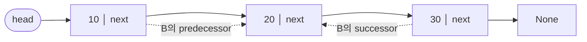

# 자료구조·알고리즘 완전 학습노트 (NotebookLM 영상 제작용)

> 이 문서 하나로 **개념 → 문제 → 왜 이게 답인지**를 한 흐름으로 학습합니다.
> 정렬·문자열 검색·리스트·트리 4개 단원, 총 **160문제**의 풀이와 시각화를 담았습니다.

## NotebookLM에서 영상 만드는 법
1. NotebookLM에 새 노트북을 만들고 **이 .md 파일을 소스로 업로드**하세요. (단원이 많으면 `notebooklm/` 폴더의 챕터별 파일을 각각 소스로 올려도 됩니다.)
2. **Video Overview / 동영상 개요**를 생성하면, 아래 구조(개념→문제→정답 근거)를 따라 내레이션 영상이 만들어집니다.
3. 특정 단원만 영상으로 만들려면 해당 챕터 파일만 소스로 선택하세요.

## 이 노트 읽는 법 (시각화 범례)
- **실행 추적표**: 코드가 한 줄씩 돌 때 `배열 상태`가 어떻게 바뀌는지 단계별로 보여줍니다. (정렬 코드 문제)
- **mermaid 트리 그림**: 이진트리 구조를 도식화합니다. (`왼`=왼쪽 자식, `오`=오른쪽 자식)
- **보기 분석 표**: 각 선지가 정답/오답인 이유를 한 줄로 정리합니다.
- **🖍️ 빠른 풀이전략**: 형광펜으로 볼 곳 → 떠올릴 개념 → 적용 → 암기. 시험장에서 바로 쓰는 순서입니다.


---

# Ch08 리스트

*배열 리스트와 연결 리스트(단순·이중·원형·커서)*

## 🎬 영상 도입 설명

이번 단원에서는 원소를 한 줄로 늘어놓아 순서를 부여하는 선형 자료구조, 리스트를 배웁니다. 리스트는 마치 책장에 책을 나란히 꽂는 것과 같지만, 같은 일을 시키더라도 어떻게 만드느냐에 따라 성능이 완전히 달라진다는 점이 핵심입니다. 우리는 같은 추상 자료형이라도 구현 방식에 따라 시간복잡도가 어떻게 갈리는지를 중심으로 살펴보겠습니다. 연속된 메모리에 원소를 담는 배열 리스트는 인덱스로 곧장 찾아가는 임의 접근이 빠른 대신, 중간에 끼워 넣거나 빼낼 때 뒤의 원소들을 일일이 밀어야 합니다. 반대로 노드를 링크로 잇는 연결 리스트는 임의 접근이 느린 대신, 위치만 알면 링크 몇 개만 고쳐 빠르게 넣고 뺄 수 있습니다. 이 단원에서는 배열 리스트부터 시작해 단순, 이중, 원형과 원형이중, 그리고 커서 연결 리스트까지, 연결 방향과 끝맺음 방식에 따라 달라지는 여러 리스트들을 차례로 만나 보겠습니다.

## 개념 빠르게

리스트(list)는 원소를 일렬로 늘어놓아 순서를 부여한 선형 자료구조다. 같은 추상 자료형(ADT)이라도 구현 방식에 따라 성능이 완전히 달라진다. 연속된 메모리에 담는 배열 리스트는 인덱스 임의 접근이 O(1)인 대신 중간 삽입·삭제 때 원소를 밀어야 하고, 노드를 링크로 잇는 연결 리스트는 임의 접근이 O(n)인 대신 위치만 알면 링크 몇 개만 고쳐 O(1)로 삽입·삭제한다. 연결 리스트는 다시 연결 방향과 끝맺음 방식에 따라 단순·이중·원형·원형이중·커서 리스트로 나뉜다.

### 1. 리스트란 무엇인가 — ADT와 구현의 분리

**리스트(list)**는 0개 이상의 원소를 일렬로 늘어놓아 **순서(앞·뒤)**를 부여한 선형 자료구조다. “첫 원소”, “마지막 원소”, “어떤 원소의 바로 다음 원소”가 정의된다는 점이 핵심이다. 리스트는 우리가 다루는 **추상 자료형(ADT)**이고, 그것을 메모리에 어떻게 올리느냐가 **구현**이다. 같은 “리스트”라도 **배열 기반 구현**과 **연결(linked) 구현**은 연산별 시간복잡도가 다르므로, 시험에서는 “어떤 연산이 무엇을 잘하고 무엇을 못하는가”를 구현별로 구분해 묻는다.

- **접근(access)** — i번째 원소를 읽는다. 배열은 주소 계산만으로 O(1), 연결 리스트는 앞에서부터 따라가 O(n).
- **탐색(search)** — 특정 값을 가진 원소를 찾는다. 정렬·구조에 따라 순차 또는 이진.
- **삽입(insert) / 삭제(delete)** — 특정 위치에 원소를 끼우거나 뺀다. 비용의 차이가 가장 크게 갈리는 지점.


### 2. 배열 리스트 vs 연결 리스트

**배열 리스트**는 원소들을 **연속된 메모리**에 차곡차곡 담는다. i번째 원소의 주소는 `기준주소 + i × 원소크기`로 한 번에 계산되므로 **임의 접근(random access)**이 O(1)이다. 대신 중간에 끼우거나 빼면 그 뒤의 원소를 한 칸씩 **이동(shift)**해야 해서 최악 O(n)이다. **연결 리스트**는 원소를 담은 **노드(node)**를 메모리 곳곳에 흩어 두고 **포인터(링크)**로 잇는다. i번째에 가려면 head부터 i번 따라가야 하므로 접근·탐색이 O(n)이지만, 끼울·뺄 **위치를 이미 알고 있다면** 링크 몇 개만 고쳐 O(1)로 삽입·삭제한다(데이터를 밀 필요가 없다).

| 연산 | 배열 리스트 | 연결 리스트(단순) | 설명 |
| --- | --- | --- | --- |
| i번째 임의 접근 | **O(1)** | O(n) | 배열은 주소 계산 1회, 연결은 head부터 i번 추적 |
| 값 탐색(search) | O(n) / 정렬 시 O(log n) | O(n) | 연결 리스트는 임의 접근이 안 돼 이진 탐색 부적합 |
| 맨 앞 삽입·삭제 | O(n) (전체 이동) | **O(1)** | head만 바꾸면 끝 |
| 맨 뒤 삽입 | O(1)* (자리 있을 때) | tail 있으면 O(1), 없으면 O(n) | *가득 차면 재할당 O(n) |
| 맨 뒤 삭제 | O(1) | O(n) | 단순 리스트는 tail의 이전 노드를 못 바로 찾음 |
| 중간 삽입·삭제(위치 알 때) | O(n) (shift) | **O(1)** | 연결은 링크만 조정 |
| 메모리 형태 | 연속 공간 | 노드마다 링크(포인터) 추가 | 연결은 포인터 저장 공간 오버헤드 |
| 크기 변경 | 재할당 필요(동적 배열) | 노드 추가/제거로 자유로움 | 연결은 미리 크기 정할 필요 없음 |

> **주의** “연결 리스트가 배열보다 항상 삽입·삭제가 빠르다”는 **오개념**이다. 링크 조정 자체는 O(1)이지만, **삽입·삭제할 위치(또는 그 이전 노드)를 찾는 탐색**이 O(n)일 수 있다. 정확히는 “위치를 이미 알고 있을 때 데이터 이동 없이 O(1)”이다. 또 연결 리스트는 인덱스 임의 접근이 느리므로 **이진 탐색에 부적합**하다.

> **TIP** 암기 대신 한 문장으로: **배열은 “읽기에 강하고 고치기에 약하다”, 연결 리스트는 “고치기에 강하고 읽기에 약하다.”** 아래 시각화로 연산별 비용 차이를 직접 비교해 보세요.

> 🔗 인터랙티브 시각화(웹): **ListCostViz** — 직접 값을 넣어 단계 실행할 수 있는 도구.


### 3. 연결 리스트의 구성 요소


#### 3.1 노드(node): 데이터 + next

연결 리스트의 기본 단위는 **노드**다. 단순 연결 리스트의 노드는 두 칸을 가진다: 실제 값을 담는 **데이터(data)** 필드와, 다음 노드를 가리키는 **링크 포인터 `next`**다. 노드는 “값 + 다음으로 가는 화살표”라고 생각하면 된다.

`class Node:`   `def __init__(self, data):`     `self.data = data  # 저장할 값`     `self.next = None  # 다음 노드(없으면 None)`


#### 3.2 head · tail · current

- **head** — 리스트의 **첫 노드**를 가리키는 진입점. 리스트는 보통 head 하나만으로 표현된다. 리스트가 **비어 있으면 head는 `None`**이다.
- **tail** — 리스트의 **마지막 노드**. 단순 연결 리스트에서 **tail의 next는 `None`**이다(자기 자신이 아니다). tail 포인터를 따로 들고 있으면 맨 뒤 “삽입”은 O(1)로 빨라진다.
- **current** — 순회·탐색 중 **지금 주목하고 있는 노드**를 가리키는 작업용 포인터. 한 칸 전진하는 동작(`next()`)은 `current = current.next`로 구현한다.

> **주의** 노드가 **하나뿐**이면 그 노드는 **head이면서 동시에 tail**이다. 또 “tail이 있으면 맨 뒤 ‘삽입’은 O(1)”이지만 단순 연결 리스트에서 맨 뒤 ‘**삭제**’는 tail만으로 해결되지 않는다(이유는 4.3 참고).


#### 3.3 predecessor(선행) · successor(후속)

어떤 노드 X를 기준으로, X 바로 **앞**의 노드를 **predecessor(선행 노드)**, 바로 **뒤**의 노드를 **successor(후속 노드)**라 한다. 트리의 부모/자식과 혼동하지 말 것 — 리스트의 선행/후속은 **같은 일렬 위에서의 한 칸 앞·뒤**일 뿐이다.

| 용어 | 의미 | 단순 리스트에서 찾는 비용 |
| --- | --- | --- |
| successor(후속) | X 바로 뒤 노드 = `X.next` | O(1) — next 한 번 |
| predecessor(선행) | X 바로 앞 노드 | O(n) — head부터 “next가 X인 노드”를 순차 탐색 |

> **주의** 단순 연결 리스트의 핵심 약점: **successor는 즉시 알지만 predecessor는 즉시 알 수 없다.** next 링크가 한 방향이라 “앞으로 거슬러” 갈 수 없기 때문이다. 이 비대칭이 4장의 삭제 비용 차이를 만든다. (이중 연결 리스트는 `prev` 링크로 이 문제를 없앤다.)


### 4. 핵심 연산과 비용


#### 4.1 순차 탐색 search() — O(n)

연결 리스트는 임의 접근이 불가능하므로, 값을 찾으려면 `current = head`에서 시작해 `current = current.next`로 한 칸씩 이동하며 값을 비교하는 **순차 탐색(linear/sequential search)**을 쓴다. 찾으면 그 노드를, 끝(`None`)까지 못 찾으면 실패를 반환한다. 평균·최악 **O(n)**이다. 정렬되어 있어도 **이진 탐색은 쓸 수 없다** — 중간 원소로 한 번에 점프하는 임의 접근이 O(n)이라 이점이 사라진다.


#### 4.2 삽입 insert

- **맨 앞 삽입(prepend)** — 새 노드의 next를 기존 head로, head를 새 노드로. **O(1)**.
- **중간 삽입** — 끼울 위치의 이전 노드(predecessor) p를 알고 있다면 `new.next = p.next; p.next = new` 두 줄. **O(1)**. 다만 그 위치를 찾는 데 O(n)이 들 수 있다.
- **맨 뒤 삽입(append)** — tail 포인터가 있으면 O(1), 없으면 끝까지 가야 해서 O(n).

> **주의** 중간 삽입에서 링크를 잇는 **순서**가 중요하다. 반드시 `new.next = p.next`를 먼저 한 뒤 `p.next = new`로 해야 한다. 순서를 뒤집어 `p.next = new`를 먼저 하면 **원래 뒷부분으로 가는 링크를 잃어버려** 리스트가 끊긴다.


#### 4.3 삭제 delete — remove_first vs remove_last

삭제 비용은 “**지울 노드의 predecessor를 얼마나 쉽게 아느냐**”로 갈린다. 단순 연결 리스트에서 노드를 빼려면 그 **이전 노드의 next를 지울 노드의 next로** 건너뛰게 만들어야 하는데, 이전 노드를 알아야 하기 때문이다.

| 연산 | 하는 일 | 시간복잡도 | 이유 |
| --- | --- | --- | --- |
| `remove_first()` | `head = head.next` 로 첫 노드 건너뛰기 | **O(1)** | 첫 노드의 predecessor는 없고 head만 옮기면 됨 |
| `remove_last()` | tail의 **이전(predecessor)** 노드를 찾아 그 next를 `None`으로 | **O(n)** | 단순 리스트는 끝 노드의 이전 노드를 바로 알 수 없어 head부터 순차 탐색 |
| 중간 삭제(위치 알 때) | predecessor.next = 지울노드.next | O(1) | 이전 노드를 이미 알고 있다는 전제 |

> **주의** **tail 포인터가 있어도** 단순 연결 리스트의 `remove_last()`는 O(1)이 되지 않는다. 삭제 후 tail을 “이전 노드”로 옮겨야 하는데, 그 이전 노드를 찾으려면 결국 head부터 순차 탐색해야 하기 때문이다. 반면 `remove_first()`는 항상 O(1)이다. (이중 연결 리스트라면 `tail.prev`로 O(1) 삭제가 가능.)


#### 4.4 전체 비우기 clear()

모든 노드를 제거하는 `clear()`는 보통 **head에서 시작해 앞에서부터** 차례로 노드를 떼어낸다 (가장 간단한 구현은 `head = None`으로 진입점을 끊는 것). “tail부터 거꾸로 반복 삭제한다”는 설명은 단순 연결 리스트에서 자연스럽지 않다 — 거꾸로 가는 링크가 없기 때문이다.


#### 4.5 동작을 눈으로 — LinkedListVisualizer

> **TIP** 아래에서 노드를 직접 삽입·삭제하며 head/current 포인터와 next 링크가 단계별로 어떻게 바뀌는지 확인하세요. 특히 “중간 삽입의 링크 연결 순서”와 “remove_last가 이전 노드를 찾아가는 과정”을 눈으로 따라가 보면 4장이 단단해집니다.

> 🔗 인터랙티브 시각화(웹): **LinkedListVisualizer** — 직접 값을 넣어 단계 실행할 수 있는 도구.


### 5. 연결 리스트의 종류

연결 방식(한 방향/양방향), 끝맺음 방식(`None`으로 끝/원형으로 순환), 더미 노드 사용 여부, 그리고 링크를 포인터로 할지 배열 인덱스로 할지에 따라 다섯 가지로 나뉜다.


#### 5.1 단순 연결 리스트(singly linked list)

- 각 노드가 `next` **하나**만 가지는, 한 방향 리스트.
- 마지막 노드의 `next`는 **`None`**(자기 자신이 아님).
- 구조가 단순하고 메모리 오버헤드가 작지만, predecessor를 못 거슬러 가 `remove_last()`가 O(n)인 등 “뒤쪽·역방향” 작업에 약하다.


#### 5.2 이중 연결 리스트(doubly linked list)

- 각 노드가 **`prev`(이전)와 `next`(다음)** 두 링크를 가져 **양방향 탐색**이 가능.
- 어떤 노드의 predecessor를 `node.prev`로 **즉시** 알 수 있어, 그 노드의 삭제가 O(1)이고 `tail.prev`로 `remove_last()`도 O(1)이 된다.
- 대가로 노드마다 링크를 하나 더 저장해 **메모리를 더 쓰고**, 삽입·삭제 때 고쳐야 할 링크가 늘어난다 (prev·next 양쪽을 모두 갱신).

> **주의** 이중 연결 리스트의 장점은 “양방향 탐색·역방향 작업”이지 “검색이 빨라지는 것”이 아니다. 값 탐색은 여전히 순차 **O(n)**이며, prev가 있다고 임의 접근이 O(1)이 되지도 않는다.


#### 5.3 원형 연결 리스트(circular linked list)

- 마지막 노드의 next가 `None` 대신 **head를 가리켜** 끝과 처음이 이어진다(`tail.next = head`).
- 어느 노드에서 출발해도 한 바퀴 돌아 모든 노드에 닿을 수 있어, 라운드로빈·순환 버퍼 같은 “돌아가며 처리” 작업에 적합.
- 순회 종료 조건이 “`next == None`”이 아니라 “**다시 head(시작 노드)로 돌아오면**”이 된다.

> **주의** 원형 리스트에서 “`next == None`이면 끝”이라는 단순 리스트식 종료 조건을 그대로 쓰면 `None`을 영영 만나지 못해 **무한 루프**에 빠진다. 시작 노드로 되돌아왔는지로 종료를 판정해야 한다.


#### 5.4 원형 이중 연결 리스트 + 더미(dummy) 노드

- **원형 + 이중**의 결합: 각 노드가 prev·next를 갖고, 양 끝이 서로 이어져 앞뒤 어느 방향으로도 끝없이 순환한다.
- 여기에 값 없는 **더미(헤더/센티넬) 노드**를 하나 두면, 빈 리스트도 “더미 혼자 자기 자신을 가리키는” 항상-유효한 형태가 된다.
- 더미 덕분에 “리스트가 비었는가/맨 앞·맨 뒤인가” 같은 **경계(특수) 조건이 사라져** 삽입·삭제 코드가 한 가지 일반 케이스로 단순해진다.

> **TIP** 더미 노드의 본질은 “예외 케이스 제거”다. 더미가 항상 존재하므로 어떤 위치든 삽입·삭제가 “새 노드를 두 노드 사이에 끼우고 양쪽 prev/next를 잇는다”는 **동일한 절차**로 처리되어 if 분기가 줄어든다.


#### 5.5 커서(cursor) 연결 리스트와 free list

**커서 연결 리스트**는 진짜 포인터(메모리 주소) 대신 **배열의 인덱스**를 링크로 사용하는 구현이다. 노드들을 하나의 배열에 담고, 각 칸은 `data`와 “다음 노드가 있는 배열 인덱스(`next`)”를 저장한다. 포인터를 직접 못 쓰는 환경이나, 모든 노드를 한 배열에 모아 관리하고 싶을 때 쓴다(파일·DB 레코드 연결 등).

- **링크 = 배열 인덱스** — “다음으로 가라”는 곧 “이 인덱스 칸으로 가라”는 뜻. 리스트의 끝은 보통 -1 같은 특수 인덱스로 표시한다(포인터의 `None` 대응).
- **free list(자유 공간 리스트)** — 현재 비어 있는(삭제됐거나 한 번도 안 쓴) 배열 칸들을 하나의 연결 리스트로 묶어 관리한다. 삽입 때는 free list에서 빈 칸을 하나 꺼내 쓰고, 삭제 때는 그 칸을 다시 free list로 되돌려 **재사용**한다.

| 포인터 방식 | 커서 방식 | 대응 |
| --- | --- | --- |
| 노드 = 동적 할당 객체 | 노드 = 고정 배열의 한 칸 | 메모리를 배열로 직접 관리 |
| link = 메모리 주소 | link = 배열 인덱스 | “다음”을 주소 대신 첨자로 |
| 끝 표시 = `None` | 끝 표시 = -1(약속된 인덱스) | 널 링크의 표현 |
| new/malloc, free/del | free list에서 꺼내 쓰고 되돌림 | 빈 칸 재활용 |

> **주의** 커서 리스트에서 **삭제만 반복하고 free list로 되돌려 재사용하지 않으면 빈(쓰지 못하는) 레코드가 점점 쌓인다.** 그래서 free list로 삭제된 칸을 회수해 다음 삽입에 재활용하는 것이 핵심이다.

> **TIP** 아래 시각화로 “인덱스가 곧 링크”라는 개념과, 삭제된 칸이 free list로 회수돼 다음 삽입에서 재사용되는 흐름을 따라가 보세요.

> 🔗 인터랙티브 시각화(웹): **CursorListViz** — 직접 값을 넣어 단계 실행할 수 있는 도구.


### 6. 종류별 한눈 비교

| 종류 | 링크 | 끝맺음 | 핵심 장점 | 대표 약점 |
| --- | --- | --- | --- | --- |
| 단순 | `next`만 | tail.next = `None` | 단순·저메모리 | predecessor 추적 불가 → remove_last O(n) |
| 이중 | `prev` + `next` | 양 끝 `None` | 양방향 탐색, 임의 노드/맨뒤 삭제 O(1) | 링크 추가로 메모리·갱신 비용↑ |
| 원형 | `next`(보통) | tail.next = head | 순환 처리·라운드로빈에 적합 | 종료 조건 주의(무한 루프) |
| 원형 이중 | `prev` + `next` | 양 끝이 순환 | 더미 노드로 경계 조건 제거 | 구현이 가장 복잡, 메모리↑ |
| 커서 | 배열 인덱스 | 끝 = -1 약속 | 포인터 없이 배열로 관리, 노드 한곳 집중 | free list 관리 필요, 빈 칸 누적 위험 |

> **TIP** 시험 대비 요약 3줄 — ① **임의 접근**: 배열 O(1) / 연결 O(n), 그래서 연결 리스트는 이진 탐색 부적합. ② **remove_first O(1)** vs **단순 리스트 remove_last O(n)**(predecessor를 못 바로 알아서). ③ **이중**=양방향, **원형**=tail.next가 head, **원형이중+더미**=경계 조건 제거, **커서**=인덱스 링크+free list 재사용.


## 핵심 한눈에 (치트시트)

### Ch08 리스트 — 시험 직전 핵심

리스트는 **순서**가 있는 선형 자료구조. 구현은 둘 — **배열 리스트**(연속 메모리, 인덱스) vs **연결 리스트**(노드+포인터). 시험은 **"어느 연산이 빠른가"**와 **"연결 리스트 종류 구분"**에서 갈린다.


#### 배열 vs 연결 리스트 — 복잡도 한 표

| 연산 | 배열 리스트 | 연결 리스트 |
| --- | --- | --- |
| 인덱스 접근(임의 접근) | **O(1)** 빠름 | **O(n)** 느림 |
| 앞/중간 삽입·삭제 | O(n) 데이터 밀기 | **O(1)** 링크만 변경(위치 알 때) |
| 데이터 탐색(검색) | 순차/이진(정렬 시) | 순차 탐색 **O(n)** |
| 메모리 | 연속 공간 | 노드마다 포인터 추가 |

> **TIP** 암기: **배열=빠른 접근/느린 삽삭**, **연결=느린 접근/빠른 삽삭**. "배접연삽" — 배열은 접근, 연결은 삽입·삭제가 강점.


#### 노드와 포인터 용어 (단골 출제)

| 용어 | 의미 |
| --- | --- |
| 노드(node) | `데이터` + 다음 노드 주소 `next` |
| head | 리스트의 **첫 노드**를 가리킴 (빈 리스트면 `None`) |
| tail | 마지막 노드. 단순 리스트는 `tail.next = None` |
| current | 지금 **주목·처리 중**인 노드를 가리킴 |
| predecessor | 현재 노드 **바로 앞** 노드 (선행) |
| successor | 현재 노드 **바로 뒤** 노드 (후속) |

> **주의** 함정: 단순 리스트의 `tail.next`는 **자기 자신이 아니라 None**! 자기 자신/head를 가리키는 건 **원형** 리스트다.


#### 삭제 연산 비용 비교

| 연산 | 동작 | 비용 |
| --- | --- | --- |
| remove_first() | head를 head.next로 변경 | **O(1)** |
| remove_last() (단순) | tail 직전 노드 찾으려 head부터 순차 탐색 | **O(n)** |
| remove_last() (이중) | prev로 직전 노드 바로 접근 | O(1) |

> **TIP** 암기: **앞 빼기는 공짜, 뒤 빼기는 (단순이면) 다 훑어야 함**.


#### 연결 리스트 4종 + 커서 구분 (핵심)

| 종류 | 노드 링크 | 특징 / 끝 처리 |
| --- | --- | --- |
| 단순 | `next`만 | tail.next = None, 한 방향 |
| 이중 | `prev` + `next` | 양방향 탐색 가능 |
| 원형 | `next`만 | tail.next = head (끝↔처음 연결) |
| 원형 이중 | prev+next+원형 | 더미 노드로 경계 처리 단순화 |
| 커서 | 배열 **인덱스** | 포인터 대신 인덱스, free list로 빈칸 재사용 |

> **TIP** 암기 비유: **단순=한 줄**, **이중=양손잡이**, **원형=뱅글뱅글**, **커서=배열로 흉내**, **더미=경비실**(경계 조건 대신 막아줌).


#### 커서 연결 리스트 & free list

- 포인터가 없는 환경에서 **배열 인덱스**로 next를 표현.
- 삭제된 칸은 버리지 않고 **free list**에 모아 **재사용**.
- 함정: 삭제만 반복하고 재사용 안 하면 **빈 레코드가 계속 증가**.


## 개념별 핵심 + 시각화

### ▸ 배열 리스트

연속 메모리에 데이터를 담아 인덱스로 O(1) 접근. 대신 중간 삽입·삭제는 뒤 데이터를 밀어야 해 O(n).

배열 리스트는 사물함이 한 줄로 쭉 붙어 있는 것과 같아요. 몇 번 칸인지만 알면 곧장 그 자리로 가서 물건을 꺼낼 수 있으니 인덱스로 접근하는 건 한 번에 끝나죠. 하지만 줄 가운데에 새 칸을 끼워 넣으려면 뒤에 있는 물건들을 하나씩 옆으로 다 밀어야 해서 느려져요. 그래서 배열 리스트는 데이터를 자주 꺼내 보는 일에는 강하지만, 중간에서 자주 넣고 빼는 일에는 불리하다는 점을 기억하면 됩니다.

```text
배열 리스트: 연속 메모리 + 인덱스

 인덱스   0    1    2    3    4
        ┌────┬────┬────┬────┬────┐
 값     │ 10 │ 20 │ 30 │ 40 │ 50 │
        └────┴────┴────┴────┴────┘

[접근]  arr[2] → 30   바로 콕!        O(1)

[삽입]  인덱스 1에 99 끼워넣기
        ┌────┬────┬────┬────┬────┬────┐
        │ 10 │ 99 │ 20 │ 30 │ 40 │ 50 │
        └────┴────┴────┴────┴────┴────┘
              ↑    →    →    →    →
            새 값   뒤 데이터 한 칸씩 밀기   O(n)

접근은 강점 ✓   /   중간 삽입·삭제는 약점 ✗
```

**암기**: "인덱스로 콕 집어 빠름, 끼워넣기는 다 밀어야 해 느림" — 배열은 접근이 강점.

### ▸ 단순 연결 리스트

각 노드는 [데이터|next]. head부터 한 방향으로만 따라가는 순차 탐색. tail.next = None.

단순 연결 리스트는 칸칸이 이어진 한 줄 기차와 같아요. 각 칸(노드)은 데이터와 다음 칸을 가리키는 next 손잡이를 들고 있고, 우리는 맨 앞 head에서 출발해 한 방향으로만 따라갑니다. 그래서 중간에 데이터를 넣거나 뺄 때 옆으로 밀고 당길 필요 없이 손잡이만 바꿔 끼우면 되니 이동이 적다는 장점이 있죠. 다만 마지막 칸을 지우려면 그 앞 칸을 바로 알 수 없어 head부터 다시 출발해야 하므로 비효율적이라는 점도 함께 기억해 두세요.



**암기**: "한 줄 기차" — next로만 이어진 한쪽 통행. 앞 노드(predecessor)를 보려면 head부터 다시 출발.

### ▸ 이중 연결 리스트

각 노드가 prev와 next를 모두 보유. 앞뒤 양방향 탐색 가능, 직전 노드 접근이 O(1)이라 remove_last도 빠름.

이중 연결 리스트는 양손잡이라고 생각하면 쉬워요. 각 노드가 앞손과 뒷손을 모두 가져서, 앞손인 prev로 직전 노드를, 뒷손인 next로 다음 노드를 잡고 있죠. 한 줄로 손을 잡고 선 사람들이 양옆을 다 볼 수 있는 것처럼 앞뒤 양방향 탐색이 가능하고, 직전 노드를 바로 잡을 수 있어 O(1)이라 맨 뒤를 지우는 remove_last도 빠릅니다. 다만 포인터를 하나 더 들어야 해서 메모리가 조금 더 든다는 점만 기억하면 돼요.

```text
이중 연결 리스트 (양손잡이: prev + next)

  null      ┌─────────┐      ┌─────────┐      ┌─────────┐      null
   ↑        │ prev: ─ │ ←──→ │ prev: ● │ ←──→ │ prev: ● │       ↑
   └─ prev  │ data: A │      │ data: B │      │ data: C │  next ┘
            │ next: ● │ ←──→ │ next: ● │ ←──→ │ next: ─ │
            └─────────┘      └─────────┘      └─────────┘
              head                               tail

  next → 다음 노드로 이동      prev → 직전 노드로 이동
  양방향 탐색 가능 (head→tail ✓ , tail→head ✓)
  직전 노드 접근 O(1) → remove_last 빠름
  단점: 노드마다 포인터 1개 추가 → 메모리 증가
```

**암기**: "양손잡이" — 앞손(prev) 뒷손(next) 둘 다. 단점은 포인터 하나 더 → 메모리 증가.

### ▸ 원형·원형이중 연결 리스트

마지막 노드의 next가 head를 가리켜 끝과 처음이 이어짐(원형). 원형+이중에 더미 노드를 두면 경계 조건이 줄어 삽입·삭제가 단순해진다.

연결 리스트를 손을 잡고 한 줄로 선 사람들이라고 생각해 보세요. 보통은 맨 끝 사람이 더 잡을 손이 없어 멈추지만, 원형 연결 리스트는 마지막 사람이 맨 앞 사람의 손을 잡아 빙글빙글 도는 원을 만듭니다. 여기에 이중 연결과 더미 노드(경비실)를 하나 두면, 리스트가 비었는지 끝인지 같은 예외를 따로 챙기지 않아도 돼서 삽입과 삭제 코드가 훨씬 단순해집니다. 그래서 한 바퀴 계속 돌며 처리하거나 양방향으로 자유롭게 오가야 하는 상황에서 특히 유용합니다.

```text
[ 원형 연결 리스트 ]  tail.next = head 로 빙글빙글

   head                          tail
    │                             │
    ▼                             ▼
  ┌───┐   ┌───┐   ┌───┐   ┌───┐
  │ A │ → │ B │ → │ C │ → │ D │
  └───┘   └───┘   └───┘   └───┘
    ▲                       │
    └───────────────────────┘
        tail.next → head  (끝과 처음이 이어짐)


[ 원형 이중 연결 리스트 + 더미 노드(경비실) ]

    ┌─────────────────────────────────┐
    │  (C.next → 더미,  더미.prev → C) │
    ▼                                 │
  ┌─────┐ ↔ ┌───┐ ↔ ┌───┐ ↔ ┌───┐ ───┘
  │더미 │   │ A │   │ B │   │ C │
  └─────┘   └───┘   └───┘   └───┘
     │
     └─ 항상 존재 → "비었나?/끝인가?" 경계 처리 불필요
        삽입·삭제가 단순해짐
```

**암기**: "뱅글뱅글 + 경비실" — tail.next=head로 빙글빙글, 더미(경비실) 하나가 "비었나/끝인가" 예외처리를 막아줌.

### ▸ 커서 연결 리스트

포인터 대신 배열 인덱스로 next를 표현. 삭제된 칸은 버리지 않고 free list에 모아 재사용한다.

배열 인덱스로 다음 노드를 가리켜 연결 리스트를 흉내 냅니다. 삭제된 칸은 버리지 않고 free list, 즉 재활용함에 모아 두었다가 다시 씁니다.

```text
idx:   0  1  2  3  4  5
data:  A  B  -  C  -  D
next:  1  3  -  5  - -1
free: [2] -> [4]
```

**암기**: "배열로 흉내 + 재활용함" — 인덱스가 곧 포인터. 빈칸은 free list(재활용함)에 넣어 두고 다시 씀. 안 쓰면 빈 레코드만 쌓임.


## 문제 은행 (40문제)

### Q41 · 객관식 · 배열 리스트

**문제.** 배열 기반 리스트의 특징으로 가장 적절한 것은?

- ① 삽입·삭제 시 데이터 이동이 거의 없다
- ② **인덱스를 이용한 접근이 빠르다 ✅**
- ③ 포인터를 반드시 사용한다
- ④ 메모리를 비연속적으로 사용한다

**정답: ② 인덱스를 이용한 접근이 빠르다**

> 배열 리스트는 시작 주소 + 인덱스×원소크기로 임의 원소의 주소를 상수 시간에 계산할 수 있어 인덱스 접근이 빠르다.

**왜 이게 답인가**

- 배열은 메모리에 원소들을 **연속(contiguous)**으로 배치한다. 따라서 i번째 원소의 주소는 `base + i × elemSize`로 한 번의 산술 연산만에 구해진다.
- 이 덕분에 인덱스 i가 주어지면 어떤 위치든 `O(1)`에 접근(random access)할 수 있다. 이것이 배열의 핵심 강점이다.
- 반면 중간 삽입·삭제는 뒤쪽 원소를 한 칸씩 밀거나 당겨야 하므로 최악 `O(n)`의 데이터 이동이 발생한다.
- 따라서 보기 중 배열의 특징을 옳게 말한 것은 ② 인덱스를 이용한 접근이 빠르다.

**보기 분석**

| 보기 | 판정 | 이유 |
| --- | --- | --- |
| ① | 오답 | 삽입·삭제 시 데이터 이동이 거의 없는 것은 연결 리스트의 특징이다. 배열은 오히려 중간 삽입·삭제에서 뒤 원소들을 대량으로 이동해야 한다. |
| ② | 정답 | 연속 메모리 + 인덱스 산술로 임의 위치를 O(1)에 접근할 수 있다. 이것이 배열 리스트의 대표 강점이다. |
| ③ | 오답 | 포인터를 필수로 쓰는 것은 연결 리스트다. 배열은 인덱스만으로 접근하며 노드 간 포인터가 필요 없다. |
| ④ | 오답 | 비연속 메모리는 연결 리스트의 특징이다. 배열은 정의상 연속된 메모리 공간을 사용한다. |

**핵심 개념**: 연속 메모리 배치 · 주소 = base + i×elemSize (O(1) 임의 접근) · 중간 삽입·삭제는 O(n) 이동

**⚠️ 함정**: ①·③·④는 모두 연결 리스트의 성질을 배열에 갖다 붙인 매력적 오답이다. 배열과 연결 리스트의 장단점을 짝지어 기억하면 헷갈리지 않는다.

**🖍️ 빠른 풀이전략**

**무엇을 묻나**: 배열 기반 리스트의 특징 고르기

- **핵심**: 배열 = 연속 메모리 + `인덱스로 바로 접근`
- **적용**: 삽입·삭제는 데이터 이동 큼(오답), 포인터·비연속은 연결 리스트 특징(오답)

**한 줄 결론**: 배열은 인덱스로 원하는 칸에 O(1) 접근

**암기**: 배열=칸번호로 순간이동 / 연결=한칸씩 걸어가기

---

### Q42 · 객관식 · 연결 리스트

**문제.** 연결 리스트의 장점으로 가장 적절한 것은?

- ① 인덱스 접근이 빠름
- ② 메모리 사용이 매우 적음
- ③ **삽입·삭제 시 데이터 이동이 적음 ✅**
- ④ 항상 정렬 상태 유지

**정답: ③ 삽입·삭제 시 데이터 이동이 적음**

> 연결 리스트는 위치를 알 때 링크(포인터)만 갱신하면 되어, 삽입·삭제 시 원소 대량 이동이 필요 없다.

**왜 이게 답인가**

- 연결 리스트는 노드들이 메모리에 흩어져 있고 `next` 포인터로 연결된다. 삽입·삭제는 주변 노드의 링크 몇 개만 바꾸면 끝난다.
- 예: 노드 p 다음에 새 노드 x를 넣을 때 `x.next = p.next; p.next = x` 두 줄이면 되고, 뒤 원소를 미는 작업이 없다.
- 배열은 같은 작업에 뒤 원소 전부를 한 칸씩 밀어야 해 최악 `O(n)`이 든다. 이 대량 이동이 없다는 것이 연결 리스트의 장점이다.
- 따라서 정답은 ③ 삽입·삭제 시 데이터 이동이 적음이다.

**보기 분석**

| 보기 | 판정 | 이유 |
| --- | --- | --- |
| ① | 오답 | 인덱스 접근이 빠른 것은 배열이다. 연결 리스트는 i번째 노드를 찾으려면 head부터 i번 따라가야 하므로 O(n)이다. |
| ② | 오답 | 연결 리스트는 노드마다 포인터(보통 8바이트)를 추가로 저장하므로 같은 데이터 기준 메모리 오버헤드가 오히려 더 크다. |
| ③ | 정답 | 위치를 알면 링크만 바꿔 삽입·삭제하므로 배열 같은 원소 이동이 없다. 이것이 연결 리스트의 핵심 장점이다. |
| ④ | 오답 | 연결 리스트 자체가 정렬을 보장하지 않는다. 정렬 유지는 자료구조가 아니라 삽입 정책(정렬 삽입)이나 별도 구조의 몫이다. |

**핵심 개념**: 링크 갱신만으로 삽입·삭제 · 포인터 오버헤드 존재 · 임의 접근은 O(n)

**⚠️ 함정**: "삽입·삭제가 O(1)"은 삽입할 위치(노드)를 이미 알고 있을 때 이야기다. 위치를 탐색하는 비용 O(n)은 별개로 들 수 있다.

**🖍️ 빠른 풀이전략**

**무엇을 묻나**: 연결 리스트의 장점 고르기

- **핵심**: 연결 = 링크(next)만 바꾸면 끝 → 데이터 이동 적음
- **적용**: 인덱스 빠름·메모리 적음은 배열 쪽, 정렬 유지는 무관(오답)

**한 줄 결론**: 링크만 조정하므로 삽입·삭제 시 데이터 이동이 적다

**암기**: 연결의 자랑거리=삽입·삭제 가볍다

---

### Q43 · 객관식 · 단순 연결 리스트

**문제.** 단순 연결 리스트에서 마지막 노드를 삭제할 때 비효율적인 이유는?

- ① 재귀 호출이 필요
- ② 루트 노드가 없음
- ③ **이전 노드를 바로 알 수 없음 ✅**
- ④ 포인터 사용 불가

**정답: ③ 이전 노드를 바로 알 수 없음**

> 단순 연결 리스트는 next만 있어 마지막 노드의 바로 앞(predecessor)을 즉시 알 수 없고, head부터 순차 탐색해야 한다.

**왜 이게 답인가**

- 마지막 노드를 삭제하려면 그 앞 노드의 `next`를 `None`으로 바꿔 새 tail로 만들어야 한다. 즉 마지막 노드의 **이전 노드**가 필요하다.
- 단순 연결 리스트의 노드는 `next`(뒤로 가는 링크)만 가진다. 뒤에서 앞으로 거슬러 올라가는 링크가 없다.
- 따라서 마지막 직전 노드를 찾으려면 head부터 `cur.next.next is None`이 될 때까지 따라가야 하고, 이는 `O(n)`이다.
- 이중 연결 리스트라면 `prev`로 바로 이전 노드를 알 수 있어 O(1)이지만, 단순 리스트는 그렇지 못하다. 정답은 ③ 이전 노드를 바로 알 수 없음.

**보기 분석**

| 보기 | 판정 | 이유 |
| --- | --- | --- |
| ① | 오답 | 재귀가 본질적 이유는 아니다. 삭제는 반복(루프)으로 충분히 구현되며, 비효율의 원인은 알고리즘이 아니라 구조(이전 노드를 못 가리킴)다. |
| ② | 오답 | 리스트에는 루트 개념 자체가 없다(루트는 트리 용어). 마지막 노드 삭제 비효율과 무관하다. |
| ③ | 정답 | next만 있어 마지막 노드의 predecessor를 즉시 알 수 없고, head부터 O(n) 순차 탐색이 필요하다. 이것이 비효율의 직접 원인이다. |
| ④ | 오답 | 단순 연결 리스트도 포인터(next)를 사용한다. 포인터 사용 불가라는 전제 자체가 틀렸다. |

**핵심 개념**: predecessor 접근 불가(단순 리스트) · remove_last는 O(n) 순차 탐색 · 이중 리스트는 prev로 O(1)

**⚠️ 함정**: remove_first는 head만 바꾸면 O(1)인데 remove_last는 O(n)이라는 비대칭을 혼동하기 쉽다. 원인은 "앞으로 거슬러 갈 링크의 유무"다.

**🖍️ 빠른 풀이전략**

**무엇을 묻나**: 단순 연결 리스트에서 마지막 노드 삭제가 비효율적인 이유

- **핵심**: 삭제하려면 tail의 '바로 앞 노드(predecessor)'를 알아야 함
- **적용**: next만 있어 뒤로만 감 → 앞 노드는 head부터 다시 찾아야 함

**한 줄 결론**: 단순 리스트는 이전 노드를 바로 알 수 없어 head부터 순차 탐색 필요

**암기**: next만 있으면 뒤돌아보기 불가 = 앞 노드 못 봄

---

### Q44 · 객관식 · 노드 구조

**문제.** 단순 연결 리스트의 노드 클래스에서 일반적으로 저장되는 정보로 가장 적절한 것은?

- ① **데이터와 next 포인터 ✅**
- ② 데이터와 힙 주소
- ③ 인덱스 번호와 부모 노드
- ④ 루트 주소만 저장

**정답: ① 데이터와 next 포인터**

> 단순 연결 리스트의 노드는 데이터와 다음 노드를 가리키는 next 포인터를 가진다.

**왜 이게 답인가**

- 연결 리스트의 노드는 두 부분으로 구성된다: 실제 값을 담는 **데이터 필드**와 다음 노드를 가리키는 **링크 필드(next)**.
- 이 next가 노드들을 사슬처럼 이어 리스트를 형성한다. 마지막 노드의 next는 `None`이다.
- 단순(단방향) 연결 리스트는 뒤로 가는 prev가 없고 next만 가진다. 따라서 일반적으로 저장하는 정보는 데이터 + next.
- 정답은 ① 데이터와 next 포인터.

**보기 분석**

| 보기 | 판정 | 이유 |
| --- | --- | --- |
| ① | 정답 | 노드는 값을 담는 데이터 필드와 다음 노드 주소를 담는 next 링크 필드로 구성된다. 단순 연결 리스트 노드의 정확한 구성이다. |
| ② | 오답 | "힙 주소"를 명시적으로 저장하지 않는다. next가 다음 노드의 참조(주소)일 뿐, 힙 주소라는 별도 필드 개념은 노드 구조가 아니다. |
| ③ | 오답 | 인덱스 번호·부모 노드는 트리나 인덱스 기반 구조의 개념이다. 단순 연결 리스트 노드에는 부모라는 개념이 없다. |
| ④ | 오답 | 루트 주소만 저장한다는 것은 노드 구조가 아니라 트리의 루트 개념이며, 데이터를 담지 않는다는 점에서도 틀렸다. |

**핵심 개념**: 노드 = 데이터 필드 + 링크(next) 필드 · 단순 리스트는 next만, 이중 리스트는 prev+next · tail.next = None

**⚠️ 함정**: 부모/루트/인덱스 같은 트리·배열 용어를 노드 필드로 착각하지 말 것. 연결 리스트 노드의 본질은 "값 + 다음 링크"다.

**🖍️ 빠른 풀이전략**

**무엇을 묻나**: 단순 연결 리스트 노드가 담는 정보

- **핵심**: 노드 = `데이터 + next`(다음 노드 주소)
- **적용**: 힙 주소·부모 노드·루트 주소는 트리/기타 개념(오답)

**한 줄 결론**: 노드는 데이터와 다음 노드를 가리키는 next를 가진다

**암기**: 노드 = 알맹이(데이터) + 화살표(next)

---

### Q45 · 객관식 · predecessor/successor

**문제.** 연결 리스트에서 predecessor node의 의미는?

- ① 현재 노드의 부모 노드
- ② 현재 노드의 자식 노드
- ③ **현재 노드의 바로 앞 노드 ✅**
- ④ 현재 노드의 마지막 노드

**정답: ③ 현재 노드의 바로 앞 노드**

> predecessor(선행 노드)는 현재 노드의 바로 앞 노드를 뜻한다.

**왜 이게 답인가**

- predecessor는 "앞서는 것"이라는 뜻으로, 리스트 순서상 **현재 노드 바로 앞**에 오는 노드를 가리킨다.
- 대응 개념인 successor(후속 노드)는 현재 노드 바로 뒤 노드다. predecessor ↔ successor가 앞뒤 쌍을 이룬다.
- 단순 연결 리스트에서는 next만 있어 predecessor를 즉시 알 수 없고 head부터 탐색해야 한다는 점이 자주 출제된다.
- 정답은 ③ 현재 노드의 바로 앞 노드.

**보기 분석**

| 보기 | 판정 | 이유 |
| --- | --- | --- |
| ① | 오답 | "부모 노드"는 트리 용어다. 선형 리스트에는 부모-자식 관계가 없고, predecessor는 순서상 앞 노드를 뜻한다. |
| ② | 오답 | 자식 노드 역시 트리 용어이며, 이는 오히려 뒤 노드(successor) 쪽에 가까운 잘못된 매칭이다. |
| ③ | 정답 | predecessor는 리스트 순서상 현재 노드 바로 앞에 위치한 노드를 의미한다. 정의 그대로다. |
| ④ | 오답 | 마지막 노드(tail)와 predecessor는 별개 개념이다. predecessor는 "현재 노드 기준 앞 노드"일 뿐 리스트의 끝을 뜻하지 않는다. |

**핵심 개념**: predecessor = 바로 앞 노드 · successor = 바로 뒤 노드 · 리스트는 부모/자식 개념 없음(트리 용어와 구분)

**⚠️ 함정**: 부모/자식은 트리, predecessor/successor는 선형 리스트 용어다. 트리 용어로 끌어들이는 보기가 매력적 오답이다.

**🖍️ 빠른 풀이전략**

**무엇을 묻나**: predecessor node의 의미

- **핵심**: pre = '앞' → 현재 노드의 바로 앞 노드
- **적용**: 부모·자식·리프는 트리 용어라 함정(오답)

**한 줄 결론**: predecessor는 현재 노드 바로 앞 노드

**암기**: pre(앞)decessor=선행 / suc(뒤)cessor=후속

---

### Q46 · 객관식 · predecessor/successor

**문제.** 연결 리스트에서 successor node의 의미는?

- ① **현재 노드의 바로 뒤 노드 ✅**
- ② 현재 노드의 부모 노드
- ③ 현재 노드의 리프 노드
- ④ 현재 노드의 루트 노드

**정답: ① 현재 노드의 바로 뒤 노드**

> successor(후속 노드)는 현재 노드의 바로 뒤 노드를 뜻한다.

**왜 이게 답인가**

- successor는 "뒤따르는 것"이라는 뜻으로, 리스트 순서상 **현재 노드 바로 뒤**에 오는 노드다.
- 단순 연결 리스트에서 현재 노드의 successor는 `current.next`로 즉시 접근할 수 있다(앞 노드와 달리 탐색 불필요).
- 대응 개념 predecessor는 현재 노드 바로 앞 노드다. 둘은 앞뒤 쌍을 이룬다.
- 정답은 ① 현재 노드의 바로 뒤 노드.

**보기 분석**

| 보기 | 판정 | 이유 |
| --- | --- | --- |
| ① | 정답 | successor는 순서상 현재 노드 바로 뒤 노드이며, 단순 리스트에서는 current.next로 바로 얻는다. 정의 그대로다. |
| ② | 오답 | 부모 노드는 트리 용어이고, 위치상으로도 앞쪽(predecessor)에 가까운 잘못된 매칭이다. |
| ③ | 오답 | 리프(leaf) 노드는 트리에서 자식이 없는 노드를 뜻한다. 선형 리스트의 successor와 무관하다. |
| ④ | 오답 | 루트 노드 역시 트리 용어이며, 위치상 successor(바로 뒤)와 반대 방향이라 명백히 틀렸다. |

**핵심 개념**: successor = 바로 뒤 노드 = current.next · predecessor = 바로 앞 노드 · successor는 단순 리스트에서 O(1) 접근

**⚠️ 함정**: leaf/root/parent 같은 트리 용어로 유도하는 보기를 조심하라. successor는 단순히 "다음 노드(next)"다.

**🖍️ 빠른 풀이전략**

**무엇을 묻나**: successor node의 의미

- **핵심**: successor = '뒤' → 현재 노드의 바로 뒤 노드
- **적용**: 부모·리프·루트는 트리 용어(오답)

**한 줄 결론**: successor는 현재 노드 바로 뒤 노드

**암기**: 성공(success)은 다음에 온다 → 뒤 노드

---

### Q47 · 객관식 · 순차 탐색

**문제.** 연결 리스트에서 특정 노드를 탐색하는 기본 방식은?

- ① 이진 탐색
- ② **순차 탐색 ✅**
- ③ 해시 탐색
- ④ 트리 탐색

**정답: ② 순차 탐색**

> 연결 리스트는 임의 접근이 안 되므로 head부터 next를 따라가며 찾는 순차 탐색이 기본이다.

**왜 이게 답인가**

- 연결 리스트는 노드가 메모리에 흩어져 있고 인덱스로 주소를 계산할 수 없다. 즉 **임의 접근(random access)**이 불가능하다.
- 따라서 특정 노드를 찾으려면 head에서 시작해 `current = current.next`로 한 칸씩 이동하며 조건을 검사한다. 이것이 **순차 탐색(sequential search)**이다.
- 이진 탐색은 중간 원소에 O(1)로 접근해야 성립하는데, 연결 리스트는 중간 접근이 O(n)이라 이진 탐색의 이점이 사라진다.
- 정답은 ② 순차 탐색.

**보기 분석**

| 보기 | 판정 | 이유 |
| --- | --- | --- |
| ① | 오답 | 이진 탐색은 정렬된 배열처럼 중간 원소를 O(1)에 접근할 수 있어야 효율적이다. 연결 리스트는 중간 접근이 O(n)이라 이점이 없다. |
| ② | 정답 | 임의 접근이 불가능하므로 head부터 next를 따라가며 한 칸씩 비교하는 순차 탐색이 기본이자 표준 방식이다. |
| ③ | 오답 | 해시 탐색은 해시 테이블이라는 별도 구조가 있을 때 쓴다. 연결 리스트 자체의 노드 탐색 방식이 아니다. |
| ④ | 오답 | 트리 탐색(전위/중위/후위 등)은 트리 구조용이다. 선형 연결 리스트에는 적용 대상이 아니다. |

**핵심 개념**: 임의 접근 불가 → 순차 탐색 · 순차 탐색 O(n) · 이진 탐색은 O(1) 중간 접근 전제

**⚠️ 함정**: 정렬된 연결 리스트라도 중간 노드를 O(1)에 못 잡으므로 이진 탐색이 무의미하다. "정렬되면 이진 탐색"은 배열에서만 통한다.

**🖍️ 빠른 풀이전략**

**무엇을 묻나**: 연결 리스트의 기본 탐색 방식

- **핵심**: 인덱스로 못 뛰어감 → head부터 한 칸씩
- **적용**: 이진·해시·트리 탐색은 임의 접근/다른 구조 필요(오답)

**한 줄 결론**: head부터 차례로 따라가는 순차 탐색이 기본

**암기**: 연결=계단 한 칸씩=순차 탐색

---

### Q48 · 객관식 · 연결 리스트

**문제.** 연결 리스트가 배열보다 중간 삽입에 유리한 이유는?

- ① 정렬 상태 유지 가능
- ② 인덱스 접근 가능
- ③ **데이터 이동이 거의 필요 없음 ✅**
- ④ 메모리를 적게 사용함

**정답: ③ 데이터 이동이 거의 필요 없음**

> 중간 삽입 시 연결 리스트는 링크만 조정하면 되어 배열처럼 뒤 원소를 대량 이동할 필요가 없다.

**왜 이게 답인가**

- 배열의 중간 삽입은 삽입 지점 이후 모든 원소를 한 칸씩 뒤로 밀어야 한다. 최악 `O(n)` 이동이 발생한다.
- 연결 리스트는 삽입 위치 앞 노드 p를 알 때 `새노드.next = p.next; p.next = 새노드`로 링크 2개만 바꾸면 끝난다. 원소를 미는 작업이 전혀 없다.
- 즉 "데이터 이동이 거의 필요 없다"는 점이 중간 삽입에서 연결 리스트가 배열보다 유리한 본질적 이유다.
- 정답은 ③ 데이터 이동이 거의 필요 없음.

**보기 분석**

| 보기 | 판정 | 이유 |
| --- | --- | --- |
| ① | 오답 | 정렬 상태 유지는 자료구조의 성질이 아니라 삽입 정책의 문제다. 중간 삽입이 유리한 이유와 무관하다. |
| ② | 오답 | 인덱스 접근이 가능한 것은 오히려 배열이다. 연결 리스트는 인덱스 접근이 약점이지 중간 삽입 유리함의 근거가 아니다. |
| ③ | 정답 | 링크 몇 개만 갱신하면 되어 배열 같은 원소 대량 이동(O(n))이 없다. 이것이 중간 삽입에서 유리한 직접적 이유다. |
| ④ | 오답 | 연결 리스트는 포인터 오버헤드 때문에 오히려 메모리를 더 쓴다. 메모리 절약은 사실과 다르고 삽입 유리함과도 무관하다. |

**핵심 개념**: 배열 중간 삽입 O(n) 이동 · 연결 리스트는 링크 2개만 갱신 · 삽입 위치를 알 때 O(1)

**⚠️ 함정**: 삽입 자체는 O(1)이지만 "삽입 위치를 찾는" 탐색이 O(n)일 수 있음을 분리해 생각해야 한다. 유리한 것은 이동 비용 부분이다.

**🖍️ 빠른 풀이전략**

**무엇을 묻나**: 연결 리스트가 중간 삽입에 유리한 이유

- **핵심**: 중간 삽입 = 앞뒤 링크만 다시 연결
- **적용**: 배열은 뒤 칸 전부 밀어야 함 ↔ 연결은 안 밀어도 됨

**한 줄 결론**: 링크 조정만으로 처리되어 데이터 대량 이동이 없다

**암기**: 끼워넣기=화살표만 바꿔 끼우면 끝

---

### Q49 · 객관식 · 연결 리스트

**문제.** 다음 중 연결 리스트의 단점으로 가장 적절한 것은?

- ① 삽입 불가능
- ② **임의 접근이 어려움 ✅**
- ③ 데이터 저장 불가능
- ④ 포인터 사용 불가

**정답: ② 임의 접근이 어려움**

> 연결 리스트는 인덱스로 한 번에 접근하는 임의 접근이 어렵다는 것이 대표 단점이다.

**왜 이게 답인가**

- 배열은 주소 계산으로 i번째 원소를 O(1)에 접근하지만, 연결 리스트는 노드가 흩어져 있어 주소 계산이 불가능하다.
- 따라서 i번째 노드를 얻으려면 head부터 i번 next를 따라가야 하고 이는 `O(n)`이다. 이것이 **임의 접근의 어려움**이다.
- 나머지 보기는 연결 리스트가 멀쩡히 지원하는 기능들을 "불가능"이라고 과장한 명백한 거짓이다.
- 정답은 ② 임의 접근이 어려움.

**보기 분석**

| 보기 | 판정 | 이유 |
| --- | --- | --- |
| ① | 오답 | 연결 리스트는 삽입이 오히려 강점이다(링크 갱신으로 O(1)). 삽입 불가능은 사실이 아니다. |
| ② | 정답 | 인덱스로 즉시 접근할 수 없고 head부터 순차 이동해야 하므로 임의 접근이 O(n)으로 느리다. 이것이 핵심 단점이다. |
| ③ | 오답 | 노드의 데이터 필드에 값을 저장하는 것이 연결 리스트의 기본이다. 데이터 저장 불가는 전제부터 틀렸다. |
| ④ | 오답 | 연결 리스트는 next 포인터로 노드를 잇는다. 포인터 사용 불가는 구조 자체를 부정하는 거짓이다. |

**핵심 개념**: 임의 접근 O(n)이 대표 단점 · 포인터 오버헤드 · 캐시 지역성도 배열보다 불리

**⚠️ 함정**: ③·④처럼 "불가능"이라고 단정하는 보기는 대개 오답이다. 연결 리스트의 단점은 "느림"이지 "불가능"이 아니다.

**🖍️ 빠른 풀이전략**

**무엇을 묻나**: 연결 리스트의 단점 고르기

- **핵심**: 인덱스가 없음 → i번째를 바로 못 집음(임의 접근 ✗)
- **적용**: 삽입 불가·저장 불가·포인터 불가는 모두 거짓(오답)

**한 줄 결론**: 인덱스로 바로 접근하는 임의 접근이 어렵다

**암기**: 연결의 약점='몇 번째' 콕 집기

---

### Q50 · 객관식 · 단순 연결 리스트

**문제.** 단순 연결 리스트 구현 코드에서 마지막 노드의 next 값으로 가장 적절한 것은?

- ① 자기 자신
- ② head
- ③ **None ✅**
- ④ predecessor

**정답: ③ None**

> 단순 연결 리스트의 마지막 노드는 뒤에 노드가 없으므로 next가 None이다.

**왜 이게 답인가**

- 단순 연결 리스트는 head에서 시작해 next로 노드를 잇고, 끝(tail)에 도달하면 더 이상 이을 노드가 없다.
- 이 "끝"을 나타내기 위해 마지막 노드의 next를 `None`(또는 null/NIL)으로 둔다. 순회 루프는 `while cur is not None`으로 이 None을 종료 조건으로 쓴다.
- next를 head로 두면 원형 리스트가 되고, 자기 자신으로 두면 1노드짜리 무한 루프가 생긴다. 단순 리스트의 정상 종단은 None이다.
- 정답은 ③ None.

**보기 분석**

| 보기 | 판정 | 이유 |
| --- | --- | --- |
| ① | 오답 | next를 자기 자신으로 두면 그 노드에서 순회가 무한 루프에 빠진다. 종단 표시가 아니다. |
| ② | 오답 | 마지막 노드의 next가 head를 가리키는 것은 원형 연결 리스트의 특징이다. 단순(비원형) 리스트가 아니다. |
| ③ | 정답 | 뒤에 노드가 없음을 나타내려고 tail.next = None으로 두며, 순회 종료 조건으로 쓰인다. 단순 연결 리스트의 표준이다. |
| ④ | 오답 | predecessor(앞 노드)는 next에 담을 대상이 아니다. next는 뒤 노드를 가리키는 링크이고, 단순 리스트에는 prev 자체가 없다. |

**핵심 개념**: tail.next = None이 리스트의 끝 표시 · 순회 종료 조건 cur is None · head를 가리키면 원형 리스트

**⚠️ 함정**: next를 head나 자기 자신으로 두는 보기는 각각 원형 리스트·무한 루프를 만든다. 단순 리스트의 정상 종단은 반드시 None이다.

**🖍️ 빠른 풀이전략**

**무엇을 묻나**: 단순 연결 리스트 마지막 노드의 next 값

- **핵심**: 마지막 = 다음 노드가 없음
- **적용**: 자기 자신·head는 원형 리스트 이야기, predecessor는 방향이 반대(오답)

**한 줄 결론**: 다음 노드가 없으므로 next는 None

**암기**: 끝=막다른 길=None / 끝이 head 가리키면 원형

---

### Q51 · 객관식 · 포인터 변수

**문제.** 연결 리스트 구현에서 current 포인터의 역할로 가장 적절한 것은?

- ① 리스트 전체 길이 저장
- ② **현재 처리 중인 노드를 참조 ✅**
- ③ 마지막 노드 삭제
- ④ head 노드 생성

**정답: ② 현재 처리 중인 노드를 참조**

> current 포인터는 순회·처리 과정에서 지금 주목하고 있는 노드를 참조하는 변수다.

**왜 이게 답인가**

- 연결 리스트를 순회할 때 head는 그대로 두고, `current`라는 보조 포인터를 head에서 시작해 `current = current.next`로 한 칸씩 이동시킨다.
- current가 가리키는 노드가 곧 "지금 검사·처리 중인 노드"다. 탐색·삽입·삭제·출력 등 모든 노드 단위 작업의 기준점이 된다.
- head를 직접 이동시키면 리스트의 시작 위치를 잃어버리므로, current 같은 별도 포인터로 현재 위치를 추적하는 것이 표준이다.
- 정답은 ② 현재 처리 중인 노드를 참조.

**보기 분석**

| 보기 | 판정 | 이유 |
| --- | --- | --- |
| ① | 오답 | 리스트 길이는 보통 별도 size 변수로 관리한다. current는 위치를 가리키는 포인터이지 길이를 저장하지 않는다. |
| ② | 정답 | current는 순회·처리 시 지금 주목 중인 노드를 가리키는 작업 포인터다. 노드 단위 연산의 기준점 역할을 한다. |
| ③ | 오답 | 마지막 노드 삭제는 remove_last 같은 연산의 결과이지 current 변수의 정의가 아니다. current는 단지 위치를 추적할 뿐이다. |
| ④ | 오답 | head 노드 생성은 리스트 초기화나 삽입 로직의 일이다. current는 노드를 만드는 변수가 아니라 가리키는 변수다. |

**핵심 개념**: current = 현재 주목 노드를 가리키는 작업 포인터 · head는 고정, current로 순회 · current = current.next로 이동

**⚠️ 함정**: head 자체를 순회용으로 옮기면 시작점을 잃는다. 그래서 current 같은 임시 포인터를 따로 둔다는 점이 핵심이다.

**🖍️ 빠른 풀이전략**

**무엇을 묻나**: current 포인터의 역할

- **핵심**: current = '지금 보고 있는' 노드
- **적용**: 길이 저장·삭제·head 생성은 current가 할 일 아님(오답)

**한 줄 결론**: current는 현재 처리·탐색 중인 노드를 가리킨다

**암기**: current=손가락(지금 짚은 칸)

---

### Q52 · 객관식 · 삽입/삭제 연산

**문제.** 단순 연결 리스트의 remove_first() 함수 수행 결과로 가장 적절한 것은?

- ① tail이 삭제됨
- ② head가 이전 노드를 가리킴
- ③ **head가 기존 head.next로 변경됨 ✅**
- ④ 리스트 전체 초기화

**정답: ③ head가 기존 head.next로 변경됨**

> remove_first()는 첫 노드를 떼어내기 위해 head를 기존 head.next로 옮긴다.

**왜 이게 답인가**

- 첫 노드를 삭제한다는 것은 두 번째 노드를 새로운 시작으로 만든다는 뜻이다.
- 구현은 `head = head.next` 한 줄이면 충분하다. 기존 첫 노드는 더 이상 참조되지 않아 정리(GC) 대상이 된다.
- 이전 노드를 찾을 필요가 없어 항상 `O(1)`이다(remove_last가 O(n)인 것과 대비된다).
- 정답은 ③ head가 기존 head.next로 변경됨.

**보기 분석**

| 보기 | 판정 | 이유 |
| --- | --- | --- |
| ① | 오답 | remove_first는 첫 노드(head)를 제거하는 연산이다. tail 삭제는 remove_last의 일이며 동작이 다르다. |
| ② | 오답 | head가 "이전 노드"를 가리킨다는 것은 성립하지 않는다. head 앞에는 노드가 없으며, head는 다음 노드로 이동한다. |
| ③ | 정답 | 첫 노드를 떼기 위해 head = head.next로 두 번째 노드를 새 head로 만든다. O(1)에 끝나는 표준 동작이다. |
| ④ | 오답 | remove_first는 첫 노드 하나만 제거할 뿐 리스트 전체를 초기화하지 않는다. 나머지 노드는 그대로 연결되어 있다. |

**핵심 개념**: head = head.next로 첫 노드 제거 · remove_first는 O(1) · remove_last(O(n))와의 비대칭

**⚠️ 함정**: 리스트가 비어 있을 때(head is None) remove_first를 호출하면 예외가 나므로 빈 리스트 검사가 필요하다.

**🖍️ 빠른 풀이전략**

**무엇을 묻나**: remove_first() 수행 결과

- **핵심**: 첫 노드 제거 = head를 '한 칸 뒤'로
- **적용**: `head = head.next` → 둘째 노드가 새 head

**한 줄 결론**: head를 기존 head.next로 옮긴다

**암기**: 앞 빼기=head 한 칸 전진(O(1))

---

### Q53 · 객관식 · 커서 연결 리스트

**문제.** 커서를 이용한 연결 리스트 구현의 특징으로 가장 적절한 것은?

- ① **포인터 대신 배열 인덱스를 사용 ✅**
- ② 항상 완전 리스트로 구현
- ③ 삭제 연산 지원 불가
- ④ 트리 구조 저장 전용

**정답: ① 포인터 대신 배열 인덱스를 사용**

> 커서 연결 리스트는 실제 포인터 대신 배열 인덱스로 노드 간 연결을 표현한다.

**왜 이게 답인가**

- 커서(cursor) 구현은 노드들을 하나의 배열에 저장하고, 각 노드의 "다음 링크"를 포인터가 아닌 **배열 인덱스**(예: next = 5)로 저장한다.
- 포인터/동적 할당이 없거나 제한된 환경(임베디드, 일부 언어)에서 연결 리스트를 흉내 내기 위한 기법이다.
- 삭제된 칸은 **free list**로 묶어 재사용하고, 인덱스 0이나 음수를 "끝/없음" 표시로 쓰는 식으로 None을 대신한다.
- 정답은 ① 포인터 대신 배열 인덱스를 사용.

**보기 분석**

| 보기 | 판정 | 이유 |
| --- | --- | --- |
| ① | 정답 | 커서 구현의 정의 그대로다. 배열에 노드를 담고 다음 노드를 가리키는 링크를 배열 인덱스로 표현한다. |
| ② | 오답 | "항상 완전 리스트"는 커서 구현과 무관한 서술이며, 완전(complete)은 이진 트리 용어다. 커서 리스트의 특징이 아니다. |
| ③ | 오답 | 커서 구현도 삭제를 지원하며, 오히려 삭제된 칸을 free list로 재사용하는 것이 핵심 장치다. 삭제 불가는 거짓이다. |
| ④ | 오답 | 커서 리스트는 선형 리스트를 인덱스로 구현한 것이지 트리 전용 저장 구조가 아니다. |

**핵심 개념**: 포인터 대신 배열 인덱스 = 링크 · free list로 삭제 칸 재사용 · 포인터 미지원 환경 대안

**⚠️ 함정**: 커서 리스트는 "배열로 구현한 연결 리스트"이지 배열 리스트가 아니다. 인덱스를 주소처럼 쓴다는 점이 본질이다.

**🖍️ 빠른 풀이전략**

**무엇을 묻나**: 커서 연결 리스트 구현의 특징

- **핵심**: 포인터 대신 `배열 인덱스`로 연결 표현
- **적용**: 완전 리스트·삭제 불가·트리 전용은 거짓(오답)

**한 줄 결론**: 포인터 대신 배열 인덱스로 다음 칸을 가리킨다

**암기**: 커서=포인터 없는 환경의 '주소=배열 번호'

---

### Q54 · 객관식 · 커서 연결 리스트 · free list

**문제.** 커서 연결 리스트 구현에서 free list의 역할은?

- ① 트리 높이 저장
- ② **삭제된 레코드 재사용 관리 ✅**
- ③ 정렬 상태 유지
- ④ 재귀 호출 처리

**정답: ② 삭제된 레코드 재사용 관리**

> free list는 삭제로 비워진 배열 칸(레코드)을 모아두었다가 새 삽입 때 재사용하도록 관리한다.

**왜 이게 답인가**

- 커서 구현에서 노드는 고정 크기 배열의 한 칸을 차지한다. 노드를 삭제하면 그 칸이 비는데, 그냥 두면 영영 못 쓰는 낭비가 된다.
- 그래서 비워진 칸들을 별도의 연결 리스트(**free list**)로 엮어둔다. 삭제 시 칸을 free list 앞에 붙이고, 삽입 시 free list에서 칸을 하나 떼어 재사용한다.
- 이렇게 하면 동적 할당 없이도 공간을 회수·재활용할 수 있다. malloc/free의 역할을 인덱스 수준에서 흉내 내는 셈이다.
- 정답은 ② 삭제된 레코드 재사용 관리.

**보기 분석**

| 보기 | 판정 | 이유 |
| --- | --- | --- |
| ① | 오답 | 트리 높이 저장은 균형 트리 등에서의 개념이다. free list는 빈 칸 관리용이지 트리와 무관하다. |
| ② | 정답 | free list는 삭제로 비워진 레코드(배열 칸)를 모아 재사용 가능하게 관리한다. 커서 구현의 공간 회수 메커니즘이다. |
| ③ | 오답 | 정렬 상태 유지는 free list의 역할이 아니다. free list는 데이터 순서가 아니라 빈 공간을 관리한다. |
| ④ | 오답 | 재귀 호출 처리(콜 스택)와 free list는 전혀 다른 개념이다. 혼동을 노린 오답이다. |

**핵심 개념**: free list = 빈 칸들의 연결 리스트 · 삭제 시 칸 반납, 삽입 시 칸 재사용 · malloc/free의 인덱스판

**⚠️ 함정**: free list를 운영하지 않으면 삭제 칸이 누적되어 곧 "공간 부족"처럼 보인다. 재사용 관리가 커서 구현의 필수 요소다.

**🖍️ 빠른 풀이전략**

**무엇을 묻나**: 커서 연결 리스트의 free list 역할

- **핵심**: free = '비어 재사용 가능한' 칸 모음
- **적용**: 트리 높이·정렬 유지·재귀는 무관(오답)

**한 줄 결론**: 삭제된 레코드(빈 칸)를 모아 재사용 관리

**암기**: free list=빈 자리 대기열(재활용 통)

---

### Q55 · 객관식 · 커서 연결 리스트 · free list

**문제.** 커서 연결 리스트 구현에서 삭제 연산이 반복되면 발생할 수 있는 문제는?

- ① 루트 노드 충돌
- ② **빈 레코드 증가 ✅**
- ③ 이진 탐색 불가능
- ④ 배열 접근 불가능

**정답: ② 빈 레코드 증가**

> 삭제된 칸을 free list로 회수해 재사용하지 않으면 빈 레코드만 늘어 가용 공간이 고갈된다.

**왜 이게 답인가**

- 커서 리스트는 고정 크기 배열을 쓴다. 삭제로 비워진 칸을 free list로 회수해 다시 쓰지 않으면 그 칸은 죽은 공간이 된다.
- 삽입·삭제를 반복하는데 회수가 제대로 안 되면 **빈(사용 불가) 레코드**가 쌓여, 실제로는 데이터가 적어도 새 삽입을 받을 칸이 모자라게 된다.
- 이것이 커서 구현에서 free list 관리가 중요한 이유다. 보기 중 이 현상을 정확히 말한 것은 빈 레코드 증가다.
- 정답은 ② 빈 레코드 증가.

**보기 분석**

| 보기 | 판정 | 이유 |
| --- | --- | --- |
| ① | 오답 | 루트 노드 충돌은 트리/해시 쪽 용어를 끌어온 것이다. 선형 커서 리스트의 삭제와 무관하다. |
| ② | 정답 | 삭제 칸이 free list로 재사용되지 않으면 빈 레코드가 누적되어 가용 공간이 줄어든다. 커서 구현의 대표적 문제다. |
| ③ | 오답 | 이진 탐색 가능 여부는 정렬·접근 방식의 문제다. 삭제 반복으로 생기는 빈 칸 누적과 직접 관련이 없다. |
| ④ | 오답 | 삭제를 해도 배열 자체에는 인덱스로 접근할 수 있다. "배열 접근 불가"는 사실과 다르다. |

**핵심 개념**: 삭제 칸 미회수 → 빈 레코드 누적 · free list로 재사용해야 공간 유지 · 고정 배열의 단편화 문제

**⚠️ 함정**: 데이터 개수가 적어도 빈 칸이 쌓이면 삽입 실패가 날 수 있다. 이는 free list 운영을 빠뜨렸을 때 생기는 전형적 버그다.

**🖍️ 빠른 풀이전략**

**무엇을 묻나**: 커서 리스트에서 삭제만 반복되면 생기는 문제

- **핵심**: 삭제 칸이 재사용 안 되면 그냥 쌓임
- **적용**: 루트 충돌·이진탐색·배열접근 불가는 무관(오답)

**한 줄 결론**: 재사용되지 않으면 빈 레코드가 계속 증가

**암기**: 빼기만 하고 안 채우면 빈칸만 늘어남

---

### Q56 · 객관식 · 원형 연결 리스트

**문제.** 원형 연결 리스트 구현의 특징으로 옳은 것은?

- ① 마지막 노드의 next가 None
- ② **마지막 노드가 첫 노드를 가리킴 ✅**
- ③ 항상 prev 포인터 사용
- ④ head 노드가 존재하지 않음

**정답: ② 마지막 노드가 첫 노드를 가리킴**

> 원형 연결 리스트는 마지막 노드의 next가 첫 노드(head)를 가리켜 고리를 이룬다.

**왜 이게 답인가**

- 원형(circular) 연결 리스트는 끝과 처음을 잇는다. 즉 마지막 노드의 `next`가 `None`이 아니라 **head**를 가리킨다.
- 덕분에 어느 노드에서 출발해도 계속 next를 따라가면 리스트 전체를 돌 수 있고, tail에서 head로 O(1)에 이동할 수 있다(큐·라운드로빈 등에 유리).
- 주의할 점은 순회 종료 조건이다. None을 만날 일이 없으므로 "출발 노드로 되돌아오면 멈춤"으로 종료를 판단해야 한다.
- 정답은 ② 마지막 노드가 첫 노드를 가리킴.

**보기 분석**

| 보기 | 판정 | 이유 |
| --- | --- | --- |
| ① | 오답 | 마지막 노드의 next가 None인 것은 단순(비원형) 연결 리스트다. 원형 리스트는 None 대신 head를 가리킨다. |
| ② | 정답 | 원형 리스트의 정의 그대로, tail.next가 head를 가리켜 끝과 처음이 이어진다. |
| ③ | 오답 | prev 사용 여부는 이중 연결 리스트와 관련된 속성이다. 원형이라고 항상 prev를 쓰는 것은 아니다(단순 원형도 가능). |
| ④ | 오답 | 원형 리스트도 시작 기준점으로 head(또는 tail)를 둔다. head가 존재하지 않는다는 서술은 틀렸다. |

**핵심 개념**: tail.next = head (고리 구조) · tail→head 이동이 O(1) · 순회 종료는 "출발 노드 복귀"로 판단

**⚠️ 함정**: 원형 리스트에서 None을 종료 조건으로 쓰면 무한 루프에 빠진다. 시작 노드로 돌아왔는지로 멈춰야 한다.

**🖍️ 빠른 풀이전략**

**무엇을 묻나**: 원형 연결 리스트의 특징

- **핵심**: 원형 = 끝이 처음으로 이어짐(tail.next=head)
- **적용**: tail.next가 None이면 단순 리스트(오답), head 없음·prev 필수는 거짓

**한 줄 결론**: 마지막 노드가 첫 노드(head)를 가리킨다

**암기**: 원형=뱀이 꼬리 물기(끝→처음)

---

### Q57 · 객관식 · 이중 연결 리스트

**문제.** 이중 연결 리스트 구현에서 각 노드가 저장하는 정보로 가장 적절한 것은?

- ① next 포인터만 저장
- ② prev 포인터만 저장
- ③ **prev와 next 포인터 모두 저장 ✅**
- ④ 인덱스 번호만 저장

**정답: ③ prev와 next 포인터 모두 저장**

> 이중 연결 리스트의 노드는 앞 노드를 가리키는 prev와 뒤 노드를 가리키는 next를 모두 가진다.

**왜 이게 답인가**

- 이중(doubly) 연결 리스트는 양방향 이동을 지원하기 위해 각 노드에 두 개의 링크를 둔다: `prev`(앞 노드)와 `next`(뒤 노드).
- 이 덕분에 임의 노드에서 앞·뒤로 모두 이동할 수 있고, 특히 어떤 노드의 predecessor를 `O(1)`에 알 수 있어 그 노드 자체를 O(1)에 삭제할 수 있다.
- 대가로 노드마다 포인터를 하나 더 저장하므로 메모리 오버헤드가 단순 리스트보다 크다.
- 정답은 ③ prev와 next 포인터 모두 저장.

**보기 분석**

| 보기 | 판정 | 이유 |
| --- | --- | --- |
| ① | 오답 | next만 저장하는 것은 단순(단방향) 연결 리스트다. 이중 리스트라면 prev가 빠져 양방향 탐색이 불가능해진다. |
| ② | 오답 | prev만 저장하는 구조는 일반적으로 쓰지 않으며, 이중 리스트의 정의(앞·뒤 모두)에 어긋난다. |
| ③ | 정답 | 이중 연결 리스트 노드는 prev와 next를 모두 가져 양방향 이동과 O(1) predecessor 접근을 가능하게 한다. |
| ④ | 오답 | 인덱스 번호만 저장하는 것은 이중 리스트의 노드 구조가 아니다. 이중 리스트 노드의 본질은 prev·next 두 링크다. |

**핵심 개념**: 노드 = data + prev + next · 양방향 탐색 가능 · predecessor O(1) → 임의 노드 O(1) 삭제

**⚠️ 함정**: 삽입·삭제 시 prev와 next 양쪽 링크를 모두 갱신해야 한다. 한쪽만 고치면 리스트가 끊기거나 역방향 순회가 깨진다.

**🖍️ 빠른 풀이전략**

**무엇을 묻나**: 이중 연결 리스트 노드가 담는 정보

- **핵심**: 이중 = 양방향 → `prev + next` 둘 다
- **적용**: next만/prev만/인덱스만은 단순·다른 구조(오답)

**한 줄 결론**: 노드가 prev와 next 포인터를 모두 가진다

**암기**: 이중=양손에 화살표(앞 prev, 뒤 next)

---

### Q58 · 객관식 · 이중 연결 리스트

**문제.** 이중 연결 리스트의 장점으로 가장 적절한 것은?

- ① 메모리 사용량 감소
- ② **양방향 탐색 가능 ✅**
- ③ 항상 O(1) 검색 가능
- ④ 정렬 속도 향상

**정답: ② 양방향 탐색 가능**

> 이중 연결 리스트는 prev·next 덕분에 노드를 앞뒤 양방향으로 탐색할 수 있다.

**왜 이게 답인가**

- 단순 리스트는 next만 있어 앞으로만 갈 수 있다. 뒤로 가려면 head부터 다시 탐색해야 한다.
- 이중 리스트는 각 노드에 `prev`가 있어 어느 노드에서든 앞 노드로 즉시 이동할 수 있다. 즉 **양방향 탐색**이 가능하다.
- 이 성질 덕에 어떤 노드의 predecessor를 O(1)에 얻을 수 있어, 그 노드 자체에 대한 삭제도 O(1)에 처리된다(단순 리스트는 O(n)).
- 정답은 ② 양방향 탐색 가능.

**보기 분석**

| 보기 | 판정 | 이유 |
| --- | --- | --- |
| ① | 오답 | prev를 추가로 저장하므로 메모리는 오히려 늘어난다. 메모리 감소는 사실과 반대다. |
| ② | 정답 | prev와 next로 앞뒤 모두 이동할 수 있는 양방향 탐색이 이중 연결 리스트의 핵심 장점이다. |
| ③ | 오답 | 검색(특정 값 찾기)은 여전히 순차 탐색 O(n)이다. 양방향이 가능할 뿐 O(1) 검색이 되는 것은 아니다. |
| ④ | 오답 | 정렬 속도는 사용하는 정렬 알고리즘의 문제다. 이중 링크가 있다고 정렬이 빨라지지는 않는다. |

**핵심 개념**: 양방향 탐색(prev/next) · O(1) predecessor → O(1) 노드 삭제 · 검색은 여전히 O(n)

**⚠️ 함정**: 양방향이 된다고 검색이 O(1)이 되는 것은 아니다. 값 검색은 구조와 무관하게 순차 탐색 O(n)이다.

**🖍️ 빠른 풀이전략**

**무엇을 묻나**: 이중 연결 리스트의 장점

- **핵심**: prev 덕분에 뒤로도 갈 수 있음
- **적용**: 메모리는 오히려 더 씀, O(1) 검색·정렬 향상은 거짓(오답)

**한 줄 결론**: prev·next로 앞뒤 양방향 탐색이 가능

**암기**: 이중의 장점=뒤돌아보기 가능

---

### Q59 · 객관식 · 원형 이중 연결 리스트

**문제.** 원형 이중 연결 리스트 구현의 설명으로 가장 적절한 것은?

- ① 배열과 트리의 결합 구조
- ② **원형 리스트와 이중 연결 리스트를 결합한 구조 ✅**
- ③ 큐와 스택을 결합한 구조
- ④ 힙 기반 저장 구조

**정답: ② 원형 리스트와 이중 연결 리스트를 결합한 구조**

> 원형 이중 연결 리스트는 원형 구조(끝-처음 연결)와 이중 연결 구조(prev·next)를 결합한 것이다.

**왜 이게 답인가**

- 이름 그대로 두 성질을 합친다: **원형**(마지막 노드의 next가 head, head의 prev가 마지막 노드) + **이중**(모든 노드가 prev와 next 보유).
- 결과적으로 어느 노드에서든 앞·뒤 양방향으로 끝없이 순회할 수 있고, head와 tail 사이를 O(1)에 오갈 수 있다.
- 보통 **더미(dummy/sentinel) 노드**를 하나 두어 빈 리스트나 경계(head/tail) 처리의 특수 케이스를 없애 삽입·삭제 코드를 단순화한다.
- 정답은 ② 원형 리스트와 이중 연결 리스트를 결합한 구조.

**보기 분석**

| 보기 | 판정 | 이유 |
| --- | --- | --- |
| ① | 오답 | 배열과 트리의 결합이라는 서술은 전혀 다른 자료구조 이야기다. 원형 이중 리스트와 무관하다. |
| ② | 정답 | 원형(끝-처음 연결)과 이중(prev·next)을 합친 구조라는 정의 그대로다. 양방향 순환 순회가 가능하다. |
| ③ | 오답 | 큐와 스택의 결합은 데크(deque) 등을 떠올리게 하는 표현이지만, 원형 이중 리스트의 정의가 아니다(데크의 구현 수단일 수는 있다). |
| ④ | 오답 | 힙 기반 저장 구조는 우선순위 큐 등의 이야기다. 원형 이중 연결 리스트와 다른 개념이다. |

**핵심 개념**: 원형 + 이중 결합 · 양방향 순환 순회 · 더미 노드로 경계 처리 단순화

**⚠️ 함정**: 더미 노드를 두면 "빈 리스트", "맨 앞/맨 뒤 삽입" 같은 특수 케이스가 사라진다. 이 단순화가 원형 이중 리스트를 즐겨 쓰는 이유다.

**🖍️ 빠른 풀이전략**

**무엇을 묻나**: 원형 이중 연결 리스트의 설명

- **핵심**: 이름 그대로 '원형' + '이중'의 결합
- **적용**: 배열+트리·큐+스택·힙은 다른 조합(오답)

**한 줄 결론**: 원형 구조와 이중 연결 구조를 결합한 형태

**암기**: 이름 풀면 답: 원형(끝→처음)+이중(prev·next)

---

### Q60 · 객관식 · 순차 탐색 · 시간복잡도

**문제.** 연결 리스트에서 특정 데이터를 탐색하는 시간복잡도로 가장 적절한 것은?

- ① O(1)
- ② O(log n)
- ③ **O(n) ✅**
- ④ O(n²)

**정답: ③ O(n)**

> 연결 리스트에서 특정 데이터 탐색은 head부터 순차로 비교하므로 평균·최악 O(n)이다.

**왜 이게 답인가**

- 연결 리스트는 임의 접근이 불가능해 값을 찾으려면 head부터 next를 따라가며 하나씩 비교해야 한다(순차 탐색).
- 원하는 값이 마지막에 있거나 없으면 n개 노드를 모두 확인하므로 최악 `O(n)`, 평균도 약 n/2 비교로 `O(n)`이다.
- 정렬되어 있어도 중간 노드를 O(1)에 못 잡으므로 이진 탐색(O(log n))의 이점을 살릴 수 없다. 그래서 탐색은 O(n)에 머문다.
- 정답은 ③ O(n).

**보기 분석**

| 보기 | 판정 | 이유 |
| --- | --- | --- |
| ① | 오답 | O(1)은 인덱스로 즉시 접근하는 배열의 임의 접근에 해당한다. 순차 탐색해야 하는 연결 리스트에는 맞지 않는다. |
| ② | 오답 | O(log n)은 이진 탐색의 복잡도다. 이는 정렬된 배열처럼 중간 원소 O(1) 접근이 가능할 때만 성립하며 연결 리스트는 불가능하다. |
| ③ | 정답 | head부터 순차로 모든 노드를 확인할 수 있어 최악·평균 모두 O(n)이다. 연결 리스트 값 탐색의 정확한 복잡도다. |
| ④ | 오답 | O(n²)은 이중 루프 등에서 나오는 복잡도다. 단일 순차 탐색은 노드를 한 번씩만 보므로 O(n)이지 O(n²)이 아니다. |

**핵심 개념**: 순차 탐색 O(n) · 정렬돼도 이진 탐색 불가(중간 접근 O(n)) · 배열의 O(1) 임의 접근과 대비

**⚠️ 함정**: "정렬되면 O(log n)"은 배열에서만 통한다. 연결 리스트는 정렬 여부와 무관하게 값 탐색이 O(n)이다.

**🖍️ 빠른 풀이전략**

**무엇을 묻나**: 연결 리스트 데이터 탐색의 시간복잡도

- **핵심**: head부터 끝까지 순차 확인 → 최악 n번
- **적용**: O(1)·O(log n)은 임의/이진 접근 가정(오답), O(n²)는 이중 루프(오답)

**한 줄 결론**: 처음부터 끝까지 순차 탐색하므로 O(n)

**암기**: 한 칸씩 n번=O(n) / 이진은 정렬+임의접근 있어야

---

### Q61 · O/X · 노드 구조

**문제.** 연결 리스트에서 각 노드는 데이터와 다음 노드를 가리키는 포인터를 가진다.

- **O ✅**
- X

**정답: O**

> 연결 리스트의 노드는 데이터 필드와 다음 노드를 가리키는 next 링크 필드로 구성되므로 명제는 참이다.

**왜 이게 답인가**

- 연결 리스트는 물리적으로 흩어진 메모리 공간을 **논리적 순서**로 묶기 위해, 각 원소를 노드(node) 단위로 표현한다.
- 하나의 노드는 최소 두 가지를 담는다. 하나는 실제 값을 담는 **데이터 필드**, 다른 하나는 다음 노드의 주소를 담는 `next` 링크 필드다.
- 이 `next` 링크가 있어야 head에서 출발해 노드들을 순서대로 따라갈 수 있다. 링크가 없으면 흩어진 노드를 이어 붙일 방법이 사라진다.
- 따라서 "각 노드는 데이터와 다음 노드를 가리키는 포인터를 가진다"는 단순 연결 리스트의 정의 그 자체이므로 정답은 O다.

**보기 분석**

| 보기 | 판정 | 이유 |
| --- | --- | --- |
| O | 정답 | 노드는 데이터 필드 + next 링크 필드로 구성된다. 이것이 연결 리스트 노드의 기본 정의다. |
| X | 오답 | 데이터만 있고 링크가 없다면 노드들을 연결할 수 없어 연결 리스트 자체가 성립하지 않는다. |

**핵심 개념**: 노드 = 데이터 필드 + 링크 필드 · next는 다음 노드의 주소(참조) · 논리적 순서를 링크로 표현

**⚠️ 함정**: 이중 연결 리스트는 prev까지 갖지만, 그렇다고 단순 연결 리스트가 next를 안 가지는 것은 아니다. next는 모든 연결 리스트의 공통 필수 요소다.

**🖍️ 빠른 풀이전략**

**무엇을 묻나**: 연결 리스트 노드의 기본 구성 (O/X)

- **핵심**: 노드 = 데이터 필드 + next(다음 노드 주소) 링크
- **적용**: "데이터 + 다음 노드 포인터" = 연결 리스트 노드의 정의 그대로

**한 줄 결론**: 노드는 데이터와 next 링크를 가지므로 참

**암기**: 노드 = 알맹이(데이터) + 화살표(next)

---

### Q62 · O/X · 단순 연결 리스트 · predecessor/successor

**문제.** 단순 연결 리스트에서 predecessor node를 바로 찾기 위해서는 일반적으로 head부터 탐색해야 한다.

- **O ✅**
- X

**정답: O**

> 단순 연결 리스트는 next만 있어 뒤로 갈 수 없으므로, 어떤 노드의 predecessor를 찾으려면 head부터 다시 따라와야 한다. 참이다.

**왜 이게 답인가**

- predecessor(선행 노드)는 현재 노드 바로 **앞**에 있는 노드다.
- 단순 연결 리스트의 노드는 `next`만 가지고 `prev`는 없다. 즉 링크는 앞→뒤 한 방향으로만 흐른다.
- 현재 노드의 주소만 알고 있을 때, 그 노드의 앞 노드로 "직접" 돌아갈 수단이 없다. 링크를 거꾸로 따라갈 수 없기 때문이다.
- 결국 head에서 출발해 `cur.next == target`이 되는 노드를 만날 때까지 순차 탐색해야 한다. 이 과정은 최악 O(n)이다.
- 따라서 명제는 참이고 정답은 O다.

**보기 분석**

| 보기 | 판정 | 이유 |
| --- | --- | --- |
| O | 정답 | next 단방향 링크만 있으므로 앞 노드를 알려면 head부터 다시 훑어야 한다. |
| X | 오답 | 이중 연결 리스트라면 prev로 O(1)에 가지만, 명제는 단순 연결 리스트를 전제하므로 틀린 진술이 된다. |

**핵심 개념**: 단순 연결 리스트는 단방향(next만) · predecessor 탐색은 head부터 O(n) · 이중 연결 리스트는 prev로 O(1)

**⚠️ 함정**: 이중 연결 리스트의 prev와 혼동하지 말 것. 단방향 리스트에서는 "현재 노드 포인터만으로 뒤로 가기"가 불가능하다.

**🖍️ 빠른 풀이전략**

**무엇을 묻나**: 단순 연결 리스트에서 predecessor 찾기 (O/X)

- **핵심**: 단순 리스트는 next만 있다 = 단방향, 뒤로 못 감
- **적용**: 앞 노드(predecessor)를 알려면 head부터 다시 훑어야 함 → 참

**한 줄 결론**: next만 있어 거꾸로 못 가므로 head부터 순차 탐색 필요 (O(n))

**암기**: 단방향 = 일방통행, 앞으로 못 봐서 처음부터 다시

---

### Q63 · O/X · 단순 연결 리스트

**문제.** 연결 리스트의 tail node의 next 값은 일반적으로 자기 자신을 가리킨다.

- O
- **X ✅**

**정답: X**

> 일반 단순 연결 리스트의 tail.next는 None(끝 표시)이며 자기 자신이 아니다. 명제는 거짓이므로 정답은 X다.

**왜 이게 답인가**

- tail node(마지막 노드)는 더 이상 이어질 노드가 없다는 사실을 표현해야 한다.
- 단순 연결 리스트에서 이 "끝"은 `tail.next = None`으로 나타낸다. 순회 코드는 `cur is None`일 때 반복을 멈춘다.
- 만약 `tail.next`가 자기 자신을 가리킨다면, 순회 시 `cur = cur.next`가 영원히 같은 노드를 맴돌아 무한 루프에 빠진다.
- 마지막 노드의 next가 다른 노드(head)를 가리키는 것은 **원형 연결 리스트**의 특징이다. 일반 단순 리스트가 아니다.
- 따라서 "tail.next가 자기 자신을 가리킨다"는 거짓이고 정답은 X다.

**보기 분석**

| 보기 | 판정 | 이유 |
| --- | --- | --- |
| O | 오답 | tail.next가 자기 자신이면 순회가 무한 루프에 빠진다. 일반 리스트는 이렇게 구현하지 않는다. |
| X | 정답 | 일반 단순 리스트의 tail.next는 None이다. 자기 자신도, head도 아니다. |

**핵심 개념**: tail.next = None (끝 표시) · 순회 종료 조건 cur is None · 원형 리스트만 tail.next가 head

**⚠️ 함정**: 원형 연결 리스트(tail.next=head)와 자기 참조(tail.next=tail)는 서로 다르다. 일반 단순 리스트는 둘 다 아니고 None이다.

**🖍️ 빠른 풀이전략**

**무엇을 묻나**: 일반 단순 리스트 tail의 next 값 (O/X)

- **핵심**: 함정: "자기 자신을 가리킨다"
- **적용**: 일반 tail.next = None(끝 표시). 자기 자신이면 무한 루프

**한 줄 결론**: tail.next는 None이지 자기 자신이 아니므로 거짓

**암기**: tail.next=None(끝) / =head면 원형 / =자기자신은 둘 다 아님

---

### Q64 · O/X · 배열 리스트

**문제.** 배열 기반 리스트는 중간 삽입 시 데이터 이동이 발생할 수 있다.

- **O ✅**
- X

**정답: O**

> 배열은 연속 메모리에 원소를 채우므로 중간 삽입 시 뒤쪽 원소들을 한 칸씩 밀어야 한다. 명제는 참이다.

**왜 이게 답인가**

- 배열 기반 리스트는 원소들을 메모리상 **연속된** 칸에 인덱스 순서대로 저장한다.
- i번 위치에 새 원소를 끼워 넣으려면, 기존 i, i+1, ... 원소들이 차지하던 칸을 비워줘야 한다.
- 이를 위해 i부터 끝까지의 원소를 모두 한 칸씩 뒤로 이동(shift)시킨다. 맨 앞에 삽입하면 전체 n개를 옮기므로 최악 O(n)이다.
- 이 "데이터 이동" 비용이 바로 배열 리스트의 약점이며, 링크만 바꾸면 되는 연결 리스트와 대비된다.
- 따라서 명제는 참이고 정답은 O다.

**보기 분석**

| 보기 | 판정 | 이유 |
| --- | --- | --- |
| O | 정답 | 연속 메모리 구조이므로 중간 삽입 시 뒤쪽 원소들을 shift해야 하고, 이는 데이터 이동을 유발한다. |
| X | 오답 | 배열은 인덱스 접근만 O(1)일 뿐, 중간 삽입·삭제 시 이동 비용이 분명히 발생한다. |

**핵심 개념**: 배열은 연속 메모리 · 중간/앞 삽입은 shift로 O(n) · 인덱스 접근만 O(1)

**⚠️ 함정**: 맨 끝(append) 삽입은 이동이 없어 amortized O(1)이지만, 중간·앞 삽입은 이동이 발생한다는 점을 구분해야 한다.

**🖍️ 빠른 풀이전략**

**무엇을 묻나**: 배열 리스트의 중간 삽입 비용 (O/X)

- **핵심**: 배열 = 연속 메모리 = 자리 비우려면 밀어야 함
- **적용**: 중간 삽입 시 뒤쪽 원소 shift → 데이터 이동 발생 → 참

**한 줄 결론**: 연속 공간이라 중간 삽입 시 뒤 원소를 밀어야 하므로 참

**암기**: 배열은 만원 지하철, 가운데 타려면 다 밀어야

---

### Q65 · O/X · 연결 리스트

**문제.** 연결 리스트는 삽입·삭제 시 데이터 이동이 거의 필요하지 않다.

- **O ✅**
- X

**정답: O**

> 연결 리스트는 삽입·삭제를 링크 재배선으로 처리하므로 원소 이동이 거의 없다. 명제는 참이다.

**왜 이게 답인가**

- 연결 리스트에서 삽입은 새 노드의 `next`를 적절히 연결하고, 앞 노드의 `next`를 새 노드로 바꾸는 것으로 끝난다.
- 삭제도 마찬가지로 앞 노드의 `next`를 삭제 대상의 `next`로 바꾸는, 링크 한두 개 갱신이다.
- 배열처럼 뒤쪽 원소를 줄줄이 옮기는 작업이 없다. 즉 **데이터 자체의 물리적 이동**이 발생하지 않는다.
- 단, 삽입·삭제 위치를 "찾는" 데에는 순차 탐색 O(n)이 들 수 있다. 명제는 이동(이동 비용)에 관한 진술이므로 참이다.
- 따라서 정답은 O다.

**보기 분석**

| 보기 | 판정 | 이유 |
| --- | --- | --- |
| O | 정답 | 삽입·삭제는 링크 재배선으로 처리되어 원소를 물리적으로 옮길 필요가 없다. |
| X | 오답 | 데이터 이동이 적은 것은 연결 리스트의 핵심 장점이다. 이를 부정하면 틀린 진술이 된다. |

**핵심 개념**: 삽입·삭제 = 링크 재배선 · 데이터 물리 이동 없음 · 단, 위치 탐색에는 O(n) 가능

**⚠️ 함정**: "이동이 적다"와 "삽입·삭제 전체가 O(1)이다"는 다른 말이다. 위치를 모르면 탐색에 O(n)이 들 수 있다.

**🖍️ 빠른 풀이전략**

**무엇을 묻나**: 연결 리스트의 삽입·삭제 데이터 이동 (O/X)

- **핵심**: 연결 리스트는 링크(화살표)만 바꾼다
- **적용**: 데이터 자체를 옮기지 않으므로 이동 거의 없음 → 참

**한 줄 결론**: 링크만 변경해서 처리하므로 데이터 이동이 적어 참

**암기**: 연결=화살표만 다시 그림, 알맹이는 안 옮김

---

### Q66 · O/X · 순차 탐색

**문제.** 연결 리스트에서 특정 데이터를 검색할 때 일반적으로 이진 검색(binary search)을 사용한다.

- O
- **X ✅**

**정답: X**

> 연결 리스트는 임의 접근(O(1) 인덱싱)이 불가능해 이진 탐색의 중간 원소 접근 전제를 만족하지 못한다. 명제는 거짓이므로 정답은 X다.

**왜 이게 답인가**

- 이진 탐색은 정렬된 자료에서 매 단계 **가운데 원소**에 O(1)로 접근해 탐색 범위를 절반씩 줄이는 기법이다.
- 이 효율은 "임의 위치를 상수 시간에 접근할 수 있다"는 전제(배열의 인덱싱)에 전적으로 의존한다.
- 연결 리스트는 인덱스로 바로 점프할 수 없고, 중간 노드에 가려면 head부터 링크를 따라 O(n)을 걸어야 한다.
- 따라서 매 단계 중간 노드 접근에 O(n)이 들어 이진 탐색의 이점이 사라지고, 사실상 순차 탐색만 못하게 된다. 연결 리스트에는 이진 탐색을 쓰지 않는다.
- 따라서 명제는 거짓이고 정답은 X다.

**보기 분석**

| 보기 | 판정 | 이유 |
| --- | --- | --- |
| O | 오답 | 이진 탐색은 O(1) 중간 접근이 전제인데 연결 리스트는 이를 못 한다. 일반적으로 사용하지 않는다. |
| X | 정답 | 연결 리스트는 임의 접근이 불가능해 이진 탐색에 부적합하다. 기본은 순차 탐색이다. |

**핵심 개념**: 이진 탐색 전제 = O(1) 임의 접근 · 연결 리스트는 임의 접근 O(n) · 연결 리스트 기본 탐색 = 순차

**⚠️ 함정**: "정렬되어 있으면 이진 탐색 가능"은 배열에만 해당한다. 정렬돼 있어도 연결 리스트에서는 중간 접근 비용 때문에 의미가 없다.

**🖍️ 빠른 풀이전략**

**무엇을 묻나**: 연결 리스트의 검색 방식 (O/X)

- **핵심**: 함정: "이진 검색(binary search) 사용"
- **적용**: 이진 검색은 인덱스 임의 접근 필요 → 연결 리스트는 불가 → 거짓

**한 줄 결론**: 임의 접근이 안 되어 이진 검색 부적합, 순차 탐색이 기본이라 거짓

**암기**: 이진 검색은 배열 전용(가운데 콕 집기), 연결은 처음부터 줄줄

---

### Q67 · O/X · 순차 탐색

**문제.** 연결 리스트의 search() 함수는 보통 head 노드부터 순차적으로 탐색한다.

- **O ✅**
- X

**정답: O**

> search()는 진입점인 head에서 시작해 next를 따라 순차적으로 값을 비교하므로 명제는 참이다.

**왜 이게 답인가**

- 연결 리스트에 들어가는 유일한 진입점은 `head`다. 내부 노드로 직접 점프할 수단이 없다.
- 따라서 탐색은 `cur = head`에서 시작해 `cur.data == target`인지 확인하고, 아니면 `cur = cur.next`로 한 칸 이동하는 식으로 진행한다.
- 찾으면 해당 노드를 반환하고, `cur is None`(끝 도달)이면 탐색 실패를 반환한다.
- 이 과정이 곧 **순차 탐색(linear search)**이며 최악 O(n)이다. 연결 리스트 search의 표준 구현이다.
- 따라서 명제는 참이고 정답은 O다.

**보기 분석**

| 보기 | 판정 | 이유 |
| --- | --- | --- |
| O | 정답 | head가 유일한 진입점이므로 search는 head부터 next를 따라 순차 비교한다. |
| X | 오답 | head를 건너뛰고 중간부터 시작할 방법이 없다. 순차 탐색이 표준이다. |

**핵심 개념**: head가 유일한 진입점 · 순차 탐색 O(n) · cur is None이면 탐색 실패

**⚠️ 함정**: 검색 자체는 O(n)이다. "탐색을 head에서 시작"하는 것이지, 그 비용이 O(1)인 것은 아니다.

**🖍️ 빠른 풀이전략**

**무엇을 묻나**: search() 함수의 탐색 시작점 (O/X)

- **핵심**: 연결 리스트 탐색의 출발은 항상 head
- **적용**: head에서 next 따라 순차 확인 → 참

**한 줄 결론**: head부터 순차적으로 따라가며 찾으므로 참

**암기**: 연결 리스트는 무조건 head에서 출발

---

### Q68 · O/X · 연결 리스트

**문제.** 연결 리스트가 비어 있으면 head 값은 None이 된다.

- **O ✅**
- X

**정답: O**

> 빈 리스트는 첫 노드가 없으므로 head가 None을 가리킨다. 명제는 참이다.

**왜 이게 답인가**

- `head`는 리스트의 첫 번째 노드를 가리키는 참조다.
- 리스트가 비어 있다는 것은 노드가 하나도 없다는 뜻이므로, head가 가리킬 대상이 존재하지 않는다.
- 이 "가리킬 노드 없음" 상태를 `None`(또는 null)으로 표현한다. 즉 `head is None`이 곧 빈 리스트 판정 조건이다.
- 실제로 삽입·삭제·순회 코드들은 `if head is None`으로 빈 리스트 경계 조건을 처리한다.
- 따라서 명제는 참이고 정답은 O다.

**보기 분석**

| 보기 | 판정 | 이유 |
| --- | --- | --- |
| O | 정답 | 노드가 없으면 head가 가리킬 대상이 없으므로 head = None이고, 이것이 빈 리스트 판정 조건이다. |
| X | 오답 | 빈 리스트인데 head가 어떤 노드를 가리키면 모순이다. head는 None이어야 한다. |

**핵심 개념**: head = 첫 노드 참조 · 빈 리스트 ⇔ head is None · 경계 조건 처리의 기준

**⚠️ 함정**: 더미(dummy) head를 쓰는 구현에서는 빈 리스트여도 head가 더미 노드를 가리킬 수 있다. 이 문제는 일반적인 head 기준이다.

**🖍️ 빠른 풀이전략**

**무엇을 묻나**: 빈 리스트일 때 head 값 (O/X)

- **핵심**: 빈 리스트 = 가리킬 노드가 없음
- **적용**: head가 가리킬 대상이 없으니 None → 참

**한 줄 결론**: 빈 리스트는 노드가 없어 head = None이므로 참

**암기**: 비었다 = head가 None

---

### Q69 · O/X · 연결 리스트

**문제.** 연결 리스트에서 노드가 1개뿐이라면 그 노드는 head node이면서 tail node이다.

- **O ✅**
- X

**정답: O**

> 노드가 1개면 그 노드가 곧 첫 노드(head)이자 마지막 노드(tail)다. 명제는 참이다.

**왜 이게 답인가**

- head node는 리스트의 첫 노드, tail node는 마지막 노드를 뜻한다.
- 노드가 정확히 1개라면 그 노드는 "처음"인 동시에 "끝"이다. 앞에도 뒤에도 다른 노드가 없기 때문이다.
- 따라서 `head == tail`이 성립하고, 그 노드의 `next`는 None(단순 리스트 기준)이다.
- 이 단일 노드 상태는 삽입·삭제 코드에서 자주 등장하는 특수 경계 조건이다. 노드를 지우면 head와 tail이 동시에 None이 된다.
- 따라서 명제는 참이고 정답은 O다.

**보기 분석**

| 보기 | 판정 | 이유 |
| --- | --- | --- |
| O | 정답 | 원소가 하나뿐이면 그 노드가 처음이자 끝이므로 head이면서 동시에 tail이다. |
| X | 오답 | head와 tail이 서로 다른 노드여야 한다는 규칙은 없다. 노드 1개면 둘은 같은 노드다. |

**핵심 개념**: 노드 1개 ⇒ head == tail · 단일 노드는 특수 경계 조건 · 삭제 시 head·tail 동시에 None

**⚠️ 함정**: 노드 1개 삭제 시 head만 None으로 바꾸고 tail 갱신을 빠뜨리면 댕글링(dangling) tail 버그가 생긴다.

**🖍️ 빠른 풀이전략**

**무엇을 묻나**: 노드 1개일 때 head/tail 관계 (O/X)

- **핵심**: 노드가 하나뿐이면 그게 처음이자 끝
- **적용**: 유일한 노드 = head이면서 동시에 tail → 참

**한 줄 결론**: 노드가 하나면 첫 노드이자 마지막 노드이므로 참

**암기**: 혼자면 반장이자 막내

---

### Q70 · O/X · 삽입/삭제 연산

**문제.** remove_first 수행 시 head는 기존 head.next를 참조하도록 변경된다.

- **O ✅**
- X

**정답: O**

> remove_first()는 head를 기존 head.next로 옮겨 첫 노드를 분리한다. 명제는 참이다.

**왜 이게 답인가**

- remove_first()는 리스트의 첫 노드를 제거하는 연산이다.
- 첫 노드를 떼어내려면, 리스트의 새 시작점이 기존 두 번째 노드가 되어야 한다.
- 두 번째 노드는 곧 `head.next`이므로, `head = head.next` 한 줄로 head를 옮기면 기존 첫 노드는 리스트에서 분리된다.
- 어떤 노드의 `next`도 거꾸로 훑을 필요가 없어 이 연산은 **O(1)**이다. 단순 연결 리스트가 앞쪽 삭제에 강한 이유다.
- 따라서 명제는 참이고 정답은 O다.

**보기 분석**

| 보기 | 판정 | 이유 |
| --- | --- | --- |
| O | 정답 | 첫 노드를 떼면 새 시작점은 head.next이므로 head = head.next로 옮긴다. O(1) 연산이다. |
| X | 오답 | head를 그대로 두면 첫 노드가 제거되지 않는다. head는 반드시 다음 노드로 이동해야 한다. |

**핵심 개념**: remove_first: head = head.next · 앞쪽 삭제는 O(1) · 단일 노드면 head = None

**⚠️ 함정**: 빈 리스트(head is None)에서 remove_first를 호출하면 head.next 접근이 오류를 낸다. 호출 전 빈 리스트 검사가 필요하다.

**🖍️ 빠른 풀이전략**

**무엇을 묻나**: remove_first 후 head 변화 (O/X)

- **핵심**: 첫 노드 삭제 = head를 다음으로 한 칸 이동
- **적용**: head = head.next 로 변경 → 참 (O(1))

**한 줄 결론**: 첫 노드 제거 시 head를 기존 head.next로 옮기므로 참

**암기**: remove_first = head 한 칸 앞으로(head=head.next)

---

### Q71 · O/X · 단순 연결 리스트 · 삽입/삭제 연산

**문제.** remove_last는 단순 연결 리스트에서 tail 바로 이전 노드를 찾기 위해 순차 탐색이 필요할 수 있다.

- **O ✅**
- X

**정답: O**

> 단순 연결 리스트에서 remove_last는 tail의 prev를 모르므로 head부터 그 직전 노드를 순차 탐색해야 한다. 명제는 참이다.

**왜 이게 답인가**

- remove_last는 마지막 노드를 제거하는 연산이다. 제거 후 그 직전 노드가 새 tail이 되어야 한다.
- 새 tail이 될 노드의 `next`를 None으로 만들어야 하는데, 그러려면 "tail 바로 앞 노드"의 참조가 필요하다.
- 단순 연결 리스트는 `prev`가 없어 tail에서 거꾸로 한 칸 갈 수 없다. 결국 head에서 출발해 `cur.next.next is None`(또는 `cur.next == tail`)이 되는 노드를 찾아야 한다.
- 이 직전 노드 탐색은 사실상 리스트 전체를 훑는 작업이라 최악 O(n)이다. 앞쪽 삭제 O(1)과 대조된다.
- 따라서 명제는 참이고 정답은 O다.

**보기 분석**

| 보기 | 판정 | 이유 |
| --- | --- | --- |
| O | 정답 | prev가 없어 tail 직전 노드를 알 수 없으므로 head부터 순차 탐색해야 한다. O(n)이다. |
| X | 오답 | 이중 연결 리스트라면 prev로 O(1)이지만, 단순 연결 리스트는 직전 노드 탐색이 불가피하다. |

**핵심 개념**: remove_last: 직전 노드 탐색 필요 · 단순 리스트는 O(n) · 앞쪽 삭제 O(1)과 비대칭

**⚠️ 함정**: tail 포인터를 따로 들고 있어도 단순 리스트에서는 그 직전 노드를 모른다. tail 캐시만으로 remove_last가 O(1)이 되지 않는다.

**🖍️ 빠른 풀이전략**

**무엇을 묻나**: remove_last의 순차 탐색 필요성 (O/X)

- **핵심**: 단순 리스트는 tail 직전 노드를 바로 모른다
- **적용**: 마지막 직전 노드를 head부터 찾아야 함 → 참

**한 줄 결론**: 단순 리스트는 tail 이전 노드를 알려면 순차 탐색 필요하므로 참

**암기**: remove_first는 O(1), remove_last는 단방향이라 처음부터 다시

---

### Q72 · O/X · 포인터 변수

**문제.** current 포인터는 현재 주목하고 있는 노드를 가리키는 데 사용된다.

- **O ✅**
- X

**정답: O**

> current는 순회·삽입·삭제 중 지금 다루고 있는 노드를 가리키는 작업용 포인터다. 명제는 참이다.

**왜 이게 답인가**

- 리스트를 순회하거나 특정 위치를 처리할 때, "지금 어느 노드를 보고 있는지"를 기억할 변수가 필요하다.
- 그 역할을 하는 것이 `current`(또는 cur) 포인터다. 보통 `current = head`로 시작해 작업을 진행한다.
- head가 리스트의 고정된 시작점이라면, current는 탐색이 진행됨에 따라 `current = current.next`로 옮겨 다니는 이동용 커서다.
- 삽입·삭제·탐색 알고리즘은 모두 current가 현재 주목 노드를 가리킨다는 전제로 작성된다.
- 따라서 명제는 참이고 정답은 O다.

**보기 분석**

| 보기 | 판정 | 이유 |
| --- | --- | --- |
| O | 정답 | current는 순회·처리 중 지금 주목하는 노드를 가리키는 이동용 포인터다. |
| X | 오답 | current를 리스트 길이나 head 생성 등 다른 의미로 보는 것은 잘못이다. 주목 노드 참조가 맞다. |

**핵심 개념**: current = 현재 주목 노드 · head는 고정 시작점, current는 이동 커서 · 보통 current = head로 초기화

**⚠️ 함정**: current를 옮길 때 head를 그대로 둬야 한다. head를 함께 옮겨버리면 리스트의 시작점을 잃어버린다.

**🖍️ 빠른 풀이전략**

**무엇을 묻나**: current 포인터의 역할 (O/X)

- **핵심**: current = 지금 주목 중인 노드
- **적용**: 탐색·처리하는 현재 노드를 가리킴 → 참

**한 줄 결론**: current는 현재 주목하는 노드를 가리키므로 참

**암기**: current = 지금 보고 있는 손가락

---

### Q73 · O/X · 포인터 변수

**문제.** next() 함수는 current를 current.next로 이동시키는 역할을 한다.

- **O ✅**
- X

**정답: O**

> next() 동작은 current를 그 다음 노드(current.next)로 한 칸 전진시킨다. 명제는 참이다.

**왜 이게 답인가**

- 순회를 진행하려면 주목 노드를 한 칸씩 뒤로 옮겨야 한다.
- 각 노드의 `next` 링크는 바로 다음 노드를 가리키므로, `current = current.next`를 실행하면 current가 다음 노드로 이동한다.
- next() 함수/연산은 바로 이 "current를 current.next로 갱신"하는 동작을 캡슐화한 것이다.
- current가 None에 도달하면 리스트의 끝을 지난 것이므로 순회를 멈춘다.
- 따라서 명제는 참이고 정답은 O다.

**보기 분석**

| 보기 | 판정 | 이유 |
| --- | --- | --- |
| O | 정답 | next()는 current = current.next로 주목 노드를 다음 노드로 전진시키는 연산이다. |
| X | 오답 | next가 current를 이동시키지 않는다면 순회 자체가 불가능해진다. 전진이 그 본질이다. |

**핵심 개념**: next(): current = current.next · 한 칸 전진이 순회의 기본 동작 · current is None이면 순회 종료

**⚠️ 함정**: current가 None일 때 next()를 또 호출하면 None.next 접근으로 오류가 난다. 끝 도달 검사가 필요하다.

**🖍️ 빠른 풀이전략**

**무엇을 묻나**: next() 함수의 동작 (O/X)

- **핵심**: next() = current를 다음으로 이동
- **적용**: current = current.next 로 한 칸 전진 → 참

**한 줄 결론**: next()는 current를 current.next로 옮기므로 참

**암기**: next()=손가락 한 칸 앞으로

---

### Q74 · O/X · 삽입/삭제 연산

**문제.** 연결 리스트의 모든 노드를 삭제하는 clear() 함수는 보통 tail부터 삭제를 반복한다.

- O
- **X ✅**

**정답: X**

> clear()는 보통 head에서 시작해 앞에서부터 차례로 노드를 해제한다. "tail부터 반복 삭제"는 옳지 않으므로 정답은 X다.

**왜 이게 답인가**

- clear()는 리스트의 모든 노드를 제거해 빈 리스트로 만드는 연산이다.
- 단순 연결 리스트는 next만 있어 앞→뒤 방향으로만 노드를 따라갈 수 있다. tail부터 거꾸로 지우려면 매번 직전 노드를 찾느라 O(n²)이 든다.
- 따라서 일반적 구현은 `cur = head`에서 시작해 다음 노드를 임시 저장하고 현재 노드를 해제하며 **앞에서부터** 진행한다. 마지막에 `head = None`으로 만든다.
- 파이썬처럼 GC가 있는 언어에서는 `head = None` 한 줄로 사슬 전체가 참조를 잃어 회수되기도 한다. 어느 경우든 "tail부터"는 자연스러운 방식이 아니다.
- 따라서 "tail부터 삭제를 반복한다"는 거짓이고 정답은 X다.

**보기 분석**

| 보기 | 판정 | 이유 |
| --- | --- | --- |
| O | 오답 | 단방향 리스트에서 tail부터 지우면 매번 직전 노드 탐색이 필요해 비효율적이다. 일반적 방식이 아니다. |
| X | 정답 | clear는 보통 head에서 앞쪽부터 차례로 해제하거나 head = None으로 처리한다. tail부터가 아니다. |

**핵심 개념**: clear는 head부터 앞쪽으로 처리 · tail부터 삭제는 O(n²)로 비효율 · GC 언어는 head = None만으로 가능

**⚠️ 함정**: 단방향 리스트에서 "뒤에서부터" 처리한다는 발상은 거의 항상 비효율의 신호다. prev가 없다는 점을 떠올려야 한다.

**🖍️ 빠른 풀이전략**

**무엇을 묻나**: clear() 함수의 삭제 순서 (O/X)

- **핵심**: 함정: "tail부터 삭제 반복"
- **적용**: 단방향 리스트는 head부터 차례로 처리 → tail부터는 비현실적 → 거짓

**한 줄 결론**: clear는 보통 head부터 차례로 처리하므로 "tail부터"는 거짓

**암기**: 단방향에서 뒤(tail)부터 지우긴 어렵다 = 함정

---

### Q75 · O/X · 커서 연결 리스트

**문제.** 커서를 이용한 연결 리스트에서는 포인터 대신 배열 인덱스를 사용한다.

- **O ✅**
- X

**정답: O**

> 커서 연결 리스트는 실제 포인터 대신 배열 인덱스로 next 링크를 표현한다. 명제는 참이다.

**왜 이게 답인가**

- 커서(cursor) 연결 리스트는 포인터(동적 메모리 주소)를 직접 쓸 수 없거나 쓰고 싶지 않은 환경에서 연결 리스트를 모사하는 기법이다.
- 노드들을 하나의 배열에 저장하고, 각 노드의 "next"를 실제 주소가 아니라 **배열 인덱스**(정수)로 표현한다.
- 예를 들어 `arr[i].next = j`는 i번 노드의 다음이 j번 칸이라는 의미다. None 대신 -1 같은 특수 인덱스로 끝을 표시한다.
- 이렇게 하면 동적 할당 없이 정적 배열 안에서 연결 구조를 구현할 수 있고, 삭제된 칸은 free list로 재사용한다.
- 따라서 "포인터 대신 배열 인덱스를 사용한다"는 커서 리스트의 정의이므로 정답은 O다.

**보기 분석**

| 보기 | 판정 | 이유 |
| --- | --- | --- |
| O | 정답 | 커서 리스트는 next 링크를 배열 인덱스(정수)로 표현한다. 포인터를 쓰지 않는 것이 핵심이다. |
| X | 오답 | 커서 리스트의 본질이 바로 인덱스 기반 연결이다. 이를 부정하면 정의에 어긋난다. |

**핵심 개념**: 커서 리스트 = 배열 인덱스로 링크 표현 · 동적 할당 없이 연결 구조 모사 · 끝 표시는 -1 등 특수 인덱스

**⚠️ 함정**: 커서 리스트의 "next"는 메모리 주소가 아니라 같은 배열 안의 칸 번호다. 인덱스를 주소처럼 오해하지 말 것.

**🖍️ 빠른 풀이전략**

**무엇을 묻나**: 커서 연결 리스트의 연결 표현 (O/X)

- **핵심**: 커서 = 포인터 대신 배열 인덱스로 연결
- **적용**: next 자리에 주소가 아니라 배열 칸 번호 저장 → 참

**한 줄 결론**: 커서 방식은 포인터 대신 배열 인덱스를 링크로 쓰므로 참

**암기**: 커서 = 포인터 없이 인덱스(칸 번호)로 연결

---

### Q76 · O/X · 커서 연결 리스트 · free list

**문제.** 커서 연결 리스트에서 삭제가 반복되면 빈 레코드가 증가할 수 있다.

- **O ✅**
- X

**정답: O**

> 커서 리스트에서 삭제된 칸을 즉시 재사용하지 않으면 빈 레코드가 쌓일 수 있다. 명제는 참이다.

**왜 이게 답인가**

- 커서 리스트는 고정된 배열 칸 위에 노드를 올려 쓴다. 노드를 삭제하면 그 배열 칸은 더 이상 유효한 데이터가 아닌 "빈 칸"이 된다.
- 삭제가 반복되는데 이 빈 칸들을 회수해 재사용하지 않으면, 배열 곳곳에 사용 불가능한 빈 레코드가 흩어져 쌓인다.
- 그 결과 실제 원소 수는 적은데도 배열 공간이 빨리 소진되어, 새 삽입 요청 시 "배열이 꽉 찼다"는 상황이 올 수 있다.
- 이 문제를 막기 위해 삭제된 칸을 **free list**로 묶어 다음 삽입 때 재활용한다. 명제는 이 빈 레코드 증가 현상을 정확히 지적한다.
- 따라서 명제는 참이고 정답은 O다.

**보기 분석**

| 보기 | 판정 | 이유 |
| --- | --- | --- |
| O | 정답 | 삭제된 칸을 재사용하지 않으면 배열에 빈 레코드가 누적되어 공간을 낭비한다. |
| X | 오답 | 커서 리스트는 고정 배열 위에서 동작하므로 삭제 칸 관리를 안 하면 빈 레코드가 늘어난다. 부정은 틀린 진술이다. |

**핵심 개념**: 삭제 칸 = 빈 레코드 · 재사용 안 하면 공간 낭비 · free list로 회수·재활용

**⚠️ 함정**: 커서 리스트의 빈 레코드 누적은 free list가 없을 때의 문제다. free list로 관리하면 이 증가를 막을 수 있다.

**🖍️ 빠른 풀이전략**

**무엇을 묻나**: 커서 리스트의 삭제 반복 시 문제 (O/X)

- **핵심**: 삭제 칸을 재사용 안 하면 빈 칸이 쌓임
- **적용**: 삭제 반복 → 빈 레코드 증가 가능 → 참

**한 줄 결론**: 삭제가 반복되면 빈 레코드가 늘 수 있으므로 참

**암기**: 삭제만 하고 안 치우면 빈 칸(레코드) 쌓인다

---

### Q77 · O/X · free list

**문제.** 프리 리스트(free list)는 삭제된 레코드를 재사용하기 위한 구조이다.

- **O ✅**
- X

**정답: O**

> free list는 삭제로 비워진 칸들을 모아 두었다가 새 삽입 시 재사용하는 구조다. 명제는 참이다.

**왜 이게 답인가**

- free list(프리 리스트)는 커서 리스트에서 삭제로 비워진 배열 칸들을 별도의 연결 사슬로 관리하는 장치다.
- 노드를 삭제하면 그 칸을 버리지 않고 free list의 머리에 끼워 넣는다(흔히 LIFO 방식).
- 새 노드를 삽입할 때는 새 칸을 찾아 헤매지 않고 free list에서 칸 하나를 꺼내 즉시 재사용한다.
- 이렇게 하면 삭제로 생긴 빈 칸이 누적되지 않고 순환 재활용되어 배열 공간을 효율적으로 쓴다. 명제가 말하는 "재사용 구조"와 정확히 일치한다.
- 따라서 명제는 참이고 정답은 O다.

**보기 분석**

| 보기 | 판정 | 이유 |
| --- | --- | --- |
| O | 정답 | free list는 삭제된 레코드를 모아 두었다가 삽입 시 재사용하기 위한 구조다. 정의 그대로다. |
| X | 오답 | free list의 목적이 바로 삭제 공간 재사용이다. 이를 부정하면 정의에 어긋난다. |

**핵심 개념**: free list = 빈 칸 재사용 사슬 · 삭제 시 free list에 반납 · 삽입 시 free list에서 칸 꺼내 사용

**⚠️ 함정**: free list는 데이터 리스트와 별개의 사슬이다. 두 사슬은 같은 배열을 공유하되 머리(head)가 서로 다르다.

**🖍️ 빠른 풀이전략**

**무엇을 묻나**: free list의 역할 (O/X)

- **핵심**: free list = 삭제된 빈 칸 모음
- **적용**: 삭제된 레코드를 재사용하려고 관리 → 참

**한 줄 결론**: free list는 삭제된 레코드를 재사용하기 위한 구조이므로 참

**암기**: free list = 빈 칸 재활용 창고

---

### Q78 · O/X · 원형 연결 리스트

**문제.** 원형 리스트에서는 tail node의 next가 head node를 가리킨다.

- **O ✅**
- X

**정답: O**

> 원형 연결 리스트는 마지막 노드의 next가 head를 가리켜 처음과 끝이 이어진다. 명제는 참이다.

**왜 이게 답인가**

- 원형(circular) 연결 리스트는 단순 리스트의 "끝"을 None으로 끊지 않고, 마지막 노드를 다시 처음으로 잇는 구조다.
- 구체적으로 `tail.next = head`로 설정해 리스트를 하나의 고리로 만든다.
- 덕분에 어느 노드에서 출발하든 next만 계속 따라가면 결국 모든 노드를 거쳐 다시 출발점으로 돌아온다. 라운드로빈 스케줄링 등에 유용하다.
- 명제 "tail node의 next가 head node를 가리킨다"는 원형 리스트의 정의 그 자체다.
- 따라서 명제는 참이고 정답은 O다.

**보기 분석**

| 보기 | 판정 | 이유 |
| --- | --- | --- |
| O | 정답 | 원형 리스트는 tail.next = head로 끝과 처음을 잇는다. 이것이 원형 구조의 정의다. |
| X | 오답 | tail.next가 None이면 일반 단순 리스트다. 원형 리스트에서는 head를 가리킨다. |

**핵심 개념**: 원형 리스트: tail.next = head · 끝과 처음이 고리로 연결 · 라운드로빈 등에 활용

**⚠️ 함정**: 원형 리스트 순회는 None을 만날 수 없으므로, "head로 한 바퀴 돌아왔는지"를 종료 조건으로 삼아야 무한 루프를 피한다.

**🖍️ 빠른 풀이전략**

**무엇을 묻나**: 원형 리스트에서 tail.next (O/X)

- **핵심**: 원형 = 끝과 처음이 이어짐
- **적용**: tail.next가 head를 가리킴 → 참

**한 줄 결론**: 원형 리스트의 tail.next는 head를 가리키므로 참

**암기**: 원형 = tail이 head 손잡고 한 바퀴

---

### Q79 · O/X · 이중 연결 리스트

**문제.** 이중 연결 리스트에서는 각 노드가 prev와 next 포인터를 모두 가진다.

- **O ✅**
- X

**정답: O**

> 이중 연결 리스트의 노드는 앞 노드 prev와 뒤 노드 next를 모두 가진다. 명제는 참이다.

**왜 이게 답인가**

- 이중(doubly) 연결 리스트는 단순 리스트의 단방향 한계를 보완하기 위해 각 노드에 링크를 하나 더 둔다.
- 각 노드는 다음 노드를 가리키는 `next`와 이전 노드를 가리키는 `prev`를 모두 보유한다.
- 덕분에 어떤 노드에서든 앞·뒤 양방향으로 이동할 수 있고, predecessor를 head부터 다시 찾을 필요 없이 `cur.prev`로 O(1)에 접근한다.
- 이는 remove_last 같은 뒤쪽 연산이나 역방향 순회를 효율적으로 만든다. 추가 prev 링크만큼 메모리는 더 든다.
- 명제 "각 노드가 prev와 next를 모두 가진다"는 이중 연결 리스트의 정의이므로 정답은 O다.

**보기 분석**

| 보기 | 판정 | 이유 |
| --- | --- | --- |
| O | 정답 | 이중 연결 리스트의 노드는 prev와 next를 모두 가져 양방향 이동이 가능하다. 정의 그대로다. |
| X | 오답 | next만 가지면 단순 연결 리스트다. 이중 리스트는 prev도 반드시 가진다. |

**핵심 개념**: 이중 리스트 노드 = prev + next · 양방향 탐색 가능 · predecessor 접근이 O(1)

**⚠️ 함정**: 이중 리스트는 삽입·삭제 시 prev와 next 양쪽 링크를 모두 갱신해야 한다. 한쪽만 고치면 링크가 끊긴다.

**🖍️ 빠른 풀이전략**

**무엇을 묻나**: 이중 연결 리스트 노드 구성 (O/X)

- **핵심**: 이중(double) = 양쪽 링크 둘 다
- **적용**: 각 노드가 prev + next 모두 보유 → 참

**한 줄 결론**: 이중 연결 리스트 노드는 prev와 next를 모두 가지므로 참

**암기**: 이중 = 앞화살(prev) + 뒤화살(next) 둘 다

---

### Q80 · O/X · 원형 이중 연결 리스트 · 더미 노드

**문제.** 원형 이중 연결 리스트의 더미 노드는 삽입·삭제 처리를 단순화하는 데 도움을 준다.

- **O ✅**
- X

**정답: O**

> 더미(dummy) 노드는 빈 리스트·끝 노드 같은 특수 경계를 일반 경우처럼 다루게 해 삽입·삭제 코드를 단순화한다. 명제는 참이다.

**왜 이게 답인가**

- 원형 이중 연결 리스트에서 더미(sentinel) 노드는 실제 데이터를 담지 않고 리스트의 기준점 역할만 하는 가짜 노드다.
- 더미를 두면 리스트가 비어 있어도 항상 더미 노드 하나가 존재하므로, "head가 None인 빈 리스트" 같은 특수 케이스가 사라진다.
- 삽입·삭제 시 "맨 앞인지", "맨 뒤인지", "리스트가 비었는지"를 따로 분기하지 않고, 항상 두 이웃 노드 사이에 끼우거나 빼는 **일반 로직 하나**로 처리할 수 있다.
- 결과적으로 경계 조건(boundary case) 분기가 크게 줄어 코드가 짧고 버그가 적어진다. 명제가 말하는 "삽입·삭제 단순화"와 정확히 일치한다.
- 따라서 명제는 참이고 정답은 O다.

**보기 분석**

| 보기 | 판정 | 이유 |
| --- | --- | --- |
| O | 정답 | 더미 노드는 빈 리스트·끝 노드 같은 경계 조건을 없애 삽입·삭제를 단일 로직으로 처리하게 해준다. |
| X | 오답 | 더미 노드의 도입 목적이 바로 경계 조건 단순화다. 이를 부정하면 그 효용을 잘못 본 것이다. |

**핵심 개념**: 더미(sentinel) 노드 = 데이터 없는 기준점 · 경계 조건 분기 제거 · 삽입·삭제를 단일 로직으로 통일

**⚠️ 함정**: 더미 노드 자체는 데이터가 아니므로 순회·길이 계산 시 세지 않도록 주의해야 한다.

**🖍️ 빠른 풀이전략**

**무엇을 묻나**: 원형 이중 리스트의 더미 노드 역할 (O/X)

- **핵심**: 더미(dummy) = 경계 조건 줄이는 빈 노드
- **적용**: 빈 리스트·양끝 예외를 없애 삽입·삭제 단순화 → 참

**한 줄 결론**: 더미 노드는 경계 조건을 줄여 삽입·삭제를 단순화하므로 참

**암기**: 더미 = 양 끝 예외 막아주는 완충 노드

---
