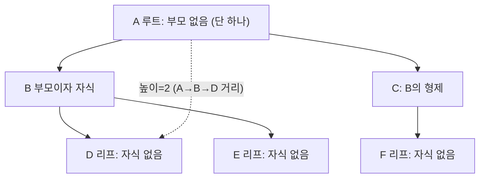
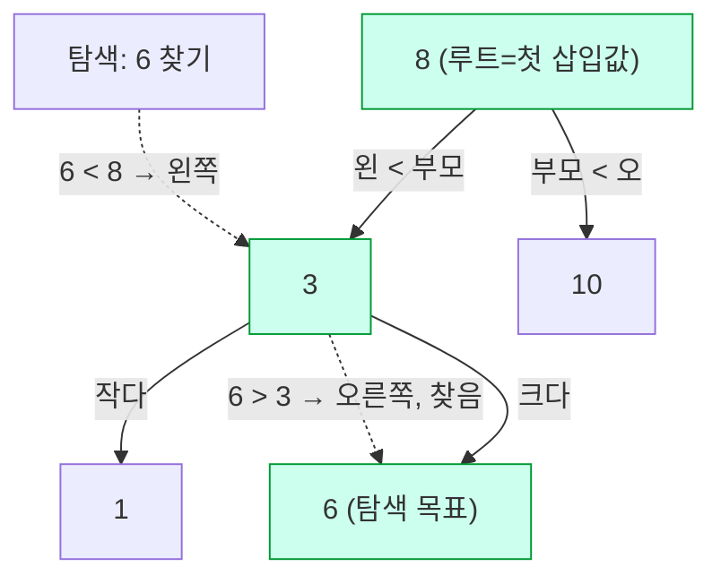
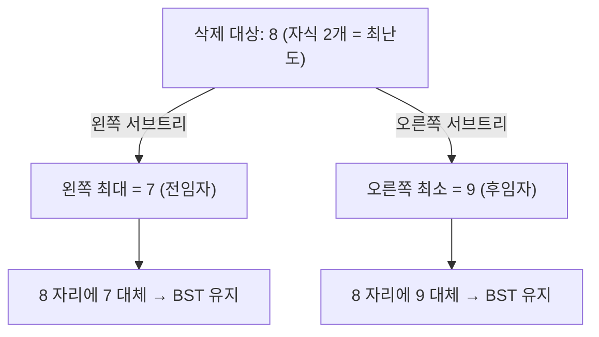
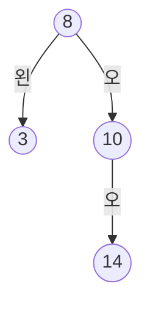
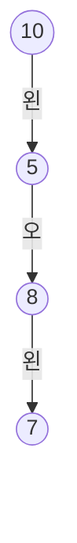

# 자료구조·알고리즘 완전 학습노트 (NotebookLM 영상 제작용)

> 이 문서 하나로 **개념 → 문제 → 왜 이게 답인지**를 한 흐름으로 학습합니다.
> 정렬·문자열 검색·리스트·트리 4개 단원, 총 **160문제**의 풀이와 시각화를 담았습니다.

## NotebookLM에서 영상 만드는 법
1. NotebookLM에 새 노트북을 만들고 **이 .md 파일을 소스로 업로드**하세요. (단원이 많으면 `notebooklm/` 폴더의 챕터별 파일을 각각 소스로 올려도 됩니다.)
2. **Video Overview / 동영상 개요**를 생성하면, 아래 구조(개념→문제→정답 근거)를 따라 내레이션 영상이 만들어집니다.
3. 특정 단원만 영상으로 만들려면 해당 챕터 파일만 소스로 선택하세요.

## 이 노트 읽는 법 (시각화 범례)
- **실행 추적표**: 코드가 한 줄씩 돌 때 `배열 상태`가 어떻게 바뀌는지 단계별로 보여줍니다. (정렬 코드 문제)
- **mermaid 트리 그림**: 이진트리 구조를 도식화합니다. (`왼`=왼쪽 자식, `오`=오른쪽 자식)
- **보기 분석 표**: 각 선지가 정답/오답인 이유를 한 줄로 정리합니다.
- **🖍️ 빠른 풀이전략**: 형광펜으로 볼 곳 → 떠올릴 개념 → 적용 → 암기. 시험장에서 바로 쓰는 순서입니다.


---

# Ch09 트리

*트리 용어 · 순회 · 이진 검색 트리(BST)*

## 🎬 영상 도입 설명

이번 단원에서는 자료구조의 꽃이라 불리는 트리를 만나봅니다. 트리는 노드들을 부모와 자식 관계로 잇는 비선형 계층 자료구조로, 하나의 뿌리에서 시작해 사이클 없이 가지를 뻗어 나가죠. 마치 한 명의 시조 할아버지에서 시작해 자손들이 갈라져 나가는 가계도를 떠올리면 친근할 거예요. 먼저 루트와 부모, 자식 같은 트리 용어를 익히고, n개의 노드가 정확히 n-1개의 간선으로 이어진다는 성질을 살펴봅니다. 이어서 전위·중위·후위 순회로 대표되는 DFS와 레벨 순서로 훑는 BFS로 모든 노드를 빠짐없이 방문하는 법을 배우고, 각 노드가 최대 두 자식을 갖는 이진 트리와 배열로 빈틈없이 담기는 완전 이진 트리까지 정리하죠. 마지막으로는 왼쪽은 작고 오른쪽은 큰 규칙을 따르는 이진 검색 트리, 곧 BST에서 탐색과 삽입은 물론 까다로운 삭제까지 다루며, 균형이 잡혔을 때 어떻게 O(log n)의 빠른 처리가 가능한지 함께 확인해 봅시다.

## 개념 빠르게

트리(tree)는 노드를 부모-자식 관계로 잇는 비선형 계층 자료구조다. 하나의 루트에서 시작해 사이클 없이 가지를 뻗으며, n개의 노드는 정확히 n-1개의 간선으로 연결된다. 이진 트리는 각 노드가 최대 두 자식을 갖는 특수 트리이고, 순회(전위·중위·후위=DFS, 레벨=BFS)로 모든 노드를 체계적으로 방문한다. 완전 이진 트리는 배열로 빈틈없이 표현되어 힙의 토대가 되고, 이진 검색 트리(BST)는 "왼쪽 < 부모 < 오른쪽" 규칙으로 탐색·삽입·삭제를 균형 시 O(log n)에 처리한다.

### 1. 트리란 무엇인가

**트리(tree)**는 데이터를 **계층적(부모-자식) 관계**로 표현하는 **비선형(non-linear)** 자료구조다. 배열이나 연결 리스트가 한 줄로 늘어선 선형 구조라면, 트리는 한 노드 아래로 여러 갈래가 뻗어 나간다. 파일 시스템의 폴더 구조, 조직도, HTML DOM, 표현식 파싱 결과가 모두 트리다.

- **단 하나의 루트**에서 시작한다. 루트는 부모가 없는 유일한 노드다.
- 루트를 제외한 모든 노드는 **정확히 하나의 부모**를 가진다.
- **사이클(순환)이 없다.** 어떤 노드에서 출발해 다시 자기 자신으로 돌아오는 경로가 없다.
- 노드가 `n`개이면 간선(edge)은 항상 `n-1`개다(루트만 부모로 가는 간선이 없으므로).

> **주의** "모든 노드는 반드시 부모를 가진다"는 **틀린** 설명이다. **루트는 부모가 없다.** 루트를 제외한 나머지 노드만 부모를 하나씩 갖는다. 시험 단골 함정이다.


#### 1-1. 핵심 용어 정리

| 용어 | 정의 | 비고 |
| --- | --- | --- |
| 루트(root) | 부모가 없는 최상위 노드 | 트리에 단 하나만 존재 |
| 리프(leaf, 단말) | 자식이 없는 노드 | 차수(degree)가 0인 노드 |
| 내부 노드(internal) | 자식이 하나 이상 있는 노드 | 리프가 아닌 노드 |
| 부모/자식(parent/child) | 바로 위/아래로 연결된 노드 | 간선 하나로 직접 연결 |
| 형제(sibling) | **부모가 같은** 노드들 | 같은 레벨이라도 부모가 다르면 형제가 아님 |
| 조상/후손(ancestor/descendant) | 위쪽/아래쪽 경로상의 모든 노드 | 부모의 부모, 자식의 자식 … |
| 서브트리(subtree) | 어떤 노드와 그 후손 전체가 이루는 트리 | 재귀 정의의 기반 |


#### 1-2. 차수(degree) · 레벨(level) · 깊이(depth) · 높이(height)

- **차수(degree)** — 한 **노드가 가진 자식의 수**. 트리의 차수는 모든 노드 차수의 최댓값. (이진 트리는 모든 노드의 차수가 0·1·2 중 하나.)
- **레벨(level)** — 루트를 레벨 0(또는 1)으로 두고 한 단계 내려갈 때마다 1씩 증가. 같은 레벨이라고 형제는 아니다.
- **깊이(depth)** — 특정 노드에서 **루트까지**의 간선 수. 루트의 깊이는 0.
- **높이(height)** — **루트에서 가장 먼 리프까지의 거리(가장 긴 경로의 간선 수)**. 트리 전체의 높이 = 루트의 높이.

> **주의** **높이는 "노드 개수"가 아니다.** 높이는 루트에서 가장 깊은 리프까지의 **경로 길이(거리)**다. 또한 "전체 노드 수", "루트의 차수", "리프 개수" 중 어느 것도 높이가 아니다. 노드 하나뿐인 트리의 높이는 0이다.


### 2. 이진 트리(binary tree)

**이진 트리**는 모든 노드가 **최대 두 개**의 자식(왼쪽 자식·오른쪽 자식)을 갖는 트리다. 자식이 0개·1개·2개일 수 있으며, 왼쪽과 오른쪽은 **구분된다**(자식이 하나여도 그것이 왼쪽인지 오른쪽인지가 의미를 가진다). 트리·순회·BST·힙 모두 이 이진 트리를 기반으로 한다.

| 종류 | 조건 | 특징 |
| --- | --- | --- |
| 정 이진 트리(full) | 모든 노드가 자식 0개 또는 2개 | 자식이 1개인 노드가 없음 |
| 완전 이진 트리(complete) | 마지막 레벨 빼고 꽉 차고, 마지막은 왼쪽부터 채움 | 배열로 빈틈없이 표현 → 힙 |
| 포화 이진 트리(perfect) | 모든 레벨이 완전히 꽉 참 | 리프가 모두 같은 레벨, 노드 수 = 2^(h+1)-1 |
| 편향 트리(skewed) | 모든 노드가 한쪽 자식만 가짐 | 사실상 연결 리스트, 높이 = n-1 |


### 3. 트리 순회(traversal)

**순회**는 트리의 모든 노드를 **빠짐없이 한 번씩** 정해진 규칙으로 방문하는 것이다. 크게 **깊이 우선(DFS)**과 **너비 우선(BFS)**으로 나뉜다. DFS는 다시 현재 노드를 언제 방문하느냐에 따라 **전위·중위·후위**로 갈린다.


#### 3-1. DFS vs BFS

- **DFS(깊이 우선 탐색, Depth-First Search)** — 한 경로를 **리프까지 깊게** 내려갔다가 막히면 되돌아와 다른 가지로 간다. **전위·중위·후위**가 모두 DFS다. 보통 재귀(또는 스택)로 구현한다.
- **BFS(너비 우선 탐색, Breadth-First Search)** — **같은 레벨**을 모두 방문한 뒤 다음 레벨로 내려간다. **레벨 순회(level order)**가 BFS다. **큐(queue)**로 구현한다.

> **주의** **레벨 순회(level order)는 DFS가 아니라 BFS다.** "DFS에 해당하지 않는 순회"를 묻는 문제의 정답은 항상 level order다. 전위·중위·후위만 DFS임을 기억하자.


#### 3-2. 세 가지 DFS 순회 — 방문 순서

세 순회의 차이는 **현재 노드(N)를 왼쪽 서브트리(L)·오른쪽 서브트리(R)에 대해 언제 찍느냐** 하나뿐이다. 왼쪽을 오른쪽보다 먼저 보는 것은 셋 다 공통이다.

| 순회 | 방문 순서 | 현재 노드 위치 | 분류 |
| --- | --- | --- | --- |
| 전위(preorder) | **노드 → 왼쪽 → 오른쪽** (N L R) | 맨 처음 | DFS |
| 중위(inorder) | **왼쪽 → 노드 → 오른쪽** (L N R) | 가운데 | DFS |
| 후위(postorder) | **왼쪽 → 오른쪽 → 노드** (L R N) | 맨 마지막 | DFS |
| 레벨(level order) | **위 레벨부터 좌→우** | 레벨 단위 | BFS |

- **전위**는 현재 노드를 **가장 먼저** 방문한다 → 트리를 복사하거나 구조를 위에서부터 출력할 때.
- **중위**는 현재 노드를 **가운데** 방문한다 → **BST에서 오름차순 정렬** 결과를 얻을 때.
- **후위**는 현재 노드를 **가장 마지막**에 방문한다 → 자식을 먼저 처리해야 하는 경우(서브트리 삭제, 디렉터리 용량 계산, 후위 표기식).

**예시.** 루트 8, 왼쪽 3, 오른쪽 10, 10의 오른쪽 14인 트리에서 — 전위: `8 3 10 14` / 중위: `3 8 10 14` / 후위: `3 14 10 8` / 레벨: `8 3 10 14`. 중위 결과가 오름차순임에 주목.

> 🔗 인터랙티브 시각화(웹): **TraversalCompareViz** — 직접 값을 넣어 단계 실행할 수 있는 도구.

> **TIP** 위 시각화에서 같은 트리를 전위·중위·후위·레벨로 동시에 순회하며 방문 순서가 어떻게 달라지는지 비교해 보세요. 손으로는 "현재 노드를 언제 찍는가(N의 위치)"만 바꿔가며 따라 적으면 됩니다.


### 4. 완전 이진 트리와 배열 표현

**완전 이진 트리(complete binary tree)**는 **마지막 레벨을 제외한 모든 레벨이 꽉 차 있고**, **마지막 레벨은 왼쪽부터 빈틈없이 채워진** 이진 트리다. 마지막 레벨이 끝까지 꽉 찰 필요는 없지만, 중간에 구멍이 생기거나 오른쪽부터 채워서는 안 된다. 이 "왼쪽부터 빈틈없음" 덕분에 **배열에 인덱스 순서대로** 담을 수 있고, 힙(heap)이 바로 이 표현을 쓴다.

> **주의** 오개념 정리 — ① 완전 이진 트리의 **마지막 레벨이 반드시 꽉 찰 필요는 없다**(꽉 차면 포화 이진 트리). ② 채우는 방향은 **왼쪽부터**(오른쪽부터·임의 순서 X). ③ "모든 노드가 반드시 두 자식을 가진다"는 조건은 완전 이진 트리가 아니라 정/포화 트리 쪽 이야기다.


#### 4-1. 0-기반 인덱스 매핑 공식

배열의 인덱스 0을 루트로 두고 레벨 순서(위에서 아래로, 왼쪽에서 오른쪽으로)로 노드를 담으면, 인덱스 `i` 노드의 친척을 **계산만으로** 찾을 수 있다(포인터가 필요 없다).

| 관계 | 인덱스 공식(0-기반) | 예: i=0(루트) | 예: i=1 |
| --- | --- | --- | --- |
| 왼쪽 자식 | `2i + 1` | 1 | 3 |
| 오른쪽 자식 | `2i + 2` | 2 | 4 |
| 부모 | `(i - 1) // 2` (정수 나눗셈) | 루트라 없음 | 0 |

예를 들어 배열 `[A, B, C, D, E, F, G]`(인덱스 0~6)는 루트 A, A의 자식 B·C, B의 자식 D·E, C의 자식 F·G인 포화 이진 트리다. B(i=1)의 왼쪽 자식은 `2·1+1=3`(D), 오른쪽은 `2·1+2=4`(E), 부모는 `(1-1)//2=0`(A)로 정확히 맞는다.

> 🔗 인터랙티브 시각화(웹): **HeapArrayViz** — 직접 값을 넣어 단계 실행할 수 있는 도구.

> **TIP** 위 시각화로 배열 인덱스와 트리 위치가 `2i+1`·`2i+2`·`(i-1)/2` 공식으로 어떻게 대응되는지 직접 확인하세요. (참고: 1-기반 인덱스를 쓰면 공식이 `2i`·`2i+1`·`i//2`로 바뀐다. 시험은 보통 0-기반을 묻는다.)


### 5. 이진 검색 트리(BST)

**이진 검색 트리(Binary Search Tree)**는 정렬 성질을 가진 이진 트리다. 모든 노드에 대해 다음이 성립한다 — **왼쪽 서브트리의 모든 키 < 그 노드의 키 < 오른쪽 서브트리의 모든 키**. 한 마디로 "**왼쪽은 작고, 오른쪽은 크다**". 이 규칙 덕분에 정렬·탐색을 매우 빠르게 처리한다.

> **주의** BST 조건은 **직속 자식뿐 아니라 서브트리 "전체"**에 적용된다. 왼쪽 자식 하나만 부모보다 작으면 되는 게 아니라, 왼쪽 서브트리에 속한 **모든 후손**이 부모보다 작아야 한다. "왼쪽이 부모보다 크다 / 오른쪽이 부모보다 작다"는 조건은 모두 BST가 아니다.


#### 5-1. 중위 순회 = 오름차순 정렬

BST를 **중위 순회(L → N → R)**하면 키가 항상 **오름차순**으로 출력된다. 왼쪽(작은 값)을 먼저, 현재 노드를 가운데, 오른쪽(큰 값)을 나중에 방문하니 자연히 정렬된다. 이것이 BST의 대표적 장점이다(별도 정렬 없이 정렬된 순서를 뽑아낼 수 있다).

> **주의** **중위 순회 결과만으로는 트리 모양(루트)을 하나로 특정할 수 없다.** 예컨대 중위 결과가 `[1, 3, 5, 7, 9]`라면 이 정렬 수열을 만드는 BST는 여러 개이고, 따라서 **어떤 값이든 루트가 될 수 있다**. 같은 값 집합도 삽입 순서에 따라 모양이 달라진다.


#### 5-2. 탐색(search)과 삽입(insert)

BST의 탐색·삽입은 **루트에서 시작**해 찾는 키와 현재 노드를 비교하고, **작으면 왼쪽 / 크면 오른쪽**으로 **한 방향씩만** 내려간다. 매 단계마다 후보의 절반을 버리므로 이진 탐색과 같은 원리다.

- **탐색** — 루트와 비교 → 같으면 발견, 작으면 왼쪽으로, 크면 오른쪽으로. 리프를 지나 빈 자리에 도달하면 "없음".
- **삽입** — 탐색과 똑같이 내려가다가 **빈 자리(없는 자식)에 도달하면 거기에 새 노드를 단다.** 항상 리프 위치에 매달리며, 기존 노드의 값을 바꾸지 않는다.
- **한 방향 원칙** — 양쪽을 동시에 보지 않는다. 비교 결과에 따라 왼쪽 "또는" 오른쪽 하나만 따라간다.
- **루트는 첫 삽입값** — 처음 넣은 값이 루트가 되고, 이후 값은 모두 그 아래로 들어간다.

**탐색 예시.** 루트 10, 왼쪽 5, 5의 오른쪽 8, 8의 왼쪽 7인 트리에서 7을 찾으면 — 7<10이라 왼쪽 5로, 7>5라 오른쪽 8로, 7<8이라 왼쪽 7로 이동 → 경로 `10 → 5 → 8 → 7`, 비교 4회. **삽입 예시.** `[8, 3, 10, 1, 6, 14]`를 차례로 넣으면 8이 루트, 3은 왼쪽, 10은 오른쪽, 1은 3의 왼쪽, 6은 8>6→왼쪽 3, 3<6→오른쪽이라 **3의 오른쪽 자식**이 되고, 14는 10의 오른쪽 자식이 된다.

> **TIP** 아래 **메인 시각화**에서 값을 직접 삽입해 BST를 만들고, 값을 탐색하면 비교 경로가 강조됩니다. 전위/중위/후위/레벨 순회도 애니메이션으로 확인할 수 있습니다.

> 🔗 인터랙티브 시각화(웹): **BSTVisualizer** — 직접 값을 넣어 단계 실행할 수 있는 도구.


#### 5-3. 균형 BST vs 편향 BST — 성능

BST의 모든 연산 비용은 **트리의 높이**에 비례한다. 한 번 비교할 때마다 한 레벨씩 내려가기 때문이다. 그래서 **같은 데이터라도 모양(높이)에 따라 성능이 극과 극**으로 갈린다.

- **균형(balanced) BST** — 좌우가 고르게 퍼져 높이가 약 `log₂ n`. 탐색·삽입·삭제 모두 **O(log n)**.
- **편향(skewed) BST** — **정렬된 순서**(예: 1,2,3,4,5)로 삽입하면 한쪽으로만 매달려 사실상 연결 리스트가 된다. 높이가 `n-1`이라 모든 연산이 **O(n)**으로 악화.
- 따라서 **가장 비효율적인 경우는 "한쪽으로 치우친(편향된) 상태"**다.

| 연산 | 균형 BST | 편향 BST(최악) |
| --- | --- | --- |
| 탐색(search) | O(log n) | O(n) |
| 삽입(insert) | O(log n) | O(n) |
| 삭제(delete) | O(log n) | O(n) |
| 높이(height) | 약 log₂ n | n - 1 |

> **주의** BST는 **"모든 경우 O(log n)을 보장하지 않는다."** 또한 **"항상 O(1) 탐색"도 불가능**하다. O(log n)은 **균형이 잡혔을 때만** 성립하고, 정렬된 입력 등으로 편향되면 O(n)까지 나빠진다. 항상 O(log n)을 보장하려면 AVL·레드블랙 트리 같은 **자가 균형 BST**가 필요하다.

> 🔗 인터랙티브 시각화(웹): **BSTShapeViz** — 직접 값을 넣어 단계 실행할 수 있는 도구.

> **TIP** 위 시각화에서 **같은 값들을 다른 삽입 순서**로 넣어 보세요. 정렬된 순서로 넣으면 한쪽으로 길게 늘어지고(높이↑, O(n)), 가운데 값부터 골고루 넣으면 균형이 잡혀 높이가 낮아집니다(O(log n)).


#### 5-4. 삭제(delete) — 세 가지 경우

삭제는 지운 뒤에도 **BST 조건이 유지**되어야 해서 가장 까다롭다. 삭제할 노드의 **자식 수**에 따라 세 경우로 나뉜다.

| 경우 | 상황 | 처리 방법 |
| --- | --- | --- |
| ① 자식 0개(리프) | 단말 노드 삭제 | 그냥 떼어낸다(부모의 해당 자식 링크를 끊음). |
| ② 자식 1개 | 왼쪽 또는 오른쪽 자식만 있음 | 그 하나뿐인 자식(서브트리)을 부모에 그대로 잇는다. |
| ③ 자식 2개 | 왼쪽·오른쪽 자식 모두 있음 | **전임자 또는 후임자**로 값을 대체한 뒤, 그 대체 노드를 다시 삭제(가장 복잡). |

**자식이 2개인 노드**를 삭제할 때는 그 자리에 들어가도 정렬이 깨지지 않는 값, 즉 **바로 직전 값(전임자) 또는 바로 다음 값(후임자)**으로 키를 바꿔 끼운다.

- **전임자(predecessor)** = **왼쪽 서브트리의 최댓값**. 왼쪽 서브트리에서 오른쪽으로 끝까지 내려가면 나온다.
- **후임자(successor)** = **오른쪽 서브트리의 최솟값**. 오른쪽 서브트리에서 왼쪽으로 끝까지 내려가면 나온다.
- 대체값은 자식이 0개 또는 1개인 노드이므로, 값을 옮긴 뒤 ①·② 경우로 다시 간단히 제거한다.

> **주의** BST 삭제에서 **가장 복잡한 경우는 "자식이 2개인 노드"**다(자식 0개·1개는 단순 연결 처리). 이때 대체값으로는 반드시 **왼쪽 서브트리 최댓값(전임자)** 또는 **오른쪽 서브트리 최솟값(후임자)**을 쓴다. "임의 노드와 교환"하거나 "전체 재정렬"하는 것이 아니다.


### 6. 한눈에 정리

| 주제 | 핵심 | 자주 틀리는 점 |
| --- | --- | --- |
| 트리 용어 | 루트는 1개·부모 없음 / 높이 = 가장 긴 경로 길이 | 루트도 부모가 있다(X), 높이=노드 수(X) |
| 순회 분류 | 전위·중위·후위 = DFS / 레벨 = BFS | 레벨 순회를 DFS로 착각 |
| 순회 순서 | 전위 NLR · 중위 LNR · 후위 LRN | N(현재 노드)을 찍는 위치만 다름 |
| 완전 이진 트리 | 마지막 레벨 왼쪽부터 / 배열 표현 | 마지막 레벨도 꽉 차야 한다(X) |
| 배열 인덱스 | 자식 2i+1·2i+2 / 부모 (i-1)//2 | 1-기반(2i·2i+1)과 혼동 |
| BST 조건 | 왼쪽<부모<오른쪽 (서브트리 전체) | 직속 자식만 비교(X) |
| BST 중위 | 오름차순 정렬 결과 | 중위로 루트를 특정 가능(X) |
| BST 성능 | 균형 O(log n) / 편향 O(n) | 항상 O(log n) 보장(X), O(1)(X) |
| BST 삭제 | 자식 2개가 최악 / 전임자·후임자로 대체 | 임의 교환·전체 재정렬(X) |


## 핵심 한눈에 (치트시트)

### 트리 한 장 요약

트리는 **루트 하나**에서 부모→자식으로 가지를 뻗는 **비선형·계층** 구조. 핵심은 셋: **용어**(높이=거리 ≠ 개수), **순회**(DFS 3종 + BFS), **BST**(왼<부모<오).


#### 순회 4종 — 방문 순서로 외운다

| 순회 | 방문 순서 | 분류 | 핵심 |
| --- | --- | --- | --- |
| 전위 preorder | **노드**→왼→오 | DFS | 뿌리 먼저(루트 first) |
| 중위 inorder | 왼→**노드**→오 | DFS | BST면 **오름차순** |
| 후위 postorder | 왼→오→**노드** | DFS | 뿌리 마지막(루트 last) |
| 레벨 level order | 위 레벨부터 좌→우 | BFS | 큐 사용, 층층이 |

> **TIP** 암기: 전·중·후는 **노드를 언제 찍느냐**로 구분 — 앞(前)·가운데(中)·뒤(後). 왼→오 순서는 셋 다 동일. **level order만 BFS**, 나머지 셋은 DFS.


#### BST 복잡도 — 모양이 운명

| 상태 | 높이 | 탐색·삽입·삭제 |
| --- | --- | --- |
| 균형 잡힘 | `log n` | **O(log n)** |
| 치우침(정렬 삽입) | `n` | **O(n)** — 리스트처럼 |

> **주의** **정렬된 순서로 삽입**하면(1,2,3,4,5…) 한쪽으로만 매달려 사실상 연결 리스트가 된다 → O(n). BST는 "항상 O(log n) 보장"이 **아니다**(자가 균형 트리라야 보장).


#### 완전 이진 트리 배열 공식

| 관계 | 0-기반 인덱스 i |
| --- | --- |
| 왼쪽 자식 | `2i + 1` |
| 오른쪽 자식 | `2i + 2` |
| 부모 | `(i - 1) // 2` |

> **TIP** 암기: **2i+1·2i+2 = 왼·오 자식** (홀수가 왼쪽, 짝수가 오른쪽). 힙이 이 표현을 그대로 쓴다.


#### BST 삭제 — 자식 수로 분기

| 자식 수 | 처리 |
| --- | --- |
| 0개 (리프) | 그냥 삭제 |
| 1개 | 하나뿐인 자식을 끌어올려 잇기 |
| 2개 (최난도) | **왼쪽 최댓값(전임자)** 또는 **오른쪽 최솟값(후임자)**으로 대체 |

> **TIP** 암기: 두 자식 삭제 = **"왼끝(왼쪽 최대) or 오끝(오른쪽 최소)"**로 갈아끼우기. 두 후보 모두 BST 정렬 순서에서 삭제 노드 바로 옆값이라 조건이 유지된다.

*그림: 순회 분류 한눈에 — DFS 3형제(전·중·후)와 BFS(레벨)*


## 개념별 핵심 + 시각화

### ▸ 트리 용어

루트는 단 하나(부모 없음). 리프=자식 없음, 형제=부모 같음. **높이는 거리(가장 긴 경로)지 노드 개수가 아니다.**

트리는 회사 조직도와 똑같아요. 맨 위 사장님이 루트로 딱 한 명뿐이에요. 부하 직원이 없는 말단 직원이 바로 리프예요. 같은 팀장 밑 직원끼리는 형제이고, 높이는 노드 개수가 아니라 루트에서 가장 먼 리프까지의 거리예요.



**암기**: 루트=부모 없는 1명 / 리프=자식 없는 막내 / 높이=개수 아닌 "거리"(낚시 주의)

### ▸ 순회 (DFS/BFS)

DFS는 한 경로를 끝까지 내려갔다 되돌아옴(전·중·후위). BFS는 레벨 순서(level order). **중위+BST=오름차순.**

이진 검색 트리(BST)를 머릿속에 떠올려 보세요. 트리를 둘러볼 때 '노드 번호를 언제 적느냐'에 따라 순서가 달라지는데, 마치 같은 길을 산책하면서 출발할 때, 한가운데서, 도착할 때 중 언제 사진을 찍느냐로 앨범이 달라지는 것과 같습니다. 전위·중위·후위는 모두 한 길을 끝까지 내려갔다 되돌아오는 DFS이고, 레벨 순서로 훑는 것만 BFS인데, 특히 BST를 중위로 순회하면 결과가 오름차순으로 정렬되어 나오기 때문에 정렬이나 탐색에서 아주 유용하게 쓰입니다.

```text
순회: 같은 트리라도 노드를 "언제" 방문 기록하느냐로 순서가 갈린다

            (4)
           /   \
         (2)   (6)
        /  \   /  \
      (1) (3)(5) (7)

전위 Preorder   부모→왼→오 :  4 2 1 3 6 5 7
중위 Inorder    왼→부모→오 :  1 2 3 4 5 6 7   ← BST면 오름차순!
후위 Postorder  왼→오→부모 :  1 3 2 5 7 6 4
레벨 BFS        위에서 줄별 :  4 2 6 1 3 5 7
```

**암기**: 노드 찍는 시점: 전(앞)·중(가운데)·후(뒤) / level order만 BFS, 나머지 셋은 DFS

### ▸ 이진·완전이진 트리

이진 트리=노드당 자식 최대 2개. 완전 이진 트리=마지막 레벨만 빼고 꽉, 마지막은 **왼쪽부터** 채움. 배열로 i의 왼=2i+1, 오=2i+2.

완전 이진 트리는 마치 극장 좌석을 앞줄부터 빈자리 없이 왼쪽부터 차곡차곡 채우는 것과 같아요. 위에서 아래로, 그리고 왼쪽에서 오른쪽으로 빈틈없이 채워지기 때문에, 트리를 그대로 배열에 담을 수 있죠. 그래서 어떤 노드의 배열 인덱스가 i이면, 왼쪽 자식은 2i 더하기 1, 오른쪽 자식은 2i 더하기 2 자리에 정확히 들어맞아요. 이 깔끔한 규칙 덕분에 힙처럼 트리를 포인터 없이 배열 하나로 간단하게 다룰 수 있어서 아주 유용하답니다.

```text
완전 이진 트리                배열 표현 (i=0 루트)
                              +---+---+---+---+---+---+---+
       A(0)            인덱스 | 0 | 1 | 2 | 3 | 4 | 5 | 6 |
      +--+--+                +---+---+---+---+---+---+---+
   B(1)     C(2)          값 | A | B | C | D | E | F | G |
   +-+      +-+              +---+---+---+---+---+---+---+
 D(3) E(4) F(5) G(6)
                       i=0(A) -> 왼 2i+1=1(B) | 오 2i+2=2(C)  O
왼쪽부터 빈틈없이 채움   i=1(B) -> 왼 2i+1=3(D) | 오 2i+2=4(E)  O
                       i=2(C) -> 왼 2i+1=5(F) | 오 2i+2=6(G)  O
```

**암기**: 완전=빈틈 없이 왼쪽부터 / 배열 공식 2i+1·2i+2 = 왼·오 자식 (힙도 동일)

### ▸ 이진 검색 트리(BST)

모든 노드에서 **왼 < 부모 < 오**. 탐색·삽입은 루트부터 비교해 **한 방향**으로만 내려감. 첫 삽입값이 루트.

이진 검색 트리는 도서관에서 책을 찾는 방식과 비슷해요. 모든 노드에서 왼쪽 자식은 부모보다 작고 오른쪽 자식은 부모보다 크다는 규칙을 지키기 때문에, 찾고 싶은 값이 부모보다 작으면 왼쪽으로, 크면 오른쪽으로 양쪽을 다 뒤지지 않고 한 방향으로만 쭉 내려가면 됩니다. 가장 먼저 넣은 값이 루트가 되고, 이렇게 정리된 트리는 중위 순회를 하면 자동으로 오름차순 정렬 결과가 나와서 탐색과 삽입을 빠르게 처리할 수 있어요. 다만 1, 2, 3처럼 이미 정렬된 순서로 넣으면 한쪽으로만 쏠려 탐색 비용이 O(n)으로 늘어나니 주의해야 합니다.



**암기**: 왼<부모<오 / 탐색=한 방향만 (양쪽 X) / 정렬 순서로 넣으면 한쪽 쏠림→O(n)

### ▸ BST 삭제

자식 0개=바로 삭제, 1개=자식 끌어올리기, **2개=최난도**: 왼쪽 최댓값(전임자) 또는 오른쪽 최솟값(후임자)으로 대체.

BST에서 노드를 지우는 일은 책장에서 책 한 권을 빼는 것과 비슷해요. 자식이 없으면 그냥 빼고, 하나면 그 자식을 끌어올립니다. 가장 까다로운 건 자식이 둘일 때인데, 이때는 왼쪽 서브트리의 최댓값이나 오른쪽 서브트리의 최솟값으로 그 자리를 갈아 끼워 정렬 순서를 그대로 유지해요.



**암기**: 두 자식 삭제 = "왼끝(왼쪽 최대) or 오끝(오른쪽 최소)"로 갈아끼우기 → BST 조건 유지


## 문제 은행 (40문제)

### Q81 · 객관식 · 트리 용어

**문제.** 다음 중 트리(tree)의 특징으로 옳지 않은 것은?

- ① 루트 노드는 하나만 존재한다
- ② 노드는 여러 자식을 가질 수 있다
- ③ **모든 노드는 반드시 부모를 가진다 ✅**
- ④ 트리는 계층적 구조를 표현한다

**정답: ③ 모든 노드는 반드시 부모를 가진다**

> 루트 노드는 부모가 없으므로 "모든 노드가 반드시 부모를 가진다"는 설명이 트리의 성질과 어긋난다.

**왜 이게 답인가**

- 트리는 정확히 하나의 루트(root)를 가지며, 루트는 정의상 부모가 없는 유일한 노드다.
- 따라서 "모든 노드는 반드시 부모를 가진다"는 명제는 루트에 대해 거짓이 된다. n개 노드를 가진 트리의 간선 수는 n-1개이며, 각 간선이 부모-자식 관계 하나에 대응하므로 부모를 가진 노드는 정확히 n-1개(루트 제외)다.
- 문제는 "옳지 않은 것"을 고르라고 했으므로, 잘못된 진술인 ③이 정답이다.

**보기 분석**

| 보기 | 판정 | 이유 |
| --- | --- | --- |
| ① | 오답 | 트리에는 루트가 정확히 하나 존재한다는 것은 트리의 정의에 부합하는 옳은 진술이다. |
| ② | 오답 | 일반 트리에서 한 노드는 임의 개수의 자식을 가질 수 있다(이진 트리만 최대 2개로 제한). 옳은 진술이다. |
| ③ | 정답 | 루트는 부모가 없으므로 "모든 노드가 부모를 가진다"는 거짓이다. 부모를 가진 노드는 루트를 제외한 n-1개뿐이다. |
| ④ | 오답 | 트리는 부모-자식 관계로 계층적(hierarchical) 구조를 표현한다. 옳은 진술이다. |

**핵심 개념**: 루트는 유일하며 부모가 없다 · n개 노드 트리의 간선 수는 n-1 · 부모를 가진 노드 수 = n-1

**⚠️ 함정**: "옳지 않은 것"을 묻는 부정형 문제다. 옳은 보기를 고르지 않도록 질문 방향을 먼저 확인해야 한다.

**🖍️ 빠른 풀이전략**

**무엇을 묻나**: 트리의 특징 중 틀린 것 고르기

- **핵심**: 루트는 '부모가 없는' 단 하나의 노드
- **적용**: '모든 노드가 부모를 가진다'는 루트를 빼먹은 거짓

**한 줄 결론**: 루트는 부모가 없으므로 '모든 노드가 부모를 가진다'는 틀림

**암기**: 루트=족보의 시조(부모 없음)

---

### Q82 · 객관식 · 트리 용어

**문제.** 트리의 높이(height)에 대한 설명으로 가장 적절한 것은?

- ① 전체 노드 수
- ② 루트의 차수
- ③ **루트에서 가장 먼 리프까지의 거리 ✅**
- ④ 리프 노드 개수

**정답: ③ 루트에서 가장 먼 리프까지의 거리**

> 높이는 노드 개수나 차수가 아니라, 루트에서 가장 먼 리프까지의 경로 길이(가장 긴 경로)다.

**왜 이게 답인가**

- 트리의 높이(height)는 루트에서 가장 깊은 리프까지 이르는 경로의 길이로 정의한다(간선 수 기준이 일반적).
- ①은 노드 수(size), ②는 루트의 차수(degree, 자식 수), ④는 리프 개수로 모두 높이와 다른 개념이다.
- 따라서 "루트에서 가장 먼 리프까지의 거리"인 ③이 정답이다.

**보기 분석**

| 보기 | 판정 | 이유 |
| --- | --- | --- |
| ① | 오답 | 전체 노드 수는 트리의 크기(size)이지 높이가 아니다. 크기가 같아도 모양에 따라 높이는 달라진다. |
| ② | 오답 | 루트의 차수는 루트가 가진 자식의 수일 뿐, 트리의 깊이와 무관하다. |
| ③ | 정답 | 높이는 루트에서 가장 먼 리프까지의 거리(가장 긴 경로의 길이)로 정의된다. |
| ④ | 오답 | 리프 노드 개수는 트리의 너비와 관련된 양일 뿐, 높이를 나타내지 않는다. |

**핵심 개념**: 높이 = 루트→가장 깊은 리프 경로 길이 · 높이는 노드 수와 무관 · 간선 기준 높이 vs 노드 기준 깊이의 ±1 차이 주의

**⚠️ 함정**: 교재에 따라 단일 노드의 높이를 0(간선 기준) 또는 1(노드 기준)로 두기도 한다. 어떤 기준이든 "가장 긴 경로"라는 본질은 같다.

**🖍️ 빠른 풀이전략**

**무엇을 묻나**: 트리 높이(height)의 정의 고르기

- **핵심**: 높이 = 루트에서 '가장 먼 리프까지의 거리'
- **적용**: 전체 노드 수·리프 개수·차수는 다른 용어(오답)

**한 줄 결론**: 높이는 루트에서 가장 먼 리프까지의 거리(가장 긴 경로 길이)

**암기**: 높이=개수 아님, '거리(깊이)'다

---

### Q83 · 객관식 · 순회 · DFS/BFS

**문제.** 다음 중 깊이 우선 탐색(DFS)에 해당하지 않는 것은?

- ① preorder
- ② inorder
- ③ postorder
- ④ **level order ✅**

**정답: ④ level order**

> preorder/inorder/postorder는 모두 DFS 계열이고, level order만 BFS(너비 우선)다.

**왜 이게 답인가**

- DFS(깊이 우선)는 한 경로를 리프까지 내려갔다가 되돌아오며 방문한다. 전위·중위·후위가 모두 이 방식이며, 노드를 언제 처리하느냐(앞/중간/뒤)만 다르다.
- level order(레벨 순회)는 같은 깊이의 노드를 모두 방문한 뒤 다음 레벨로 내려가는 방식으로, 큐를 사용하는 BFS(너비 우선)다.
- DFS가 아닌 것을 고르라 했으므로 ④ level order가 정답이다.

**보기 분석**

| 보기 | 판정 | 이유 |
| --- | --- | --- |
| ① | 오답 | preorder(전위, 노드→왼쪽→오른쪽)는 대표적인 DFS 순회다. |
| ② | 오답 | inorder(중위, 왼쪽→노드→오른쪽)도 재귀로 깊이를 따라 내려가는 DFS다. |
| ③ | 오답 | postorder(후위, 왼쪽→오른쪽→노드)도 DFS다. |
| ④ | 정답 | level order는 레벨 단위로 큐를 이용해 방문하는 BFS이므로 DFS에 해당하지 않는다. |

**핵심 개념**: DFS: 전위·중위·후위(스택/재귀) · BFS: 레벨 순회(큐) · 전·중·후위는 노드 처리 시점만 다름

**⚠️ 함정**: 세 가지 DFS 순회의 차이는 "방향"이 아니라 "노드를 처리하는 시점"이다. 자식 방문 순서(왼→오)는 동일하다.

**🖍️ 빠른 풀이전략**

**무엇을 묻나**: DFS가 아닌 순회 고르기

- **핵심**: DFS=전위·중위·후위 / BFS=레벨 순회
- **적용**: level order만 BFS(너비 우선)

**한 줄 결론**: level order는 레벨별로 도는 BFS라 DFS가 아님

**암기**: 전중후=DFS 삼형제 / 레벨=BFS 혼자

---

### Q84 · 객관식 · BST · 순회

**문제.** 중위 순회(inorder)를 수행했을 때 오름차순 결과를 얻을 수 있는 자료구조는?

- ① 일반 트리
- ② 힙
- ③ **이진 검색 트리 ✅**
- ④ 큐

**정답: ③ 이진 검색 트리**

> BST를 중위 순회하면 왼쪽<노드<오른쪽 규칙에 의해 키가 오름차순으로 출력된다.

**왜 이게 답인가**

- 중위 순회는 왼쪽 서브트리 → 노드 → 오른쪽 서브트리 순으로 방문한다.
- BST는 모든 노드에서 왼쪽 서브트리의 키 < 노드 < 오른쪽 서브트리의 키가 성립하므로, 중위 순회 시 항상 더 작은 값부터 출력되어 결과가 정렬(오름차순)된다.
- 일반 트리·힙·큐는 이런 키 순서 불변식이 없으므로 중위 순회가 정렬 결과를 보장하지 않는다. 따라서 ③ 이진 검색 트리가 정답이다.

**보기 분석**

| 보기 | 판정 | 이유 |
| --- | --- | --- |
| ① | 오답 | 일반 트리에는 키의 대소 규칙이 없어 중위 순회 결과가 정렬된다는 보장이 없다. |
| ② | 오답 | 힙은 부모-자식 간 대소 관계(최대/최소 힙)만 만족할 뿐 형제·서브트리 간 순서는 정해지지 않아 중위 순회가 정렬되지 않는다. |
| ③ | 정답 | BST의 왼쪽<노드<오른쪽 불변식 때문에 중위 순회가 오름차순 정렬을 만든다. |
| ④ | 오답 | 큐는 트리가 아닌 선형 자료구조로 중위 순회 개념 자체가 적용되지 않는다. |

**핵심 개념**: BST 중위 순회 = 오름차순 · 힙은 정렬 자료구조가 아니다 · 중위 순회 = 왼→노드→오른쪽

**⚠️ 함정**: 힙도 정렬 트리라는 오해가 흔하다. 힙은 부분 순서(partial order)만 만족하므로 중위 순회해도 정렬되지 않는다.

**🖍️ 빠른 풀이전략**

**무엇을 묻나**: 중위 순회 시 오름차순이 나오는 자료구조

- **핵심**: 중위 순회로 정렬되는 건 BST뿐
- **적용**: 일반 트리·힙·큐는 정렬 보장 없음(오답)

**한 줄 결론**: BST는 왼<부모<오른 규칙이라 중위 순회=오름차순

**암기**: BST 중위=오름차순(시험 단골)

---

### Q85 · 객관식 · BST

**문제.** 다음 중 이진 검색 트리(BST)의 조건으로 옳은 것은?

- ① 왼쪽 서브트리의 모든 키는 부모보다 크다
- ② 오른쪽 서브트리의 모든 키는 부모보다 작다
- ③ **왼쪽은 작고 오른쪽은 크다 ✅**
- ④ 부모와 자식의 값은 항상 같다

**정답: ③ 왼쪽은 작고 오른쪽은 크다**

> BST의 핵심 불변식은 "왼쪽 서브트리는 작고 오른쪽 서브트리는 크다"이다.

**왜 이게 답인가**

- BST는 모든 노드 기준으로 왼쪽 서브트리의 모든 키 < 노드의 키 < 오른쪽 서브트리의 모든 키를 만족해야 한다.
- ①은 왼쪽이 크다고 했고 ②는 오른쪽이 작다고 했으므로 둘 다 규칙이 뒤집혀 있다. ④는 모든 값이 같다는 것으로 키 유일성·정렬 성질을 무시한다.
- "왼쪽은 작고 오른쪽은 크다"는 ③이 BST 조건을 정확히 기술하므로 정답이다.

**보기 분석**

| 보기 | 판정 | 이유 |
| --- | --- | --- |
| ① | 오답 | 왼쪽 서브트리는 부모보다 작아야 한다. "크다"는 BST 규칙을 정반대로 뒤집은 매력적 오답이다. |
| ② | 오답 | 오른쪽 서브트리는 부모보다 커야 한다. "작다"는 역시 규칙을 뒤집은 것이다. |
| ③ | 정답 | 왼쪽<부모<오른쪽이라는 BST의 정의를 정확히 기술한다. |
| ④ | 오답 | 부모와 자식 값이 항상 같다면 탐색 트리로서 의미가 없고, BST는 보통 중복 없는 키를 다룬다. |

**핵심 개념**: BST 불변식: 왼쪽<부모<오른쪽 · 서브트리 전체에 대해 성립 · 키는 일반적으로 유일

**⚠️ 함정**: "왼쪽 자식 < 부모"만 보지 말고 "왼쪽 서브트리 전체 < 부모"임을 기억해야 한다. 자식만 검사하면 손주에서 규칙이 깨질 수 있다.

**🖍️ 빠른 풀이전략**

**무엇을 묻나**: BST의 올바른 조건 고르기

- **핵심**: BST = '왼쪽 작고 오른쪽 큰' 구조
- **적용**: 왼>부모·오른<부모·항상 같음은 모두 반대/거짓(오답)

**한 줄 결론**: 왼쪽 서브트리<부모<오른쪽 서브트리

**암기**: 왼小오大(왼쪽 작고 오른쪽 큼)

---

### Q86 · 객관식 · BST · BST 탐색

**문제.** 다음 중 BST 탐색 과정으로 옳은 것은?

- ① 현재 노드와 비교 후 양쪽 모두 탐색
- ② 항상 왼쪽만 탐색
- ③ **비교 결과에 따라 한 방향만 탐색 ✅**
- ④ 리프부터 탐색 시작

**정답: ③ 비교 결과에 따라 한 방향만 탐색**

> BST 탐색은 현재 노드와 비교해 작으면 왼쪽, 크면 오른쪽으로 한 방향만 내려간다.

**왜 이게 답인가**

- BST 탐색은 루트에서 시작해 찾는 키와 현재 노드를 비교한다. 같으면 발견, 작으면 왼쪽 서브트리로, 크면 오른쪽 서브트리로 이동한다.
- BST 불변식 덕분에 비교 한 번으로 한쪽 서브트리 전체를 버릴 수 있어 양쪽을 모두 볼 필요가 없다(①이 틀린 이유).
- 항상 왼쪽만 가거나(②) 리프부터 시작하는 것(④)은 탐색 원리와 다르다. 따라서 ③ "비교 결과에 따라 한 방향만 탐색"이 정답이다.

**보기 분석**

| 보기 | 판정 | 이유 |
| --- | --- | --- |
| ① | 오답 | 양쪽을 모두 탐색하면 BST의 가지치기 이점이 사라진다. 이는 일반 트리 탐색에 가깝다. |
| ② | 오답 | 항상 왼쪽만 가면 큰 값을 영원히 찾지 못한다. 방향은 비교 결과로 결정된다. |
| ③ | 정답 | 비교 결과(작다/크다)에 따라 왼쪽 또는 오른쪽 한 방향으로만 내려가는 것이 BST 탐색의 핵심이다. |
| ④ | 오답 | 탐색은 루트에서 시작한다. 리프부터 시작하는 것은 BST 탐색이 아니다. |

**핵심 개념**: BST 탐색은 루트에서 시작 · 비교 1회로 절반 가지치기 · 탐색 비용은 트리 높이에 비례

**⚠️ 함정**: 한 방향 탐색이 빠른 이유는 균형이 잡혔을 때다. 치우친 트리에서는 같은 한 방향 탐색이라도 O(n)이 된다.

**🖍️ 빠른 풀이전략**

**무엇을 묻나**: BST 탐색 과정의 특징

- **핵심**: 비교 후 '한 방향'만 내려감(양쪽 탐색 ✗)
- **적용**: 양쪽 모두·항상 왼쪽·리프부터는 거짓(오답)

**한 줄 결론**: 비교 결과에 따라 왼쪽 또는 오른쪽 한 방향만 이동

**암기**: BST 탐색=갈림길에서 한 길만(되돌아옴 없음)

---

### Q87 · 객관식 · BST · 시간복잡도

**문제.** 균형 잡힌 BST에서 탐색 시간복잡도로 가장 적절한 것은?

- ① O(1)
- ② **O(log n) ✅**
- ③ O(n)
- ④ O(n²)

**정답: ② O(log n)**

> 균형 BST의 높이는 약 log n이고 탐색은 높이에 비례하므로 O(log n)이다.

**왜 이게 답인가**

- BST 탐색은 루트에서 리프 방향으로 한 단계씩 내려가므로 비교 횟수는 최대 트리의 높이와 같다.
- 균형이 잡힌 BST는 각 레벨마다 노드 수가 대략 2배씩 늘어나 높이가 약 ⌊log₂ n⌋ 수준이다.
- 따라서 탐색 시간복잡도는 높이에 비례하는 ② O(log n)이 정답이다.

**보기 분석**

| 보기 | 판정 | 이유 |
| --- | --- | --- |
| ① | 오답 | O(1)은 해시 테이블의 평균 탐색 시간이다. BST는 최소한 높이만큼 비교가 필요하다. |
| ② | 정답 | 균형 BST의 높이가 약 log n이고 탐색이 높이에 비례하므로 O(log n)이다. |
| ③ | 오답 | O(n)은 한쪽으로 치우친(불균형) BST의 최악 시간이다. "균형 잡힌" 조건에서는 발생하지 않는다. |
| ④ | 오답 | O(n²)은 단일 탐색의 복잡도로 너무 크며 BST 탐색과 무관하다. |

**핵심 개념**: 탐색 비용 = 트리 높이 · 균형 BST 높이 ≈ log n · 불균형 시 O(n)으로 악화

**⚠️ 함정**: "균형 잡힌"이라는 전제를 놓치면 O(n)을 고르기 쉽다. 일반 BST는 균형을 자동 보장하지 않으며, AVL·레드블랙 트리가 이를 보장한다.

**🖍️ 빠른 풀이전략**

**무엇을 묻나**: 균형 잡힌 BST의 탐색 시간복잡도

- **핵심**: 균형 BST의 높이 ≈ log n
- **적용**: 높이만큼 비교 → O(log n)

**한 줄 결론**: 균형이면 높이가 log n 수준이라 탐색도 O(log n)

**암기**: 균형=반씩 잘라감=log n

---

### Q88 · 객관식 · BST · BST 삽입

**문제.** 다음 값을 순서대로 BST에 삽입할 때 루트 노드는?

- ① 1
- ② 3
- ③ **8 ✅**
- ④ 10

> 그림: 삽입 순서: [8, 3, 10, 1]

**정답: ③ 8**

> BST에서 가장 먼저 삽입한 값이 루트가 되므로, 삽입 순서 [8,3,10,1]의 첫 값 8이 루트다.

**왜 이게 답인가**

- 빈 BST에 첫 값을 삽입하면 그 값이 루트가 된다. 여기서는 8이 첫 삽입값이다.
- 이후 3은 8보다 작아 왼쪽, 10은 커서 오른쪽, 1은 8과 3보다 작아 3의 왼쪽에 들어간다. 어떤 후속 삽입도 루트를 바꾸지 않는다.
- 따라서 루트는 ③ 8이다.

**보기 분석**

| 보기 | 판정 | 이유 |
| --- | --- | --- |
| ① | 오답 | 1은 마지막에 3의 왼쪽 자식으로 들어간 가장 작은 값으로, 루트가 아니다. |
| ② | 오답 | 3은 8의 왼쪽 자식이다. 루트는 첫 삽입값이어야 한다. |
| ③ | 정답 | 첫 번째 삽입값 8이 루트가 된다. 일반 BST 삽입은 루트를 교체하지 않는다. |
| ④ | 오답 | 10은 8의 오른쪽 자식이다. 값이 가장 크다고 루트가 되는 것은 아니다. |

**핵심 개념**: 첫 삽입값이 루트 · BST 삽입은 루트를 바꾸지 않음 · 값의 크기와 루트 여부는 무관

**⚠️ 함정**: 가장 작거나 가장 큰 값이 루트일 거라는 직관은 틀리다. 루트는 오직 "삽입 순서"가 결정한다(회전이 없는 일반 BST 기준).

**🖍️ 빠른 풀이전략**

**무엇을 묻나**: 삽입 순서 [8,3,10,1]의 루트 찾기

- **핵심**: BST 루트 = '맨 처음 삽입한 값'
- **적용**: 첫 값이 8 → 이후 삽입은 루트 안 바꿈

**한 줄 결론**: 첫 번째로 삽입한 8이 루트

**암기**: 루트=1빠로 들어온 값(크기 무관)

---

### Q89 · 객관식 · BST · BST 삽입

**문제.** 다음 값을 BST에 순서대로 삽입했을 때 6의 부모 노드는?

- ① 1
- ② **3 ✅**
- ③ 8
- ④ 10

> 그림: 삽입 순서: [8, 3, 10, 1, 6, 14]

**정답: ② 3**

> 8→3 경로에서 6은 3보다 크고 8보다 작아 3의 오른쪽 자식으로 들어가므로 부모는 3이다.

**왜 이게 답인가**

- 삽입 순서 [8,3,10,1,6,14]에서 6을 삽입할 시점의 트리는 루트 8, 왼쪽 3(그 왼쪽에 1), 오른쪽 10이다.
- 6을 넣을 때: 6 < 8 이므로 왼쪽(3)으로 이동, 6 > 3 이므로 3의 오른쪽으로 이동. 3의 오른쪽 자리는 비어 있어 6이 거기에 들어간다.
- 따라서 6의 부모는 ② 3이다.

**보기 분석**

| 보기 | 판정 | 이유 |
| --- | --- | --- |
| ① | 오답 | 1은 3의 왼쪽 자식이며 6과 부모-자식 관계가 아니다. 6은 1을 거치지 않는다. |
| ② | 정답 | 6은 8의 왼쪽(3)으로 내려간 뒤 3보다 크므로 3의 오른쪽 자식이 된다. 부모는 3이다. |
| ③ | 오답 | 8은 6의 조상이지만 직접 부모는 아니다. 6은 8 아래 3까지 한 단계 더 내려간다. |
| ④ | 오답 | 10은 8의 오른쪽 서브트리에 있고 6(8보다 작음)은 그쪽으로 가지 않는다. |

**핵심 개념**: 삽입 경로를 루트부터 추적 · 부모는 직접 위 노드(조상 전체가 아님) · 6 < 8, 6 > 3 비교 추적

**⚠️ 함정**: "부모"와 "조상"을 혼동해 8을 고르기 쉽다. 부모는 마지막으로 비교를 멈춘 직전 노드인 3이다.

**🖍️ 빠른 풀이전략**

**무엇을 묻나**: 삽입 순서 [8,3,10,1,6,14]에서 6의 부모 찾기

- **핵심**: 6을 루트부터 내려보낸 '직전 노드'가 부모
- **적용**: 6<8→왼(3), 6>3→3의 오른쪽 빈자리. 멈춘 직전=3

**한 줄 결론**: 6은 8 아래 3까지 내려가 3의 오른쪽 자식 → 부모는 3

**암기**: 부모=마지막으로 비교한 노드(조상 8 아님 주의)

---

### Q90 · 객관식 · BST · BST 탐색

**문제.** 다음 BST에서 key=14 탐색 시 비교 횟수는?

- ① 1
- ② 2
- ③ **3 ✅**
- ④ 4

**트리 그림**



**정답: ③ 3**

> 14 탐색 경로는 8→10→14로, 세 노드와 비교하므로 비교 횟수는 3이다.

**왜 이게 답인가**

- 트리는 루트 8, 왼쪽 자식 3, 오른쪽 자식 10, 10의 오른쪽 자식 14다.
- 14 탐색: ① 루트 8과 비교 → 14>8, 오른쪽으로. ② 10과 비교 → 14>10, 오른쪽으로. ③ 14와 비교 → 일치, 발견.
- 비교한 노드는 8, 10, 14로 총 3개이므로 정답은 ③ 3이다.

**보기 분석**

| 보기 | 판정 | 이유 |
| --- | --- | --- |
| ① | 오답 | 1회 비교로는 루트 8만 보는 것인데 14는 루트가 아니어서 발견되지 않는다. |
| ② | 오답 | 2회 비교(8,10)로는 아직 14에 도달하지 않는다. 한 단계 더 내려가야 한다. |
| ③ | 정답 | 8 → 10 → 14 순으로 세 노드와 비교해 14를 찾으므로 비교 횟수는 3이다. |
| ④ | 오답 | 경로 길이가 3노드이므로 4회 비교는 발생하지 않는다. |

**핵심 개념**: 비교 횟수 = 루트부터 목표까지의 노드 수 · 탐색 경로 깊이 추적 · 발견 시점의 비교도 1회로 셈

**⚠️ 함정**: 간선 수(2개)와 비교 횟수(3회)를 혼동하기 쉽다. "비교 횟수"는 방문한 노드 수이므로 경로의 노드 개수로 센다.

**🖍️ 빠른 풀이전략**

**무엇을 묻나**: key=14 탐색 시 비교 횟수 (트리: 8-3 / 8-10-14)

- **핵심**: 비교 횟수 = 루트부터 목표까지 '노드 개수'
- **적용**: 8→10→14 세 노드 비교 → 3회

**한 줄 결론**: 8, 10, 14 세 노드를 비교하므로 3회

**암기**: 비교=거친 노드 수(간선 2개와 헷갈리지 말 것)

---

### Q91 · 객관식 · BST · 시간복잡도

**문제.** 다음 중 BST에서 가장 비효율적인 경우는?

- ① 균형 잡힌 상태
- ② 무작위 삽입
- ③ **한쪽으로 치우친 상태 ✅**
- ④ 완전 이진 트리 형태

**정답: ③ 한쪽으로 치우친 상태**

> 한쪽으로 치우친 BST는 연결 리스트처럼 되어 높이가 n에 가까워져 탐색이 O(n)으로 가장 비효율적이다.

**왜 이게 답인가**

- BST의 탐색 효율은 트리 높이에 의해 결정된다. 높이가 낮을수록(균형) 빠르고, 높을수록(치우침) 느리다.
- 정렬된 순서로 삽입하는 등으로 한쪽 자식만 계속 생기면 트리가 사실상 연결 리스트가 되어 높이가 n-1, 탐색이 O(n)이 된다.
- 따라서 가장 비효율적인 경우는 ③ "한쪽으로 치우친 상태"다.

**보기 분석**

| 보기 | 판정 | 이유 |
| --- | --- | --- |
| ① | 오답 | 균형 잡힌 상태는 높이가 약 log n으로 가장 효율적인(빠른) 경우다. |
| ② | 오답 | 무작위 삽입은 평균적으로 높이가 O(log n)에 가까워 비교적 효율적이다. |
| ③ | 정답 | 한쪽으로 치우치면 연결 리스트와 같아져 높이 n-1, 탐색 O(n)으로 가장 비효율적이다. |
| ④ | 오답 | 완전 이진 트리 형태는 높이가 약 log n으로 매우 효율적인 경우다. |

**핵심 개념**: 효율은 트리 높이에 의해 결정 · 치우친 BST = 연결 리스트 = O(n) · 정렬 삽입이 치우침의 흔한 원인

**⚠️ 함정**: 치우침의 원인은 데이터가 "정렬되어" 삽입될 때다. 정렬된 입력이 BST에는 오히려 최악이라는 점이 직관에 반한다.

**🖍️ 빠른 풀이전략**

**무엇을 묻나**: BST에서 가장 비효율적인 경우

- **핵심**: 효율은 '높이'가 결정 → 높이 클수록 느림
- **적용**: 한쪽 치우침=연결 리스트=높이 n=O(n)

**한 줄 결론**: 한쪽으로 치우치면 리스트처럼 되어 탐색이 O(n)

**암기**: 치우침=막대기 트리=최악

---

### Q92 · 객관식 · BST · BST 삽입

**문제.** 다음 데이터를 순서대로 BST에 삽입할 때 트리 높이가 가장 높아질 가능성이 높은 것은?

- ① 5, 3, 7, 1, 9
- ② **1, 2, 3, 4, 5 ✅**
- ③ 4, 2, 6, 1, 3
- ④ 8, 4, 10, 2, 6

**정답: ② 1, 2, 3, 4, 5**

> 이미 정렬된 [1,2,3,4,5]를 순서대로 삽입하면 매번 오른쪽 자식만 생겨 높이가 최대(편향 트리)가 된다.

**왜 이게 답인가**

- BST 높이는 삽입 순서에 따라 달라진다. 각 삽입 시 직전까지의 모든 값보다 크거나 작은 값이 연속으로 들어오면 한쪽 가지만 길어진다.
- [1,2,3,4,5]는 오름차순이라 1을 루트로 2,3,4,5가 차례로 오른쪽 자식으로만 붙어 높이 4(노드 5개의 일렬 트리)가 된다.
- 나머지 보기들은 루트보다 작은 값과 큰 값이 섞여 양쪽으로 분기하므로 높이가 더 낮다. 따라서 정답은 ② [1,2,3,4,5]이다.

**보기 분석**

| 보기 | 판정 | 이유 |
| --- | --- | --- |
| ① | 오답 | 5,3,7,1,9는 5를 기준으로 3,1은 왼쪽, 7,9는 오른쪽으로 갈라져 균형에 가깝다(높이 약 2). |
| ② | 정답 | 오름차순 [1,2,3,4,5]는 매 삽입이 오른쪽 자식만 만들어 연결 리스트형 편향 트리(높이 4)가 된다. |
| ③ | 오답 | 4,2,6,1,3은 4 아래 2(왼쪽)·6(오른쪽)로 갈라지고 1,3이 2의 양쪽에 붙어 균형적이다. |
| ④ | 오답 | 8,4,10,2,6은 8 아래로 양쪽 분기가 일어나 높이가 낮게 유지된다. |

**핵심 개념**: 정렬된 입력 → 편향 트리(최악 높이) · 양쪽 분기가 일어나면 높이가 낮아짐 · 높이는 삽입 순서에 의존

**⚠️ 함정**: 내림차순(예: 5,4,3,2,1)도 똑같이 편향 트리를 만든다. "정렬"의 방향과 무관하게 단조 입력이 최악이다.

**🖍️ 빠른 풀이전략**

**무엇을 묻나**: 삽입 시 트리 높이가 가장 높아지는 데이터

- **핵심**: '정렬된(단조) 입력'이 한쪽 가지만 길게 만듦
- **적용**: [1,2,3,4,5]는 오른쪽 자식만 줄줄이 → 높이 최대

**한 줄 결론**: 오름차순 [1,2,3,4,5]는 편향 트리(막대기)가 됨

**암기**: 정렬 입력=BST에는 독약(편향)

---

### Q93 · 객관식 · BST · 순회

**문제.** BST를 중위 순회했을 때 결과가 다음과 같다면 루트가 될 수 있는 값은?

- ① 1
- ② 5
- ③ 9
- ④ **모두 가능 ✅**

> 그림: 중위 순회 결과: [1, 3, 5, 7, 9]

**정답: ④ 모두 가능**

> 중위 순회 결과(정렬된 키 집합)만으로는 트리 모양이 유일하게 정해지지 않아 어떤 값이든 루트가 될 수 있다.

**왜 이게 답인가**

- BST의 중위 순회는 항상 키의 오름차순을 출력한다. 즉 [1,3,5,7,9]라는 결과는 "이 다섯 키로 만든 어떤 BST"라도 모두 동일하게 나온다.
- 같은 키 집합으로 만들 수 있는 BST는 여러 가지(카탈란 수만큼)이며, 삽입 순서에 따라 루트가 1,3,5,7,9 중 무엇이든 될 수 있다.
- 따라서 중위 결과만으로 루트를 특정할 수 없으므로 정답은 ④ "모두 가능"이다.

**보기 분석**

| 보기 | 판정 | 이유 |
| --- | --- | --- |
| ① | 오답 | 1을 루트로 두면(1을 먼저 삽입) 가능은 하지만, 루트가 반드시 1이어야 하는 것은 아니다. |
| ② | 오답 | 5는 균형 트리의 루트일 수 있으나, 중위 결과만으로 루트가 5라고 단정할 근거가 없다. |
| ③ | 오답 | 9 역시 루트가 될 수 있지만 유일한 답은 아니다. |
| ④ | 정답 | 중위 순회 결과는 정렬일 뿐 트리 구조 정보를 담지 않아, 다섯 값 모두 루트가 될 수 있다. |

**핵심 개념**: 중위 순회만으로 트리 복원 불가 · n개 키로 만들 수 있는 BST 수 = 카탈란 수 · 루트를 정하려면 전위/후위 등 추가 정보 필요

**⚠️ 함정**: "중위 + 전위" 또는 "중위 + 후위"가 함께 주어지면 트리를 유일하게 복원할 수 있다. 중위 하나만으로는 불가능하다는 점이 핵심이다.

**🖍️ 빠른 풀이전략**

**무엇을 묻나**: 중위 결과 [1,3,5,7,9]일 때 루트가 될 수 있는 값

- **핵심**: 중위 순회는 '정렬'만 알려줌, 모양은 모름
- **적용**: 삽입 순서에 따라 1~9 누구든 루트 가능

**한 줄 결론**: 중위 하나만으론 트리 모양을 못 정해 모두 가능

**암기**: 트리 복원=중위+전위(또는 후위) 둘 필요

---

### Q94 · 객관식 · BST · BST 탐색

**문제.** BST에서 key=7을 탐색할 때 올바른 이동 순서는?

- ① **10 → 5 → 8 → 7 ✅**
- ② 10 → 8 → 7
- ③ 5 → 8 → 7
- ④ 10 → 5 → 7

**트리 그림**



**정답: ① 10 → 5 → 8 → 7**

> 7 탐색은 10→(작아서)5→(커서)8→(작아서)7 순으로 한 방향씩 내려가므로 경로는 10→5→8→7이다.

**왜 이게 답인가**

- 트리: 루트 10, 왼쪽 자식 5, 5의 오른쪽 자식 8, 8의 왼쪽 자식 7.
- 탐색: 7 < 10 → 왼쪽 5로. 7 > 5 → 오른쪽 8로. 7 < 8 → 왼쪽 7로. 일치하여 발견.
- 경로는 10 → 5 → 8 → 7이므로 정답은 ①이다.

**보기 분석**

| 보기 | 판정 | 이유 |
| --- | --- | --- |
| ① | 정답 | 7<10, 7>5, 7<8 비교에 따라 10→5→8→7로 내려가는 정확한 경로다. |
| ② | 오답 | 10에서 8로 바로 갈 수 없다. 8은 10의 직접 자식이 아니라 5의 자식이므로 5를 거쳐야 한다. |
| ③ | 오답 | 탐색은 루트 10에서 시작해야 한다. 5에서 시작하는 경로는 잘못이다. |
| ④ | 오답 | 5에서 7로 바로 갈 수 없다. 7은 5의 자식이 아니라 8의 자식이므로 8을 거쳐야 한다. |

**핵심 개념**: 탐색은 항상 루트에서 시작 · 각 단계는 직접 자식으로만 이동 · 비교 결과로 좌/우 방향 결정

**⚠️ 함정**: 값의 대소만 보고 중간 노드(8)를 건너뛰면 안 된다. BST 탐색은 반드시 부모-자식 간선을 한 칸씩만 이동한다.

**🖍️ 빠른 풀이전략**

**무엇을 묻나**: key=7 탐색 경로 (트리: 10-5-8-7)

- **핵심**: 탐색은 '루트에서 시작', 한 칸씩만 이동
- **적용**: 7<10→5, 7>5→8, 7<8→7 = 10→5→8→7

**한 줄 결론**: 7<10, 7>5, 7<8 비교로 10→5→8→7 경로

**암기**: 중간 노드(8) 건너뛰기 금지=한 칸씩

---

### Q95 · 객관식 · BST · BST 삽입

**문제.** BST에서 삽입(insert)의 특징으로 가장 적절한 것은?

- ① 항상 루트에 삽입
- ② 정렬 후 삽입
- ③ **조건을 만족하는 위치를 찾아 삽입 ✅**
- ④ 리프에만 삽입 불가

**정답: ③ 조건을 만족하는 위치를 찾아 삽입**

> BST 삽입은 루트부터 비교하며 내려가 BST 조건을 만족하는 빈 위치(보통 리프)를 찾아 넣는다.

**왜 이게 답인가**

- BST 삽입은 탐색과 같은 방식으로 루트에서 시작해, 삽입할 키가 작으면 왼쪽 크면 오른쪽으로 내려간다.
- 비어 있는 위치(자식이 없는 자리)에 도달하면 거기에 새 노드를 매단다. 결과적으로 새 노드는 리프로 추가된다.
- 이 과정은 "조건을 만족하는 위치를 찾아 삽입"하는 것이므로 ③이 정답이다.

**보기 분석**

| 보기 | 판정 | 이유 |
| --- | --- | --- |
| ① | 오답 | 일반 BST 삽입은 새 노드를 리프에 매단다. 루트 삽입은 별도의 회전 기법(splay 등)에서만 일어난다. |
| ② | 오답 | 삽입 전 전체를 정렬할 필요가 없다. 삽입 자체가 비교로 위치를 정한다. |
| ③ | 정답 | BST 조건(왼쪽<부모<오른쪽)을 만족하는 빈 위치를 탐색해 그곳에 넣는 것이 BST 삽입의 정의다. |
| ④ | 오답 | 오히려 새 노드는 리프 위치에 삽입된다. "리프에만 삽입 불가"는 사실과 반대다. |

**핵심 개념**: 삽입 = 탐색 + 빈 위치에 매달기 · 새 노드는 리프로 추가 · 삽입 비용도 트리 높이에 비례

**⚠️ 함정**: 삽입이 트리 중간에 끼어든다고 오해하기 쉽다. 일반 BST는 항상 리프에 추가하므로 기존 구조는 그대로 유지된다.

**🖍️ 빠른 풀이전략**

**무엇을 묻나**: BST 삽입(insert)의 특징

- **핵심**: 삽입=탐색처럼 내려가 '조건 맞는 빈 자리'에 매닮
- **적용**: 항상 루트·정렬 후·리프 불가는 거짓(오답)

**한 줄 결론**: BST 조건을 만족하는 위치(리프)를 찾아 삽입

**암기**: 삽입=탐색+빈 리프에 걸기

---

### Q96 · 객관식 · BST · BST 삭제

**문제.** 다음 중 BST 삭제 과정에서 가장 복잡한 경우는?

- ① 자식이 없는 노드 삭제
- ② 자식이 1개인 노드 삭제
- ③ **자식이 2개인 노드 삭제 ✅**
- ④ 루트가 아닌 노드 삭제

**정답: ③ 자식이 2개인 노드 삭제**

> 자식이 2개인 노드 삭제는 대체 노드(전임자/후임자)를 찾아 옮겨야 해서 가장 복잡하다.

**왜 이게 답인가**

- BST 삭제는 자식 수에 따라 세 경우로 나뉜다. 자식 0개는 단순히 제거, 자식 1개는 그 자식을 부모에 직접 연결하면 된다.
- 자식 2개인 경우, 단순히 지우면 두 서브트리를 어디에 붙일지 정할 수 없다. 그래서 왼쪽 서브트리의 최댓값(전임자) 또는 오른쪽 서브트리의 최솟값(후임자)을 찾아 값을 옮기고 그 노드를 다시 삭제하는 추가 작업이 필요하다.
- 따라서 가장 복잡한 경우는 ③ "자식이 2개인 노드 삭제"다.

**보기 분석**

| 보기 | 판정 | 이유 |
| --- | --- | --- |
| ① | 오답 | 자식이 없는 리프 삭제는 단순 제거로 가장 쉬운 경우다. |
| ② | 오답 | 자식이 1개면 그 하나의 자식을 부모에 이어 붙이면 끝나 비교적 간단하다. |
| ③ | 정답 | 자식 2개 삭제는 전임자/후임자를 찾아 대체하는 추가 단계가 필요해 가장 복잡하다. |
| ④ | 오답 | 루트인지 여부는 삭제 복잡도의 본질이 아니다. 복잡도는 삭제 노드의 자식 수가 결정한다. |

**핵심 개념**: 삭제 경우 분류: 자식 0/1/2개 · 자식 2개 → 전임자(왼쪽 max) 또는 후임자(오른쪽 min)로 대체 · 대체 노드는 자식이 최대 1개라 재귀가 단순화

**⚠️ 함정**: 복잡도를 결정하는 것은 노드의 위치(루트 여부)가 아니라 자식의 개수다.

**🖍️ 빠른 풀이전략**

**무엇을 묻나**: BST 삭제에서 가장 복잡한 경우

- **핵심**: 복잡도는 '자식 수'가 결정(0/1/2개)
- **적용**: 자식 2개는 대체 노드 찾아야 해 제일 복잡

**한 줄 결론**: 자식 2개 노드는 대체값을 찾아야 해 가장 복잡

**암기**: 자식 2개=대타 필요=난이도 최상

---

### Q97 · 객관식 · BST · BST 삭제

**문제.** BST에서 자식이 2개인 노드를 삭제할 때 일반적으로 사용하는 방법은?

- ① 임의 노드와 교환
- ② **왼쪽 서브트리 최대값 또는 오른쪽 서브트리 최소값 사용 ✅**
- ③ 항상 루트 삭제
- ④ 모든 노드 재정렬

**정답: ② 왼쪽 서브트리 최대값 또는 오른쪽 서브트리 최소값 사용**

> 자식 2개 노드 삭제는 왼쪽 서브트리 최댓값(전임자) 또는 오른쪽 서브트리 최솟값(후임자)으로 대체한다.

**왜 이게 답인가**

- 자식이 2개인 노드를 지우려면 BST 정렬 불변식을 깨지 않는 값으로 자리를 메워야 한다.
- 그 자리에 올 수 있는 값은 삭제 노드보다 바로 작은 전임자(왼쪽 서브트리의 최댓값)나 바로 큰 후임자(오른쪽 서브트리의 최솟값)다. 이 값들은 삭제 노드의 좌우 모두에 대해 순서를 유지한다.
- 따라서 ② "왼쪽 서브트리 최댓값 또는 오른쪽 서브트리 최솟값 사용"이 정답이다.

**보기 분석**

| 보기 | 판정 | 이유 |
| --- | --- | --- |
| ① | 오답 | 임의 노드와 교환하면 BST의 정렬 불변식이 깨진다. 대체값은 반드시 전임자/후임자여야 한다. |
| ② | 정답 | 전임자(왼쪽 max) 또는 후임자(오른쪽 min)로 대체하면 BST 조건이 유지된다. |
| ③ | 오답 | 삭제 대상은 임의 노드일 수 있다. 루트만 삭제하는 것이 아니다. |
| ④ | 오답 | 전체 노드를 재정렬하는 것은 비효율적이고 불필요하다. 국소적 대체로 충분하다. |

**핵심 개념**: 전임자 = 왼쪽 서브트리의 최댓값 · 후임자 = 오른쪽 서브트리의 최솟값 · 대체값은 BST 순서를 보존

**⚠️ 함정**: 전임자는 "왼쪽 서브트리의 가장 오른쪽 노드", 후임자는 "오른쪽 서브트리의 가장 왼쪽 노드"다. 방향을 헷갈리면 잘못된 값을 고르게 된다.

**🖍️ 빠른 풀이전략**

**무엇을 묻나**: 자식 2개 노드 삭제 시 대체 방법

- **핵심**: 빈자리는 '바로 작은/큰 값'으로만 메워야 순서 유지
- **적용**: 왼쪽 최댓값(전임자) 또는 오른쪽 최솟값(후임자)

**한 줄 결론**: 왼쪽 서브트리 최댓값 또는 오른쪽 서브트리 최솟값으로 대체

**암기**: 전임자=왼쪽 맨오른쪽 / 후임자=오른쪽 맨왼쪽

---

### Q98 · 객관식 · 완전 이진 트리

**문제.** 다음 중 완전 이진 트리의 특징으로 가장 적절한 것은?

- ① 마지막 레벨은 아무 순서로 채워짐
- ② 노드는 오른쪽부터 채워짐
- ③ **왼쪽부터 차례대로 채워짐 ✅**
- ④ 모든 노드가 반드시 두 자식을 가짐

**정답: ③ 왼쪽부터 차례대로 채워짐**

> 완전 이진 트리는 마지막 레벨을 제외하고 꽉 차 있고, 마지막 레벨은 왼쪽부터 차례로 채운다.

**왜 이게 답인가**

- 완전 이진 트리(complete binary tree)는 마지막 레벨을 제외한 모든 레벨이 노드로 가득 차 있다.
- 마지막 레벨은 꽉 차 있을 필요는 없지만, 노드가 반드시 왼쪽부터 빈틈없이 채워져야 한다(중간에 비고 오른쪽에 노드가 있으면 안 됨).
- 따라서 ③ "왼쪽부터 차례대로 채워짐"이 완전 이진 트리의 정의에 부합한다.

**보기 분석**

| 보기 | 판정 | 이유 |
| --- | --- | --- |
| ① | 오답 | 마지막 레벨을 "아무 순서로" 채우면 완전 이진 트리가 아니다. 반드시 왼쪽부터 순서대로 채워야 한다. |
| ② | 오답 | 노드는 오른쪽이 아니라 왼쪽부터 채워진다. |
| ③ | 정답 | 마지막 레벨을 왼쪽부터 차례로 채우는 것이 완전 이진 트리의 핵심 조건이다. |
| ④ | 오답 | 모든 노드가 두 자식을 가지는 것은 "포화(full) 이진 트리"의 일부 정의이지 완전 이진 트리 조건은 아니다. |

**핵심 개념**: 완전 이진 트리: 마지막 레벨 외 가득, 마지막은 왼쪽부터 · 배열로 빈틈없이 표현 가능 · 힙의 기반 구조

**⚠️ 함정**: 완전(complete)·포화(full)·정(perfect) 이진 트리는 서로 다른 개념이다. ④는 full/perfect의 성질을 complete로 착각하게 만드는 오답이다.

**🖍️ 빠른 풀이전략**

**무엇을 묻나**: 완전 이진 트리의 특징 고르기

- **핵심**: 마지막 레벨은 '왼쪽부터 차례로' 채움
- **적용**: 아무 순서·오른쪽부터·두 자식 필수는 거짓(오답)

**한 줄 결론**: 마지막 레벨을 왼쪽부터 빈틈없이 채우는 것이 완전 이진 트리

**암기**: 완전=왼쪽부터 / '두 자식 필수'는 포화(full)와 혼동 함정

---

### Q99 · 객관식 · 완전 이진 트리 · 배열 표현

**문제.** 완전 이진 트리를 배열로 표현할 때 부모 인덱스가 i이면 왼쪽 자식 인덱스는?

- ① i+1
- ② 2i
- ③ **2i + 1 ✅**
- ④ 2i + 2

**정답: ③ 2i + 1**

> 0-기반 배열 표현에서 인덱스 i의 왼쪽 자식 인덱스는 2i+1이다.

**왜 이게 답인가**

- 완전 이진 트리를 0번부터 시작하는 배열로 표현하면, 부모 인덱스 i에 대해 왼쪽 자식은 `2i+1`, 오른쪽 자식은 `2i+2`, 부모는 `(i-1)/2`(정수 나눗셈)다.
- 예를 들어 i=0(루트)의 왼쪽 자식은 2·0+1=1, 오른쪽은 2이고, i=1의 왼쪽 자식은 2·1+1=3이다.
- 따라서 왼쪽 자식 인덱스는 ③ 2i+1이다.

**보기 분석**

| 보기 | 판정 | 이유 |
| --- | --- | --- |
| ① | 오답 | i+1은 단순히 다음 칸으로, 자식 관계를 나타내지 않는다. |
| ② | 오답 | 2i는 1-기반(인덱스를 1부터 시작) 배열에서의 왼쪽 자식 공식이다. 0-기반에서는 한 칸 어긋난다. |
| ③ | 정답 | 0-기반 배열에서 부모 i의 왼쪽 자식 인덱스는 2i+1이다. |
| ④ | 오답 | 2i+2는 0-기반에서 오른쪽 자식 인덱스다. 왼쪽이 아니다. |

**핵심 개념**: 0-기반: 왼쪽 2i+1, 오른쪽 2i+2, 부모 (i-1)/2 · 1-기반: 왼쪽 2i, 오른쪽 2i+1, 부모 i/2 · 힙 구현의 기본 인덱스 공식

**⚠️ 함정**: 1-기반 공식(2i, 2i+1)과 혼동하기 쉽다. 인덱스를 0부터 세는지 1부터 세는지 먼저 확인해야 한다.

**🖍️ 빠른 풀이전략**

**무엇을 묻나**: 0-기반 배열에서 인덱스 i의 왼쪽 자식 인덱스

- **핵심**: 0-기반: 왼쪽 2i+1, 오른쪽 2i+2, 부모 (i-1)//2
- **적용**: 2i는 1-기반 공식(함정), 2i+2는 오른쪽

**한 줄 결론**: 0-기반 배열에서 왼쪽 자식은 2i+1

**암기**: 2i+1=왼·2i+2=오 / 1-기반이면 2i·2i+1

---

### Q100 · 객관식 · BST · 순회

**문제.** 다음 중 BST의 장점으로 가장 적절한 것은?

- ① 항상 O(1) 탐색 가능
- ② **중위 순회 시 정렬 결과 획득 가능 ✅**
- ③ 메모리를 사용하지 않음
- ④ 모든 경우 O(log n) 보장

**정답: ② 중위 순회 시 정렬 결과 획득 가능**

> BST의 대표 장점은 중위 순회로 정렬된 결과를 얻을 수 있다는 점이다.

**왜 이게 답인가**

- BST는 왼쪽<부모<오른쪽 불변식을 유지하므로 중위 순회 시 키가 항상 오름차순으로 출력된다. 이는 정렬을 별도로 하지 않고도 정렬 순서를 얻을 수 있는 장점이다.
- 나머지 보기는 BST가 보장하지 않는 성질이다. O(1) 탐색은 해시 테이블의 특성이고, BST는 메모리를 사용하며, 균형이 깨지면 O(n)이 될 수 있어 모든 경우 O(log n)을 보장하지 못한다.
- 따라서 정답은 ② "중위 순회 시 정렬 결과 획득 가능"이다.

**보기 분석**

| 보기 | 판정 | 이유 |
| --- | --- | --- |
| ① | 오답 | O(1) 탐색은 해시 테이블의 평균 성능이다. BST 탐색은 높이만큼의 비교가 필요해 O(1)이 아니다. |
| ② | 정답 | BST를 중위 순회하면 키가 오름차순으로 나오므로 정렬된 결과를 얻는 것이 BST의 장점이다. |
| ③ | 오답 | 모든 노드는 메모리를 차지한다. "메모리를 사용하지 않음"은 사실이 아니다. |
| ④ | 오답 | 일반 BST는 균형을 자동 보장하지 못해 최악에 O(n)이 된다. 모든 경우 O(log n) 보장은 AVL·레드블랙 등 균형 트리에서만 성립한다. |

**핵심 개념**: BST 장점: 중위 순회로 정렬 결과 · O(log n)은 균형 시에만, 최악은 O(n) · O(1) 탐색은 해시의 성질

**⚠️ 함정**: "모든 경우 O(log n) 보장"은 일반 BST에는 틀린 매력적 오답이다. 자가 균형 트리(AVL, 레드블랙)에서만 보장된다.

**🖍️ 빠른 풀이전략**

**무엇을 묻나**: BST의 장점 고르기

- **핵심**: BST 진짜 장점=중위 순회로 '정렬 결과' 획득
- **적용**: O(1)은 해시, 메모리 0 거짓, 항상 O(log n)은 균형 트리만(오답)

**한 줄 결론**: 중위 순회만으로 정렬된 결과를 얻는 것이 BST의 장점

**암기**: O(1)=해시 / 항상 O(log n)=AVL·레드블랙 (일반 BST 아님)

---

### Q101 · O/X · 트리 용어

**문제.** 트리에서 루트(root) 노드는 하나만 존재한다.

- **O ✅**
- X

**정답: O**

> 트리는 단 하나의 루트에서 시작하는 계층 구조이므로 루트가 하나뿐이라는 명제는 참이다.

**왜 이게 답인가**

- 트리(tree)는 연결되고 사이클이 없는 그래프이며, 그 중에서도 부모-자식의 방향성을 가진 **루티드 트리(rooted tree)**를 자료구조에서 다룬다.
- 루티드 트리의 정의상 **부모가 없는 노드**가 정확히 하나 존재하며, 이를 루트(root)라 부른다. 나머지 모든 노드는 정확히 하나의 부모를 가진다.
- 만약 부모 없는 노드가 둘 이상이면 그것은 하나의 트리가 아니라 **숲(forest)**, 즉 여러 트리의 모임이 된다.
- 따라서 "루트는 하나만 존재한다"는 명제는 참이고 정답은 O다.

**보기 분석**

| 보기 | 판정 | 이유 |
| --- | --- | --- |
| O | 정답 | 루티드 트리는 정의상 부모가 없는 노드가 정확히 하나이며 그것이 루트다. 빈 트리(노드 0개)는 예외지만 일반적으로 트리를 논할 때 루트는 유일하다. |
| X | 오답 | 루트가 둘 이상이면 단일 트리가 아니라 숲(forest)이 된다. 단일 트리에서 루트는 유일하다. |

**핵심 개념**: 루트는 부모가 없는 유일한 노드 · 루트가 여럿이면 숲(forest) · 루트 외 모든 노드는 부모가 정확히 하나

**⚠️ 함정**: 여러 트리의 모임(숲)과 하나의 트리를 혼동하지 말 것. 하나의 트리 안에서는 루트가 항상 유일하다.

**🖍️ 빠른 풀이전략**

**무엇을 묻나**: 트리에 루트가 하나만 있는가 (O/X)

- **핵심**: 루트 = 부모 없는 노드. 트리는 단 하나의 루트에서 시작
- **적용**: 부모 없는 노드가 둘 이상이면 트리가 아니라 숲(forest)

**한 줄 결론**: 단일 트리에서 루트는 정의상 항상 유일하므로 참

**암기**: 루트 둘 = 숲(forest), 하나 = 트리

---

### Q102 · O/X · 트리 용어

**문제.** 리프(leaf) 노드는 자식 노드가 존재하지 않는 노드이다.

- **O ✅**
- X

**정답: O**

> 리프(leaf)는 자식이 없는 노드라는 정의 그대로이므로 참이다.

**왜 이게 답인가**

- 리프(leaf) 노드, 즉 단말(terminal) 노드는 **차수(degree)가 0**인 노드로, 자식이 하나도 없는 노드를 뜻한다.
- 리프는 트리의 가장 바깥쪽 끝에 위치하며, 어떤 경로도 리프를 거쳐 더 아래로 내려갈 수 없다.
- 내부 노드(internal node)는 자식이 하나 이상 있는 노드로 리프와 대비된다.
- 따라서 "리프는 자식이 없는 노드"라는 명제는 정의 그대로 참이므로 정답은 O다.

**보기 분석**

| 보기 | 판정 | 이유 |
| --- | --- | --- |
| O | 정답 | 리프(단말) 노드는 차수 0, 즉 자식이 없는 노드라는 정의 그대로다. |
| X | 오답 | 자식이 있는 노드는 내부 노드(internal node)다. 리프는 자식이 없는 노드가 맞다. |

**핵심 개념**: 리프 = 차수 0 노드 · 내부 노드 = 자식이 있는 노드 · 리프는 트리의 끝점

**⚠️ 함정**: 리프는 "깊이가 가장 깊은 노드"가 아니라 "자식이 없는 노드"다. 얕은 곳에도 리프가 있을 수 있다.

**🖍️ 빠른 풀이전략**

**무엇을 묻나**: 리프(leaf)의 정의 (O/X)

- **핵심**: 리프 = 자식이 없는 노드(차수 0), 트리의 끝점
- **적용**: 명제가 "자식이 없는 노드" 그대로 = 참

**한 줄 결론**: 리프는 차수 0(자식 없음) 노드 정의 그대로라 참

**암기**: 리프=잎사귀=더 못 뻗음(자식 0)

---

### Q103 · O/X · 트리 용어

**문제.** 형제(sibling) 노드는 부모가 같은 노드를 의미한다.

- **O ✅**
- X

**정답: O**

> 형제(sibling)는 부모가 같은 노드를 뜻하므로 참이다.

**왜 이게 답인가**

- 형제(sibling) 노드는 **같은 부모를 공유**하는 노드들을 가리킨다.
- 예를 들어 부모 노드 A가 자식 B, C를 가지면 B와 C는 서로 형제다. 같은 레벨에 있어도 부모가 다르면 형제가 아니다(이를 사촌, cousin이라 부른다).
- 따라서 형제의 기준은 "같은 레벨"이 아니라 "같은 부모"라는 점이 핵심이며, 명제는 참이므로 정답은 O다.

**보기 분석**

| 보기 | 판정 | 이유 |
| --- | --- | --- |
| O | 정답 | 형제 노드의 정의는 같은 부모를 공유하는 노드다. 명제와 일치한다. |
| X | 오답 | 형제의 기준은 부모가 같은 것이다. 단지 같은 레벨에 있는 것만으로는 형제가 아니다(부모가 다르면 사촌). |

**핵심 개념**: 형제 = 부모가 같은 노드 · 같은 레벨이라도 부모가 다르면 사촌 · 계층 용어는 부모 기준으로 정의

**⚠️ 함정**: "같은 레벨 = 형제"가 아니다. 부모가 다르면 형제가 아니라 사촌이다.

**🖍️ 빠른 풀이전략**

**무엇을 묻나**: 형제(sibling)의 기준 (O/X)

- **핵심**: 형제 = 부모가 같은 노드. 기준은 "부모"지 "레벨"이 아님
- **적용**: 같은 레벨이라도 부모 다르면 형제 아님(사촌)

**한 줄 결론**: 형제는 같은 부모를 공유하는 노드라 참

**암기**: 부모 같으면 형제, 레벨만 같으면 사촌

---

### Q104 · O/X · 트리 용어

**문제.** 트리의 높이(height)는 전체 노드의 개수를 의미한다.

- O
- **X ✅**

**정답: X**

> 높이는 노드 개수가 아니라 루트에서 가장 먼 리프까지의 경로 길이이므로 명제는 거짓이다.

**왜 이게 답인가**

- 트리의 높이(height)는 **루트에서 가장 깊은 리프까지의 경로 길이(간선 수)**로 정의한다. 노드의 총 개수와는 전혀 다른 양이다.
- 예를 들어 한쪽으로 늘어선 노드 5개짜리 편향 트리는 노드 수가 5지만 높이는 4(또는 노드 수 기준이면 5)이고, 균형 잡힌 노드 5개짜리 트리는 높이가 2 수준이다. 같은 노드 수라도 높이가 달라진다.
- 즉 높이는 트리의 **모양(균형 정도)**에 의존하는 값이지, 노드 개수만으로 결정되지 않는다.
- 따라서 "높이 = 전체 노드 개수"라는 명제는 거짓이므로 정답은 X다.

**보기 분석**

| 보기 | 판정 | 이유 |
| --- | --- | --- |
| O | 오답 | 높이를 전체 노드 개수로 보는 것은 틀렸다. 같은 노드 수라도 트리 모양에 따라 높이가 달라진다. |
| X | 정답 | 높이는 루트에서 가장 먼 리프까지의 경로 길이(가장 긴 경로)이며 노드 개수와는 별개다. 명제는 거짓이므로 X가 맞다. |

**핵심 개념**: 높이 = 루트에서 가장 깊은 리프까지의 경로 길이 · 노드 개수 ≠ 높이 · 높이는 트리 균형 정도에 의존

**⚠️ 함정**: 높이를 간선 수로 셀지 노드 수로 셀지는 교재마다 다르지만, 어느 쪽이든 "전체 노드 개수"와는 다른 개념이다.

**🖍️ 빠른 풀이전략**

**무엇을 묻나**: 트리 높이가 노드 개수인가 (O/X)

- **핵심**: 높이 = 루트에서 가장 먼 리프까지 경로 길이. 노드 개수 아님
- **적용**: 노드 5개라도 균형이면 높이 약 2, 편향이면 약 4 → 모양 따라 다름

**한 줄 결론**: 높이는 가장 긴 경로 길이이지 전체 노드 개수가 아니라 거짓

**암기**: 높이=깊이(경로), 개수랑 별개

---

### Q105 · O/X · DFS/BFS

**문제.** BFS는 낮은 레벨부터 차례대로 탐색하는 방법이다.

- **O ✅**
- X

**정답: O**

> BFS는 같은 레벨을 먼저 모두 방문한 뒤 다음 레벨로 내려가므로 낮은 레벨부터 탐색한다는 명제는 참이다.

**왜 이게 답인가**

- BFS(너비 우선 탐색, Breadth-First Search)는 시작 노드에서 가까운 노드부터, 즉 **레벨(거리) 순서**로 방문한다.
- 구현은 보통 **큐(queue)**를 사용한다. 노드를 방문하며 자식들을 큐에 넣고, 큐에서 먼저 들어온 노드를 먼저 꺼내므로(FIFO) 자연스럽게 레벨 순서가 보장된다.
- 트리에서 BFS는 곧 **레벨 순회(level-order traversal)**이며, 루트(레벨 0) → 레벨 1 → 레벨 2 ... 순으로 진행한다.
- 따라서 "낮은 레벨부터 차례로 탐색한다"는 명제는 참이므로 정답은 O다.

**보기 분석**

| 보기 | 판정 | 이유 |
| --- | --- | --- |
| O | 정답 | BFS는 큐 기반으로 가까운(낮은 레벨) 노드부터 방문한다. 트리에서는 레벨 순회와 같다. |
| X | 오답 | 레벨을 건너뛰며 깊이 먼저 내려가는 것은 DFS다. BFS는 낮은 레벨부터 차례로 탐색하는 것이 맞다. |

**핵심 개념**: BFS = 레벨 순서 탐색 · BFS 구현은 큐(FIFO) · 트리의 BFS = 레벨 순회

**⚠️ 함정**: BFS는 스택이 아니라 큐를 쓴다. 스택을 쓰면 DFS가 된다.

**🖍️ 빠른 풀이전략**

**무엇을 묻나**: BFS가 낮은 레벨부터 탐색하는가 (O/X)

- **핵심**: BFS = 너비 우선, 큐(FIFO)로 가까운 레벨부터 방문
- **적용**: 트리에서 BFS = 레벨 순회(루트→레벨1→레벨2...)

**한 줄 결론**: BFS는 레벨 순서로 낮은 레벨부터 탐색하므로 참

**암기**: BFS=큐(넓게), DFS=스택(깊게)

---

### Q106 · O/X · DFS/BFS

**문제.** DFS는 리프까지 우선 내려가는 방식의 탐색이다.

- **O ✅**
- X

**정답: O**

> DFS는 한 경로를 리프까지 깊이 내려간 뒤 되돌아오므로 명제는 참이다.

**왜 이게 답인가**

- DFS(깊이 우선 탐색, Depth-First Search)는 한 가지(경로)를 따라 **더 갈 수 없을 때(리프)까지 깊이 내려간 다음**, 되돌아와(백트래킹) 아직 방문하지 않은 분기를 탐색한다.
- 구현은 **스택(stack)** 또는 **재귀 호출**(시스템 호출 스택을 이용)로 한다. 가장 최근에 발견한 노드를 먼저 확장하므로 깊이 방향으로 파고든다.
- 트리의 전위·중위·후위 순회가 모두 DFS의 변형이며, 방문 시점(노드를 언제 처리하느냐)만 다를 뿐 깊이 우선이라는 골격은 같다.
- 따라서 "리프까지 우선 내려간다"는 명제는 참이므로 정답은 O다.

**보기 분석**

| 보기 | 판정 | 이유 |
| --- | --- | --- |
| O | 정답 | DFS는 한 경로를 리프까지 깊이 내려간 뒤 백트래킹한다. 전위·중위·후위 순회가 모두 DFS다. |
| X | 오답 | 레벨별로 넓게 퍼지는 것은 BFS다. DFS는 깊이 우선으로 리프까지 내려가는 것이 맞다. |

**핵심 개념**: DFS = 깊이 우선, 리프까지 내려간 뒤 백트래킹 · DFS 구현은 스택 또는 재귀 · 전위·중위·후위 순회는 모두 DFS

**⚠️ 함정**: DFS는 재귀로 흔히 짜지만 본질은 스택이다. 큐를 쓰면 BFS로 바뀐다.

**🖍️ 빠른 풀이전략**

**무엇을 묻나**: DFS가 리프까지 깊이 내려가는가 (O/X)

- **핵심**: DFS = 깊이 우선, 한 경로를 리프까지 파고든 뒤 백트래킹
- **적용**: 전위·중위·후위 순회가 모두 DFS

**한 줄 결론**: DFS는 한 경로를 깊게 내려간 뒤 되돌아오므로 참

**암기**: DFS=깊게(스택/재귀), 넓게 퍼지면 BFS

---

### Q107 · O/X · 순회

**문제.** preorder 순회는 현재 노드를 먼저 방문한다.

- **O ✅**
- X

**정답: O**

> 전위(preorder) 순회는 노드 → 왼쪽 → 오른쪽 순으로, 현재 노드를 가장 먼저 방문하므로 참이다.

**왜 이게 답인가**

- 전위 순회(preorder)는 **노드(N) → 왼쪽 서브트리(L) → 오른쪽 서브트리(R)** 순으로 방문한다. "pre"는 노드 처리를 자식보다 **먼저(앞에)** 한다는 뜻이다.
- 재귀로 보면 `visit(node); preorder(node.left); preorder(node.right);` 형태로, 노드를 처리하는 `visit`이 자식 재귀호출보다 앞에 온다.
- 전위 순회는 트리를 **복제**하거나 **식 트리의 전위 표기(prefix notation)**를 얻을 때 유용하다. 루트를 먼저 알아야 같은 모양으로 재구성할 수 있기 때문이다.
- 따라서 "현재 노드를 먼저 방문한다"는 명제는 참이므로 정답은 O다.

**보기 분석**

| 보기 | 판정 | 이유 |
| --- | --- | --- |
| O | 정답 | preorder는 N→L→R로 현재 노드를 자식보다 먼저 방문한다. 명제와 일치한다. |
| X | 오답 | 현재 노드를 가운데(inorder)나 마지막(postorder)에 방문하는 다른 순회와 혼동한 것이다. preorder는 노드를 먼저 방문한다. |

**핵심 개념**: 전위 = 노드 → 왼쪽 → 오른쪽 (N L R) · pre는 노드 처리가 자식보다 앞 · 트리 복제·prefix 표기에 유용

**⚠️ 함정**: 세 순회의 차이는 "노드를 언제 처리하느냐"뿐이다. 자식 방문 순서(왼쪽 먼저)는 셋 다 같다.

**🖍️ 빠른 풀이전략**

**무엇을 묻나**: preorder가 노드를 먼저 방문하는가 (O/X)

- **핵심**: 전위 = 노드 → 왼쪽 → 오른쪽 (N L R). pre=노드 먼저
- **적용**: 명제 "현재 노드 먼저" = 정의 그대로

**한 줄 결론**: preorder는 N L R로 노드를 가장 먼저 방문하므로 참

**암기**: pre=앞(노드 먼저), in=가운데, post=뒤

---

### Q108 · O/X · 순회

**문제.** inorder 순회는 왼쪽 → 노드 → 오른쪽 순서로 방문한다.

- **O ✅**
- X

**정답: O**

> 중위(inorder) 순회는 왼쪽 → 노드 → 오른쪽 순서가 정의이므로 참이다.

**왜 이게 답인가**

- 중위 순회(inorder)는 **왼쪽 서브트리(L) → 노드(N) → 오른쪽 서브트리(R)** 순으로 방문한다. "in"은 노드 처리를 자식 사이(**가운데**)에 한다는 뜻이다.
- 재귀로 보면 `inorder(node.left); visit(node); inorder(node.right);` 형태다.
- BST에서 중위 순회를 하면 키가 **오름차순**으로 출력된다. 왼쪽(작은 값) → 자신 → 오른쪽(큰 값) 순서가 BST의 정렬 규칙과 정확히 맞물리기 때문이다.
- 따라서 명제는 정의 그대로 참이므로 정답은 O다.

**보기 분석**

| 보기 | 판정 | 이유 |
| --- | --- | --- |
| O | 정답 | inorder는 L→N→R, 즉 왼쪽 → 노드 → 오른쪽 순이다. 명제와 정확히 일치한다. |
| X | 오답 | 왼쪽 → 노드 → 오른쪽은 inorder의 정의 그대로다. 거짓이 아니다. |

**핵심 개념**: 중위 = 왼쪽 → 노드 → 오른쪽 (L N R) · BST 중위 순회 = 오름차순 정렬 · in은 노드 처리가 자식 사이

**⚠️ 함정**: BST가 아닌 일반 이진 트리의 중위 순회 결과는 정렬돼 있지 않다. 오름차순은 BST일 때만 성립한다.

**🖍️ 빠른 풀이전략**

**무엇을 묻나**: inorder 방문 순서 (O/X)

- **핵심**: 중위 = 왼쪽 → 노드 → 오른쪽 (L N R). in=노드 가운데
- **적용**: 명제 "왼쪽→노드→오른쪽" = 정의 그대로

**한 줄 결론**: inorder는 L N R 순서 정의 그대로라 참

**암기**: in=가운데, BST면 결과는 오름차순

---

### Q109 · O/X · 순회

**문제.** postorder 순회는 현재 노드를 가장 마지막에 방문한다.

- **O ✅**
- X

**정답: O**

> 후위(postorder) 순회는 왼쪽 → 오른쪽 → 노드 순으로, 현재 노드를 가장 마지막에 방문하므로 참이다.

**왜 이게 답인가**

- 후위 순회(postorder)는 **왼쪽 서브트리(L) → 오른쪽 서브트리(R) → 노드(N)** 순으로 방문한다. "post"는 노드 처리를 자식보다 **나중에(뒤에)** 한다는 뜻이다.
- 재귀로 보면 `postorder(node.left); postorder(node.right); visit(node);` 형태로, 두 자식을 모두 처리한 뒤에야 노드를 방문한다.
- 후위 순회는 자식의 결과를 모은 뒤 부모를 처리해야 하는 작업, 예를 들어 **트리 삭제(메모리 해제)**나 **서브트리 크기/높이 계산**, **postfix(후위) 식 평가**에 적합하다.
- 따라서 "현재 노드를 가장 마지막에 방문한다"는 명제는 참이므로 정답은 O다.

**보기 분석**

| 보기 | 판정 | 이유 |
| --- | --- | --- |
| O | 정답 | postorder는 L→R→N으로 노드를 자식 처리 후 마지막에 방문한다. 명제와 일치한다. |
| X | 오답 | 노드를 먼저(preorder) 또는 가운데(inorder)에 방문하는 다른 순회와 혼동한 것이다. postorder는 노드를 마지막에 방문한다. |

**핵심 개념**: 후위 = 왼쪽 → 오른쪽 → 노드 (L R N) · post는 노드 처리가 자식보다 뒤 · 트리 삭제·서브트리 집계·postfix 평가에 적합

**⚠️ 함정**: 트리를 안전하게 해제하려면 후위 순회가 맞다. 부모를 먼저 지우면 자식 참조를 잃는다.

**🖍️ 빠른 풀이전략**

**무엇을 묻나**: postorder가 노드를 마지막에 방문하는가 (O/X)

- **핵심**: 후위 = 왼쪽 → 오른쪽 → 노드 (L R N). post=노드 마지막
- **적용**: 명제 "노드를 가장 마지막" = 정의 그대로

**한 줄 결론**: postorder는 L R N으로 노드를 마지막에 방문하므로 참

**암기**: 트리 삭제는 후위(자식 먼저 지워야 안전)

---

### Q110 · O/X · 이진 트리

**문제.** 이진 트리는 각 노드가 최대 두 개의 자식을 가질 수 있다.

- **O ✅**
- X

**정답: O**

> 이진 트리는 각 노드가 자식을 최대 2개까지 가질 수 있다는 정의 그대로이므로 참이다.

**왜 이게 답인가**

- 이진 트리(binary tree)는 각 노드의 **차수(자식 수)가 최대 2**인 트리다. 자식은 명시적으로 **왼쪽 자식**과 **오른쪽 자식**으로 구분된다.
- "최대 2개"이므로 자식이 0개(리프), 1개, 2개인 노드가 모두 허용된다. 반드시 2개를 가져야 하는 것은 아니다.
- 왼쪽/오른쪽 구분이 있다는 점이 일반 트리와의 차이다. 자식이 하나뿐이어도 그것이 왼쪽인지 오른쪽인지가 의미를 가진다.
- 따라서 "최대 두 자식을 가질 수 있다"는 명제는 참이므로 정답은 O다.

**보기 분석**

| 보기 | 판정 | 이유 |
| --- | --- | --- |
| O | 정답 | 이진 트리의 정의는 노드당 자식이 최대 2개다. 0·1·2개 모두 허용되며 명제와 일치한다. |
| X | 오답 | "최대 2개"는 옳다. 모든 노드가 정확히 2개를 가져야 한다는 뜻이 아니므로 명제는 거짓이 아니다. |

**핵심 개념**: 이진 트리 = 노드당 자식 최대 2개 · 왼쪽/오른쪽 자식 구분 · 자식 0·1·2개 모두 허용

**⚠️ 함정**: "최대 2개"와 "정확히 2개"를 구분해야 한다. 모든 노드가 두 자식을 가지는 것은 정 이진 트리(full binary tree)의 일부 조건이다.

**🖍️ 빠른 풀이전략**

**무엇을 묻나**: 이진 트리 자식 수 최대 2개인가 (O/X)

- **핵심**: 이진 트리 = 노드당 자식 "최대" 2개. 0·1·2개 모두 허용
- **적용**: "최대 2개" 표현 그대로 = 참

**한 줄 결론**: 이진 트리는 자식이 최대 2개 정의 그대로라 참

**암기**: "최대 2개"(O) ≠ "반드시 2개"(정 이진 트리)

---

### Q111 · O/X · 완전 이진 트리

**문제.** 완전 이진 트리는 마지막 레벨까지 반드시 모두 채워져 있어야 한다.

- O
- **X ✅**

**정답: X**

> 완전 이진 트리는 마지막 레벨이 꽉 차지 않아도 되므로(왼쪽부터 채우기만 하면 됨) 명제는 거짓이다.

**왜 이게 답인가**

- 완전 이진 트리(complete binary tree)는 **마지막 레벨을 제외한 모든 레벨이 꽉 차 있고**, 마지막 레벨은 **왼쪽부터 빈틈없이** 채워진 트리다.
- 핵심은 마지막 레벨이 **끝까지 다 찰 필요는 없다**는 점이다. 왼쪽부터 차례로 채워져 있기만 하면 오른쪽 일부가 비어 있어도 완전 이진 트리다.
- 마지막 레벨까지 빈틈없이 모두 채워진 경우는 더 강한 조건인 **포화 이진 트리(perfect binary tree)**에 해당한다. 완전 이진 트리는 포화 이진 트리보다 넓은 개념이다.
- 따라서 "마지막 레벨까지 반드시 모두 채워져 있어야 한다"는 명제는 거짓이므로 정답은 X다.

**보기 분석**

| 보기 | 판정 | 이유 |
| --- | --- | --- |
| O | 오답 | 마지막 레벨까지 모두 채워지는 것은 완전 이진 트리가 아니라 포화(perfect) 이진 트리의 조건이다. 완전 이진 트리는 그보다 약한 조건이다. |
| X | 정답 | 완전 이진 트리는 마지막 레벨이 왼쪽부터 채워지기만 하면 되고 꽉 찰 필요는 없다. 명제는 거짓이므로 X가 맞다. |

**핵심 개념**: 완전 이진 트리: 마지막 레벨만 왼쪽부터 채움(꽉 안 차도 됨) · 포화(perfect) 이진 트리: 마지막 레벨까지 꽉 참 · 포화는 완전의 특수 경우

**⚠️ 함정**: 완전(complete)과 포화(perfect)를 혼동하지 말 것. 힙은 완전 이진 트리이지 포화 이진 트리일 필요는 없다.

**🖍️ 빠른 풀이전략**

**무엇을 묻나**: 완전 이진 트리가 마지막 레벨까지 꽉 차야 하는가 (O/X)

- **핵심**: 완전 = 마지막 레벨 왼쪽부터 채우면 됨(꽉 안 차도 OK)
- **적용**: 마지막까지 꽉 차는 건 포화(perfect) 이진 트리 조건

**한 줄 결론**: 완전 이진 트리는 마지막 레벨이 꽉 찰 필요 없어 명제는 거짓

**암기**: 완전(complete)=왼쪽부터만, 포화(perfect)=끝까지 꽉

---

### Q112 · O/X · 완전 이진 트리

**문제.** 완전 이진 트리는 같은 레벨에서 왼쪽부터 차례대로 노드가 채워진다.

- **O ✅**
- X

**정답: O**

> 완전 이진 트리는 마지막 레벨을 왼쪽부터 빈틈없이 채우므로 명제는 참이다.

**왜 이게 답인가**

- 완전 이진 트리의 핵심 규칙은 마지막(가장 깊은) 레벨에서 노드를 **왼쪽부터 오른쪽으로 빈틈없이** 채운다는 것이다.
- 즉 한 레벨을 채울 때 왼쪽 자리를 건너뛰고 오른쪽에 먼저 노드를 두는 일은 허용되지 않는다. 중간에 구멍(빈 자리)이 생기면 완전 이진 트리가 아니다.
- 이 왼쪽 우선 채움 규칙 덕분에 완전 이진 트리는 **배열로 빈틈없이 표현**할 수 있다(인덱스 i의 왼쪽 자식 2i+1, 오른쪽 자식 2i+2). 힙이 바로 이 성질을 이용한다.
- 따라서 "같은 레벨에서 왼쪽부터 차례로 채워진다"는 명제는 참이므로 정답은 O다.

**보기 분석**

| 보기 | 판정 | 이유 |
| --- | --- | --- |
| O | 정답 | 완전 이진 트리는 같은 레벨에서 왼쪽부터 빈틈없이 채우는 것이 핵심 규칙이다. 명제와 일치한다. |
| X | 오답 | 왼쪽부터 채우는 규칙은 완전 이진 트리의 정의 그대로다. 오른쪽부터 채우거나 임의로 채우는 것이 아니다. |

**핵심 개념**: 완전 이진 트리: 마지막 레벨 왼쪽부터 채움 · 중간에 구멍 있으면 완전 아님 · 왼쪽 우선 채움 → 배열 표현 가능(힙)

**⚠️ 함정**: 왼쪽부터 채움 규칙이 깨지면(왼쪽이 비고 오른쪽만 있음) 더 이상 완전 이진 트리가 아니며 배열 표현도 깨진다.

**🖍️ 빠른 풀이전략**

**무엇을 묻나**: 완전 이진 트리가 왼쪽부터 채워지는가 (O/X)

- **핵심**: 완전 = 마지막 레벨을 왼쪽부터 빈틈없이 채움
- **적용**: 중간에 구멍 있으면 완전 아님 → 그래서 배열 표현 가능

**한 줄 결론**: 완전 이진 트리의 왼쪽 우선 채움 규칙 그대로라 참

**암기**: 왼쪽부터 빈틈없이 = 배열로 표현 가능(힙)

---

### Q113 · O/X · BST

**문제.** 이진 검색 트리(BST)에서는 왼쪽 서브트리의 모든 키값이 부모보다 작아야 한다.

- **O ✅**
- X

**정답: O**

> BST의 정의상 왼쪽 서브트리의 모든 키는 부모보다 작으므로 명제는 참이다.

**왜 이게 답인가**

- 이진 검색 트리(BST)의 정의는 모든 노드에서 **왼쪽 서브트리의 모든 키 < 노드의 키 < 오른쪽 서브트리의 모든 키**가 성립하는 것이다.
- 여기서 "왼쪽 서브트리의 **모든** 키"라는 점이 중요하다. 단지 직계 왼쪽 자식만이 아니라, 그 아래로 매달린 모든 후손이 부모보다 작아야 한다.
- 이 성질이 재귀적으로 보장되기 때문에 탐색 시 비교 결과에 따라 한쪽 서브트리 전체를 건너뛸 수 있고, 그래서 이진 탐색처럼 빠른 검색이 가능하다.
- 따라서 "왼쪽 서브트리의 모든 키값이 부모보다 작다"는 명제는 참이므로 정답은 O다.

**보기 분석**

| 보기 | 판정 | 이유 |
| --- | --- | --- |
| O | 정답 | BST의 정의상 왼쪽 서브트리의 모든 키는 노드보다 작다. 직계 자식뿐 아니라 모든 후손에 적용된다. |
| X | 오답 | 왼쪽이 작다는 것은 BST의 핵심 불변식이다. 거짓이 아니다. |

**핵심 개념**: BST 불변식: 왼쪽 모든 키 < 노드 < 오른쪽 모든 키 · 직계 자식이 아니라 서브트리 전체에 적용 · 이 성질이 O(log n) 탐색의 근거

**⚠️ 함정**: "왼쪽 자식 < 부모"만 보면 안 된다. 왼쪽 서브트리 전체의 모든 노드가 부모보다 작아야 BST다(중복 키 처리 규칙은 구현마다 다름).

**🖍️ 빠른 풀이전략**

**무엇을 묻나**: BST 왼쪽 서브트리가 부모보다 작은가 (O/X)

- **핵심**: BST 불변식: 왼쪽 모든 키 < 노드 < 오른쪽 모든 키
- **적용**: 직계 자식뿐 아니라 왼쪽 서브트리 "전체"가 작아야 함

**한 줄 결론**: BST 정의상 왼쪽 서브트리의 모든 키는 부모보다 작아 참

**암기**: 왼작오큰(왼쪽 작고 오른쪽 큼)

---

### Q114 · O/X · BST

**문제.** 이진 검색 트리(BST)에서는 오른쪽 서브트리의 모든 키값이 부모보다 커야 한다.

- **O ✅**
- X

**정답: O**

> BST의 정의상 오른쪽 서브트리의 모든 키는 부모보다 크므로 명제는 참이다.

**왜 이게 답인가**

- BST의 정의는 모든 노드에서 **왼쪽 서브트리의 모든 키 < 노드의 키 < 오른쪽 서브트리의 모든 키**이다. 113번의 대칭 명제다.
- 오른쪽 서브트리에 대해서도 직계 오른쪽 자식뿐 아니라 그 아래의 **모든 후손**이 부모보다 커야 한다.
- 이 대칭 구조 덕분에 어떤 키를 찾을 때 노드보다 크면 오른쪽으로만, 작으면 왼쪽으로만 내려가며 탐색 공간을 절반씩 줄일 수 있다.
- 따라서 "오른쪽 서브트리의 모든 키값이 부모보다 커야 한다"는 명제는 참이므로 정답은 O다.

**보기 분석**

| 보기 | 판정 | 이유 |
| --- | --- | --- |
| O | 정답 | BST의 정의상 오른쪽 서브트리의 모든 키는 노드보다 크다. 모든 후손에 적용된다. |
| X | 오답 | 오른쪽이 크다는 것은 BST의 핵심 불변식이다. 거짓이 아니다. |

**핵심 개념**: BST 불변식: 노드 < 오른쪽 서브트리의 모든 키 · 직계 자식이 아니라 서브트리 전체에 적용 · 왼쪽-오른쪽 대칭 구조

**⚠️ 함정**: 113번과 마찬가지로 "오른쪽 자식 > 부모"만으로는 부족하다. 오른쪽 서브트리 전체가 부모보다 커야 한다.

**🖍️ 빠른 풀이전략**

**무엇을 묻나**: BST 오른쪽 서브트리가 부모보다 큰가 (O/X)

- **핵심**: BST 불변식: 노드 < 오른쪽 서브트리 모든 키 (113의 대칭)
- **적용**: 오른쪽 후손 전체가 부모보다 커야 함

**한 줄 결론**: BST 정의상 오른쪽 서브트리의 모든 키는 부모보다 커 참

**암기**: 왼작오큰 — 오른쪽은 무조건 큼

---

### Q115 · O/X · BST · 순회

**문제.** 이진 검색 트리를 중위 순회하면 키값이 오름차순으로 출력된다.

- **O ✅**
- X

**정답: O**

> BST를 중위 순회하면 왼쪽(작은 값)→노드→오른쪽(큰 값) 순서가 정렬 규칙과 맞아 오름차순이 나오므로 참이다.

**왜 이게 답인가**

- 중위 순회(inorder)는 **왼쪽 → 노드 → 오른쪽** 순으로 방문한다.
- BST에서는 왼쪽 서브트리의 모든 키가 노드보다 작고, 오른쪽 서브트리의 모든 키가 노드보다 크다.
- 따라서 중위 순회는 항상 "더 작은 것들을 먼저, 그 다음 자신, 그 다음 더 큰 것들"을 출력하며, 이 규칙이 트리 전체에 재귀적으로 적용되어 결과가 **완전히 오름차순**으로 정렬된다.
- 이는 BST의 대표적 성질로, BST 자체가 "동적으로 정렬 상태를 유지하는 집합"임을 보여준다. 따라서 명제는 참이고 정답은 O다.

**보기 분석**

| 보기 | 판정 | 이유 |
| --- | --- | --- |
| O | 정답 | BST의 왼쪽<노드<오른쪽 규칙과 중위 순회의 L→N→R 순서가 맞물려 결과가 오름차순으로 정렬된다. |
| X | 오답 | BST에서 중위 순회 결과가 오름차순이 되는 것은 정리(theorem)로 성립한다. 거짓이 아니다. |

**핵심 개념**: BST 중위 순회 = 오름차순 정렬 · 왼쪽<노드<오른쪽 규칙 + L→N→R 순서 · BST는 동적 정렬 집합

**⚠️ 함정**: 내림차순이 필요하면 오른쪽→노드→왼쪽(역중위)로 순회하면 된다. 표준 중위 순회는 오름차순이다.

**🖍️ 빠른 풀이전략**

**무엇을 묻나**: BST 중위 순회 결과가 오름차순인가 (O/X)

- **핵심**: 중위(L→N→R) + BST(왼작오큰) = 작은 것부터 출력
- **적용**: 재귀적으로 적용돼 전체가 완전 오름차순

**한 줄 결론**: BST를 중위 순회하면 키가 오름차순으로 나와 참

**암기**: BST+중위=오름차순(내림은 역중위 R→N→L)

---

### Q116 · O/X · BST · BST 탐색

**문제.** BST 탐색에서는 비교 결과에 따라 한 방향의 서브트리만 탐색한다.

- **O ✅**
- X

**정답: O**

> BST 탐색은 노드와 비교한 결과에 따라 왼쪽 또는 오른쪽 한쪽으로만 내려가므로 명제는 참이다.

**왜 이게 답인가**

- BST 탐색은 루트에서 시작해 찾는 키 `k`를 현재 노드의 키와 비교한다.
- `k`가 노드보다 작으면 **왼쪽 서브트리**로만, 크면 **오른쪽 서브트리**로만 내려간다. 같으면 탐색 성공이다. 양쪽을 동시에 보거나 양쪽 다 탐색하는 일은 없다.
- BST 불변식 덕분에 한쪽으로 내려가면 나머지 절반은 정답이 있을 수 없으므로 안전하게 버릴 수 있다. 이것이 이진 탐색과 같은 원리이며 탐색 비용을 트리 높이에 비례하도록 만든다.
- 따라서 "비교 결과에 따라 한 방향의 서브트리만 탐색한다"는 명제는 참이므로 정답은 O다.

**보기 분석**

| 보기 | 판정 | 이유 |
| --- | --- | --- |
| O | 정답 | BST 탐색은 비교 결과에 따라 한 방향(왼쪽 또는 오른쪽)으로만 내려간다. 반대쪽은 정답이 없으므로 버린다. |
| X | 오답 | 양쪽을 모두 탐색하는 것은 일반 트리 순회나 비정렬 트리에서의 탐색이다. BST는 한 방향만 탐색하므로 명제는 참이다. |

**핵심 개념**: BST 탐색: 비교 후 한 방향만 진입 · 반대쪽 서브트리는 정답이 없어 버림 · 탐색 비용 = 트리 높이에 비례

**⚠️ 함정**: 양쪽을 다 보면 그건 BST의 이점을 버리는 것이다. 한 방향만 보기 때문에 O(높이) 탐색이 가능하다.

**🖍️ 빠른 풀이전략**

**무엇을 묻나**: BST 탐색이 한 방향만 가는가 (O/X)

- **핵심**: 키 비교 후 작으면 왼쪽만, 크면 오른쪽만. 반대쪽은 버림
- **적용**: 버리는 절반에 정답 없음 → O(높이) 탐색

**한 줄 결론**: BST 탐색은 비교 결과에 따라 한쪽 서브트리만 타므로 참

**암기**: 한 방향만=이진 탐색 원리(절반씩 버림)

---

### Q117 · O/X · BST · 시간복잡도

**문제.** 균형 잡힌 BST의 탐색 시간복잡도는 일반적으로 O(log n)이다.

- **O ✅**
- X

**정답: O**

> 균형 잡힌 BST는 높이가 약 log n이고 탐색 비용이 높이에 비례하므로 O(log n)이라는 명제는 참이다.

**왜 이게 답인가**

- BST 탐색의 비용은 루트에서 내려가는 경로의 길이, 즉 **트리의 높이**에 비례한다.
- 트리가 균형 잡혀 있으면(좌우 서브트리 높이 차가 작으면) 노드 `n`개에 대해 높이가 **약 log₂ n** 수준으로 유지된다. 레벨이 하나 늘 때마다 담을 수 있는 노드 수가 대략 2배씩 늘기 때문이다.
- 따라서 균형 BST에서 탐색·삽입·삭제는 모두 **O(log n)**이다. AVL 트리나 레드-블랙 트리 같은 자가 균형 BST가 이 보장을 항상 유지해 준다.
- 따라서 명제는 참이고 정답은 O다.

**보기 분석**

| 보기 | 판정 | 이유 |
| --- | --- | --- |
| O | 정답 | 균형 잡힌 BST의 높이는 약 log n이고 탐색 비용은 높이에 비례하므로 O(log n)이다. |
| X | 오답 | O(log n)은 "균형 잡힌" BST에 대해 성립하는 보장이다. 균형 조건이 붙은 명제이므로 참이다. |

**핵심 개념**: 탐색 비용 = 트리 높이에 비례 · 균형 BST 높이 ≈ log₂ n · AVL·레드-블랙 트리가 균형 보장

**⚠️ 함정**: O(log n)은 균형이 전제될 때만 보장된다. 균형이 깨지면(편향) O(n)까지 나빠진다(118번 참고).

**🖍️ 빠른 풀이전략**

**무엇을 묻나**: 균형 BST 탐색이 O(log n)인가 (O/X)

- **핵심**: 탐색 비용 = 높이. 균형이면 높이 약 log2 n
- **적용**: AVL·레드-블랙 트리가 균형 보장

**한 줄 결론**: 균형 BST는 높이가 약 log n이라 탐색이 O(log n)이므로 참

**암기**: 균형=log n / 편향=n (전제 조건 주의)

---

### Q118 · O/X · BST · 시간복잡도

**문제.** BST가 한쪽으로 치우치면 탐색 시간복잡도는 O(n)이 될 수 있다.

- **O ✅**
- X

**정답: O**

> 편향 BST는 높이가 n에 가까워져 탐색이 O(n)까지 나빠질 수 있으므로 명제는 참이다.

**왜 이게 답인가**

- BST에 **이미 정렬된 순서**(예: 1, 2, 3, 4, 5)로 값을 삽입하면, 매번 한쪽 끝에만 노드가 붙어 트리가 한 줄로 늘어선다.
- 이렇게 **편향된(skewed) 트리**는 사실상 연결 리스트와 같아 높이가 `n-1`, 즉 **O(n)**이 된다.
- 탐색 비용은 높이에 비례하므로, 최악의 키를 찾으려면 노드를 거의 다 거쳐야 하고 결국 탐색이 **O(n)**으로 떨어진다. 균형 BST의 O(log n) 보장이 깨지는 것이다.
- 이 문제를 막으려고 AVL·레드-블랙 트리 같은 자가 균형 BST가 회전(rotation)으로 균형을 유지한다. 명제는 참이므로 정답은 O다.

**보기 분석**

| 보기 | 판정 | 이유 |
| --- | --- | --- |
| O | 정답 | 정렬된 순서로 삽입하면 트리가 한쪽으로 편향돼 연결 리스트처럼 되고 높이가 n에 가까워져 탐색이 O(n)이 된다. |
| X | 오답 | 편향 BST에서 O(n)으로 나빠지는 것은 실제로 발생하는 최악의 경우다. 거짓이 아니다. |

**핵심 개념**: 편향(skewed) BST = 연결 리스트와 동일 · 편향 시 높이 O(n) → 탐색 O(n) · 정렬된 입력이 편향을 유발 · 자가 균형 트리(AVL·RB)로 방지

**⚠️ 함정**: BST를 무조건 O(log n)이라고 외우면 안 된다. 균형이 깨지면 O(n)이며, 이것이 균형 트리가 필요한 이유다.

**🖍️ 빠른 풀이전략**

**무엇을 묻나**: 편향 BST 탐색이 O(n)까지 나빠지는가 (O/X)

- **핵심**: 정렬된 순서로 삽입 → 한 줄로 편향 = 연결 리스트
- **적용**: 높이 n-1 → 탐색 O(n)

**한 줄 결론**: 편향 BST는 높이가 n에 가까워 탐색이 O(n)이 될 수 있어 참

**암기**: 정렬 입력 = 편향 = 리스트 = O(n)

---

### Q119 · O/X · BST · BST 삭제

**문제.** BST에서 자식 노드가 2개인 노드를 삭제하는 경우가 가장 복잡하다.

- **O ✅**
- X

**정답: O**

> BST 삭제에서 자식이 2개인 노드는 대체 노드를 찾아 BST 조건을 유지해야 하므로 가장 복잡하다는 명제는 참이다.

**왜 이게 답인가**

- BST 삭제는 지우는 노드의 자식 수에 따라 세 경우로 나뉜다. **자식 0개(리프)**는 그냥 떼어내면 되고, **자식 1개**는 그 자식을 끌어올려 삭제 노드 자리에 붙이면 된다.
- **자식 2개**인 경우가 가장 까다롭다. 노드를 그냥 지우면 남은 두 서브트리를 어디에 붙일지가 자명하지 않고, 잘못 붙이면 BST 정렬 규칙이 깨진다.
- 그래서 이 경우 **중위 후임자(오른쪽 서브트리 최솟값)** 또는 **중위 전임자(왼쪽 서브트리 최댓값)**를 찾아 그 값으로 노드를 대체하고, 대체에 쓰인 노드를 다시 삭제한다. 후임자/전임자를 찾는 추가 탐색이 들어가므로 절차가 더 길고 복잡하다.
- 따라서 "자식이 2개인 노드 삭제가 가장 복잡하다"는 명제는 참이므로 정답은 O다.

**보기 분석**

| 보기 | 판정 | 이유 |
| --- | --- | --- |
| O | 정답 | 자식 2개 노드는 후임자/전임자를 찾아 대체하고 그 노드를 다시 삭제하는 추가 절차가 필요해 세 경우 중 가장 복잡하다. |
| X | 오답 | 리프(자식 0개)나 자식 1개 삭제는 단순하다. 자식 2개가 가장 복잡한 것이 맞으므로 명제는 참이다. |

**핵심 개념**: 삭제 3경우: 자식 0/1/2개 · 자식 0개: 떼어냄, 1개: 자식 끌어올림 · 자식 2개: 후임자/전임자로 대체 후 재삭제

**⚠️ 함정**: 자식 2개 삭제에서 대체값은 아무 노드가 아니라 반드시 중위 후임자(오른쪽 최솟값) 또는 전임자(왼쪽 최댓값)여야 BST가 유지된다.

**🖍️ 빠른 풀이전략**

**무엇을 묻나**: 자식 2개 노드 삭제가 가장 복잡한가 (O/X)

- **핵심**: 삭제 3경우: 0개(떼기), 1개(끌어올리기), 2개(대체)
- **적용**: 2개는 후임자/전임자 찾는 추가 탐색 필요

**한 줄 결론**: 자식 2개는 대체 노드를 찾아 재삭제해야 해 가장 복잡하므로 참

**암기**: 자식 0·1=쉬움, 2=대체값 찾기(제일 복잡)

---

### Q120 · O/X · BST · BST 삭제

**문제.** BST에서 자식이 2개인 노드를 삭제할 때 일반적으로 왼쪽 서브트리의 최대값 또는 오른쪽 서브트리의 최소값을 사용한다.

- **O ✅**
- X

**정답: O**

> 자식 2개 노드 삭제 시 왼쪽 서브트리 최댓값(전임자) 또는 오른쪽 서브트리 최솟값(후임자)으로 대체하는 것이 표준이므로 참이다.

**왜 이게 답인가**

- 자식이 2개인 노드를 삭제할 때 핵심은, 삭제 후에도 **왼쪽 모든 키 < 노드 < 오른쪽 모든 키**라는 BST 불변식을 깨지 않는 대체값을 고르는 것이다.
- 이 조건을 만족하는 값은 정확히 두 가지뿐이다. **왼쪽 서브트리의 최댓값(중위 전임자)**은 삭제 노드보다 작은 값들 중 가장 큰 값이고, **오른쪽 서브트리의 최솟값(중위 후임자)**은 큰 값들 중 가장 작은 값이다.
- 둘 중 어느 것을 데려와도 "왼쪽은 모두 작고 오른쪽은 모두 크다"는 순서가 그대로 유지된다. 대체에 쓰인 전임자/후임자는 자식이 최대 1개뿐이라 그 노드를 떼어내는 일은 간단하다.
- 따라서 "왼쪽 최댓값 또는 오른쪽 최솟값을 사용한다"는 명제는 참이므로 정답은 O다.

**보기 분석**

| 보기 | 판정 | 이유 |
| --- | --- | --- |
| O | 정답 | 전임자(왼쪽 최댓값) 또는 후임자(오른쪽 최솟값)는 BST 순서를 유지하는 유일한 대체 후보이며 이것이 표준 삭제 방법이다. |
| X | 오답 | 임의 노드로 대체하면 BST 정렬 규칙이 깨진다. 전임자/후임자를 쓰는 것이 정석이므로 명제는 참이다. |

**핵심 개념**: 대체 후보: 중위 전임자(왼쪽 최댓값) 또는 후임자(오른쪽 최솟값) · 둘 다 BST 불변식을 유지 · 전임자/후임자는 자식이 최대 1개라 재삭제가 쉬움

**⚠️ 함정**: 전임자/후임자를 데려온 뒤 원래 그 노드를 삭제하는 것을 잊으면 같은 값이 두 곳에 남는다. 대체 후 반드시 원본을 제거해야 한다.

**🖍️ 빠른 풀이전략**

**무엇을 묻나**: 자식 2개 삭제 시 전임자/후임자로 대체하는가 (O/X)

- **핵심**: 대체값 = 왼쪽 최댓값(전임자) 또는 오른쪽 최솟값(후임자)
- **적용**: 이 둘만 BST 순서(왼작오큰)를 깨지 않음

**한 줄 결론**: 전임자/후임자가 BST 불변식을 유지하는 표준 대체값이라 참

**암기**: 왼쪽 최댓값 or 오른쪽 최솟값(딱 두 후보)

---
